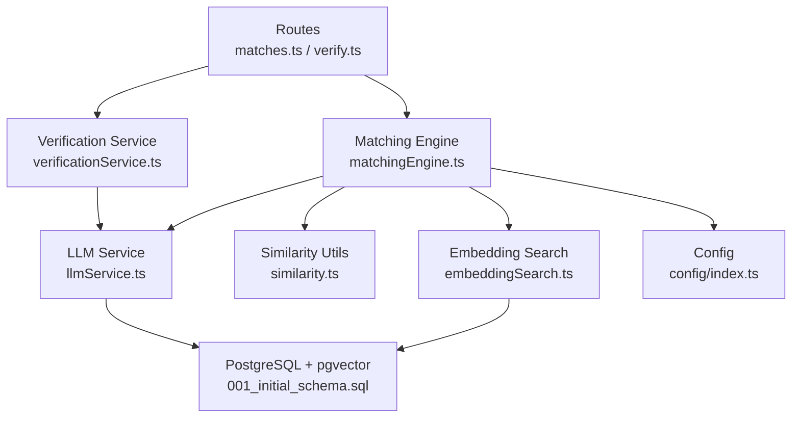
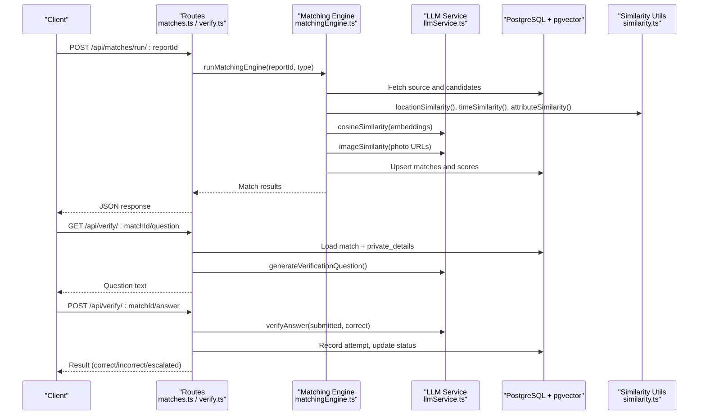
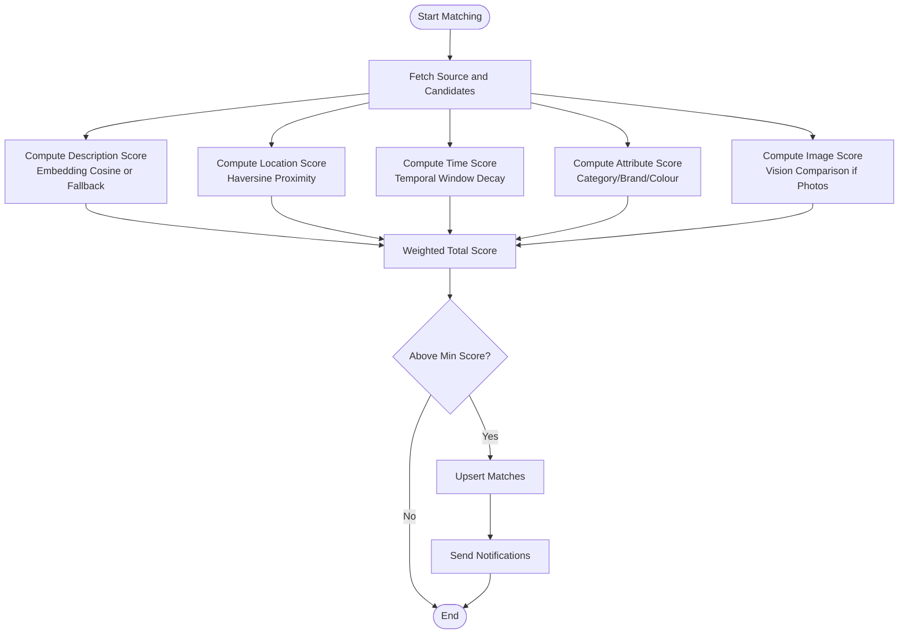
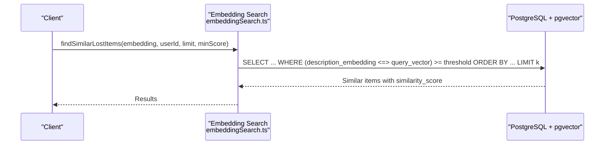
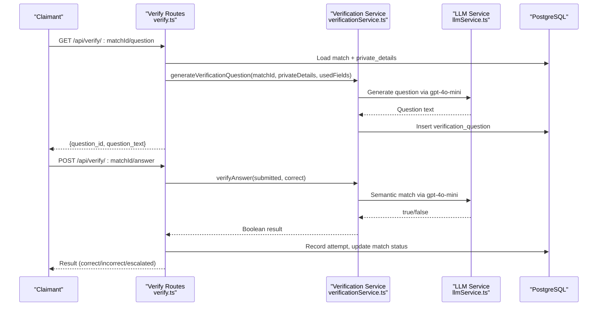
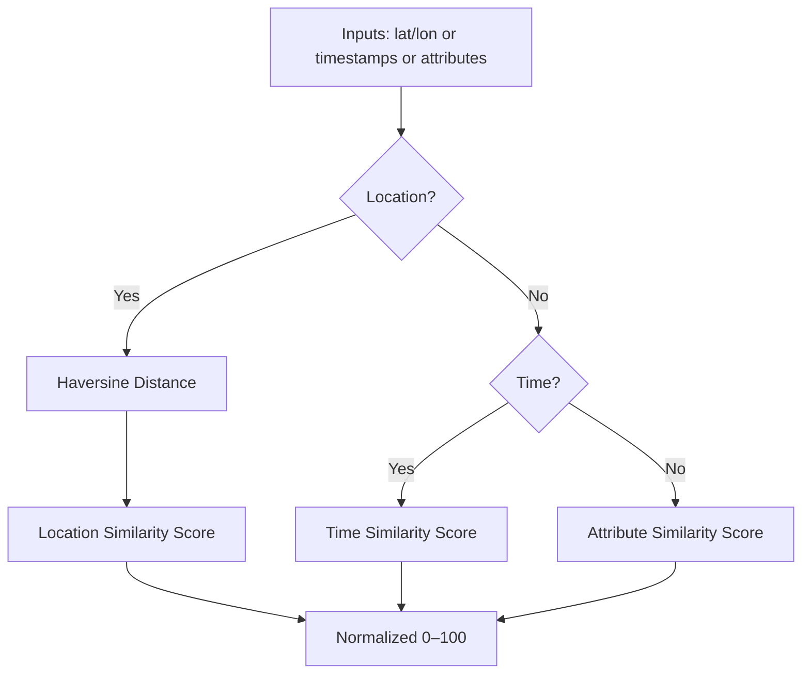
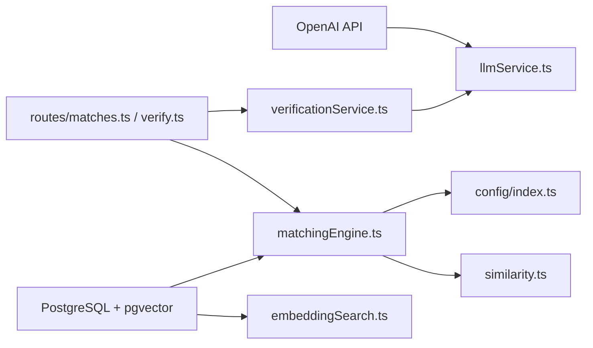

# AI & Machine Learning

<cite>
**Referenced Files in This Document**
- [matchingEngine.ts](file://backend/src/services/matchingEngine.ts)
- [embeddingSearch.ts](file://backend/src/services/embeddingSearch.ts)
- [llmService.ts](file://backend/src/services/llmService.ts)
- [verificationService.ts](file://backend/src/services/verificationService.ts)
- [similarity.ts](file://backend/src/utils/similarity.ts)
- [config/index.ts](file://backend/src/config/index.ts)
- [001_initial_schema.sql](file://supabase/migrations/001_initial_schema.sql)
- [matches.ts](file://backend/src/routes/matches.ts)
- [verify.ts](file://backend/src/routes/verify.ts)
- [matching.test.ts](file://backend/tests/matching.test.ts)
- [similarity.test.ts](file://backend/tests/similarity.test.ts)
</cite>

## Table of Contents
1. [Introduction](#introduction)
2. [Project Structure](#project-structure)
3. [Core Components](#core-components)
4. [Architecture Overview](#architecture-overview)
5. [Detailed Component Analysis](#detailed-component-analysis)
6. [Dependency Analysis](#dependency-analysis)
7. [Performance Considerations](#performance-considerations)
8. [Troubleshooting Guide](#troubleshooting-guide)
9. [Conclusion](#conclusion)
10. [Appendices](#appendices)

## Introduction
This document explains the AI and machine learning components of the Lost & Found AI Matcher. It covers the multi-dimensional matching algorithm that combines:
- Text embedding similarity using OpenAI text-embedding-3-small
- Image comparison via GPT-4o vision model
- Location proximity calculation using the Haversine formula
- Temporal decay weighting for time proximity
- Attribute matching across category, brand, and colour
It also documents vector similarity search with pgvector for semantic text matching, verification question generation using LLMs, and semantic answer validation. Model selection rationale, performance considerations, fallback mechanisms, cost optimization, rate limiting strategies, and monitoring guidance are included.

## Project Structure
The AI/ML logic is implemented in backend services and utilities, orchestrated by routes and persisted in a PostgreSQL database with pgvector. Key files:
- Matching engine orchestrates scoring and persistence
- Embedding search uses pgvector for fast semantic retrieval
- LLM service provides embeddings, image similarity, and structured extraction
- Verification service generates questions and validates answers
- Similarity utilities implement location, time, and attribute scoring
- Configuration centralizes weights and thresholds
- Database schema defines tables, indexes, and functions

**Diagram sources**
- [matches.ts:15-45](file://backend/src/routes/matches.ts#L15-L45)
- [verify.ts:20-79](file://backend/src/routes/verify.ts#L20-L79)
- [matchingEngine.ts:37-188](file://backend/src/services/matchingEngine.ts#L37-L188)
- [embeddingSearch.ts:30-62](file://backend/src/services/embeddingSearch.ts#L30-L62)
- [llmService.ts:9-17](file://backend/src/services/llmService.ts#L9-L17)
- [similarity.ts:4-16](file://backend/src/utils/similarity.ts#L4-L16)
- [config/index.ts:33-47](file://backend/src/config/index.ts#L33-L47)
- [001_initial_schema.sql:6-9](file://supabase/migrations/001_initial_schema.sql#L6-L9)

**Section sources**
- [matchingEngine.ts:37-188](file://backend/src/services/matchingEngine.ts#L37-L188)
- [embeddingSearch.ts:30-100](file://backend/src/services/embeddingSearch.ts#L30-L100)
- [llmService.ts:9-119](file://backend/src/services/llmService.ts#L9-L119)
- [verificationService.ts:15-122](file://backend/src/services/verificationService.ts#L15-L122)
- [similarity.ts:4-82](file://backend/src/utils/similarity.ts#L4-L82)
- [config/index.ts:33-47](file://backend/src/config/index.ts#L33-L47)
- [001_initial_schema.sql:69-140](file://supabase/migrations/001_initial_schema.sql#L69-L140)

## Core Components
- Multi-dimensional matching engine computes weighted scores from description (embeddings), images, location, time, and attributes, then persists matches and triggers notifications.
- Vector similarity search leverages pgvector to find semantically similar items directly in PostgreSQL using cosine distance.
- LLM service provides:
  - Embedding generation with text-embedding-3-small
  - Structured field extraction with gpt-4o-mini
  - Image similarity assessment with gpt-4o-mini vision
- Verification service generates natural-language verification questions from private details and validates answers using LLM-based semantic matching with fallbacks.
- Similarity utilities implement Haversine distance, location/time similarity decay, and attribute matching.

**Section sources**
- [matchingEngine.ts:37-188](file://backend/src/services/matchingEngine.ts#L37-L188)
- [embeddingSearch.ts:30-100](file://backend/src/services/embeddingSearch.ts#L30-L100)
- [llmService.ts:9-119](file://backend/src/services/llmService.ts#L9-L119)
- [verificationService.ts:15-122](file://backend/src/services/verificationService.ts#L15-L122)
- [similarity.ts:4-82](file://backend/src/utils/similarity.ts#L4-L82)

## Architecture Overview
The system integrates AI services with relational storage and vector search to match lost and found items and verify ownership through LLM-generated questions.

**Diagram sources**
- [matches.ts:15-45](file://backend/src/routes/matches.ts#L15-L45)
- [verify.ts:20-79](file://backend/src/routes/verify.ts#L20-L79)
- [matchingEngine.ts:37-188](file://backend/src/services/matchingEngine.ts#L37-L188)
- [llmService.ts:9-119](file://backend/src/services/llmService.ts#L9-L119)
- [similarity.ts:26-55](file://backend/src/utils/similarity.ts#L26-L55)
- [001_initial_schema.sql:145-179](file://supabase/migrations/001_initial_schema.sql#L145-L179)

## Detailed Component Analysis

### Multi-Dimensional Matching Algorithm
The matching engine computes five component scores and combines them into a total score:
- Description similarity (weight 0.30): cosine similarity between 1536-dim embeddings; falls back to simple word overlap if embeddings are missing
- Image similarity (weight 0.25): visual comparison via GPT-4o-mini vision when both items have photos; neutral default otherwise
- Location similarity (weight 0.20): Haversine-based proximity with linear decay beyond radius
- Time similarity (weight 0.15): temporal window overlap with linear decay beyond window
- Attribute similarity (weight 0.10): category, brand, colour matching with partial credit for substring matches

Scores are thresholded and persisted, then sorted and used to trigger notifications.

**Diagram sources**
- [matchingEngine.ts:83-147](file://backend/src/services/matchingEngine.ts#L83-L147)
- [similarity.ts:26-55](file://backend/src/utils/similarity.ts#L26-L55)
- [llmService.ts:23-41](file://backend/src/services/llmService.ts#L23-L41)
- [llmService.ts:85-119](file://backend/src/services/llmService.ts#L85-L119)

**Section sources**
- [matchingEngine.ts:37-188](file://backend/src/services/matchingEngine.ts#L37-L188)
- [config/index.ts:33-47](file://backend/src/config/index.ts#L33-L47)
- [similarity.ts:26-82](file://backend/src/utils/similarity.ts#L26-L82)
- [llmService.ts:23-41](file://backend/src/services/llmService.ts#L23-L41)
- [llmService.ts:85-119](file://backend/src/services/llmService.ts#L85-L119)

### Vector Similarity Search with pgvector
Semantic text matching is performed entirely in PostgreSQL using pgvector’s cosine distance operator. Queries filter active items, exclude the submitter, enforce minimum similarity thresholds, and order by similarity to return top-k results efficiently.

**Diagram sources**
- [embeddingSearch.ts:30-62](file://backend/src/services/embeddingSearch.ts#L30-L62)
- [001_initial_schema.sql:244-249](file://supabase/migrations/001_initial_schema.sql#L244-L249)

**Section sources**
- [embeddingSearch.ts:30-100](file://backend/src/services/embeddingSearch.ts#L30-L100)
- [001_initial_schema.sql:6-9](file://supabase/migrations/001_initial_schema.sql#L6-L9)
- [001_initial_schema.sql:244-249](file://supabase/migrations/001_initial_schema.sql#L244-L249)

### LLM Integration and Model Selection Rationale
- Embeddings: text-embedding-3-small chosen for cost-effective, high-quality dense representations at 1536 dimensions.
- Structured extraction and verification: gpt-4o-mini selected for low-latency, low-cost responses with deterministic formatting via temperature and response_format settings.
- Image similarity: gpt-4o-mini vision used to assess visual similarity based on color, shape, size, material, and distinctive features.

Fallbacks:
- If embeddings are unavailable, description similarity falls back to simple word overlap.
- If image comparison fails (e.g., invalid URLs), a neutral score is returned.
- If LLM question generation fails, a generic question is used.
- If LLM answer validation fails, a substring containment check is used.

**Section sources**
- [llmService.ts:9-17](file://backend/src/services/llmService.ts#L9-L17)
- [llmService.ts:47-79](file://backend/src/services/llmService.ts#L47-L79)
- [llmService.ts:85-119](file://backend/src/services/llmService.ts#L85-L119)
- [matchingEngine.ts:86-97](file://backend/src/services/matchingEngine.ts#L86-L97)
- [verificationService.ts:40-64](file://backend/src/services/verificationService.ts#L40-L64)
- [verificationService.ts:94-121](file://backend/src/services/verificationService.ts#L94-L121)

### Verification Question Generation and Answer Validation
- Question generation selects a private detail field (avoiding previously used fields), constructs a human-readable prompt, and asks the LLM to produce a natural-sounding question specific to that attribute.
- Answer validation first attempts exact match (case-insensitive), then uses LLM-based semantic comparison to allow minor variations. On failure, it falls back to substring inclusion checks.

**Diagram sources**
- [verify.ts:20-79](file://backend/src/routes/verify.ts#L20-L79)
- [verify.ts:89-293](file://backend/src/routes/verify.ts#L89-L293)
- [verificationService.ts:15-79](file://backend/src/services/verificationService.ts#L15-L79)
- [verificationService.ts:85-122](file://backend/src/services/verificationService.ts#L85-L122)

**Section sources**
- [verificationService.ts:15-122](file://backend/src/services/verificationService.ts#L15-L122)
- [verify.ts:20-79](file://backend/src/routes/verify.ts#L20-L79)
- [verify.ts:89-293](file://backend/src/routes/verify.ts#L89-L293)

### Similarity Utilities: Location, Time, Attributes
- Haversine distance calculates great-circle distance in kilometers.
- Location similarity maps distance to a 0–100 score with full marks within a configurable radius and linear decay up to triple radius.
- Time similarity scores items within a configurable time window with linear decay beyond the window.
- Attribute similarity compares category, brand, and colour with weighted contributions and partial credit for substring matches.

**Diagram sources**
- [similarity.ts:4-16](file://backend/src/utils/similarity.ts#L4-L16)
- [similarity.ts:26-55](file://backend/src/utils/similarity.ts#L26-L55)
- [similarity.ts:61-82](file://backend/src/utils/similarity.ts#L61-L82)

**Section sources**
- [similarity.ts:4-82](file://backend/src/utils/similarity.ts#L4-L82)

## Dependency Analysis
The AI/ML pipeline depends on:
- OpenAI API for embeddings, structured extraction, image comparison, and verification
- PostgreSQL with pgvector for efficient vector similarity search
- Express routes for request handling and orchestration
- Configuration for weights, thresholds, and service keys

**Diagram sources**
- [llmService.ts:1-4](file://backend/src/services/llmService.ts#L1-L4)
- [embeddingSearch.ts:1-2](file://backend/src/services/embeddingSearch.ts#L1-L2)
- [matchingEngine.ts:1-5](file://backend/src/services/matchingEngine.ts#L1-L5)
- [matches.ts:1-5](file://backend/src/routes/matches.ts#L1-L5)
- [verify.ts:1-8](file://backend/src/routes/verify.ts#L1-L8)
- [config/index.ts:19-21](file://backend/src/config/index.ts#L19-L21)

**Section sources**
- [llmService.ts:1-119](file://backend/src/services/llmService.ts#L1-L119)
- [embeddingSearch.ts:1-100](file://backend/src/services/embeddingSearch.ts#L1-L100)
- [matchingEngine.ts:1-208](file://backend/src/services/matchingEngine.ts#L1-L208)
- [matches.ts:1-115](file://backend/src/routes/matches.ts#L1-L115)
- [verify.ts:1-444](file://backend/src/routes/verify.ts#L1-L444)
- [config/index.ts:1-49](file://backend/src/config/index.ts#L1-L49)

## Performance Considerations
- Vector search efficiency:
  - Use pgvector’s native cosine distance operator to perform similarity calculations in-database.
  - Leverage IVFFlat indexes on description_embedding for faster approximate nearest neighbor searches.
- Scoring computation:
  - Compute expensive operations (image similarity) only when both items have photos.
  - Use lightweight fallbacks (word overlap, substring checks) when AI services fail.
- Thresholds and limits:
  - Apply minimum similarity thresholds and limits in vector queries to reduce payload sizes.
  - Configure time windows and location radii to balance recall and precision.
- Concurrency and retries:
  - The matching engine processes candidates sequentially per report; consider batching for large datasets.
  - Verification allows retries with different questions to improve success rates.

[No sources needed since this section provides general guidance]

## Troubleshooting Guide
Common issues and mitigations:
- Missing embeddings:
  - Symptom: Description similarity falls back to word overlap.
  - Action: Ensure embeddings are generated and stored for items; verify vector column population.
- Invalid image URLs:
  - Symptom: Image similarity returns neutral score.
  - Action: Validate photo URLs before calling vision model; handle errors gracefully.
- LLM failures:
  - Symptom: Question generation or answer validation errors.
  - Action: Use fallback question text and substring-based answer matching; log errors for monitoring.
- Rate limits and quotas:
  - Symptom: API throttling or quota exceeded.
  - Action: Implement retry with exponential backoff; cache embeddings where possible; monitor usage metrics.
- Database connectivity:
  - Symptom: Query failures or timeouts.
  - Action: Check connection pool configuration; ensure pgvector extension enabled; validate indexes.

**Section sources**
- [matchingEngine.ts:86-97](file://backend/src/services/matchingEngine.ts#L86-L97)
- [llmService.ts:115-119](file://backend/src/services/llmService.ts#L115-L119)
- [verificationService.ts:62-64](file://backend/src/services/verificationService.ts#L62-L64)
- [verificationService.ts:117-121](file://backend/src/services/verificationService.ts#L117-L121)
- [001_initial_schema.sql:6-9](file://supabase/migrations/001_initial_schema.sql#L6-L9)

## Conclusion
The Lost & Found AI Matcher integrates multiple AI techniques to robustly match lost and found items and verify ownership. The system balances accuracy and cost by using efficient vector search, selective AI calls, and reliable fallbacks. With configurable weights and thresholds, it adapts to operational needs while maintaining performance and reliability.

[No sources needed since this section summarizes without analyzing specific files]

## Appendices

### Example: Embedding Generation
- Input: item description text
- Model: text-embedding-3-small
- Output: 1536-dim vector stored in description_embedding
- Usage: vector similarity search via pgvector

**Section sources**
- [llmService.ts:9-17](file://backend/src/services/llmService.ts#L9-L17)
- [001_initial_schema.sql:92-92](file://supabase/migrations/001_initial_schema.sql#L92-L92)

### Example: Similarity Calculations
- Description: cosine similarity between two embeddings mapped to 0–100
- Location: Haversine distance converted to similarity score with decay
- Time: difference in hours mapped to similarity score with decay
- Attributes: weighted sum of category, brand, colour matches

**Section sources**
- [llmService.ts:23-41](file://backend/src/services/llmService.ts#L23-L41)
- [similarity.ts:4-16](file://backend/src/utils/similarity.ts#L4-L16)
- [similarity.ts:26-55](file://backend/src/utils/similarity.ts#L26-L55)
- [similarity.ts:61-82](file://backend/src/utils/similarity.ts#L61-L82)

### Example: Confidence Scoring
- Weighted total score combines description, image, location, time, and attributes
- Minimum threshold filters out weak matches
- Scores persisted for auditability and ranking

**Section sources**
- [matchingEngine.ts:125-147](file://backend/src/services/matchingEngine.ts#L125-L147)
- [config/index.ts:33-47](file://backend/src/config/index.ts#L33-L47)

### Cost Optimization, Rate Limiting, and Monitoring
- Cost optimization:
  - Prefer text-embedding-3-small for embeddings due to lower cost and adequate quality.
  - Use gpt-4o-mini for structured tasks and verification to minimize token usage.
  - Cache embeddings and reuse vectors for repeated comparisons.
- Rate limiting:
  - Implement client-side retry with exponential backoff for API calls.
  - Queue requests during peak load; batch embedding generation where feasible.
- Monitoring:
  - Log API call outcomes, latency, and error rates.
  - Track usage metrics per model and endpoint.
  - Alert on sustained failures or quota exhaustion.

[No sources needed since this section provides general guidance]