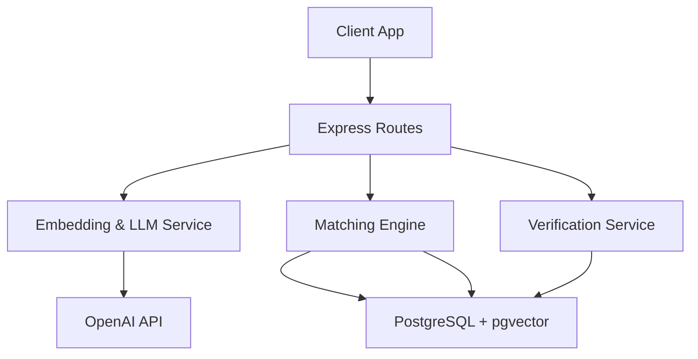
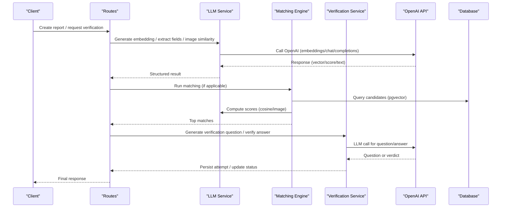
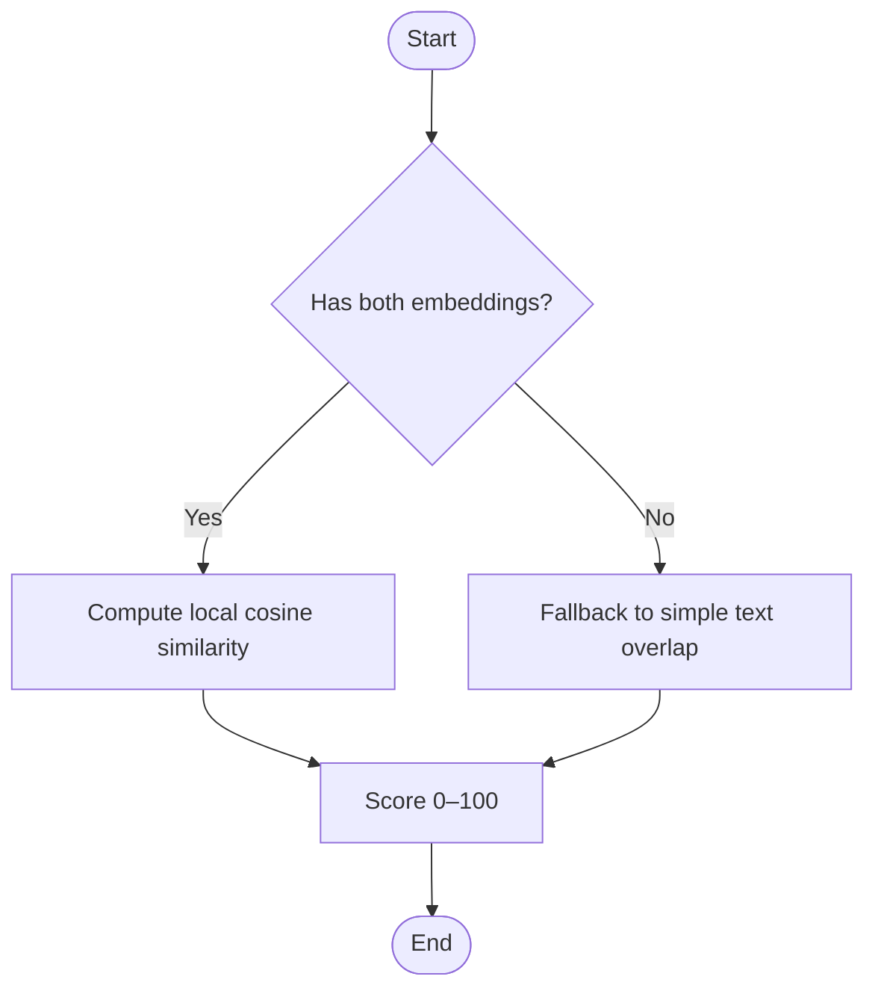
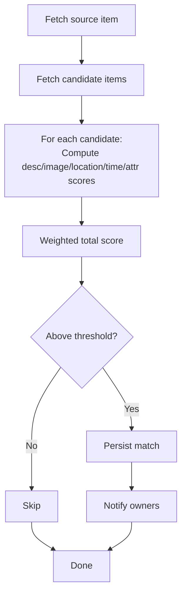
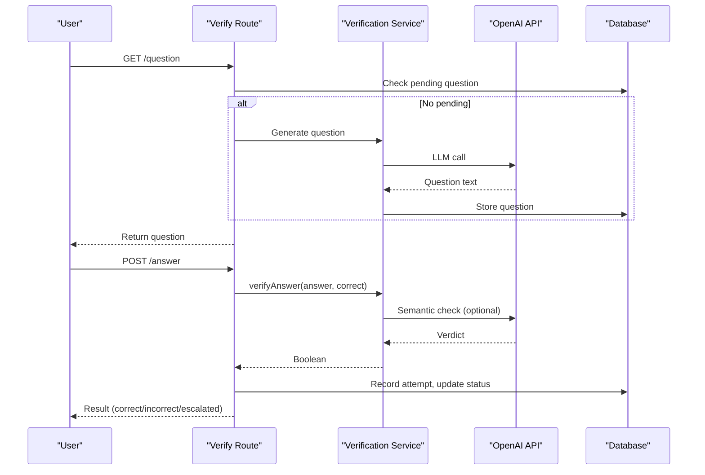
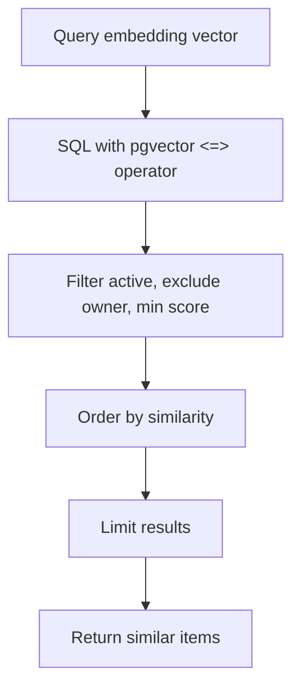
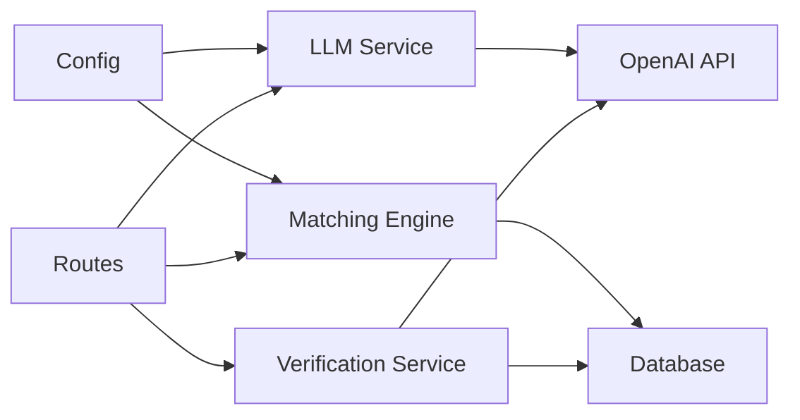

# External AI Integrations

<cite>
**Referenced Files in This Document**
- [llmService.ts](file://backend/src/services/llmService.ts)
- [embeddingSearch.ts](file://backend/src/services/embeddingSearch.ts)
- [matchingEngine.ts](file://backend/src/services/matchingEngine.ts)
- [verificationService.ts](file://backend/src/services/verificationService.ts)
- [index.ts](file://backend/src/config/index.ts)
- [verify.ts](file://backend/src/routes/verify.ts)
- [reports.ts](file://backend/src/routes/reports.ts)
- [errorHandler.ts](file://backend/src/middleware/errorHandler.ts)
- [package.json](file://backend/package.json)
- [render.yaml](file://render.yaml)
</cite>

## Table of Contents
1. [Introduction](#introduction)
2. [Project Structure](#project-structure)
3. [Core Components](#core-components)
4. [Architecture Overview](#architecture-overview)
5. [Detailed Component Analysis](#detailed-component-analysis)
6. [Dependency Analysis](#dependency-analysis)
7. [Performance Considerations](#performance-considerations)
8. [Troubleshooting Guide](#troubleshooting-guide)
9. [Conclusion](#conclusion)

## Introduction
This document explains how the backend integrates external AI services (OpenAI) for text embeddings, image analysis, and natural language processing across matching and verification flows. It covers configuration, model usage, error handling, cost optimization techniques (caching, fallbacks), API call examples, monitoring approaches, security considerations, performance tuning, timeouts, and debugging strategies.

## Project Structure
The AI integration spans several backend modules:
- Services: OpenAI calls for embeddings, vision-based image similarity, and LLM-based verification question generation and answer evaluation.
- Matching engine: orchestrates scoring using embeddings, images, location, time, and attributes.
- Routes: expose endpoints that trigger embedding generation, matching, and verification workflows.
- Configuration: centralizes environment-driven settings including OpenAI API key and matching parameters.

**Diagram sources**
- [llmService.ts:1-120](file://backend/src/services/llmService.ts#L1-L120)
- [matchingEngine.ts:1-208](file://backend/src/services/matchingEngine.ts#L1-L208)
- [verificationService.ts:1-123](file://backend/src/services/verificationService.ts#L1-L123)
- [verify.ts:1-444](file://backend/src/routes/verify.ts#L1-L444)
- [reports.ts:191-226](file://backend/src/routes/reports.ts#L191-L226)

**Section sources**
- [llmService.ts:1-120](file://backend/src/services/llmService.ts#L1-L120)
- [matchingEngine.ts:1-208](file://backend/src/services/matchingEngine.ts#L1-L208)
- [verificationService.ts:1-123](file://backend/src/services/verificationService.ts#L1-L123)
- [verify.ts:1-444](file://backend/src/routes/verify.ts#L1-L444)
- [reports.ts:191-226](file://backend/src/routes/reports.ts#L191-L226)

## Core Components
- Text embeddings: generate 1536-dim vectors using a small embedding model; cosine similarity computed locally or via pgvector.
- Image analysis: compare two item images with a vision-capable model to produce a similarity score.
- Natural language processing: extract structured fields from free-text descriptions and generate verification questions; evaluate answers semantically.
- Matching engine: combines multiple signals (description, image, location, time, attributes) into a weighted score.
- Verification flow: generates unique questions per match and evaluates claimant answers with semantic comparison.

**Section sources**
- [llmService.ts:9-17](file://backend/src/services/llmService.ts#L9-L17)
- [llmService.ts:47-79](file://backend/src/services/llmService.ts#L47-L79)
- [llmService.ts:85-119](file://backend/src/services/llmService.ts#L85-L119)
- [matchingEngine.ts:37-189](file://backend/src/services/matchingEngine.ts#L37-L189)
- [verificationService.ts:15-79](file://backend/src/services/verificationService.ts#L15-L79)
- [verificationService.ts:85-123](file://backend/src/services/verificationService.ts#L85-L123)

## Architecture Overview
The system uses OpenAI for three primary tasks:
- Embeddings for semantic search and description similarity.
- Vision-based image similarity for visual matching.
- LLM-based question generation and answer verification.

**Diagram sources**
- [llmService.ts:9-17](file://backend/src/services/llmService.ts#L9-L17)
- [llmService.ts:85-119](file://backend/src/services/llmService.ts#L85-L119)
- [matchingEngine.ts:37-189](file://backend/src/services/matchingEngine.ts#L37-L189)
- [verificationService.ts:15-79](file://backend/src/services/verificationService.ts#L15-L79)
- [verificationService.ts:85-123](file://backend/src/services/verificationService.ts#L85-L123)
- [verify.ts:20-79](file://backend/src/routes/verify.ts#L20-L79)
- [verify.ts:89-293](file://backend/src/routes/verify.ts#L89-L293)

## Detailed Component Analysis

### OpenAI Integration Layer
- Embeddings:
  - Uses a small embedding model to produce fixed-length vectors for semantic similarity.
  - Cosine similarity is implemented locally for quick comparisons when both embeddings are available.
- Structured extraction:
  - Extracts category, brand, and color from free-text descriptions using a chat model configured to return JSON.
- Image similarity:
  - Compares two image URLs using a vision-enabled model and returns a normalized similarity score.
- Error handling:
  - Image similarity gracefully falls back to a neutral score if the API fails or inputs are invalid.

**Diagram sources**
- [llmService.ts:9-17](file://backend/src/services/llmService.ts#L9-L17)
- [llmService.ts:23-41](file://backend/src/services/llmService.ts#L23-L41)
- [matchingEngine.ts:83-97](file://backend/src/services/matchingEngine.ts#L83-L97)

**Section sources**
- [llmService.ts:9-17](file://backend/src/services/llmService.ts#L9-L17)
- [llmService.ts:23-41](file://backend/src/services/llmService.ts#L23-L41)
- [llmService.ts:47-79](file://backend/src/services/llmService.ts#L47-L79)
- [llmService.ts:85-119](file://backend/src/services/llmService.ts#L85-L119)

### Matching Engine
- Combines five signals with configurable weights:
  - Description similarity (embedding cosine or text fallback).
  - Image similarity (vision model when both items have photos).
  - Location similarity (Haversine proximity).
  - Time similarity (time-window overlap).
  - Attribute similarity (category/color/brand).
- Persists matches above a threshold and triggers notifications.

**Diagram sources**
- [matchingEngine.ts:37-189](file://backend/src/services/matchingEngine.ts#L37-L189)
- [config/index.ts:33-47](file://backend/src/config/index.ts#L33-L47)

**Section sources**
- [matchingEngine.ts:37-189](file://backend/src/services/matchingEngine.ts#L37-L189)
- [config/index.ts:33-47](file://backend/src/config/index.ts#L33-L47)

### Verification Service
- Generates unique verification questions based on private details, preferring unused fields to diversify retries.
- Evaluates answers with exact match first, then semantic comparison via LLM; falls back to substring checks on failure.
- Routes enforce retry limits and escalate to admin when exhausted.

**Diagram sources**
- [verify.ts:20-79](file://backend/src/routes/verify.ts#L20-L79)
- [verify.ts:89-293](file://backend/src/routes/verify.ts#L89-L293)
- [verificationService.ts:15-79](file://backend/src/services/verificationService.ts#L15-L79)
- [verificationService.ts:85-123](file://backend/src/services/verificationService.ts#L85-L123)

**Section sources**
- [verificationService.ts:15-79](file://backend/src/services/verificationService.ts#L15-L79)
- [verificationService.ts:85-123](file://backend/src/services/verificationService.ts#L85-L123)
- [verify.ts:20-79](file://backend/src/routes/verify.ts#L20-L79)
- [verify.ts:89-293](file://backend/src/routes/verify.ts#L89-L293)

### Embedding Search
- Uses PostgreSQL’s pgvector to compute cosine similarity directly in SQL for efficient retrieval of similar lost/found items.
- Filters by active status, excludes owner’s own items, and applies minimum similarity thresholds.

**Diagram sources**
- [embeddingSearch.ts:30-62](file://backend/src/services/embeddingSearch.ts#L30-L62)
- [embeddingSearch.ts:68-100](file://backend/src/services/embeddingSearch.ts#L68-L100)

**Section sources**
- [embeddingSearch.ts:30-62](file://backend/src/services/embeddingSearch.ts#L30-L62)
- [embeddingSearch.ts:68-100](file://backend/src/services/embeddingSearch.ts#L68-L100)

## Dependency Analysis
- OpenAI client initialization reads the API key from centralized configuration.
- Matching engine depends on:
  - Database pool for data access.
  - Similarity utilities for location/time/attributes.
  - LLM service for embeddings and image similarity.
- Verification routes depend on verification service and database for state transitions.

**Diagram sources**
- [index.ts:19-21](file://backend/src/config/index.ts#L19-L21)
- [llmService.ts:1-4](file://backend/src/services/llmService.ts#L1-L4)
- [matchingEngine.ts:1-5](file://backend/src/services/matchingEngine.ts#L1-L5)
- [verificationService.ts:1-5](file://backend/src/services/verificationService.ts#L1-L5)
- [verify.ts:1-8](file://backend/src/routes/verify.ts#L1-L8)

**Section sources**
- [index.ts:19-21](file://backend/src/config/index.ts#L19-L21)
- [llmService.ts:1-4](file://backend/src/services/llmService.ts#L1-L4)
- [matchingEngine.ts:1-5](file://backend/src/services/matchingEngine.ts#L1-L5)
- [verificationService.ts:1-5](file://backend/src/services/verificationService.ts#L1-L5)
- [verify.ts:1-8](file://backend/src/routes/verify.ts#L1-L8)

## Performance Considerations
- Cost optimization:
  - Use a small embedding model for high-volume vector generation to reduce costs.
  - Prefer local cosine similarity when both embeddings exist to avoid extra LLM calls.
  - Image similarity is only invoked when both items have photos, limiting expensive vision calls.
  - Verification uses exact match first and falls back to LLM only when needed.
- Batch processing:
  - Embedding generation occurs per report creation; consider batching at ingestion time if reports are submitted in bulk.
  - Matching runs per report; batch re-runs can be scheduled for off-peak hours.
- Caching strategies:
  - Cache embeddings per description to avoid repeated OpenAI calls for identical text.
  - Cache image similarity results keyed by image URL pairs to reuse scores.
  - Cache verification questions per field to avoid regenerating identical prompts.
- Rate limiting strategies:
  - The project includes express-rate-limit in dependencies; apply rate limits around AI-heavy endpoints to protect against bursts and control costs.
  - Implement client-side retries with exponential backoff for transient errors.
- Timeouts and resilience:
  - Add explicit timeouts for OpenAI requests to prevent hanging connections.
  - Wrap LLM calls with try/catch and provide graceful fallbacks (e.g., neutral scores, simple text similarity).
- Monitoring:
  - Log OpenAI request metadata (model, tokens used, latency) and errors for observability.
  - Track success/failure rates per endpoint and per model to detect degradation.
  - Alert on sustained failures or elevated error rates.

[No sources needed since this section provides general guidance]

## Troubleshooting Guide
- Common issues:
  - Missing or invalid OPENAI_API_KEY: ensure it is set in environment variables and loaded by configuration.
  - Network errors or rate limits: implement retries with backoff and monitor rate limit headers.
  - Invalid image URLs: imageSimilarity returns a neutral score on failure; validate URLs before calling.
  - Parsing errors from LLM responses: ensure response_format constraints and handle malformed JSON gracefully.
- Debugging tools:
  - Enable HTTP logging (e.g., morgan) to trace requests and responses.
  - Add structured logs around OpenAI calls with correlation IDs.
  - Use unit tests for similarity functions to validate behavior under edge cases.
- Error handling:
  - Centralized error handler normalizes errors and returns consistent JSON.
  - Non-fatal AI failures should not block core flows; use fallbacks to maintain availability.

**Section sources**
- [errorHandler.ts:1-56](file://backend/src/middleware/errorHandler.ts#L1-L56)
- [llmService.ts:85-119](file://backend/src/services/llmService.ts#L85-L119)
- [verificationService.ts:62-64](file://backend/src/services/verificationService.ts#L62-L64)
- [verificationService.ts:117-121](file://backend/src/services/verificationService.ts#L117-L121)

## Conclusion
The backend integrates OpenAI for embeddings, vision-based image comparison, and NLP-driven verification. It emphasizes robust fallbacks, efficient database-backed similarity search, and clear separation of concerns between services and routes. To further improve reliability and cost efficiency, adopt caching, explicit timeouts, rate limiting, and comprehensive monitoring. Security best practices include secure API key management, input validation, and minimizing exposure of sensitive data.