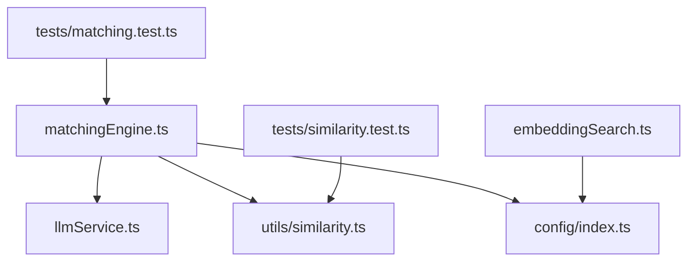
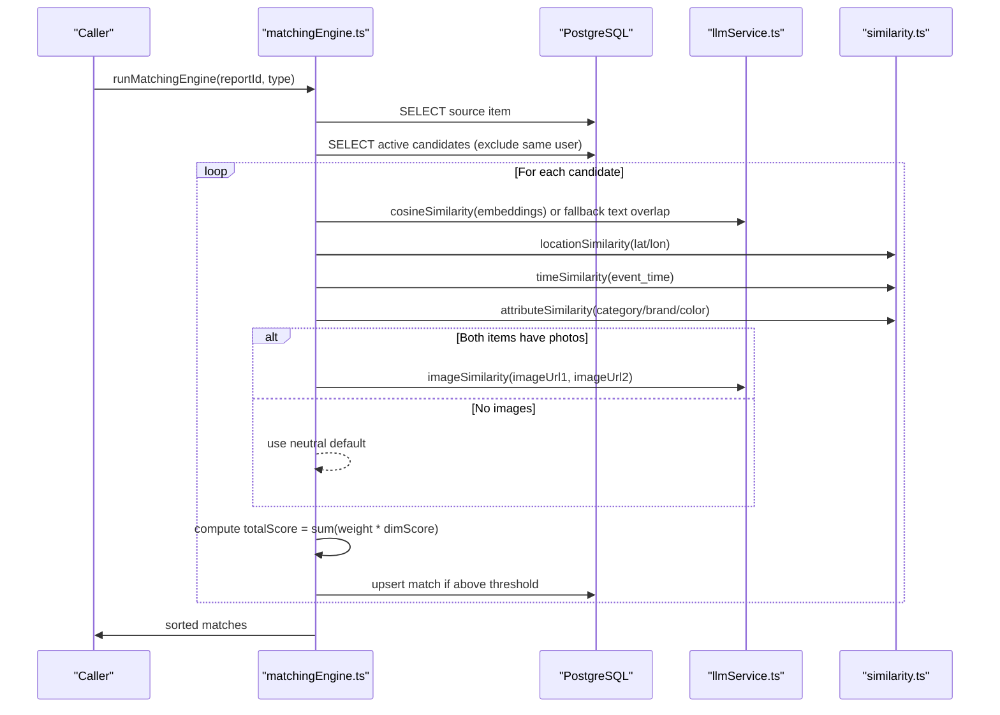
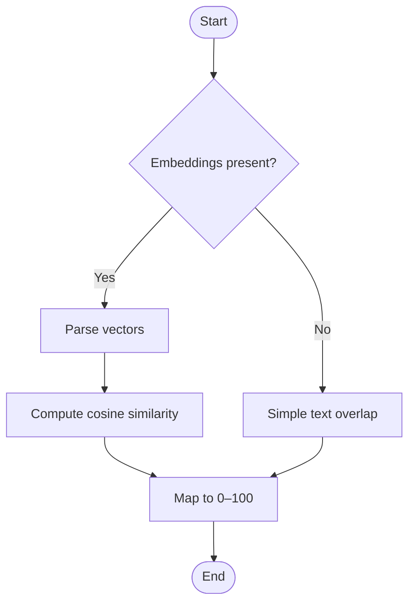
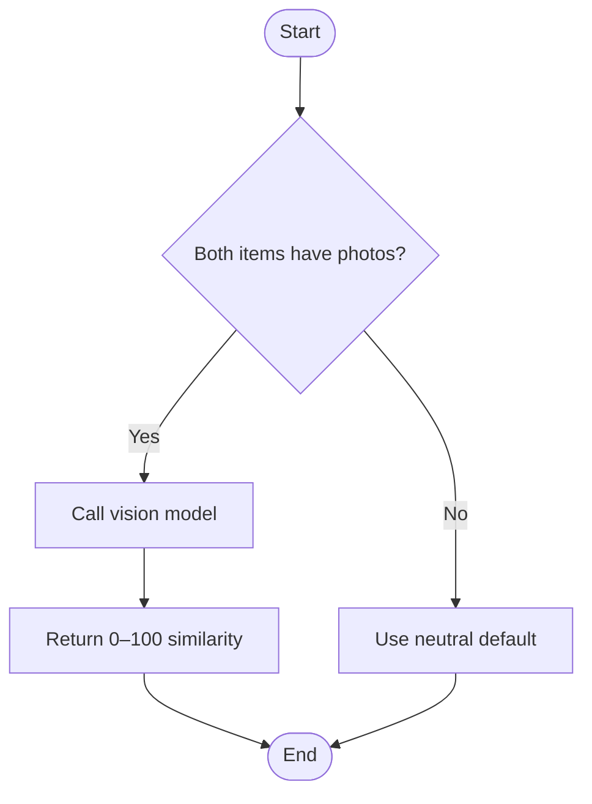
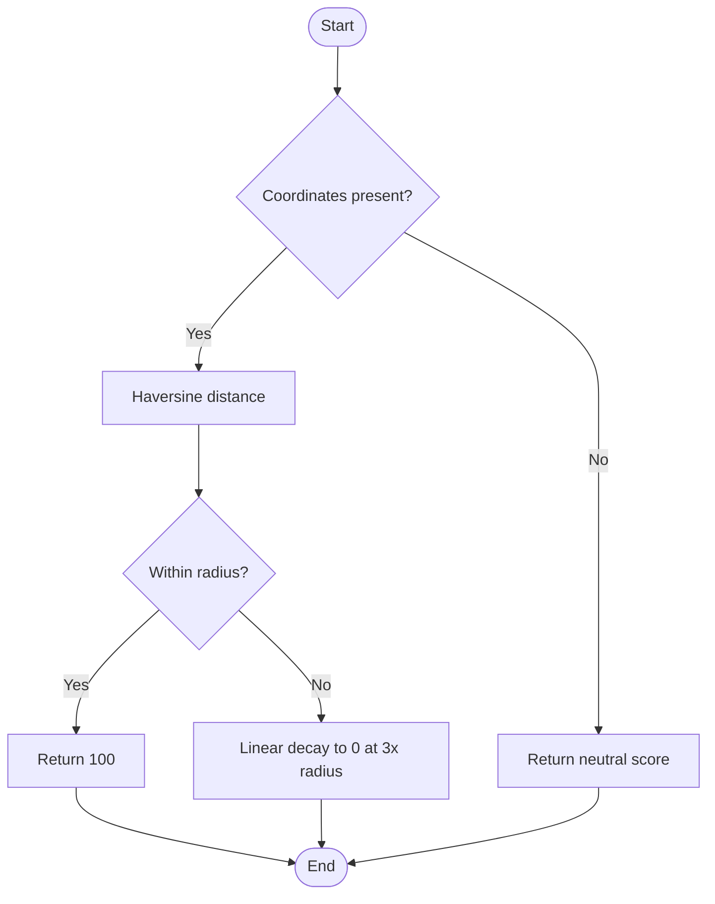
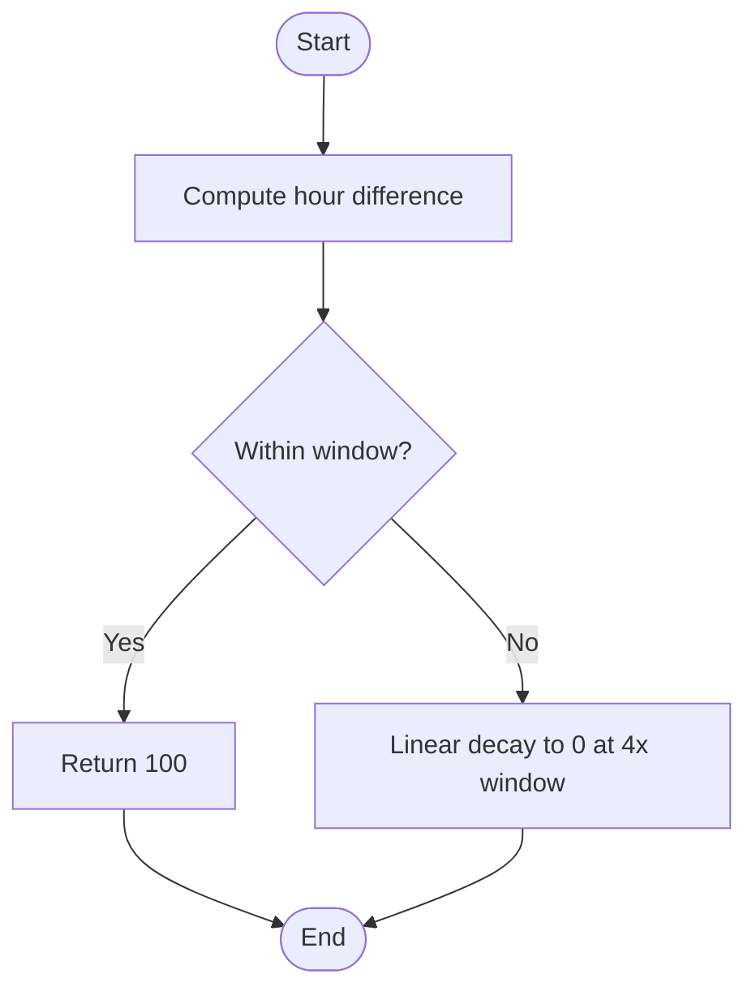
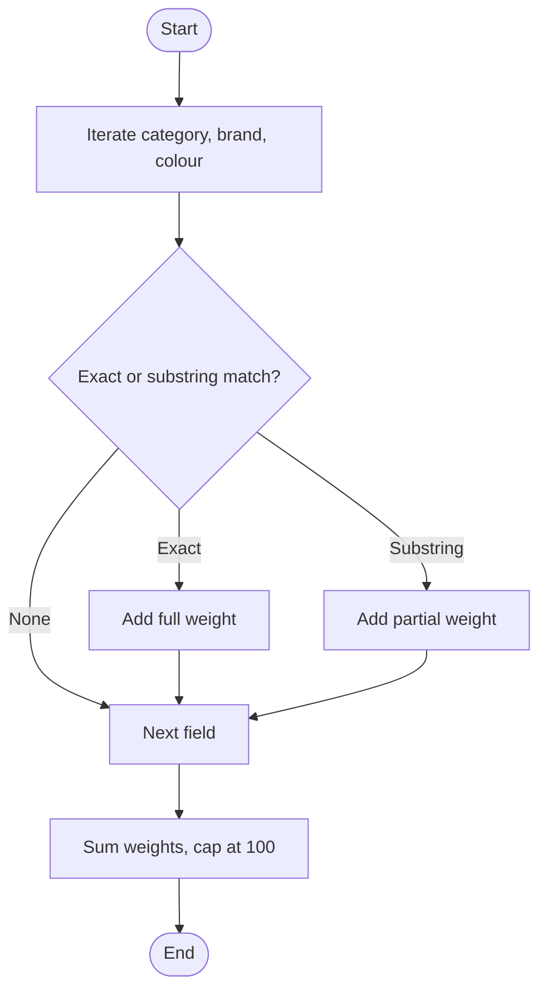
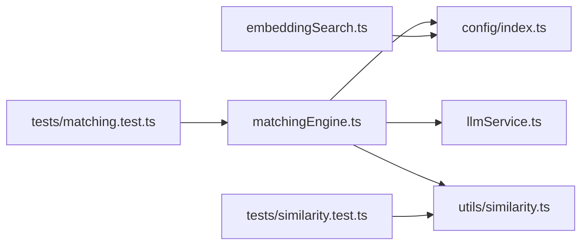

# Matching Algorithm

<cite>
**Referenced Files in This Document**
- [matchingEngine.ts](file://backend/src/services/matchingEngine.ts)
- [similarity.ts](file://backend/src/utils/similarity.ts)
- [llmService.ts](file://backend/src/services/llmService.ts)
- [embeddingSearch.ts](file://backend/src/services/embeddingSearch.ts)
- [config/index.ts](file://backend/src/config/index.ts)
- [matching.test.ts](file://backend/tests/matching.test.ts)
- [similarity.test.ts](file://backend/tests/similarity.test.ts)
</cite>

## Table of Contents
1. [Introduction](#introduction)
2. [Project Structure](#project-structure)
3. [Core Components](#core-components)
4. [Architecture Overview](#architecture-overview)
5. [Detailed Component Analysis](#detailed-component-analysis)
6. [Dependency Analysis](#dependency-analysis)
7. [Performance Considerations](#performance-considerations)
8. [Troubleshooting Guide](#troubleshooting-guide)
9. [Conclusion](#conclusion)
10. [Appendices](#appendices)

## Introduction
This document explains the multi-dimensional matching algorithm that powers the Lost & Found AI Matcher. The system scores candidate pairs across five dimensions: description similarity, image comparison, location proximity, temporal decay, and attribute matching. Each dimension contributes a weighted score to produce a final match score. The engine includes robust fallbacks when AI services are unavailable and handles missing data gracefully while preserving user privacy by excluding same-user comparisons.

## Project Structure
The matching logic is implemented in the backend service layer with supporting utilities and configuration:
- Matching orchestration and scoring live in the matching engine service.
- Similarity functions for location, time, and attributes are centralized in a utility module.
- LLM-based capabilities (embeddings, vision comparison, structured extraction) are encapsulated in an LLM service.
- Embedding search leverages PostgreSQL vector operations for efficient retrieval.
- Configuration centralizes weights, thresholds, and operational parameters.

**Diagram sources**
- [matchingEngine.ts:37-188](file://backend/src/services/matchingEngine.ts#L37-L188)
- [llmService.ts:9-119](file://backend/src/services/llmService.ts#L9-L119)
- [similarity.ts:4-82](file://backend/src/utils/similarity.ts#L4-L82)
- [embeddingSearch.ts:30-100](file://backend/src/services/embeddingSearch.ts#L30-L100)
- [config/index.ts:33-47](file://backend/src/config/index.ts#L33-L47)
- [matching.test.ts:68-197](file://backend/tests/matching.test.ts#L68-L197)
- [similarity.test.ts:9-161](file://backend/tests/similarity.test.ts#L9-L161)

**Section sources**
- [matchingEngine.ts:37-188](file://backend/src/services/matchingEngine.ts#L37-L188)
- [config/index.ts:33-47](file://backend/src/config/index.ts#L33-L47)

## Core Components
- Weighted scoring engine: orchestrates fetching items, computing per-dimension scores, applying weights, thresholding, persisting matches, and notifying users.
- Similarity utilities: Haversine distance, location similarity, time similarity, and attribute similarity.
- LLM services: text embeddings via OpenAI, cosine similarity computation, image similarity via vision model, and structured field extraction.
- Embedding search: vector-based similarity queries using pgvector operators in PostgreSQL.
- Configuration: weights, thresholds, radius, and time windows.

Key responsibilities:
- Description similarity uses embeddings when available; otherwise falls back to simple text overlap.
- Image similarity uses a vision model when both items have photos; otherwise defaults to neutral.
- Location similarity uses Haversine with configurable radius and linear decay.
- Temporal similarity applies a time window with linear decay beyond the window.
- Attribute similarity compares category, brand, and color with partial credit for substring matches.

**Section sources**
- [matchingEngine.ts:83-146](file://backend/src/services/matchingEngine.ts#L83-L146)
- [similarity.ts:26-82](file://backend/src/utils/similarity.ts#L26-L82)
- [llmService.ts:9-119](file://backend/src/services/llmService.ts#L9-L119)
- [embeddingSearch.ts:30-100](file://backend/src/services/embeddingSearch.ts#L30-L100)
- [config/index.ts:33-47](file://backend/src/config/index.ts#L33-L47)

## Architecture Overview
The matching engine runs end-to-end for a given report ID and type (lost or found), retrieving the source item and all active candidates from the opposite table while excluding the same user. It computes five dimension scores, aggregates them with configured weights, filters by threshold, persists results, and sends notifications.

**Diagram sources**
- [matchingEngine.ts:37-188](file://backend/src/services/matchingEngine.ts#L37-L188)
- [llmService.ts:23-119](file://backend/src/services/llmService.ts#L23-L119)
- [similarity.ts:26-82](file://backend/src/utils/similarity.ts#L26-L82)

## Detailed Component Analysis

### Weighted Scoring System
- Dimensions and weights:
  - Description similarity: 30% weight using embedding cosine similarity when available; fallback to simple text overlap otherwise.
  - Image comparison: 25% weight via vision model when both items have photos; neutral default otherwise.
  - Location proximity: 20% weight using Haversine distance converted to a 0–100 similarity score with linear decay.
  - Temporal decay weighting: 15% weight based on time-window overlap with linear decay outside the window.
  - Attribute matching: 10% weight for category, brand, and color with partial credit for substring matches.
- Aggregation:
  - Total score is computed as the weighted sum of dimension scores, rounded to an integer percentage.
  - Only matches at or above the configured minimum threshold are persisted and surfaced.

Implementation highlights:
- Embeddings are parsed from pgvector string representation and compared via cosine similarity.
- When embeddings are missing or parsing fails, a simple word-overlap similarity is used.
- Image similarity returns a neutral value when either photo is missing or the API call fails.
- Location and time similarities return neutral values when inputs are missing or far apart.

**Section sources**
- [matchingEngine.ts:83-146](file://backend/src/services/matchingEngine.ts#L83-L146)
- [config/index.ts:33-47](file://backend/src/config/index.ts#L33-L47)
- [llmService.ts:23-41](file://backend/src/services/llmService.ts#L23-L41)
- [llmService.ts:85-119](file://backend/src/services/llmService.ts#L85-L119)
- [similarity.ts:26-55](file://backend/src/utils/similarity.ts#L26-L55)
- [similarity.ts:61-82](file://backend/src/utils/similarity.ts#L61-L82)

### Description Similarity (Embeddings + Fallback)
- Primary path:
  - Uses precomputed description embeddings stored in the database.
  - Computes cosine similarity between two vectors and maps to a 0–100 score.
- Fallback path:
  - If embeddings are absent or parsing fails, calculates word-overlap similarity between descriptions.
- Vector search alternative:
  - For fast retrieval, embeddingSearch performs vector similarity queries directly in PostgreSQL using pgvector operators.

**Diagram sources**
- [matchingEngine.ts:83-97](file://backend/src/services/matchingEngine.ts#L83-L97)
- [llmService.ts:23-41](file://backend/src/services/llmService.ts#L23-L41)
- [embeddingSearch.ts:30-62](file://backend/src/services/embeddingSearch.ts#L30-L62)

**Section sources**
- [matchingEngine.ts:83-97](file://backend/src/services/matchingEngine.ts#L83-L97)
- [llmService.ts:23-41](file://backend/src/services/llmService.ts#L23-L41)
- [embeddingSearch.ts:30-62](file://backend/src/services/embeddingSearch.ts#L30-L62)

### Image Comparison (Vision Model)
- When both items have photos, the vision model evaluates visual similarity and returns a 0–100 score.
- If either photo is missing or the API call fails, a neutral score is used so the overall result remains balanced.

**Diagram sources**
- [matchingEngine.ts:119-123](file://backend/src/services/matchingEngine.ts#L119-L123)
- [llmService.ts:85-119](file://backend/src/services/llmService.ts#L85-L119)

**Section sources**
- [matchingEngine.ts:119-123](file://backend/src/services/matchingEngine.ts#L119-L123)
- [llmService.ts:85-119](file://backend/src/services/llmService.ts#L85-L119)

### Location Proximity (Haversine Formula)
- Computes great-circle distance in kilometers between two coordinates.
- Converts distance to a 0–100 similarity score:
  - Full score within the configured radius.
  - Linear decay to zero at three times the radius.
  - Neutral score when coordinates are missing.

**Diagram sources**
- [similarity.ts:4-38](file://backend/src/utils/similarity.ts#L4-L38)

**Section sources**
- [similarity.ts:4-38](file://backend/src/utils/similarity.ts#L4-L38)

### Temporal Decay Weighting (Time Window)
- Calculates absolute difference in hours between event timestamps.
- Returns full score within the configured time window.
- Applies linear decay to zero at four times the window.
- Accepts Date objects or ISO strings.

**Diagram sources**
- [similarity.ts:43-55](file://backend/src/utils/similarity.ts#L43-L55)

**Section sources**
- [similarity.ts:43-55](file://backend/src/utils/similarity.ts#L43-L55)

### Attribute Matching (Category, Brand, Color)
- Compares normalized fields with case-insensitive trimming.
- Exact matches receive full credit; substring matches receive partial credit.
- Missing fields are ignored without penalizing the other side.

**Diagram sources**
- [similarity.ts:61-82](file://backend/src/utils/similarity.ts#L61-L82)

**Section sources**
- [similarity.ts:61-82](file://backend/src/utils/similarity.ts#L61-L82)

### Fallback Mechanisms
- Description similarity:
  - If embeddings are missing or parsing fails, uses simple word-overlap similarity.
- Image similarity:
  - If either photo is missing or the API call fails, uses a neutral default score.
- Location/time:
  - Missing coordinates or extreme distances yield neutral or zero scores respectively.
- These fallbacks ensure the system remains functional even when AI services are unavailable or data is incomplete.

**Section sources**
- [matchingEngine.ts:83-97](file://backend/src/services/matchingEngine.ts#L83-L97)
- [matchingEngine.ts:119-123](file://backend/src/services/matchingEngine.ts#L119-L123)
- [similarity.ts:26-38](file://backend/src/utils/similarity.ts#L26-L38)
- [similarity.ts:43-55](file://backend/src/utils/similarity.ts#L43-L55)
- [llmService.ts:85-119](file://backend/src/services/llmService.ts#L85-L119)

### Edge Cases and Privacy
- Missing data:
  - Null coordinates return neutral location scores.
  - Missing embeddings trigger text overlap fallback.
  - Missing photos skip vision comparison and use neutral default.
- Different item types:
  - The engine compares lost vs found items bidirectionally by selecting appropriate tables and time fields.
- User privacy:
  - Candidates exclude items owned by the same user to prevent self-matches.
- Thresholding:
  - Only matches meeting the minimum threshold are persisted and surfaced.

**Section sources**
- [matchingEngine.ts:63-74](file://backend/src/services/matchingEngine.ts#L63-L74)
- [matchingEngine.ts:134-146](file://backend/src/services/matchingEngine.ts#L134-L146)
- [similarity.ts:26-38](file://backend/src/utils/similarity.ts#L26-L38)
- [llmService.ts:85-119](file://backend/src/services/llmService.ts#L85-L119)

## Dependency Analysis
The matching engine depends on:
- Database pool for reading items and persisting matches.
- LLM service for embeddings, cosine similarity, and image comparison.
- Similarity utilities for location, time, and attribute scoring.
- Configuration for weights, thresholds, and operational parameters.

**Diagram sources**
- [matchingEngine.ts:1-5](file://backend/src/services/matchingEngine.ts#L1-L5)
- [llmService.ts:1-4](file://backend/src/services/llmService.ts#L1-L4)
- [similarity.ts:1-3](file://backend/src/utils/similarity.ts#L1-L3)
- [embeddingSearch.ts:1-2](file://backend/src/services/embeddingSearch.ts#L1-L2)
- [config/index.ts:1-4](file://backend/src/config/index.ts#L1-L4)
- [matching.test.ts:1-34](file://backend/tests/matching.test.ts#L1-L34)
- [similarity.test.ts:1-7](file://backend/tests/similarity.test.ts#L1-L7)

**Section sources**
- [matchingEngine.ts:1-5](file://backend/src/services/matchingEngine.ts#L1-L5)
- [llmService.ts:1-4](file://backend/src/services/llmService.ts#L1-L4)
- [similarity.ts:1-3](file://backend/src/utils/similarity.ts#L1-L3)
- [embeddingSearch.ts:1-2](file://backend/src/services/embeddingSearch.ts#L1-L2)
- [config/index.ts:1-4](file://backend/src/config/index.ts#L1-L4)

## Performance Considerations
- Vector search optimization:
  - Use pgvector operators to perform cosine similarity entirely in PostgreSQL, minimizing data transfer and leveraging indexes.
- Embedding reuse:
  - Precompute and store embeddings to avoid repeated API calls during matching.
- Batch processing:
  - Process multiple candidates in loops and minimize round-trips to the database.
- Threshold tuning:
  - Adjust minScoreThreshold to reduce I/O and downstream processing by filtering early.
- Time and location decay:
  - Configure radius and time windows to balance recall and precision based on operational needs.
- Fallback efficiency:
  - Simple text overlap avoids expensive API calls when embeddings are missing.

[No sources needed since this section provides general guidance]

## Troubleshooting Guide
Common issues and resolutions:
- Low or no matches:
  - Verify embeddings exist and are valid; check fallback behavior when embeddings are missing.
  - Ensure coordinates and timestamps are populated; missing data yields neutral scores.
  - Review minScoreThreshold and adjust if too restrictive.
- Unexpected high scores:
  - Inspect attribute matching for substring overlaps; refine normalization or thresholds.
  - Confirm time window and location radius settings align with expected geography and recency.
- AI service failures:
  - Image similarity falls back to neutral; confirm URLs are valid and accessible.
  - Embedding generation errors should be handled upstream; matching continues with fallback text similarity.

**Section sources**
- [matchingEngine.ts:83-97](file://backend/src/services/matchingEngine.ts#L83-L97)
- [matchingEngine.ts:119-123](file://backend/src/services/matchingEngine.ts#L119-L123)
- [similarity.ts:26-38](file://backend/src/utils/similarity.ts#L26-L38)
- [similarity.ts:43-55](file://backend/src/utils/similarity.ts#L43-L55)
- [llmService.ts:85-119](file://backend/src/services/llmService.ts#L85-L119)

## Conclusion
The matching algorithm combines semantic text similarity, visual comparison, geographic proximity, temporal relevance, and attribute matching into a cohesive weighted score. Robust fallbacks ensure reliability under varying conditions, while configuration allows fine-tuning for different operational contexts. The design balances accuracy, performance, and privacy, making it suitable for real-world lost-and-found scenarios.

[No sources needed since this section summarizes without analyzing specific files]

## Appendices

### Example Score Calculation
- Scenario: Two nearly identical items with strong description embeddings, close location, recent timestamps, and matching attributes.
- Expected outcome: High total score due to strong signals across dimensions.
- Reference: Tests assert high scores for similar items and lower scores for dissimilar ones.

**Section sources**
- [matching.test.ts:68-96](file://backend/tests/matching.test.ts#L68-L96)
- [matching.test.ts:98-135](file://backend/tests/matching.test.ts#L98-L135)

### Threshold Configurations
- Default minimum threshold: 40%.
- Weights: description 30%, image 25%, location 20%, time 15%, attributes 10%.
- Radius: 5 km for full location score.
- Time window: 72 hours for full time score.

**Section sources**
- [config/index.ts:33-47](file://backend/src/config/index.ts#L33-L47)

### Performance Optimization Strategies
- Prefer vector similarity queries in PostgreSQL to reduce memory usage and network overhead.
- Cache or reuse embeddings where possible.
- Tune thresholds and decay parameters to optimize recall vs precision.
- Use fallbacks to maintain functionality when AI services are down.

[No sources needed since this section provides general guidance]