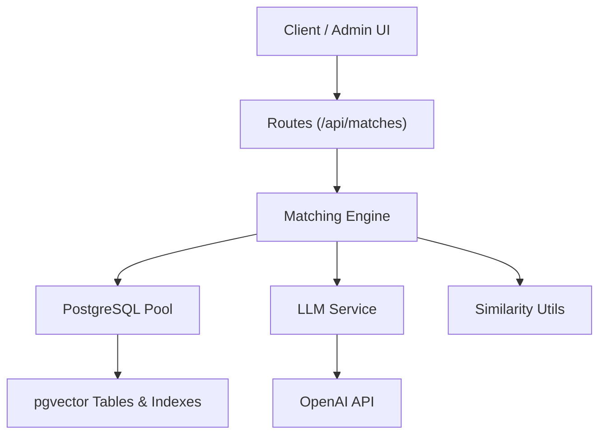
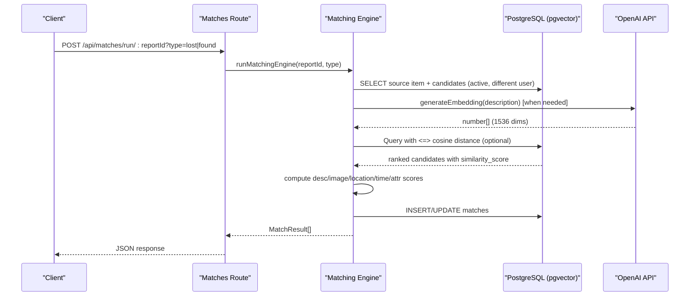
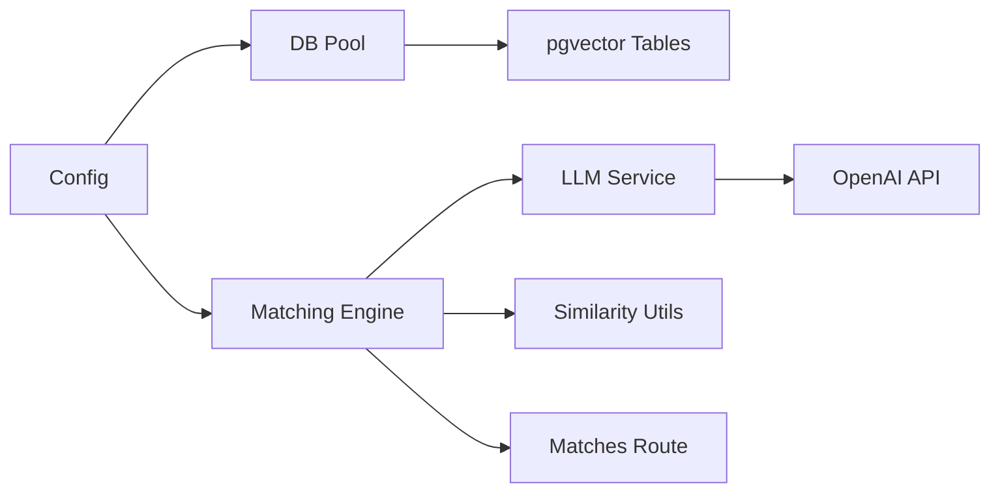

# Vector Similarity Search

<cite>
**Referenced Files in This Document**
- [embeddingSearch.ts](file://backend/src/services/embeddingSearch.ts)
- [matchingEngine.ts](file://backend/src/services/matchingEngine.ts)
- [llmService.ts](file://backend/src/services/llmService.ts)
- [similarity.ts](file://backend/src/utils/similarity.ts)
- [pool.ts](file://backend/src/db/pool.ts)
- [index.ts](file://backend/src/config/index.ts)
- [001_initial_schema.sql](file://supabase/migrations/001_initial_schema.sql)
- [matches.ts](file://backend/src/routes/matches.ts)
</cite>

## Table of Contents
1. [Introduction](#introduction)
2. [Project Structure](#project-structure)
3. [Core Components](#core-components)
4. [Architecture Overview](#architecture-overview)
5. [Detailed Component Analysis](#detailed-component-analysis)
6. [Dependency Analysis](#dependency-analysis)
7. [Performance Considerations](#performance-considerations)
8. [Troubleshooting Guide](#troubleshooting-guide)
9. [Conclusion](#conclusion)
10. [Appendices](#appendices)

## Introduction
This document explains the vector similarity search implementation for semantic text matching in the Lost & Found AI Matcher. It covers how item descriptions are converted into numerical embeddings using OpenAI’s text-embedding-3-small model, how those embeddings are stored as PostgreSQL vectors via pgvector, and how cosine similarity queries are executed to find semantically similar items. It also documents vector parsing from database strings, fallback mechanisms when vector search is unavailable, performance considerations for large datasets, and index optimization strategies.

## Project Structure
The vector similarity feature spans several modules:
- Embedding generation and cosine similarity utilities live in the LLM service.
- Database schema defines vector columns and indexes for fast similarity search.
- Matching engine orchestrates scoring across multiple signals (description embedding, image, location, time, attributes).
- A dedicated embedding search module performs direct vector similarity queries against PostgreSQL.
- Routes expose endpoints to trigger matching and retrieve results.

**Diagram sources**
- [matches.ts:15-45](file://backend/src/routes/matches.ts#L15-L45)
- [matchingEngine.ts:37-189](file://backend/src/services/matchingEngine.ts#L37-L189)
- [llmService.ts:9-17](file://backend/src/services/llmService.ts#L9-L17)
- [pool.ts:28-48](file://backend/src/db/pool.ts#L28-L48)
- [001_initial_schema.sql:68-140](file://supabase/migrations/001_initial_schema.sql#L68-L140)

**Section sources**
- [matches.ts:15-45](file://backend/src/routes/matches.ts#L15-L45)
- [matchingEngine.ts:37-189](file://backend/src/services/matchingEngine.ts#L37-L189)
- [llmService.ts:9-17](file://backend/src/services/llmService.ts#L9-L17)
- [pool.ts:28-48](file://backend/src/db/pool.ts#L28-L48)
- [001_initial_schema.sql:68-140](file://supabase/migrations/001_initial_schema.sql#L68-L140)

## Core Components
- Embedding generation: Converts free-text descriptions into 1536-dimensional vectors using OpenAI’s text-embedding-3-small model.
- Vector storage: Stores embeddings in PostgreSQL vector columns with pgvector extension enabled.
- Cosine similarity query: Uses pgvector’s native cosine distance operator to rank items by semantic similarity directly in the database.
- Matching engine: Combines description embedding similarity with image, location, time, and attribute similarities into a weighted score.
- Fallback logic: When embeddings are missing or parsing fails, the engine falls back to simple text overlap similarity.

Key responsibilities:
- Generate embeddings and store them per item.
- Execute efficient vector similarity searches.
- Parse vector strings returned from PostgreSQL into arrays for in-memory calculations.
- Compute multi-signal scores and persist matches.

**Section sources**
- [llmService.ts:9-17](file://backend/src/services/llmService.ts#L9-L17)
- [001_initial_schema.sql:92-92](file://supabase/migrations/001_initial_schema.sql#L92-L92)
- [001_initial_schema.sql:130-130](file://supabase/migrations/001_initial_schema.sql#L130-L130)
- [embeddingSearch.ts:30-62](file://backend/src/services/embeddingSearch.ts#L30-L62)
- [matchingEngine.ts:83-97](file://backend/src/services/matchingEngine.ts#L83-L97)

## Architecture Overview
The system integrates three layers:
- Data layer: PostgreSQL with pgvector stores embeddings and provides vector operators and indexes.
- Service layer: Matching engine coordinates retrieval, scoring, and persistence; embedding search executes vector queries.
- External services: OpenAI API generates embeddings and can compare images.

**Diagram sources**
- [matches.ts:15-45](file://backend/src/routes/matches.ts#L15-L45)
- [matchingEngine.ts:43-74](file://backend/src/services/matchingEngine.ts#L43-L74)
- [embeddingSearch.ts:30-62](file://backend/src/services/embeddingSearch.ts#L30-L62)
- [llmService.ts:9-17](file://backend/src/services/llmService.ts#L9-L17)

## Detailed Component Analysis

### Embedding Generation and Storage
- Embeddings are generated via OpenAI’s text-embedding-3-small model with 1536 dimensions.
- The resulting vectors are stored in PostgreSQL vector(1536) columns on lost_items and found_items tables.
- The pgvector extension is enabled at schema creation time.

Implementation highlights:
- Model selection and dimension configuration ensure consistent vector sizes.
- Vector columns are indexed with ivfflat for approximate nearest neighbor search.

**Section sources**
- [llmService.ts:9-17](file://backend/src/services/llmService.ts#L9-L17)
- [001_initial_schema.sql:6-9](file://supabase/migrations/001_initial_schema.sql#L6-L9)
- [001_initial_schema.sql:92-92](file://supabase/migrations/001_initial_schema.sql#L92-L92)
- [001_initial_schema.sql:130-130](file://supabase/migrations/001_initial_schema.sql#L130-L130)
- [001_initial_schema.sql:244-249](file://supabase/migrations/001_initial_schema.sql#L244-L249)

### Cosine Similarity Queries with pgvector
- Direct vector similarity queries use the `<=>` operator to compute cosine distance inside PostgreSQL.
- Queries filter active items, exclude the submitter’s own items, require non-null embeddings, and apply a minimum similarity threshold.
- Results include a computed similarity percentage derived from 1 - distance.

Query characteristics:
- Executes entirely in the database for efficiency.
- Leverages ivfflat indexes to scale to large datasets.
- Returns structured fields plus similarity_score for downstream processing.

**Section sources**
- [embeddingSearch.ts:30-62](file://backend/src/services/embeddingSearch.ts#L30-L62)
- [embeddingSearch.ts:68-100](file://backend/src/services/embeddingSearch.ts#L68-L100)
- [001_initial_schema.sql:244-249](file://supabase/migrations/001_initial_schema.sql#L244-L249)

### Vector Parsing and In-Memory Similarity
- When retrieving embeddings from PostgreSQL, they come back as strings (e.g., "[0.1,0.2,...]").
- The matching engine parses these strings into number arrays for in-memory cosine similarity calculation.
- If parsing fails or embeddings are missing, it falls back to a simple word-overlap similarity between descriptions.

Parsing and fallback behavior:
- parseVector uses JSON.parse on the string representation.
- simpleTextSimilarity computes Jaccard-like overlap over tokenized words.

**Section sources**
- [matchingEngine.ts:49-74](file://backend/src/services/matchingEngine.ts#L49-L74)
- [matchingEngine.ts:83-97](file://backend/src/services/matchingEngine.ts#L83-L97)
- [matchingEngine.ts:194-207](file://backend/src/services/matchingEngine.ts#L194-L207)

### Multi-Signal Scoring and Weighted Matching
- Description similarity (embedding-based) contributes the largest portion of the match score.
- Image similarity is computed when both items have photos; otherwise neutral default applies.
- Location similarity uses Haversine distance mapped to a 0–100 score with configurable radius.
- Time similarity decays based on hours difference within a configured window.
- Attribute similarity compares category, brand, and colour with partial credit for substring matches.

Scoring flow:
- Each component produces a 0–100 score.
- Scores are combined using weights defined in configuration.
- Matches below a minimum threshold are filtered out.

**Section sources**
- [matchingEngine.ts:83-147](file://backend/src/services/matchingEngine.ts#L83-L147)
- [similarity.ts:26-82](file://backend/src/utils/similarity.ts#L26-L82)
- [index.ts:33-47](file://backend/src/config/index.ts#L33-L47)

### Integration Points and Fallback Mechanisms
- The matching engine integrates with the database pool for all reads/writes.
- It calls the LLM service for embedding generation and optional image comparison.
- Fallbacks:
  - Missing or unparsable embeddings: switch to simple text similarity.
  - Invalid or inaccessible images: return neutral image score.
  - Null coordinates or timestamps: return neutral similarity scores.

**Section sources**
- [pool.ts:28-48](file://backend/src/db/pool.ts#L28-L48)
- [llmService.ts:85-119](file://backend/src/services/llmService.ts#L85-L119)
- [similarity.ts:26-55](file://backend/src/utils/similarity.ts#L26-L55)
- [matchingEngine.ts:83-97](file://backend/src/services/matchingEngine.ts#L83-L97)

## Dependency Analysis
The vector similarity feature depends on:
- PostgreSQL with pgvector extension for vector storage and operators.
- OpenAI API for generating embeddings and comparing images.
- Configuration for database URL, OpenAI key, and matching weights/thresholds.
- Utility functions for geographic and temporal similarity.

**Diagram sources**
- [index.ts:6-47](file://backend/src/config/index.ts#L6-L47)
- [pool.ts:28-48](file://backend/src/db/pool.ts#L28-L48)
- [matchingEngine.ts:37-189](file://backend/src/services/matchingEngine.ts#L37-L189)
- [llmService.ts:9-17](file://backend/src/services/llmService.ts#L9-L17)
- [similarity.ts:26-82](file://backend/src/utils/similarity.ts#L26-L82)
- [matches.ts:15-45](file://backend/src/routes/matches.ts#L15-L45)

**Section sources**
- [index.ts:6-47](file://backend/src/config/index.ts#L6-L47)
- [pool.ts:28-48](file://backend/src/db/pool.ts#L28-L48)
- [matchingEngine.ts:37-189](file://backend/src/services/matchingEngine.ts#L37-L189)
- [llmService.ts:9-17](file://backend/src/services/llmService.ts#L9-L17)
- [similarity.ts:26-82](file://backend/src/utils/similarity.ts#L26-L82)
- [matches.ts:15-45](file://backend/src/routes/matches.ts#L15-L45)

## Performance Considerations
- Use pgvector’s ivfflat indexes to accelerate approximate nearest neighbor searches on large datasets.
- Keep queries selective: filter by status and owner before applying vector operators.
- Apply minimum similarity thresholds in SQL to reduce result sets early.
- Limit result counts to avoid unnecessary processing overhead.
- Prefer in-database vector operations where possible to minimize data transfer.
- Tune ivfflat lists parameter based on dataset size and latency requirements.

[No sources needed since this section provides general guidance]

## Troubleshooting Guide
Common issues and resolutions:
- Missing embeddings:
  - Symptom: Description similarity defaults to neutral or falls back to text overlap.
  - Resolution: Ensure embeddings are generated and stored for each item; verify vector column population.
- Vector parsing errors:
  - Symptom: Exceptions when parsing vector strings from PostgreSQL.
  - Resolution: Validate that description_embedding is cast to text consistently; handle malformed strings gracefully.
- No matches found:
  - Symptom: Empty results despite similar descriptions.
  - Resolution: Check status filters, owner exclusions, minScore thresholds, and ivfflat index effectiveness.
- Slow queries:
  - Symptom: High latency on similarity searches.
  - Resolution: Verify ivfflat indexes exist; adjust lists parameter; add appropriate WHERE clauses; limit results.
- Image similarity failures:
  - Symptom: Neutral image score due to invalid URLs or API errors.
  - Resolution: Validate photo URLs; handle API exceptions; consider caching or retries.

**Section sources**
- [matchingEngine.ts:83-97](file://backend/src/services/matchingEngine.ts#L83-L97)
- [matchingEngine.ts:194-207](file://backend/src/services/matchingEngine.ts#L194-L207)
- [embeddingSearch.ts:30-62](file://backend/src/services/embeddingSearch.ts#L30-L62)
- [001_initial_schema.sql:244-249](file://supabase/migrations/001_initial_schema.sql#L244-L249)

## Conclusion
The vector similarity search leverages pgvector to perform efficient semantic matching of item descriptions. Embeddings generated by OpenAI’s text-embedding-3-small model are stored in PostgreSQL and queried using cosine distance operators. The matching engine combines embedding similarity with image, location, time, and attribute signals to produce robust match scores. Robust fallbacks ensure resilience when embeddings are missing or external services fail. Proper indexing and query design enable scalability to large datasets while maintaining low latency.

[No sources needed since this section summarizes without analyzing specific files]

## Appendices

### Example Workflows

#### Generating an Embedding
- Input: Item description text.
- Process: Call OpenAI embeddings API with model text-embedding-3-small and dimensions set to 1536.
- Output: Number array representing the embedding.

**Section sources**
- [llmService.ts:9-17](file://backend/src/services/llmService.ts#L9-L17)

#### Storing Vectors in PostgreSQL
- Schema: vector(1536) columns on lost_items and found_items.
- Indexes: ivfflat with cosine operators for fast similarity search.

**Section sources**
- [001_initial_schema.sql:92-92](file://supabase/migrations/001_initial_schema.sql#L92-L92)
- [001_initial_schema.sql:130-130](file://supabase/migrations/001_initial_schema.sql#L130-L130)
- [001_initial_schema.sql:244-249](file://supabase/migrations/001_initial_schema.sql#L244-L249)

#### Running a Similarity Query
- Query pattern: Select active items excluding owner, filter non-null embeddings, compute similarity using cosine distance, order by distance, limit results.
- Output: Items with similarity_score percentage.

**Section sources**
- [embeddingSearch.ts:30-62](file://backend/src/services/embeddingSearch.ts#L30-L62)
- [embeddingSearch.ts:68-100](file://backend/src/services/embeddingSearch.ts#L68-L100)

#### Triggering the Matching Engine
- Endpoint: POST /api/matches/run/:reportId?type=lost|found
- Behavior: Fetch source and candidate items, compute multi-signal scores, persist matches, return results.

**Section sources**
- [matches.ts:15-45](file://backend/src/routes/matches.ts#L15-L45)
- [matchingEngine.ts:37-189](file://backend/src/services/matchingEngine.ts#L37-L189)