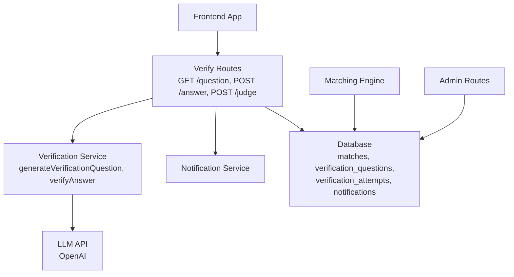
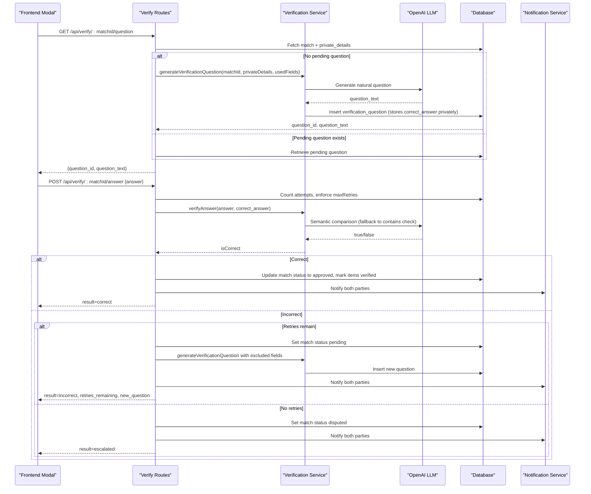
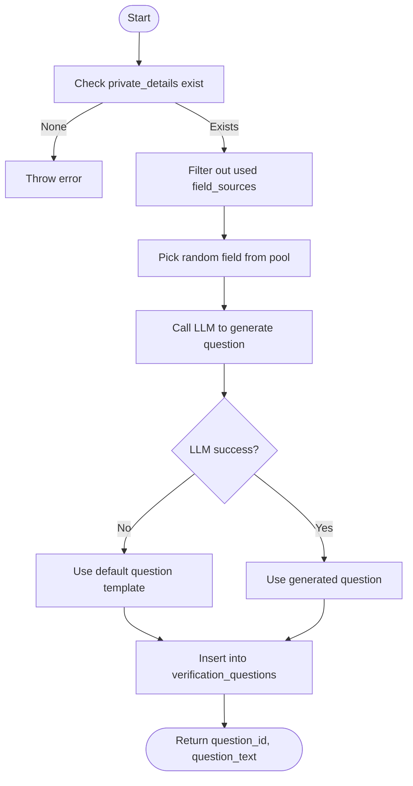
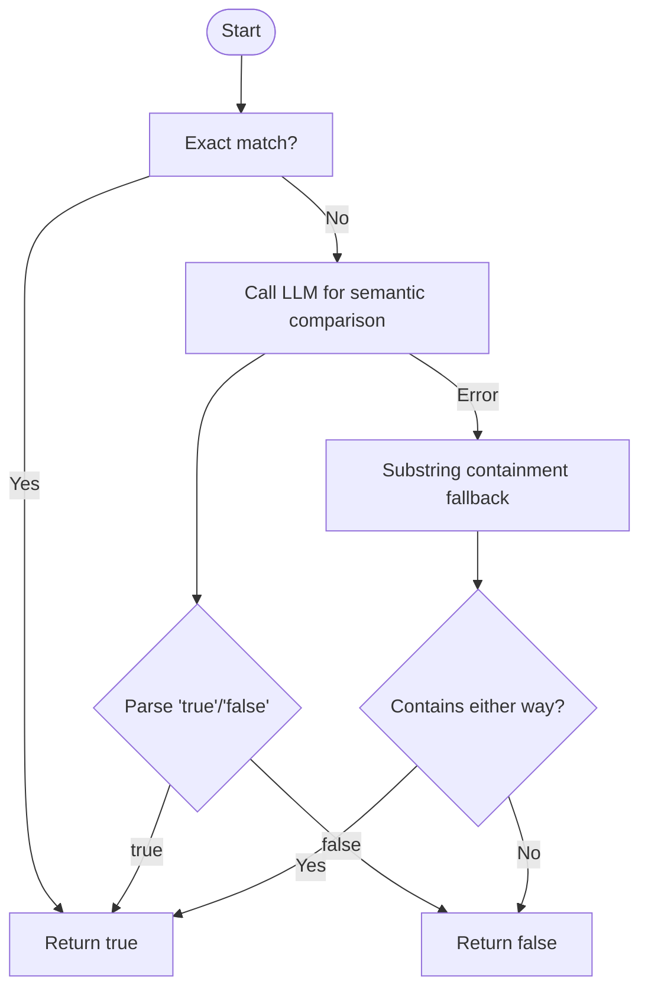
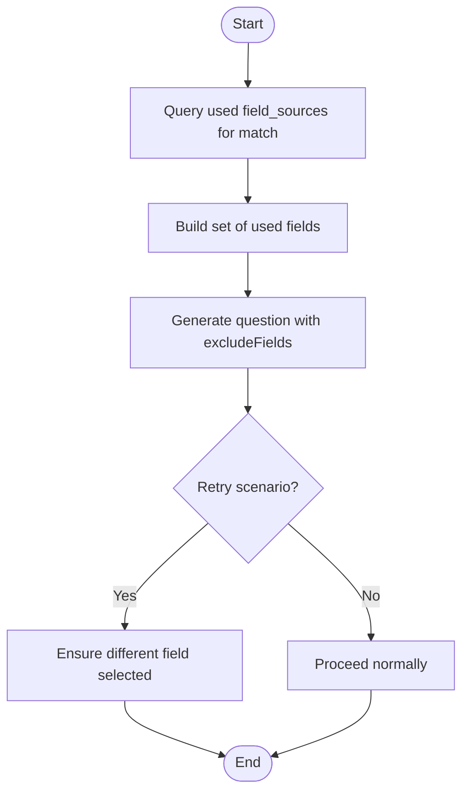
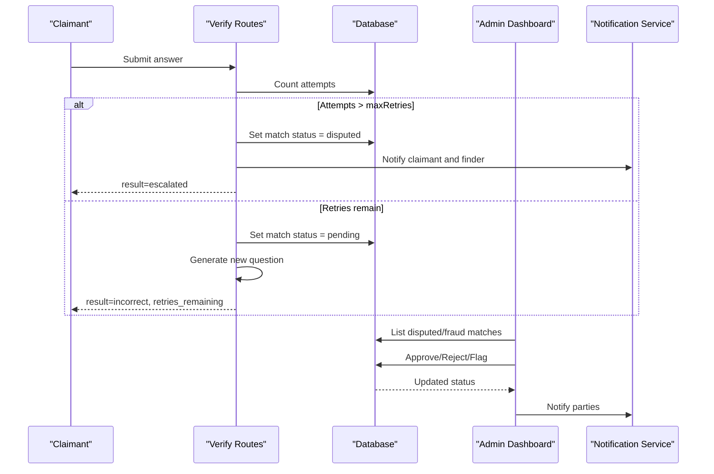
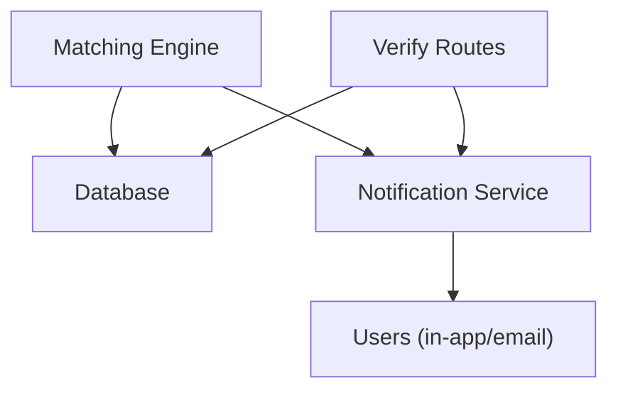
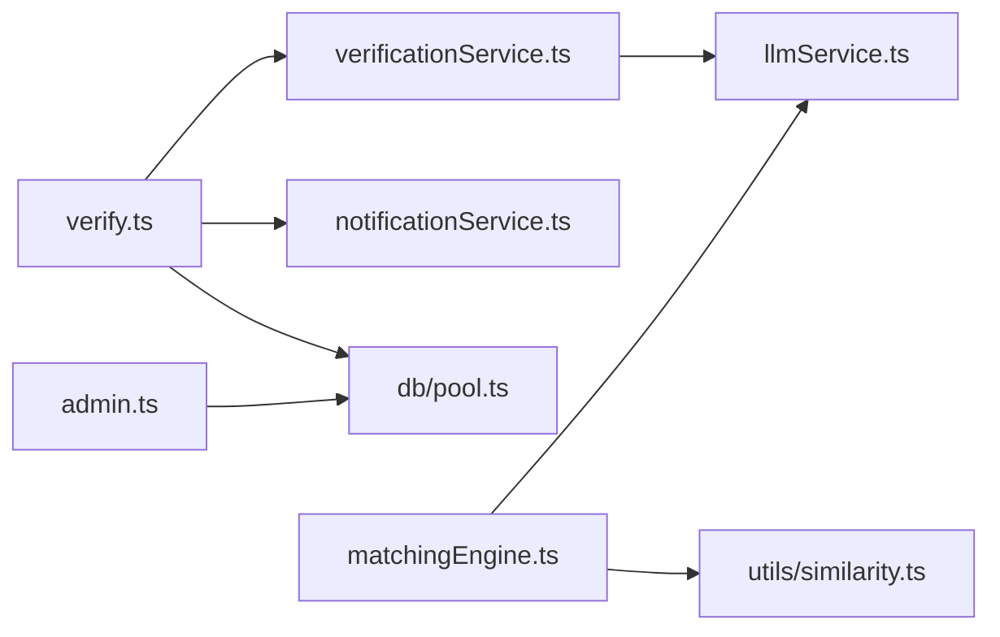

# Verification System

<cite>
**Referenced Files in This Document**
- [verify.ts](file://backend/src/routes/verify.ts)
- [verificationService.ts](file://backend/src/services/verificationService.ts)
- [llmService.ts](file://backend/src/services/llmService.ts)
- [matchingEngine.ts](file://backend/src/services/matchingEngine.ts)
- [notificationService.ts](file://backend/src/services/notificationService.ts)
- [admin.ts](file://backend/src/routes/admin.ts)
- [validate.ts](file://backend/src/middleware/validate.ts)
- [config/index.ts](file://backend/src/config/index.ts)
- [similarity.ts](file://backend/src/utils/similarity.ts)
- [VerificationModal.tsx](file://frontend/components/VerificationModal.tsx)
- [VERIFICATION_FIELDS.md](file://VERIFICATION_FIELDS.md)
- [001_initial_schema.sql](file://supabase/migrations/001_initial_schema.sql)
- [SCHEMA_REFERENCE.md](file://SCHEMA_REFERENCE.md)
</cite>

## Table of Contents
1. Introduction
2. Project Structure
3. Core Components
4. Architecture Overview
5. Detailed Component Analysis
6. Dependency Analysis
7. Performance Considerations
8. Troubleshooting Guide
9. Conclusion
10. Appendices

## Introduction
This document explains the AI-powered verification system that ensures secure ownership claims for lost-and-found matches. It covers:
- Dynamic question generation using LLMs from private item details
- Semantic answer validation with natural language understanding
- Field rotation to prevent repetition across retries
- Escalation workflow for disputed matches and admin review
- Security measures to prevent fraud
- Integration with the matching engine and notification system for real-time updates

## Project Structure
The verification system is implemented primarily in the backend, with a frontend modal that drives the user experience. Key modules:
- Routes: expose endpoints to request questions, submit answers, and allow finder overrides
- Services: orchestrate LLM-based question generation, semantic answer evaluation, notifications, and matching
- Middleware: authentication and input validation
- Database schema: stores questions, attempts, matches, and notifications
- Frontend: interactive modal for claimants to answer verification questions

**Diagram sources**
- [verify.ts:20-79](file://backend/src/routes/verify.ts#L20-L79)
- [verificationService.ts:15-79](file://backend/src/services/verificationService.ts#L15-L79)
- [notificationService.ts:19-62](file://backend/src/services/notificationService.ts#L19-L62)
- [matchingEngine.ts:37-189](file://backend/src/services/matchingEngine.ts#L37-L189)
- [admin.ts:53-83](file://backend/src/routes/admin.ts#L53-L83)

**Section sources**
- [verify.ts:20-79](file://backend/src/routes/verify.ts#L20-L79)
- [verificationService.ts:15-79](file://backend/src/services/verificationService.ts#L15-L79)
- [notificationService.ts:19-62](file://backend/src/services/notificationService.ts#L19-L62)
- [matchingEngine.ts:37-189](file://backend/src/services/matchingEngine.ts#L37-L189)
- [admin.ts:53-83](file://backend/src/routes/admin.ts#L53-L83)

## Core Components
- Dynamic Question Generation: Uses OpenAI to create natural-sounding questions based on private details stored by finders. Excludes previously used fields to ensure variety on retries.
- Semantic Answer Validation: Performs exact match first; if not equal, uses an LLM to judge semantic equivalence with minimal tolerance for wording differences.
- Field Rotation: Tracks field sources used per match to generate different questions on retry attempts.
- Escalation Workflow: Limits retries via configuration; when exceeded or when disputes arise, matches are escalated to admin for review.
- Finder Override: Finders can override system judgments to approve or reject answers, triggering retries or escalation accordingly.
- Notifications: Real-time in-app and email notifications inform both parties about verification progress and outcomes.
- Integration with Matching Engine: After successful verification, items are marked verified and messaging is enabled; matching engine also notifies users of new matches.

**Section sources**
- [verificationService.ts:15-123](file://backend/src/services/verificationService.ts#L15-L123)
- [verify.ts:20-444](file://backend/src/routes/verify.ts#L20-L444)
- [notificationService.ts:19-62](file://backend/src/services/notificationService.ts#L19-L62)
- [matchingEngine.ts:174-186](file://backend/src/services/matchingEngine.ts#L174-L186)
- [config/index.ts:33-47](file://backend/src/config/index.ts#L33-L47)

## Architecture Overview
The verification flow integrates multiple services and data stores to ensure secure ownership verification while maintaining a smooth user experience.

**Diagram sources**
- [verify.ts:20-294](file://backend/src/routes/verify.ts#L20-L294)
- [verificationService.ts:15-123](file://backend/src/services/verificationService.ts#L15-L123)
- [notificationService.ts:19-62](file://backend/src/services/notificationService.ts#L19-L62)

## Detailed Component Analysis

### Dynamic Question Generation
- Input: matchId, private_details object from found_items, set of previously used field_source keys
- Process:
  - Select a random available field (excluding used fields)
  - Use LLM to generate a natural question focused on that detail
  - Store question_text and correct_answer in verification_questions along with field_source
- Output: question_id and question_text returned to client; correct_answer remains private

**Diagram sources**
- [verificationService.ts:15-79](file://backend/src/services/verificationService.ts#L15-L79)

**Section sources**
- [verificationService.ts:15-79](file://backend/src/services/verificationService.ts#L15-L79)
- [VERIFICATION_FIELDS.md:1-123](file://VERIFICATION_FIELDS.md#L1-L123)

### Semantic Answer Validation
- Exact match: case-insensitive trimmed equality returns true immediately
- LLM judgment: if not exact, send correct_answer and submitted_answer to LLM for semantic equivalence decision
- Fallback: if LLM fails, use substring containment check
- Output: boolean indicating correctness

**Diagram sources**
- [verificationService.ts:85-123](file://backend/src/services/verificationService.ts#L85-L123)

**Section sources**
- [verificationService.ts:85-123](file://backend/src/services/verificationService.ts#L85-L123)

### Field Rotation System
- Purpose: Prevent repeating the same private detail across retries to maintain verification integrity
- Mechanism:
  - On each attempt, query existing verification_questions for the match to collect used field_source values
  - Pass these as excludeFields to question generation so a different field is chosen
  - If all fields exhausted, fallback allows reuse but prioritizes unused fields

**Diagram sources**
- [verify.ts:63-71](file://backend/src/routes/verify.ts#L63-L71)
- [verificationService.ts:26-34](file://backend/src/services/verificationService.ts#L26-L34)

**Section sources**
- [verify.ts:63-71](file://backend/src/routes/verify.ts#L63-L71)
- [verificationService.ts:26-34](file://backend/src/services/verificationService.ts#L26-L34)

### Escalation Workflow and Admin Review
- Auto-escalation: When maximum attempts reached (config.matching.maxRetries), match status becomes disputed and both parties are notified
- Finder override: Finder can mark an answer correct or incorrect; if incorrect and no retries remain, escalate to admin
- Admin dashboard: Lists disputed or fraud-flagged matches with full verification history (questions and attempts)
- Actions: Approve/reject matches, flag/unflag for fraud, update item statuses, notify parties

**Diagram sources**
- [verify.ts:132-239](file://backend/src/routes/verify.ts#L132-L239)
- [admin.ts:235-307](file://backend/src/routes/admin.ts#L235-L307)
- [config/index.ts:43-45](file://backend/src/config/index.ts#L43-L45)

**Section sources**
- [verify.ts:132-239](file://backend/src/routes/verify.ts#L132-L239)
- [admin.ts:235-307](file://backend/src/routes/admin.ts#L235-L307)
- [config/index.ts:43-45](file://backend/src/config/index.ts#L43-L45)

### Security Measures and Fraud Prevention
- Access control: Only claimant or admin can request questions; only claimant can submit answers; only finder or admin can judge
- Private details protection: correct_answer stored privately; only question_text exposed to claimant
- Retry limits: Enforced via configuration to prevent brute-force guessing
- Fraud flagging: Admin can manually flag matches for review; flagged cases appear in admin queue with reasons and timestamps
- Auditability: All attempts recorded with timestamps and judgment metadata

**Section sources**
- [verify.ts:39-42](file://backend/src/routes/verify.ts#L39-L42)
- [verify.ts:96-111](file://backend/src/routes/verify.ts#L96-L111)
- [verify.ts:310-328](file://backend/src/routes/verify.ts#L310-L328)
- [admin.ts:317-364](file://backend/src/routes/admin.ts#L317-L364)
- [001_initial_schema.sql:172-199](file://supabase/migrations/001_initial_schema.sql#L172-L199)

### Integration with Matching Engine and Notifications
- Matching engine computes weighted scores across description embeddings, images, location, time, and attributes; surfaces matches above threshold
- Upon successful verification, items are marked verified and messaging is unlocked; notifications inform both parties
- New matches trigger notifications to both owners

**Diagram sources**
- [matchingEngine.ts:37-189](file://backend/src/services/matchingEngine.ts#L37-L189)
- [notificationService.ts:19-62](file://backend/src/services/notificationService.ts#L19-L62)
- [verify.ts:171-206](file://backend/src/routes/verify.ts#L171-L206)

**Section sources**
- [matchingEngine.ts:37-189](file://backend/src/services/matchingEngine.ts#L37-L189)
- [notificationService.ts:19-62](file://backend/src/services/notificationService.ts#L19-L62)
- [verify.ts:171-206](file://backend/src/routes/verify.ts#L171-L206)

## Dependency Analysis
- Routes depend on:
  - Authentication middleware
  - Validation schemas
  - Verification service for LLM operations
  - Notification service for user updates
  - Database pool for queries
- Verification service depends on:
  - OpenAI client for question generation and answer evaluation
  - Database pool to persist questions and retrieve private details
- Matching engine depends on:
  - Similarity utilities for location/time/attribute scoring
  - LLM service for image similarity and embeddings
  - Notification service for match alerts
- Admin routes depend on:
  - Authentication and authorization
  - Database for dispute management and audit logs

**Diagram sources**
- [verify.ts:1-9](file://backend/src/routes/verify.ts#L1-L9)
- [verificationService.ts:1-4](file://backend/src/services/verificationService.ts#L1-L4)
- [matchingEngine.ts:1-5](file://backend/src/services/matchingEngine.ts#L1-L5)
- [admin.ts:1-7](file://backend/src/routes/admin.ts#L1-L7)

**Section sources**
- [verify.ts:1-9](file://backend/src/routes/verify.ts#L1-L9)
- [verificationService.ts:1-4](file://backend/src/services/verificationService.ts#L1-L4)
- [matchingEngine.ts:1-5](file://backend/src/services/matchingEngine.ts#L1-L5)
- [admin.ts:1-7](file://backend/src/routes/admin.ts#L1-L7)

## Performance Considerations
- LLM calls:
  - Question generation uses a small model with low token limits to reduce latency and cost
  - Answer validation uses zero temperature for deterministic results; fallback avoids repeated LLM calls on errors
- Database queries:
  - Efficient retrieval of pending questions and attempt counts
  - Indexed columns for verification_questions and verification_attempts improve lookup performance
- Matching engine:
  - Embedding cosine similarity computed efficiently; fallback text overlap used when embeddings unavailable
  - Location and time similarity functions are lightweight calculations

[No sources needed since this section provides general guidance]

## Troubleshooting Guide
- No private details: If a found item lacks private_details, question generation will fail; ensure finders provide appropriate private fields as per guidelines
- LLM failures:
  - Question generation falls back to default templates
  - Answer validation falls back to substring containment
- Maximum retries exceeded: Match escalates to admin; verify configuration and consider adjusting maxRetries if necessary
- Access denied: Ensure the requester is the claimant or has admin role; otherwise, permissions will block the operation
- Disputed matches: Use admin dashboard to review verification history and make final decisions

**Section sources**
- [verificationService.ts:22-24](file://backend/src/services/verificationService.ts#L22-L24)
- [verificationService.ts:62-64](file://backend/src/services/verificationService.ts#L62-L64)
- [verificationService.ts:117-121](file://backend/src/services/verificationService.ts#L117-L121)
- [verify.ts:139-142](file://backend/src/routes/verify.ts#L139-L142)
- [verify.ts:39-42](file://backend/src/routes/verify.ts#L39-L42)
- [admin.ts:235-307](file://backend/src/routes/admin.ts#L235-L307)

## Conclusion
The verification system combines dynamic LLM-generated questions, semantic answer validation, and robust field rotation to securely verify ownership claims. It integrates seamlessly with the matching engine and notification system, providing real-time updates and a clear escalation path for disputes. Admin oversight and fraud prevention mechanisms ensure trust and integrity throughout the process.

[No sources needed since this section summarizes without analyzing specific files]

## Appendices

### Example Question Templates and Evaluation Criteria
- Templates: Natural-language questions derived from private details such as keychain color, lock screen wallpaper, bag brand logo, etc., tailored to item categories
- Evaluation criteria:
  - Exact match preferred
  - Semantic equivalence judged by LLM allowing minor variations
  - Fallback to substring containment when LLM unavailable

**Section sources**
- [VERIFICATION_FIELDS.md:1-123](file://VERIFICATION_FIELDS.md#L1-L123)
- [verificationService.ts:85-123](file://backend/src/services/verificationService.ts#L85-L123)

### Confidence Scoring
- Matching engine produces a total score (0–100) based on weighted components:
  - Description similarity (embedding cosine distance)
  - Image similarity (visual comparison)
  - Location proximity (Haversine distance)
  - Time proximity (time window overlap)
  - Attribute similarity (category, brand, color)
- Thresholds determine whether a match is surfaced; verification outcomes do not alter these scores but unlock messaging upon approval

**Section sources**
- [matchingEngine.ts:83-147](file://backend/src/services/matchingEngine.ts#L83-L147)
- [config/index.ts:33-47](file://backend/src/config/index.ts#L33-L47)

### Database Schema Highlights
- verification_questions: stores question_text, correct_answer (private), field_source, and creation timestamp
- verification_attempts: records claimant answers, correctness, judgment metadata, and attempt numbers
- notifications: tracks in-app and email notifications with types and read states

**Section sources**
- [001_initial_schema.sql:172-199](file://supabase/migrations/001_initial_schema.sql#L172-L199)
- [SCHEMA_REFERENCE.md:98-137](file://SCHEMA_REFERENCE.md#L98-L137)

### Frontend User Experience
- Modal prompts claimants to answer verification questions
- Displays loading, ready, submitting, success, and error states
- Integrates with backend APIs to fetch questions and submit answers

**Section sources**
- [VerificationModal.tsx:22-177](file://frontend/components/VerificationModal.tsx#L22-L177)