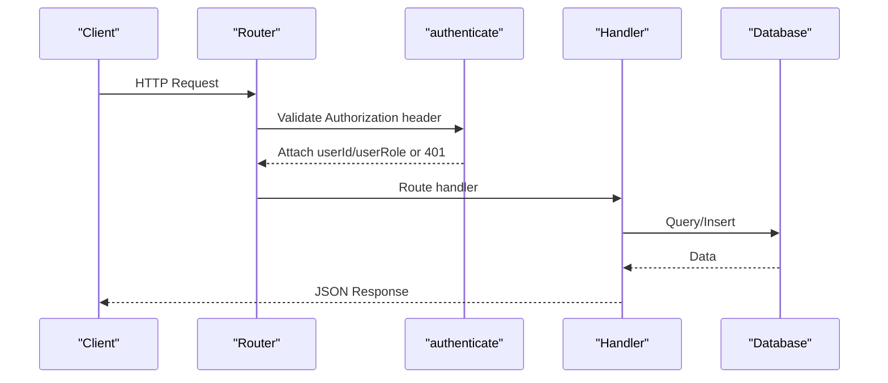
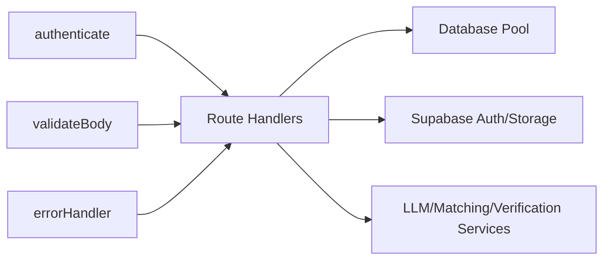

# API Reference

<cite>
**Referenced Files in This Document**
- [auth.ts](file://backend/src/routes/auth.ts)
- [reports.ts](file://backend/src/routes/reports.ts)
- [matches.ts](file://backend/src/routes/matches.ts)
- [messages.ts](file://backend/src/routes/messages.ts)
- [notifications.ts](file://backend/src/routes/notifications.ts)
- [upload.ts](file://backend/src/routes/upload.ts)
- [verify.ts](file://backend/src/routes/verify.ts)
- [admin.ts](file://backend/src/routes/admin.ts)
- [auth.ts (middleware)](file://backend/src/middleware/auth.ts)
- [validate.ts](file://backend/src/middleware/validate.ts)
- [errorHandler.ts](file://backend/src/middleware/errorHandler.ts)
- [config/index.ts](file://backend/src/config/index.ts)
- [API_DOCUMENTATION.md](file://backend/API_DOCUMENTATION.md)
</cite>

## Table of Contents
1. [Introduction](#introduction)
2. [Project Structure](#project-structure)
3. [Core Components](#core-components)
4. [Architecture Overview](#architecture-overview)
5. [Detailed Component Analysis](#detailed-component-analysis)
6. [Dependency Analysis](#dependency-analysis)
7. [Performance Considerations](#performance-considerations)
8. [Troubleshooting Guide](#troubleshooting-guide)
9. [Conclusion](#conclusion)
10. [Appendices](#appendices)

## Introduction
This document provides a comprehensive API reference for the backend endpoints of the Lost & Found AI Matcher system. It covers authentication, report management (lost/found), matching and verification, notifications and messaging, uploads, and admin operations. For each endpoint, you will find HTTP methods, URL patterns, request/response schemas, authentication requirements, error codes, parameter descriptions, validation rules, pagination/filtering/sorting capabilities, example requests/responses, and integration guidelines.

The base URL is:
- http://localhost:4000/api

Authentication uses JWT Bearer tokens obtained via signup/login. Most endpoints require a valid token; some are restricted to specific roles (e.g., admin).

## Project Structure
The backend is organized by feature routes under src/routes, with shared middleware for authentication, validation, and error handling. Configuration is centralized in src/config. The existing API documentation file also contains examples and notes on scoring and behavior.

```mermaid
graph TB
Client["Client"] --> Router["Express Router"]
Router --> AuthRoutes["/api/auth/*"]
Router --> ReportRoutes["/api/reports/*"]
Router --> UploadRoutes["/api/upload/*"]
Router --> MatchRoutes["/api/matches/*"]
Router --> VerifyRoutes["/api/verify/*"]
Router --> MessageRoutes["/api/messages/*"]
Router --> NotificationRoutes["/api/notifications/*"]
Router --> AdminRoutes["/api/admin/*"]
subgraph "Middleware"
A["authenticate"]
V["validateBody"]
E["errorHandler"]
end
AuthRoutes --- A
ReportRoutes --- A
UploadRoutes --- A
MatchRoutes --- A
VerifyRoutes --- A
MessageRoutes --- A
NotificationRoutes --- A
AdminRoutes --- A
AdminRoutes --- ["requireAdmin"]
ReportRoutes --- V
VerifyRoutes --- V
MessageRoutes --- V
```

**Diagram sources**
- [auth.ts (routes):1-109](file://backend/src/routes/auth.ts#L1-L109)
- [reports.ts:1-356](file://backend/src/routes/reports.ts#L1-L356)
- [upload.ts:1-69](file://backend/src/routes/upload.ts#L1-L69)
- [matches.ts:1-115](file://backend/src/routes/matches.ts#L1-L115)
- [verify.ts:1-444](file://backend/src/routes/verify.ts#L1-L444)
- [messages.ts:1-136](file://backend/src/routes/messages.ts#L1-L136)
- [notifications.ts:1-86](file://backend/src/routes/notifications.ts#L1-L86)
- [admin.ts:1-389](file://backend/src/routes/admin.ts#L1-L389)
- [auth.ts (middleware):1-59](file://backend/src/middleware/auth.ts#L1-L59)
- [validate.ts:1-61](file://backend/src/middleware/validate.ts#L1-L61)
- [errorHandler.ts:1-56](file://backend/src/middleware/errorHandler.ts#L1-L56)

**Section sources**
- [API_DOCUMENTATION.md:1-10](file://backend/API_DOCUMENTATION.md#L1-L10)
- [config/index.ts:6-48](file://backend/src/config/index.ts#L6-L48)

## Core Components
- Authentication: Signup, login, and profile retrieval. Issues and validates JWTs.
- Reports: Create lost/found reports, list paginated reports, retrieve user’s reports, get single report details with privacy controls.
- Uploads: Image upload with resizing and storage to Supabase.
- Matching: Trigger matching engine per report and fetch matches sorted by score.
- Verification: Generate questions, submit answers, finder judgment, escalation flows.
- Messaging: Threaded messages between matched parties after approval.
- Notifications: List, count, mark read/unread.
- Admin: Stats, match management (approve/reject/flag/unflag), item status updates, disputed cases.

**Section sources**
- [auth.ts:12-109](file://backend/src/routes/auth.ts#L12-L109)
- [reports.ts:16-356](file://backend/src/routes/reports.ts#L16-L356)
- [upload.ts:15-69](file://backend/src/routes/upload.ts#L15-L69)
- [matches.ts:11-115](file://backend/src/routes/matches.ts#L11-L115)
- [verify.ts:14-444](file://backend/src/routes/verify.ts#L14-L444)
- [messages.ts:13-136](file://backend/src/routes/messages.ts#L13-L136)
- [notifications.ts:10-86](file://backend/src/routes/notifications.ts#L10-L86)
- [admin.ts:14-389](file://backend/src/routes/admin.ts#L14-L389)

## Architecture Overview
The API follows an Express router-per-feature pattern with shared middleware for auth, validation, and errors. Requests flow through authenticate middleware, which decodes JWTs and attaches userId/userRole. Validation middleware enforces request body schemas using Joi. Error handling centralizes error responses and multer-specific errors.



**Diagram sources**
- [auth.ts (middleware):22-37](file://backend/src/middleware/auth.ts#L22-L37)
- [errorHandler.ts:16-47](file://backend/src/middleware/errorHandler.ts#L16-L47)

## Detailed Component Analysis

### Authentication
- POST /api/auth/signup
  - Purpose: Create a new user and issue a JWT.
  - Auth: None.
  - Request: JSON with email, password, full_name.
  - Response: 201 with user object and token.
  - Errors: 400 on failure.
- POST /api/auth/login
  - Purpose: Authenticate and return JWT.
  - Auth: None.
  - Request: JSON with email, password.
  - Response: 200 with user object (including role) and token.
  - Errors: 401 on invalid credentials.
- GET /api/auth/me
  - Purpose: Get current user profile.
  - Auth: Required (Bearer token).
  - Response: 200 with user fields.
  - Errors: 401 if missing/invalid token; 404 if user not found.

Validation and schema references:
- JWT payload includes sub, role, email.
- Role is fetched from users table during login.

Example references:
- See example payloads and cURL in API documentation.

**Section sources**
- [auth.ts:12-109](file://backend/src/routes/auth.ts#L12-L109)
- [auth.ts (middleware):22-37](file://backend/src/middleware/auth.ts#L22-L37)
- [API_DOCUMENTATION.md:43-127](file://backend/API_DOCUMENTATION.md#L43-L127)

### Reports (Lost/Found)
- POST /api/reports/upload
  - Purpose: Upload photo, optimize, return public URL.
  - Auth: Required.
  - Request: multipart/form-data with field "photo".
  - Response: 201 with photo_url.
  - Errors: 400 if no file; storage errors may yield 500.
- GET /api/reports
  - Purpose: List active reports (lost + found), paginated.
  - Auth: Required.
  - Query params: page (default 1), limit (default 20, max 50), type (all|lost|found).
  - Response: 200 with lost[], found[], pagination{page, limit, total_lost, total_found}.
- POST /api/reports/lost
  - Purpose: Create a lost-item report; runs matching and similar search.
  - Auth: Required.
  - Request: JSON validated by lostReportSchema.
  - Response: 201 with report fields, matches[], similar_found_items[].
  - Notes: Embedding generation optional; matching failures do not block creation.
- POST /api/reports/found
  - Purpose: Create a found-item report; runs matching and similar search.
  - Auth: Required.
  - Request: JSON validated by foundReportSchema.
  - Response: 201 with report fields, matches[], similar_lost_items[].
- GET /api/reports/user/:userId
  - Purpose: Get all reports for a user.
  - Auth: Required. Users can only view own reports; admins can view any.
  - Response: 200 with lost[], found[].
- GET /api/reports/found/:id
  - Purpose: Public view of a found item; hides private_details unless owner/admin.
  - Auth: Required.
  - Response: 200 with redacted or full private_details depending on ownership.
- GET /api/reports/:id
  - Purpose: Retrieve a single report (lost or found).
  - Auth: Required.
  - Response: 200 with report; identifying_info hidden for non-owners.

Validation schemas:
- lostReportSchema: category required; description min 10; location required; latitude/longitude ranges; ISO date; optional brand, colour, photo_url, identifying_info.
- foundReportSchema: same core fields; optional private_details object.

Pagination and filtering:
- GET /api/reports supports page, limit, type.

Privacy:
- Private fields are conditionally exposed based on ownership and role.

**Section sources**
- [reports.ts:16-356](file://backend/src/routes/reports.ts#L16-L356)
- [validate.ts:27-51](file://backend/src/middleware/validate.ts#L27-L51)
- [API_DOCUMENTATION.md:130-378](file://backend/API_DOCUMENTATION.md#L130-L378)

### Uploads
- POST /api/upload
  - Purpose: Upload image, resize to max width 800px, store in Supabase bucket, return public URL and filename.
  - Auth: Required.
  - Request: multipart/form-data with field "photo", max 5 MB, images only.
  - Response: 201 with url and fileName.
  - Errors: 400 for invalid file or unexpected field; 500 on storage errors.

Multer configuration and limits:
- File size limit enforced at middleware level.

**Section sources**
- [upload.ts:15-69](file://backend/src/routes/upload.ts#L15-L69)
- [errorHandler.ts:30-40](file://backend/src/middleware/errorHandler.ts#L30-L40)
- [API_DOCUMENTATION.md:381-416](file://backend/API_DOCUMENTATION.md#L381-L416)

### Matches
- POST /api/matches/run/:reportId?type=lost|found
  - Purpose: Manually trigger matching engine for a specific report.
  - Auth: Required.
  - Path param: reportId.
  - Query param: type (required; lost|found).
  - Access: Only report owner or admin.
  - Response: 200 with report_id, match_count, matches[].
- GET /api/matches/:reportId?type=lost|found
  - Purpose: Fetch existing matches for a report, sorted by total_score descending.
  - Auth: Required.
  - Path param: reportId.
  - Query param: type (required; lost|found).
  - Access: Only report owner or admin.
  - Response: 200 array of matches with detailed scores and related item fields.

Access control:
- Ownership verified against lost_items or found_items tables.

**Section sources**
- [matches.ts:11-115](file://backend/src/routes/matches.ts#L11-L115)
- [API_DOCUMENTATION.md:419-513](file://backend/API_DOCUMENTATION.md#L419-L513)

### Verification
- GET /api/verify/:matchId/question
  - Purpose: Retrieve or generate a verification question for a match.
  - Auth: Required.
  - Access: Only claimant (lost-item owner) or admin.
  - Behavior: If no unanswered question exists, generates one excluding previously used field sources.
  - Response: 200 with question_id, question_text.
  - Errors: 400 if no private details available; 404 if match not found; 403 if unauthorized.
- POST /api/verify/:matchId/answer
  - Purpose: Submit answer to verification question.
  - Auth: Required.
  - Access: Only claimant or admin.
  - Flow: Auto-verifies via LLM fuzzy comparison; stores attempt; approves match if correct; otherwise escalates or retries based on config.matching.maxRetries.
  - Response: 201 with attempt info and result (correct|incorrect|escalated); may include new_question.
  - Errors: 404 if no pending question; 429 if max attempts reached.
- POST /api/verify/:matchId/judge
  - Purpose: Finder override for system judgment.
  - Auth: Required.
  - Access: Only finder or admin.
  - Behavior: Marks attempt correct/incorrect; approves match if correct; escalates if incorrect and no retries remain; otherwise generates new question and continues.
  - Response: 200 with result and message; may include retries_remaining and new_question.

Retry policy:
- Configurable via config.matching.maxRetries. When exceeded, match status becomes disputed and both parties are notified.

Notifications:
- Appropriate notifications are created for approvals, rejections, and escalations.

**Section sources**
- [verify.ts:14-444](file://backend/src/routes/verify.ts#L14-L444)
- [config/index.ts:33-47](file://backend/src/config/index.ts#L33-L47)
- [API_DOCUMENTATION.md:516-635](file://backend/API_DOCUMENTATION.md#L516-L635)

### Messages
- GET /api/messages/:matchId
  - Purpose: Fetch full message thread for a match (oldest first).
  - Auth: Required.
  - Access: Only participants of an approved match (or admin).
  - Response: 200 with messages[] including sender info and timestamps.
- POST /api/messages/:matchId
  - Purpose: Send a message in the match thread.
  - Auth: Required.
  - Access: Only participants of an approved match (or admin).
  - Request: JSON with body (min 1, max 2000 characters).
  - Response: 201 with message object.
  - Side effects: Creates notification for other party.

Validation:
- sendMessageSchema enforces body length constraints.

**Section sources**
- [messages.ts:13-136](file://backend/src/routes/messages.ts#L13-L136)

### Notifications
- PATCH /api/notifications/read-all
  - Purpose: Mark all unread notifications for the authenticated user as read.
  - Auth: Required.
  - Response: 200 with confirmation message.
- GET /api/notifications/count
  - Purpose: Return unread notification count for the authenticated user.
  - Auth: Required.
  - Response: 200 with unread_count.
- GET /api/notifications
  - Purpose: List notifications for the authenticated user (newest first).
  - Auth: Required.
  - Query params: page (default 1), limit (default 20), unread (true to filter unread).
  - Response: 200 with notifications[], unread_count, page, limit.
- PATCH /api/notifications/:id/read
  - Purpose: Mark a single notification as read.
  - Auth: Required.
  - Response: 200 with confirmation message.

**Section sources**
- [notifications.ts:10-86](file://backend/src/routes/notifications.ts#L10-L86)

### Admin
- GET /api/admin/stats
  - Purpose: Dashboard statistics for lost items, found items, and matches.
  - Auth: Required + admin role.
  - Response: 200 with counts and statuses.
- GET /api/admin/matches
  - Purpose: List all matches with pagination and optional status filter.
  - Auth: Required + admin role.
  - Query params: page (default 1), limit (default 20), status (pending|approved|rejected|disputed).
  - Response: 200 with page, limit, matches[].
- POST /api/admin/matches/:id/approve
  - Purpose: Approve a match and mark items verified.
  - Auth: Required + admin role.
  - Response: 200 with confirmation; notifies both parties.
- POST /api/admin/matches/:id/reject
  - Purpose: Reject a match and reset items to active if needed.
  - Auth: Required + admin role.
  - Response: 200 with confirmation; notifies both parties.
- PATCH /api/admin/items/:id/status
  - Purpose: Update item status (active|matched|verified|returned|closed).
  - Auth: Required + admin role.
  - Request: JSON with status, type (lost|found), reason (optional).
  - Response: 200 with confirmation; logs changes and notifies owner for returned/closed.
- GET /api/admin/disputed
  - Purpose: List disputed or fraud-flagged matches with verification history.
  - Auth: Required + admin role.
  - Query params: page (default 1), limit (default 20).
  - Response: 200 with page, limit, total, matches[] including questions and attempts.
- POST /api/admin/matches/:id/flag
  - Purpose: Manually flag a match as fraudulent with reason.
  - Auth: Required + admin role.
  - Request: JSON with reason (min 1, max 1000 chars).
  - Response: 200 with confirmation; notifies both parties.
- POST /api/admin/matches/:id/unflag
  - Purpose: Remove fraud flag from a match.
  - Auth: Required + admin role.
  - Response: 200 with confirmation.

Role enforcement:
- All admin routes use requireAdmin middleware which verifies role against database.

**Section sources**
- [admin.ts:14-389](file://backend/src/routes/admin.ts#L14-L389)
- [auth.ts (middleware):43-58](file://backend/src/middleware/auth.ts#L43-L58)

## Dependency Analysis
- Authentication dependency chain:
  - Routes depend on authenticate middleware to decode JWT and attach userId/userRole.
  - requireAdmin depends on authenticate and queries users table to enforce admin role.
- Validation dependency chain:
  - Routes use validateBody with Joi schemas to enforce request structure and types.
- Error handling:
  - errorHandler centralizes AppError responses and multer-specific errors.
- External integrations:
  - Supabase for auth admin APIs and storage.
  - OpenAI for embeddings and verification (via services referenced in routes).
  - Database pool for queries.



**Diagram sources**
- [auth.ts (middleware):22-58](file://backend/src/middleware/auth.ts#L22-L58)
- [validate.ts:8-23](file://backend/src/middleware/validate.ts#L8-L23)
- [errorHandler.ts:16-56](file://backend/src/middleware/errorHandler.ts#L16-L56)

**Section sources**
- [auth.ts (middleware):22-58](file://backend/src/middleware/auth.ts#L22-L58)
- [validate.ts:8-23](file://backend/src/middleware/validate.ts#L8-L23)
- [errorHandler.ts:16-56](file://backend/src/middleware/errorHandler.ts#L16-L56)

## Performance Considerations
- Pagination:
  - Reports and notifications support page and limit parameters to avoid large payloads.
- Matching thresholds:
  - Minimum score threshold configured to reduce noise in matches.
- Optional embedding generation:
  - Non-fatal failures allow report creation even if embeddings cannot be generated.
- Image resizing:
  - Uploads resize images to reduce storage and bandwidth usage.
- Asynchronous matching:
  - Matching engine runs without blocking report creation responses.

[No sources needed since this section provides general guidance]

## Troubleshooting Guide
Common errors and their meanings:
- 400 Bad Request: Validation failed or missing fields; multer errors like file too large or unexpected field.
- 401 Unauthorized: Missing or invalid JWT; authentication required.
- 403 Forbidden: Insufficient permissions (e.g., accessing another user’s data or admin-only endpoints).
- 404 Not Found: Resource does not exist (e.g., report or match not found).
- 429 Too Many Requests: Verification retry limit exceeded.

Error response shape:
- { "message": "Error description" }

Multer-specific messages:
- File too large. Maximum size is 5 MB.
- Unexpected upload field. Use "photo" as the field name.

**Section sources**
- [errorHandler.ts:4-56](file://backend/src/middleware/errorHandler.ts#L4-L56)
- [API_DOCUMENTATION.md:782-800](file://backend/API_DOCUMENTATION.md#L782-L800)

## Conclusion
The API provides a robust set of endpoints for user authentication, report management, matching and verification workflows, messaging, notifications, uploads, and administrative oversight. Security is enforced via JWT-based authentication and role checks, while validation ensures data integrity. Pagination and filtering improve performance and usability. Integration should follow the documented request/response schemas and handle common error codes appropriately.

[No sources needed since this section summarizes without analyzing specific files]

## Appendices

### Authentication Requirements Summary
- Most endpoints require Authorization: Bearer <token>.
- Admin endpoints additionally require admin role.

**Section sources**
- [auth.ts (middleware):22-58](file://backend/src/middleware/auth.ts#L22-L58)

### Rate Limiting
- No explicit rate limiting is implemented in the provided codebase.
- Verification retry limits are enforced via config.matching.maxRetries.

**Section sources**
- [config/index.ts:33-47](file://backend/src/config/index.ts#L33-L47)

### API Versioning and Deprecation
- No versioning prefix is present in routes; all endpoints are under /api.
- No deprecation headers or policies are evident in the codebase.

[No sources needed since this section provides general guidance]

### Example Requests and Responses
- Refer to the API documentation file for concrete examples across endpoints.

**Section sources**
- [API_DOCUMENTATION.md:43-800](file://backend/API_DOCUMENTATION.md#L43-L800)