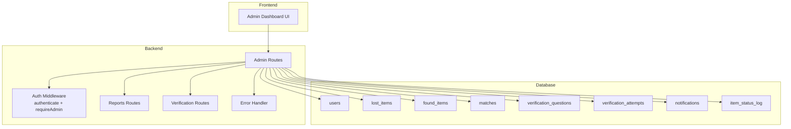
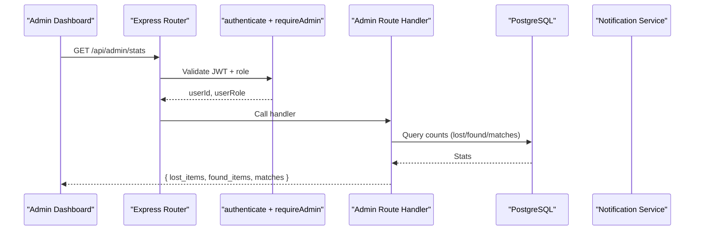
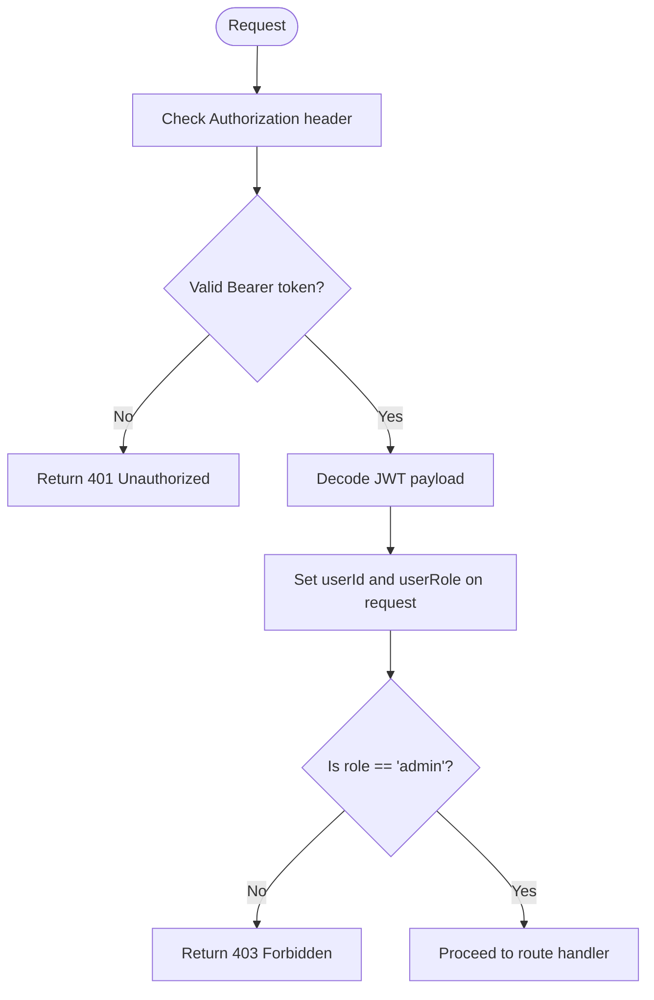
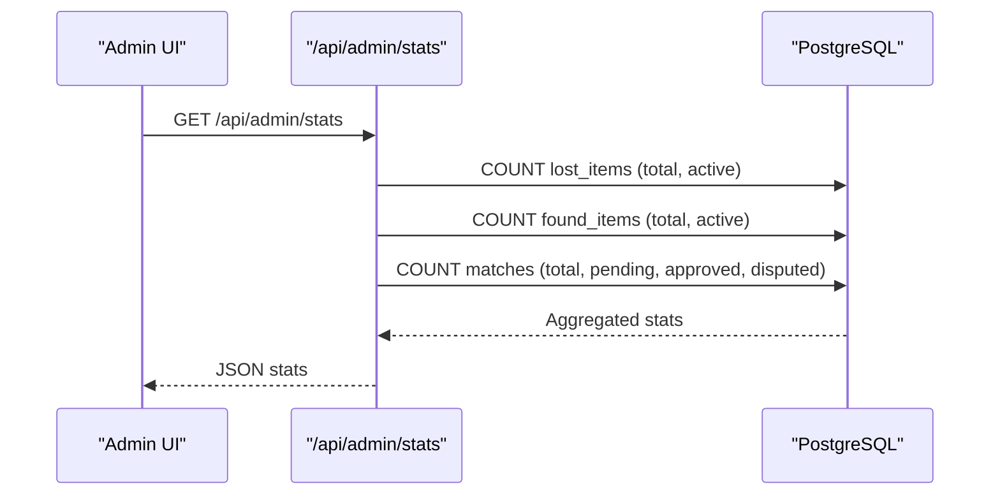
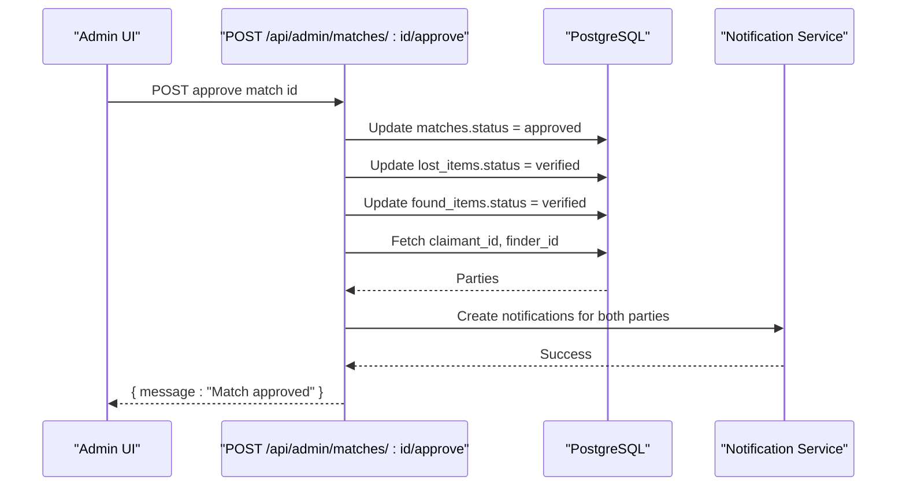
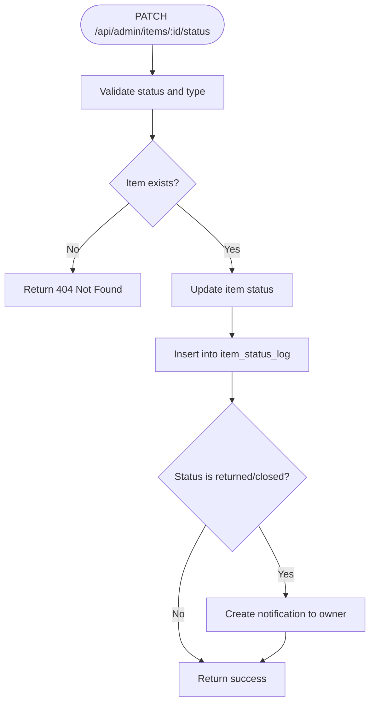
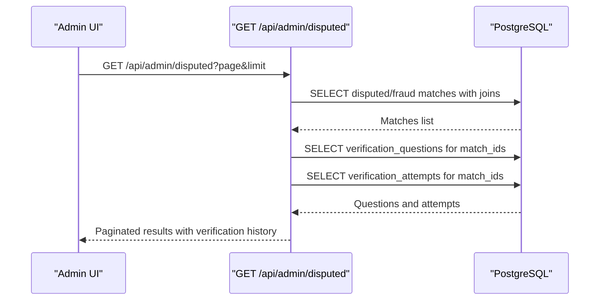
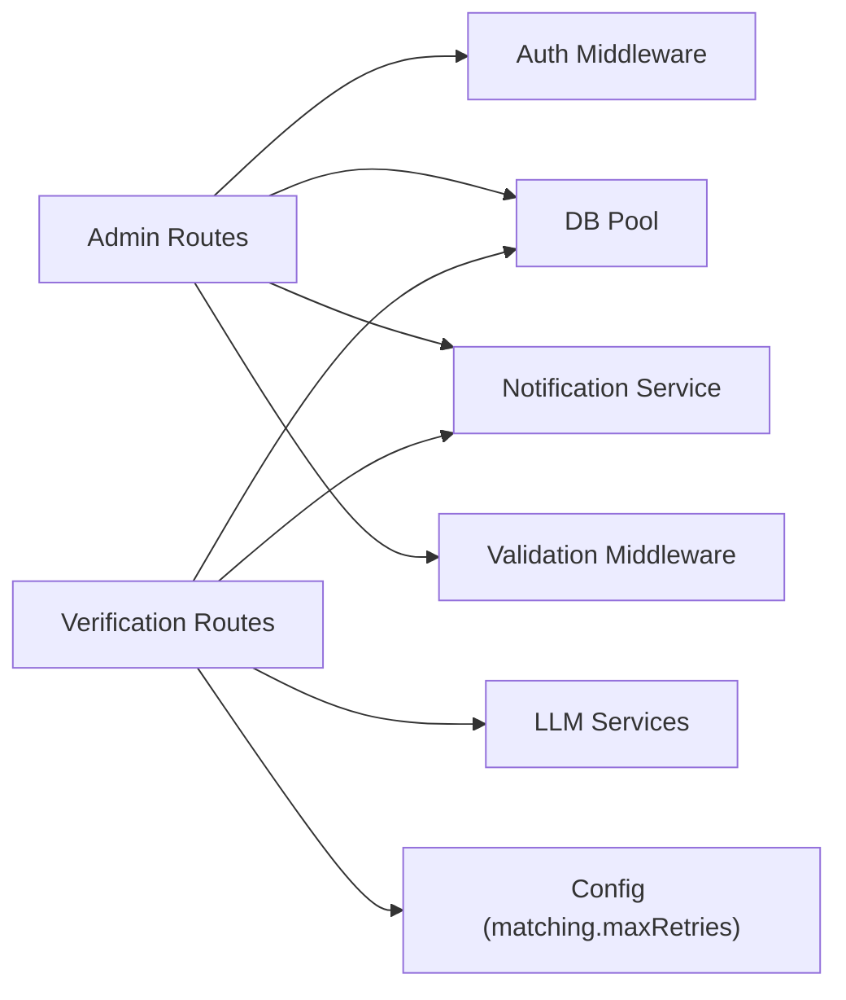

# Admin API

<cite>
**Referenced Files in This Document**
- [admin.ts](file://backend/src/routes/admin.ts)
- [auth.ts](file://backend/src/middleware/auth.ts)
- [errorHandler.ts](file://backend/src/middleware/errorHandler.ts)
- [validate.ts](file://backend/src/middleware/validate.ts)
- [reports.ts](file://backend/src/routes/reports.ts)
- [verify.ts](file://backend/src/routes/verify.ts)
- [001_initial_schema.sql](file://supabase/migrations/001_initial_schema.sql)
- [003_admin_fraud_flag.sql](file://supabase/migrations/003_admin_fraud_flag.sql)
- [index.ts](file://backend/src/config/index.ts)
- [page.tsx](file://frontend/app/admin/page.tsx)
</cite>

## Table of Contents
1. Introduction
2. Project Structure
3. Core Components
4. Architecture Overview
5. Detailed Component Analysis
6. Dependency Analysis
7. Performance Considerations
8. Troubleshooting Guide
9. Conclusion
10. Appendices

## Introduction
This document provides comprehensive API documentation for administrative endpoints that require elevated privileges. It covers:
- User management capabilities exposed to admins (viewing user profiles and related data, role enforcement).
- Dispute resolution endpoints for reviewing flagged matches, mediating conflicts, and making final determinations.
- System monitoring endpoints for dashboard statistics and analytics.
- Admin-specific data schemas, permission checks, and action logging.
- Role-based access control (RBAC), audit trail generation, and compliance features.
- Examples of admin dashboard integration and automated administrative workflows.

## Project Structure
The admin functionality is implemented as a set of Express routes under the backend, protected by middleware that enforces authentication and admin role checks. The database schema defines core entities such as users, items, matches, verification artifacts, notifications, and audit logs. A Next.js frontend provides an admin dashboard that consumes these endpoints.



**Diagram sources**
- [admin.ts:1-12](file://backend/src/routes/admin.ts#L1-L12)
- [auth.ts:22-58](file://backend/src/middleware/auth.ts#L22-L58)
- [001_initial_schema.sql:54-236](file://supabase/migrations/001_initial_schema.sql#L54-L236)
- [003_admin_fraud_flag.sql:5-12](file://supabase/migrations/003_admin_fraud_flag.sql#L5-L12)

**Section sources**
- [admin.ts:1-12](file://backend/src/routes/admin.ts#L1-L12)
- [auth.ts:22-58](file://backend/src/middleware/auth.ts#L22-L58)
- [001_initial_schema.sql:54-236](file://supabase/migrations/001_initial_schema.sql#L54-L236)

## Core Components
- Authentication and authorization: JWT-based authentication with role enforcement against the database.
- Admin routes: Endpoints for stats, match review, item status updates, disputed cases, and fraud flagging.
- Verification flow: Automated question generation, answer evaluation, retries, escalation to admin, and finder override.
- Audit logging: Persistent logs for item status changes.
- Notifications: In-app notifications for key events (match approved/rejected, item returned, admin messages).

Key implementation references:
- RBAC enforcement: [auth.ts:22-58](file://backend/src/middleware/auth.ts#L22-L58)
- Admin route protection: [admin.ts:11-12](file://backend/src/routes/admin.ts#L11-L12)
- Stats endpoint: [admin.ts:18-47](file://backend/src/routes/admin.ts#L18-L47)
- Match listing and actions: [admin.ts:53-180](file://backend/src/routes/admin.ts#L53-L180)
- Item status update with audit log: [admin.ts:186-228](file://backend/src/routes/admin.ts#L186-L228)
- Disputed cases with verification history: [admin.ts:235-307](file://backend/src/routes/admin.ts#L235-L307)
- Fraud flag/unflag: [admin.ts:317-388](file://backend/src/routes/admin.ts#L317-L388)
- Verification endpoints: [verify.ts:20-443](file://backend/src/routes/verify.ts#L20-L443)
- Schema definitions: [001_initial_schema.sql:54-236](file://supabase/migrations/001_initial_schema.sql#L54-L236), [003_admin_fraud_flag.sql:5-12](file://supabase/migrations/003_admin_fraud_flag.sql#L5-L12)

**Section sources**
- [auth.ts:22-58](file://backend/src/middleware/auth.ts#L22-L58)
- [admin.ts:11-388](file://backend/src/routes/admin.ts#L11-L388)
- [verify.ts:20-443](file://backend/src/routes/verify.ts#L20-L443)
- [001_initial_schema.sql:54-236](file://supabase/migrations/001_initial_schema.sql#L54-L236)
- [003_admin_fraud_flag.sql:5-12](file://supabase/migrations/003_admin_fraud_flag.sql#L5-L12)

## Architecture Overview
The admin API follows a layered architecture:
- Request enters Express router with global auth and admin role middleware.
- Route handlers perform business logic, query the database, and emit side effects (notifications, audit logs).
- Responses are standardized via error handling middleware.



**Diagram sources**
- [admin.ts:11-47](file://backend/src/routes/admin.ts#L11-L47)
- [auth.ts:22-58](file://backend/src/middleware/auth.ts#L22-L58)

**Section sources**
- [admin.ts:11-47](file://backend/src/routes/admin.ts#L11-L47)
- [auth.ts:22-58](file://backend/src/middleware/auth.ts#L22-L58)

## Detailed Component Analysis

### Authentication and Role-Based Access Control
- JWT validation extracts user identity and role from the token.
- Admin endpoints enforce that the authenticated user’s role is “admin” by querying the users table.
- Errors for missing/invalid tokens or insufficient permissions are handled uniformly.



**Diagram sources**
- [auth.ts:22-58](file://backend/src/middleware/auth.ts#L22-L58)

**Section sources**
- [auth.ts:22-58](file://backend/src/middleware/auth.ts#L22-L58)
- [errorHandler.ts:16-47](file://backend/src/middleware/errorHandler.ts#L16-L47)

### Admin Dashboard Statistics
- Endpoint returns aggregated counts for lost items, found items, and matches (total, active, pending, approved, disputed).
- Uses parallel queries for performance.



**Diagram sources**
- [admin.ts:18-47](file://backend/src/routes/admin.ts#L18-L47)

**Section sources**
- [admin.ts:18-47](file://backend/src/routes/admin.ts#L18-L47)

### Match Review and Actions
- List matches with pagination and optional status filter.
- Approve or reject matches; approve sets both items to verified and notifies parties; reject resets items to active if matched and notifies parties.



**Diagram sources**
- [admin.ts:88-128](file://backend/src/routes/admin.ts#L88-L128)

**Section sources**
- [admin.ts:53-180](file://backend/src/routes/admin.ts#L53-L180)

### Item Status Management and Audit Logging
- Admin can update item status (active, matched, verified, returned, closed) for either lost or found items.
- Each change is logged in item_status_log with old/new status, actor, and reason.
- Notifications are sent when items are marked returned or closed.



**Diagram sources**
- [admin.ts:186-228](file://backend/src/routes/admin.ts#L186-L228)

**Section sources**
- [admin.ts:186-228](file://backend/src/routes/admin.ts#L186-L228)
- [001_initial_schema.sql:226-236](file://supabase/migrations/001_initial_schema.sql#L226-L236)

### Dispute Resolution and Fraud Flagging
- Retrieve disputed or fraud-flagged matches with full context (claimant and finder details, verification questions and attempts).
- Manually flag a match as fraudulent with a reason; unflag to clear flags.
- Flagging may escalate status to disputed if not already approved.



**Diagram sources**
- [admin.ts:235-307](file://backend/src/routes/admin.ts#L235-L307)

**Section sources**
- [admin.ts:235-307](file://backend/src/routes/admin.ts#L235-L307)
- [003_admin_fraud_flag.sql:5-12](file://supabase/migrations/003_admin_fraud_flag.sql#L5-L12)

### Verification Flow (Automated Mediation and Escalation)
- Claimants retrieve or generate verification questions based on private details.
- Answers are auto-evaluated using LLM fuzzy comparison; correct answers approve matches; incorrect answers allow retries up to a configured limit.
- If retries exhausted, matches are escalated to disputed for admin review.
- Finder can override system judgment; correct overrides approve, incorrect may escalate or retry depending on remaining attempts.

```mermaid
sequenceDiagram
participant Claimant as "Claimant"
participant Verify as "Verification Routes"
participant DB as "PostgreSQL"
participant LLM as "LLM Services"
participant Notify as "Notification Service"
Claimant->>Verify : GET /verify/ : matchId/question
Verify->>DB : Load match + private_details
Verify->>LLM : Generate question (exclude used fields)
LLM-->>Verify : Question text
Verify-->>Claimant : { question_id, question_text }
Claimant->>Verify : POST /verify/ : matchId/answer
Verify->>DB : Load latest unanswered question
Verify->>LLM : verifyAnswer(answer, correct_answer)
LLM-->>Verify : is_correct
alt Correct
Verify->>DB : Update matches.status = approved; set items verified
Verify->>Notify : Notify both parties
Verify-->>Claimant : { result : "correct", message }
else Incorrect
Verify->>DB : Count attempts; check maxRetries
alt Max retries exceeded
Verify->>DB : Update matches.status = disputed
Verify->>Notify : Escalate to admin
Verify-->>Claimant : { result : "escalated", retries_remaining : 0 }
else Retries remain
Verify->>DB : Update matches.status = pending
Verify->>LLM : Generate new question
Verify->>Notify : Inform parties
Verify-->>Claimant : { result : "incorrect", retries_remaining, new_question }
end
end
```

**Diagram sources**
- [verify.ts:20-293](file://backend/src/routes/verify.ts#L20-L293)
- [index.ts:33-47](file://backend/src/config/index.ts#L33-L47)

**Section sources**
- [verify.ts:20-293](file://backend/src/routes/verify.ts#L20-L293)
- [index.ts:33-47](file://backend/src/config/index.ts#L33-L47)

### Admin-Specific Data Objects and Schemas
- Users: id, email, full_name, phone, avatar_url, role, preferred_lang, timestamps.
- Items: structured fields (category, brand, colour), description, location, coordinates, event time, photo_url, embeddings, private/identifying info, status.
- Matches: scoring breakdown, status, fraud_flag, flag_reason, flagged_at.
- Verification: questions and attempts linked to matches; attempt_number tracks retries.
- Notifications: type, title, message, entity links, read/email flags.
- Audit: item_status_log records all status transitions with actor and reason.

References:
- [001_initial_schema.sql:54-236](file://supabase/migrations/001_initial_schema.sql#L54-L236)
- [003_admin_fraud_flag.sql:5-12](file://supabase/migrations/003_admin_fraud_flag.sql#L5-L12)

**Section sources**
- [001_initial_schema.sql:54-236](file://supabase/migrations/001_initial_schema.sql#L54-L236)
- [003_admin_fraud_flag.sql:5-12](file://supabase/migrations/003_admin_fraud_flag.sql#L5-L12)

### Permission Checks and Action Logging
- All admin routes are guarded by authenticate and requireAdmin middleware.
- Item status changes are audited with actor ID and reason.
- Notifications provide traceability for user-facing outcomes.

References:
- [admin.ts:11-12](file://backend/src/routes/admin.ts#L11-L12)
- [admin.ts:208-224](file://backend/src/routes/admin.ts#L208-L224)
- [001_initial_schema.sql:226-236](file://supabase/migrations/001_initial_schema.sql#L226-L236)

**Section sources**
- [admin.ts:11-12](file://backend/src/routes/admin.ts#L11-L12)
- [admin.ts:208-224](file://backend/src/routes/admin.ts#L208-L224)
- [001_initial_schema.sql:226-236](file://supabase/migrations/001_initial_schema.sql#L226-L236)

### Compliance Features
- Privacy protections:
  - Private details only accessible to owners/admins.
  - Identifying info stripped for non-owners.
  - Correct answers never exposed to clients.
- RBAC enforced server-side against database roles.
- Audit trails for critical state changes.

References:
- [reports.ts:304-316](file://backend/src/routes/reports.ts#L304-L316)
- [reports.ts:349-352](file://backend/src/routes/reports.ts#L349-L352)
- [verify.ts:73-78](file://backend/src/routes/verify.ts#L73-L78)
- [auth.ts:43-58](file://backend/src/middleware/auth.ts#L43-L58)

**Section sources**
- [reports.ts:304-316](file://backend/src/routes/reports.ts#L304-L316)
- [reports.ts:349-352](file://backend/src/routes/reports.ts#L349-L352)
- [verify.ts:73-78](file://backend/src/routes/verify.ts#L73-L78)
- [auth.ts:43-58](file://backend/src/middleware/auth.ts#L43-L58)

### Admin Dashboard Integration and Workflows
- Frontend admin page fetches stats and matches, supports filtering by status, and performs approve/reject/flag/unflag actions.
- Marking items as returned triggers status updates for both lost and found items.
- Fraud/Disputed tab displays verification history for mediation.

References:
- [page.tsx:41-123](file://frontend/app/admin/page.tsx#L41-L123)
- [page.tsx:163-247](file://frontend/app/admin/page.tsx#L163-L247)
- [page.tsx:249-343](file://frontend/app/admin/page.tsx#L249-L343)

**Section sources**
- [page.tsx:41-123](file://frontend/app/admin/page.tsx#L41-L123)
- [page.tsx:163-247](file://frontend/app/admin/page.tsx#L163-L247)
- [page.tsx:249-343](file://frontend/app/admin/page.tsx#L249-L343)

## Dependency Analysis
- Admin routes depend on:
  - Authentication middleware for JWT and role checks.
  - Database pool for queries and transactions.
  - Notification service for user messaging.
  - Validation middleware for input schemas.
- Verification routes depend on:
  - LLM services for question generation and answer evaluation.
  - Configuration for retry limits and thresholds.



**Diagram sources**
- [admin.ts:1-8](file://backend/src/routes/admin.ts#L1-L8)
- [verify.ts:1-9](file://backend/src/routes/verify.ts#L1-L9)
- [index.ts:33-47](file://backend/src/config/index.ts#L33-L47)

**Section sources**
- [admin.ts:1-8](file://backend/src/routes/admin.ts#L1-L8)
- [verify.ts:1-9](file://backend/src/routes/verify.ts#L1-L9)
- [index.ts:33-47](file://backend/src/config/index.ts#L33-L47)

## Performance Considerations
- Parallel queries for stats reduce latency.
- Pagination parameters (page, limit) prevent large payloads.
- Indexes on frequently filtered columns (status, fraud_flag) improve query performance.
- Non-blocking matching and embedding search avoid blocking report creation.

References:
- [admin.ts:18-47](file://backend/src/routes/admin.ts#L18-L47)
- [001_initial_schema.sql:241-258](file://supabase/migrations/001_initial_schema.sql#L241-L258)
- [003_admin_fraud_flag.sql:11-12](file://supabase/migrations/003_admin_fraud_flag.sql#L11-L12)

[No sources needed since this section provides general guidance]

## Troubleshooting Guide
Common errors and their causes:
- 401 Unauthorized: Missing or invalid JWT token.
- 403 Forbidden: Insufficient permissions (non-admin accessing admin routes).
- 400 Bad Request: Validation failures on request body.
- 404 Not Found: Resource does not exist.
- 429 Too Many Requests: Exceeded verification retry limit.

Error handling is centralized and returns consistent JSON shapes.

References:
- [errorHandler.ts:16-47](file://backend/src/middleware/errorHandler.ts#L16-L47)
- [validate.ts:8-23](file://backend/src/middleware/validate.ts#L8-L23)

**Section sources**
- [errorHandler.ts:16-47](file://backend/src/middleware/errorHandler.ts#L16-L47)
- [validate.ts:8-23](file://backend/src/middleware/validate.ts#L8-L23)

## Conclusion
The Admin API provides robust controls for managing matches, resolving disputes, and monitoring system health. It enforces strict RBAC, maintains audit trails, and integrates notifications to keep users informed. The verification workflow automates mediation while allowing human oversight through admin actions and finder overrides. The frontend admin dashboard demonstrates practical integration patterns for operational workflows.

[No sources needed since this section summarizes without analyzing specific files]

## Appendices

### API Reference Summary (Admin)
- GET /api/admin/stats
  - Purpose: Dashboard statistics for lost/found items and matches.
  - Auth: Bearer token with admin role.
  - Response: Aggregated counts.
  - References: [admin.ts:18-47](file://backend/src/routes/admin.ts#L18-L47)

- GET /api/admin/matches
  - Purpose: List matches with pagination and optional status filter.
  - Auth: Bearer token with admin role.
  - Query params: page, limit, status.
  - References: [admin.ts:53-83](file://backend/src/routes/admin.ts#L53-L83)

- POST /api/admin/matches/:id/approve
  - Purpose: Approve a match; mark items verified; notify parties.
  - Auth: Bearer token with admin role.
  - References: [admin.ts:88-128](file://backend/src/routes/admin.ts#L88-L128)

- POST /api/admin/matches/:id/reject
  - Purpose: Reject a match; reset items to active if matched; notify parties.
  - Auth: Bearer token with admin role.
  - References: [admin.ts:133-180](file://backend/src/routes/admin.ts#L133-L180)

- PATCH /api/admin/items/:id/status
  - Purpose: Update item status; audit log; notify on return/close.
  - Auth: Bearer token with admin role.
  - Body: status, type (lost/found), reason.
  - References: [admin.ts:186-228](file://backend/src/routes/admin.ts#L186-L228)

- GET /api/admin/disputed
  - Purpose: List disputed or fraud-flagged matches with verification history.
  - Auth: Bearer token with admin role.
  - Query params: page, limit.
  - References: [admin.ts:235-307](file://backend/src/routes/admin.ts#L235-L307)

- POST /api/admin/matches/:id/flag
  - Purpose: Manually flag a match as fraudulent with reason.
  - Auth: Bearer token with admin role.
  - Body: reason.
  - References: [admin.ts:317-365](file://backend/src/routes/admin.ts#L317-L365)

- POST /api/admin/matches/:id/unflag
  - Purpose: Remove fraud flag from a match.
  - Auth: Bearer token with admin role.
  - References: [admin.ts:371-388](file://backend/src/routes/admin.ts#L371-L388)

**Section sources**
- [admin.ts:18-388](file://backend/src/routes/admin.ts#L18-L388)