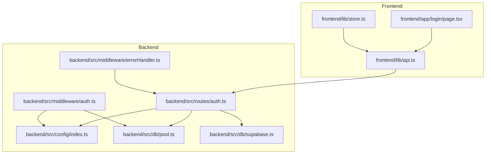
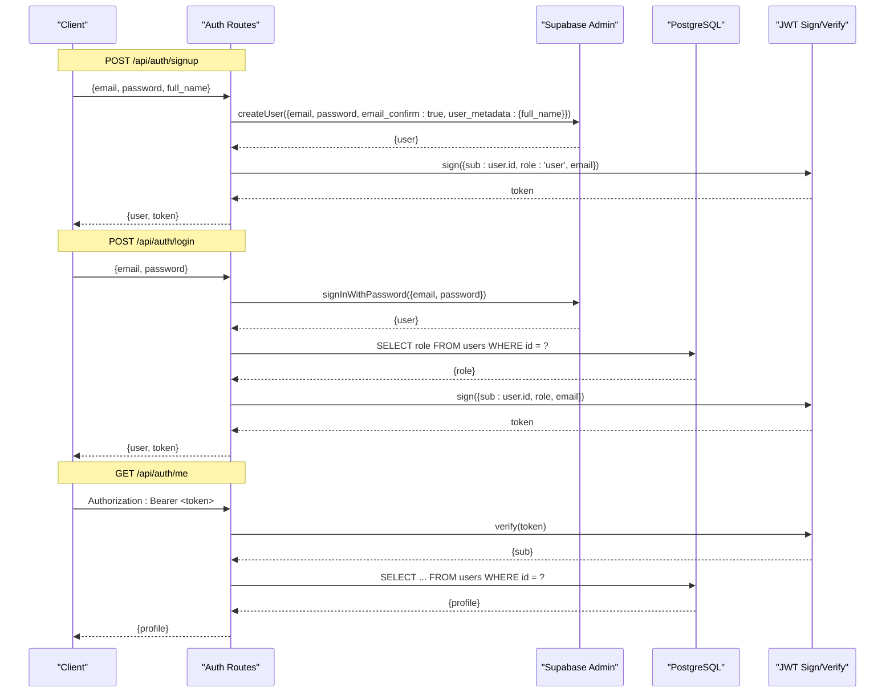
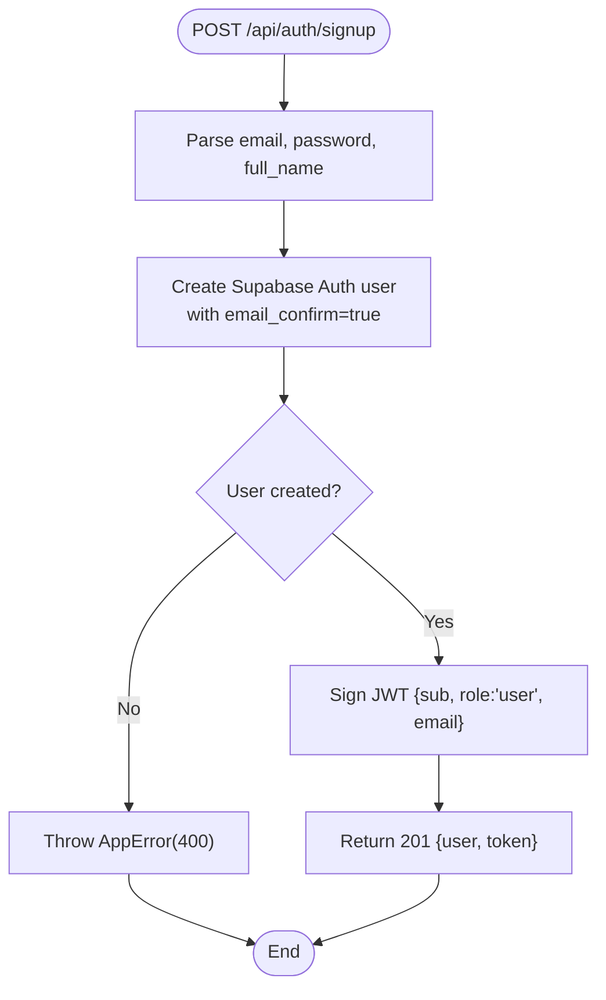
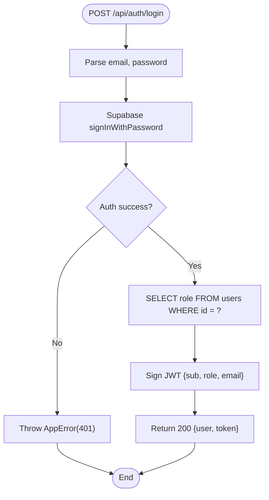
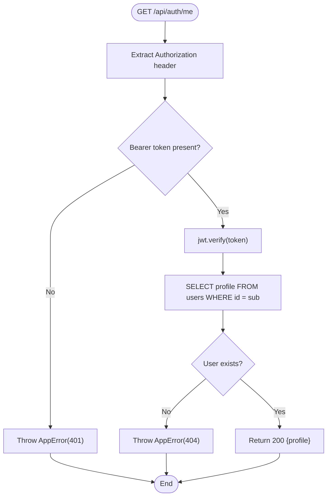
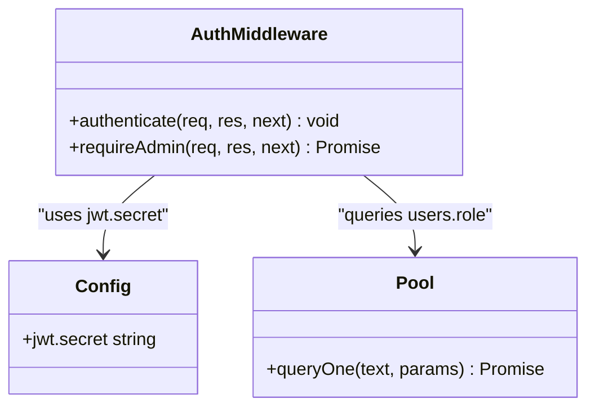
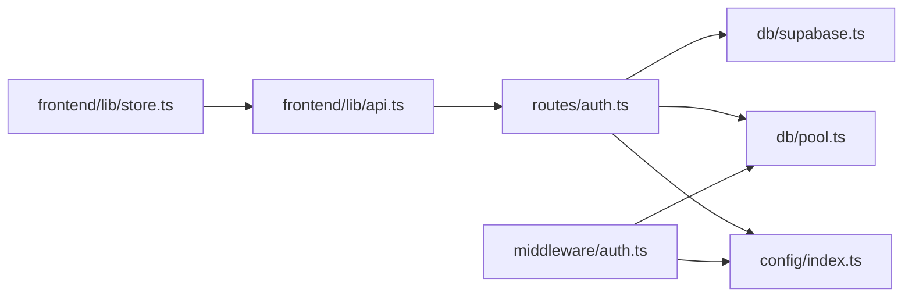

# Authentication API

<cite>
**Referenced Files in This Document**
- [auth.ts](file://backend/src/routes/auth.ts)
- [auth.ts](file://backend/src/middleware/auth.ts)
- [errorHandler.ts](file://backend/src/middleware/errorHandler.ts)
- [index.ts](file://backend/src/config/index.ts)
- [supabase.ts](file://backend/src/db/supabase.ts)
- [pool.ts](file://backend/src/db/pool.ts)
- [api.ts](file://frontend/lib/api.ts)
- [store.ts](file://frontend/lib/store.ts)
- [page.tsx](file://frontend/app/login/page.tsx)
- [001_initial_schema.sql](file://supabase/migrations/001_initial_schema.sql)
</cite>

## Table of Contents
1. Introduction
2. Project Structure
3. Core Components
4. Architecture Overview
5. Detailed Component Analysis
6. Dependency Analysis
7. Performance Considerations
8. Troubleshooting Guide
9. Conclusion
10. Appendices

## Introduction
This document provides comprehensive API documentation for the authentication endpoints, including signup, login, and profile retrieval. It explains request/response schemas, error handling, JWT-based authentication middleware usage, Supabase Auth integration, role-based token issuance, and security considerations. Client-side examples demonstrate how to handle authentication flows, store tokens securely, and process error responses.

## Project Structure
The authentication feature spans backend routes, middleware, configuration, database access, and frontend client utilities:
- Backend routes define /api/auth/signup, /api/auth/login, and /api/auth/me.
- Middleware validates JWTs and enforces roles.
- Configuration centralizes secrets and environment variables.
- Database layer queries user profiles and roles from PostgreSQL.
- Frontend API helpers encapsulate HTTP calls and token storage.

**Diagram sources**
- [auth.ts:1-98](file://backend/src/routes/auth.ts#L1-L98)
- [auth.ts:1-59](file://backend/src/middleware/auth.ts#L1-L59)
- [errorHandler.ts:1-56](file://backend/src/middleware/errorHandler.ts#L1-L56)
- [index.ts:1-49](file://backend/src/config/index.ts#L1-L49)
- [pool.ts:1-48](file://backend/src/db/pool.ts#L1-L48)
- [supabase.ts:1-21](file://backend/src/db/supabase.ts#L1-L21)
- [api.ts:1-78](file://frontend/lib/api.ts#L1-L78)
- [store.ts:1-39](file://frontend/lib/store.ts#L1-L39)
- [page.tsx:1-266](file://frontend/app/login/page.tsx#L1-L266)

**Section sources**
- [auth.ts:1-98](file://backend/src/routes/auth.ts#L1-L98)
- [auth.ts:1-59](file://backend/src/middleware/auth.ts#L1-L59)
- [errorHandler.ts:1-56](file://backend/src/middleware/errorHandler.ts#L1-L56)
- [index.ts:1-49](file://backend/src/config/index.ts#L1-L49)
- [pool.ts:1-48](file://backend/src/db/pool.ts#L1-L48)
- [supabase.ts:1-21](file://backend/src/db/supabase.ts#L1-L21)
- [api.ts:1-78](file://frontend/lib/api.ts#L1-L78)
- [store.ts:1-39](file://frontend/lib/store.ts#L1-L39)
- [page.tsx:1-266](file://frontend/app/login/page.tsx#L1-L266)

## Core Components
- Signup endpoint (POST /api/auth/signup): Creates a Supabase Auth user with email, password, and full_name; issues a JWT containing user id, role, and email.
- Login endpoint (POST /api/auth/login): Authenticates via Supabase Auth, reads role from the users table, and issues a JWT.
- Profile endpoint (GET /api/auth/me): Requires a valid Bearer token; returns the current user’s profile from the users table.
- Authentication middleware (authenticate, requireAdmin): Validates JWT and enforces admin role checks against the database.
- Error handling: Centralized AppError class and async handler wrapper ensure consistent error responses.
- Configuration: JWT secret and expiration are loaded from environment variables.
- Database: PostgreSQL pool used to query user data; Supabase Admin client used for auth operations.

**Section sources**
- [auth.ts:12-98](file://backend/src/routes/auth.ts#L12-L98)
- [auth.ts:18-59](file://backend/src/middleware/auth.ts#L18-L59)
- [errorHandler.ts:1-56](file://backend/src/middleware/errorHandler.ts#L1-L56)
- [index.ts:28-31](file://backend/src/config/index.ts#L28-L31)
- [pool.ts:34-48](file://backend/src/db/pool.ts#L34-L48)
- [supabase.ts:1-21](file://backend/src/db/supabase.ts#L1-L21)

## Architecture Overview
The authentication flow integrates Supabase Auth for identity management and a custom JWT for backend authorization. The signup flow creates an auth user and a corresponding row in the users table via a database trigger. The login flow authenticates via Supabase Auth, retrieves the user’s role from the database, and issues a JWT. Protected endpoints validate the JWT using middleware or inline verification.

**Diagram sources**
- [auth.ts:12-98](file://backend/src/routes/auth.ts#L12-L98)
- [supabase.ts:1-21](file://backend/src/db/supabase.ts#L1-L21)
- [pool.ts:34-48](file://backend/src/db/pool.ts#L34-L48)
- [index.ts:28-31](file://backend/src/config/index.ts#L28-L31)

## Detailed Component Analysis

### Signup Endpoint: POST /api/auth/signup
- Purpose: Create a new user in Supabase Auth and issue a backend JWT.
- Request body:
  - email: string (required)
  - password: string (required)
  - full_name: string (required)
- Behavior:
  - Uses Supabase Admin client to create a user with email confirmation enabled and stores full_name in user_metadata.
  - On success, signs a JWT with sub (user id), role set to 'user', and email.
  - Returns 201 with user object and token.
- Errors:
  - If creation fails, throws AppError with 400 status and message.
- Notes:
  - A database trigger auto-creates a users row on auth.user creation.

**Diagram sources**
- [auth.ts:12-41](file://backend/src/routes/auth.ts#L12-L41)
- [errorHandler.ts:4-28](file://backend/src/middleware/errorHandler.ts#L4-L28)

**Section sources**
- [auth.ts:12-41](file://backend/src/routes/auth.ts#L12-L41)
- [001_initial_schema.sql:278-294](file://supabase/migrations/001_initial_schema.sql#L278-L294)

### Login Endpoint: POST /api/auth/login
- Purpose: Authenticate a user and issue a JWT with role information.
- Request body:
  - email: string (required)
  - password: string (required)
- Behavior:
  - Authenticates via Supabase Auth.
  - Retrieves role from the users table by user id.
  - Signs a JWT with sub, role, and email.
  - Returns 200 with user object (including role) and token.
- Errors:
  - Invalid credentials throw AppError with 401 status.

**Diagram sources**
- [auth.ts:42-72](file://backend/src/routes/auth.ts#L42-L72)
- [pool.ts:42-48](file://backend/src/db/pool.ts#L42-L48)
- [errorHandler.ts:4-28](file://backend/src/middleware/errorHandler.ts#L4-L28)

**Section sources**
- [auth.ts:42-72](file://backend/src/routes/auth.ts#L42-L72)
- [pool.ts:42-48](file://backend/src/db/pool.ts#L42-L48)

### Profile Endpoint: GET /api/auth/me
- Purpose: Retrieve the current user’s profile.
- Authentication:
  - Requires Authorization header with Bearer token.
  - Token is verified using the configured JWT secret.
- Behavior:
  - Decodes token to obtain sub (user id).
  - Queries users table for profile fields.
  - Returns 200 with user profile if found.
- Errors:
  - Missing or invalid token throws AppError with 401.
  - User not found throws AppError with 404.

**Diagram sources**
- [auth.ts:74-98](file://backend/src/routes/auth.ts#L74-L98)
- [index.ts:28-31](file://backend/src/config/index.ts#L28-L31)
- [pool.ts:42-48](file://backend/src/db/pool.ts#L42-L48)
- [errorHandler.ts:4-28](file://backend/src/middleware/errorHandler.ts#L4-L28)

**Section sources**
- [auth.ts:74-98](file://backend/src/routes/auth.ts#L74-L98)

### Authentication Middleware
- authenticate:
  - Validates presence and format of Authorization header.
  - Verifies JWT using the configured secret.
  - Attaches userId and userRole to the request object.
  - Throws AppError(401) for missing or invalid tokens.
- requireAdmin:
  - Ensures the authenticated user has role 'admin' by querying the database.
  - Throws AppError(403) if not authorized.

**Diagram sources**
- [auth.ts:18-59](file://backend/src/middleware/auth.ts#L18-L59)
- [index.ts:28-31](file://backend/src/config/index.ts#L28-L31)
- [pool.ts:42-48](file://backend/src/db/pool.ts#L42-L48)

**Section sources**
- [auth.ts:18-59](file://backend/src/middleware/auth.ts#L18-L59)

### Error Handling
- AppError:
  - Custom error class with statusCode and isOperational flags.
  - Centralized error handler returns consistent JSON errors with status and message.
- asyncHandler:
  - Wraps route handlers to catch async errors and pass them to the global error handler.

**Section sources**
- [errorHandler.ts:4-56](file://backend/src/middleware/errorHandler.ts#L4-L56)

## Dependency Analysis
- Routes depend on:
  - Supabase Admin client for auth operations.
  - JWT library for signing and verifying tokens.
  - Database pool for reading user roles and profiles.
  - Configuration for JWT secret and expiration.
- Middleware depends on:
  - JWT verification and database queries for role enforcement.
- Frontend depends on:
  - API helpers to call endpoints and attach Authorization headers.
  - Store to persist tokens in localStorage.

**Diagram sources**
- [auth.ts:1-98](file://backend/src/routes/auth.ts#L1-L98)
- [auth.ts:1-59](file://backend/src/middleware/auth.ts#L1-L59)
- [supabase.ts:1-21](file://backend/src/db/supabase.ts#L1-L21)
- [pool.ts:1-48](file://backend/src/db/pool.ts#L1-L48)
- [index.ts:1-49](file://backend/src/config/index.ts#L1-L49)
- [api.ts:1-78](file://frontend/lib/api.ts#L1-L78)
- [store.ts:1-39](file://frontend/lib/store.ts#L1-L39)

**Section sources**
- [auth.ts:1-98](file://backend/src/routes/auth.ts#L1-L98)
- [auth.ts:1-59](file://backend/src/middleware/auth.ts#L1-L59)
- [supabase.ts:1-21](file://backend/src/db/supabase.ts#L1-L21)
- [pool.ts:1-48](file://backend/src/db/pool.ts#L1-L48)
- [index.ts:1-49](file://backend/src/config/index.ts#L1-L49)
- [api.ts:1-78](file://frontend/lib/api.ts#L1-L78)
- [store.ts:1-39](file://frontend/lib/store.ts#L1-L39)

## Performance Considerations
- JWT signing and verification are lightweight but should be cached where appropriate on the client side to avoid unnecessary network calls.
- Database queries for role and profile are simple single-row lookups; ensure indexes exist on users.id (primary key) which is already defined.
- Connection pooling parameters are tuned for typical workloads; monitor pool utilization under load and adjust max connections if needed.
- Avoid excessive re-authentication; reuse tokens until expiration and refresh only when necessary.

[No sources needed since this section provides general guidance]

## Troubleshooting Guide
- Invalid credentials:
  - Login returns 401 with message indicating invalid email or password.
- Missing or invalid token:
  - Profile endpoint returns 401 if Authorization header is missing or malformed.
  - Middleware returns 401 for invalid or expired tokens.
- User not found:
  - Profile endpoint returns 404 if the decoded sub does not correspond to a user in the users table.
- Unexpected server errors:
  - Global error handler returns 500 with a generic message for unhandled exceptions.

**Section sources**
- [auth.ts:46-98](file://backend/src/routes/auth.ts#L46-L98)
- [auth.ts:22-37](file://backend/src/middleware/auth.ts#L22-L37)
- [errorHandler.ts:16-47](file://backend/src/middleware/errorHandler.ts#L16-L47)

## Conclusion
The authentication system combines Supabase Auth for identity management with a custom JWT for backend authorization. The signup and login endpoints integrate seamlessly with Supabase and return tokens that include role information. Protected endpoints enforce authentication and can enforce role-based access control. Consistent error handling and centralized configuration improve reliability and maintainability.

[No sources needed since this section summarizes without analyzing specific files]

## Appendices

### API Definitions

#### POST /api/auth/signup
- Description: Create a new user and receive a JWT.
- Request body:
  - email: string (required)
  - password: string (required)
  - full_name: string (required)
- Success response (201):
  - user: object
    - id: string
    - email: string
    - full_name: string
  - token: string
- Error responses:
  - 400: Signup failed (e.g., duplicate email or invalid payload)

**Section sources**
- [auth.ts:12-41](file://backend/src/routes/auth.ts#L12-L41)

#### POST /api/auth/login
- Description: Authenticate and receive a JWT with role.
- Request body:
  - email: string (required)
  - password: string (required)
- Success response (200):
  - user: object
    - id: string
    - email: string
    - role: string ('user' | 'admin')
  - token: string
- Error responses:
  - 401: Invalid email or password

**Section sources**
- [auth.ts:42-72](file://backend/src/routes/auth.ts#L42-L72)

#### GET /api/auth/me
- Description: Retrieve the current user’s profile.
- Headers:
  - Authorization: Bearer <token>
- Success response (200):
  - id: string
  - email: string
  - full_name: string
  - phone: string?
  - avatar_url: string?
  - role: string
  - preferred_lang: string
  - created_at: string
- Error responses:
  - 401: Authentication required or invalid/expired token
  - 404: User not found

**Section sources**
- [auth.ts:74-98](file://backend/src/routes/auth.ts#L74-L98)

### Client Implementation Examples

- Token storage:
  - Tokens are stored in localStorage under the key 'auth_token'.
  - The store persists token across sessions and clears it on logout.

- Making authenticated requests:
  - Include Authorization header with Bearer token.
  - The API helper automatically attaches the token from arguments or localStorage.

- Handling errors:
  - Catch thrown errors from API calls and display messages to users.
  - Handle 401 responses by prompting re-login or token refresh.

**Section sources**
- [store.ts:14-38](file://frontend/lib/store.ts#L14-L38)
- [api.ts:7-35](file://frontend/lib/api.ts#L7-L35)
- [page.tsx:65-103](file://frontend/app/login/page.tsx#L65-L103)

### Security Considerations
- Use strong JWT secrets in production and rotate periodically.
- Enforce HTTPS for all endpoints to protect tokens in transit.
- Limit token lifetime and implement secure token refresh strategies.
- Validate and sanitize inputs on both client and server sides.
- Ensure RLS policies restrict access to sensitive data at the database level.
- Avoid logging sensitive data such as passwords or tokens.

[No sources needed since this section provides general guidance]