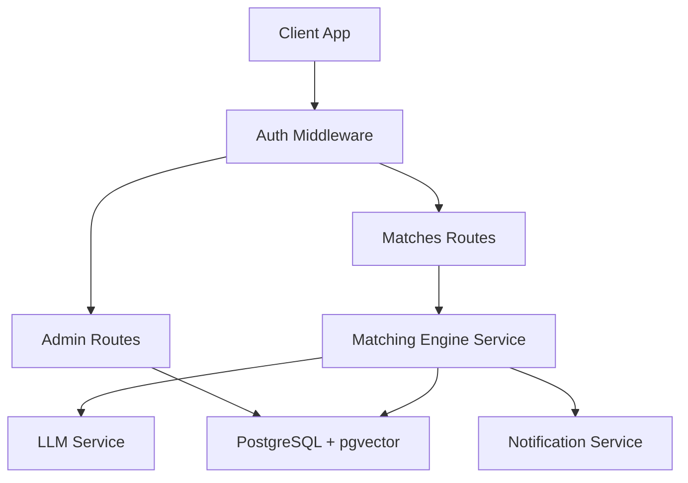
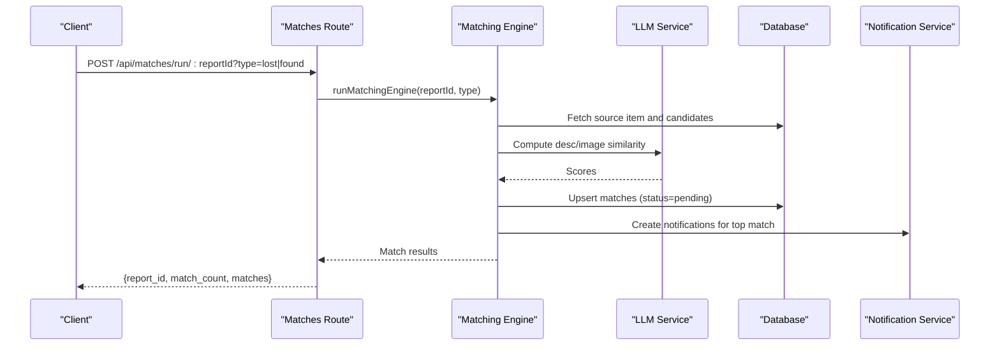
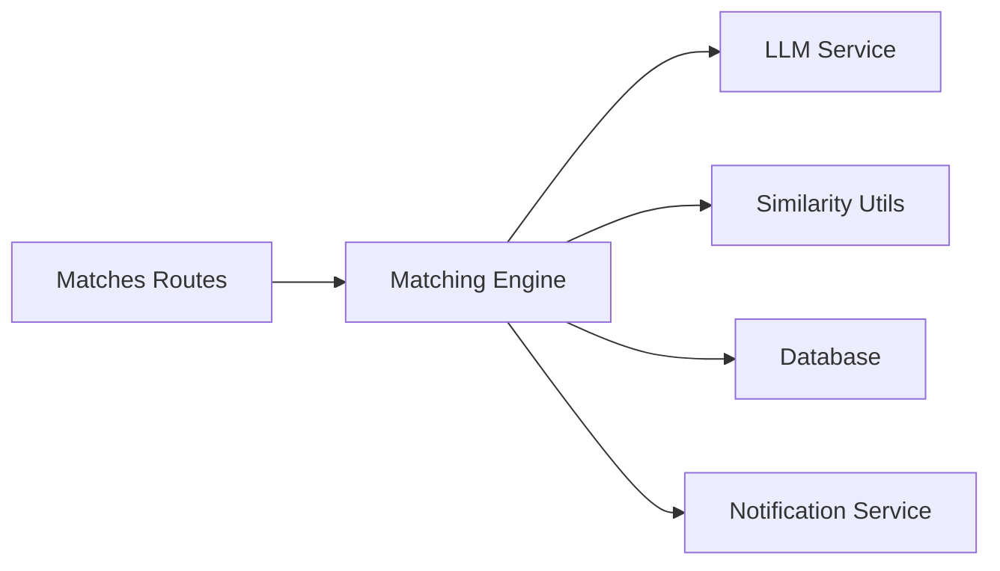

# Matches API

<cite>
**Referenced Files in This Document**
- [matches.ts](file://backend/src/routes/matches.ts)
- [matchingEngine.ts](file://backend/src/services/matchingEngine.ts)
- [similarity.ts](file://backend/src/utils/similarity.ts)
- [llmService.ts](file://backend/src/services/llmService.ts)
- [admin.ts](file://backend/src/routes/admin.ts)
- [config/index.ts](file://backend/src/config/index.ts)
- [001_initial_schema.sql](file://supabase/migrations/001_initial_schema.sql)
- [API_DOCUMENTATION.md](file://backend/API_DOCUMENTATION.md)
- [api.ts](file://frontend/lib/api.ts)
- [MatchCard.tsx](file://frontend/components/MatchCard.tsx)
</cite>

## Table of Contents
1. [Introduction](#introduction)
2. [Project Structure](#project-structure)
3. [Core Components](#core-components)
4. [Architecture Overview](#architecture-overview)
5. [Detailed Component Analysis](#detailed-component-analysis)
6. [Dependency Analysis](#dependency-analysis)
7. [Performance Considerations](#performance-considerations)
8. [Troubleshooting Guide](#troubleshooting-guide)
9. [Conclusion](#conclusion)
10. [Appendices](#appendices)

## Introduction
This document provides comprehensive API documentation for match discovery and management endpoints that power the Lost & Found AI Matcher. It covers:
- Discovering potential matches between lost and found items using AI-powered similarity scoring
- Creating, retrieving, and managing match states (pending, approved, rejected, disputed)
- Match object schemas with detailed breakdowns by dimensions (text, image, location, time, attributes)
- Filtering options including quality thresholds, sorting by relevance, and pagination support
- Integration examples for match workflows and handling different match states
- Rate limiting considerations for AI processing endpoints

## Project Structure
The backend exposes RESTful endpoints under /api grouped by feature:
- Authentication and reports
- Uploads
- Matches (discovery and retrieval)
- Verification (question/answer/judge)
- Notifications
- Admin operations (stats, match listing, approve/reject/flag/unflag)

**Diagram sources**
- [matches.ts:1-115](file://backend/src/routes/matches.ts#L1-L115)
- [admin.ts:1-389](file://backend/src/routes/admin.ts#L1-L389)
- [matchingEngine.ts:1-208](file://backend/src/services/matchingEngine.ts#L1-L208)
- [llmService.ts:1-120](file://backend/src/services/llmService.ts#L1-L120)
- [001_initial_schema.sql:145-166](file://supabase/migrations/001_initial_schema.sql#L145-L166)

**Section sources**
- [matches.ts:1-115](file://backend/src/routes/matches.ts#L1-L115)
- [admin.ts:1-389](file://backend/src/routes/admin.ts#L1-L389)
- [API_DOCUMENTATION.md:419-513](file://backend/API_DOCUMENTATION.md#L419-L513)

## Core Components
- Matching engine computes a weighted score across five dimensions: description (embedding cosine similarity), image (vision comparison), location (Haversine proximity), time (time-window overlap), and attributes (category/brand/colour).
- Match objects are persisted with per-dimension scores and an overall total_score. Only matches above a configurable threshold are stored and returned.
- Endpoints allow triggering matching for a specific report and retrieving existing matches for a report.
- Admin endpoints provide full lifecycle management: list with pagination/filtering, approve, reject, flag/unflag disputes/fraud.

Key configuration:
- Weights sum to 1.00; default minimum match score is 40%.
- Location radius and time window parameters control similarity decay curves.

**Section sources**
- [config/index.ts:33-47](file://backend/src/config/index.ts#L33-L47)
- [matchingEngine.ts:33-189](file://backend/src/services/matchingEngine.ts#L33-L189)
- [similarity.ts:22-82](file://backend/src/utils/similarity.ts#L22-L82)
- [llmService.ts:6-41](file://backend/src/services/llmService.ts#L6-L41)
- [llmService.ts:81-119](file://backend/src/services/llmService.ts#L81-L119)

## Architecture Overview
The match workflow integrates multiple services and data stores:

**Diagram sources**
- [matches.ts:15-45](file://backend/src/routes/matches.ts#L15-L45)
- [matchingEngine.ts:37-189](file://backend/src/services/matchingEngine.ts#L37-L189)
- [llmService.ts:81-119](file://backend/src/services/llmService.ts#L81-L119)

## Detailed Component Analysis

### Match Discovery Endpoint
- Method: POST
- Path: /api/matches/run/:reportId
- Query params:
  - type: required; one of "lost", "found"
- Authorization: Bearer JWT
- Behavior:
  - Validates ownership or admin role
  - Runs matching engine against active items from the opposite set
  - Computes dimension scores and total_score
  - Persists matches with status "pending" if total_score >= configured threshold
  - Returns summary with match_count and matches array

Response fields:
- report_id: string
- match_count: number
- matches: array of match objects (see schema below)

Error responses:
- 400: Invalid type parameter
- 404: Report not found
- 403: Access denied

**Section sources**
- [matches.ts:15-45](file://backend/src/routes/matches.ts#L15-L45)
- [API_DOCUMENTATION.md:423-463](file://backend/API_DOCUMENTATION.md#L423-L463)

### Match Retrieval Endpoint
- Method: GET
- Path: /api/matches/:reportId
- Query params:
  - type: required; one of "lost", "found"
- Authorization: Bearer JWT
- Behavior:
  - Validates ownership or admin role
  - Retrieves all matches for the given report, sorted by total_score descending
  - Joins relevant item details for display

Response:
- Array of match objects with joined fields (e.g., found_category, found_brand, found_colour, found_description, found_location, found_photo_url, found_at when type=lost; analogous lost_* fields when type=found)

Error responses:
- 400: Invalid type parameter
- 404: Report not found
- 403: Access denied

**Section sources**
- [matches.ts:52-114](file://backend/src/routes/matches.ts#L52-L114)
- [API_DOCUMENTATION.md:467-513](file://backend/API_DOCUMENTATION.md#L467-L513)

### Admin Match Management Endpoints
- List matches:
  - GET /api/admin/matches
  - Query params: page (default 1), limit (default 20), status (optional; pending, approved, rejected, disputed)
  - Response: { page, limit, matches[] }
- Approve match:
  - POST /api/admin/matches/:id/approve
  - Sets match status to "approved", updates related items to "verified", notifies both parties
- Reject match:
  - POST /api/admin/matches/:id/reject
  - Sets match status to "rejected", resets items back to "active" if they were "matched", notifies both parties
- Flag/unflag:
  - POST /api/admin/matches/:id/flag (requires reason)
  - POST /api/admin/matches/:id/unflag
  - Flags for review/dispute and notifies parties

All admin endpoints require authentication and admin role.

**Section sources**
- [admin.ts:53-83](file://backend/src/routes/admin.ts#L53-L83)
- [admin.ts:88-128](file://backend/src/routes/admin.ts#L88-L128)
- [admin.ts:133-180](file://backend/src/routes/admin.ts#L133-L180)
- [admin.ts:317-388](file://backend/src/routes/admin.ts#L317-L388)

### Match Object Schema
A match represents a pair of a lost item and a found item with a multi-dimensional similarity breakdown.

Fields:
- id: string (UUID)
- lost_item_id: string (UUID)
- found_item_id: string (UUID)
- total_score: number (0–100)
- desc_score: number (0–100)
- image_score: number (0–100)
- location_score: number (0–100)
- time_score: number (0–100)
- attr_score: number (0–100)
- status: enum ("pending", "approved", "rejected", "disputed")
- created_at: timestamp
- updated_at: timestamp

Retrieved via GET /api/matches/:reportId includes additional joined fields depending on type:
- When type=lost: found_id, found_category, found_brand, found_colour, found_description, found_location, found_photo_url, found_at, found_status
- When type=found: lost_id, lost_category, lost_brand, lost_colour, lost_description, lost_location, lost_photo_url, lost_at, lost_status

Notes:
- total_score is computed as a weighted sum of dimension scores
- Only matches with total_score >= minScoreThreshold are persisted and returned

**Section sources**
- [matchingEngine.ts:22-31](file://backend/src/services/matchingEngine.ts#L22-L31)
- [matchingEngine.ts:125-146](file://backend/src/services/matchingEngine.ts#L125-L146)
- [matchingEngine.ts:152-172](file://backend/src/services/matchingEngine.ts#L152-L172)
- [001_initial_schema.sql:145-166](file://supabase/migrations/001_initial_schema.sql#L145-L166)
- [matches.ts:75-111](file://backend/src/routes/matches.ts#L75-L111)

### Scoring Algorithm Details
- Description similarity:
  - Uses OpenAI embeddings and cosine similarity when available
  - Falls back to simple word overlap similarity if embeddings are missing
- Image similarity:
  - Vision model compares two images and returns a 0–100 score
  - If images cannot be compared, neutral score is used
- Location similarity:
  - Haversine distance converted to a 0–100 score with linear decay beyond configured radius
- Time similarity:
  - Score decays based on time difference relative to configured window
- Attribute similarity:
  - Compares category, brand, colour with field-specific weights

Weights and thresholds are configurable and documented in configuration.

**Section sources**
- [matchingEngine.ts:83-146](file://backend/src/services/matchingEngine.ts#L83-L146)
- [similarity.ts:22-82](file://backend/src/utils/similarity.ts#L22-L82)
- [llmService.ts:6-41](file://backend/src/services/llmService.ts#L6-L41)
- [llmService.ts:81-119](file://backend/src/services/llmService.ts#L81-L119)
- [config/index.ts:33-47](file://backend/src/config/index.ts#L33-L47)

### Match Workflow Integration Examples
- Trigger matching after creating a lost or found report:
  - Call POST /api/matches/run/:reportId?type=lost|found
  - Use response.match_count and matches to update UI
- Retrieve matches for a report:
  - Call GET /api/matches/:reportId?type=lost|found
  - Sort by total_score descending (already ordered server-side)
- Admin review:
  - List matches with optional status filter and pagination
  - Approve or reject matches; system updates item statuses and sends notifications

Frontend integration:
- The client library exposes methods to run matches and retrieve them
- Match cards display dimension scores and actions based on user role and match status

**Section sources**
- [API_DOCUMENTATION.md:423-513](file://backend/API_DOCUMENTATION.md#L423-L513)
- [api.ts:163-218](file://frontend/lib/api.ts#L163-L218)
- [MatchCard.tsx:17-332](file://frontend/components/MatchCard.tsx#L17-L332)

## Dependency Analysis
The matching pipeline depends on several services and database structures:

- Matches routes depend on authentication middleware and database pool
- Matching engine orchestrates similarity computations and persistence
- LLM service provides text embeddings and image comparison
- Similarity utils compute location/time/attribute scores
- Notifications are sent for new matches and admin actions

**Diagram sources**
- [matches.ts:1-115](file://backend/src/routes/matches.ts#L1-L115)
- [matchingEngine.ts:1-208](file://backend/src/services/matchingEngine.ts#L1-L208)
- [llmService.ts:1-120](file://backend/src/services/llmService.ts#L1-L120)
- [similarity.ts:1-83](file://backend/src/utils/similarity.ts#L1-L83)

**Section sources**
- [matchingEngine.ts:1-208](file://backend/src/services/matchingEngine.ts#L1-L208)
- [llmService.ts:1-120](file://backend/src/services/llmService.ts#L1-L120)
- [similarity.ts:1-83](file://backend/src/utils/similarity.ts#L1-L83)

## Performance Considerations
- AI processing endpoints (description embedding, image comparison) can be rate-limited by external providers
- The matching engine processes all active candidate items; consider batching or caching strategies for large datasets
- Minimum score threshold reduces storage and query load by filtering low-quality matches
- Pagination and status filters on admin endpoints help manage large match lists efficiently
- Implement client-side retry logic with exponential backoff for AI calls to handle transient errors

[No sources needed since this section provides general guidance]

## Troubleshooting Guide
Common issues and resolutions:
- 400 Bad Request: Ensure type parameter is "lost" or "found" for match endpoints
- 404 Not Found: Verify report ID exists and belongs to the authenticated user or admin context
- 403 Forbidden: Check user role and ownership permissions
- 429 Too Many Requests: External AI provider rate limits may apply; implement retries and backoff
- Verification flow:
  - Ensure claimant can retrieve question and submit answers
  - Finder must judge answers correctly to proceed
  - Escalation occurs when max attempts exceeded

Error responses follow a consistent shape with message fields.

**Section sources**
- [API_DOCUMENTATION.md:782-800](file://backend/API_DOCUMENTATION.md#L782-L800)
- [matches.ts:19-36](file://backend/src/routes/matches.ts#L19-L36)
- [admin.ts:88-180](file://backend/src/routes/admin.ts#L88-L180)

## Conclusion
The Matches API provides robust AI-powered match discovery and management capabilities. It supports:
- Multi-dimensional similarity scoring with configurable weights and thresholds
- Secure access controls ensuring only report owners or admins can trigger or view matches
- Comprehensive admin tools for reviewing, approving, rejecting, and flagging matches
- Clear schemas and responses enabling seamless frontend integration
- Notification systems to keep users informed throughout the match lifecycle

For optimal performance and reliability, implement rate limiting, caching, and retry strategies around AI-dependent operations.

[No sources needed since this section summarizes without analyzing specific files]

## Appendices

### API Reference Summary
- POST /api/matches/run/:reportId?type=lost|found
  - Triggers matching engine for a specific report
  - Returns report_id, match_count, matches[]
- GET /api/matches/:reportId?type=lost|found
  - Retrieves existing matches for a report
  - Returns array of match objects with joined item details
- GET /api/admin/matches?page=&limit=&status=
  - Lists all matches with pagination and optional status filter
- POST /api/admin/matches/:id/approve
  - Approves a match and updates item statuses
- POST /api/admin/matches/:id/reject
  - Rejects a match and resets item statuses
- POST /api/admin/matches/:id/flag
  - Flags a match for dispute/fraud review
- POST /api/admin/matches/:id/unflag
  - Removes fraud/dispute flag from a match

**Section sources**
- [API_DOCUMENTATION.md:423-513](file://backend/API_DOCUMENTATION.md#L423-L513)
- [admin.ts:53-388](file://backend/src/routes/admin.ts#L53-L388)

### Database Schema Reference
- matches table stores pairs with scoring breakdown and status
- Enums define valid statuses for items, matches, verification, and notifications
- Indexes optimize queries for user-based lookups, status filtering, and score-based sorting

**Section sources**
- [001_initial_schema.sql:14-49](file://supabase/migrations/001_initial_schema.sql#L14-L49)
- [001_initial_schema.sql:145-166](file://supabase/migrations/001_initial_schema.sql#L145-L166)
- [001_initial_schema.sql:239-258](file://supabase/migrations/001_initial_schema.sql#L239-L258)