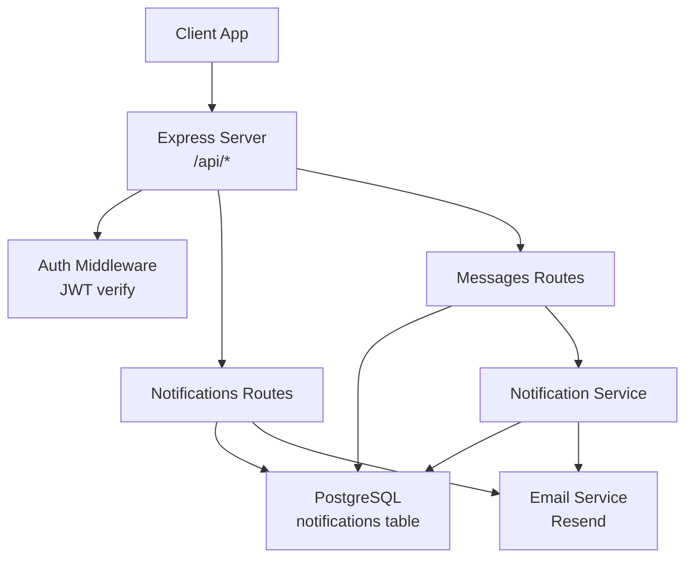
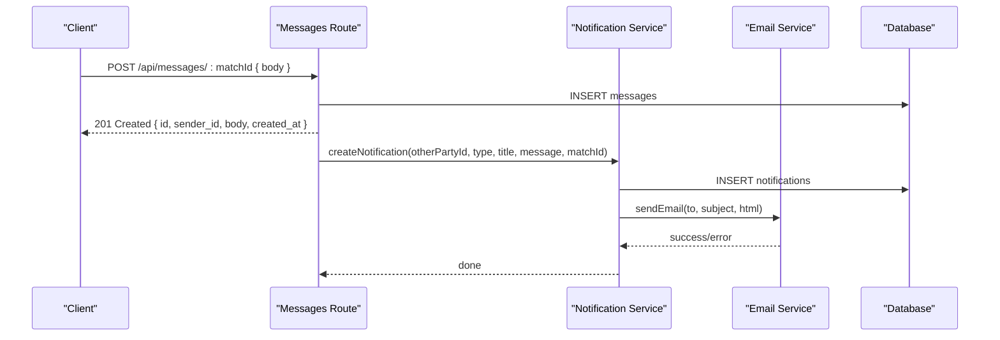
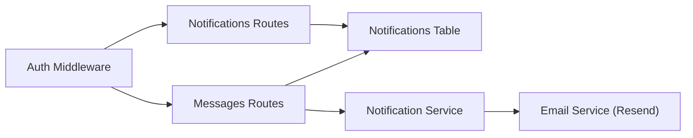

# Notifications & Messages API

<cite>
**Referenced Files in This Document**
- [server.ts](file://backend/src/server.ts)
- [notifications.ts](file://backend/src/routes/notifications.ts)
- [messages.ts](file://backend/src/routes/messages.ts)
- [notificationService.ts](file://backend/src/services/notificationService.ts)
- [emailService.ts](file://backend/src/services/emailService.ts)
- [auth.ts](file://backend/src/middleware/auth.ts)
- [001_initial_schema.sql](file://supabase/migrations/001_initial_schema.sql)
- [002_messages.sql](file://supabase/migrations/002_messages.sql)
- [index.ts](file://backend/src/config/index.ts)
- [API_DOCUMENTATION.md](file://backend/API_DOCUMENTATION.md)
</cite>

## Table of Contents
1. [Introduction](#introduction)
2. [Project Structure](#project-structure)
3. [Core Components](#core-components)
4. [Architecture Overview](#architecture-overview)
5. [Detailed Component Analysis](#detailed-component-analysis)
6. [Dependency Analysis](#dependency-analysis)
7. [Performance Considerations](#performance-considerations)
8. [Troubleshooting Guide](#troubleshooting-guide)
9. [Conclusion](#conclusion)
10. [Appendices](#appendices)

## Introduction
This document provides comprehensive API documentation for notification and messaging endpoints in the Lost & Found AI Matcher backend. It covers:
- Notification endpoints for listing, marking read, and counting unread notifications
- Email notifications via Resend integration
- Messaging endpoints for secure communication between verified parties
- Data schemas for notifications and messages
- Real-time capabilities, message encryption considerations, moderation features
- Examples for implementing listeners, threading, and offline handling
- Rate limiting and delivery guarantees

## Project Structure
The notification and messaging features are implemented as Express routes backed by a PostgreSQL database (via Supabase). Authentication is enforced with JWT middleware. Email notifications are sent through Resend. Database schema defines tables for notifications and messages, along with row-level security policies to restrict access to authorized users.

**Diagram sources**
- [server.ts:18-43](file://backend/src/server.ts#L18-L43)
- [notifications.ts:6-8](file://backend/src/routes/notifications.ts#L6-L8)
- [messages.ts:9-11](file://backend/src/routes/messages.ts#L9-L11)
- [notificationService.ts:19-62](file://backend/src/services/notificationService.ts#L19-L62)
- [emailService.ts:15-31](file://backend/src/services/emailService.ts#L15-L31)

**Section sources**
- [server.ts:18-43](file://backend/src/server.ts#L18-L43)
- [notifications.ts:6-8](file://backend/src/routes/notifications.ts#L6-L8)
- [messages.ts:9-11](file://backend/src/routes/messages.ts#L9-L11)

## Core Components
- Authentication middleware validates JWT tokens and attaches user identity and role to requests.
- Notification routes provide paginated listing, unread filtering, mark-as-read, and count endpoints.
- Message routes enforce that only participants of an approved match can send or view messages.
- Notification service creates in-app notifications and optionally sends emails via Resend.
- Email service integrates with Resend to deliver HTML email notifications.
- Database schema defines tables for notifications and messages, including indexes and RLS policies.

**Section sources**
- [auth.ts:22-37](file://backend/src/middleware/auth.ts#L22-L37)
- [notifications.ts:14-84](file://backend/src/routes/notifications.ts#L14-L84)
- [messages.ts:23-64](file://backend/src/routes/messages.ts#L23-L64)
- [notificationService.ts:19-62](file://backend/src/services/notificationService.ts#L19-L62)
- [emailService.ts:15-31](file://backend/src/services/emailService.ts#L15-L31)
- [001_initial_schema.sql:204-221](file://supabase/migrations/001_initial_schema.sql#L204-L221)
- [002_messages.sql:8-52](file://supabase/migrations/002_messages.sql#L8-L52)

## Architecture Overview
The system uses a request-response model for both notifications and messages. When a message is posted, the server persists it and triggers a notification to the other party. The notification service may also send an email via Resend. All endpoints require authentication; message endpoints additionally require the match to be approved and the requester to be a participant.

**Diagram sources**
- [messages.ts:97-135](file://backend/src/routes/messages.ts#L97-L135)
- [notificationService.ts:19-62](file://backend/src/services/notificationService.ts#L19-L62)
- [emailService.ts:15-31](file://backend/src/services/emailService.ts#L15-L31)

## Detailed Component Analysis

### Notifications API
- GET /api/notifications
  - Purpose: List authenticated user’s notifications with pagination and optional unread filter.
  - Query parameters: page (default 1), limit (default 20), unread (true/false).
  - Response includes notifications array, unread_count, page, limit.
  - Notes: Results ordered newest first; unread filter applies when query param is true.
- PATCH /api/notifications/read-all
  - Purpose: Mark all notifications for the authenticated user as read.
- GET /api/notifications/count
  - Purpose: Return unread notification count for the authenticated user.
- PATCH /api/notifications/:id/read
  - Purpose: Mark a specific notification as read for the authenticated user.

Security and access control:
- All endpoints require a valid JWT token via Authorization header.
- Row-level security ensures users see only their own notifications.

Data model (notifications):
- Fields: id, user_id, type, title, message, match_id (nullable), item_id (nullable), item_type (nullable), is_read (boolean), email_sent (boolean), created_at.
- Indexes: on user_id and is_read for efficient queries.

**Section sources**
- [notifications.ts:14-84](file://backend/src/routes/notifications.ts#L14-L84)
- [001_initial_schema.sql:204-221](file://supabase/migrations/001_initial_schema.sql#L204-L221)
- [001_initial_schema.sql:352-357](file://supabase/migrations/001_initial_schema.sql#L352-L357)

### Messaging API
- GET /api/messages/:matchId
  - Purpose: Retrieve full message thread for a match, ordered oldest first.
  - Access: Only participants of an approved match (or admin).
  - Response: messages array with id, sender_id, sender_name, body, created_at.
- POST /api/messages/:matchId
  - Purpose: Send a message in the match thread.
  - Validation: body required, length between 1 and 2000 characters.
  - Access: Only participants of an approved match (or admin).
  - Side effects: Creates a notification for the other party (and optionally an email).
  - Response: 201 Created with message fields.

Security and access control:
- JWT authentication required.
- Server-side verification ensures match status is approved and requester is a participant.
- Database-level RLS enforces that only approved match participants can read or insert messages.

Data model (messages):
- Fields: id (UUID), match_id (FK to matches), sender_id (FK to users), body (TEXT, 1–2000 chars), created_at.
- Indexes: on match_id and created_at; on sender_id.

Moderation and safety:
- Body length validation prevents excessively long messages.
- RLS policies prevent unauthorized access to message threads.

**Section sources**
- [messages.ts:23-64](file://backend/src/routes/messages.ts#L23-L64)
- [messages.ts:71-90](file://backend/src/routes/messages.ts#L71-L90)
- [messages.ts:97-135](file://backend/src/routes/messages.ts#L97-L135)
- [002_messages.sql:8-52](file://supabase/migrations/002_messages.sql#L8-L52)

### Notification Service and Email Integration
- createNotification(userId, type, title, message, itemId?, itemType?, matchId?)
  - Inserts an in-app notification record.
  - Fetches user email and full name.
  - Sends email via Resend if configured; marks notification as email_sent upon success.
  - Non-fatal email errors do not prevent in-app notification creation.

Email service:
- Uses Resend client configured from environment variables.
- Skips sending if API key is missing; logs warning.
- Throws error if Resend returns an error.

Email template:
- Simple HTML template with personalized greeting, message content, and action link to app.

**Section sources**
- [notificationService.ts:19-62](file://backend/src/services/notificationService.ts#L19-L62)
- [emailService.ts:15-31](file://backend/src/services/emailService.ts#L15-L31)
- [index.ts:23-26](file://backend/src/config/index.ts#L23-L26)

### Real-Time Capabilities
Current implementation:
- No real-time transport (WebSocket/SSE) is implemented in the backend.
- Clients should poll GET /api/notifications and GET /api/messages/:matchId to receive updates.
- Use GET /api/notifications/count to efficiently check for new unread items.

Recommendations for real-time:
- Implement SSE or WebSocket to push new notifications and messages to clients.
- Maintain per-user channels and handle reconnection and offline queuing.

[No sources needed since this section provides conceptual guidance]

### Message Encryption Considerations
- End-to-end encryption is not implemented in the current codebase.
- Transport security is provided by HTTPS/TLS at the application layer.
- For sensitive communications, consider client-side encryption before sending payloads to the server.

[No sources needed since this section provides conceptual guidance]

### Moderation Features
- Input validation limits message body length to 2000 characters.
- Database constraints enforce minimum and maximum lengths.
- Access controls ensure only approved match participants can communicate.

**Section sources**
- [messages.ts:14-16](file://backend/src/routes/messages.ts#L14-L16)
- [002_messages.sql:12-13](file://supabase/migrations/002_messages.sql#L12-L13)

### Examples and Implementation Guidance

- Implementing notification listeners:
  - Poll GET /api/notifications with pagination and unread filter.
  - Use GET /api/notifications/count to detect new unread items.
  - On new items, fetch details and render in UI.
  - Mark individual or all notifications as read using PATCH endpoints.

- Message threading:
  - Use GET /api/messages/:matchId to load conversation history.
  - Post new messages with POST /api/messages/:matchId.
  - Ensure match status is approved before enabling chat UI.

- Offline message handling:
  - Cache last known messages locally.
  - On reconnect, fetch latest thread and reconcile differences.
  - Queue outgoing messages until connection is established.

[No sources needed since this section provides conceptual guidance]

## Dependency Analysis
- Authentication dependency: All notification and message routes depend on JWT-based authentication middleware.
- Database dependency: Both features rely on PostgreSQL via Supabase pool; notifications and messages have dedicated tables and indexes.
- Email dependency: Notification service depends on Resend for email delivery; configuration is environment-driven.
- Security dependency: Row-level security policies enforce data isolation for messages and notifications.

**Diagram sources**
- [auth.ts:22-37](file://backend/src/middleware/auth.ts#L22-L37)
- [notifications.ts:6-8](file://backend/src/routes/notifications.ts#L6-L8)
- [messages.ts:9-11](file://backend/src/routes/messages.ts#L9-L11)
- [notificationService.ts:19-62](file://backend/src/services/notificationService.ts#L19-L62)
- [emailService.ts:15-31](file://backend/src/services/emailService.ts#L15-L31)

**Section sources**
- [auth.ts:22-37](file://backend/src/middleware/auth.ts#L22-L37)
- [notifications.ts:6-8](file://backend/src/routes/notifications.ts#L6-L8)
- [messages.ts:9-11](file://backend/src/routes/messages.ts#L9-L11)
- [notificationService.ts:19-62](file://backend/src/services/notificationService.ts#L19-L62)
- [emailService.ts:15-31](file://backend/src/services/emailService.ts#L15-L31)

## Performance Considerations
- Pagination: Notification listing supports page and limit parameters to reduce payload size.
- Indexes: Efficient querying via indexes on notifications(user_id, is_read) and messages(match_id, created_at).
- Rate limiting: Global rate limiter applied to /api endpoints to protect against abuse.
- Email delivery: Asynchronous email sending is non-blocking; failures do not block in-app notifications.

**Section sources**
- [notifications.ts:40-68](file://backend/src/routes/notifications.ts#L40-L68)
- [001_initial_schema.sql:256-257](file://supabase/migrations/001_initial_schema.sql#L256-L257)
- [002_messages.sql:19-20](file://supabase/migrations/002_messages.sql#L19-L20)
- [server.ts:25-30](file://backend/src/server.ts#L25-L30)

## Troubleshooting Guide
Common issues and resolutions:
- Missing or invalid JWT: Ensure Authorization header contains a valid Bearer token.
- Access denied to messages: Verify match status is approved and requester is a participant.
- Email not received: Check Resend API key configuration; review logs for send errors.
- Rate limit exceeded: Reduce request frequency; implement backoff and retry logic.

Error responses:
- Standardized error shape with message field.
- Status codes include 400, 401, 403, 404, 429.

**Section sources**
- [auth.ts:22-37](file://backend/src/middleware/auth.ts#L22-L37)
- [messages.ts:43-58](file://backend/src/routes/messages.ts#L43-L58)
- [emailService.ts:15-31](file://backend/src/services/emailService.ts#L15-L31)
- [API_DOCUMENTATION.md:782-800](file://backend/API_DOCUMENTATION.md#L782-L800)

## Conclusion
The notification and messaging subsystem provides robust, secure, and scalable APIs for in-app notifications and private messaging between verified parties. Notifications support pagination, unread filtering, and email delivery via Resend. Messaging enforces strict access controls and integrates with notifications to keep users informed. While real-time delivery is not currently implemented, the design allows straightforward extension with SSE or WebSockets. Rate limiting and database indexing help maintain performance under load.

[No sources needed since this section summarizes without analyzing specific files]

## Appendices

### API Reference Summary

- Notifications
  - GET /api/notifications?page=1&limit=20&unread=true
    - Returns notifications array, unread_count, page, limit
  - PATCH /api/notifications/read-all
    - Marks all notifications as read
  - GET /api/notifications/count
    - Returns unread_count
  - PATCH /api/notifications/:id/read
    - Marks a single notification as read

- Messages
  - GET /api/messages/:matchId
    - Returns messages array for the match thread
  - POST /api/messages/:matchId
    - Creates a new message; returns 201 with message fields

- Authentication
  - Include Authorization: Bearer <token> header

- Error Handling
  - Errors return JSON with message field
  - Common statuses: 400, 401, 403, 404, 429

**Section sources**
- [notifications.ts:14-84](file://backend/src/routes/notifications.ts#L14-L84)
- [messages.ts:71-135](file://backend/src/routes/messages.ts#L71-L135)
- [API_DOCUMENTATION.md:638-686](file://backend/API_DOCUMENTATION.md#L638-L686)
- [API_DOCUMENTATION.md:782-800](file://backend/API_DOCUMENTATION.md#L782-L800)

### Data Schemas

- Notification object
  - Fields: id, type, title, message, match_id (nullable), item_id (nullable), item_type (nullable), is_read, email_sent, created_at
  - Types: notification_type enum values include new_match, verification_question, verification_result, match_approved, match_rejected, item_returned, admin_message

- Message object
  - Fields: id, match_id, sender_id, body, created_at
  - Constraints: body length 1–2000 characters

- Conversation structure
  - A conversation is a set of messages associated with a match_id
  - Ordered by created_at ascending for display

**Section sources**
- [001_initial_schema.sql:41-49](file://supabase/migrations/001_initial_schema.sql#L41-L49)
- [001_initial_schema.sql:204-221](file://supabase/migrations/001_initial_schema.sql#L204-L221)
- [002_messages.sql:8-14](file://supabase/migrations/002_messages.sql#L8-L14)

### Rate Limiting and Delivery Guarantees

- Rate limiting
  - Global limiter: 100 requests per 15 minutes across /api endpoints
  - Exceeding limit returns 429 with error message

- Delivery guarantees
  - In-app notifications are persisted immediately
  - Email delivery is best-effort; failures do not block in-app notifications
  - No built-in retry mechanism for emails; consider adding queueing for reliability

**Section sources**
- [server.ts:25-30](file://backend/src/server.ts#L25-L30)
- [notificationService.ts:42-61](file://backend/src/services/notificationService.ts#L42-L61)
- [emailService.ts:15-31](file://backend/src/services/emailService.ts#L15-L31)