# Reports API

<cite>
**Referenced Files in This Document**
- [reports.ts](file://backend/src/routes/reports.ts)
- [uploadService.ts](file://backend/src/services/uploadService.ts)
- [auth.ts](file://backend/src/middleware/auth.ts)
- [validate.ts](file://backend/src/middleware/validate.ts)
- [errorHandler.ts](file://backend/src/middleware/errorHandler.ts)
- [matchingEngine.ts](file://backend/src/services/matchingEngine.ts)
- [embeddingSearch.ts](file://backend/src/services/embeddingSearch.ts)
- [pool.ts](file://backend/src/db/pool.ts)
- [001_initial_schema.sql](file://supabase/migrations/001_initial_schema.sql)
- [API_DOCUMENTATION.md](file://backend/API_DOCUMENTATION.md)
</cite>

## Table of Contents
1. [Introduction](#introduction)
2. [Project Structure](#project-structure)
3. [Core Components](#core-components)
4. [Architecture Overview](#architecture-overview)
5. [Detailed Component Analysis](#detailed-component-analysis)
6. [Dependency Analysis](#dependency-analysis)
7. [Performance Considerations](#performance-considerations)
8. [Troubleshooting Guide](#troubleshooting-guide)
9. [Conclusion](#conclusion)
10. [Appendices](#appendices)

## Introduction
This document provides detailed API documentation for report management endpoints that support CRUD operations for lost and found items. It covers creating reports with rich metadata (category, brand, color, location, photos), retrieving individual or paginated reports with filtering by type and status, updating item statuses via admin endpoints, and deleting or closing items through administrative controls. It also documents request/response schemas, validation rules, image upload handling, search capabilities using embeddings, and common workflows with error handling patterns.

## Project Structure
The backend exposes RESTful routes under /api/reports for authenticated users to create and retrieve reports, and under /api/admin for administrative updates and moderation. Image uploads are handled via a dedicated service that optimizes images and stores them in Supabase Storage. Matching and similarity search leverage vector embeddings stored in PostgreSQL with pgvector.

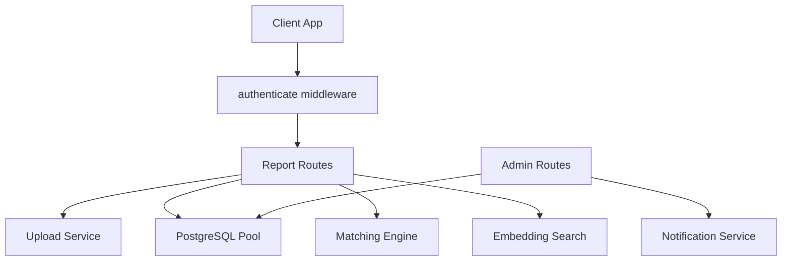

**Diagram sources**
- [reports.ts:1-356](file://backend/src/routes/reports.ts#L1-L356)
- [uploadService.ts:1-66](file://backend/src/services/uploadService.ts#L1-L66)
- [auth.ts:1-59](file://backend/src/middleware/auth.ts#L1-L59)
- [matchingEngine.ts:1-208](file://backend/src/services/matchingEngine.ts#L1-L208)
- [embeddingSearch.ts:1-101](file://backend/src/services/embeddingSearch.ts#L1-L101)
- [pool.ts:1-48](file://backend/src/db/pool.ts#L1-L48)

**Section sources**
- [reports.ts:1-356](file://backend/src/routes/reports.ts#L1-L356)
- [API_DOCUMENTATION.md:1-802](file://backend/API_DOCUMENTATION.md#L1-L802)

## Core Components
- Authentication middleware validates JWT tokens and attaches user identity and role to requests.
- Validation middleware enforces structured request bodies using Joi schemas for lost and found reports.
- Report routes implement:
  - Photo upload endpoint returning a public URL.
  - Create endpoints for lost and found items with optional LLM-based field extraction and embedding generation.
  - List endpoint for active reports with pagination and type filtering.
  - Get endpoints for individual reports with privacy-aware responses.
- Admin routes provide status updates and moderation actions on matches and items.
- Matching engine computes weighted scores across description, image, location, time, and attributes, persisting matches and sending notifications.
- Embedding search performs fast cosine similarity lookups against pgvector indices.

**Section sources**
- [auth.ts:1-59](file://backend/src/middleware/auth.ts#L1-L59)
- [validate.ts:1-61](file://backend/src/middleware/validate.ts#L1-L61)
- [reports.ts:1-356](file://backend/src/routes/reports.ts#L1-L356)
- [admin.ts:1-389](file://backend/src/routes/admin.ts#L1-L389)
- [matchingEngine.ts:1-208](file://backend/src/services/matchingEngine.ts#L1-L208)
- [embeddingSearch.ts:1-101](file://backend/src/services/embeddingSearch.ts#L1-L101)

## Architecture Overview
The report workflow integrates authentication, validation, storage, matching, and search services. When a report is created, the system optionally extracts structured fields from free-text descriptions, generates embeddings, persists the record, runs matching, and returns immediate similar items based on embeddings. Retrieval endpoints enforce ownership and privacy rules. Admin endpoints allow status transitions and moderation.

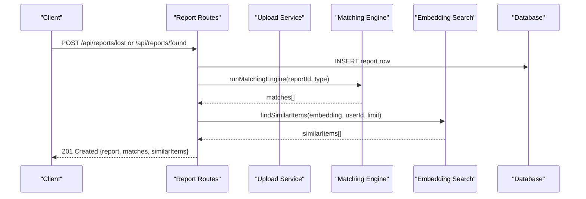

**Diagram sources**
- [reports.ts:98-247](file://backend/src/routes/reports.ts#L98-L247)
- [matchingEngine.ts:37-189](file://backend/src/services/matchingEngine.ts#L37-L189)
- [embeddingSearch.ts:30-101](file://backend/src/services/embeddingSearch.ts#L30-L101)

## Detailed Component Analysis

### Authentication and Authorization
- All report routes require a Bearer token; middleware verifies JWT and attaches userId and userRole.
- Ownership checks restrict access to user-specific endpoints; admins can view any user’s reports.
- Admin-only endpoints require an admin role verified against the database.

**Section sources**
- [auth.ts:22-59](file://backend/src/middleware/auth.ts#L22-L59)
- [reports.ts:13-14](file://backend/src/routes/reports.ts#L13-L14)
- [reports.ts:253-279](file://backend/src/routes/reports.ts#L253-L279)

### Request Validation Schemas
- Lost report schema requires category, description, location, lost_at; optional brand, colour, photo_url, identifying_info; latitude and longitude validated within geographic bounds.
- Found report schema requires category, description, location, found_at; optional brand, colour, photo_url, private_details; latitude and longitude validated within geographic bounds.
- Validation errors return 400 with aggregated messages.

**Section sources**
- [validate.ts:27-51](file://backend/src/middleware/validate.ts#L27-L51)
- [validate.ts:8-23](file://backend/src/middleware/validate.ts#L8-L23)

### Image Upload Handling
- Endpoint accepts multipart form data with a single file field named photo.
- Allowed MIME types include JPEG, PNG, WebP, HEIC; maximum file size is 5 MB.
- Images are optimized (auto-orient, resized to max width 1280px, converted to WebP at quality 82) and uploaded to Supabase Storage bucket item-photos.
- Returns a public URL for the processed image.

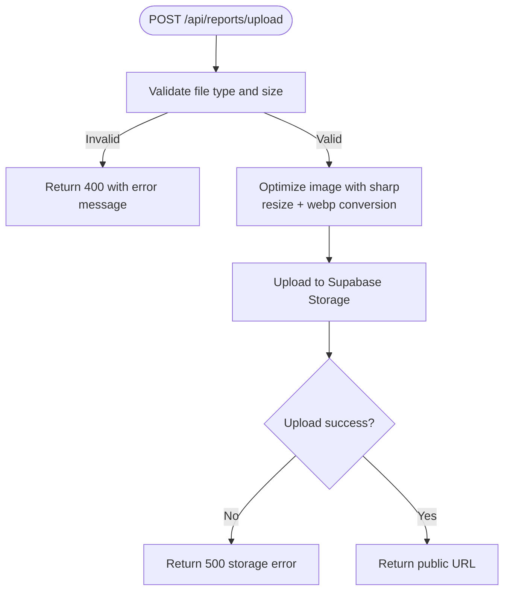

**Diagram sources**
- [uploadService.ts:14-27](file://backend/src/services/uploadService.ts#L14-L27)
- [uploadService.ts:34-65](file://backend/src/services/uploadService.ts#L34-L65)
- [reports.ts:21-33](file://backend/src/routes/reports.ts#L21-L33)

**Section sources**
- [uploadService.ts:1-66](file://backend/src/services/uploadService.ts#L1-L66)
- [reports.ts:21-33](file://backend/src/routes/reports.ts#L21-L33)

### Create Lost Report
- Validates body against lost report schema.
- Optionally extracts structured fields from long descriptions using LLM.
- Generates description embedding if available; non-fatal if embedding fails.
- Persists report with structured fields, location, timestamps, media, and optional identifying info.
- Runs matching engine asynchronously; returns matches and similar found items based on embeddings.

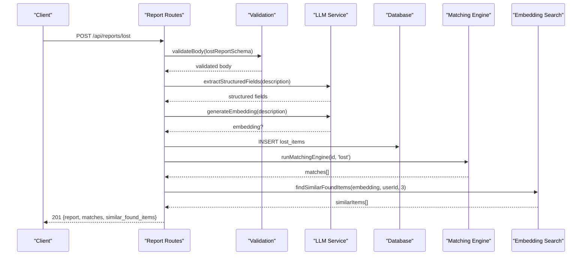

**Diagram sources**
- [reports.ts:98-171](file://backend/src/routes/reports.ts#L98-L171)
- [matchingEngine.ts:37-189](file://backend/src/services/matchingEngine.ts#L37-L189)
- [embeddingSearch.ts:68-101](file://backend/src/services/embeddingSearch.ts#L68-L101)

**Section sources**
- [reports.ts:98-171](file://backend/src/routes/reports.ts#L98-L171)
- [API_DOCUMENTATION.md:134-217](file://backend/API_DOCUMENTATION.md#L134-L217)

### Create Found Report
- Validates body against found report schema.
- Optionally extracts structured fields from long descriptions using LLM.
- Generates description embedding if available; non-fatal if embedding fails.
- Persists report with structured fields, location, timestamps, media, and private details stored as JSONB.
- Runs matching engine asynchronously; returns matches and similar lost items based on embeddings.

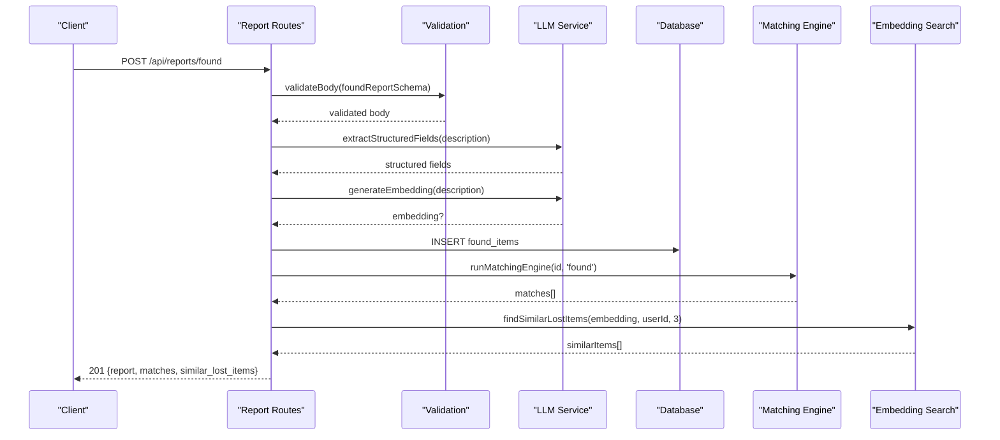

**Diagram sources**
- [reports.ts:176-247](file://backend/src/routes/reports.ts#L176-L247)
- [matchingEngine.ts:37-189](file://backend/src/services/matchingEngine.ts#L37-L189)
- [embeddingSearch.ts:30-62](file://backend/src/services/embeddingSearch.ts#L30-L62)

**Section sources**
- [reports.ts:176-247](file://backend/src/routes/reports.ts#L176-L247)
- [API_DOCUMENTATION.md:220-298](file://backend/API_DOCUMENTATION.md#L220-L298)

### List Active Reports
- Retrieves active lost and found items with pagination (page, limit).
- Supports filtering by type: all, lost, found.
- Returns separate arrays for lost and found items along with pagination metadata including total counts per type.

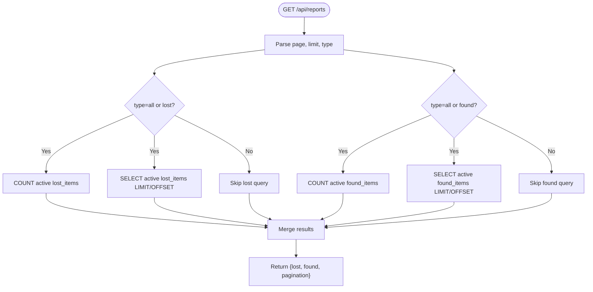

**Diagram sources**
- [reports.ts:40-93](file://backend/src/routes/reports.ts#L40-L93)

**Section sources**
- [reports.ts:40-93](file://backend/src/routes/reports.ts#L40-L93)

### Retrieve Individual Report
- GET /api/reports/:id searches lost_items first, then found_items.
- Strips identifying_info for non-owners to protect privacy.
- GET /api/reports/found/:id hides private_details unless caller is owner or admin.

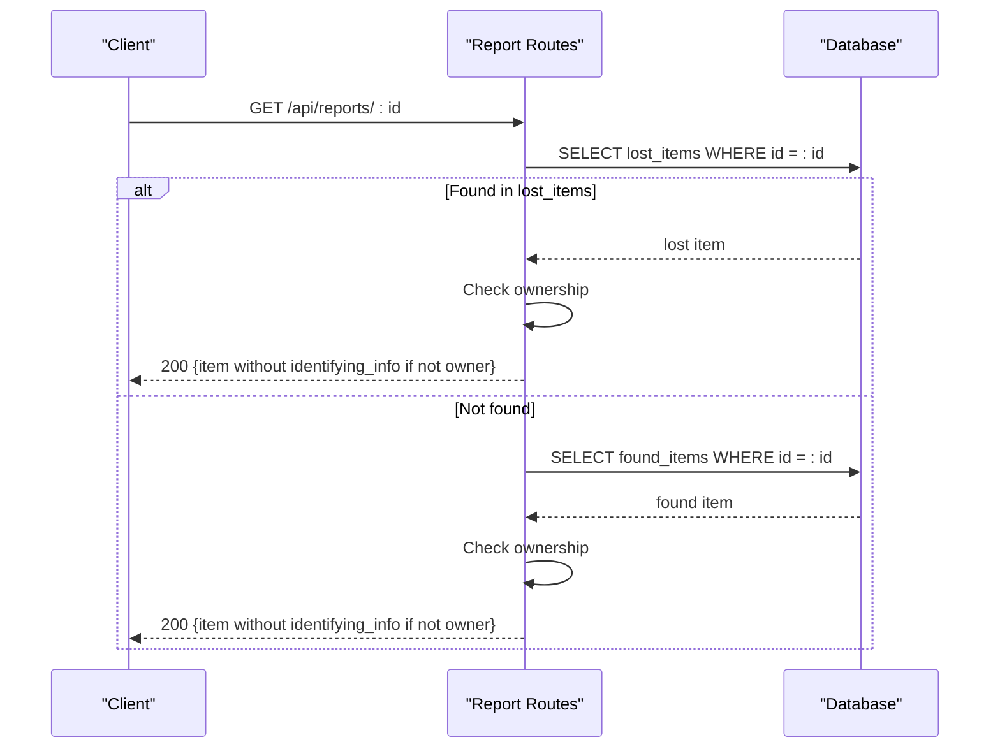

**Diagram sources**
- [reports.ts:322-355](file://backend/src/routes/reports.ts#L322-L355)
- [reports.ts:286-317](file://backend/src/routes/reports.ts#L286-L317)

**Section sources**
- [reports.ts:286-355](file://backend/src/routes/reports.ts#L286-L355)
- [API_DOCUMENTATION.md:301-377](file://backend/API_DOCUMENTATION.md#L301-L377)

### Update Item Status (Admin)
- PATCH /api/admin/items/:id/status allows administrators to update item status to active, matched, verified, returned, or closed.
- Requires type (lost or found) and reason; logs changes in item_status_log and notifies owners when items are returned or closed.

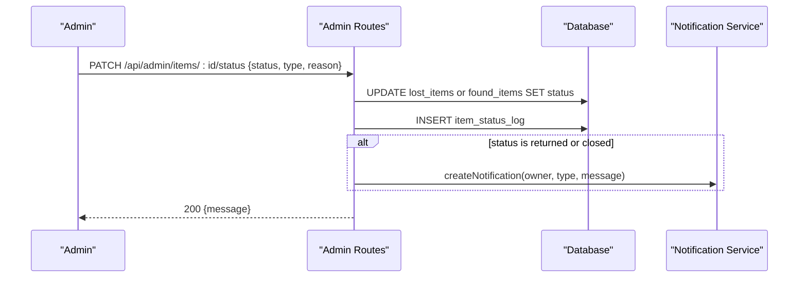

**Diagram sources**
- [admin.ts:186-228](file://backend/src/routes/admin.ts#L186-L228)

**Section sources**
- [admin.ts:186-228](file://backend/src/routes/admin.ts#L186-L228)

### Delete or Close Items (Admin)
- While there is no explicit DELETE endpoint for reports, administrators can close or mark items as returned using the status update endpoint.
- Closing or returning triggers audit logging and notifications to the item owner.

**Section sources**
- [admin.ts:186-228](file://backend/src/routes/admin.ts#L186-L228)

### Matching and Similarity Search
- Matching engine computes weighted scores across description similarity (embedding cosine distance or fallback text overlap), image similarity (vision comparison), location proximity (Haversine), time proximity (time window), and attribute similarity (category, brand, color).
- Matches above threshold are persisted and notifications sent to both parties.
- Embedding search uses pgvector indices for fast cosine similarity queries to return similar items immediately after creation.

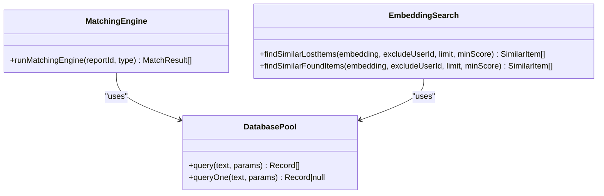

**Diagram sources**
- [matchingEngine.ts:37-189](file://backend/src/services/matchingEngine.ts#L37-L189)
- [embeddingSearch.ts:30-101](file://backend/src/services/embeddingSearch.ts#L30-L101)
- [pool.ts:34-48](file://backend/src/db/pool.ts#L34-L48)

**Section sources**
- [matchingEngine.ts:1-208](file://backend/src/services/matchingEngine.ts#L1-L208)
- [embeddingSearch.ts:1-101](file://backend/src/services/embeddingSearch.ts#L1-L101)

## Dependency Analysis
- Report routes depend on authentication middleware, validation middleware, database pool, LLM service, matching engine, and upload service.
- Admin routes depend on authentication, authorization, database pool, and notification service.
- Matching engine depends on configuration for weights and thresholds, utility functions for similarity calculations, and notification service.
- Embedding search depends on pgvector indices and database pool.

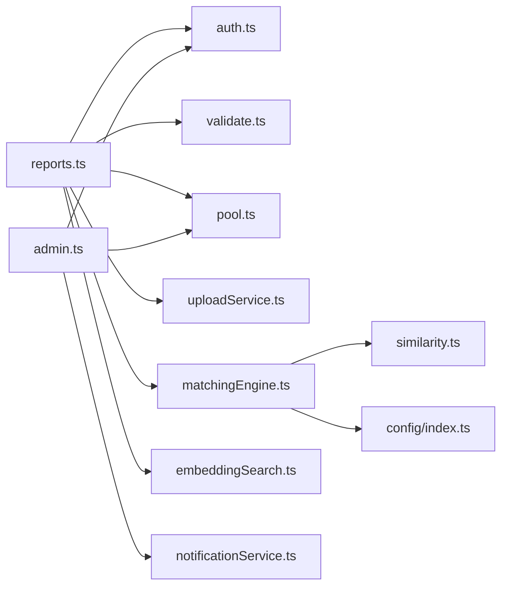

**Diagram sources**
- [reports.ts:1-356](file://backend/src/routes/reports.ts#L1-L356)
- [admin.ts:1-389](file://backend/src/routes/admin.ts#L1-L389)
- [matchingEngine.ts:1-208](file://backend/src/services/matchingEngine.ts#L1-L208)
- [embeddingSearch.ts:1-101](file://backend/src/services/embeddingSearch.ts#L1-L101)

**Section sources**
- [reports.ts:1-356](file://backend/src/routes/reports.ts#L1-L356)
- [admin.ts:1-389](file://backend/src/routes/admin.ts#L1-L389)
- [matchingEngine.ts:1-208](file://backend/src/services/matchingEngine.ts#L1-L208)

## Performance Considerations
- Pagination limits prevent large result sets; default limit is capped at 50.
- Embedding search leverages pgvector indices for efficient cosine similarity queries.
- Matching engine runs asynchronously to avoid blocking report creation; failures do not prevent successful insertion.
- Image optimization reduces payload sizes and improves storage efficiency.

[No sources needed since this section provides general guidance]

## Troubleshooting Guide
Common errors and their causes:
- 400 Bad Request: Validation failures for missing or invalid fields; unsupported file types or oversized uploads.
- 401 Unauthorized: Missing or invalid JWT token.
- 403 Forbidden: Insufficient permissions (e.g., accessing another user’s reports without admin role).
- 404 Not Found: Report or resource does not exist.
- 500 Internal Server Error: Unexpected server errors or storage upload failures.

Error responses follow a consistent shape with status and message fields. Multer errors are normalized to user-friendly messages.

**Section sources**
- [errorHandler.ts:4-56](file://backend/src/middleware/errorHandler.ts#L4-L56)
- [API_DOCUMENTATION.md:782-802](file://backend/API_DOCUMENTATION.md#L782-L802)

## Conclusion
The Reports API provides comprehensive functionality for managing lost and found items with robust validation, secure authentication, and advanced matching capabilities. Administrators have tools to update item statuses and moderate matches. The system balances performance with accuracy through embeddings and vector search, while ensuring privacy and security through ownership checks and redacted views.

[No sources needed since this section summarizes without analyzing specific files]

## Appendices

### Data Models
- Users table includes identity and role information.
- Lost items store structured fields, location, timestamps, media, embeddings, and private identifying info.
- Found items store structured fields, location, timestamps, media, embeddings, and private details as JSONB.
- Matches link lost and found items with scoring breakdowns and status.
- Verification tables manage questions and attempts for claim verification.
- Notifications track events and communications.

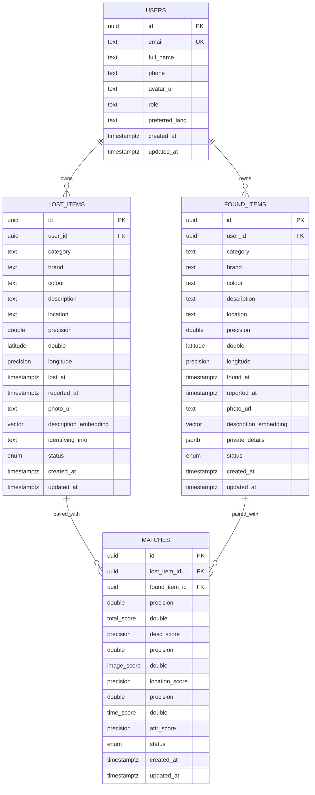

**Diagram sources**
- [001_initial_schema.sql:54-221](file://supabase/migrations/001_initial_schema.sql#L54-L221)

**Section sources**
- [001_initial_schema.sql:1-370](file://supabase/migrations/001_initial_schema.sql#L1-L370)