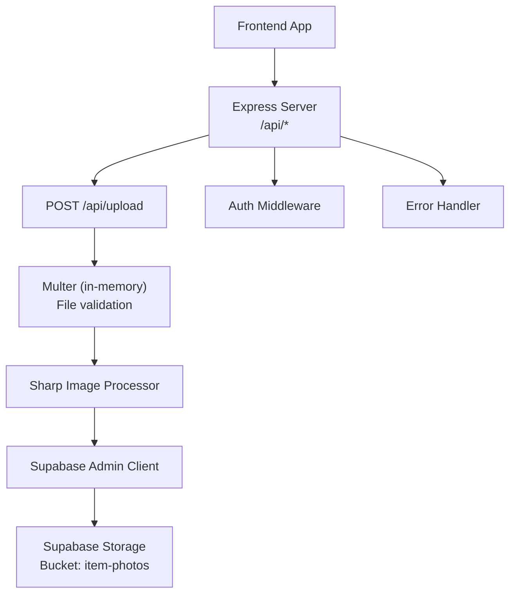
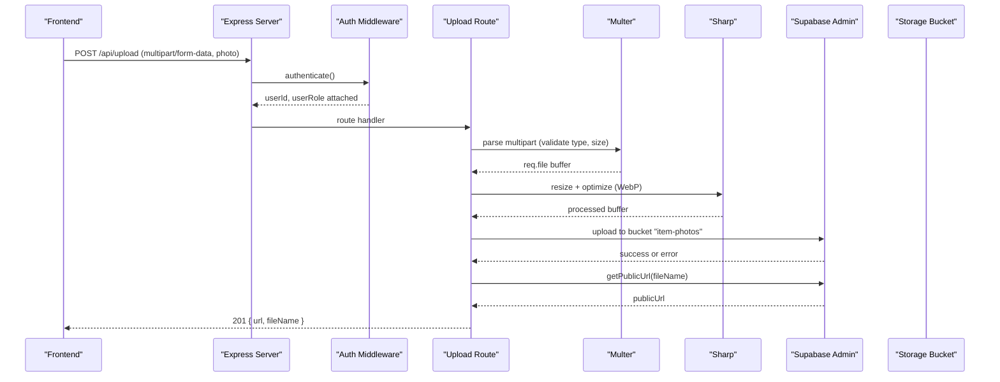
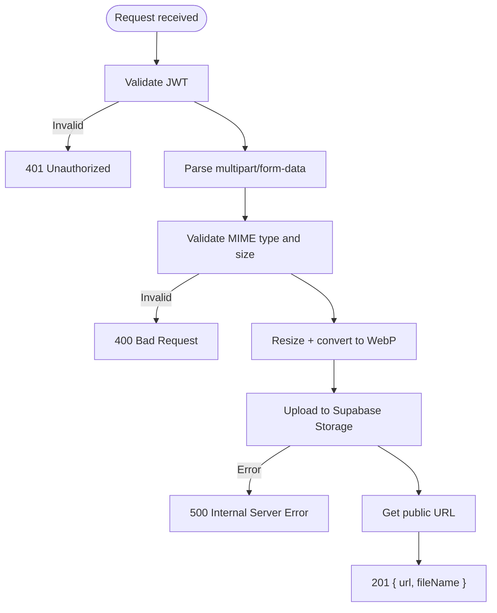
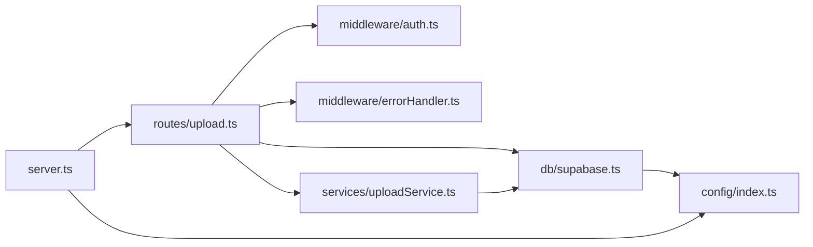

# Upload API

<cite>
**Referenced Files in This Document**
- [server.ts](file://backend/src/server.ts)
- [upload.ts](file://backend/src/routes/upload.ts)
- [uploadService.ts](file://backend/src/services/uploadService.ts)
- [auth.ts](file://backend/src/middleware/auth.ts)
- [errorHandler.ts](file://backend/src/middleware/errorHandler.ts)
- [supabase.ts](file://backend/src/db/supabase.ts)
- [index.ts](file://backend/src/config/index.ts)
- [createStorageBucket.ts](file://backend/src/scripts/createStorageBucket.ts)
- [api.ts](file://frontend/lib/api.ts)
- [supabase.ts](file://frontend/lib/supabase.ts)
- [001_initial_schema.sql](file://supabase/migrations/001_initial_schema.sql)
</cite>

## Table of Contents
1. Introduction
2. Project Structure
3. Core Components
4. Architecture Overview
5. Detailed Component Analysis
6. Dependency Analysis
7. Performance Considerations
8. Troubleshooting Guide
9. Conclusion
10. Appendices

## Introduction
This document provides detailed API documentation for image upload and processing endpoints used by the Lost & Found AI Matcher application. It covers supported file formats, size limits, automatic image optimization, error handling, progress tracking guidance, cleanup procedures, response schemas, Supabase Storage integration, access control policies, security measures, CORS configuration, validation, and virus scanning considerations. It also includes client-side integration examples and best practices for large files and progress display.

## Project Structure
The upload feature spans backend routes, services, middleware, configuration, and Supabase Storage setup, as well as frontend helpers that call the backend or upload directly to Supabase.

**Diagram sources**
- [server.ts:18-43](file://backend/src/server.ts#L18-L43)
- [upload.ts:15-68](file://backend/src/routes/upload.ts#L15-L68)
- [uploadService.ts:14-65](file://backend/src/services/uploadService.ts#L14-L65)
- [supabase.ts:8-20](file://backend/src/db/supabase.ts#L8-L20)

**Section sources**
- [server.ts:18-43](file://backend/src/server.ts#L18-L43)
- [upload.ts:15-68](file://backend/src/routes/upload.ts#L15-L68)
- [uploadService.ts:14-65](file://backend/src/services/uploadService.ts#L14-L65)
- [supabase.ts:8-20](file://backend/src/db/supabase.ts#L8-L20)

## Core Components
- Authentication: All upload routes require a valid JWT Bearer token via the authenticate middleware.
- File ingestion: Multer validates MIME type and enforces a 5 MB limit; it stores files in memory for immediate processing.
- Image optimization: Sharp resizes images and normalizes format to WebP with quality tuning and EXIF auto-orientation.
- Storage: Files are uploaded to a public Supabase Storage bucket named item-photos using the service role client.
- Response: The endpoint returns a public URL and filename for successful uploads.
- Error handling: Centralized error handler converts multer errors and application errors into consistent JSON responses.

Key behaviors:
- Allowed MIME types include common image formats; server-side validation rejects non-image or disallowed types.
- Max file size is 5 MB at both route and storage levels.
- Images are resized to a maximum width (800px in one route, 1280px in the shared service) while preserving aspect ratio.
- Uploaded files are stored under paths like items/<uuid>.webp and served via public URLs.

**Section sources**
- [upload.ts:15-68](file://backend/src/routes/upload.ts#L15-L68)
- [uploadService.ts:14-65](file://backend/src/services/uploadService.ts#L14-L65)
- [auth.ts:22-37](file://backend/src/middleware/auth.ts#L22-L37)
- [errorHandler.ts:16-47](file://backend/src/middleware/errorHandler.ts#L16-L47)
- [createStorageBucket.ts:3-27](file://backend/src/scripts/createStorageBucket.ts#L3-L27)

## Architecture Overview
The upload flow authenticates the user, validates and optimizes the image, uploads it to Supabase Storage, and returns a public URL.

**Diagram sources**
- [server.ts:18-43](file://backend/src/server.ts#L18-L43)
- [upload.ts:32-68](file://backend/src/routes/upload.ts#L32-L68)
- [uploadService.ts:34-65](file://backend/src/services/uploadService.ts#L34-L65)
- [supabase.ts:8-20](file://backend/src/db/supabase.ts#L8-L20)

## Detailed Component Analysis

### Endpoint: POST /api/upload
- Purpose: Accept an image file, optimize it, store it in Supabase Storage, and return a public URL.
- Authentication: Required (Bearer token).
- Content-Type: multipart/form-data.
- Field name: photo.
- Supported formats: image/jpeg, image/png, image/webp, image/heic (validated by MIME type).
- Size limit: 5 MB per file.
- Processing:
  - Resize to max width (800px in this route; 1280px in shared service) without enlargement.
  - Normalize to WebP with quality 82 and auto-orient from EXIF when using the shared service.
- Storage:
  - Bucket: item-photos (public).
  - Path: root-level filename in this route; items/<uuid>.webp in the shared service.
- Response (201):
  - url: string (public URL)
  - fileName: string
- Errors:
  - 400: Invalid file type or missing field.
  - 401: Missing or invalid JWT.
  - 413: File too large.
  - 500: Storage upload failure.

**Diagram sources**
- [upload.ts:32-68](file://backend/src/routes/upload.ts#L32-L68)
- [uploadService.ts:34-65](file://backend/src/services/uploadService.ts#L34-L65)
- [errorHandler.ts:16-47](file://backend/src/middleware/errorHandler.ts#L16-L47)

**Section sources**
- [upload.ts:32-68](file://backend/src/routes/upload.ts#L32-L68)
- [uploadService.ts:34-65](file://backend/src/services/uploadService.ts#L34-L65)
- [errorHandler.ts:16-47](file://backend/src/middleware/errorHandler.ts#L16-L47)

### Shared Upload Service: processAndUpload(buffer, originalMime)
- Purpose: Reusable function to optimize and upload images to Supabase Storage.
- Processing: Auto-rotate, resize to 1280px width, convert to WebP with quality 82.
- Storage: Writes to items/<uuid>.webp in bucket item-photos with immutable caching headers.
- Returns: Public URL string.
- Errors: Throws application error on storage failures.

**Section sources**
- [uploadService.ts:34-65](file://backend/src/services/uploadService.ts#L34-L65)

### Authentication and Authorization
- JWT verification: Extracts and verifies token from Authorization header; attaches userId and userRole to request.
- Admin checks: Optional requireAdmin middleware validates admin role against the database.

**Section sources**
- [auth.ts:22-58](file://backend/src/middleware/auth.ts#L22-L58)

### Error Handling
- Application errors: Consistent JSON structure with status and message.
- Multer errors: Specific messages for file size and unexpected fields.
- Global fallback: Catches unhandled errors and returns 500.

**Section sources**
- [errorHandler.ts:16-47](file://backend/src/middleware/errorHandler.ts#L16-L47)

### Supabase Storage Integration
- Clients:
  - supabaseAdmin: Uses service role key for server-side operations (bypasses RLS).
  - supabaseClient: Uses anon key for client-scoped operations (respects RLS).
- Bucket:
  - Name: item-photos
  - Public: true
  - File size limit: 5 MB
- Setup script: Ensures bucket exists and is public.

**Section sources**
- [supabase.ts:8-20](file://backend/src/db/supabase.ts#L8-L20)
- [createStorageBucket.ts:3-27](file://backend/src/scripts/createStorageBucket.ts#L3-L27)
- [001_initial_schema.sql:367-369](file://supabase/migrations/001_initial_schema.sql#L367-L369)

### CORS Configuration
- CORS enabled for the configured frontend URL with credentials allowed.
- Rate limiting applied to all /api/* endpoints.

**Section sources**
- [server.ts:18-30](file://backend/src/server.ts#L18-L30)
- [index.ts:6-15](file://backend/src/config/index.ts#L6-L15)

## Dependency Analysis

**Diagram sources**
- [server.ts:18-43](file://backend/src/server.ts#L18-L43)
- [upload.ts:1-68](file://backend/src/routes/upload.ts#L1-L68)
- [uploadService.ts:1-65](file://backend/src/services/uploadService.ts#L1-L65)
- [supabase.ts:1-20](file://backend/src/db/supabase.ts#L1-L20)
- [index.ts:6-15](file://backend/src/config/index.ts#L6-L15)

**Section sources**
- [server.ts:18-43](file://backend/src/server.ts#L18-L43)
- [upload.ts:1-68](file://backend/src/routes/upload.ts#L1-L68)
- [uploadService.ts:1-65](file://backend/src/services/uploadService.ts#L1-L65)
- [supabase.ts:1-20](file://backend/src/db/supabase.ts#L1-L20)
- [index.ts:6-15](file://backend/src/config/index.ts#L6-L15)

## Performance Considerations
- In-memory processing: Multer stores files in memory; keep payload sizes small (5 MB limit) to avoid high memory usage.
- Image optimization: Resizing and converting to WebP reduces bandwidth and improves load times.
- Caching: Immutable filenames with long cache-control improve CDN/browser caching.
- Rate limiting: Protects endpoints from abuse and excessive requests.
- Recommendations:
  - Use streaming uploads for very large files if needed.
  - Consider offloading heavy image processing to a worker queue under high load.
  - Monitor memory usage and adjust limits based on deployment resources.

[No sources needed since this section provides general guidance]

## Troubleshooting Guide
Common issues and resolutions:
- 401 Unauthorized: Ensure a valid JWT is included in the Authorization header.
- 400 Bad Request: Check that the form field name is photo and the MIME type is allowed.
- 413 Payload Too Large: Reduce image size or compress before upload.
- 500 Internal Server Error: Verify Supabase Storage bucket exists and is accessible; check service role key configuration.
- CORS errors: Confirm FRONTEND_URL matches the browser origin and credentials are allowed.

Validation and error mapping:
- Multer errors map to clear messages for file size and unexpected fields.
- Application errors return structured JSON with status and message.

**Section sources**
- [errorHandler.ts:16-47](file://backend/src/middleware/errorHandler.ts#L16-L47)
- [auth.ts:22-37](file://backend/src/middleware/auth.ts#L22-L37)
- [server.ts:18-30](file://backend/src/server.ts#L18-L30)

## Conclusion
The upload API provides secure, validated, and optimized image uploads to Supabase Storage with consistent error handling and clear responses. By enforcing authentication, MIME validation, size limits, and image optimization, it ensures reliable performance and safe storage. Frontend clients can integrate via the provided helpers or direct Supabase uploads, with appropriate error handling and optional progress tracking.

[No sources needed since this section summarizes without analyzing specific files]

## Appendices

### API Specification: POST /api/upload
- Method: POST
- Path: /api/upload
- Headers:
  - Authorization: Bearer <token>
  - Content-Type: multipart/form-data
- Body:
  - photo: File (image/jpeg, image/png, image/webp, image/heic), max 5 MB
- Success Response (201):
  - url: string (public URL)
  - fileName: string
- Error Responses:
  - 400: Invalid file type or missing field
  - 401: Missing or invalid token
  - 413: File too large
  - 500: Storage upload failure

**Section sources**
- [upload.ts:32-68](file://backend/src/routes/upload.ts#L32-L68)
- [errorHandler.ts:16-47](file://backend/src/middleware/errorHandler.ts#L16-L47)

### Client-Side Integration Examples

#### Using Backend Upload Endpoint
- Build FormData with field name photo.
- Attach Authorization header with Bearer token.
- Send POST to /api/upload.
- Handle errors and use returned url for further steps.

Reference implementation path:
- [api.ts:37-52](file://frontend/lib/api.ts#L37-L52)
- [api.ts:144-149](file://frontend/lib/api.ts#L144-L149)

#### Direct Supabase Storage Upload
- Create client with anon key.
- Generate unique file path.
- Upload to bucket item-photos.
- Retrieve public URL.

Reference implementation path:
- [supabase.ts:11-24](file://frontend/lib/supabase.ts#L11-L24)

**Section sources**
- [api.ts:37-52](file://frontend/lib/api.ts#L37-L52)
- [api.ts:144-149](file://frontend/lib/api.ts#L144-L149)
- [supabase.ts:11-24](file://frontend/lib/supabase.ts#L11-L24)

### Access Control Policies and Security Measures
- Authentication: JWT-based access required for uploads.
- Storage bucket: Public for read access; writes performed by server using service role key.
- RLS: Anon client respects Row Level Security; server uses service role for controlled writes.
- Security headers: Helmet enabled globally.
- Rate limiting: Applied to /api/* endpoints.

**Section sources**
- [auth.ts:22-37](file://backend/src/middleware/auth.ts#L22-L37)
- [supabase.ts:8-20](file://backend/src/db/supabase.ts#L8-L20)
- [server.ts:18-30](file://backend/src/server.ts#L18-L30)
- [001_initial_schema.sql:367-369](file://supabase/migrations/001_initial_schema.sql#L367-L369)

### CORS Configuration
- Allowed origin: Configured via FRONTEND_URL.
- Credentials: Enabled for cross-origin requests.

**Section sources**
- [server.ts:18-21](file://backend/src/server.ts#L18-L21)
- [index.ts:6-15](file://backend/src/config/index.ts#L6-L15)

### File Validation and Virus Scanning Considerations
- Validation: MIME type and size enforced server-side.
- Optimization: Images normalized to WebP with resizing to reduce risk and improve safety.
- Virus scanning: Not implemented in current codebase. Recommended additions:
  - Integrate a virus scanning service (e.g., ClamAV) before storing files.
  - Reject or quarantine files flagged as malicious.
  - Log and alert on scan failures.

[No sources needed since this section provides general guidance]

### Cleanup Procedures
- Current behavior: No explicit deletion logic in upload routes.
- Recommendations:
  - Implement scheduled jobs to remove orphaned files not referenced by reports.
  - Provide admin endpoints to delete files by ID or by report association.
  - Enforce retention policies and audit logs for deletions.

[No sources needed since this section provides general guidance]

### Upload Progress Tracking
- Server-side: No built-in progress events for uploads.
- Client-side options:
  - For direct Supabase uploads, use upload task events to track progress.
  - For backend uploads, consider chunked uploads with resumable sessions to show progress.
- Reference:
  - Direct Supabase upload helper available for progress-capable flows.

**Section sources**
- [supabase.ts:11-24](file://frontend/lib/supabase.ts#L11-L24)