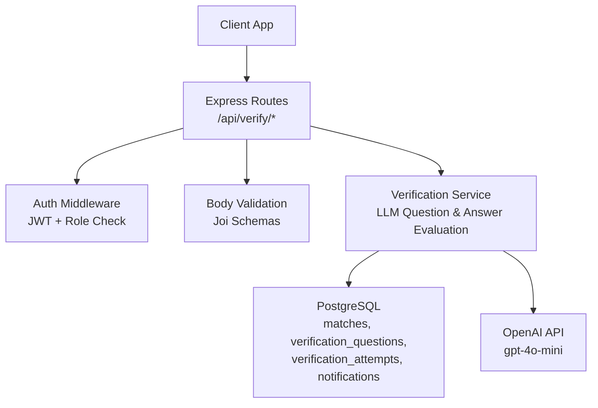
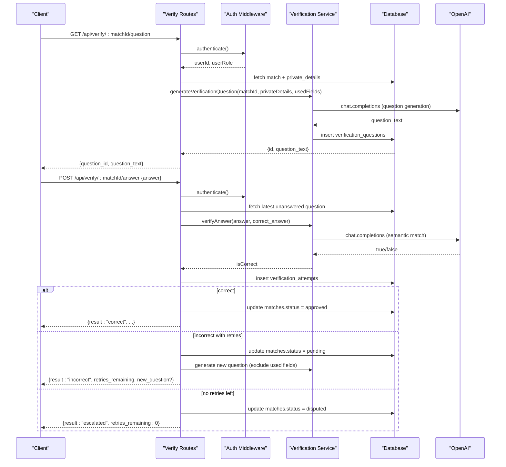
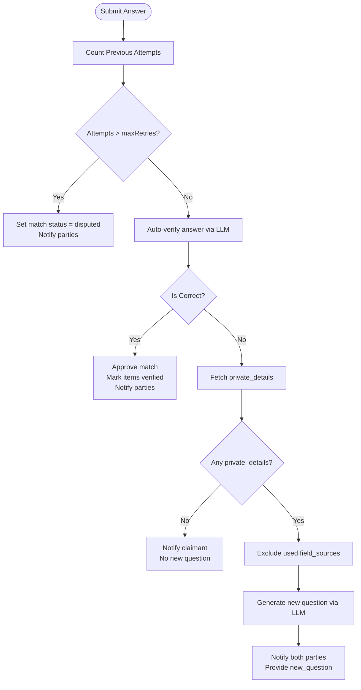
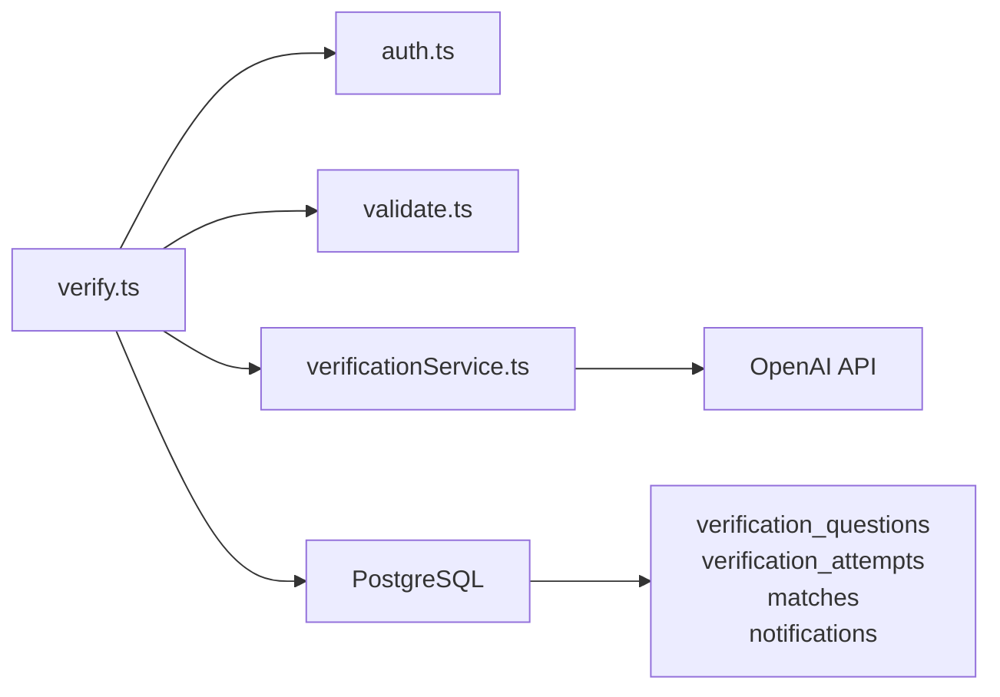

# Verification API

<cite>
**Referenced Files in This Document**
- [verify.ts](file://backend/src/routes/verify.ts)
- [verificationService.ts](file://backend/src/services/verificationService.ts)
- [validate.ts](file://backend/src/middleware/validate.ts)
- [auth.ts](file://backend/src/middleware/auth.ts)
- [config/index.ts](file://backend/src/config/index.ts)
- [API_DOCUMENTATION.md](file://backend/API_DOCUMENTATION.md)
- [001_initial_schema.sql](file://supabase/migrations/001_initial_schema.sql)
- [SCHEMA_REFERENCE.md](file://SCHEMA_REFERENCE.md)
- [VERIFICATION_FIELDS.md](file://VERIFICATION_FIELDS.md)
</cite>

## Table of Contents
1. Introduction
2. Project Structure
3. Core Components
4. Architecture Overview
5. Detailed Component Analysis
6. Dependency Analysis
7. Performance Considerations
8. Troubleshooting Guide
9. Conclusion
10. Appendices

## Introduction
This document provides detailed API documentation for the verification system that protects private item details during claimant verification. It covers:
- Generating LLM-based verification questions from private item details
- Submitting answers for semantic validation
- Managing verification workflows, including retries with field rotation and escalation to admin review
- Schemas for verification question objects, answer submissions, and validation results
- Client integration examples, notification handling, and security considerations

## Project Structure
The verification feature is implemented as a set of Express routes backed by a service layer and validated via middleware. The database schema defines tables for matches, verification questions, attempts, and notifications.

**Diagram sources**
- [verify.ts:1-444](file://backend/src/routes/verify.ts#L1-L444)
- [verificationService.ts:1-123](file://backend/src/services/verificationService.ts#L1-L123)
- [validate.ts:1-61](file://backend/src/middleware/validate.ts#L1-L61)
- [auth.ts:1-59](file://backend/src/middleware/auth.ts#L1-L59)
- [001_initial_schema.sql:145-221](file://supabase/migrations/001_initial_schema.sql#L145-L221)

**Section sources**
- [verify.ts:1-444](file://backend/src/routes/verify.ts#L1-L444)
- [001_initial_schema.sql:145-221](file://supabase/migrations/001_initial_schema.sql#L145-L221)

## Core Components
- Route handlers for verification endpoints:
  - GET /api/verify/:matchId/question
  - POST /api/verify/:matchId/answer
  - POST /api/verify/:matchId/judge
- Service functions:
  - generateVerificationQuestion(matchId, privateDetails, excludeFields)
  - verifyAnswer(submittedAnswer, correctAnswer)
- Validation schemas:
  - verificationAnswerSchema
  - verificationJudgeSchema
- Authentication and authorization:
  - JWT bearer token required
  - Role checks (claimant or admin for question retrieval; finder or admin for judge)

**Section sources**
- [verify.ts:14-444](file://backend/src/routes/verify.ts#L14-L444)
- [verificationService.ts:15-123](file://backend/src/services/verificationService.ts#L15-L123)
- [validate.ts:53-61](file://backend/src/middleware/validate.ts#L53-L61)
- [auth.ts:22-59](file://backend/src/middleware/auth.ts#L22-L59)

## Architecture Overview
The verification workflow enforces privacy by never exposing private_details directly. Instead, it generates natural-language questions based on those details and validates answers using LLM-powered semantic comparison.

**Diagram sources**
- [verify.ts:20-294](file://backend/src/routes/verify.ts#L20-L294)
- [verificationService.ts:15-123](file://backend/src/services/verificationService.ts#L15-L123)
- [001_initial_schema.sql:171-199](file://supabase/migrations/001_initial_schema.sql#L171-L199)

## Detailed Component Analysis

### Endpoints

#### GET /api/verify/:matchId/question
- Purpose: Retrieve or generate a verification question for a match. On retry, a different question is generated by excluding previously used field sources.
- Authorization: Only the lost-item owner (claimant) or an admin can call this endpoint.
- Behavior:
  - Fetches match and associated private_details
  - If no unanswered question exists, generates one using LLM based on private_details, excluding previously used fields
  - Returns only question text and ID; never returns the correct answer
- Responses:
  - 200 OK: { question_id, question_text }
  - 404 Not Found: Match not found
  - 400 Bad Request: No private details available to generate a question
  - 403 Forbidden: Access denied

**Section sources**
- [verify.ts:20-79](file://backend/src/routes/verify.ts#L20-L79)
- [verificationService.ts:15-79](file://backend/src/services/verificationService.ts#L15-L79)
- [001_initial_schema.sql:171-179](file://supabase/migrations/001_initial_schema.sql#L171-L179)

#### POST /api/verify/:matchId/answer
- Purpose: Submit an answer to the current verification question. The system auto-verifies using LLM fuzzy comparison.
- Authorization: Only the lost-item owner (claimant) or an admin may submit answers.
- Behavior:
  - Validates request body against verificationAnswerSchema
  - Retrieves the latest unanswered question
  - Counts previous attempts to enforce retry limit
  - Auto-verifies answer using verifyAnswer
  - Stores attempt with is_correct and attempt_number
  - Outcomes:
    - Correct: Approve match, mark items verified, notify both parties
    - Incorrect with retries remaining: Generate a new question (excluding used fields), notify both parties
    - Incorrect with no retries: Escalate to admin (disputed), notify both parties
- Responses:
  - 201 Created:
    - Correct: { attempt_id, attempt_number, result: "correct", message }
    - Incorrect with retries: { attempt_id, attempt_number, result: "incorrect", retries_remaining, message, new_question? }
    - Incorrect with no retries: { attempt_id, attempt_number, result: "escalated", retries_remaining: 0, message }
  - 404 Not Found: Match or question not found
  - 429 Too Many Requests: Maximum attempts reached

**Section sources**
- [verify.ts:89-294](file://backend/src/routes/verify.ts#L89-L294)
- [verificationService.ts:85-123](file://backend/src/services/verificationService.ts#L85-L123)
- [validate.ts:53-55](file://backend/src/middleware/validate.ts#L53-L55)
- [config/index.ts:33-47](file://backend/src/config/index.ts#L33-L47)
- [001_initial_schema.sql:184-199](file://supabase/migrations/001_initial_schema.sql#L184-L199)

#### POST /api/verify/:matchId/judge
- Purpose: Finder override endpoint to judge any attempt. Can mark a system-rejected answer as correct (approve match) or mark a system-approved answer as incorrect (revert and possibly retry).
- Authorization: Only the finder (or admin) can call this endpoint.
- Behavior:
  - Validates request body against verificationJudgeSchema
  - Verifies attempt exists
  - Updates attempt with is_correct and judged_by
  - Outcomes:
    - Correct: Approve match, mark items verified, notify claimant
    - Incorrect with retries remaining: Generate a new question (excluding used fields), notify claimant
    - Incorrect with no retries: Escalate to admin (disputed), notify claimant
- Responses:
  - 200 OK:
    - Correct: { result: "correct", message }
    - Incorrect with retries: { result: "incorrect", retries_remaining, message, new_question? }
    - Incorrect with no retries: { result: "escalated", retries_remaining: 0, message }
  - 404 Not Found: Match or attempt not found
  - 403 Forbidden: Only finder can override verification

**Section sources**
- [verify.ts:303-443](file://backend/src/routes/verify.ts#L303-L443)
- [validate.ts:57-61](file://backend/src/middleware/validate.ts#L57-L61)
- [001_initial_schema.sql:184-199](file://supabase/migrations/001_initial_schema.sql#L184-L199)

### Retry Mechanism with Field Rotation
- The system tracks used field_sources per match to ensure retries ask about different private details.
- When generating a new question after an incorrect answer, previously used fields are excluded.
- Retry limits are enforced via config.matching.maxRetries.

**Diagram sources**
- [verify.ts:132-294](file://backend/src/routes/verify.ts#L132-L294)
- [verificationService.ts:15-79](file://backend/src/services/verificationService.ts#L15-L79)
- [config/index.ts:33-47](file://backend/src/config/index.ts#L33-L47)

**Section sources**
- [verify.ts:132-294](file://backend/src/routes/verify.ts#L132-L294)
- [verificationService.ts:15-79](file://backend/src/services/verificationService.ts#L15-L79)
- [config/index.ts:33-47](file://backend/src/config/index.ts#L33-L47)

### Escalation Processes for Disputed Verifications
- When maximum attempts are exceeded or the finder marks an answer incorrect with no retries remaining, the match status is set to disputed.
- Notifications are sent to both parties indicating escalation to admin review.

**Section sources**
- [verify.ts:139-142](file://backend/src/routes/verify.ts#L139-L142)
- [verify.ts:212-238](file://backend/src/routes/verify.ts#L212-L238)
- [verify.ts:381-397](file://backend/src/routes/verify.ts#L381-L397)

### Admin Review Workflows
- Admins can access verification endpoints similarly to regular users but with elevated permissions where applicable.
- Disputed matches are flagged for admin review through status updates and notifications.

**Section sources**
- [verify.ts:39-42](file://backend/src/routes/verify.ts#L39-L42)
- [verify.ts:109-111](file://backend/src/routes/verify.ts#L109-L111)
- [verify.ts:326-328](file://backend/src/routes/verify.ts#L326-L328)

### Data Models and Schemas

#### Verification Question Object
- Fields:
  - question_id: UUID
  - question_text: string
- Stored in verification_questions table with correct_answer and field_source hidden from clients.

**Section sources**
- [verify.ts:75-78](file://backend/src/routes/verify.ts#L75-L78)
- [001_initial_schema.sql:171-179](file://supabase/migrations/001_initial_schema.sql#L171-L179)
- [SCHEMA_REFERENCE.md:98-107](file://SCHEMA_REFERENCE.md#L98-L107)

#### Answer Submission Format
- Request body:
  - answer: string (minimum length 1)
- Validated via verificationAnswerSchema.

**Section sources**
- [validate.ts:53-55](file://backend/src/middleware/validate.ts#L53-L55)
- [verify.ts:91-94](file://backend/src/routes/verify.ts#L91-L94)

#### Validation Results
- Response shapes:
  - Correct: { attempt_id, attempt_number, result: "correct", message }
  - Incorrect with retries: { attempt_id, attempt_number, result: "incorrect", retries_remaining, message, new_question? }
  - Incorrect with no retries: { attempt_id, attempt_number, result: "escalated", retries_remaining: 0, message }

**Section sources**
- [verify.ts:200-206](file://backend/src/routes/verify.ts#L200-L206)
- [verify.ts:283-292](file://backend/src/routes/verify.ts#L283-L292)
- [verify.ts:231-237](file://backend/src/routes/verify.ts#L231-L237)

### Client Integration Examples

#### Implementing Verification Flows
- Retrieve a question:
  - Call GET /api/verify/:matchId/question with Bearer token
  - Display question_text to claimant
- Submit an answer:
  - Call POST /api/verify/:matchId/answer with { answer }
  - Handle responses:
    - If result is "correct", inform claimant and open messaging
    - If result is "incorrect" with retries_remaining > 0, prompt for another attempt
    - If result is "escalated", notify claimant that case is under admin review

**Section sources**
- [API_DOCUMENTATION.md:516-635](file://backend/API_DOCUMENTATION.md#L516-L635)
- [verify.ts:20-294](file://backend/src/routes/verify.ts#L20-L294)

#### Handling Different Verification Outcomes
- Correct:
  - Update UI to show match approved and messaging enabled
- Incorrect with retries:
  - Show remaining attempts and new question if provided
- Escalated:
  - Inform claimant and finder that admin review is underway

**Section sources**
- [verify.ts:171-206](file://backend/src/routes/verify.ts#L171-L206)
- [verify.ts:212-238](file://backend/src/routes/verify.ts#L212-L238)
- [verify.ts:283-292](file://backend/src/routes/verify.ts#L283-L292)

#### Integrating with Notification Systems
- Notifications are created for:
  - New verification questions
  - Verification results (correct/incorrect)
  - Match approvals and rejections
  - Escalations to admin
- Clients can poll GET /notifications to display real-time updates.

**Section sources**
- [verify.ts:185-198](file://backend/src/routes/verify.ts#L185-L198)
- [verify.ts:268-281](file://backend/src/routes/verify.ts#L268-L281)
- [API_DOCUMENTATION.md:638-687](file://backend/API_DOCUMENTATION.md#L638-L687)

### Security Considerations
- Private Details Protection:
  - private_details are stored in found_items.private_details (JSONB) and never returned to clients
  - Only used internally to generate questions and validate answers
- Authentication:
  - All verification endpoints require a valid JWT bearer token
  - Role-based access control ensures only claimants/admins can retrieve questions and submit answers; only finders/admins can judge
- Database Row-Level Security:
  - Policies restrict access to matches, notifications, and verification data based on ownership
- Input Validation:
  - Joi schemas enforce strict input formats for answers and judgments

**Section sources**
- [verify.ts:23-42](file://backend/src/routes/verify.ts#L23-L42)
- [verify.ts:96-111](file://backend/src/routes/verify.ts#L96-L111)
- [auth.ts:22-59](file://backend/src/middleware/auth.ts#L22-L59)
- [001_initial_schema.sql:319-365](file://supabase/migrations/001_initial_schema.sql#L319-L365)
- [validate.ts:8-23](file://backend/src/middleware/validate.ts#L8-L23)

## Dependency Analysis
The verification system depends on several internal and external components:

**Diagram sources**
- [verify.ts:1-444](file://backend/src/routes/verify.ts#L1-L444)
- [verificationService.ts:1-123](file://backend/src/services/verificationService.ts#L1-L123)
- [001_initial_schema.sql:171-221](file://supabase/migrations/001_initial_schema.sql#L171-L221)

**Section sources**
- [verify.ts:1-444](file://backend/src/routes/verify.ts#L1-L444)
- [verificationService.ts:1-123](file://backend/src/services/verificationService.ts#L1-L123)
- [001_initial_schema.sql:171-221](file://supabase/migrations/001_initial_schema.sql#L171-L221)

## Performance Considerations
- LLM Calls:
  - Question generation and answer verification use OpenAI gpt-4o-mini
  - Fallback logic handles API failures gracefully
- Database Queries:
  - Efficient queries with indexes on match_id for verification_questions and verification_attempts
- Retry Limits:
  - Configurable maxRetries prevents excessive LLM calls and database writes

[No sources needed since this section provides general guidance]

## Troubleshooting Guide
Common issues and resolutions:
- No private details available:
  - Ensure found_items.private_details contains at least one key-value pair
- Maximum attempts reached:
  - Case escalates to admin; check matches.status for 'disputed'
- LLM API failures:
  - System falls back to simpler matching or direct DB inserts in some paths
- Authentication errors:
  - Verify JWT token validity and role permissions

**Section sources**
- [verify.ts:57-61](file://backend/src/routes/verify.ts#L57-L61)
- [verify.ts:139-142](file://backend/src/routes/verify.ts#L139-L142)
- [verificationService.ts:62-64](file://backend/src/services/verificationService.ts#L62-L64)
- [verificationService.ts:117-121](file://backend/src/services/verificationService.ts#L117-L121)
- [auth.ts:22-37](file://backend/src/middleware/auth.ts#L22-L37)

## Conclusion
The verification system provides a robust, secure mechanism for validating claimants while protecting private item details. It leverages LLM-based question generation and semantic answer validation, with configurable retry mechanisms and clear escalation paths to admin review. The API design emphasizes security, privacy, and usability for client applications.

[No sources needed since this section summarizes without analyzing specific files]

## Appendices

### Verification Question Design Guide
- Guidelines for entering private_details to create effective verification questions
- Category-specific suggestions for keys, electronics, bags, wallets, etc.

**Section sources**
- [VERIFICATION_FIELDS.md:1-123](file://VERIFICATION_FIELDS.md#L1-L123)

### Database Schema Reference
- Detailed schema definitions for verification-related tables
- Relationships between matches, verification_questions, verification_attempts, and notifications

**Section sources**
- [001_initial_schema.sql:171-221](file://supabase/migrations/001_initial_schema.sql#L171-L221)
- [SCHEMA_REFERENCE.md:98-137](file://SCHEMA_REFERENCE.md#L98-L137)