# Admin Dashboard

<cite>
**Referenced Files in This Document**
- [admin.ts](file://backend/src/routes/admin.ts)
- [auth.ts](file://backend/src/middleware/auth.ts)
- [auth_routes.ts](file://backend/src/routes/auth.ts)
- [errorHandler.ts](file://backend/src/middleware/errorHandler.ts)
- [config_index.ts](file://backend/src/config/index.ts)
- [notificationService.ts](file://backend/src/services/notificationService.ts)
- [initial_schema.sql](file://supabase/migrations/001_initial_schema.sql)
- [fraud_flag_migration.sql](file://supabase/migrations/003_admin_fraud_flag.sql)
- [admin_page.tsx](file://frontend/app/admin/page.tsx)
- [api_client.ts](file://frontend/lib/api.ts)
</cite>

## Table of Contents
1. [Introduction](#introduction)
2. [Project Structure](#project-structure)
3. [Core Components](#core-components)
4. [Architecture Overview](#architecture-overview)
5. [Detailed Component Analysis](#detailed-component-analysis)
6. [Dependency Analysis](#dependency-analysis)
7. [Performance Considerations](#performance-considerations)
8. [Troubleshooting Guide](#troubleshooting-guide)
9. [Conclusion](#conclusion)
10. [Appendices](#appendices)

## Introduction
This document provides comprehensive documentation for the admin dashboard functionality in the Lost & Found AI Matcher system. It covers administrative features including dashboard statistics, pending match review, dispute resolution, user management, and system monitoring. It also explains authentication and authorization mechanisms, the interface for reviewing matches and inspection of verification attempt history, tools for managing item status lifecycles, fraud detection capabilities, escalation procedures, audit trails, common administrative tasks, reporting capabilities, and security considerations.

## Project Structure
The admin dashboard spans backend API routes, middleware for authentication and authorization, database schema definitions, notification services, and a Next.js frontend page that orchestrates admin workflows.

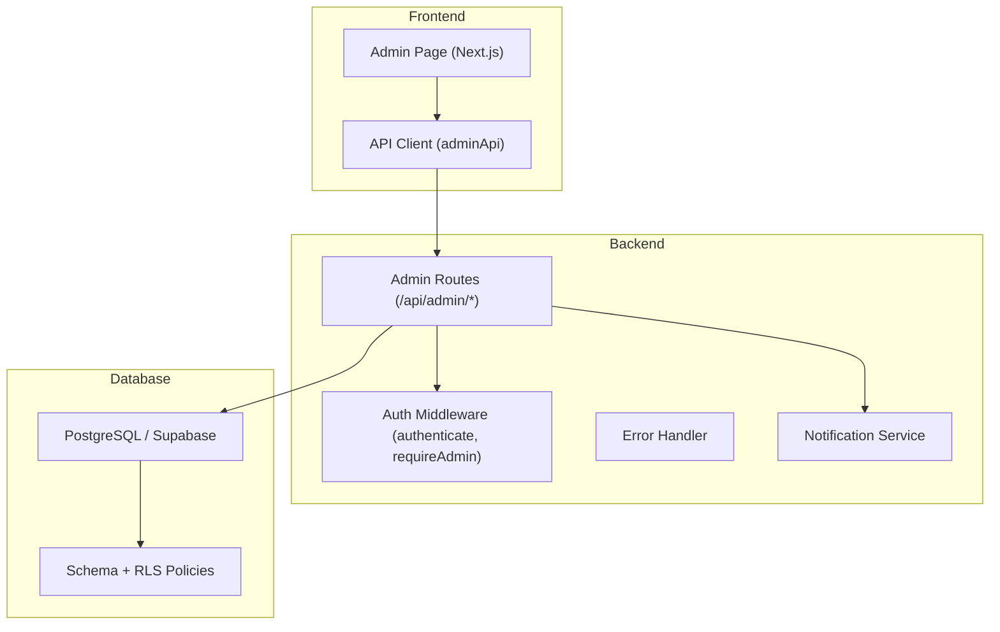

**Diagram sources**
- [admin_page.tsx:1-363](file://frontend/app/admin/page.tsx#L1-L363)
- [api_client.ts:316-423](file://frontend/lib/api.ts#L316-L423)
- [admin.ts:1-389](file://backend/src/routes/admin.ts#L1-L389)
- [auth.ts:1-59](file://backend/src/middleware/auth.ts#L1-L59)
- [notificationService.ts:1-101](file://backend/src/services/notificationService.ts#L1-L101)
- [initial_schema.sql:14-49](file://supabase/migrations/001_initial_schema.sql#L14-L49)

**Section sources**
- [admin_page.tsx:1-363](file://frontend/app/admin/page.tsx#L1-L363)
- [api_client.ts:316-423](file://frontend/lib/api.ts#L316-L423)
- [admin.ts:1-389](file://backend/src/routes/admin.ts#L1-L389)
- [auth.ts:1-59](file://backend/src/middleware/auth.ts#L1-L59)
- [notificationService.ts:1-101](file://backend/src/services/notificationService.ts#L1-L101)
- [initial_schema.sql:14-49](file://supabase/migrations/001_initial_schema.sql#L14-L49)

## Core Components
- Admin API endpoints for statistics, match listing, approval/rejection, item status updates, disputed/fraud cases, and flagging/unflagging matches.
- Authentication and authorization middleware ensuring only authenticated users with an admin role can access admin endpoints.
- Notification service to inform users about match approvals, rejections, item returns/closures, and admin messages.
- Database schema defining enums for item and match statuses, verification states, notifications, and tables for items, matches, verification questions/attempts, notifications, and audit logs.
- Frontend admin page providing UI for stats, match review, fraud/disputed case handling, and actions like approve, reject, mark returned, flag/unflag.

**Section sources**
- [admin.ts:15-389](file://backend/src/routes/admin.ts#L15-L389)
- [auth.ts:22-58](file://backend/src/middleware/auth.ts#L22-L58)
- [notificationService.ts:19-62](file://backend/src/services/notificationService.ts#L19-L62)
- [initial_schema.sql:14-49](file://supabase/migrations/001_initial_schema.sql#L14-L49)
- [admin_page.tsx:31-127](file://frontend/app/admin/page.tsx#L31-L127)

## Architecture Overview
The admin dashboard follows a layered architecture:
- Frontend admin page calls admin API endpoints via typed client methods.
- Backend admin routes enforce authentication and admin role checks before processing requests.
- Data operations interact with PostgreSQL through a connection pool; results are returned as JSON.
- Notifications are created for relevant users upon state changes.
- Database schema defines strict enums and policies to ensure data integrity and access control.

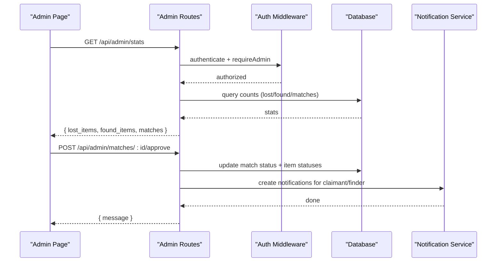

**Diagram sources**
- [admin.ts:18-47](file://backend/src/routes/admin.ts#L18-L47)
- [admin.ts:88-128](file://backend/src/routes/admin.ts#L88-L128)
- [auth.ts:22-58](file://backend/src/middleware/auth.ts#L22-L58)
- [notificationService.ts:19-62](file://backend/src/services/notificationService.ts#L19-L62)

## Detailed Component Analysis

### Authentication and Authorization
- JWT-based authentication validates tokens from the Authorization header and attaches userId and userRole to the request.
- Role enforcement queries the users table to verify the current user’s role is 'admin' before allowing access to admin routes.
- Login flow issues a JWT containing sub, role, and email after successful authentication via Supabase Auth.

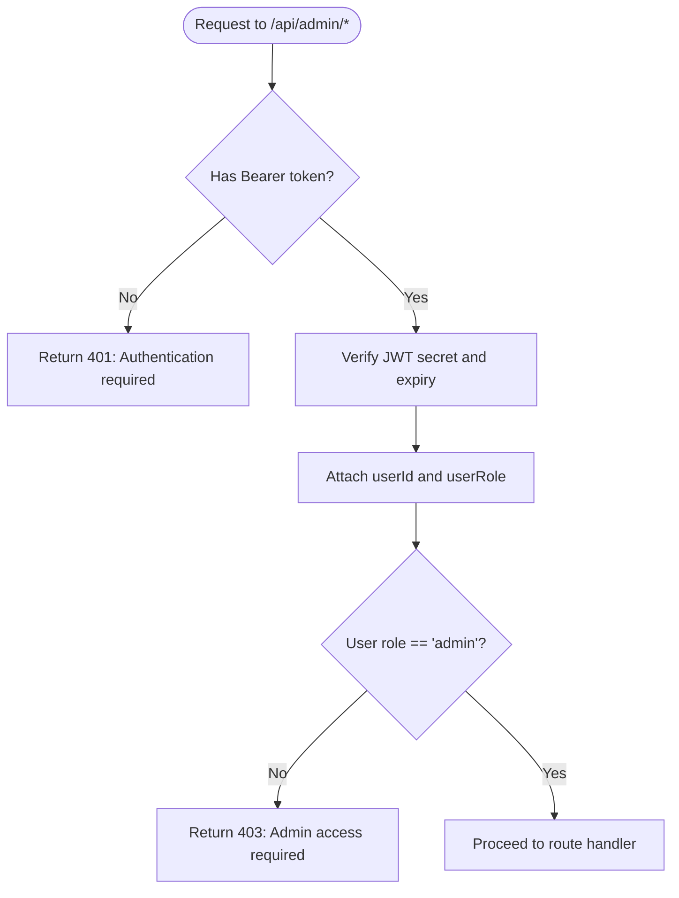

**Diagram sources**
- [auth.ts:22-58](file://backend/src/middleware/auth.ts#L22-L58)
- [auth_routes.ts:57-83](file://backend/src/routes/auth.ts#L57-L83)

**Section sources**
- [auth.ts:22-58](file://backend/src/middleware/auth.ts#L22-L58)
- [auth_routes.ts:57-83](file://backend/src/routes/auth.ts#L57-L83)

### Dashboard Statistics
- Endpoint aggregates total and active counts for lost and found items, plus match totals by status (pending, approved, disputed).
- Uses parallel queries to minimize latency and returns structured stats for the frontend to display.

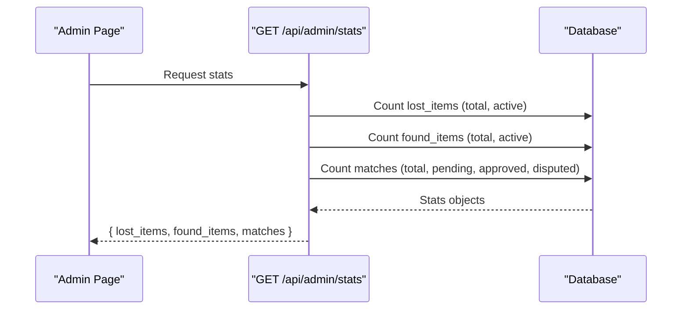

**Diagram sources**
- [admin.ts:18-47](file://backend/src/routes/admin.ts#L18-L47)

**Section sources**
- [admin.ts:18-47](file://backend/src/routes/admin.ts#L18-L47)

### Pending Match Review
- Lists matches with pagination and optional status filter; includes score, categories, descriptions, and fraud flags.
- Supports approving or rejecting matches; on approval, both related items are marked verified and notifications are sent to parties. On rejection, items revert to active if they were matched.

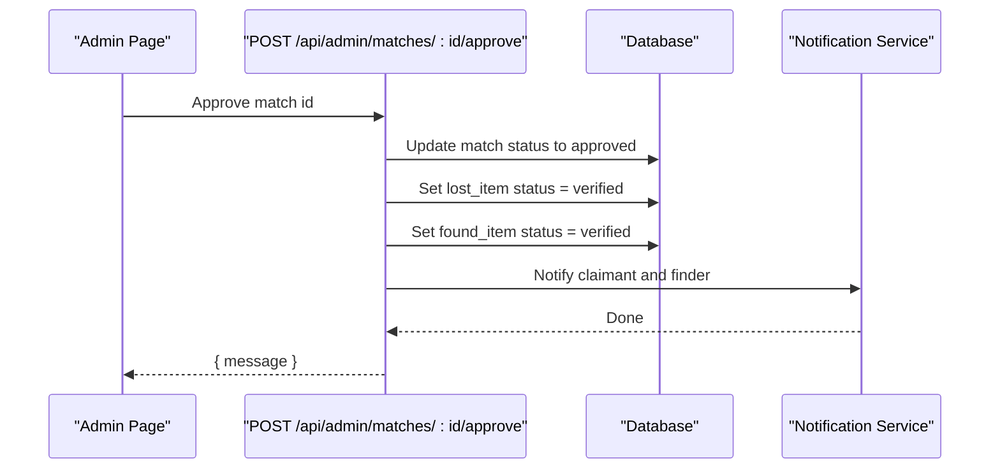

**Diagram sources**
- [admin.ts:88-128](file://backend/src/routes/admin.ts#L88-L128)

**Section sources**
- [admin.ts:53-83](file://backend/src/routes/admin.ts#L53-L83)
- [admin.ts:88-128](file://backend/src/routes/admin.ts#L88-L128)
- [admin.ts:133-180](file://backend/src/routes/admin.ts#L133-L180)

### Dispute Resolution and Fraud Detection
- Retrieves disputed or fraud-flagged matches with pagination; includes claimant and finder details, scores, and reasons.
- Fetches verification questions and attempts per match to provide full context for admin decisions.
- Allows manual flagging/unflagging of matches with reasons and timestamps; notifies parties when under review.

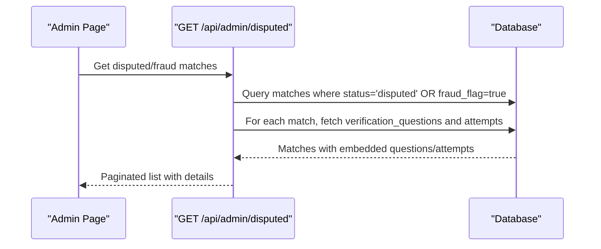

**Diagram sources**
- [admin.ts:235-307](file://backend/src/routes/admin.ts#L235-L307)

**Section sources**
- [admin.ts:235-307](file://backend/src/routes/admin.ts#L235-L307)
- [admin.ts:317-365](file://backend/src/routes/admin.ts#L317-L365)
- [admin.ts:371-388](file://backend/src/routes/admin.ts#L371-L388)
- [fraud_flag_migration.sql:5-12](file://supabase/migrations/003_admin_fraud_flag.sql#L5-L12)

### Item Status Lifecycle Management
- Admins can update item status to active → matched → verified → returned/closed using a dedicated endpoint.
- Valid statuses are enforced; transitions are logged in an audit trail table with actor and reason.
- Notifications are sent to item owners when items are marked returned or closed.

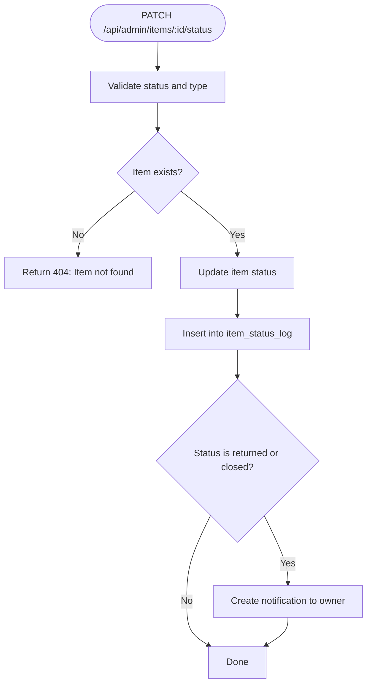

**Diagram sources**
- [admin.ts:186-228](file://backend/src/routes/admin.ts#L186-L228)
- [initial_schema.sql:224-236](file://supabase/migrations/001_initial_schema.sql#L224-L236)

**Section sources**
- [admin.ts:186-228](file://backend/src/routes/admin.ts#L186-L228)
- [initial_schema.sql:14-20](file://supabase/migrations/001_initial_schema.sql#L14-L20)
- [initial_schema.sql:224-236](file://supabase/migrations/001_initial_schema.sql#L224-L236)

### Verification Attempt History Inspection
- The disputed endpoint enriches matches with verification questions and attempts, enabling admins to inspect question text, correct answers, and answer judgments.
- Attempts include attempt number, answer text, correctness, and judgment timestamp, supporting informed decisions.

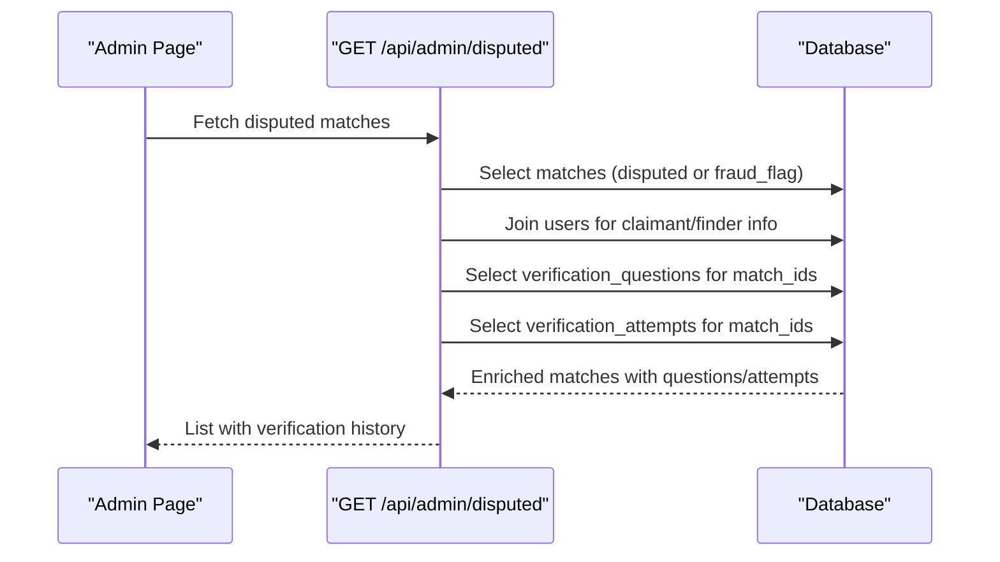

**Diagram sources**
- [admin.ts:235-307](file://backend/src/routes/admin.ts#L235-L307)
- [initial_schema.sql:169-199](file://supabase/migrations/001_initial_schema.sql#L169-L199)

**Section sources**
- [admin.ts:235-307](file://backend/src/routes/admin.ts#L235-L307)
- [initial_schema.sql:169-199](file://supabase/migrations/001_initial_schema.sql#L169-L199)

### User Management
- Roles are stored in the users table and enforced server-side for admin access.
- Admins can be assigned roles via database updates or seeding scripts; login flow returns role in JWT payload.
- Row-level security policies restrict access to sensitive fields and ensure users see only permitted data.

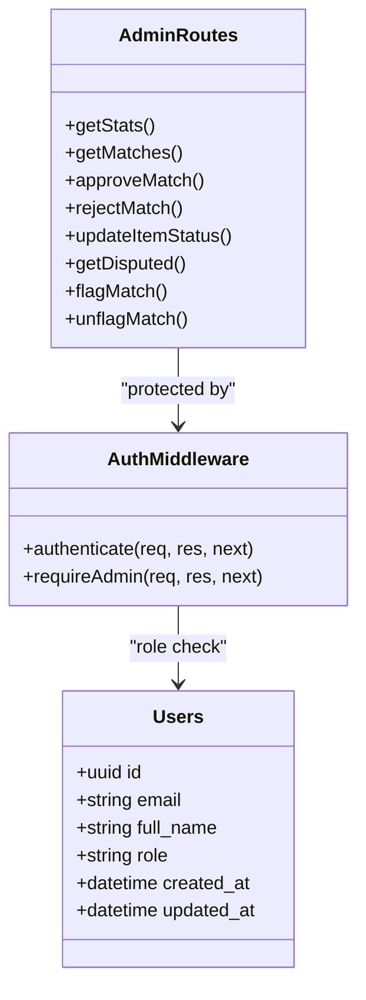

**Diagram sources**
- [auth.ts:22-58](file://backend/src/middleware/auth.ts#L22-L58)
- [admin.ts:1-12](file://backend/src/routes/admin.ts#L1-L12)
- [initial_schema.sql:54-64](file://supabase/migrations/001_initial_schema.sql#L54-L64)

**Section sources**
- [auth.ts:22-58](file://backend/src/middleware/auth.ts#L22-L58)
- [initial_schema.sql:54-64](file://supabase/migrations/001_initial_schema.sql#L54-L64)
- [initial_schema.sql:319-365](file://supabase/migrations/001_initial_schema.sql#L319-L365)

### Admin Workflows and Escalation Procedures
- Workflow steps:
  - Review pending matches and decide approve/reject.
  - Inspect disputed/fraud cases with verification history to make informed decisions.
  - Mark items as returned or closed post-handoff; system notifies owners.
  - Flag suspicious matches for deeper investigation; unflag when cleared.
- Escalation:
  - When verification retries exceed configured limits, cases escalate to admin review automatically (via disputed status).
  - Admins can manually flag matches to trigger escalated review.

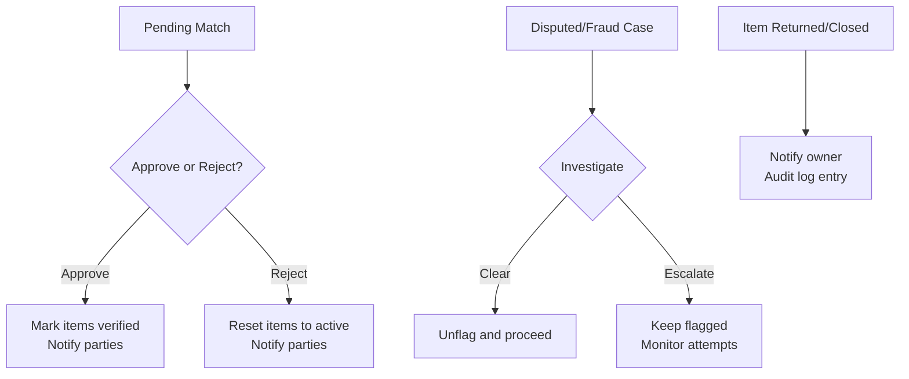

**Diagram sources**
- [admin.ts:88-180](file://backend/src/routes/admin.ts#L88-L180)
- [admin.ts:235-307](file://backend/src/routes/admin.ts#L235-L307)
- [admin.ts:186-228](file://backend/src/routes/admin.ts#L186-L228)

**Section sources**
- [admin.ts:88-180](file://backend/src/routes/admin.ts#L88-L180)
- [admin.ts:235-307](file://backend/src/routes/admin.ts#L235-L307)
- [admin.ts:186-228](file://backend/src/routes/admin.ts#L186-L228)

### Reporting Capabilities
- Dashboard statistics provide high-level metrics for lost/found items and matches by status.
- Disputed/fraud listing supports pagination and includes detailed context for reporting and auditing.
- Audit trail via item_status_log records all status changes with actor and reason for compliance and analysis.

**Section sources**
- [admin.ts:18-47](file://backend/src/routes/admin.ts#L18-L47)
- [admin.ts:235-307](file://backend/src/routes/admin.ts#L235-L307)
- [initial_schema.sql:224-236](file://supabase/migrations/001_initial_schema.sql#L224-L236)

### Security Considerations and Access Control
- All admin endpoints require valid JWT and admin role; unauthorized access returns 401/403.
- Role enforcement queries the database to prevent reliance solely on JWT claims.
- Row-level security policies limit visibility to active items and restrict access to private fields until verification.
- Error handling standardizes responses and prevents leaking internal errors.

**Section sources**
- [auth.ts:22-58](file://backend/src/middleware/auth.ts#L22-L58)
- [initial_schema.sql:319-365](file://supabase/migrations/001_initial_schema.sql#L319-L365)
- [errorHandler.ts:16-47](file://backend/src/middleware/errorHandler.ts#L16-L47)

## Dependency Analysis
- Admin routes depend on authentication middleware, error handling, validation, database pool, and notification service.
- Frontend admin page depends on typed API client methods for fetching stats, matches, disputed cases, and performing actions.
- Database schema defines relationships and constraints that underpin admin operations.

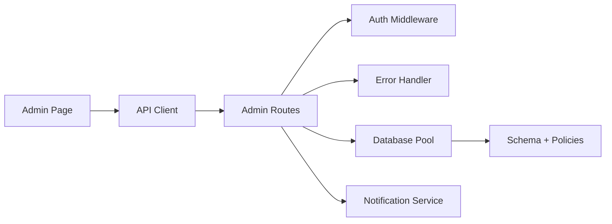

**Diagram sources**
- [admin_page.tsx:1-363](file://frontend/app/admin/page.tsx#L1-L363)
- [api_client.ts:316-423](file://frontend/lib/api.ts#L316-L423)
- [admin.ts:1-389](file://backend/src/routes/admin.ts#L1-L389)
- [auth.ts:1-59](file://backend/src/middleware/auth.ts#L1-L59)
- [errorHandler.ts:1-56](file://backend/src/middleware/errorHandler.ts#L1-L56)
- [initial_schema.sql:14-49](file://supabase/migrations/001_initial_schema.sql#L14-L49)

**Section sources**
- [admin.ts:1-389](file://backend/src/routes/admin.ts#L1-L389)
- [api_client.ts:316-423](file://frontend/lib/api.ts#L316-L423)
- [auth.ts:1-59](file://backend/src/middleware/auth.ts#L1-L59)
- [errorHandler.ts:1-56](file://backend/src/middleware/errorHandler.ts#L1-L56)
- [initial_schema.sql:14-49](file://supabase/migrations/001_initial_schema.sql#L14-L49)

## Performance Considerations
- Parallel queries for stats reduce latency by fetching lost, found, and match counts concurrently.
- Pagination on matches and disputed lists prevents large payloads and improves responsiveness.
- Indexes on status and fraud_flag columns optimize filtering and retrieval for admin workflows.
- Avoid excessive nested queries; batch enrichment for verification questions/attempts per match list.

[No sources needed since this section provides general guidance]

## Troubleshooting Guide
- Authentication failures: Ensure Bearer token is present and valid; invalid/expired tokens return 401.
- Authorization failures: Non-admin users attempting admin endpoints receive 403; verify user role in database.
- Validation errors: Invalid status or type in item status updates return 400 with descriptive messages.
- Not found errors: Missing matches or items return 404; confirm IDs exist before actions.
- Unexpected errors: Centralized error handler returns standardized error responses; check logs for stack traces.

**Section sources**
- [auth.ts:22-58](file://backend/src/middleware/auth.ts#L22-L58)
- [admin.ts:88-128](file://backend/src/routes/admin.ts#L88-L128)
- [admin.ts:186-228](file://backend/src/routes/admin.ts#L186-L228)
- [errorHandler.ts:16-47](file://backend/src/middleware/errorHandler.ts#L16-L47)

## Conclusion
The admin dashboard provides robust tools for overseeing the Lost & Found AI Matcher system. Administrators can monitor statistics, review and adjudicate matches, handle disputes and fraud flags, manage item lifecycle statuses, and maintain audit trails. Authentication and authorization ensure secure access, while notifications keep users informed. The design emphasizes clarity, performance, and safety through validated inputs, strict schemas, and centralized error handling.

[No sources needed since this section summarizes without analyzing specific files]

## Appendices

### Common Administrative Tasks
- Approve a match: Use the approve action to finalize a verified handoff and notify parties.
- Reject a match: Reset matched items to active so they can be re-matched; notify parties.
- Mark items returned/closed: Update statuses and notify owners; audit entries are recorded.
- Investigate disputed/fraud cases: Review verification history and make informed decisions; flag/unflag as needed.

**Section sources**
- [admin.ts:88-180](file://backend/src/routes/admin.ts#L88-L180)
- [admin.ts:186-228](file://backend/src/routes/admin.ts#L186-L228)
- [admin.ts:235-307](file://backend/src/routes/admin.ts#L235-L307)

### Configuration Notes
- JWT secret and expiration are configured centrally; ensure strong secrets in production.
- Matching weights and thresholds influence match quality and escalation behavior.
- Email configuration enables notification delivery; failures do not block in-app notifications.

**Section sources**
- [config_index.ts:28-47](file://backend/src/config/index.ts#L28-L47)
- [notificationService.ts:19-62](file://backend/src/services/notificationService.ts#L19-L62)