# Architecture Overview

<cite>
**Referenced Files in This Document**
- [README.md](file://README.md)
- [server.ts](file://backend/src/server.ts)
- [config/index.ts](file://backend/src/config/index.ts)
- [auth.ts](file://backend/src/middleware/auth.ts)
- [auth.ts](file://backend/src/routes/auth.ts)
- [supabase.ts](file://backend/src/db/supabase.ts)
- [matchingEngine.ts](file://backend/src/services/matchingEngine.ts)
- [llmService.ts](file://backend/src/services/llmService.ts)
- [emailService.ts](file://backend/src/services/emailService.ts)
- [001_initial_schema.sql](file://supabase/migrations/001_initial_schema.sql)
- [api.ts](file://frontend/lib/api.ts)
- [supabase.ts](file://frontend/lib/supabase.ts)
- [layout.tsx](file://frontend/app/layout.tsx)
- [render.yaml](file://render.yaml)
- [vercel.json](file://frontend/vercel.json)
</cite>

## Table of Contents
1. [Introduction](#introduction)
2. [Project Structure](#project-structure)
3. [Core Components](#core-components)
4. [Architecture Overview](#architecture-overview)
5. [Detailed Component Analysis](#detailed-component-analysis)
6. [Dependency Analysis](#dependency-analysis)
7. [Performance Considerations](#performance-considerations)
8. [Security Model](#security-model)
9. [Scalability and Deployment](#scalability-and-deployment)
10. [Troubleshooting Guide](#troubleshooting-guide)
11. [Conclusion](#conclusion)

## Introduction
This document provides an architectural overview of the Lost & Found AI Matcher system. It explains how the Next.js frontend, Express.js backend, and Supabase database layer interact to deliver a privacy-first, AI-powered matching and verification workflow for lost and found items on university campuses. The system uses OpenAI for embeddings and image comparison, Resend for email notifications, and Supabase for authentication, storage, and PostgreSQL with pgvector for similarity search.

## Project Structure
The repository is organized into three primary layers:
- Frontend (Next.js 14): User interface, client-side API calls, and Supabase Storage uploads.
- Backend (Express + TypeScript): REST API, middleware, services, and integrations.
- Database (Supabase PostgreSQL): Schema, indexes, triggers, and row-level security policies.

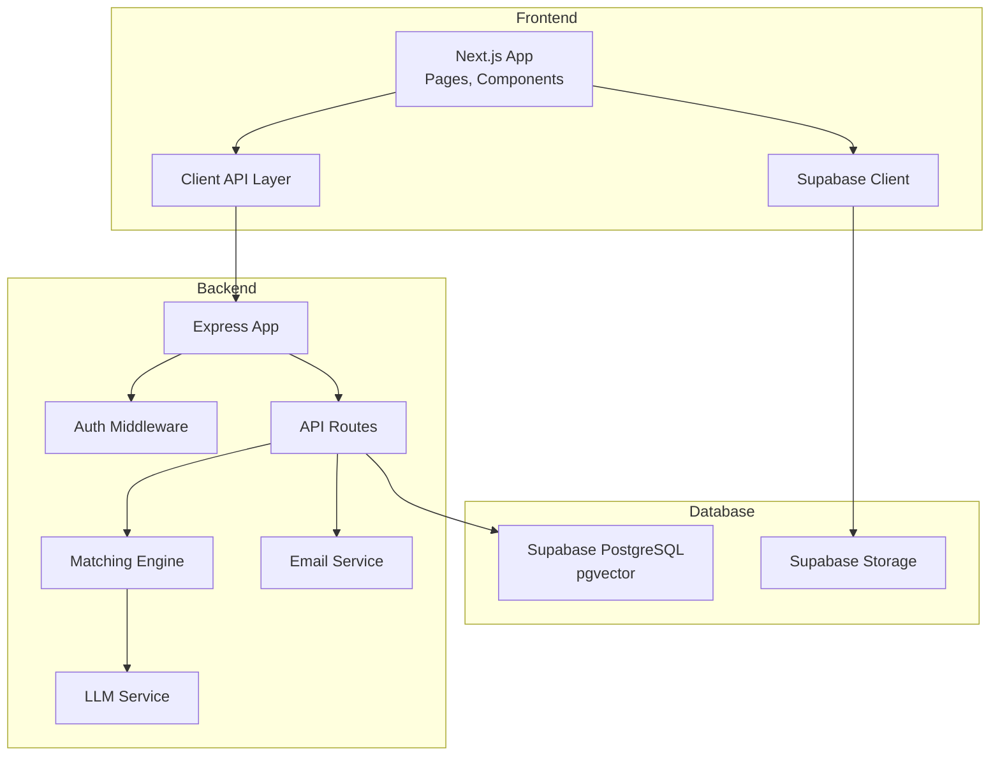

**Diagram sources**
- [server.ts:18-45](file://backend/src/server.ts#L18-L45)
- [api.ts:1-52](file://frontend/lib/api.ts#L1-L52)
- [supabase.ts:1-21](file://backend/src/db/supabase.ts#L1-L21)
- [matchingEngine.ts:37-188](file://backend/src/services/matchingEngine.ts#L37-L188)
- [llmService.ts:1-120](file://backend/src/services/llmService.ts#L1-L120)
- [emailService.ts:1-32](file://backend/src/services/emailService.ts#L1-L32)

**Section sources**
- [README.md:22-47](file://README.md#L22-L47)
- [server.ts:18-45](file://backend/src/server.ts#L18-L45)
- [layout.tsx:11-27](file://frontend/app/layout.tsx#L11-L27)

## Core Components
- Express server: Configures CORS, rate limiting, logging, and mounts route modules under /api.
- Authentication: JWT-based auth backed by Supabase Auth; admin role enforced via DB lookup.
- Matching engine: Computes weighted scores across description embeddings, images, location, time, and attributes; persists matches and emits notifications.
- LLM service: Generates embeddings, extracts structured fields, and compares images using vision models.
- Email service: Sends match and verification notifications via Resend.
- Database schema: Defines entities (users, lost_items, found_items, matches, verification questions/attempts, notifications), indexes, triggers, and RLS policies.

**Section sources**
- [server.ts:18-45](file://backend/src/server.ts#L18-L45)
- [auth.ts:22-58](file://backend/src/middleware/auth.ts#L22-L58)
- [auth.ts:16-108](file://backend/src/routes/auth.ts#L16-L108)
- [matchingEngine.ts:37-188](file://backend/src/services/matchingEngine.ts#L37-L188)
- [llmService.ts:9-119](file://backend/src/services/llmService.ts#L9-L119)
- [emailService.ts:15-31](file://backend/src/services/emailService.ts#L15-L31)
- [001_initial_schema.sql:14-259](file://supabase/migrations/001_initial_schema.sql#L14-L259)

## Architecture Overview
High-level flow:
- Frontend renders pages and collects user inputs.
- Client API layer sends authenticated requests to the backend.
- Backend validates tokens, enforces authorization, and delegates to services.
- Services call external APIs (OpenAI, Resend) and persist data to Supabase.
- Supabase enforces RLS and stores embeddings for vector similarity search.

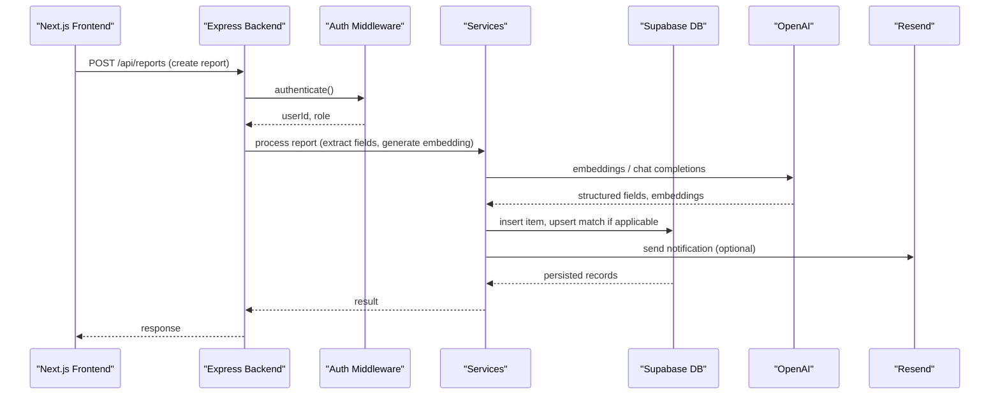

**Diagram sources**
- [server.ts:36-43](file://backend/src/server.ts#L36-L43)
- [auth.ts:22-37](file://backend/src/middleware/auth.ts#L22-L37)
- [matchingEngine.ts:37-188](file://backend/src/services/matchingEngine.ts#L37-L188)
- [llmService.ts:9-119](file://backend/src/services/llmService.ts#L9-L119)
- [emailService.ts:15-31](file://backend/src/services/emailService.ts#L15-L31)

## Detailed Component Analysis

### Backend Server and Routing
- Mounts middleware (helmet, cors, morgan, rate limiter).
- Registers routes for auth, reports, matches, verify, admin, notifications, upload, messages.
- Provides health endpoint for deployment probes.

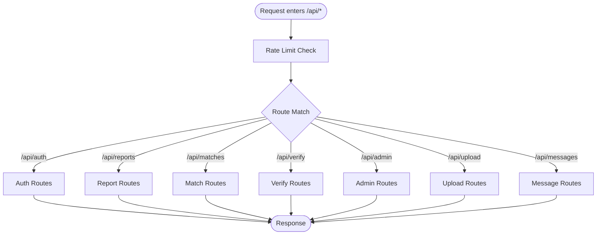

**Diagram sources**
- [server.ts:18-45](file://backend/src/server.ts#L18-L45)

**Section sources**
- [server.ts:18-45](file://backend/src/server.ts#L18-L45)

### Authentication Flow
- Signup creates a Supabase Auth user and mirrors metadata into local auth.users to trigger public.users creation.
- Login authenticates via Supabase, reads role from users table, issues JWT.
- authenticate middleware verifies JWT and attaches userId/userRole; requireAdmin checks DB role.

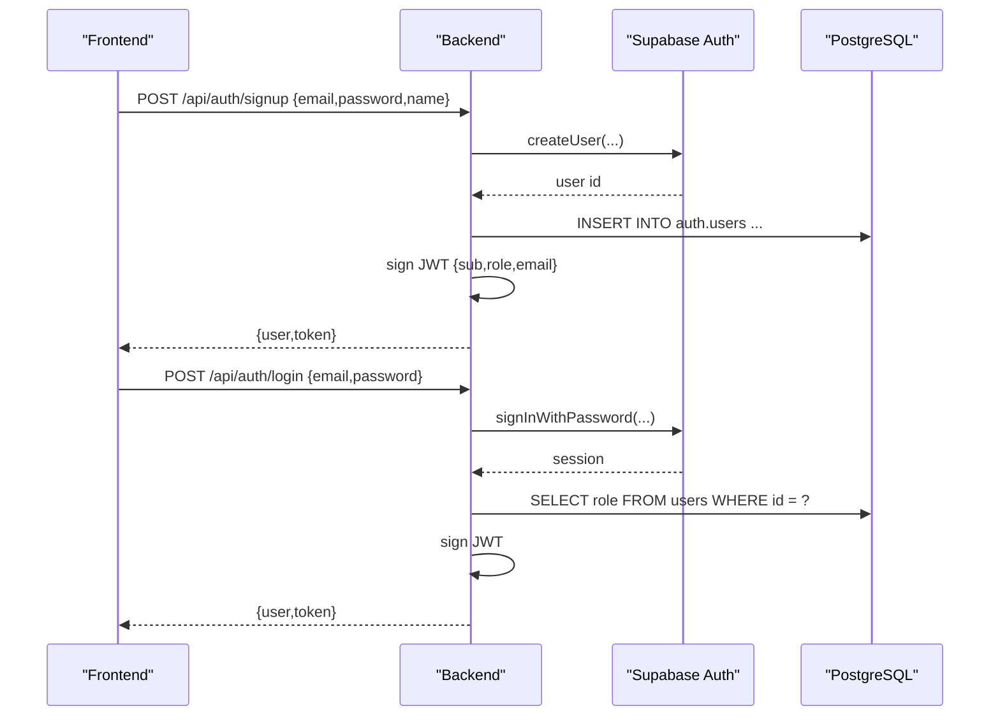

**Diagram sources**
- [auth.ts:16-108](file://backend/src/routes/auth.ts#L16-L108)
- [auth.ts:22-58](file://backend/src/middleware/auth.ts#L22-L58)

**Section sources**
- [auth.ts:16-108](file://backend/src/routes/auth.ts#L16-L108)
- [auth.ts:22-58](file://backend/src/middleware/auth.ts#L22-L58)

### Matching Engine
- Loads source item and candidate pool (active items from opposite type, excluding same owner).
- Scores candidates using:
  - Description similarity via embeddings cosine similarity or fallback text overlap.
  - Image similarity via OpenAI vision model when both have photos.
  - Location proximity using Haversine distance with configured radius.
  - Time proximity based on configured time window.
  - Attribute similarity on category/brand/colour.
- Persists matches with per-factor scores and notifies owners.

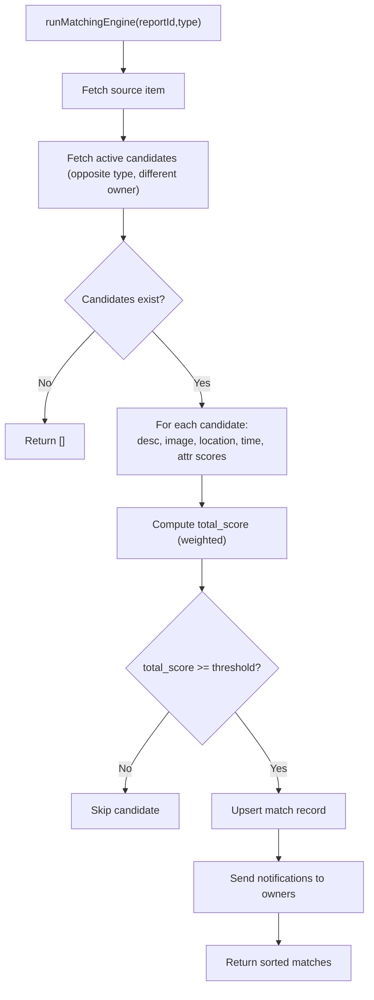

**Diagram sources**
- [matchingEngine.ts:37-188](file://backend/src/services/matchingEngine.ts#L37-L188)
- [config/index.ts:33-47](file://backend/src/config/index.ts#L33-L47)

**Section sources**
- [matchingEngine.ts:37-188](file://backend/src/services/matchingEngine.ts#L37-L188)
- [config/index.ts:33-47](file://backend/src/config/index.ts#L33-L47)

### LLM Service
- Embeddings: generates 1536-dim vectors for descriptions.
- Structured extraction: parses free-text into category/brand/colour.
- Image comparison: vision model returns similarity score between two item photos.

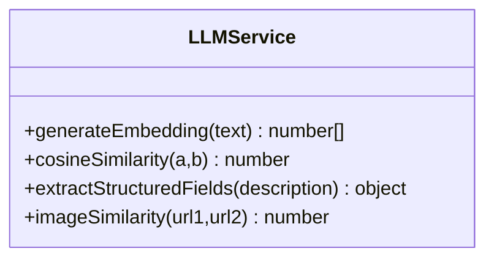

**Diagram sources**
- [llmService.ts:9-119](file://backend/src/services/llmService.ts#L9-L119)

**Section sources**
- [llmService.ts:9-119](file://backend/src/services/llmService.ts#L9-L119)

### Email Notifications
- Uses Resend to send emails for match and verification events.
- Gracefully skips sending if API key is missing.

**Section sources**
- [emailService.ts:15-31](file://backend/src/services/emailService.ts#L15-L31)

### Database Schema and Security Policies
- Entities: users, lost_items, found_items, matches, verification_questions, verification_attempts, notifications, item_status_log.
- Indexes: optimized for vector similarity (ivfflat), status, user, and relationship lookups.
- Triggers: updated_at auto-update; new user provisioning.
- RLS: restricts access to own profile, active listings, and match visibility to involved parties.

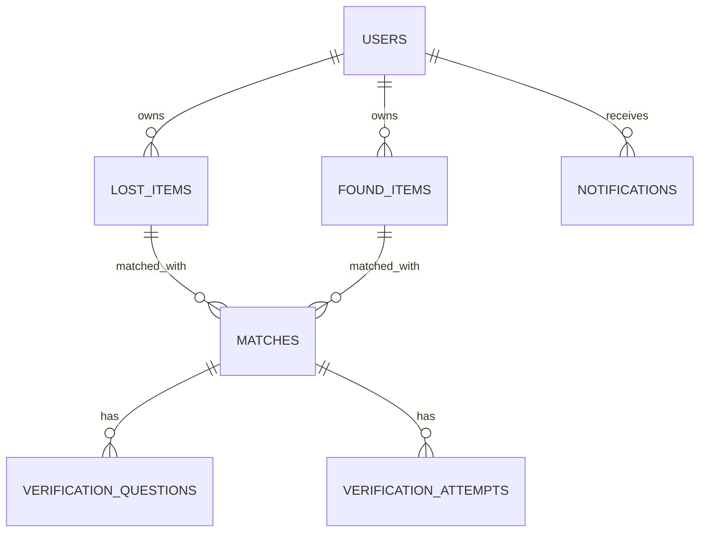

**Diagram sources**
- [001_initial_schema.sql:54-259](file://supabase/migrations/001_initial_schema.sql#L54-L259)

**Section sources**
- [001_initial_schema.sql:54-259](file://supabase/migrations/001_initial_schema.sql#L54-L259)

### Frontend Integration
- API client: centralized fetch wrapper with token injection and error handling.
- Supabase client: direct storage uploads for item photos.
- Layout: root layout with global styles and toasts.

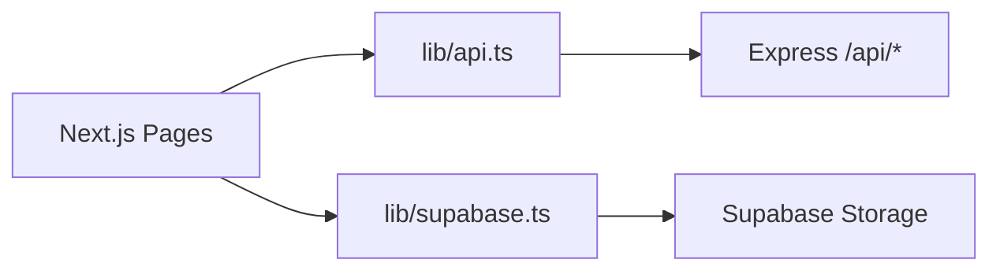

**Diagram sources**
- [api.ts:1-52](file://frontend/lib/api.ts#L1-L52)
- [supabase.ts:11-24](file://frontend/lib/supabase.ts#L11-L24)
- [layout.tsx:11-27](file://frontend/app/layout.tsx#L11-L27)

**Section sources**
- [api.ts:1-52](file://frontend/lib/api.ts#L1-L52)
- [supabase.ts:11-24](file://frontend/lib/supabase.ts#L11-L24)
- [layout.tsx:11-27](file://frontend/app/layout.tsx#L11-L27)

## Dependency Analysis
Key dependencies and their roles:
- Express: HTTP server and routing.
- Supabase JS SDK: Admin and anon clients for DB and Auth.
- OpenAI SDK: embeddings, chat completions, vision.
- Resend: transactional email.
- JWT: stateless session tokens for backend API.
- pg: direct Postgres connection for queries and migrations.

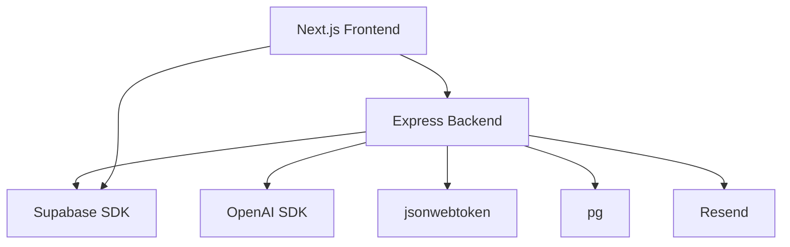

**Diagram sources**
- [package.json:16-31](file://backend/package.json#L16-L31)
- [package.json:11-18](file://frontend/package.json#L11-L18)

**Section sources**
- [package.json:16-31](file://backend/package.json#L16-L31)
- [package.json:11-18](file://frontend/package.json#L11-L18)

## Performance Considerations
- Vector similarity: pgvector with ivfflat index accelerates embedding searches.
- Thresholding: minScoreThreshold filters low-confidence matches early.
- Image comparisons: only invoked when both items have photos; fallbacks prevent blocking.
- Rate limiting: protects endpoints from abuse.
- Logging: Morgan logs for observability in production.

[No sources needed since this section provides general guidance]

## Security Model
- Authentication: Supabase Auth for identity; backend issues JWTs scoped to user and role.
- Authorization:
  - Middleware verifies JWT and attaches user context.
  - Admin-only actions enforce DB-backed role checks.
  - Row-Level Security policies restrict data visibility to relevant users and active listings.
- Data protection:
  - Private details and identifying info are not exposed until verification succeeds.
  - Service-role client used server-side; anon client respects RLS where appropriate.
  - CORS restricted to configured frontend URL.

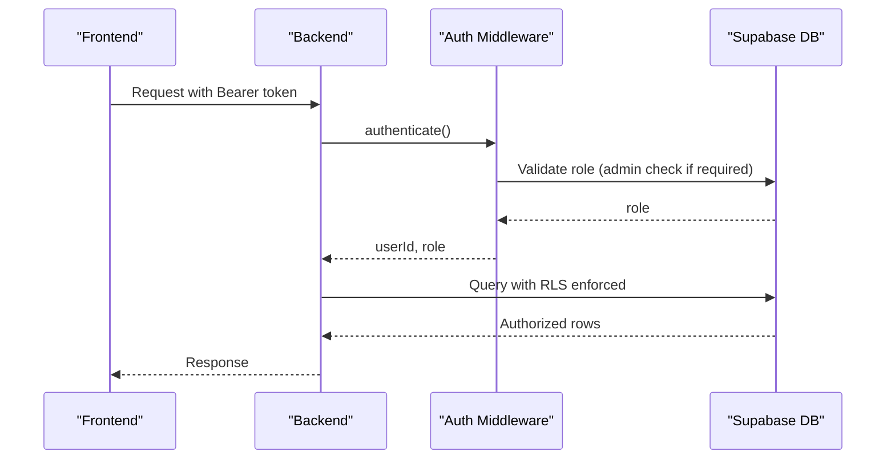

**Diagram sources**
- [auth.ts:22-58](file://backend/src/middleware/auth.ts#L22-L58)
- [001_initial_schema.sql:322-365](file://supabase/migrations/001_initial_schema.sql#L322-L365)

**Section sources**
- [auth.ts:22-58](file://backend/src/middleware/auth.ts#L22-L58)
- [001_initial_schema.sql:322-365](file://supabase/migrations/001_initial_schema.sql#L322-L365)

## Scalability and Deployment
- Frontend: Deployed on Vercel with Next.js build configuration.
- Backend: Deployed on Render as a Node web service with health checks and environment variables.
- Database: Supabase PostgreSQL with pgvector; indexes tuned for vector similarity and common queries.
- External services: OpenAI for embeddings and vision; Resend for email.
- Environment configuration: Centralized in backend config module; secrets managed via platform dashboards.

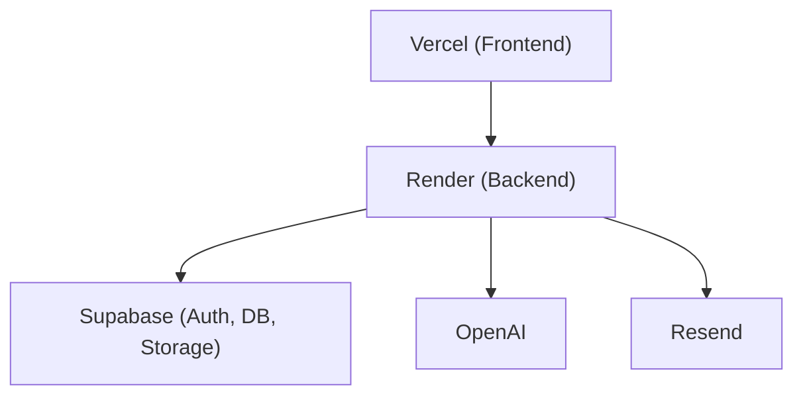

**Diagram sources**
- [render.yaml:4-54](file://render.yaml#L4-L54)
- [vercel.json:1-11](file://frontend/vercel.json#L1-L11)
- [config/index.ts:6-47](file://backend/src/config/index.ts#L6-L47)

**Section sources**
- [render.yaml:4-54](file://render.yaml#L4-L54)
- [vercel.json:1-11](file://frontend/vercel.json#L1-L11)
- [config/index.ts:6-47](file://backend/src/config/index.ts#L6-L47)

## Troubleshooting Guide
- Health check: Use GET /api/health to verify backend availability.
- Common errors:
  - Missing or invalid JWT: ensure Authorization header includes Bearer token.
  - CORS errors: confirm FRONTEND_URL matches deployed frontend origin.
  - Email failures: verify RESEND_API_KEY and EMAIL_FROM are set.
  - Vector index issues: ensure pgvector extension and ivfflat indexes are created.
- Logs: Review server logs (Morgan) for request traces and errors.

**Section sources**
- [server.ts:32-34](file://backend/src/server.ts#L32-L34)
- [emailService.ts:15-31](file://backend/src/services/emailService.ts#L15-L31)
- [001_initial_schema.sql:244-249](file://supabase/migrations/001_initial_schema.sql#L244-L249)

## Conclusion
The Lost & Found AI Matcher combines a modern frontend, a robust backend, and a secure database layer to deliver accurate, explainable matches and a privacy-preserving verification workflow. The separation of concerns, explicit integration points, and strong security controls make it suitable for campus-scale deployments with clear paths for scaling and maintenance.