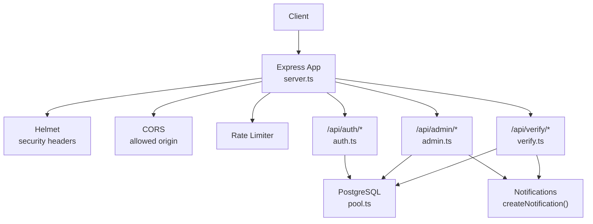
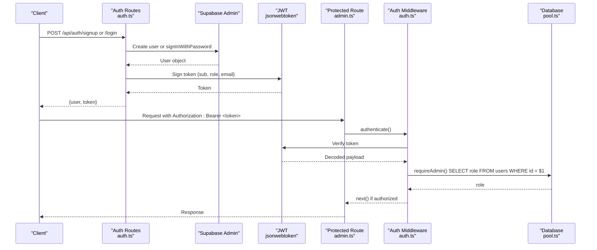
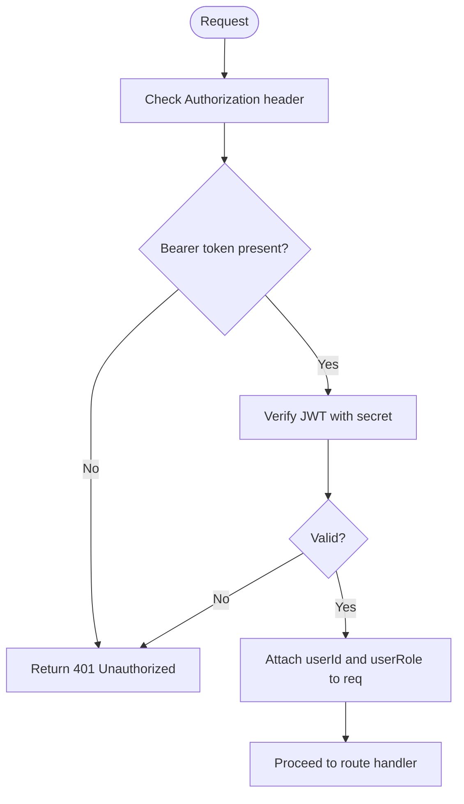
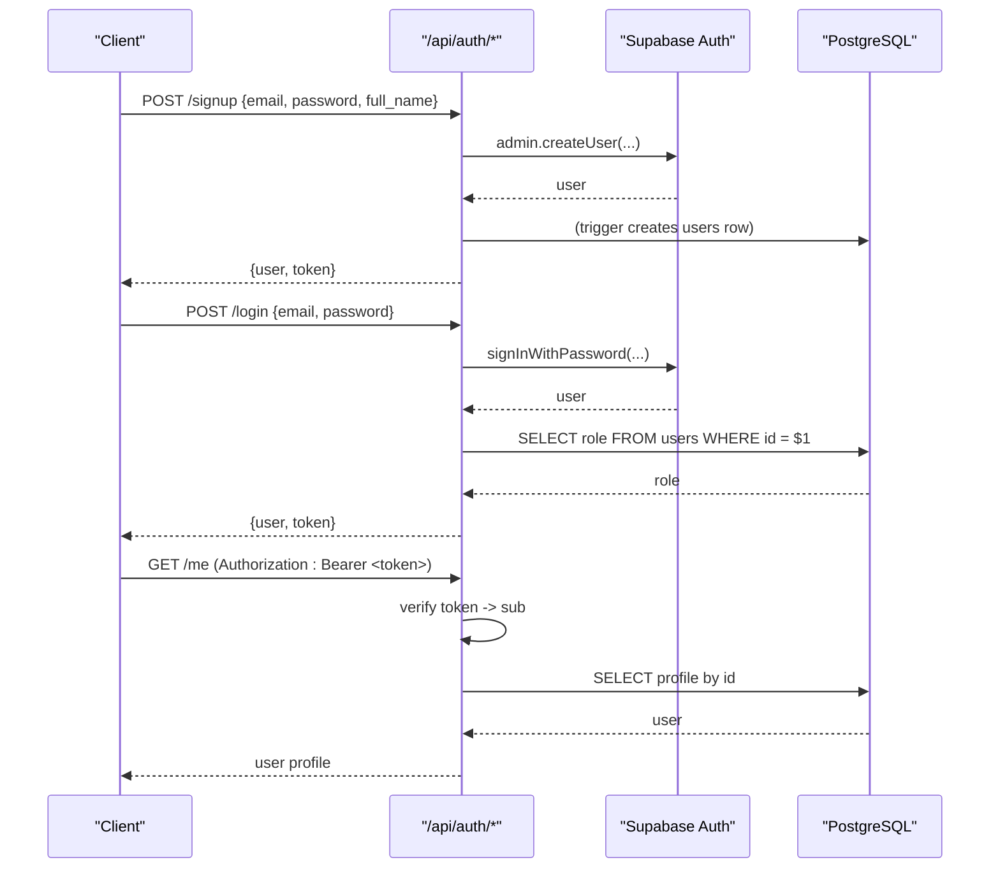
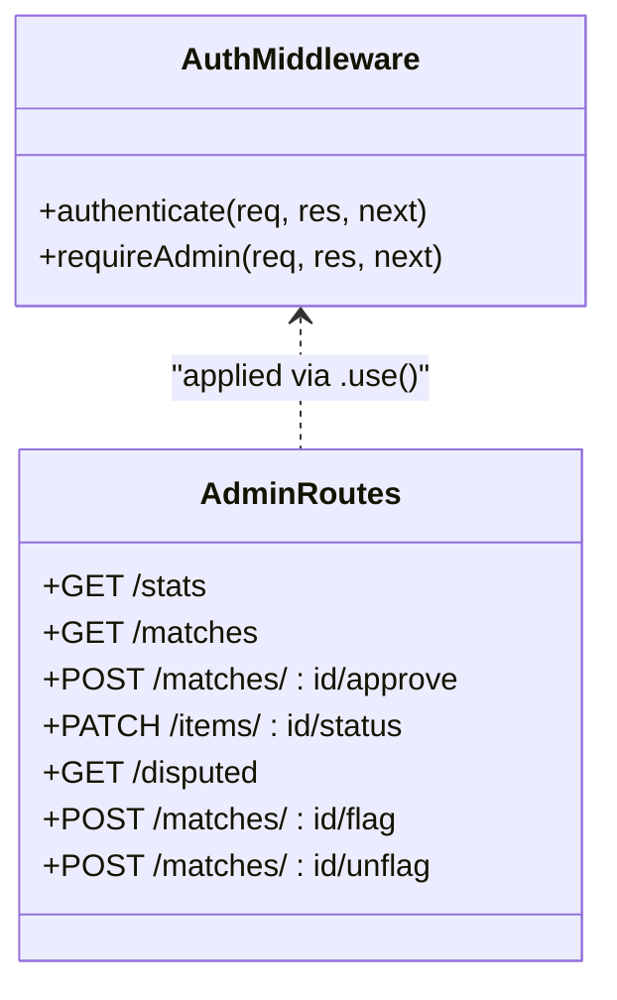
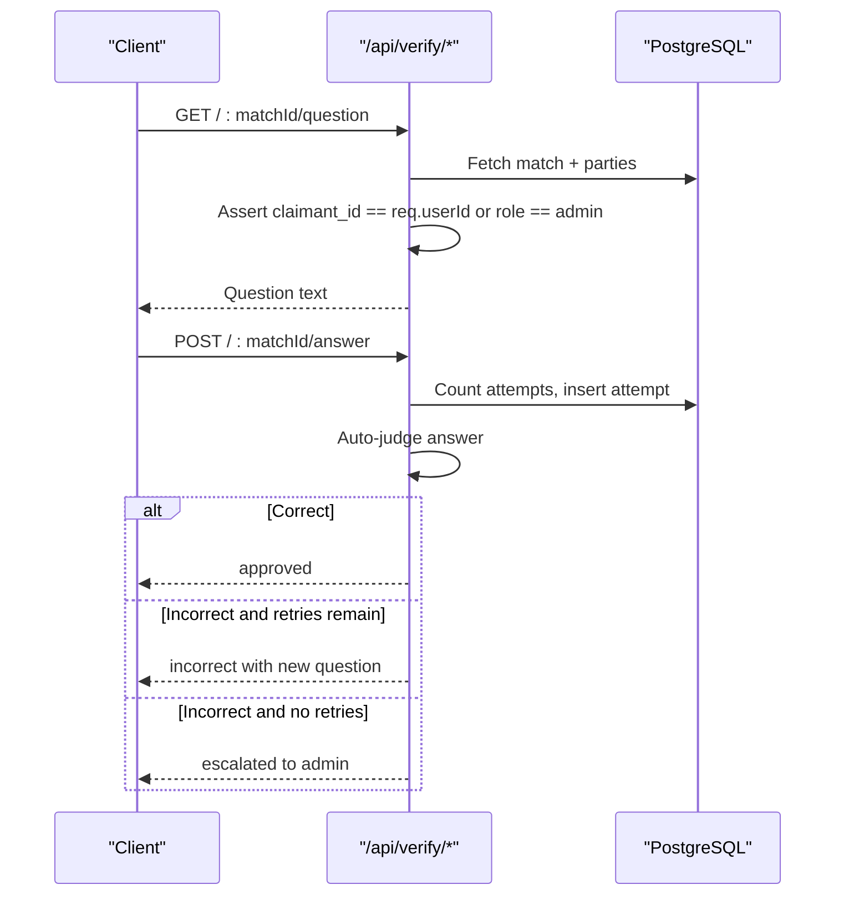
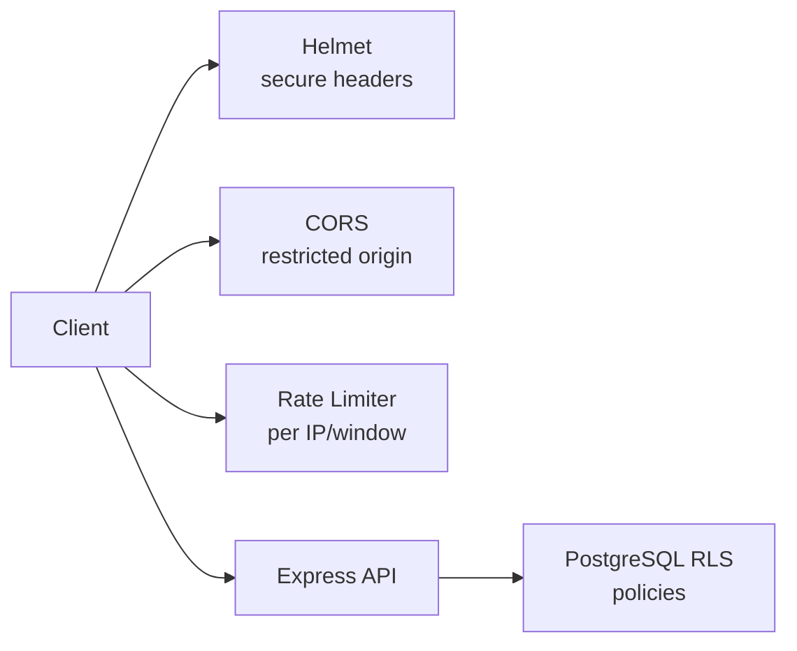
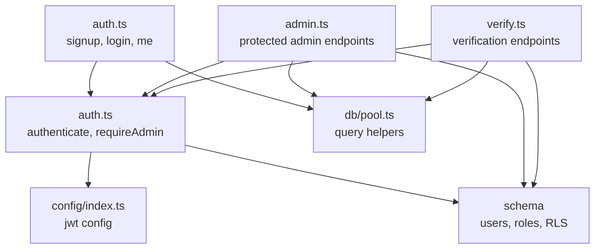

# Authentication & Authorization System

<cite>
**Referenced Files in This Document**
- [server.ts](file://backend/src/server.ts)
- [config/index.ts](file://backend/src/config/index.ts)
- [middleware/auth.ts](file://backend/src/middleware/auth.ts)
- [routes/auth.ts](file://backend/src/routes/auth.ts)
- [routes/admin.ts](file://backend/src/routes/admin.ts)
- [routes/verify.ts](file://backend/src/routes/verify.ts)
- [db/pool.ts](file://backend/src/db/pool.ts)
- [migrations/001_initial_schema.sql](file://supabase/migrations/001_initial_schema.sql)
</cite>

## Table of Contents
1. [Introduction](#introduction)
2. [Project Structure](#project-structure)
3. [Core Components](#core-components)
4. [Architecture Overview](#architecture-overview)
5. [Detailed Component Analysis](#detailed-component-analysis)
6. [Dependency Analysis](#dependency-analysis)
7. [Performance Considerations](#performance-considerations)
8. [Troubleshooting Guide](#troubleshooting-guide)
9. [Conclusion](#conclusion)

## Introduction
This document explains the authentication and authorization system for the Lost & Found AI Matcher backend. It covers JWT token generation and validation, user registration and login flows, profile retrieval, role-based access control (RBAC), security measures against common vulnerabilities, and middleware used to protect routes and enforce fine-grained authorization.

## Project Structure
The authentication and authorization logic is implemented across a small set of focused modules:
- Server bootstrap and global security middleware
- Configuration for JWT and environment settings
- Middleware for JWT verification and admin enforcement
- Routes for authentication endpoints and protected admin operations
- Database schema defining users, roles, and row-level security policies

**Diagram sources**
- [server.ts:18-45](file://backend/src/server.ts#L18-L45)
- [routes/auth.ts:10-98](file://backend/src/routes/auth.ts#L10-L98)
- [routes/admin.ts:9-12](file://backend/src/routes/admin.ts#L9-L12)
- [routes/verify.ts:10-12](file://backend/src/routes/verify.ts#L10-L12)
- [db/pool.ts:28-48](file://backend/src/db/pool.ts#L28-L48)

**Section sources**
- [server.ts:1-52](file://backend/src/server.ts#L1-L52)

## Core Components
- JWT configuration and signing/verification
- Authentication middleware that validates tokens and attaches user context
- Role-based authorization middleware that enforces admin-only access by checking the database
- Authentication routes for signup, login, and profile retrieval
- Protected admin routes with RBAC
- Row-level security policies in the database for additional protection

Key responsibilities:
- Generate short-lived JWTs on successful authentication
- Validate tokens on every protected request
- Enforce role checks at the route level using both JWT claims and database-backed role verification
- Provide safe error responses via a centralized error handler

**Section sources**
- [config/index.ts:28-31](file://backend/src/config/index.ts#L28-L31)
- [middleware/auth.ts:22-58](file://backend/src/middleware/auth.ts#L22-L58)
- [routes/auth.ts:16-98](file://backend/src/routes/auth.ts#L16-L98)
- [routes/admin.ts:11-12](file://backend/src/routes/admin.ts#L11-L12)

## Architecture Overview
The system uses stateless JWTs for API authentication and relies on Supabase Auth for credential management. Roles are stored in a local users table and enforced server-side.

**Diagram sources**
- [routes/auth.ts:16-72](file://backend/src/routes/auth.ts#L16-L72)
- [middleware/auth.ts:22-58](file://backend/src/middleware/auth.ts#L22-L58)
- [routes/admin.ts:11-12](file://backend/src/routes/admin.ts#L11-L12)
- [db/pool.ts:34-48](file://backend/src/db/pool.ts#L34-L48)

## Detailed Component Analysis

### JWT Token Lifecycle
- Generation: Tokens are signed with a secret from configuration and include sub (user id), role, and email. Expiration is configured centrally.
- Validation: The authenticate middleware verifies the token and attaches userId and userRole to the request.
- Refresh mechanism: There is no explicit refresh endpoint in the codebase. Clients should re-authenticate when the token expires.

**Diagram sources**
- [middleware/auth.ts:22-37](file://backend/src/middleware/auth.ts#L22-L37)
- [config/index.ts:28-31](file://backend/src/config/index.ts#L28-L31)

**Section sources**
- [routes/auth.ts:30-35](file://backend/src/routes/auth.ts#L30-L35)
- [routes/auth.ts:62-66](file://backend/src/routes/auth.ts#L62-L66)
- [middleware/auth.ts:22-37](file://backend/src/middleware/auth.ts#L22-L37)
- [config/index.ts:28-31](file://backend/src/config/index.ts#L28-L31)

### User Registration, Login, and Profile
- Signup: Creates a Supabase Auth user and issues a backend JWT. The database trigger auto-creates a users row.
- Login: Authenticates via Supabase, fetches the role from the users table, and issues a JWT.
- Profile: Retrieves the current user’s profile using the decoded sub from the token.

**Diagram sources**
- [routes/auth.ts:16-98](file://backend/src/routes/auth.ts#L16-L98)
- [migrations/001_initial_schema.sql:278-294](file://supabase/migrations/001_initial_schema.sql#L278-L294)

**Section sources**
- [routes/auth.ts:16-41](file://backend/src/routes/auth.ts#L16-L41)
- [routes/auth.ts:46-72](file://backend/src/routes/auth.ts#L46-L72)
- [routes/auth.ts:78-98](file://backend/src/routes/auth.ts#L78-L98)
- [migrations/001_initial_schema.sql:54-64](file://supabase/migrations/001_initial_schema.sql#L54-L64)

### Role-Based Access Control (RBAC)
- Roles: Users have a role field with values 'user' or 'admin'.
- Enforcement: The requireAdmin middleware checks the database role for the authenticated user, not just the JWT claim.
- Usage: All admin routes apply authenticate and requireAdmin globally.

**Diagram sources**
- [middleware/auth.ts:22-58](file://backend/src/middleware/auth.ts#L22-L58)
- [routes/admin.ts:11-12](file://backend/src/routes/admin.ts#L11-L12)

**Section sources**
- [middleware/auth.ts:43-58](file://backend/src/middleware/auth.ts#L43-L58)
- [routes/admin.ts:11-12](file://backend/src/routes/admin.ts#L11-L12)
- [migrations/001_initial_schema.sql:54-64](file://supabase/migrations/001_initial_schema.sql#L54-L64)

### Fine-Grained Authorization in Verification Flow
- Ownership checks: Endpoints verify that only the claimant (lost-item owner) or an admin can request questions or submit answers.
- Finder override: Only the finder (or admin) can judge attempts.
- These checks use userId attached by the auth middleware and role checks where necessary.

**Diagram sources**
- [routes/verify.ts:20-79](file://backend/src/routes/verify.ts#L20-L79)
- [routes/verify.ts:89-293](file://backend/src/routes/verify.ts#L89-L293)

**Section sources**
- [routes/verify.ts:20-79](file://backend/src/routes/verify.ts#L20-L79)
- [routes/verify.ts:89-293](file://backend/src/routes/verify.ts#L89-L293)

### Password Hashing Strategy
- Password hashing is delegated to Supabase Auth. The backend never stores or handles raw passwords; it uses Supabase Admin APIs to create users and sign in.

**Section sources**
- [routes/auth.ts:16-41](file://backend/src/routes/auth.ts#L16-L41)
- [routes/auth.ts:46-72](file://backend/src/routes/auth.ts#L46-L72)

### Session Management
- The system is stateless: there is no server-side session store. Authentication relies on JWTs sent in the Authorization header.
- No refresh token flow is implemented; clients must re-login upon expiration.

**Section sources**
- [middleware/auth.ts:22-37](file://backend/src/middleware/auth.ts#L22-L37)
- [routes/auth.ts:30-35](file://backend/src/routes/auth.ts#L30-L35)
- [routes/auth.ts:62-66](file://backend/src/routes/auth.ts#L62-L66)

### Security Measures Against Common Vulnerabilities
- CSRF: Not explicitly implemented. The API is stateless and expects Authorization headers rather than relying on cookies for authentication, which mitigates CSRF risk.
- XSS: Helmet is enabled to set secure HTTP headers.
- CORS: Configured to allow requests only from the configured frontend URL with credentials enabled.
- Rate Limiting: Applied to all API routes to mitigate brute-force and abuse.
- Input Validation: Centralized error handling and structured error responses; some routes use body validation schemas.
- Database Security: Row-Level Security (RLS) policies restrict data access based on user identity.

**Diagram sources**
- [server.ts:18-30](file://backend/src/server.ts#L18-L30)
- [migrations/001_initial_schema.sql:322-365](file://supabase/migrations/001_initial_schema.sql#L322-L365)

**Section sources**
- [server.ts:18-30](file://backend/src/server.ts#L18-L30)
- [migrations/001_initial_schema.sql:322-365](file://supabase/migrations/001_initial_schema.sql#L322-L365)

## Dependency Analysis
- Authentication middleware depends on JWT library and configuration for secrets and expiry.
- Auth routes depend on Supabase Admin client for user lifecycle and on the database pool to read roles and profiles.
- Admin routes depend on authentication and admin middleware, plus database queries and notification service.
- Verification routes depend on authentication, database, and verification services.

**Diagram sources**
- [middleware/auth.ts:22-58](file://backend/src/middleware/auth.ts#L22-L58)
- [routes/auth.ts:16-98](file://backend/src/routes/auth.ts#L16-L98)
- [routes/admin.ts:11-12](file://backend/src/routes/admin.ts#L11-L12)
- [routes/verify.ts:10-12](file://backend/src/routes/verify.ts#L10-L12)
- [config/index.ts:28-31](file://backend/src/config/index.ts#L28-L31)
- [db/pool.ts:34-48](file://backend/src/db/pool.ts#L34-L48)
- [migrations/001_initial_schema.sql:54-64](file://supabase/migrations/001_initial_schema.sql#L54-L64)

**Section sources**
- [middleware/auth.ts:22-58](file://backend/src/middleware/auth.ts#L22-L58)
- [routes/auth.ts:16-98](file://backend/src/routes/auth.ts#L16-L98)
- [routes/admin.ts:11-12](file://backend/src/routes/admin.ts#L11-L12)
- [routes/verify.ts:10-12](file://backend/src/routes/verify.ts#L10-L12)
- [config/index.ts:28-31](file://backend/src/config/index.ts#L28-L31)
- [db/pool.ts:34-48](file://backend/src/db/pool.ts#L34-L48)
- [migrations/001_initial_schema.sql:54-64](file://supabase/migrations/001_initial_schema.sql#L54-L64)

## Performance Considerations
- JWT verification is fast and stateless; ensure the secret is strong and rotation is planned.
- Database queries are parameterized to prevent injection and leverage indexes defined in the schema.
- Rate limiting protects endpoints from excessive requests.
- Notifications are asynchronous and non-blocking for critical paths.

[No sources needed since this section provides general guidance]

## Troubleshooting Guide
Common errors and their origins:
- 401 Unauthorized: Missing or invalid Authorization header or expired/invalid JWT.
- 403 Forbidden: Insufficient permissions (e.g., non-admin accessing admin routes).
- 404 Not Found: User or resource not found.
- 429 Too Many Requests: Rate limit exceeded.
- Unexpected errors: Centralized error handler returns standardized JSON.

Operational tips:
- Ensure JWT_SECRET is set securely in production.
- Verify CORS origin matches the frontend domain.
- Confirm database connection string and SSL settings for non-local environments.
- Use the health endpoint to verify API availability.

**Section sources**
- [middleware/errorHandler.ts:16-55](file://backend/src/middleware/errorHandler.ts#L16-L55)
- [server.ts:32-34](file://backend/src/server.ts#L32-L34)
- [server.ts:25-30](file://backend/src/server.ts#L25-L30)

## Conclusion
The system implements robust, stateless authentication using JWTs and delegates password storage to Supabase Auth. Authorization is enforced through middleware that validates tokens and checks roles against the database. Security is strengthened by Helmet, CORS restrictions, rate limiting, and PostgreSQL Row-Level Security. While there is no built-in token refresh flow, the design keeps the API simple and scalable. For enhanced resilience, consider adding token refresh endpoints, stricter input validation across all routes, and audit logging for sensitive operations.

[No sources needed since this section summarizes without analyzing specific files]