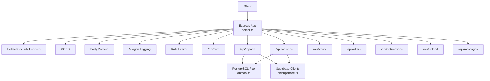
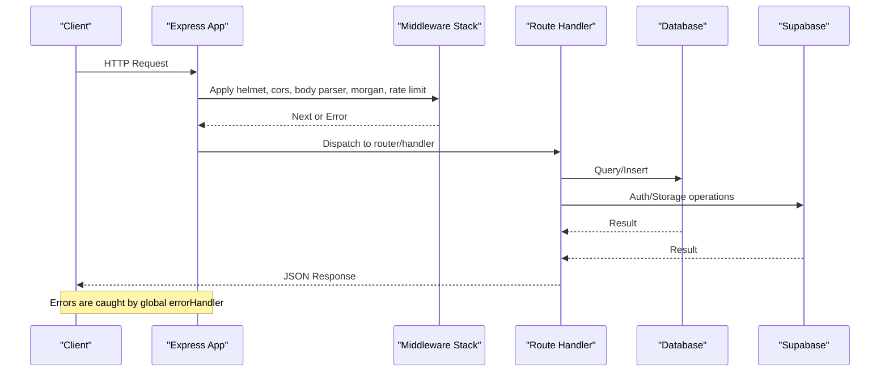
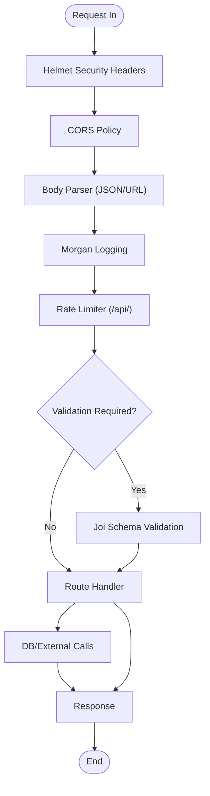
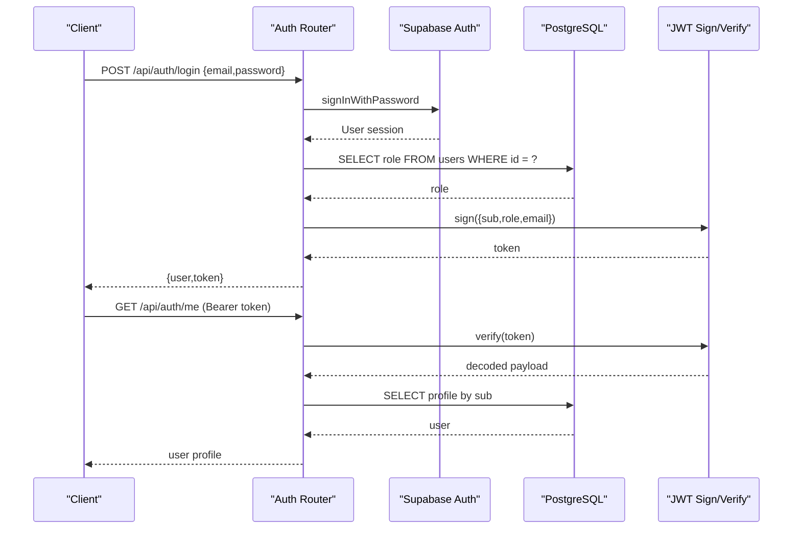
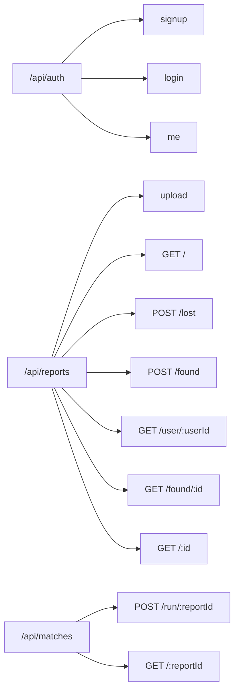
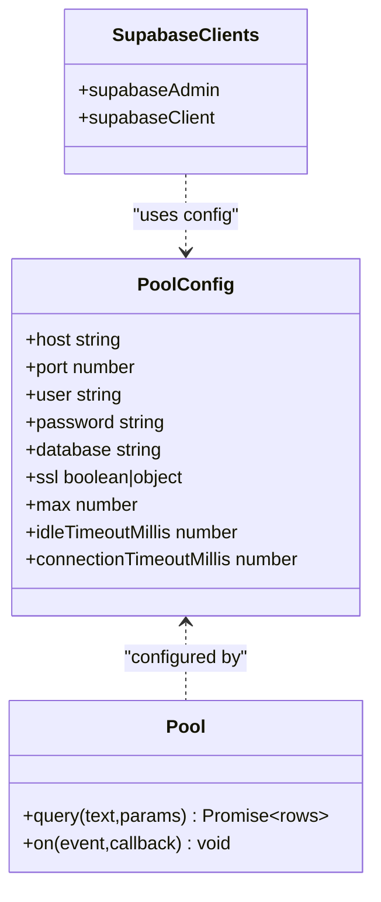
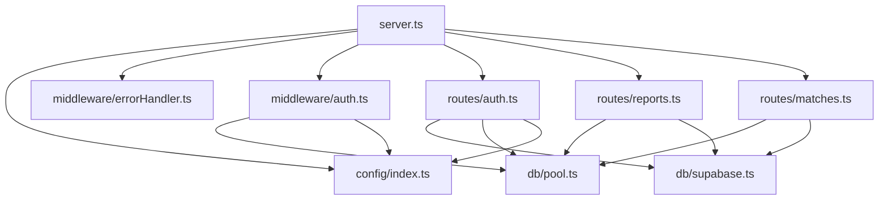

# Backend Architecture

<cite>
**Referenced Files in This Document**
- [server.ts](file://backend/src/server.ts)
- [index.ts](file://backend/src/config/index.ts)
- [auth.ts](file://backend/src/middleware/auth.ts)
- [errorHandler.ts](file://backend/src/middleware/errorHandler.ts)
- [validate.ts](file://backend/src/middleware/validate.ts)
- [pool.ts](file://backend/src/db/pool.ts)
- [supabase.ts](file://backend/src/db/supabase.ts)
- [auth.ts](file://backend/src/routes/auth.ts)
- [reports.ts](file://backend/src/routes/reports.ts)
- [matches.ts](file://backend/src/routes/matches.ts)
- [package.json](file://backend/package.json)
</cite>

## Table of Contents
1. Introduction
2. Project Structure
3. Core Components
4. Architecture Overview
5. Detailed Component Analysis
6. Dependency Analysis
7. Performance Considerations
8. Troubleshooting Guide
9. Conclusion

## Introduction
This document explains the backend architecture of the Express.js server for the Lost & Found AI Matcher. It covers the middleware pipeline (security headers, CORS, rate limiting, validation, error handling), route organization, request/response lifecycle, dependency injection patterns, authentication and authorization using JWT tokens, database connection management, configuration management, logging strategies, API design principles, error handling patterns, and security measures.

## Project Structure
The backend is organized by feature and layer:
- Server bootstrap and global middleware in server.ts
- Configuration via environment-driven config in config/index.ts
- Middleware for authentication, validation, and error handling
- Routes grouped by domain: auth, reports, matches, verify, admin, notifications, upload, messages
- Database access via a PostgreSQL pool and Supabase clients
- Services encapsulating business logic (matching, embeddings, uploads, email, notifications, verification)
- Utilities for shared algorithms (e.g., similarity)

**Diagram sources**
- [server.ts:1-52](file://backend/src/server.ts#L1-L52)
- [pool.ts:1-48](file://backend/src/db/pool.ts#L1-L48)
- [supabase.ts:1-21](file://backend/src/db/supabase.ts#L1-L21)

**Section sources**
- [server.ts:1-52](file://backend/src/server.ts#L1-L52)
- [package.json:16-31](file://backend/package.json#L16-L31)

## Core Components
- Application bootstrap and middleware stack: helmet, cors, body parsers, morgan, express-rate-limit, health endpoint, route mounting, error handler.
- Configuration: centralized env-based settings for ports, URLs, Supabase, database URL, OpenAI, email, JWT, matching parameters.
- Authentication and Authorization: JWT verification middleware, role enforcement against the database.
- Validation: Joi-based request body validation with reusable schemas.
- Error Handling: Centralized error class, multer error mapping, async wrapper to avoid unhandled rejections.
- Database: Connection pooling with SSL auto-detection, query helpers.
- External services: Supabase admin/anon clients for Auth and storage.

**Section sources**
- [server.ts:1-52](file://backend/src/server.ts#L1-L52)
- [index.ts:1-49](file://backend/src/config/index.ts#L1-L49)
- [auth.ts:1-59](file://backend/src/middleware/auth.ts#L1-L59)
- [validate.ts:1-61](file://backend/src/middleware/validate.ts#L1-L61)
- [errorHandler.ts:1-56](file://backend/src/middleware/errorHandler.ts#L1-L56)
- [pool.ts:1-48](file://backend/src/db/pool.ts#L1-L48)
- [supabase.ts:1-21](file://backend/src/db/supabase.ts#L1-L21)

## Architecture Overview
The server initializes an Express app, applies global middleware, mounts domain-specific routers under /api/*, and attaches a final error handler. Requests flow through:
1. Security headers (helmet)
2. CORS policy (origin from config)
3. Body parsing (JSON and URL-encoded)
4. Request logging (morgan)
5. Rate limiting (per IP on /api/)
6. Route-level middleware (authentication, authorization, validation)
7. Handler logic (database queries, external service calls)
8. Response serialization
9. Global error handling

**Diagram sources**
- [server.ts:18-45](file://backend/src/server.ts#L18-L45)
- [auth.ts:22-37](file://backend/src/middleware/auth.ts#L22-L37)
- [errorHandler.ts:16-47](file://backend/src/middleware/errorHandler.ts#L16-L47)
- [pool.ts:34-48](file://backend/src/db/pool.ts#L34-L48)
- [supabase.ts:8-20](file://backend/src/db/supabase.ts#L8-L20)

## Detailed Component Analysis

### Middleware Pipeline
- Security headers: helmet applied globally.
- CORS: configured with frontend origin and credentials enabled.
- Body parsing: JSON with size limit; URL-encoded with extended mode.
- Logging: Morgan with dev vs combined format based on environment.
- Rate limiting: 15-minute window, max 100 requests per IP on /api/.
- Validation: Joi-based schema validation middleware for request bodies.
- Error handling: Centralized handler for AppError, Multer errors, and unexpected errors; asyncHandler wraps route handlers.

**Diagram sources**
- [server.ts:19-30](file://backend/src/server.ts#L19-L30)
- [validate.ts:8-23](file://backend/src/middleware/validate.ts#L8-L23)
- [errorHandler.ts:16-47](file://backend/src/middleware/errorHandler.ts#L16-L47)

**Section sources**
- [server.ts:19-45](file://backend/src/server.ts#L19-L45)
- [validate.ts:1-61](file://backend/src/middleware/validate.ts#L1-L61)
- [errorHandler.ts:1-56](file://backend/src/middleware/errorHandler.ts#L1-L56)

### Authentication and Authorization (JWT)
- Token issuance: On signup/login, a JWT is signed with user id, role, and email, using a secret from configuration and an expiration time.
- Token verification: authenticate middleware extracts Bearer token, verifies signature, and attaches userId and userRole to the request.
- Role enforcement: requireAdmin checks the user’s role in the database to ensure admin privileges beyond JWT claims.

**Diagram sources**
- [auth.ts:16-72](file://backend/src/routes/auth.ts#L16-L72)
- [auth.ts:78-97](file://backend/src/routes/auth.ts#L78-L97)
- [auth.ts:22-37](file://backend/src/middleware/auth.ts#L22-L37)
- [auth.ts:43-58](file://backend/src/middleware/auth.ts#L43-L58)
- [index.ts:28-31](file://backend/src/config/index.ts#L28-L31)

**Section sources**
- [auth.ts:16-97](file://backend/src/routes/auth.ts#L16-L97)
- [auth.ts:22-58](file://backend/src/middleware/auth.ts#L22-L58)
- [index.ts:28-31](file://backend/src/config/index.ts#L28-L31)

### Route Organization and Request/Response Lifecycle
- Domain routers mounted under /api: auth, reports, matches, verify, admin, notifications, upload, messages.
- Each router typically uses authenticate middleware to enforce identity, then optional role checks and validation before executing handler logic.
- Handlers return structured JSON responses and throw AppError for consistent error handling.

**Diagram sources**
- [server.ts:36-43](file://backend/src/server.ts#L36-L43)
- [reports.ts:11-356](file://backend/src/routes/reports.ts#L11-L356)
- [matches.ts:7-115](file://backend/src/routes/matches.ts#L7-L115)
- [auth.ts:10-98](file://backend/src/routes/auth.ts#L10-L98)

**Section sources**
- [server.ts:36-43](file://backend/src/server.ts#L36-L43)
- [reports.ts:11-356](file://backend/src/routes/reports.ts#L11-L356)
- [matches.ts:7-115](file://backend/src/routes/matches.ts#L7-L115)
- [auth.ts:10-98](file://backend/src/routes/auth.ts#L10-L98)

### Database Connection Management
- PostgreSQL pool created from DATABASE_URL with automatic SSL for non-local hosts.
- Pool options include max connections, idle timeout, and connection timeout.
- Query helpers provide typed query and queryOne utilities used across routes and middleware.
- Supabase clients:
  - supabaseAdmin: service role key for server-side operations bypassing RLS.
  - supabaseClient: anon key respecting RLS for user-scoped operations.

**Diagram sources**
- [pool.ts:9-28](file://backend/src/db/pool.ts#L9-L28)
- [pool.ts:34-48](file://backend/src/db/pool.ts#L34-L48)
- [supabase.ts:8-20](file://backend/src/db/supabase.ts#L8-L20)
- [index.ts:11-17](file://backend/src/config/index.ts#L11-L17)

**Section sources**
- [pool.ts:1-48](file://backend/src/db/pool.ts#L1-L48)
- [supabase.ts:1-21](file://backend/src/db/supabase.ts#L1-L21)
- [index.ts:11-17](file://backend/src/config/index.ts#L11-L17)

### Configuration Management
- Environment variables loaded via dotenv from repository root .env.
- Centralized config object exposes:
  - Server: port, nodeEnv, frontendUrl
  - Supabase: url, anonKey, serviceRoleKey
  - Database: databaseUrl
  - OpenAI: apiKey
  - Email: resendApiKey, from
  - JWT: secret, expiresIn
  - Matching: weights, thresholds, radius, time window

**Section sources**
- [index.ts:1-49](file://backend/src/config/index.ts#L1-L49)

### Logging Strategies
- Morgan logger configured with dev format in development and combined format in production.
- Unhandled errors logged centrally in the error handler.

**Section sources**
- [server.ts:23-23](file://backend/src/server.ts#L23-L23)
- [errorHandler.ts:42-46](file://backend/src/middleware/errorHandler.ts#L42-L46)

### API Design Principles
- RESTful endpoints under /api with clear resource names.
- Consistent use of authentication middleware on protected routes.
- Input validation via Joi schemas with descriptive error messages.
- Pagination and filtering where applicable (e.g., listing reports).
- Clear separation of concerns: routes orchestrate, services implement logic, data access via pool/supabase.

**Section sources**
- [reports.ts:40-93](file://backend/src/routes/reports.ts#L40-L93)
- [reports.ts:98-171](file://backend/src/routes/reports.ts#L98-L171)
- [reports.ts:176-247](file://backend/src/routes/reports.ts#L176-L247)
- [validate.ts:27-61](file://backend/src/middleware/validate.ts#L27-L61)

### Error Handling Patterns
- AppError provides structured error responses with status codes.
- Multer errors mapped to user-friendly messages.
- asyncHandler ensures async route handlers propagate errors to the global handler.
- Centralized error response shape: { status: "error", message }.

**Section sources**
- [errorHandler.ts:4-47](file://backend/src/middleware/errorHandler.ts#L4-L47)
- [errorHandler.ts:49-55](file://backend/src/middleware/errorHandler.ts#L49-L55)

### Security Measures
- Helmet sets secure HTTP headers.
- CORS restricted to configured frontend origin with credentials enabled.
- Rate limiting protects APIs from abuse.
- JWT-based authentication with server-side role verification for sensitive actions.
- Private fields redacted for non-owners in report views.

**Section sources**
- [server.ts:19-30](file://backend/src/server.ts#L19-L30)
- [auth.ts:43-58](file://backend/src/middleware/auth.ts#L43-L58)
- [reports.ts:303-316](file://backend/src/routes/reports.ts#L303-L316)
- [reports.ts:348-352](file://backend/src/routes/reports.ts#L348-L352)

## Dependency Analysis
High-level dependencies between core modules:

**Diagram sources**
- [server.ts:1-52](file://backend/src/server.ts#L1-L52)
- [index.ts:1-49](file://backend/src/config/index.ts#L1-L49)
- [auth.ts:1-59](file://backend/src/middleware/auth.ts#L1-L59)
- [errorHandler.ts:1-56](file://backend/src/middleware/errorHandler.ts#L1-L56)
- [pool.ts:1-48](file://backend/src/db/pool.ts#L1-L48)
- [supabase.ts:1-21](file://backend/src/db/supabase.ts#L1-L21)
- [auth.ts:1-98](file://backend/src/routes/auth.ts#L1-L98)
- [reports.ts:1-356](file://backend/src/routes/reports.ts#L1-L356)
- [matches.ts:1-115](file://backend/src/routes/matches.ts#L1-L115)

**Section sources**
- [server.ts:1-52](file://backend/src/server.ts#L1-L52)
- [reports.ts:1-356](file://backend/src/routes/reports.ts#L1-L356)
- [matches.ts:1-115](file://backend/src/routes/matches.ts#L1-L115)
- [auth.ts:1-98](file://backend/src/routes/auth.ts#L1-L98)

## Performance Considerations
- Database pooling: Reuse connections with sensible limits and timeouts to reduce overhead.
- Non-blocking matching: Matching engine invoked after persisting reports to avoid blocking the response.
- Embedding search: Optional embedding generation and similarity search wrapped in try/catch to prevent failures from impacting core flows.
- Rate limiting: Protects backend resources under load.
- File uploads: Multer configured with size limits; large files handled gracefully via error mapping.

[No sources needed since this section provides general guidance]

## Troubleshooting Guide
- Authentication failures: Ensure Authorization header contains a valid Bearer token; verify JWT secret and expiration.
- Validation errors: Check request body against Joi schemas; error messages list all validation failures.
- Upload errors: Multer errors map to specific messages (e.g., file too large, unexpected field).
- Database issues: Monitor pool error events; verify DATABASE_URL and network connectivity; check SSL behavior for remote hosts.
- Unexpected errors: Centralized handler logs and returns a generic error; inspect server logs for stack traces.

**Section sources**
- [errorHandler.ts:16-47](file://backend/src/middleware/errorHandler.ts#L16-L47)
- [validate.ts:8-23](file://backend/src/middleware/validate.ts#L8-L23)
- [pool.ts:30-32](file://backend/src/db/pool.ts#L30-L32)

## Conclusion
The backend implements a robust, layered architecture with clear separation of concerns. Security is enforced at multiple layers (headers, CORS, rate limiting, JWT, role checks), while maintainability is achieved through modular routes, reusable middleware, and centralized configuration. Database access is abstracted behind a pool with typed helpers, and external integrations are cleanly encapsulated. The error handling strategy ensures consistent client feedback and operational visibility.