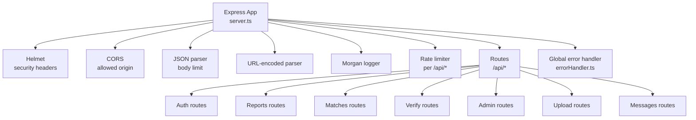
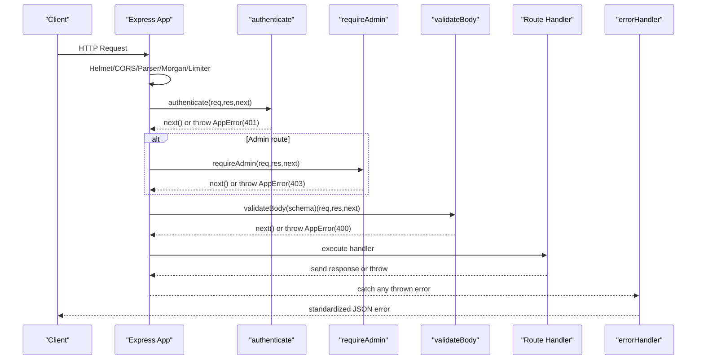
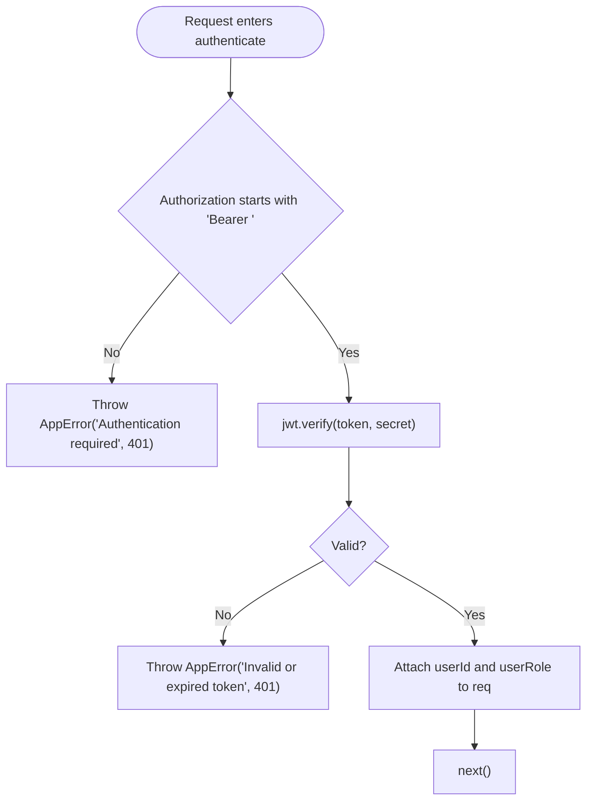
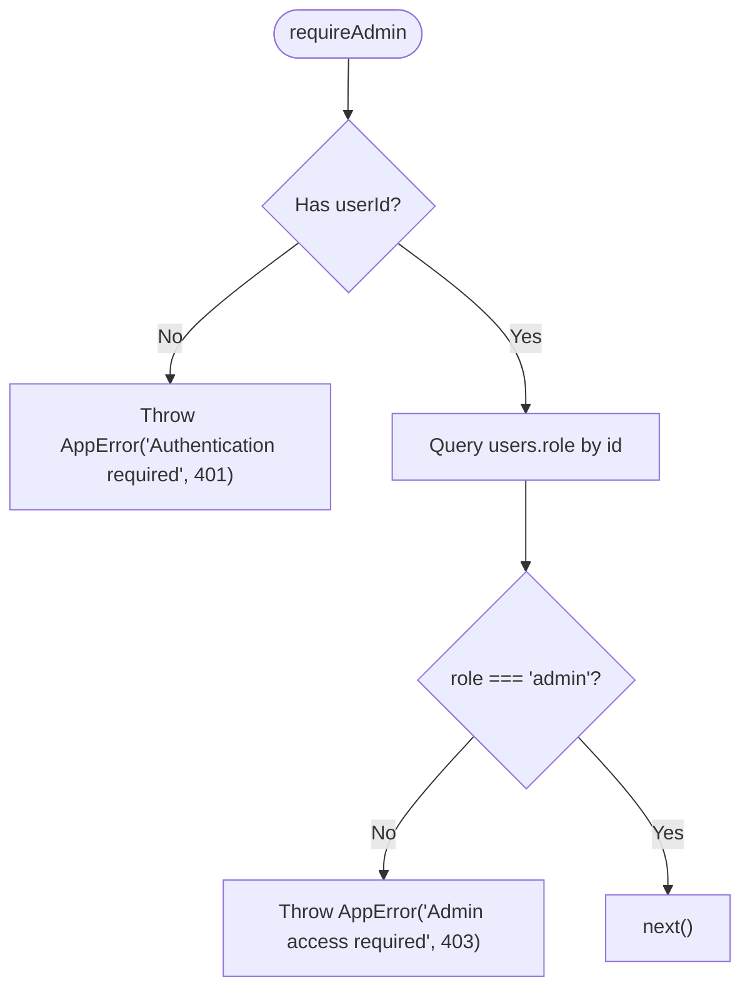
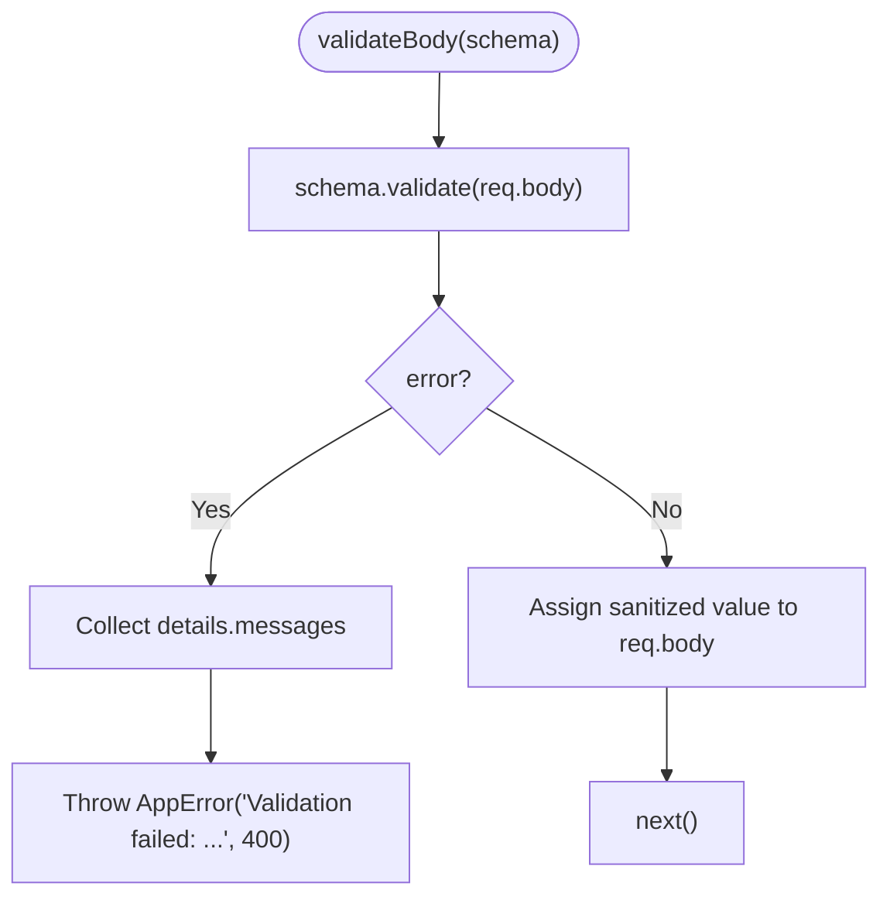
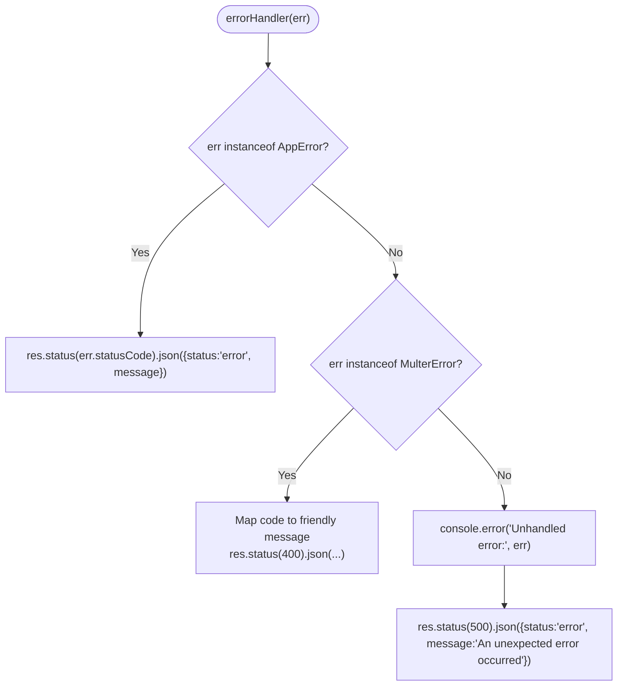
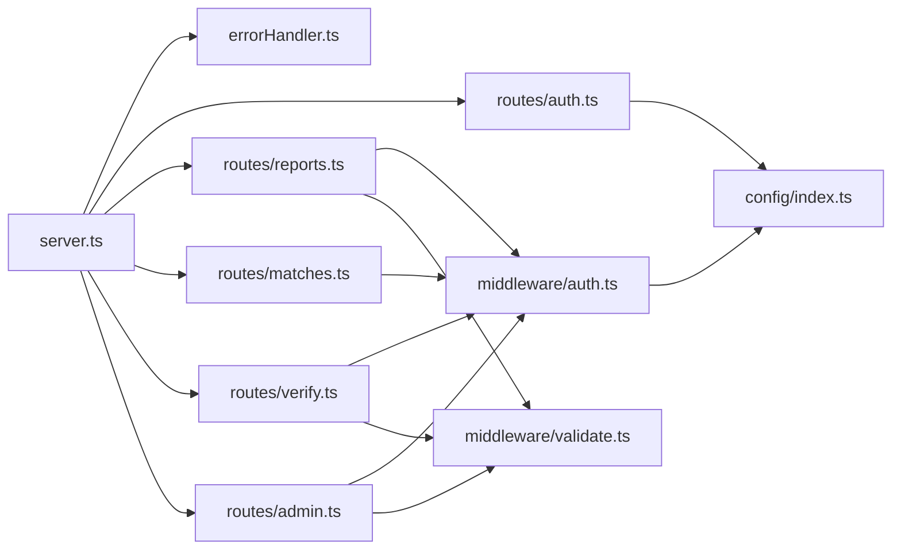

# Middleware Pipeline

<cite>
**Referenced Files in This Document**
- [server.ts](file://backend/src/server.ts)
- [auth.ts](file://backend/src/middleware/auth.ts)
- [errorHandler.ts](file://backend/src/middleware/errorHandler.ts)
- [validate.ts](file://backend/src/middleware/validate.ts)
- [config/index.ts](file://backend/src/config/index.ts)
- [routes/auth.ts](file://backend/src/routes/auth.ts)
- [routes/reports.ts](file://backend/src/routes/reports.ts)
- [routes/admin.ts](file://backend/src/routes/admin.ts)
- [routes/verify.ts](file://backend/src/routes/verify.ts)
- [routes/matches.ts](file://backend/src/routes/matches.ts)
</cite>

## Table of Contents
1. Introduction
2. Project Structure
3. Core Components
4. Architecture Overview
5. Detailed Component Analysis
6. Dependency Analysis
7. Performance Considerations
8. Troubleshooting Guide
9. Conclusion

## Introduction
This document explains the backend middleware pipeline used to secure, validate, and standardize error handling across all API endpoints. It covers:
- Authentication middleware using JWT tokens for user verification and role-based access control
- Error handling middleware that provides consistent error responses and logging
- Input validation middleware for request data sanitization and schema validation
- Middleware execution order, error propagation patterns, and guidelines for creating custom middleware
- Security considerations, performance implications, and debugging techniques

## Project Structure
The Express application wires global middleware at startup and composes route-level middleware per feature area. The server sets up security headers, CORS, JSON parsing, logging, rate limiting, routes, and a global error handler.

**Diagram sources**
- [server.ts:18-45](file://backend/src/server.ts#L18-L45)

**Section sources**
- [server.ts:1-52](file://backend/src/server.ts#L1-L52)

## Core Components
- Authentication middleware: Validates JWT from Authorization header, attaches userId and userRole to the request, and enforces admin-only routes by checking the database role.
- Validation middleware: Validates and sanitizes request bodies against Joi schemas; returns structured validation errors.
- Error handling middleware: Centralized error response formatting, multer-specific messages, and logging for unhandled errors; wraps async handlers to propagate errors consistently.

Key behaviors:
- All protected routes use authenticate; admin routes additionally require requireAdmin.
- Request bodies are validated before business logic runs.
- Errors thrown anywhere in the chain are caught by the global error handler.

**Section sources**
- [auth.ts:18-58](file://backend/src/middleware/auth.ts#L18-L58)
- [validate.ts:5-23](file://backend/src/middleware/validate.ts#L5-L23)
- [errorHandler.ts:4-55](file://backend/src/middleware/errorHandler.ts#L4-L55)

## Architecture Overview
The middleware pipeline executes in this order:
1. Global setup: Helmet, CORS, body parsers, Morgan, rate limiter
2. Route group middleware (e.g., authenticate, requireAdmin)
3. Route-level middleware (e.g., validateBody)
4. Handler logic
5. Global error handler

**Diagram sources**
- [server.ts:18-45](file://backend/src/server.ts#L18-L45)
- [auth.ts:22-58](file://backend/src/middleware/auth.ts#L22-L58)
- [validate.ts:8-23](file://backend/src/middleware/validate.ts#L8-L23)
- [errorHandler.ts:16-55](file://backend/src/middleware/errorHandler.ts#L16-L55)

## Detailed Component Analysis

### Authentication Middleware
Responsibilities:
- Extracts and verifies JWT from Authorization header
- Decodes payload and attaches userId and userRole to the request
- Enforces admin-only access by verifying the current user’s role in the database

Security notes:
- Tokens must be present and valid; otherwise, a 401 is returned
- Role checks are performed against the database to prevent privilege escalation via token claims

Usage patterns:
- Applied globally on route groups (e.g., reports, matches, verify)
- Combined with requireAdmin for administrative endpoints

**Diagram sources**
- [auth.ts:22-37](file://backend/src/middleware/auth.ts#L22-L37)

**Section sources**
- [auth.ts:18-58](file://backend/src/middleware/auth.ts#L18-L58)
- [routes/admin.ts:11-12](file://backend/src/routes/admin.ts#L11-L12)
- [routes/reports.ts:13-14](file://backend/src/routes/reports.ts#L13-L14)
- [routes/verify.ts:12](file://backend/src/routes/verify.ts#L12)
- [routes/matches.ts:9](file://backend/src/routes/matches.ts#L9)

### Role-Based Access Control (RBAC)
- requireAdmin ensures the authenticated user has an admin role stored in the database
- If not admin, a 403 is returned
- Used exclusively on admin routes to protect sensitive operations

**Diagram sources**
- [auth.ts:43-58](file://backend/src/middleware/auth.ts#L43-L58)

**Section sources**
- [auth.ts:39-58](file://backend/src/middleware/auth.ts#L39-L58)
- [routes/admin.ts:11-12](file://backend/src/routes/admin.ts#L11-L12)

### Input Validation Middleware
Responsibilities:
- Validates request bodies against Joi schemas
- Strips unknown fields and collects all validation errors
- Returns a single 400 error with concatenated messages

Common schemas:
- Lost report schema
- Found report schema
- Verification answer schema
- Verification judge schema

Usage:
- Applied per route where input is expected (e.g., POST /reports/lost, POST /reports/found, verification endpoints)

**Diagram sources**
- [validate.ts:8-23](file://backend/src/middleware/validate.ts#L8-L23)

**Section sources**
- [validate.ts:5-61](file://backend/src/middleware/validate.ts#L5-L61)
- [routes/reports.ts:98-171](file://backend/src/routes/reports.ts#L98-L171)
- [routes/reports.ts:176-247](file://backend/src/routes/reports.ts#L176-L247)
- [routes/verify.ts:89-93](file://backend/src/routes/verify.ts#L89-L93)
- [routes/verify.ts:303-306](file://backend/src/routes/verify.ts#L303-L306)
- [routes/admin.ts:317-320](file://backend/src/routes/admin.ts#L317-L320)

### Error Handling Middleware
Responsibilities:
- Normalizes AppError instances into consistent JSON responses with status codes
- Handles multer upload errors with friendly messages
- Logs unhandled errors and returns a generic 500 response
- Provides asyncHandler to wrap async route handlers and forward errors to the error handler

Patterns:
- Use AppError for domain errors with explicit status codes
- Use asyncHandler to avoid try/catch duplication in handlers

**Diagram sources**
- [errorHandler.ts:16-47](file://backend/src/middleware/errorHandler.ts#L16-L47)

**Section sources**
- [errorHandler.ts:4-55](file://backend/src/middleware/errorHandler.ts#L4-L55)
- [routes/reports.ts:21-33](file://backend/src/routes/reports.ts#L21-L33)
- [routes/admin.ts:88-128](file://backend/src/routes/admin.ts#L88-L128)

### Middleware Execution Order and Composition
- Global middleware runs first: Helmet, CORS, JSON parser, URL parser, Morgan, rate limiter
- Route group middleware runs next: e.g., authenticate and requireAdmin applied to entire route modules
- Route-level middleware runs last before handlers: e.g., validateBody
- Any thrown error is caught by the global error handler at the end

Examples:
- Reports: authenticate at group level; validateBody per mutation endpoint
- Admin: authenticate + requireAdmin at group level; validateBody on specific endpoints
- Verify: authenticate at group level; validateBody on answer/judge endpoints

**Section sources**
- [server.ts:18-45](file://backend/src/server.ts#L18-L45)
- [routes/reports.ts:13-14](file://backend/src/routes/reports.ts#L13-L14)
- [routes/admin.ts:11-12](file://backend/src/routes/admin.ts#L11-L12)
- [routes/verify.ts:12](file://backend/src/routes/verify.ts#L12)

### Custom Middleware Creation Guidelines
To create reusable middleware:
- Follow the Express signature: (req, res, next) => void
- For async logic, either:
  - Return promises that reject with AppError, or
  - Wrap with asyncHandler to automatically forward errors
- Keep concerns focused:
  - Authentication: verify identity and attach user context
  - Authorization: enforce roles/ownership checks
  - Validation: sanitize and validate inputs
  - Logging: capture request metadata without leaking secrets
- Always call next() on success; throw AppError on failure to ensure consistent responses

Best practices:
- Use typed requests (e.g., extend Request interface) for safety
- Avoid side effects unless necessary; keep middleware fast
- Do not swallow errors; let them propagate to errorHandler

**Section sources**
- [errorHandler.ts:49-55](file://backend/src/middleware/errorHandler.ts#L49-L55)
- [auth.ts:22-58](file://backend/src/middleware/auth.ts#L22-L58)
- [validate.ts:8-23](file://backend/src/middleware/validate.ts#L8-L23)

## Dependency Analysis
High-level dependencies between middleware and routes:

**Diagram sources**
- [server.ts:1-45](file://backend/src/server.ts#L1-L45)
- [auth.ts:1-58](file://backend/src/middleware/auth.ts#L1-L58)
- [validate.ts:1-61](file://backend/src/middleware/validate.ts#L1-L61)
- [config/index.ts:1-49](file://backend/src/config/index.ts#L1-L49)
- [routes/auth.ts:1-98](file://backend/src/routes/auth.ts#L1-L98)
- [routes/reports.ts:1-356](file://backend/src/routes/reports.ts#L1-L356)
- [routes/matches.ts:1-115](file://backend/src/routes/matches.ts#L1-L115)
- [routes/verify.ts:1-444](file://backend/src/routes/verify.ts#L1-L444)
- [routes/admin.ts:1-389](file://backend/src/routes/admin.ts#L1-L389)

**Section sources**
- [server.ts:1-52](file://backend/src/server.ts#L1-L52)
- [auth.ts:1-58](file://backend/src/middleware/auth.ts#L1-L58)
- [validate.ts:1-61](file://backend/src/middleware/validate.ts#L1-L61)
- [config/index.ts:1-49](file://backend/src/config/index.ts#L1-L49)

## Performance Considerations
- Rate limiting: A global limiter protects /api/* endpoints to mitigate abuse. Tune windowMs and max based on traffic patterns.
- Body size limits: JSON parser configured with a generous limit; ensure uploads are handled separately via multipart processing.
- Database queries: RBAC check reads user role once per admin request; consider caching if needed.
- Validation overhead: Joi validation is fast; reuse shared schemas to minimize allocations.
- Logging: Morgan logs every request; in production, consider sampling or structured logging to reduce overhead.

[No sources needed since this section provides general guidance]

## Troubleshooting Guide
Common issues and how to diagnose:
- 401 Unauthorized:
  - Missing or malformed Authorization header
  - Expired or invalid JWT
  - Ensure config.jwt.secret matches what was used to sign tokens
- 403 Forbidden:
  - Non-admin user accessing admin routes
  - Ownership checks failing (e.g., trying to access another user’s resource)
- 400 Bad Request:
  - Validation failures; check request body against schemas
  - Multer upload errors (e.g., wrong field name or file too large)
- 500 Internal Server Error:
  - Unhandled exceptions; review server logs for stack traces

Debugging steps:
- Enable development logging via Morgan to inspect request/response flow
- Add temporary console logs in middleware to trace execution order
- Reproduce with minimal payloads to isolate validation issues
- Verify environment variables for JWT secret and database connectivity

**Section sources**
- [errorHandler.ts:16-55](file://backend/src/middleware/errorHandler.ts#L16-L55)
- [auth.ts:22-58](file://backend/src/middleware/auth.ts#L22-L58)
- [validate.ts:8-23](file://backend/src/middleware/validate.ts#L8-L23)
- [server.ts:18-45](file://backend/src/server.ts#L18-L45)

## Conclusion
The middleware pipeline centralizes authentication, authorization, validation, and error handling to ensure consistent, secure, and maintainable APIs. By composing lightweight, focused middleware and leveraging a robust error handler, the system achieves:
- Strong security posture with JWT-based auth and DB-backed RBAC
- Predictable error responses and clear client feedback
- Scalable validation through reusable schemas
- Clear debugging paths via centralized error handling and logging

Adhering to the provided guidelines for custom middleware will help maintain consistency and reliability as the API evolves.