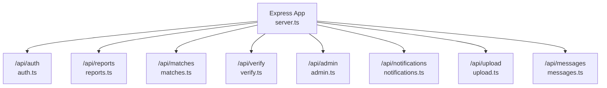
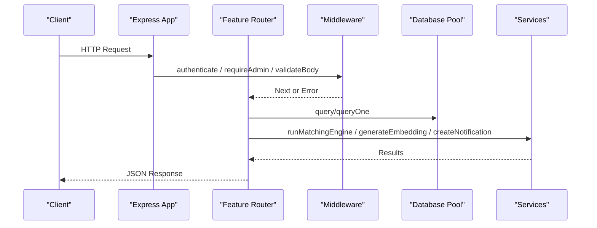
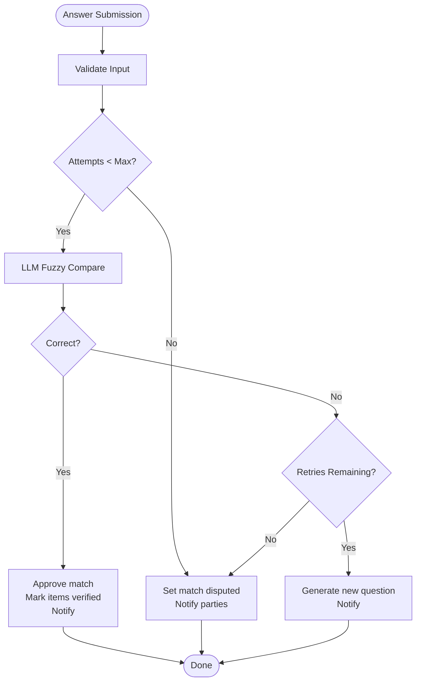
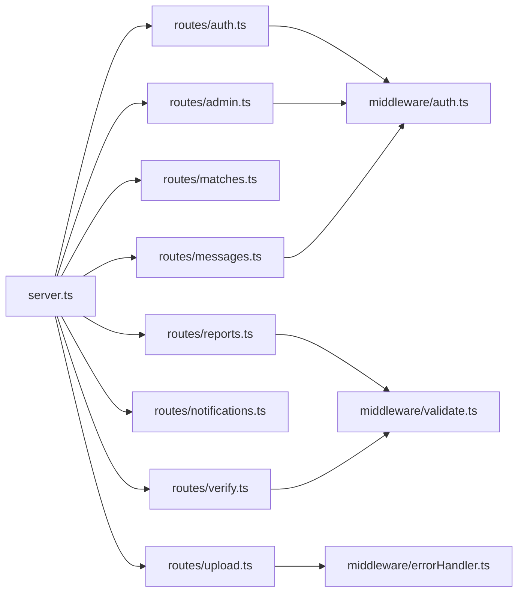

# Route Organization & Structure

<cite>
**Referenced Files in This Document**
- [server.ts](file://backend/src/server.ts)
- [auth.ts](file://backend/src/routes/auth.ts)
- [reports.ts](file://backend/src/routes/reports.ts)
- [matches.ts](file://backend/src/routes/matches.ts)
- [verify.ts](file://backend/src/routes/verify.ts)
- [admin.ts](file://backend/src/routes/admin.ts)
- [notifications.ts](file://backend/src/routes/notifications.ts)
- [upload.ts](file://backend/src/routes/upload.ts)
- [messages.ts](file://backend/src/routes/messages.ts)
- [auth.ts](file://backend/src/middleware/auth.ts)
- [errorHandler.ts](file://backend/src/middleware/errorHandler.ts)
- [validate.ts](file://backend/src/middleware/validate.ts)
- [index.ts](file://backend/src/config/index.ts)
</cite>

## Table of Contents
1. Introduction
2. Project Structure
3. Core Components
4. Architecture Overview
5. Detailed Component Analysis
6. Dependency Analysis
7. Performance Considerations
8. Troubleshooting Guide
9. Conclusion

## Introduction
This document explains the Express.js route organization and structure for the Lost & Found AI Matcher backend. It details how routes are modularized by feature (auth, reports, matches, verification, admin, notifications, upload, messaging), the URL patterns and HTTP methods each module exposes, and the consistent request/response handling patterns used across endpoints. It also covers parameter validation, error handling conventions, and best practices for adding new endpoints.

## Project Structure
Routes are organized per feature under src/routes and mounted on the Express app via a central server file. Each route module exports an Express Router instance and applies shared middleware such as authentication and role checks where appropriate. The server mounts these routers under /api/<feature>.

**Diagram sources**
- [server.ts:36-43](file://backend/src/server.ts#L36-L43)

**Section sources**
- [server.ts:1-52](file://backend/src/server.ts#L1-L52)

## Core Components
- Authentication and authorization: JWT-based authentication with optional admin enforcement.
- Validation: Centralized Joi schemas and middleware to validate request bodies.
- Error handling: Unified error class and global error handler; async wrapper to avoid try/catch noise.
- Configuration: Central config for JWT, matching parameters, and environment variables.

Key responsibilities:
- auth.ts: User signup, login, and profile retrieval; issues and verifies JWTs.
- reports.ts: Create/list/get reports (lost/found), image upload helper, embedding generation, and initial matching triggers.
- matches.ts: Run matching engine for a report and retrieve existing matches.
- verify.ts: Verification question flow, answer submission, auto-judgment, retries, escalation, and finder override.
- admin.ts: Admin-only operations for stats, match management, item status updates, dispute review, and fraud flagging.
- notifications.ts: Read/unread counts, list, and mark-as-read for authenticated users.
- upload.ts: Secure image upload with resizing and storage integration.
- messages.ts: Threaded messaging between verified match participants.

**Section sources**
- [auth.ts:1-98](file://backend/src/routes/auth.ts#L1-L98)
- [reports.ts:1-356](file://backend/src/routes/reports.ts#L1-L356)
- [matches.ts:1-115](file://backend/src/routes/matches.ts#L1-L115)
- [verify.ts:1-444](file://backend/src/routes/verify.ts#L1-L444)
- [admin.ts:1-389](file://backend/src/routes/admin.ts#L1-L389)
- [notifications.ts:1-86](file://backend/src/routes/notifications.ts#L1-L86)
- [upload.ts:1-69](file://backend/src/routes/upload.ts#L1-L69)
- [messages.ts:1-136](file://backend/src/routes/messages.ts#L1-L136)
- [auth.ts:1-59](file://backend/src/middleware/auth.ts#L1-L59)
- [errorHandler.ts:1-56](file://backend/src/middleware/errorHandler.ts#L1-L56)
- [validate.ts:1-61](file://backend/src/middleware/validate.ts#L1-L61)
- [index.ts:1-49](file://backend/src/config/index.ts#L1-L49)

## Architecture Overview
The application uses a layered approach:
- Routes: Feature-specific Express routers.
- Middleware: Authentication, authorization, validation, and error handling.
- Services: Business logic (matching, LLM, notifications, uploads).
- Database: PostgreSQL via a connection pool.
- External services: Supabase Auth/Storage, OpenAI-compatible LLM.

**Diagram sources**
- [server.ts:36-43](file://backend/src/server.ts#L36-L43)
- [auth.ts:22-37](file://backend/src/middleware/auth.ts#L22-L37)
- [validate.ts:8-23](file://backend/src/middleware/validate.ts#L8-L23)
- [errorHandler.ts:16-47](file://backend/src/middleware/errorHandler.ts#L16-L47)

## Detailed Component Analysis

### Authentication Routes (/api/auth)
Responsibilities:
- Create Supabase user and issue backend JWT.
- Authenticate with email/password, fetch role from users table, issue JWT.
- Retrieve current user profile using JWT.

URL patterns and methods:
- POST /api/auth/signup
- POST /api/auth/login
- GET /api/auth/me

Request/response patterns:
- Body: email, password, full_name (signup); email, password (login).
- Responses include user object and token (signup/login) or user profile (me).
- Errors thrown via AppError with standardized error responses.

Validation and security:
- JWT verification in /me; roles stored in database and fetched at login.

**Section sources**
- [auth.ts:12-98](file://backend/src/routes/auth.ts#L12-L98)
- [auth.ts:22-37](file://backend/src/middleware/auth.ts#L22-L37)
- [errorHandler.ts:16-47](file://backend/src/middleware/errorHandler.ts#L16-L47)

### Reports Routes (/api/reports)
Responsibilities:
- Upload photo helper endpoint.
- List active reports with pagination and type filtering.
- Create lost/found reports with optional LLM extraction and embeddings; trigger matching and similar-item search.
- Get user’s reports and individual report details with privacy controls.

URL patterns and methods:
- POST /api/reports/upload
- GET /api/reports
- POST /api/reports/lost
- POST /api/reports/found
- GET /api/reports/user/:userId
- GET /api/reports/found/:id
- GET /api/reports/:id

Request/response patterns:
- Upload accepts multipart/form-data with field name photo; returns public URL.
- Listing supports page, limit, type query params; returns arrays of lost/found items and pagination metadata.
- Creating lost/found validates body via Joi schemas; returns created item plus matches and similar items when available.
- Retrieval enforces ownership and admin access; private fields hidden for non-owners.

Validation:
- Joi schemas for lostReportSchema and foundReportSchema.

Error handling:
- Non-fatal failures (e.g., embedding generation or matching) do not block successful creation; errors logged and ignored gracefully.

**Section sources**
- [reports.ts:16-356](file://backend/src/routes/reports.ts#L16-L356)
- [validate.ts:27-51](file://backend/src/middleware/validate.ts#L27-L51)

### Matches Routes (/api/matches)
Responsibilities:
- Trigger matching engine for a specific report.
- Retrieve existing matches for a report sorted by score.

URL patterns and methods:
- POST /api/matches/run/:reportId
- GET /api/matches/:reportId

Request/response patterns:
- Query param type must be lost or found.
- Ownership check ensures only report owner or admin can run/view matches.
- Returns match count and match details.

**Section sources**
- [matches.ts:11-115](file://backend/src/routes/matches.ts#L11-L115)

### Verification Routes (/api/verify)
Responsibilities:
- Generate or retrieve a verification question for a match.
- Submit answers with auto-judgment via LLM fuzzy comparison.
- Manage retries and escalation to admin when limits reached.
- Allow finder to override system judgment.

URL patterns and methods:
- GET /api/verify/:matchId/question
- POST /api/verify/:matchId/answer
- POST /api/verify/:matchId/judge

Request/response patterns:
- Question endpoint returns question_id and question_text; excludes previously used fields on retry.
- Answer endpoint validates input, records attempts, updates match/item statuses, and sends notifications.
- Judge endpoint allows finder to correct or reject system decisions; may escalate if no retries remain.

Validation:
- Joi schemas for verificationAnswerSchema and verificationJudgeSchema.

Flow overview:

**Diagram sources**
- [verify.ts:89-293](file://backend/src/routes/verify.ts#L89-L293)

**Section sources**
- [verify.ts:14-444](file://backend/src/routes/verify.ts#L14-L444)
- [validate.ts:53-60](file://backend/src/middleware/validate.ts#L53-L60)

### Admin Routes (/api/admin)
Responsibilities:
- Dashboard statistics.
- Paginated listing of matches with optional status filter.
- Approve/reject matches and update item statuses.
- Review disputed cases with verification history.
- Flag/unflag matches for fraud.

URL patterns and methods:
- GET /api/admin/stats
- GET /api/admin/matches
- POST /api/admin/matches/:id/approve
- POST /api/admin/matches/:id/reject
- PATCH /api/admin/items/:id/status
- GET /api/admin/disputed
- POST /api/admin/matches/:id/flag
- POST /api/admin/matches/:id/unflag

Request/response patterns:
- All endpoints require authentication and admin role.
- Status updates validate allowed values and log changes.
- Disputed endpoint aggregates questions and attempts for review.

**Section sources**
- [admin.ts:14-389](file://backend/src/routes/admin.ts#L14-L389)
- [auth.ts:43-58](file://backend/src/middleware/auth.ts#L43-L58)

### Notifications Routes (/api/notifications)
Responsibilities:
- Mark all notifications as read.
- Count unread notifications.
- List notifications with pagination and optional unread filter.
- Mark single notification as read.

URL patterns and methods:
- PATCH /api/notifications/read-all
- GET /api/notifications/count
- GET /api/notifications
- PATCH /api/notifications/:id/read

Request/response patterns:
- Requires authentication.
- Pagination supported via page and limit.
- Returns notifications array and unread_count.

**Section sources**
- [notifications.ts:10-86](file://backend/src/routes/notifications.ts#L10-L86)

### Upload Routes (/api/upload)
Responsibilities:
- Accept image uploads, resize, store in Supabase storage, and return public URLs.

URL patterns and methods:
- POST /api/upload

Request/response patterns:
- Multipart form with field name photo.
- Enforces image-only and size limits.
- Returns url and fileName.

Error handling:
- Multer errors mapped to friendly messages.

**Section sources**
- [upload.ts:15-69](file://backend/src/routes/upload.ts#L15-L69)
- [errorHandler.ts:30-40](file://backend/src/middleware/errorHandler.ts#L30-L40)

### Messages Routes (/api/messages)
Responsibilities:
- Fetch message threads for approved matches.
- Send messages within a thread and notify the other party.

URL patterns and methods:
- GET /api/messages/:matchId
- POST /api/messages/:matchId

Request/response patterns:
- Requires authentication and match participation.
- Only accessible after match is approved.
- Validates message body length and content.
- Returns created message and notifies recipient.

**Section sources**
- [messages.ts:13-136](file://backend/src/routes/messages.ts#L13-L136)

## Dependency Analysis
- Routing layer depends on:
  - Authentication middleware for protected routes.
  - Validation middleware for structured inputs.
  - Error handler for consistent error responses.
  - Database pool for data access.
  - Services for external integrations (LLM, matching, notifications, storage).

**Diagram sources**
- [server.ts:36-43](file://backend/src/server.ts#L36-L43)
- [auth.ts:22-37](file://backend/src/middleware/auth.ts#L22-L37)
- [validate.ts:8-23](file://backend/src/middleware/validate.ts#L8-L23)
- [errorHandler.ts:16-47](file://backend/src/middleware/errorHandler.ts#L16-L47)

**Section sources**
- [server.ts:36-43](file://backend/src/server.ts#L36-L43)
- [auth.ts:22-37](file://backend/src/middleware/auth.ts#L22-L37)
- [validate.ts:8-23](file://backend/src/middleware/validate.ts#L8-L23)
- [errorHandler.ts:16-47](file://backend/src/middleware/errorHandler.ts#L16-L47)

## Performance Considerations
- Use pagination consistently for list endpoints to limit payload sizes.
- Prefer parameterized queries to prevent SQL injection and improve plan reuse.
- Avoid blocking critical paths with heavy operations; run matching and embedding tasks asynchronously where possible.
- Apply rate limiting at the API level to protect against abuse.
- Cache frequently accessed data (e.g., user profiles) if needed.

[No sources needed since this section provides general guidance]

## Troubleshooting Guide
Common issues and resolutions:
- Authentication failures: Ensure Authorization header includes a valid Bearer token; tokens must not be expired.
- Validation errors: Check request body against Joi schemas; ensure required fields are present and correctly typed.
- Upload errors: Confirm file type is image and size under 5 MB; use field name photo.
- Access denied: Verify user owns the resource or has admin role; some endpoints enforce strict ownership checks.
- Unexpected errors: Global error handler returns standardized error objects; inspect logs for stack traces.

Error response format:
- { status: "error", message: "<message>" }

**Section sources**
- [errorHandler.ts:16-47](file://backend/src/middleware/errorHandler.ts#L16-L47)
- [validate.ts:8-23](file://backend/src/middleware/validate.ts#L8-L23)
- [upload.ts:30-69](file://backend/src/routes/upload.ts#L30-L69)

## Conclusion
The backend organizes routes by feature, applying consistent authentication, validation, and error handling across modules. Each router encapsulates a clear set of responsibilities, exposing well-defined URL patterns and HTTP methods. Following these patterns ensures maintainability, clarity, and scalability as new endpoints are added.

[No sources needed since this section summarizes without analyzing specific files]