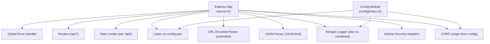
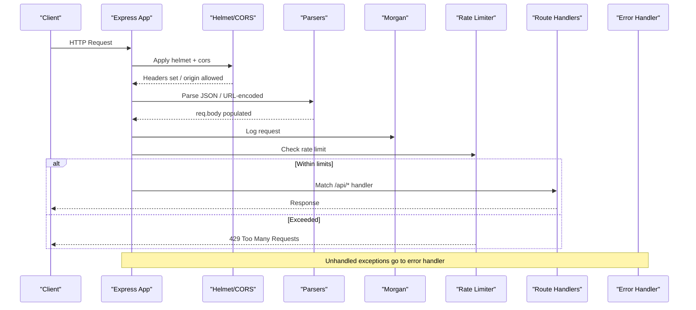
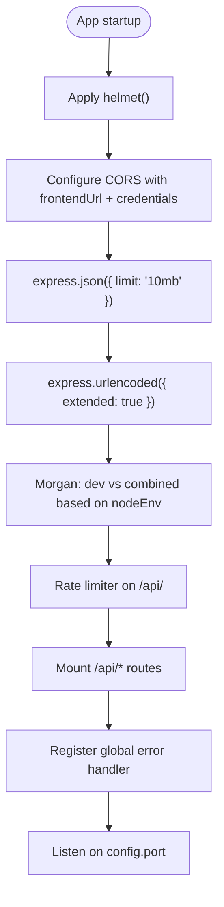
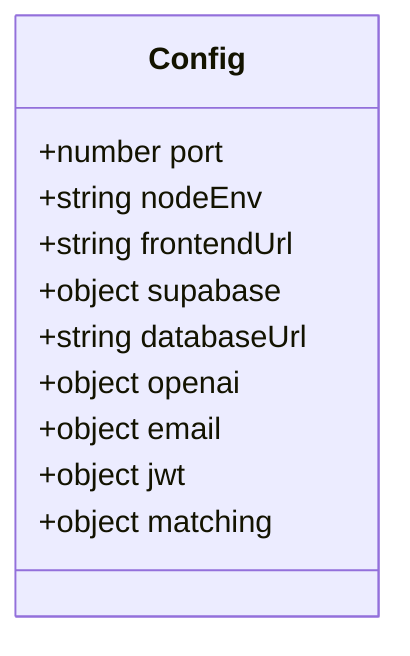
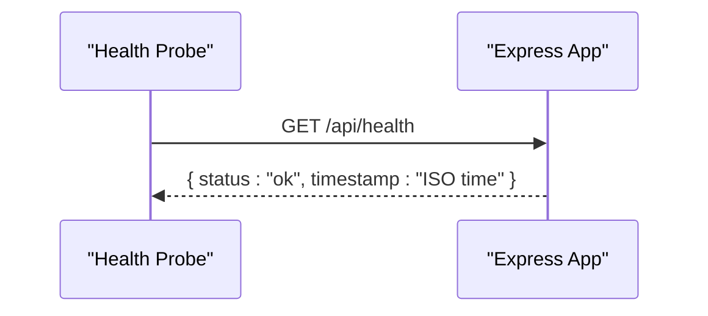
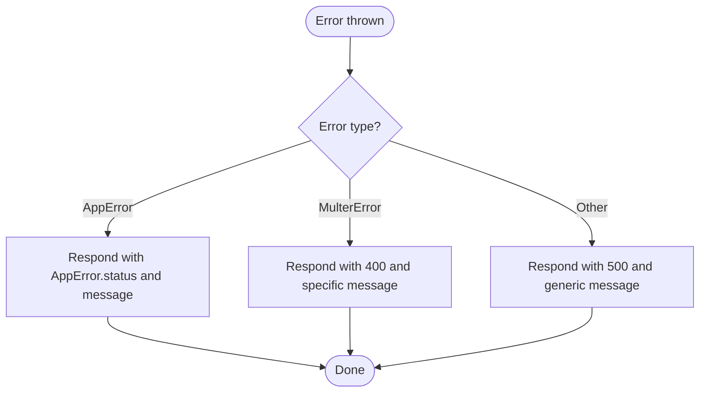
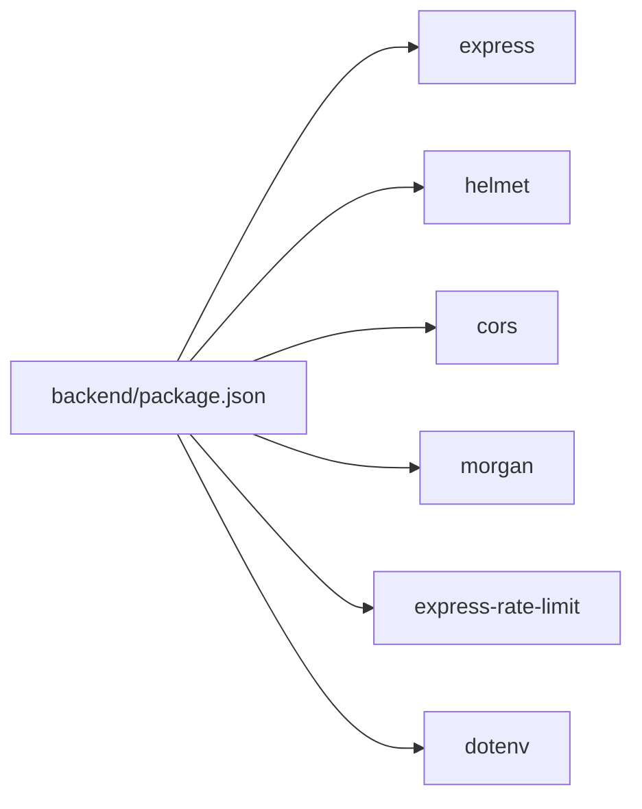

# Server Setup & Configuration

<cite>
**Referenced Files in This Document**
- [server.ts](file://backend/src/server.ts)
- [index.ts](file://backend/src/config/index.ts)
- [errorHandler.ts](file://backend/src/middleware/errorHandler.ts)
- [package.json](file://backend/package.json)
- [render.yaml](file://render.yaml)
</cite>

## Table of Contents
1. [Introduction](#introduction)
2. [Project Structure](#project-structure)
3. [Core Components](#core-components)
4. [Architecture Overview](#architecture-overview)
5. [Detailed Component Analysis](#detailed-component-analysis)
6. [Dependency Analysis](#dependency-analysis)
7. [Performance Considerations](#performance-considerations)
8. [Troubleshooting Guide](#troubleshooting-guide)
9. [Conclusion](#conclusion)

## Introduction
This document explains how the Express.js backend is initialized and configured, including security headers, CORS, rate limiting, request logging, environment configuration, JSON body parsing limits, URL encoding handling, production vs development logging strategies, and the health check endpoint. It is intended for developers setting up or maintaining the server environment.

## Project Structure
The backend server is bootstrapped in a single entry file that wires middleware, routes, error handling, and the listening port. Environment variables are centralized in a config module loaded via dotenv.

**Diagram sources**
- [server.ts:18-50](file://backend/src/server.ts#L18-L50)
- [index.ts:6-48](file://backend/src/config/index.ts#L6-L48)

**Section sources**
- [server.ts:1-52](file://backend/src/server.ts#L1-L52)
- [index.ts:1-49](file://backend/src/config/index.ts#L1-L49)

## Core Components
- Application initialization: Express app creation and middleware registration.
- Security: Helmet sets secure HTTP headers; CORS restricts origins to the configured frontend URL with credentials enabled.
- Parsing: JSON bodies limited to 10 MB; URL-encoded bodies parsed with extended mode.
- Logging: Morgan logs requests using dev format locally and combined format in production.
- Rate limiting: Global limiter applied to all /api/ routes.
- Health check: Simple GET endpoint returning status and timestamp.
- Routes: Mounted under /api/auth, /api/reports, /api/matches, /api/verify, /api/admin, /api/notifications, /api/upload, /api/messages.
- Error handling: Centralized error handler catches application errors, multer upload errors, and unexpected errors.
- Port and environment: Port and environment read from config; defaults provided when not set.

**Section sources**
- [server.ts:18-50](file://backend/src/server.ts#L18-L50)
- [errorHandler.ts:16-56](file://backend/src/middleware/errorHandler.ts#L16-L56)
- [index.ts:6-48](file://backend/src/config/index.ts#L6-L48)

## Architecture Overview
The server follows a standard Express pipeline:
- Request enters the app
- Passes through security (helmet), CORS, parsers (JSON, URL-encoded), logger (morgan), and rate limiter
- Matches route handlers under /api/*
- Errors are caught by the global error handler
- Response is sent back

**Diagram sources**
- [server.ts:18-45](file://backend/src/server.ts#L18-L45)
- [errorHandler.ts:16-56](file://backend/src/middleware/errorHandler.ts#L16-L56)

## Detailed Component Analysis

### Application Initialization and Middleware Stack
- The Express app is created and immediately uses:
  - Helmet for security headers
  - CORS with origin from config and credentials enabled
  - JSON parser with a 10 MB size limit
  - URL-encoded parser with extended support
  - Morgan logger switching between dev and combined formats based on environment
  - A global rate limiter for all /api/ routes
- After middleware, routes are mounted under /api/* and a global error handler is registered last.

**Diagram sources**
- [server.ts:18-45](file://backend/src/server.ts#L18-L45)

**Section sources**
- [server.ts:18-45](file://backend/src/server.ts#L18-L45)

### Environment Variables and Config Module
- The config module loads environment variables from a .env file located at the repository root and exposes a typed configuration object.
- Key settings used by the server:
  - port: numeric port with default 4000
  - nodeEnv: string indicating environment with default development
  - frontendUrl: CORS origin with default http://localhost:3000
- Additional services (Supabase, OpenAI, email, JWT) are also exposed but not directly used by the server bootstrap.

**Diagram sources**
- [index.ts:6-48](file://backend/src/config/index.ts#L6-L48)

**Section sources**
- [index.ts:1-49](file://backend/src/config/index.ts#L1-L49)

### CORS Settings
- CORS is enabled with:
  - origin set to the configured frontend URL
  - credentials enabled to allow cookies and authorization headers across origins
- This ensures the Next.js frontend can make authenticated requests to the backend.

**Section sources**
- [server.ts:20-20](file://backend/src/server.ts#L20-L20)
- [index.ts:9-9](file://backend/src/config/index.ts#L9-L9)

### Rate Limiting with express-rate-limit
- A global rate limiter is applied to all routes under /api/.
- Configuration:
  - Window: 15 minutes
  - Max requests per window: 100
  - Custom message returned when exceeded
- This protects API endpoints from abuse and excessive load.

**Section sources**
- [server.ts:25-30](file://backend/src/server.ts#L25-L30)

### Request Logging with morgan
- Logging format depends on the environment:
  - Development: dev format (more readable for local debugging)
  - Production: combined format (standard Apache-style logs suitable for log aggregation)
- This supports both developer experience and operational observability.

**Section sources**
- [server.ts:23-23](file://backend/src/server.ts#L23-L23)
- [index.ts:8-8](file://backend/src/config/index.ts#L8-L8)

### JSON Body Parsing Limits and URL Encoding Handling
- JSON bodies are parsed with a maximum size of 10 MB to accommodate larger payloads such as base64 images or large reports.
- URL-encoded bodies are parsed with extended syntax to support nested objects and arrays.

**Section sources**
- [server.ts:21-22](file://backend/src/server.ts#L21-L22)

### Health Check Endpoint
- A simple GET endpoint at /api/health returns a JSON response with status and an ISO timestamp.
- Useful for deployment health probes and monitoring.

**Diagram sources**
- [server.ts:32-34](file://backend/src/server.ts#L32-L34)

**Section sources**
- [server.ts:32-34](file://backend/src/server.ts#L32-L34)

### Port Configuration and Startup
- The server listens on the port defined in config, which reads from process.env.PORT with a fallback to 4000.
- On startup, it logs the running port and current environment.

**Section sources**
- [server.ts:47-50](file://backend/src/server.ts#L47-L50)
- [index.ts:7-8](file://backend/src/config/index.ts#L7-L8)

### Error Handling Strategy
- A centralized error handler processes:
  - Application errors (custom AppError) with appropriate status codes
  - Multer upload errors with user-friendly messages
  - Unexpected errors mapped to a generic 500 response
- An async wrapper ensures async route handlers propagate errors to the central handler.

**Diagram sources**
- [errorHandler.ts:16-56](file://backend/src/middleware/errorHandler.ts#L16-L56)

**Section sources**
- [errorHandler.ts:1-56](file://backend/src/middleware/errorHandler.ts#L1-L56)

## Dependency Analysis
Key runtime dependencies relevant to server setup:
- express: Web framework
- helmet: Security headers
- cors: Cross-origin resource sharing
- morgan: HTTP request logger
- express-rate-limit: Rate limiting
- dotenv: Environment variable loading

These are declared in the backend package manifest and imported in the server bootstrap.

**Diagram sources**
- [package.json:16-31](file://backend/package.json#L16-L31)

**Section sources**
- [package.json:16-31](file://backend/package.json#L16-L31)

## Performance Considerations
- JSON payload limit: Set to 10 MB to handle larger uploads or payloads; ensure this aligns with storage and processing capabilities.
- Rate limiting: 100 requests per 15-minute window per client; tune based on expected traffic patterns and capacity.
- Logging: Use combined logs in production for efficient log aggregation; consider rotating logs in production environments.
- CORS: Restrict to known frontend URLs to reduce attack surface.
- Helmet: Keep enabled to enforce secure headers by default.

[No sources needed since this section provides general guidance]

## Troubleshooting Guide
- CORS failures:
  - Ensure FRONTEND_URL matches the actual frontend origin and includes protocol and port if necessary.
  - Verify credentials are required and supported by the client.
- Rate limiting errors:
  - If clients receive “Too many requests,” adjust window or max values or implement client-side retry/backoff.
- Large uploads:
  - If encountering upload limits, confirm multer configuration in upload routes and ensure field names match expectations.
- Health checks:
  - Confirm /api/health responds with 200 OK and a valid timestamp during deployment verification.

**Section sources**
- [server.ts:20-30](file://backend/src/server.ts#L20-L30)
- [errorHandler.ts:30-46](file://backend/src/middleware/errorHandler.ts#L30-L46)
- [server.ts:32-34](file://backend/src/server.ts#L32-L34)

## Conclusion
The Express server is configured with a robust middleware stack that enforces security, controls cross-origin access, parses requests safely, logs appropriately for each environment, and protects endpoints with rate limiting. Environment-driven configuration centralizes sensitive settings and behavior toggles, while a simple health endpoint supports deployment readiness checks. The centralized error handler ensures consistent error responses across the API.