# Data Flow

<cite>
**Referenced Files in This Document**
- [server.ts](file://backend/src/server.ts)
- [reports.ts](file://backend/src/routes/reports.ts)
- [matches.ts](file://backend/src/routes/matches.ts)
- [notifications.ts](file://backend/src/routes/notifications.ts)
- [matchingEngine.ts](file://backend/src/services/matchingEngine.ts)
- [embeddingSearch.ts](file://backend/src/services/embeddingSearch.ts)
- [notificationService.ts](file://backend/src/services/notificationService.ts)
- [emailService.ts](file://backend/src/services/emailService.ts)
- [similarity.ts](file://backend/src/utils/similarity.ts)
- [config/index.ts](file://backend/src/config/index.ts)
- [api.ts](file://frontend/lib/api.ts)
- [store.ts](file://frontend/lib/store.ts)
- [ReportForm.tsx](file://frontend/components/ReportForm.tsx)
- [001_initial_schema.sql](file://supabase/migrations/001_initial_schema.sql)
</cite>

## Table of Contents
1. [Introduction](#introduction)
2. [Project Structure](#project-structure)
3. [Core Components](#core-components)
4. [Architecture Overview](#architecture-overview)
5. [Detailed Component Analysis](#detailed-component-analysis)
6. [Dependency Analysis](#dependency-analysis)
7. [Performance Considerations](#performance-considerations)
8. [Troubleshooting Guide](#troubleshooting-guide)
9. [Conclusion](#conclusion)

## Introduction
This document explains the end-to-end data flow of the Lost & Found AI Matcher system, from a user reporting an item to discovering matches and receiving notifications. It covers request-response cycles, background processing, real-time updates via polling endpoints, caching strategies, validation flows, and error propagation across frontend and backend layers.

## Project Structure
The system is split into:
- Frontend (Next.js): UI components, API client, and local state store for authentication and UI state.
- Backend (Express + TypeScript): REST APIs for reports, matches, verification, notifications, messages, uploads, and admin operations.
- Database (PostgreSQL with pgvector): Stores items, matches, notifications, and related metadata; includes vector indexes for semantic search.

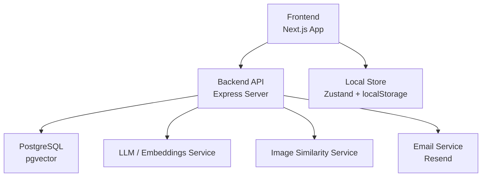

**Diagram sources**
- [server.ts:18-45](file://backend/src/server.ts#L18-L45)
- [api.ts:18-35](file://frontend/lib/api.ts#L18-L35)
- [store.ts:14-38](file://frontend/lib/store.ts#L14-L38)
- [001_initial_schema.sql:69-166](file://supabase/migrations/001_initial_schema.sql#L69-L166)

**Section sources**
- [server.ts:18-45](file://backend/src/server.ts#L18-L45)
- [api.ts:18-35](file://frontend/lib/api.ts#L18-L35)
- [store.ts:14-38](file://frontend/lib/store.ts#L14-L38)
- [001_initial_schema.sql:69-166](file://supabase/migrations/001_initial_schema.sql#L69-L166)

## Core Components
- Report submission: Validates input, optionally enriches fields via LLM, generates embeddings, persists items, runs matching, and returns immediate similar items.
- Matching engine: Scores candidates using description embeddings, image similarity, location proximity, time window, and attributes; persists matches and triggers notifications.
- Notifications: Creates in-app notifications and optional emails; supports pagination and read status management.
- Frontend API client: Centralized fetch wrapper with auth headers, typed responses, and upload handling.
- Local state: Auth token and user info persisted in localStorage and Zustand store.

**Section sources**
- [reports.ts:98-171](file://backend/src/routes/reports.ts#L98-L171)
- [reports.ts:176-247](file://backend/src/routes/reports.ts#L176-L247)
- [matchingEngine.ts:37-189](file://backend/src/services/matchingEngine.ts#L37-L189)
- [notificationService.ts:19-62](file://backend/src/services/notificationService.ts#L19-L62)
- [api.ts:143-161](file://frontend/lib/api.ts#L143-L161)
- [store.ts:14-38](file://frontend/lib/store.ts#L14-L38)

## Architecture Overview
The system uses a layered architecture:
- Presentation layer (React components) collects and validates user input.
- API layer (Express routes) orchestrates business logic, calling services for embedding generation, matching, and notifications.
- Data layer (PostgreSQL with pgvector) stores structured and vector data, enabling fast semantic searches.
- External integrations: LLM/embeddings, image similarity, email delivery.

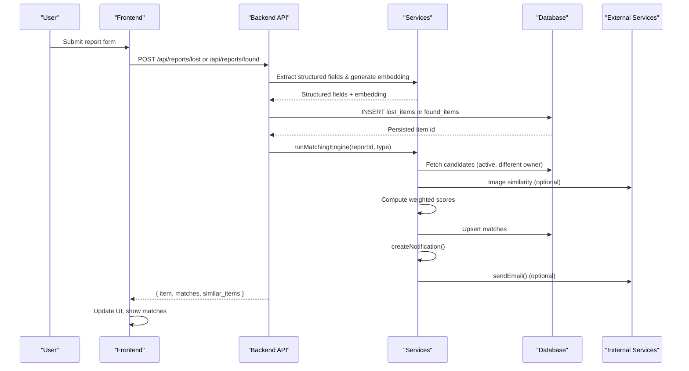

**Diagram sources**
- [reports.ts:98-171](file://backend/src/routes/reports.ts#L98-L171)
- [reports.ts:176-247](file://backend/src/routes/reports.ts#L176-L247)
- [matchingEngine.ts:37-189](file://backend/src/services/matchingEngine.ts#L37-L189)
- [notificationService.ts:19-62](file://backend/src/services/notificationService.ts#L19-L62)
- [emailService.ts:15-31](file://backend/src/services/emailService.ts#L15-L31)

## Detailed Component Analysis

### User Journey: Reporting a Lost Item
1. Form validation on the frontend ensures required fields and constraints.
2. Optional photo upload via multipart endpoint returns a public URL.
3. Backend validates payload, extracts structured fields if needed, generates embeddings, and inserts the record.
4. Matching engine runs immediately to find potential matches; similar items are returned for quick feedback.
5. Notifications are created for both owners when matches exceed thresholds.

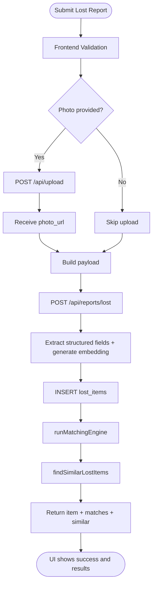

**Diagram sources**
- [ReportForm.tsx:299-351](file://frontend/components/ReportForm.tsx#L299-L351)
- [reports.ts:21-33](file://backend/src/routes/reports.ts#L21-L33)
- [reports.ts:98-171](file://backend/src/routes/reports.ts#L98-L171)
- [embeddingSearch.ts:30-62](file://backend/src/services/embeddingSearch.ts#L30-L62)

**Section sources**
- [ReportForm.tsx:299-351](file://frontend/components/ReportForm.tsx#L299-L351)
- [reports.ts:21-33](file://backend/src/routes/reports.ts#L21-L33)
- [reports.ts:98-171](file://backend/src/routes/reports.ts#L98-L171)
- [embeddingSearch.ts:30-62](file://backend/src/services/embeddingSearch.ts#L30-L62)

### User Journey: Reporting a Found Item
1. Frontend validates inputs including private details pair.
2. Backend validates payload, optionally extracts structured fields, generates embeddings, and inserts found item.
3. Matching engine runs to find potential matches; similar items are returned.
4. Notifications are created for both owners when matches exceed thresholds.

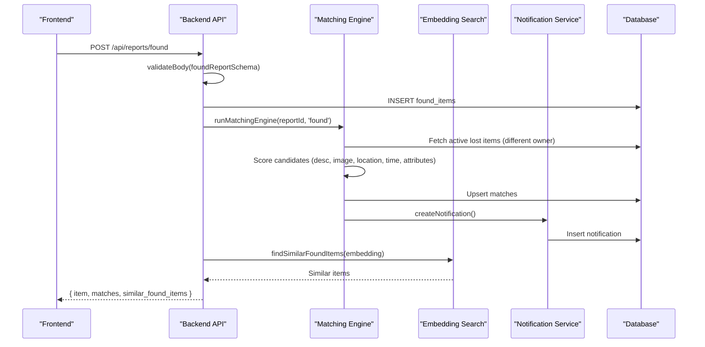

**Diagram sources**
- [reports.ts:176-247](file://backend/src/routes/reports.ts#L176-L247)
- [matchingEngine.ts:37-189](file://backend/src/services/matchingEngine.ts#L37-L189)
- [embeddingSearch.ts:68-100](file://backend/src/services/embeddingSearch.ts#L68-L100)
- [notificationService.ts:19-62](file://backend/src/services/notificationService.ts#L19-L62)

**Section sources**
- [reports.ts:176-247](file://backend/src/routes/reports.ts#L176-L247)
- [matchingEngine.ts:37-189](file://backend/src/services/matchingEngine.ts#L37-L189)
- [embeddingSearch.ts:68-100](file://backend/src/services/embeddingSearch.ts#L68-L100)
- [notificationService.ts:19-62](file://backend/src/services/notificationService.ts#L19-L62)

### Match Discovery and Scoring
- The matching engine computes five component scores:
  - Description similarity via cosine distance between embeddings (fallback to simple text overlap).
  - Image similarity when both items have photos.
  - Location similarity using Haversine distance within a configured radius.
  - Time similarity based on a configurable time window.
  - Attribute similarity for category, brand, and colour.
- A weighted total score determines whether a match meets the threshold.
- Matches are upserted into the database and notifications are created for relevant users.

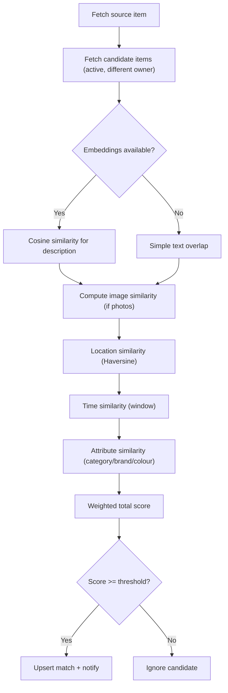

**Diagram sources**
- [matchingEngine.ts:37-189](file://backend/src/services/matchingEngine.ts#L37-L189)
- [similarity.ts:26-82](file://backend/src/utils/similarity.ts#L26-L82)
- [config/index.ts:33-47](file://backend/src/config/index.ts#L33-L47)

**Section sources**
- [matchingEngine.ts:37-189](file://backend/src/services/matchingEngine.ts#L37-L189)
- [similarity.ts:26-82](file://backend/src/utils/similarity.ts#L26-L82)
- [config/index.ts:33-47](file://backend/src/config/index.ts#L33-L47)

### Real-Time Updates and Notifications
- In-app notifications are created for new matches and other events.
- Email notifications are sent optionally via Resend; failures do not block in-app notifications.
- Frontend polls notification endpoints to display unread counts and lists.

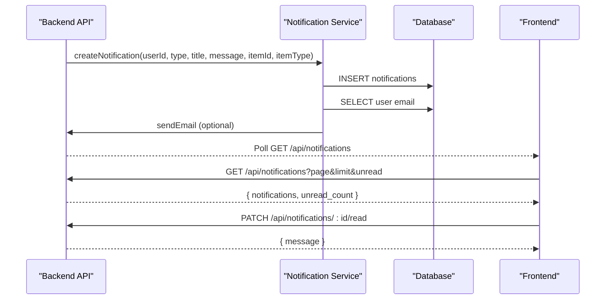

**Diagram sources**
- [notificationService.ts:19-62](file://backend/src/services/notificationService.ts#L19-L62)
- [emailService.ts:15-31](file://backend/src/services/emailService.ts#L15-L31)
- [notifications.ts:14-84](file://backend/src/routes/notifications.ts#L14-L84)
- [api.ts:277-291](file://frontend/lib/api.ts#L277-L291)

**Section sources**
- [notificationService.ts:19-62](file://backend/src/services/notificationService.ts#L19-L62)
- [emailService.ts:15-31](file://backend/src/services/emailService.ts#L15-L31)
- [notifications.ts:14-84](file://backend/src/routes/notifications.ts#L14-L84)
- [api.ts:277-291](file://frontend/lib/api.ts#L277-L291)

### Data Transformation Processes
- Structured field extraction: If descriptions are long, backend attempts to extract category, brand, and colour.
- Embedding generation: Descriptions are converted to vectors for semantic similarity.
- Vector search: PostgreSQL pgvector queries compute cosine similarity directly in SQL for performance.
- Privacy filtering: Private fields are withheld from non-owners; identifying info is stripped for non-owners.

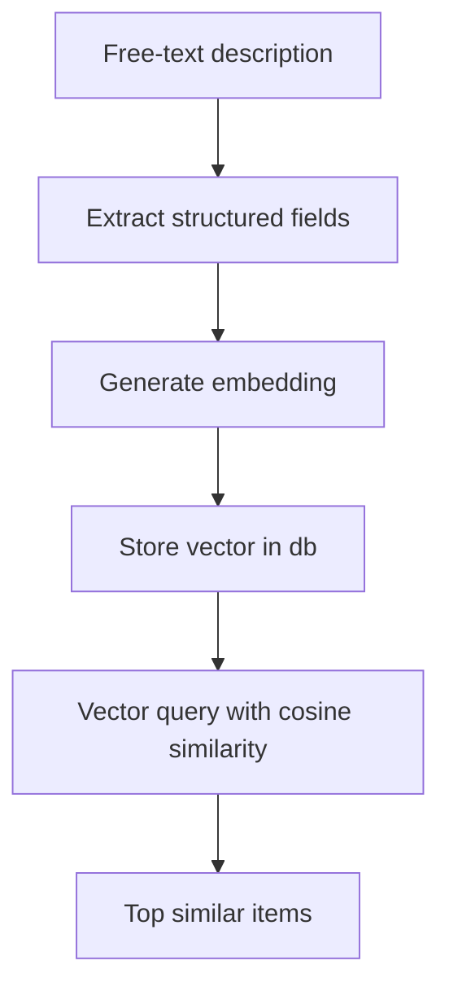

**Diagram sources**
- [reports.ts:109-125](file://backend/src/routes/reports.ts#L109-L125)
- [reports.ts:187-201](file://backend/src/routes/reports.ts#L187-L201)
- [embeddingSearch.ts:30-62](file://backend/src/services/embeddingSearch.ts#L30-L62)
- [reports.ts:322-355](file://backend/src/routes/reports.ts#L322-L355)

**Section sources**
- [reports.ts:109-125](file://backend/src/routes/reports.ts#L109-L125)
- [reports.ts:187-201](file://backend/src/routes/reports.ts#L187-L201)
- [embeddingSearch.ts:30-62](file://backend/src/services/embeddingSearch.ts#L30-L62)
- [reports.ts:322-355](file://backend/src/routes/reports.ts#L322-L355)

### API Call Sequences
- Authentication: Login/signup returns token stored in frontend store and used for subsequent requests.
- Reports: Create lost/found items, list active reports, get by ID/user.
- Matches: Trigger matching for a specific report and retrieve existing matches.
- Notifications: List, mark read, mark all read, count unread.
- Messages: Retrieve and send messages per match thread.

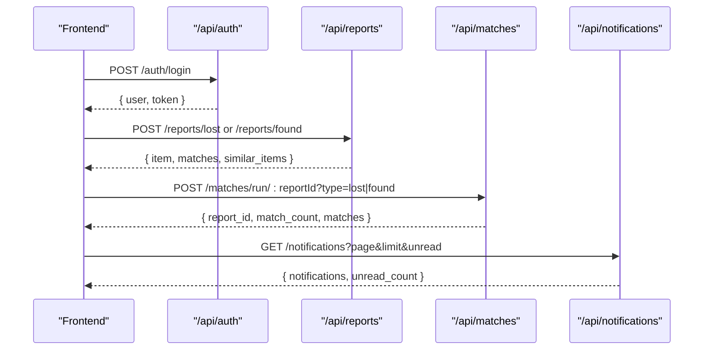

**Diagram sources**
- [api.ts:66-78](file://frontend/lib/api.ts#L66-L78)
- [api.ts:143-161](file://frontend/lib/api.ts#L143-L161)
- [api.ts:210-218](file://frontend/lib/api.ts#L210-L218)
- [api.ts:277-291](file://frontend/lib/api.ts#L277-L291)
- [reports.ts:40-93](file://backend/src/routes/reports.ts#L40-L93)
- [matches.ts:15-45](file://backend/src/routes/matches.ts#L15-L45)
- [notifications.ts:40-69](file://backend/src/routes/notifications.ts#L40-L69)

**Section sources**
- [api.ts:66-78](file://frontend/lib/api.ts#L66-L78)
- [api.ts:143-161](file://frontend/lib/api.ts#L143-L161)
- [api.ts:210-218](file://frontend/lib/api.ts#L210-L218)
- [api.ts:277-291](file://frontend/lib/api.ts#L277-L291)
- [reports.ts:40-93](file://backend/src/routes/reports.ts#L40-L93)
- [matches.ts:15-45](file://backend/src/routes/matches.ts#L15-L45)
- [notifications.ts:40-69](file://backend/src/routes/notifications.ts#L40-L69)

### State Synchronization Between Frontend and Backend
- Authentication state: Token stored in localStorage and Zustand store; API client attaches Authorization header automatically.
- UI state: Loading, success, and error states managed locally; server errors propagate via API wrapper exceptions.
- Notification state: Unread count and list fetched via endpoints; marking read updates backend and refreshes UI.

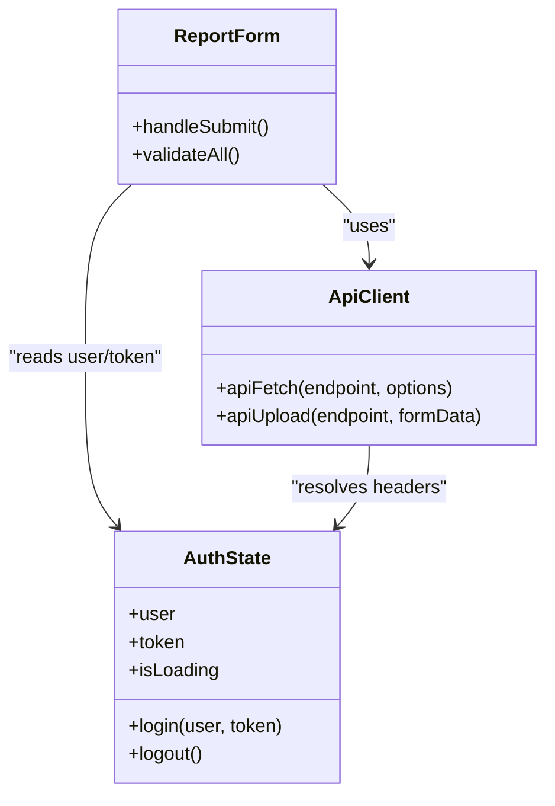

**Diagram sources**
- [store.ts:14-38](file://frontend/lib/store.ts#L14-L38)
- [api.ts:18-35](file://frontend/lib/api.ts#L18-L35)
- [ReportForm.tsx:299-351](file://frontend/components/ReportForm.tsx#L299-L351)

**Section sources**
- [store.ts:14-38](file://frontend/lib/store.ts#L14-L38)
- [api.ts:18-35](file://frontend/lib/api.ts#L18-L35)
- [ReportForm.tsx:299-351](file://frontend/components/ReportForm.tsx#L299-L351)

### Caching Strategies
- Database-level caching via pgvector indexes accelerates semantic similarity searches.
- No explicit application-level cache is implemented; results are computed per request.
- Rate limiting protects endpoints from abuse and reduces load.

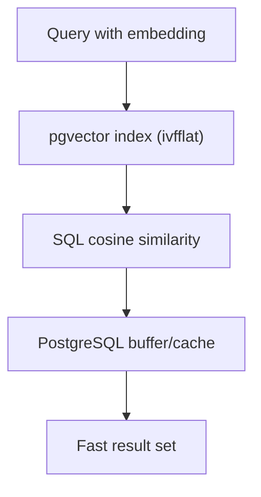

**Diagram sources**
- [embeddingSearch.ts:30-62](file://backend/src/services/embeddingSearch.ts#L30-L62)
- [001_initial_schema.sql:244-249](file://supabase/migrations/001_initial_schema.sql#L244-L249)
- [server.ts:25-30](file://backend/src/server.ts#L25-L30)

**Section sources**
- [embeddingSearch.ts:30-62](file://backend/src/services/embeddingSearch.ts#L30-L62)
- [001_initial_schema.sql:244-249](file://supabase/migrations/001_initial_schema.sql#L244-L249)
- [server.ts:25-30](file://backend/src/server.ts#L25-L30)

### Data Validation Flows
- Frontend validation enforces required fields, minimum description length, and private detail pairing.
- Backend validation uses schema-based middleware to ensure payload integrity before processing.
- Errors are thrown as standardized app errors and propagated to the frontend with user-friendly messages.

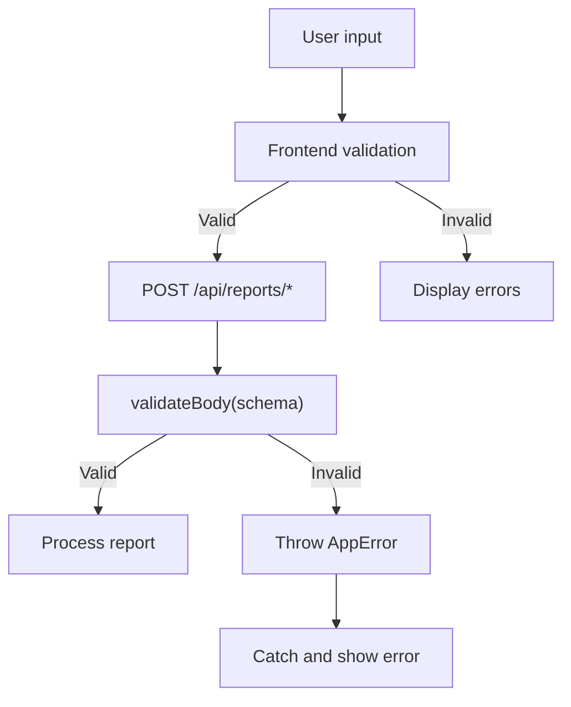

**Diagram sources**
- [ReportForm.tsx:201-245](file://frontend/components/ReportForm.tsx#L201-L245)
- [reports.ts:98-101](file://backend/src/routes/reports.ts#L98-L101)
- [reports.ts:176-179](file://backend/src/routes/reports.ts#L176-L179)

**Section sources**
- [ReportForm.tsx:201-245](file://frontend/components/ReportForm.tsx#L201-L245)
- [reports.ts:98-101](file://backend/src/routes/reports.ts#L98-L101)
- [reports.ts:176-179](file://backend/src/routes/reports.ts#L176-L179)

### Error Propagation Mechanisms
- Frontend API wrapper throws errors with messages from server responses.
- Backend uses async handlers and standardized error types to return consistent error payloads.
- Non-fatal errors (e.g., embedding search failure) are logged but do not block primary workflows.

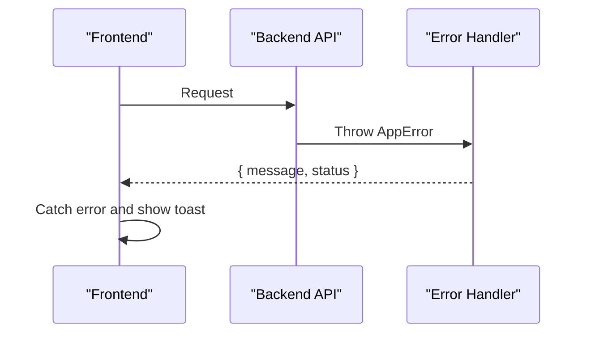

**Diagram sources**
- [api.ts:18-35](file://frontend/lib/api.ts#L18-L35)
- [reports.ts:3-4](file://backend/src/routes/reports.ts#L3-L4)

**Section sources**
- [api.ts:18-35](file://frontend/lib/api.ts#L18-L35)
- [reports.ts:3-4](file://backend/src/routes/reports.ts#L3-L4)

## Dependency Analysis
Key dependencies and relationships:
- Routes depend on middleware for authentication and validation.
- Matching engine depends on similarity utilities and configuration for weights and thresholds.
- Notification service depends on database access and email service.
- Frontend API client depends on environment variables and local store for auth.

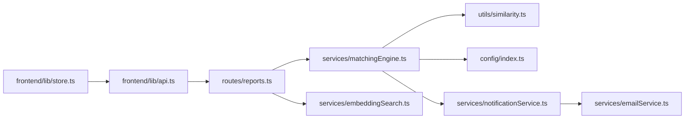

**Diagram sources**
- [reports.ts:1-9](file://backend/src/routes/reports.ts#L1-L9)
- [matchingEngine.ts:1-5](file://backend/src/services/matchingEngine.ts#L1-L5)
- [similarity.ts:1-83](file://backend/src/utils/similarity.ts#L1-L83)
- [config/index.ts:1-49](file://backend/src/config/index.ts#L1-L49)
- [notificationService.ts:1-3](file://backend/src/services/notificationService.ts#L1-L3)
- [emailService.ts:1-3](file://backend/src/services/emailService.ts#L1-L3)
- [api.ts:1-16](file://frontend/lib/api.ts#L1-L16)
- [store.ts:1-3](file://frontend/lib/store.ts#L1-L3)

**Section sources**
- [reports.ts:1-9](file://backend/src/routes/reports.ts#L1-L9)
- [matchingEngine.ts:1-5](file://backend/src/services/matchingEngine.ts#L1-L5)
- [similarity.ts:1-83](file://backend/src/utils/similarity.ts#L1-L83)
- [config/index.ts:1-49](file://backend/src/config/index.ts#L1-L49)
- [notificationService.ts:1-3](file://backend/src/services/notificationService.ts#L1-L3)
- [emailService.ts:1-3](file://backend/src/services/emailService.ts#L1-L3)
- [api.ts:1-16](file://frontend/lib/api.ts#L1-L16)
- [store.ts:1-3](file://frontend/lib/store.ts#L1-L3)

## Performance Considerations
- Use pgvector indexes to accelerate semantic searches.
- Keep embedding generation and image similarity calls resilient; failures should not block core workflows.
- Apply rate limiting to protect backend resources.
- Avoid unnecessary data transfers by selecting only required fields.

[No sources needed since this section provides general guidance]

## Troubleshooting Guide
Common issues and resolutions:
- Missing embedding: Matching still works with text fallback; check LLM integration and embedding generation steps.
- Email delivery failures: In-app notifications remain intact; verify email provider configuration.
- Access denied errors: Ensure correct ownership checks and admin roles; review route authorization logic.
- High latency: Check database indexes and network calls to external services; consider batching or caching where appropriate.

**Section sources**
- [matchingEngine.ts:85-97](file://backend/src/services/matchingEngine.ts#L85-L97)
- [notificationService.ts:42-61](file://backend/src/services/notificationService.ts#L42-L61)
- [reports.ts:253-259](file://backend/src/routes/reports.ts#L253-L259)
- [server.ts:25-30](file://backend/src/server.ts#L25-L30)

## Conclusion
The Lost & Found AI Matcher system integrates robust validation, AI-driven similarity scoring, and reliable notifications to deliver a seamless user experience. By leveraging PostgreSQL’s pgvector capabilities and resilient service design, it balances performance with accuracy while maintaining privacy and security. The documented data flows provide a clear understanding of how data moves through the system, enabling effective maintenance and future enhancements.