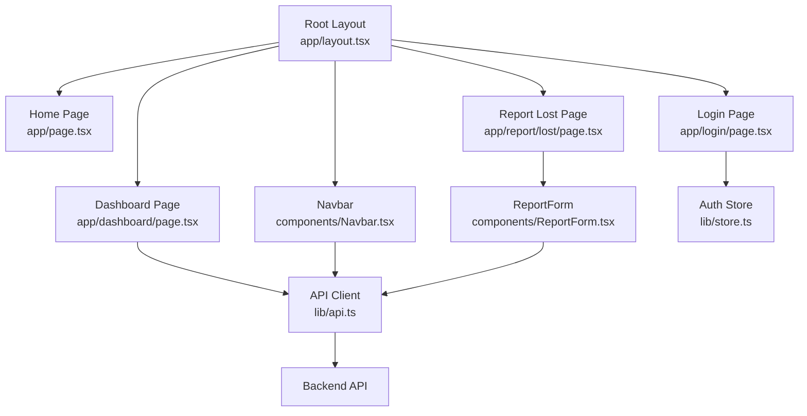
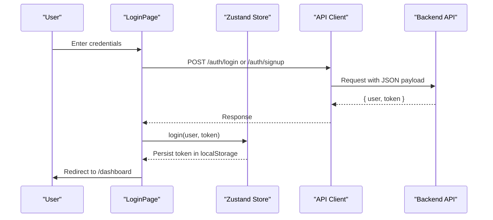
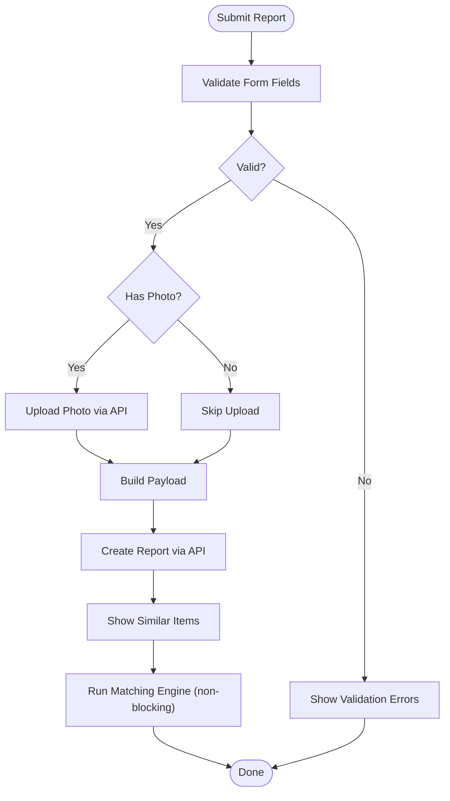
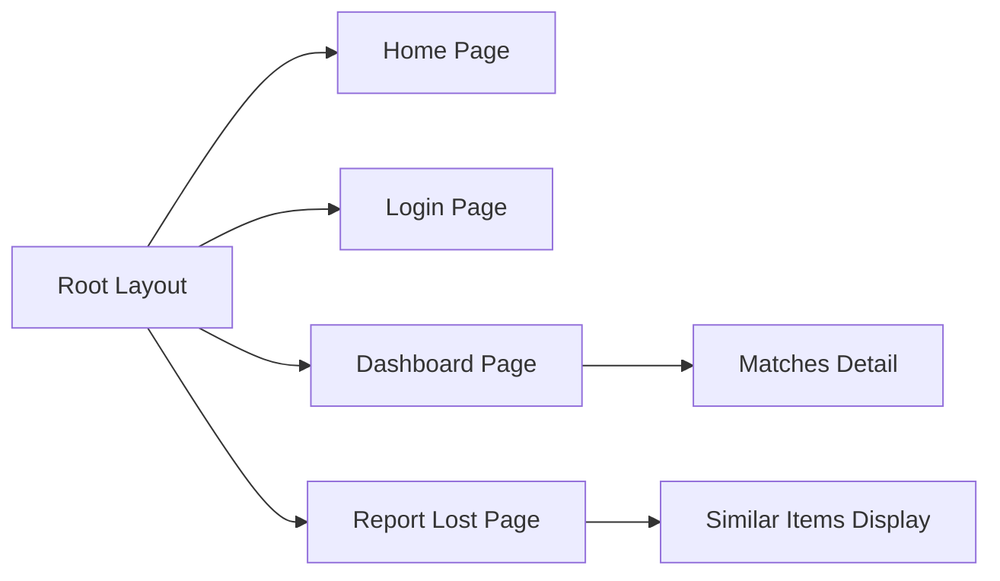
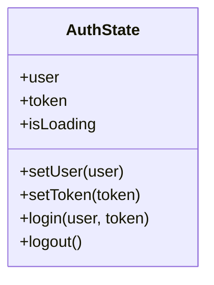
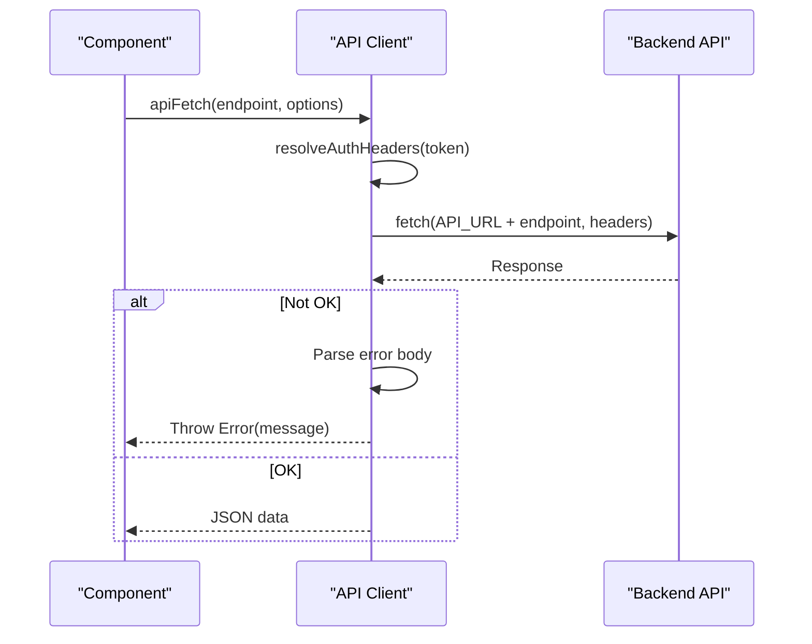
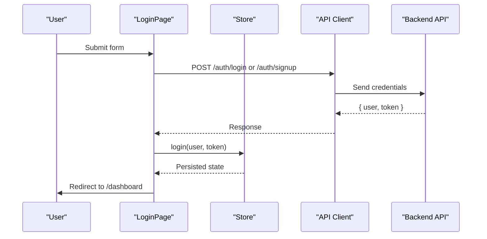
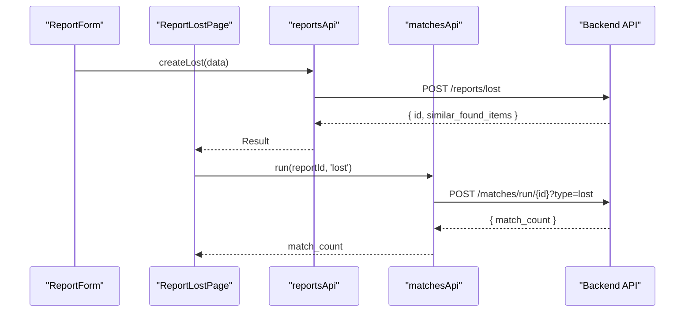
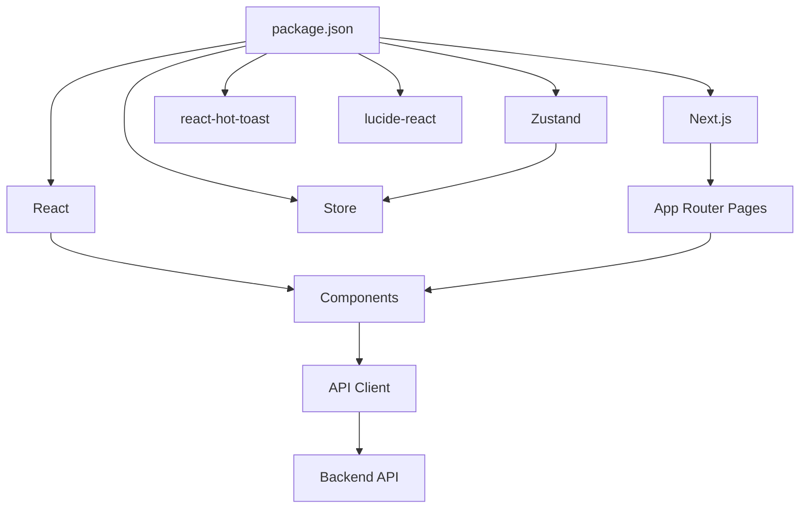

# Frontend Architecture

<cite>
**Referenced Files in This Document**
- [layout.tsx](file://frontend/app/layout.tsx)
- [page.tsx](file://frontend/app/page.tsx)
- [login/page.tsx](file://frontend/app/login/page.tsx)
- [dashboard/page.tsx](file://frontend/app/dashboard/page.tsx)
- [report/lost/page.tsx](file://frontend/app/report/lost/page.tsx)
- [Navbar.tsx](file://frontend/components/Navbar.tsx)
- [ReportForm.tsx](file://frontend/components/ReportForm.tsx)
- [api.ts](file://frontend/lib/api.ts)
- [store.ts](file://frontend/lib/store.ts)
- [index.ts](file://frontend/types/index.ts)
- [tailwind.config.ts](file://frontend/tailwind.config.ts)
- [globals.css](file://frontend/app/globals.css)
- [next.config.js](file://frontend/next.config.js)
- [package.json](file://frontend/package.json)
- [vercel.json](file://frontend/vercel.json)
</cite>

## Table of Contents
1. Introduction
2. Project Structure
3. Core Components
4. Architecture Overview
5. Detailed Component Analysis
6. Dependency Analysis
7. Performance Considerations
8. Troubleshooting Guide
9. Conclusion

## Introduction
This document describes the frontend architecture of the Next.js application, focusing on the App Router structure, component hierarchy, and client-side state management with Zustand. It explains routing strategy, page organization, composition patterns, API client usage, error handling, authentication flow, styling approach with Tailwind CSS, responsive design, accessibility considerations, build configuration, environment variables, and Vercel deployment setup.

## Project Structure
The frontend follows a feature-oriented layout under the Next.js App Router:
- app/: Route segments and shared root layout
  - Root layout defines global metadata, base styles, Navbar, and Toaster
  - Pages include home, login, dashboard, report forms (lost/found), matches detail, messages, notifications, and admin
- components/: Reusable UI components such as Navbar and ReportForm
- lib/: Shared utilities including API client and Zustand store
- types/: TypeScript interfaces for domain models and form shapes
- Configuration files for Next.js, Tailwind, PostCSS, and Vercel

**Diagram sources**
- [layout.tsx:1-28](file://frontend/app/layout.tsx#L1-L28)
- [page.tsx:1-65](file://frontend/app/page.tsx#L1-L65)
- [login/page.tsx:1-266](file://frontend/app/login/page.tsx#L1-L266)
- [dashboard/page.tsx:1-243](file://frontend/app/dashboard/page.tsx#L1-L243)
- [report/lost/page.tsx:1-117](file://frontend/app/report/lost/page.tsx#L1-L117)
- [Navbar.tsx:1-258](file://frontend/components/Navbar.tsx#L1-L258)
- [ReportForm.tsx:1-640](file://frontend/components/ReportForm.tsx#L1-L640)
- [api.ts:1-423](file://frontend/lib/api.ts#L1-L423)

**Section sources**
- [layout.tsx:1-28](file://frontend/app/layout.tsx#L1-L28)
- [page.tsx:1-65](file://frontend/app/page.tsx#L1-L65)
- [dashboard/page.tsx:1-243](file://frontend/app/dashboard/page.tsx#L1-L243)
- [report/lost/page.tsx:1-117](file://frontend/app/report/lost/page.tsx#L1-L117)
- [Navbar.tsx:1-258](file://frontend/components/Navbar.tsx#L1-L258)
- [ReportForm.tsx:1-640](file://frontend/components/ReportForm.tsx#L1-L640)
- [api.ts:1-423](file://frontend/lib/api.ts#L1-L423)

## Core Components
- RootLayout: Provides global metadata, base body styling, Navbar, main content wrapper, and toast container
- LoginPage: Handles user signup/login, validation, and redirects to dashboard
- DashboardPage: Displays user’s lost/found reports with tabs and navigation
- ReportLostPage: Submits lost item reports, shows similar items, and triggers background matching
- Navbar: Global navigation with auth-aware links, unread notification badge, and mobile menu
- ReportForm: Multi-language, validated form for lost/found reports with photo upload and private details

Key responsibilities:
- Routing: App Router pages define routes; Link and useRouter manage navigation
- State: Zustand store manages authenticated user and token persistence
- API: Centralized client wraps fetch with auth headers and typed endpoints
- Styling: Tailwind CSS with custom theme and reusable component classes

**Section sources**
- [layout.tsx:1-28](file://frontend/app/layout.tsx#L1-L28)
- [login/page.tsx:1-266](file://frontend/app/login/page.tsx#L1-L266)
- [dashboard/page.tsx:1-243](file://frontend/app/dashboard/page.tsx#L1-L243)
- [report/lost/page.tsx:1-117](file://frontend/app/report/lost/page.tsx#L1-L117)
- [Navbar.tsx:1-258](file://frontend/components/Navbar.tsx#L1-L258)
- [ReportForm.tsx:1-640](file://frontend/components/ReportForm.tsx#L1-L640)
- [store.ts:1-39](file://frontend/lib/store.ts#L1-L39)
- [api.ts:1-423](file://frontend/lib/api.ts#L1-L423)

## Architecture Overview
The frontend uses Next.js App Router for file-based routing, Zustand for lightweight client state, and a centralized API client for all backend calls. Authentication is handled via JWT stored in localStorage and injected into requests. Notifications and messaging are integrated through dedicated API modules.

**Diagram sources**
- [login/page.tsx:65-103](file://frontend/app/login/page.tsx#L65-L103)
- [store.ts:14-38](file://frontend/lib/store.ts#L14-L38)
- [api.ts:66-78](file://frontend/lib/api.ts#L66-L78)

**Diagram sources**
- [ReportForm.tsx:201-351](file://frontend/components/ReportForm.tsx#L201-L351)
- [report/lost/page.tsx:30-63](file://frontend/app/report/lost/page.tsx#L30-L63)
- [api.ts:143-161](file://frontend/lib/api.ts#L143-L161)

## Detailed Component Analysis

### App Router and Routing Strategy
- Root layout sets global metadata, base styles, and includes Navbar and Toaster
- Home page provides CTAs to report lost/found items
- Login page handles authentication and redirects to dashboard
- Dashboard displays user reports with tabs and links to match details
- Report pages use a shared form component and trigger matching workflows

**Diagram sources**
- [layout.tsx:1-28](file://frontend/app/layout.tsx#L1-L28)
- [page.tsx:1-65](file://frontend/app/page.tsx#L1-L65)
- [login/page.tsx:1-266](file://frontend/app/login/page.tsx#L1-L266)
- [dashboard/page.tsx:1-243](file://frontend/app/dashboard/page.tsx#L1-L243)
- [report/lost/page.tsx:1-117](file://frontend/app/report/lost/page.tsx#L1-L117)

**Section sources**
- [layout.tsx:1-28](file://frontend/app/layout.tsx#L1-L28)
- [page.tsx:1-65](file://frontend/app/page.tsx#L1-L65)
- [login/page.tsx:1-266](file://frontend/app/login/page.tsx#L1-L266)
- [dashboard/page.tsx:1-243](file://frontend/app/dashboard/page.tsx#L1-L243)
- [report/lost/page.tsx:1-117](file://frontend/app/report/lost/page.tsx#L1-L117)

### State Management with Zustand
- Auth store holds user, token, loading state, and provides login/logout/setToken methods
- Token is persisted in localStorage and automatically attached to API requests
- Components consume store via hooks to read user and perform actions

**Diagram sources**
- [store.ts:4-38](file://frontend/lib/store.ts#L4-L38)

**Section sources**
- [store.ts:1-39](file://frontend/lib/store.ts#L1-L39)

### API Client Implementation
- Centralized fetch wrapper adds Content-Type and Authorization headers
- Supports optional token override and falls back to localStorage token
- Typed endpoints for auth, reports, matches, verification, notifications, messages, and admin
- Error handling throws descriptive errors from response bodies or status codes

**Diagram sources**
- [api.ts:7-35](file://frontend/lib/api.ts#L7-L35)

**Section sources**
- [api.ts:1-423](file://frontend/lib/api.ts#L1-L423)

### Authentication Flow on the Client Side
- LoginPage validates inputs, calls authApi.login or authApi.signup
- On success, store.login persists token and updates user
- Toasts provide feedback; router navigates to dashboard
- Navbar reflects logged-in state and exposes logout

**Diagram sources**
- [login/page.tsx:65-103](file://frontend/app/login/page.tsx#L65-L103)
- [store.ts:14-38](file://frontend/lib/store.ts#L14-L38)
- [api.ts:66-78](file://frontend/lib/api.ts#L66-L78)

**Section sources**
- [login/page.tsx:1-266](file://frontend/app/login/page.tsx#L1-L266)
- [store.ts:1-39](file://frontend/lib/store.ts#L1-L39)
- [api.ts:66-78](file://frontend/lib/api.ts#L66-L78)

### Reporting Workflow and Background Matching
- ReportForm validates fields, uploads photo if present, builds payload, and submits via reportsApi
- ReportLostPage receives result, shows similar items, and triggers matchesApi.run non-blockingly
- User can navigate to matches detail after full scan completes

**Diagram sources**
- [ReportForm.tsx:299-351](file://frontend/components/ReportForm.tsx#L299-L351)
- [report/lost/page.tsx:30-63](file://frontend/app/report/lost/page.tsx#L30-L63)
- [api.ts:143-161](file://frontend/lib/api.ts#L143-L161)
- [api.ts:210-218](file://frontend/lib/api.ts#L210-L218)

**Section sources**
- [ReportForm.tsx:1-640](file://frontend/components/ReportForm.tsx#L1-L640)
- [report/lost/page.tsx:1-117](file://frontend/app/report/lost/page.tsx#L1-L117)
- [api.ts:143-161](file://frontend/lib/api.ts#L143-L161)
- [api.ts:210-218](file://frontend/lib/api.ts#L210-L218)

### Notifications and Messaging
- Navbar polls unread count and marks all as read when navigating to notifications
- Messages module supports retrieving threads and sending messages per match

**Section sources**
- [Navbar.tsx:24-46](file://frontend/components/Navbar.tsx#L24-L46)
- [api.ts:277-314](file://frontend/lib/api.ts#L277-L314)

### Admin Features
- Admin API provides stats, match listing, approval/rejection, item status updates, disputed match handling, and flagging

**Section sources**
- [api.ts:316-423](file://frontend/lib/api.ts#L316-L423)

### Styling Approach with Tailwind CSS
- Tailwind config extends theme with primary, success, warning color palettes
- Global CSS defines reusable component classes for buttons, inputs, cards, and badges
- Responsive design uses Tailwind breakpoints and utility classes across pages and components

**Section sources**
- [tailwind.config.ts:1-41](file://frontend/tailwind.config.ts#L1-L41)
- [globals.css:1-61](file://frontend/app/globals.css#L1-L61)

### Accessibility Considerations
- Inputs have associated labels and placeholders for clarity
- Buttons include aria-label where needed (e.g., toggle menu)
- Focus states are defined via Tailwind focus utilities for keyboard navigation
- Icons are decorative but paired with text labels for context

**Section sources**
- [Navbar.tsx:157-163](file://frontend/components/Navbar.tsx#L157-L163)
- [ReportForm.tsx:452-566](file://frontend/components/ReportForm.tsx#L452-L566)

### Build Configuration and Environment Variables
- Next.js config allows remote images from Supabase storage domains
- Vercel config specifies framework, build/install commands, and environment variables for Supabase and API URL
- Package scripts support dev, build, start, and lint workflows

**Section sources**
- [next.config.js:1-15](file://frontend/next.config.js#L1-L15)
- [vercel.json:1-11](file://frontend/vercel.json#L1-L11)
- [package.json:1-32](file://frontend/package.json#L1-L32)

## Dependency Analysis
The frontend depends on:
- Next.js App Router for routing and rendering
- React and React DOM for UI
- Zustand for state management
- react-hot-toast for user feedback
- lucide-react for icons
- @supabase/supabase-js for client-side Supabase integration (if used beyond API)
- Tailwind CSS and PostCSS for styling pipeline

**Diagram sources**
- [package.json:11-19](file://frontend/package.json#L11-L19)

**Section sources**
- [package.json:1-32](file://frontend/package.json#L1-L32)

## Performance Considerations
- Non-blocking matching: After report submission, matching runs asynchronously to avoid blocking user experience
- Efficient polling: Navbar polls unread notification count at intervals and clears on navigation to notifications
- Image optimization: Remote image domains configured for Next.js to optimize delivery
- Minimal state: Zustand keeps only necessary auth state to reduce re-renders

[No sources needed since this section provides general guidance]

## Troubleshooting Guide
Common issues and strategies:
- API errors: The client parses response bodies and throws descriptive errors; catch blocks in pages display toast messages
- Authentication failures: Ensure NEXT_PUBLIC_API_URL is correct and token is present in localStorage or passed explicitly
- Upload errors: Verify file type and size constraints in ReportForm; ensure upload endpoint is reachable
- Navigation guards: Dashboard redirects unauthenticated users to login; verify store state initialization

**Section sources**
- [api.ts:18-52](file://frontend/lib/api.ts#L18-L52)
- [login/page.tsx:97-103](file://frontend/app/login/page.tsx#L97-L103)
- [dashboard/page.tsx:43-49](file://frontend/app/dashboard/page.tsx#L43-L49)
- [ReportForm.tsx:252-274](file://frontend/components/ReportForm.tsx#L252-L274)

## Conclusion
The frontend leverages Next.js App Router for structured routing, Zustand for simple and effective client state, and a robust API client for consistent backend communication. Tailwind CSS enables rapid, responsive UI development with accessible components. The reporting workflow integrates immediate feedback and background processing for AI-driven matching. Environment configuration and Vercel deployment settings streamline production readiness.