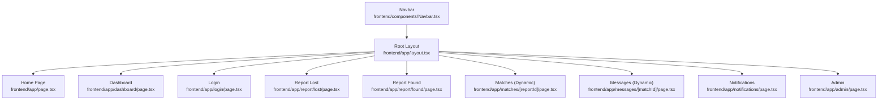
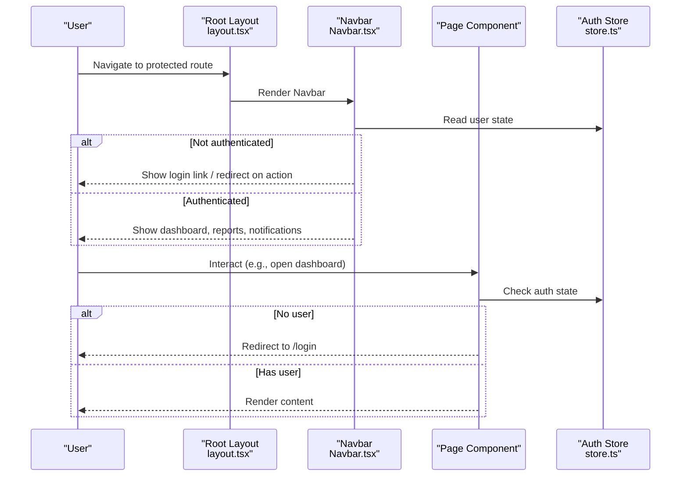
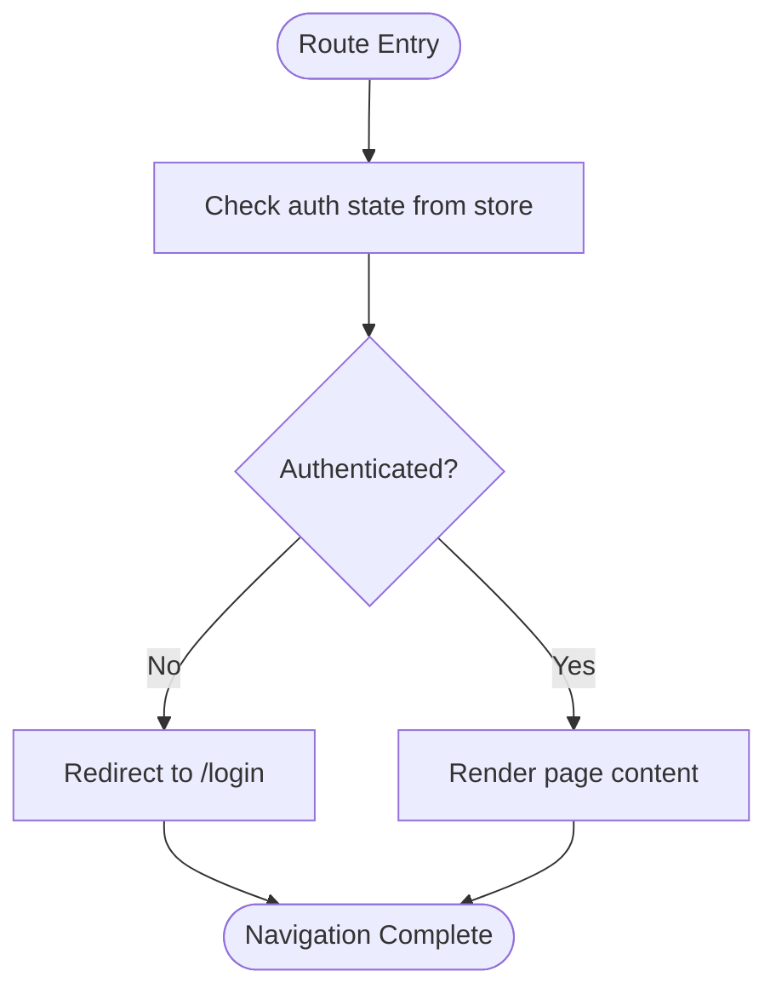
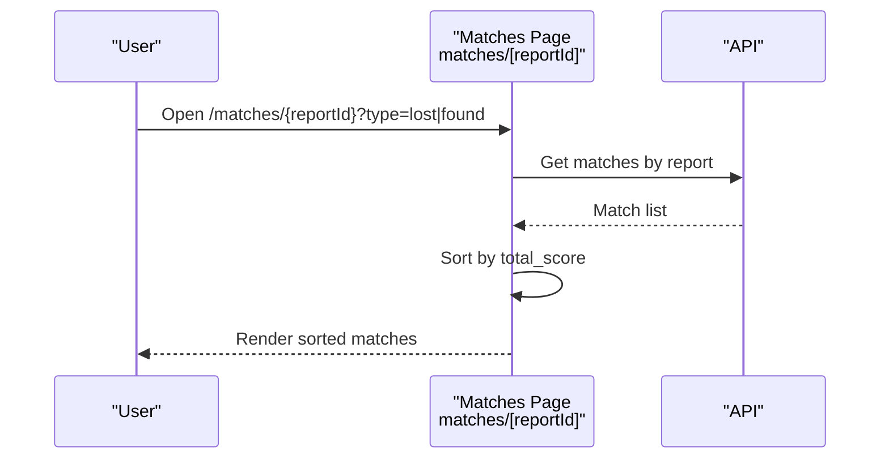
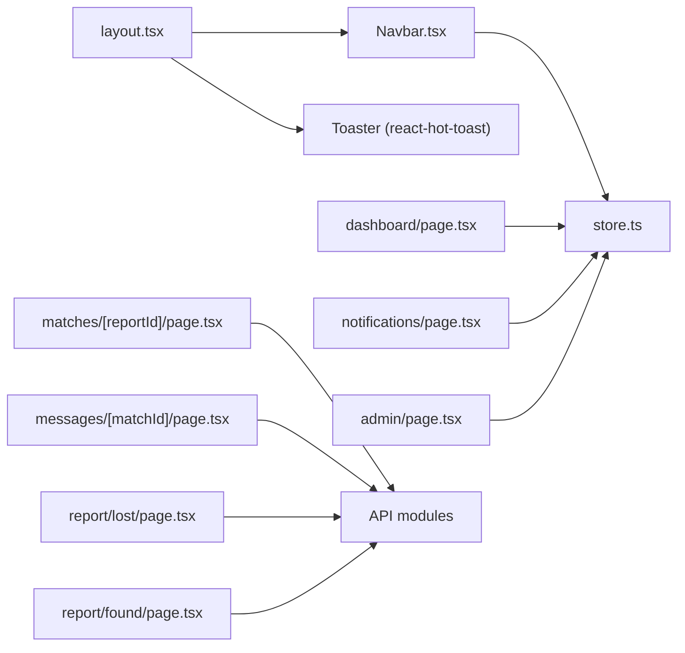

# Routing & Navigation

<cite>
**Referenced Files in This Document**
- [layout.tsx](file://frontend/app/layout.tsx)
- [page.tsx](file://frontend/app/page.tsx)
- [Navbar.tsx](file://frontend/components/Navbar.tsx)
- [dashboard/page.tsx](file://frontend/app/dashboard/page.tsx)
- [login/page.tsx](file://frontend/app/login/page.tsx)
- [report/lost/page.tsx](file://frontend/app/report/lost/page.tsx)
- [report/found/page.tsx](file://frontend/app/report/found/page.tsx)
- [matches/[reportId]/page.tsx](file://frontend/app/matches/[reportId]/page.tsx)
- [messages/[matchId]/page.tsx](file://frontend/app/messages/[matchId]/page.tsx)
- [notifications/page.tsx](file://frontend/app/notifications/page.tsx)
- [admin/page.tsx](file://frontend/app/admin/page.tsx)
- [store.ts](file://frontend/lib/store.ts)
</cite>

## Table of Contents
1. Introduction
2. Project Structure
3. Core Components
4. Architecture Overview
5. Detailed Component Analysis
6. Dependency Analysis
7. Performance Considerations
8. Troubleshooting Guide
9. Conclusion

## Introduction
This document explains the Next.js App Router implementation for routing, layout composition, and navigation across the Lost & Found AI Matcher frontend. It covers:
- File-based routes and nested route segments
- Root layout providing global components (Navbar and Toaster)
- Protected routes with authentication guards and redirect logic
- Dynamic routes for matches and messages
- Client-side navigation patterns using Next.js router and Link
- Responsive mobile-first navigation menu

## Project Structure
The application uses the Next.js App Router file-based routing convention under the app directory. Each folder maps to a route segment; page.tsx files render the UI for that route. Dynamic segments are defined with square brackets.

Key routes:
- / — Home page
- /login — Authentication (login/signup)
- /dashboard — User dashboard (protected)
- /report/lost — Report a lost item
- /report/found — Report a found item
- /matches/[reportId] — View matches for a report (dynamic)
- /messages/[matchId] — Message thread for a match (dynamic)
- /notifications — Notifications list
- /admin — Admin panel (role-gated)

**Diagram sources**
- [layout.tsx:11-27](file://frontend/app/layout.tsx#L11-L27)
- [page.tsx:4-45](file://frontend/app/page.tsx#L4-L45)
- [dashboard/page.tsx:35-117](file://frontend/app/dashboard/page.tsx#L35-L117)
- [login/page.tsx:17-103](file://frontend/app/login/page.tsx#L17-L103)
- [report/lost/page.tsx:22-63](file://frontend/app/report/lost/page.tsx#L22-L63)
- [report/found/page.tsx:9-46](file://frontend/app/report/found/page.tsx#L9-L46)
- [matches/[reportId]/page.tsx:12-93](file://frontend/app/matches/[reportId]/page.tsx#L12-L93)
- [messages/[matchId]/page.tsx:10-110](file://frontend/app/messages/[matchId]/page.tsx#L10-L110)
- [notifications/page.tsx:44-173](file://frontend/app/notifications/page.tsx#L44-L173)
- [admin/page.tsx:31-127](file://frontend/app/admin/page.tsx#L31-L127)
- [Navbar.tsx:17-209](file://frontend/components/Navbar.tsx#L17-L209)

**Section sources**
- [layout.tsx:11-27](file://frontend/app/layout.tsx#L11-L27)
- [page.tsx:4-45](file://frontend/app/page.tsx#L4-L45)
- [dashboard/page.tsx:35-117](file://frontend/app/dashboard/page.tsx#L35-L117)
- [login/page.tsx:17-103](file://frontend/app/login/page.tsx#L17-L103)
- [report/lost/page.tsx:22-63](file://frontend/app/report/lost/page.tsx#L22-L63)
- [report/found/page.tsx:9-46](file://frontend/app/report/found/page.tsx#L9-L46)
- [matches/[reportId]/page.tsx:12-93](file://frontend/app/matches/[reportId]/page.tsx#L12-L93)
- [messages/[matchId]/page.tsx:10-110](file://frontend/app/messages/[matchId]/page.tsx#L10-L110)
- [notifications/page.tsx:44-173](file://frontend/app/notifications/page.tsx#L44-L173)
- [admin/page.tsx:31-127](file://frontend/app/admin/page.tsx#L31-L127)
- [Navbar.tsx:17-209](file://frontend/components/Navbar.tsx#L17-L209)

## Core Components
- Root layout: Provides global HTML structure, imports global CSS, renders Navbar at the top, wraps children inside a responsive container, and includes a Toaster for user feedback.
- Navbar: Client component with responsive navigation, user menu, unread notification badge, and role-based links. Uses Next.js navigation hooks and Zustand store for auth state.
- Pages: Feature pages implement client-side data fetching, error handling via toast notifications, and client-side navigation using useRouter or Link.

Global components provided by root layout:
- Navbar: Present on every page, handles authenticated vs unauthenticated states and admin visibility.
- Toaster: Global toast notifications for success/error feedback.

**Section sources**
- [layout.tsx:1-27](file://frontend/app/layout.tsx#L1-L27)
- [Navbar.tsx:17-209](file://frontend/components/Navbar.tsx#L17-L209)

## Architecture Overview
The application follows a layered approach:
- Layout layer: Root layout composes Navbar and Toaster globally.
- Route layer: Each feature is a route segment with its own page component.
- Client layer: Pages use React hooks, Next.js navigation, and Zustand store for state.
- API layer: Pages call backend APIs via centralized modules (not shown here).

**Diagram sources**
- [layout.tsx:11-27](file://frontend/app/layout.tsx#L11-L27)
- [Navbar.tsx:17-209](file://frontend/components/Navbar.tsx#L17-L209)
- [dashboard/page.tsx:43-49](file://frontend/app/dashboard/page.tsx#L43-L49)
- [store.ts:14-38](file://frontend/lib/store.ts#L14-L38)

## Detailed Component Analysis

### Root Layout and Global Components
- The root layout defines metadata, loads global styles, and renders Navbar and Toaster.
- Children are wrapped in a responsive container with consistent padding and max-width.

Implementation highlights:
- Metadata sets title and description globally.
- Navbar is rendered once per page load.
- Toaster is positioned top-right for non-intrusive feedback.

**Section sources**
- [layout.tsx:1-27](file://frontend/app/layout.tsx#L1-L27)

### Responsive Navigation Menu (Mobile-First)
- Desktop: Horizontal nav links appear at medium breakpoints and above.
- Mobile: Hamburger toggles a vertical menu with the same links and actions.
- Unread notification badge updates periodically and resets when viewing notifications.
- Role-based visibility: Admin link appears only for admin users.

Behavioral notes:
- Uses Next.js usePathname to detect current route and update unread counts.
- Stores user state in Zustand and exposes logout functionality.

**Section sources**
- [Navbar.tsx:10-209](file://frontend/components/Navbar.tsx#L10-L209)

### Authentication Guards and Redirect Logic
Protected routes enforce authentication before rendering content:
- Dashboard: Redirects to /login if no user is present after auth loading resolves.
- Notifications: Same guard pattern as dashboard.
- Admin: Redirects to home if not authenticated or not an admin.

Client-side redirects use Next.js useRouter.push.

**Diagram sources**
- [dashboard/page.tsx:43-49](file://frontend/app/dashboard/page.tsx#L43-L49)
- [notifications/page.tsx:51-57](file://frontend/app/notifications/page.tsx#L51-L57)
- [admin/page.tsx:41-47](file://frontend/app/admin/page.tsx#L41-L47)
- [store.ts:14-38](file://frontend/lib/store.ts#L14-L38)

**Section sources**
- [dashboard/page.tsx:43-49](file://frontend/app/dashboard/page.tsx#L43-L49)
- [notifications/page.tsx:51-57](file://frontend/app/notifications/page.tsx#L51-L57)
- [admin/page.tsx:41-47](file://frontend/app/admin/page.tsx#L41-L47)
- [store.ts:14-38](file://frontend/lib/store.ts#L14-L38)

### Dynamic Routes: Matches and Messages
- Matches: /matches/[reportId] fetches matches for a specific report and sorts by score. Supports query parameters to differentiate between lost and found contexts.
- Messages: /messages/[matchId] displays a message thread with auto-refresh and send functionality.

Data flow:
- Extract dynamic params via useParams.
- Fetch data from API, handle errors with toast notifications.
- Provide back navigation to dashboard or relevant sections.

**Diagram sources**
- [matches/[reportId]/page.tsx:12-93](file://frontend/app/matches/[reportId]/page.tsx#L12-L93)

**Section sources**
- [matches/[reportId]/page.tsx:12-93](file://frontend/app/matches/[reportId]/page.tsx#L12-L93)
- [messages/[matchId]/page.tsx:10-110](file://frontend/app/messages/[matchId]/page.tsx#L10-L110)

### Reporting Flows: Lost and Found
- Report Lost: Submits form, triggers immediate similar items search, then runs full matching engine asynchronously. Navigates to matches if results exist.
- Report Found: Submits form, immediately runs matching engine, navigates to matches if any found, otherwise returns to dashboard.

Error handling:
- Toast notifications inform users of success or failure.
- Non-fatal background matching failures are ignored gracefully.

**Section sources**
- [report/lost/page.tsx:22-63](file://frontend/app/report/lost/page.tsx#L22-L63)
- [report/found/page.tsx:9-46](file://frontend/app/report/found/page.tsx#L9-L46)

### Login Flow and Post-Login Navigation
- Supports both login and signup modes with validation.
- On success, stores token and user in Zustand, shows success toast, and navigates to dashboard.

**Section sources**
- [login/page.tsx:17-103](file://frontend/app/login/page.tsx#L17-L103)
- [store.ts:14-38](file://frontend/lib/store.ts#L14-L38)

### Notifications Page
- Displays all notifications with icons and colors based on type.
- Supports marking individual or all notifications as read.
- Redirects to login if not authenticated.

**Section sources**
- [notifications/page.tsx:44-173](file://frontend/app/notifications/page.tsx#L44-L173)

### Admin Panel
- Role-gated: Only accessible to users with admin role; otherwise redirects to home.
- Provides stats, match review table, and fraud/disputed case management.

**Section sources**
- [admin/page.tsx:31-127](file://frontend/app/admin/page.tsx#L31-L127)

## Dependency Analysis
Component relationships and dependencies:
- Root layout depends on Navbar and Toaster.
- Pages depend on Zustand store for auth state and Next.js navigation utilities.
- Navbar depends on store and API for unread count polling.
- Dynamic pages depend on API modules for data fetching.

**Diagram sources**
- [layout.tsx:1-27](file://frontend/app/layout.tsx#L1-L27)
- [Navbar.tsx:17-209](file://frontend/components/Navbar.tsx#L17-L209)
- [store.ts:14-38](file://frontend/lib/store.ts#L14-L38)
- [dashboard/page.tsx:35-117](file://frontend/app/dashboard/page.tsx#L35-L117)
- [notifications/page.tsx:44-173](file://frontend/app/notifications/page.tsx#L44-L173)
- [admin/page.tsx:31-127](file://frontend/app/admin/page.tsx#L31-L127)
- [matches/[reportId]/page.tsx:12-93](file://frontend/app/matches/[reportId]/page.tsx#L12-L93)
- [messages/[matchId]/page.tsx:10-110](file://frontend/app/messages/[matchId]/page.tsx#L10-L110)
- [report/lost/page.tsx:22-63](file://frontend/app/report/lost/page.tsx#L22-L63)
- [report/found/page.tsx:9-46](file://frontend/app/report/found/page.tsx#L9-L46)

**Section sources**
- [layout.tsx:1-27](file://frontend/app/layout.tsx#L1-L27)
- [Navbar.tsx:17-209](file://frontend/components/Navbar.tsx#L17-L209)
- [store.ts:14-38](file://frontend/lib/store.ts#L14-L38)
- [dashboard/page.tsx:35-117](file://frontend/app/dashboard/page.tsx#L35-L117)
- [notifications/page.tsx:44-173](file://frontend/app/notifications/page.tsx#L44-L173)
- [admin/page.tsx:31-127](file://frontend/app/admin/page.tsx#L31-L127)
- [matches/[reportId]/page.tsx:12-93](file://frontend/app/matches/[reportId]/page.tsx#L12-L93)
- [messages/[matchId]/page.tsx:10-110](file://frontend/app/messages/[matchId]/page.tsx#L10-L110)
- [report/lost/page.tsx:22-63](file://frontend/app/report/lost/page.tsx#L22-L63)
- [report/found/page.tsx:9-46](file://frontend/app/report/found/page.tsx#L9-L46)

## Performance Considerations
- Use Link for client-side navigation to avoid full page reloads where possible.
- Debounce or limit polling intervals for unread counts and message threads to reduce network overhead.
- Prefer server components for static content where feasible to reduce client bundle size.
- Lazy-load heavy components or features behind user interactions to improve initial load performance.

[No sources needed since this section provides general guidance]

## Troubleshooting Guide
Common issues and resolutions:
- Authentication redirects not working: Ensure auth store initializes correctly and pages check auth state after loading.
- Notification badge not updating: Verify polling interval and mark-all-read behavior in Navbar and Notifications page.
- Dynamic route parameter missing: Confirm URL contains required params (reportId, matchId) and handle empty values gracefully.
- Error handling: All pages use toast notifications for user feedback; ensure API calls catch errors and display meaningful messages.

**Section sources**
- [dashboard/page.tsx:43-49](file://frontend/app/dashboard/page.tsx#L43-L49)
- [notifications/page.tsx:51-57](file://frontend/app/notifications/page.tsx#L51-L57)
- [admin/page.tsx:41-47](file://frontend/app/admin/page.tsx#L41-L47)
- [matches/[reportId]/page.tsx:21-33](file://frontend/app/matches/[reportId]/page.tsx#L21-L33)
- [messages/[matchId]/page.tsx:20-31](file://frontend/app/messages/[matchId]/page.tsx#L20-L31)
- [report/lost/page.tsx:30-63](file://frontend/app/report/lost/page.tsx#L30-L63)
- [report/found/page.tsx:13-46](file://frontend/app/report/found/page.tsx#L13-L46)

## Conclusion
The Next.js App Router implementation organizes routes by feature with clear separation of concerns. The root layout centralizes global UI elements, while pages encapsulate their own logic and navigation. Authentication guards protect sensitive routes, and dynamic routes enable flexible content addressing. The responsive Navbar supports both desktop and mobile experiences, and consistent error handling via toast notifications improves user feedback.

[No sources needed since this section summarizes without analyzing specific files]