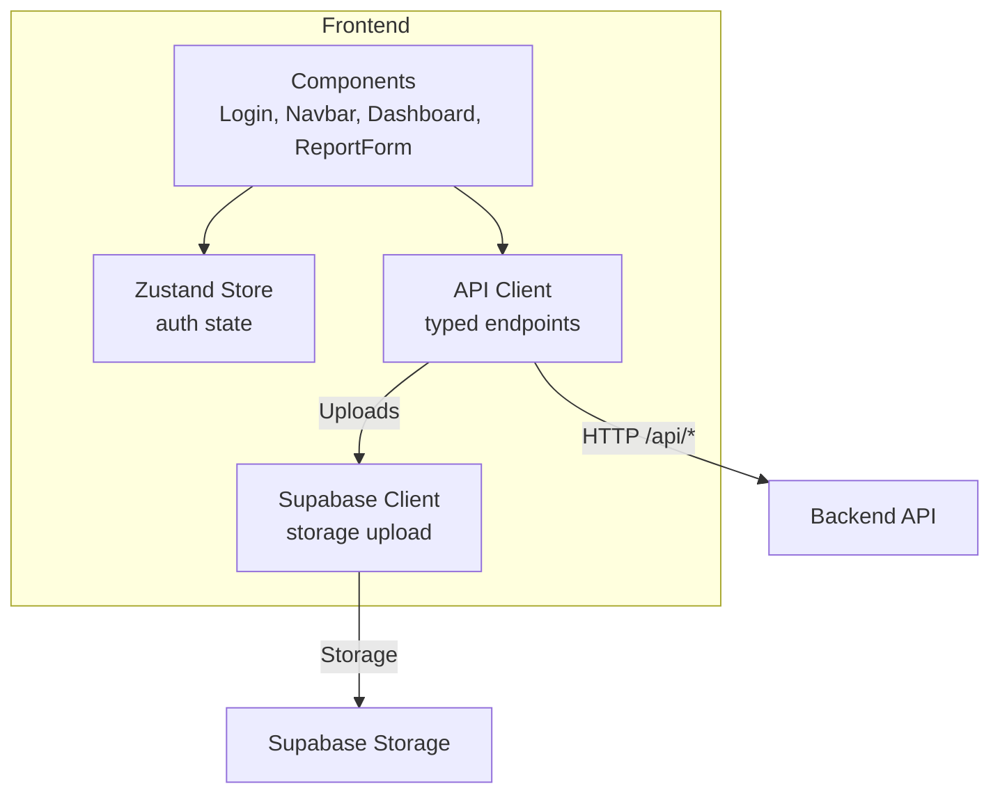
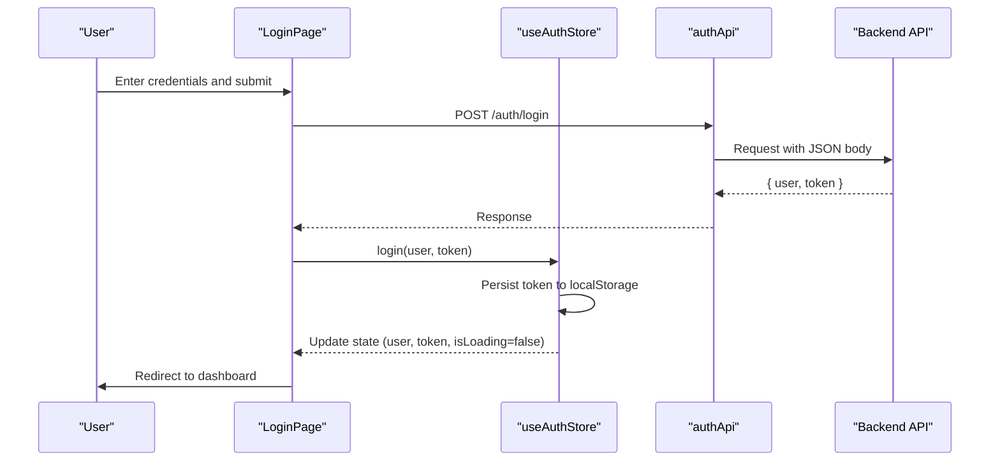
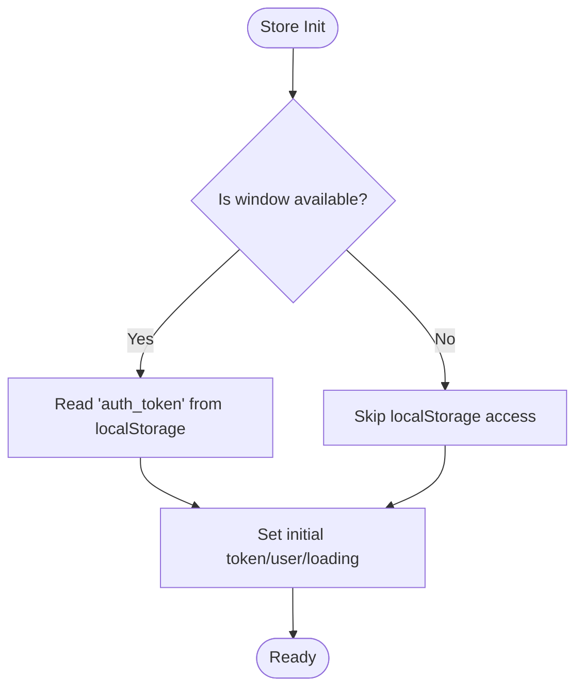
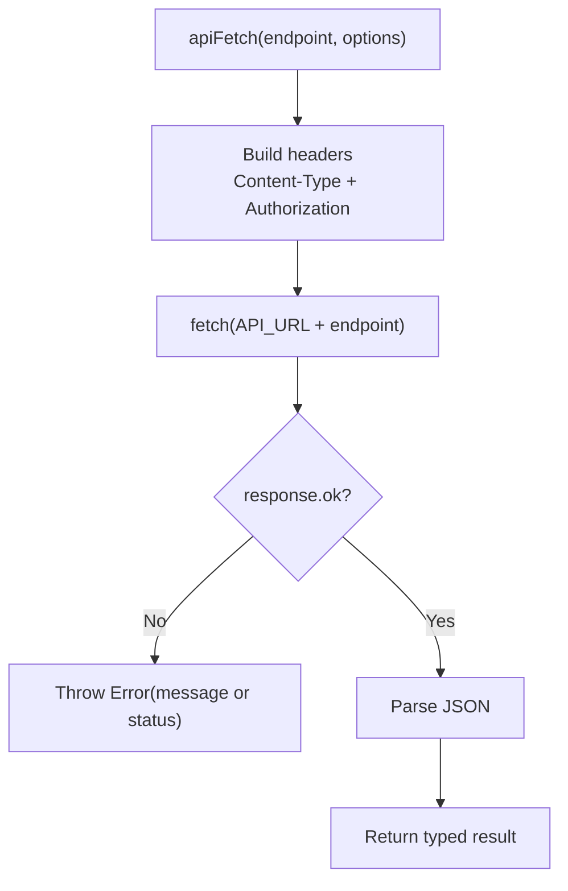
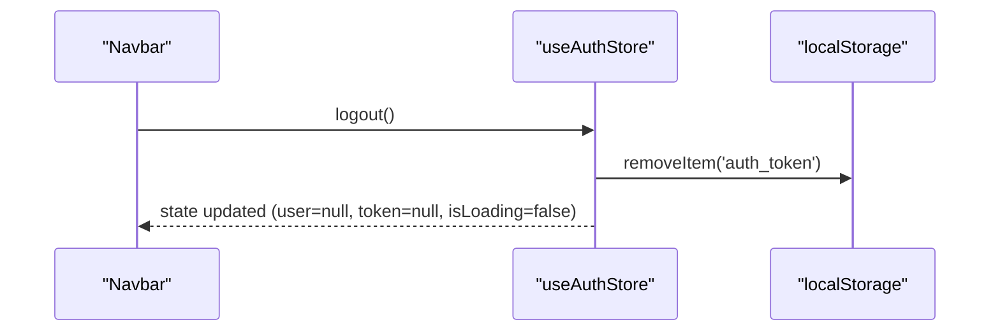
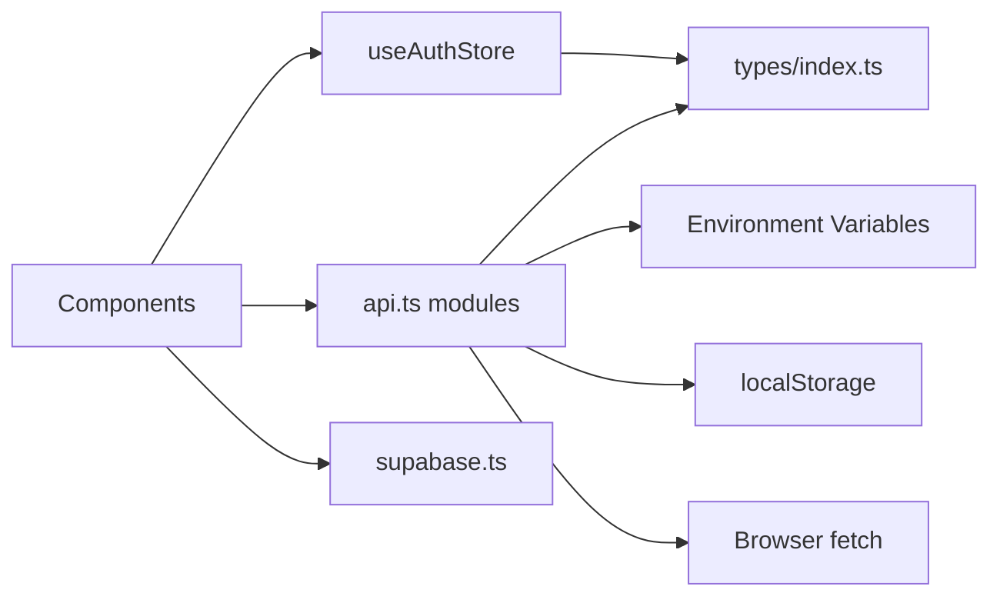

# State Management with Zustand

<cite>
**Referenced Files in This Document**
- [store.ts](file://frontend/lib/store.ts)
- [api.ts](file://frontend/lib/api.ts)
- [index.ts](file://frontend/types/index.ts)
- [supabase.ts](file://frontend/lib/supabase.ts)
- [page.tsx (Login)](file://frontend/app/login/page.tsx)
- [Navbar.tsx](file://frontend/components/Navbar.tsx)
- [layout.tsx](file://frontend/app/layout.tsx)
- [page.tsx (Dashboard)](file://frontend/app/dashboard/page.tsx)
- [ReportForm.tsx](file://frontend/components/ReportForm.tsx)
</cite>

## Table of Contents
1. [Introduction](#introduction)
2. [Project Structure](#project-structure)
3. [Core Components](#core-components)
4. [Architecture Overview](#architecture-overview)
5. [Detailed Component Analysis](#detailed-component-analysis)
6. [Dependency Analysis](#dependency-analysis)
7. [Performance Considerations](#performance-considerations)
8. [Troubleshooting Guide](#troubleshooting-guide)
9. [Conclusion](#conclusion)
10. [Appendices](#appendices)

## Introduction
This document explains the Zustand-based state management implementation used in the frontend of the Lost & Found AI Matcher application. It covers the store structure, authentication flow, token storage and session handling, API integration layer, TypeScript types, and patterns for persistence, optimistic updates, and real-time synchronization. The goal is to provide both a high-level understanding and code-level details for developers integrating or extending the state layer.

## Project Structure
The state management spans several key files:
- Store definition and auth actions live in a single Zustand store module.
- API clients encapsulate HTTP requests, error handling, and typed responses.
- Types define domain models and constants for forms and entities.
- Supabase client provides storage utilities for photo uploads.
- UI components consume the store via hooks and trigger API calls.

**Diagram sources**
- [store.ts:1-39](file://frontend/lib/store.ts#L1-L39)
- [api.ts:1-52](file://frontend/lib/api.ts#L1-L52)
- [supabase.ts:1-25](file://frontend/lib/supabase.ts#L1-L25)
- [page.tsx (Login):1-103](file://frontend/app/login/page.tsx#L1-L103)
- [Navbar.tsx:1-52](file://frontend/components/Navbar.tsx#L1-L52)
- [ReportForm.tsx:1-60](file://frontend/components/ReportForm.tsx#L1-L60)

**Section sources**
- [store.ts:1-39](file://frontend/lib/store.ts#L1-L39)
- [api.ts:1-52](file://frontend/lib/api.ts#L1-L52)
- [supabase.ts:1-25](file://frontend/lib/supabase.ts#L1-L25)
- [page.tsx (Login):1-103](file://frontend/app/login/page.tsx#L1-L103)
- [Navbar.tsx:1-52](file://frontend/components/Navbar.tsx#L1-L52)
- [ReportForm.tsx:1-60](file://frontend/components/ReportForm.tsx#L1-L60)

## Core Components
- Auth Store (Zustand): Holds user, token, loading flag, and exposes setters and login/logout actions. Persists token to localStorage and clears it on logout.
- API Layer: Centralized fetch wrapper that injects Authorization headers from either explicit tokens or localStorage, standardizes error throwing, and exposes typed modules for auth, reports, matches, verification, notifications, messages, and admin features.
- Types: Strongly-typed interfaces for User, Item entities, Match, Notifications, Messages, Admin data, and form payloads/constants.
- Supabase Integration: Provides a helper to upload photos to Supabase Storage and return public URLs.

Key responsibilities:
- Authentication state and session persistence are managed by the store.
- All network requests go through the API client, ensuring consistent header injection and error handling.
- UI components subscribe to store state and dispatch actions; they also call API methods as needed.

**Section sources**
- [store.ts:4-38](file://frontend/lib/store.ts#L4-L38)
- [api.ts:1-52](file://frontend/lib/api.ts#L1-L52)
- [index.ts:1-197](file://frontend/types/index.ts#L1-L197)
- [supabase.ts:8-24](file://frontend/lib/supabase.ts#L8-L24)

## Architecture Overview
The application follows a unidirectional data flow:
- UI triggers actions (e.g., login, submit report).
- Actions call API endpoints and update the Zustand store.
- Store persists token to localStorage and notifies subscribers.
- Components re-render with updated state and can perform side effects (e.g., navigation, fetching additional data).

**Diagram sources**
- [page.tsx (Login):65-103](file://frontend/app/login/page.tsx#L65-L103)
- [api.ts:66-78](file://frontend/lib/api.ts#L66-L78)
- [store.ts:14-38](file://frontend/lib/store.ts#L14-L38)

## Detailed Component Analysis

### Zustand Auth Store
- State fields:
  - user: current authenticated user or null
  - token: JWT string or null
  - isLoading: boolean indicating initialization/loading
- Actions:
  - setUser: sets user and clears loading
  - setToken: persists token to localStorage when present, removes when null, then updates state
  - login: persists token and sets user + clears loading
  - logout: clears token from localStorage and resets user/token/loading
- Persistence strategy:
  - Token is read from localStorage at store initialization (when window is defined)
  - Token is written on login/setToken and removed on logout

**Diagram sources**
- [store.ts:14-17](file://frontend/lib/store.ts#L14-L17)

**Section sources**
- [store.ts:4-38](file://frontend/lib/store.ts#L4-L38)

### API Integration Layer
- Base fetch wrapper:
  - Builds headers with Content-Type and Authorization
  - Authorization precedence: explicit token parameter > stored token in localStorage
  - Throws Error with message from response body or status
- Upload helper:
  - Uses multipart/form-data and resolves auth headers automatically
- Typed modules:
  - authApi: signup, login returning user and token
  - reportsApi: uploadPhoto, createLost, createFound, getById, getByUser
  - matchesApi: run, getByReport
  - verifyApi: getQuestion, submitAnswer, judgeAnswer
  - notificationsApi: getAll, markRead, markAllRead, getUnreadCount
  - messagesApi: getThread, send
  - adminApi: getStats, getMatches, approveMatch, rejectMatch, updateItemStatus, getDisputed, flagMatch, unflagMatch

Error handling:
- Non-OK responses throw an Error with server-provided message or status text
- Upload errors follow the same pattern

Caching strategy:
- No built-in caching in the API layer; each call performs a fresh request
- For repeated reads (e.g., unread count), consider adding memoization or polling strategies in components

**Diagram sources**
- [api.ts:1-35](file://frontend/lib/api.ts#L1-L35)

**Section sources**
- [api.ts:1-52](file://frontend/lib/api.ts#L1-L52)
- [api.ts:54-423](file://frontend/lib/api.ts#L54-L423)

### Authentication Flow and Session Handling
- Login/Signup:
  - LoginPage calls authApi.login/signup
  - On success, calls useAuthStore.login(user, token)
  - Store persists token and updates user state
- Navigation guard:
  - Dashboard checks authLoading and user presence; redirects to login if not authenticated
- Logout:
  - Navbar triggers store.logout which clears token and user state

**Diagram sources**
- [store.ts:34-37](file://frontend/lib/store.ts#L34-L37)
- [Navbar.tsx:48-52](file://frontend/components/Navbar.tsx#L48-L52)

**Section sources**
- [page.tsx (Login):65-103](file://frontend/app/login/page.tsx#L65-L103)
- [store.ts:14-38](file://frontend/lib/store.ts#L14-L38)
- [page.tsx (Dashboard):43-49](file://frontend/app/dashboard/page.tsx#L43-L49)
- [Navbar.tsx:24-46](file://frontend/components/Navbar.tsx#L24-L46)

### Reports and Photo Uploads
- ReportForm:
  - Validates inputs and builds payload based on type (lost/found)
  - If a photo is selected, uploads via reportsApi.uploadPhoto
  - Calls onSubmit callback to create the report
- Photo upload:
  - Uses apiUpload under the hood with FormData
  - Returns URL mapped to photo_url for consistency

Optimistic update example:
- While creating a report, you can optimistically add a new item to local lists before the API responds, then reconcile on success/error. This pattern is not implemented in the provided code but can be added around the onSubmit callback in pages using ReportForm.

Real-time synchronization example:
- Notifications unread count is polled every 30 seconds in Navbar. This demonstrates a simple polling pattern for near-real-time updates.

**Section sources**
- [ReportForm.tsx:299-351](file://frontend/components/ReportForm.tsx#L299-L351)
- [api.ts:143-161](file://frontend/lib/api.ts#L143-L161)
- [api.ts:37-52](file://frontend/lib/api.ts#L37-L52)
- [Navbar.tsx:24-46](file://frontend/components/Navbar.tsx#L24-L46)

### TypeScript Type Definitions
- Domain models:
  - User, LostItem, FoundItem, Match, Message, Notification
  - Enums and constants: ItemStatus, MatchStatus, NotificationType, CATEGORIES, COLOURS, BRANDS
- API contracts:
  - AuthResponse, ReportResponse, UserReportsResponse
  - MatchRunResult, RunMatchesResponse, MatchListItem
  - VerificationQuestion, VerificationAnswerResponse, VerificationJudgeResponse
  - NotificationsResponse, MessagesResponse
  - Admin stats and disputed match types
- Form payloads:
  - CreateLostReportRequest, CreateFoundReportRequest
  - LostReportForm, FoundReportForm

These types ensure compile-time safety across components and API calls.

**Section sources**
- [index.ts:1-197](file://frontend/types/index.ts#L1-L197)
- [api.ts:54-423](file://frontend/lib/api.ts#L54-L423)

### Supabase Storage Integration
- uploadPhoto:
  - Generates unique file name and path
  - Uploads to Supabase Storage bucket with cache control
  - Returns public URL for display and submission

Usage:
- ReportForm uses reportsApi.uploadPhoto which internally uses this helper to obtain a URL for the report’s photo field.

**Section sources**
- [supabase.ts:8-24](file://frontend/lib/supabase.ts#L8-L24)
- [api.ts:143-149](file://frontend/lib/api.ts#L143-L149)
- [ReportForm.tsx:308-313](file://frontend/components/ReportForm.tsx#L308-L313)

## Dependency Analysis
- Components depend on:
  - useAuthStore for user state and actions
  - API modules for all network operations
  - Types for strong typing
- Store depends on:
  - Types for user shape
  - Browser APIs (localStorage) for persistence
- API depends on:
  - Environment variables for base URL
  - Browser fetch API
- Supabase client depends on environment variables for URL and anon key

**Diagram sources**
- [store.ts:1-39](file://frontend/lib/store.ts#L1-L39)
- [api.ts:1-52](file://frontend/lib/api.ts#L1-L52)
- [index.ts:1-197](file://frontend/types/index.ts#L1-L197)
- [supabase.ts:1-25](file://frontend/lib/supabase.ts#L1-L25)

**Section sources**
- [store.ts:1-39](file://frontend/lib/store.ts#L1-L39)
- [api.ts:1-52](file://frontend/lib/api.ts#L1-L52)
- [index.ts:1-197](file://frontend/types/index.ts#L1-L197)
- [supabase.ts:1-25](file://frontend/lib/supabase.ts#L1-L25)

## Performance Considerations
- Avoid unnecessary re-renders:
  - Keep store minimal; only expose necessary selectors or derived values if needed
- Network efficiency:
  - Add caching/memoization for frequently accessed data (e.g., notifications count)
  - Debounce rapid successive requests where applicable
- Token handling:
  - Ensure Authorization header is attached consistently; avoid redundant localStorage reads per request by passing token explicitly when available
- Image uploads:
  - Validate size and type client-side to reduce failed uploads
- Polling:
  - Use reasonable intervals for polling (e.g., 30s) and clear intervals on unmount

[No sources needed since this section provides general guidance]

## Troubleshooting Guide
Common issues and resolutions:
- Unauthorized errors:
  - Verify token exists in localStorage and Authorization header is set
  - Ensure login succeeded and store was updated
- API errors:
  - Errors thrown include server message or status; log and surface to users
- Upload failures:
  - Check file type and size constraints; handle Supabase errors gracefully
- Navigation guards:
  - If redirected unexpectedly, confirm authLoading resolved and user is present

**Section sources**
- [api.ts:29-35](file://frontend/lib/api.ts#L29-L35)
- [api.ts:46-52](file://frontend/lib/api.ts#L46-L52)
- [page.tsx (Dashboard):43-49](file://frontend/app/dashboard/page.tsx#L43-L49)

## Conclusion
The Zustand store centralizes authentication state and persists sessions via localStorage. The API layer standardizes requests, error handling, and provides strongly-typed endpoints. Components integrate seamlessly by subscribing to store state and invoking API functions. Patterns like polling enable near-real-time updates, while the type system ensures developer experience and safety. Extending the app with caching, optimistic updates, and more robust real-time sync can build on this foundation.

[No sources needed since this section summarizes without analyzing specific files]

## Appendices

### Example: Optimistic Updates Pattern
- Before calling an API to create a report, add a temporary item to local lists
- On success, replace the temporary item with the server-returned entity
- On error, revert to previous state and show an error toast

[No sources needed since this section describes a conceptual pattern]

### Example: Real-Time Data Synchronization
- Poll for unread notification counts periodically
- Clear unread badge when navigating to the notifications page
- Use intervals and cleanup on component unmount

**Section sources**
- [Navbar.tsx:24-46](file://frontend/components/Navbar.tsx#L24-L46)