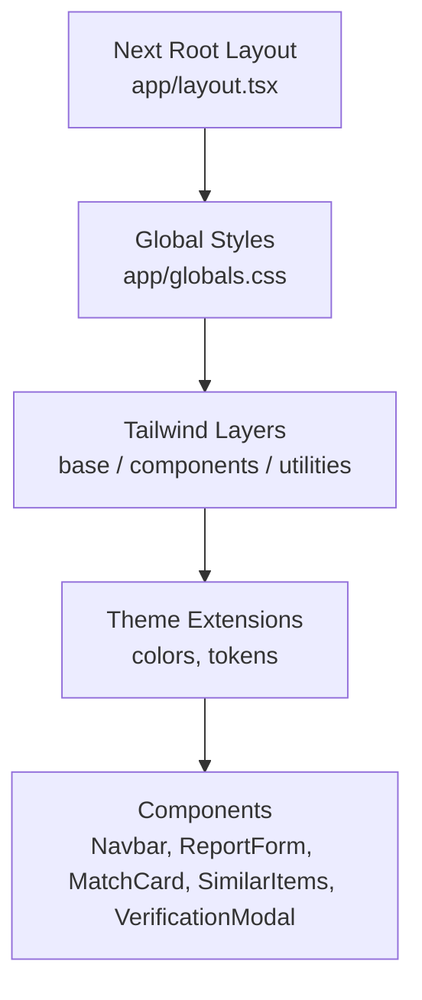
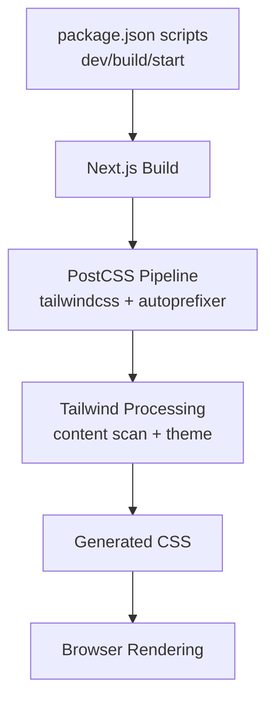
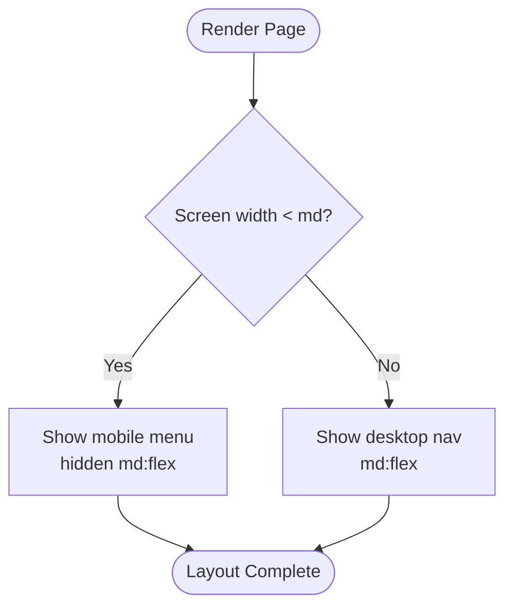
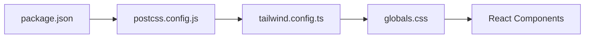

# Styling & Design System

<cite>
**Referenced Files in This Document**
- [tailwind.config.ts](file://frontend/tailwind.config.ts)
- [postcss.config.js](file://frontend/postcss.config.js)
- [globals.css](file://frontend/app/globals.css)
- [layout.tsx](file://frontend/app/layout.tsx)
- [Navbar.tsx](file://frontend/components/Navbar.tsx)
- [ReportForm.tsx](file://frontend/components/ReportForm.tsx)
- [MatchCard.tsx](file://frontend/components/MatchCard.tsx)
- [SimilarItems.tsx](file://frontend/components/SimilarItems.tsx)
- [VerificationModal.tsx](file://frontend/components/VerificationModal.tsx)
- [package.json](file://frontend/package.json)
</cite>

## Table of Contents
1. [Introduction](#introduction)
2. [Project Structure](#project-structure)
3. [Core Components](#core-components)
4. [Architecture Overview](#architecture-overview)
5. [Detailed Component Analysis](#detailed-component-analysis)
6. [Dependency Analysis](#dependency-analysis)
7. [Performance Considerations](#performance-considerations)
8. [Troubleshooting Guide](#troubleshooting-guide)
9. [Conclusion](#conclusion)
10. [Appendices](#appendices)

## Introduction
This document describes the styling and design system built with Tailwind CSS for the frontend application. It covers design tokens (colors, typography, spacing), global CSS structure, custom component utilities, responsive strategy, accessibility practices, and build configuration including PostCSS setup and production optimization considerations.

## Project Structure
The styling system is centered around:
- Tailwind configuration for theme extensions and content scanning
- Global CSS that defines base styles, CSS variables, and reusable component classes
- React components that compose utility-first classes and shared component classes
- Next.js layout that injects global styles and sets up the root page shell



**Diagram sources**
- [layout.tsx:1-28](file://frontend/app/layout.tsx#L1-L28)
- [globals.css:1-61](file://frontend/app/globals.css#L1-L61)
- [tailwind.config.ts:1-41](file://frontend/tailwind.config.ts#L1-L41)

**Section sources**
- [layout.tsx:1-28](file://frontend/app/layout.tsx#L1-L28)
- [globals.css:1-61](file://frontend/app/globals.css#L1-L61)
- [tailwind.config.ts:1-41](file://frontend/tailwind.config.ts#L1-L41)

## Core Components
- Theme tokens
  - Colors: primary palette (50–900), success (50, 500, 600), warning (50, 500, 600). These are extended via Tailwind config and used across buttons, badges, and feedback states.
  - Typography: system font stack applied globally; consistent sizing via Tailwind text utilities.
  - Spacing: standard Tailwind spacing scale used throughout components; consistent padding/margins in cards and forms.
- Global CSS
  - Base layers include Tailwind’s base, components, and utilities.
  - CSS variables define foreground and background colors for theming consistency.
  - Reusable component classes:
    - Buttons: btn-primary, btn-secondary, btn-danger
    - Inputs: input-field
    - Cards: card
    - Badges: badge, badge-success, badge-warning, badge-info
- Usage patterns
  - Components combine Tailwind utilities with these shared classes to ensure visual consistency and reduce duplication.

**Section sources**
- [tailwind.config.ts:9-35](file://frontend/tailwind.config.ts#L9-L35)
- [globals.css:5-60](file://frontend/app/globals.css#L5-L60)
- [ReportForm.tsx:382-637](file://frontend/components/ReportForm.tsx#L382-L637)
- [MatchCard.tsx:141-330](file://frontend/components/MatchCard.tsx#L141-L330)
- [SimilarItems.tsx:22-76](file://frontend/components/SimilarItems.tsx#L22-L76)
- [VerificationModal.tsx:77-173](file://frontend/components/VerificationModal.tsx#L77-L173)

## Architecture Overview
The styling architecture follows a layered approach:
- Build pipeline: PostCSS processes CSS through Tailwind and Autoprefixer.
- Content scanning: Tailwind scans app, components, and lib directories to generate only used utilities.
- Theme extension: Custom color tokens extend the default palette.
- Global layer: Base styles set fonts and CSS variables; component layer defines reusable UI primitives.
- Component composition: React components use utilities and primitives consistently.



**Diagram sources**
- [package.json:5-9](file://frontend/package.json#L5-L9)
- [postcss.config.js:1-7](file://frontend/postcss.config.js#L1-L7)
- [tailwind.config.ts:3-8](file://frontend/tailwind.config.ts#L3-L8)

**Section sources**
- [package.json:5-9](file://frontend/package.json#L5-L9)
- [postcss.config.js:1-7](file://frontend/postcss.config.js#L1-L7)
- [tailwind.config.ts:3-8](file://frontend/tailwind.config.ts#L3-L8)

## Detailed Component Analysis

### Global CSS and Design Tokens
- Variables and base styles
  - Foreground/background variables provide consistent contrast and theming.
  - Body uses a system font stack for performance and readability.
- Component layer
  - Button classes encapsulate hover, focus, disabled states, and transitions.
  - Input class standardizes borders, focus rings, placeholder styling, and transitions.
  - Card and badge classes provide consistent elevation, borders, and semantic variants.

```mermaid
classDiagram
class GlobalStyles {
"+variables : --foreground, --background"
"+body : font-family, color, background"
}
class ComponentClasses {
"+btn-primary"
"+btn-secondary"
"+btn-danger"
"+input-field"
"+card"
"+badge*"
}
GlobalStyles --> ComponentClasses : "provides base tokens"
```

**Diagram sources**
- [globals.css:5-60](file://frontend/app/globals.css#L5-L60)

**Section sources**
- [globals.css:1-61](file://frontend/app/globals.css#L1-L61)

### Color Palette and Semantic Usage
- Primary palette: 50–900 shades used for interactive elements, links, and emphasis.
- Success and warning palettes: used for status indicators and contextual messaging.
- Consistent usage patterns:
  - Buttons leverage primary tones for actions and danger for destructive operations.
  - Badges apply semantic colors to indicate state (success, warning, info).
  - Feedback messages and score bars use green/yellow/red based on thresholds.

**Section sources**
- [tailwind.config.ts:11-34](file://frontend/tailwind.config.ts#L11-L34)
- [MatchCard.tsx:27-35](file://frontend/components/MatchCard.tsx#L27-L35)
- [SimilarItems.tsx:61-71](file://frontend/components/SimilarItems.tsx#L61-L71)

### Typography Scale
- Font family: system-ui stack for optimal rendering across platforms.
- Text sizing: Tailwind utilities control hierarchy (headings, body, captions).
- Emphasis: bold weights for headings and key labels; muted colors for secondary text.

**Section sources**
- [globals.css:10-14](file://frontend/app/globals.css#L10-L14)
- [ReportForm.tsx:389-413](file://frontend/components/ReportForm.tsx#L389-L413)
- [MatchCard.tsx:178-190](file://frontend/components/MatchCard.tsx#L178-L190)

### Spacing System
- Padding and margins follow Tailwind’s spacing scale for rhythm and alignment.
- Cards and forms use consistent internal spacing; lists and grids use gap utilities.
- Responsive spacing adjustments via sm: prefixes where needed.

**Section sources**
- [ReportForm.tsx:382-637](file://frontend/components/ReportForm.tsx#L382-L637)
- [SimilarItems.tsx:22-76](file://frontend/components/SimilarItems.tsx#L22-L76)
- [MatchCard.tsx:141-330](file://frontend/components/MatchCard.tsx#L141-L330)

### Responsive Design and Breakpoints
- Mobile-first methodology: base styles target small screens; enhancements at sm:, md:, lg: breakpoints.
- Common patterns:
  - Navigation collapses to a hamburger menu on small screens and expands on md+.
  - Forms switch from single-column to multi-column layouts using grid at sm:.
  - Text sizes and spacing scale up with sm: utilities.
- Breakpoint usage examples:
  - Hidden/show toggles for desktop navigation vs mobile menu.
  - Grid columns adjust from 1 to 3 at sm: for category/brand/color fields.



**Diagram sources**
- [Navbar.tsx:54-208](file://frontend/components/Navbar.tsx#L54-L208)

**Section sources**
- [Navbar.tsx:54-208](file://frontend/components/Navbar.tsx#L54-L208)
- [ReportForm.tsx:474-531](file://frontend/components/ReportForm.tsx#L474-L531)

### Accessibility Guidelines and Focus Management
- Focus management:
  - All interactive elements use focus-visible outlines or rings via Tailwind focus utilities.
  - Form inputs have explicit focus rings and border changes for clarity.
- Contrast:
  - Text colors chosen to maintain sufficient contrast against backgrounds (e.g., gray-700/900 on light backgrounds).
  - Status colors (green, yellow, red) paired with appropriate text/background combinations.
- Keyboard and screen reader support:
  - Buttons and links are native elements ensuring keyboard operability.
  - Icons are decorative; meaningful text provided via labels or surrounding context.
  - Modal close button includes aria-label for accessibility.

**Section sources**
- [globals.css:17-39](file://frontend/app/globals.css#L17-L39)
- [ReportForm.tsx:452-566](file://frontend/components/ReportForm.tsx#L452-L566)
- [VerificationModal.tsx:86-92](file://frontend/components/VerificationModal.tsx#L86-L92)

### Build Configuration and PostCSS Setup
- Scripts:
  - Development: next dev runs local server with HMR.
  - Production: next build generates optimized assets.
- PostCSS plugins:
  - tailwindcss processes utility classes and theme extensions.
  - autoprefixer adds vendor prefixes as needed.
- Content scanning:
  - Tailwind scans app, components, and lib directories to minimize CSS output.

**Section sources**
- [package.json:5-9](file://frontend/package.json#L5-L9)
- [postcss.config.js:1-7](file://frontend/postcss.config.js#L1-L7)
- [tailwind.config.ts:3-8](file://frontend/tailwind.config.ts#L3-L8)

### Optimization Strategies for Production Builds
- Tree-shaking of unused utilities via content scanning reduces bundle size.
- Next.js build optimizes assets, code-splitting, and static generation where applicable.
- Autoprefixer ensures cross-browser compatibility without manual prefix maintenance.
- Minimal global CSS keeps runtime overhead low; most styles are utility-based and generated per usage.

[No sources needed since this section provides general guidance]

## Dependency Analysis
Styling dependencies flow from configuration to runtime:
- package.json declares Tailwind, PostCSS, and Autoprefixer.
- postcss.config.js wires Tailwind and Autoprefixer into the build.
- tailwind.config.ts extends theme tokens and defines content paths.
- globals.css imports Tailwind layers and defines component primitives.
- Components consume utilities and primitives consistently.



**Diagram sources**
- [package.json:20-30](file://frontend/package.json#L20-L30)
- [postcss.config.js:1-7](file://frontend/postcss.config.js#L1-L7)
- [tailwind.config.ts:1-41](file://frontend/tailwind.config.ts#L1-L41)
- [globals.css:1-61](file://frontend/app/globals.css#L1-L61)

**Section sources**
- [package.json:20-30](file://frontend/package.json#L20-L30)
- [postcss.config.js:1-7](file://frontend/postcss.config.js#L1-L7)
- [tailwind.config.ts:1-41](file://frontend/tailwind.config.ts#L1-L41)
- [globals.css:1-61](file://frontend/app/globals.css#L1-L61)

## Performance Considerations
- Utility-first approach minimizes custom CSS and leverages Tailwind’s efficient generation.
- Content scanning ensures only used classes are included, reducing CSS payload.
- System font stack avoids external font loading overhead.
- Consistent spacing and sizing reduce layout shifts and improve rendering performance.

[No sources needed since this section provides general guidance]

## Troubleshooting Guide
- Missing styles
  - Ensure files are listed in Tailwind content paths so utilities are generated.
  - Verify PostCSS pipeline includes both tailwindcss and autoprefixer.
- Inconsistent focus states
  - Use the provided input-field and button classes to guarantee focus rings and transitions.
- Contrast issues
  - Prefer semantic color tokens (primary, success, warning) and verify contrast ratios for text/background combinations.
- Responsive layout problems
  - Check breakpoint usage (sm:, md:, lg:) and ensure mobile-first defaults are correct.

**Section sources**
- [tailwind.config.ts:3-8](file://frontend/tailwind.config.ts#L3-L8)
- [postcss.config.js:1-7](file://frontend/postcss.config.js#L1-L7)
- [globals.css:17-39](file://frontend/app/globals.css#L17-L39)

## Conclusion
The styling system combines Tailwind’s utility-first approach with a small set of well-defined design tokens and reusable component classes. The result is a consistent, accessible, and responsive interface that scales across devices and maintains high performance in development and production builds.

[No sources needed since this section summarizes without analyzing specific files]

## Appendices

### Token Reference Summary
- Colors
  - Primary: 50–900 shades
  - Success: 50, 500, 600
  - Warning: 50, 500, 600
- Typography
  - Font family: system-ui stack
  - Sizing: Tailwind text utilities
- Spacing
  - Standard Tailwind spacing scale
- Component Classes
  - Buttons: btn-primary, btn-secondary, btn-danger
  - Inputs: input-field
  - Cards: card
  - Badges: badge, badge-success, badge-warning, badge-info

**Section sources**
- [tailwind.config.ts:11-34](file://frontend/tailwind.config.ts#L11-L34)
- [globals.css:17-60](file://frontend/app/globals.css#L17-L60)