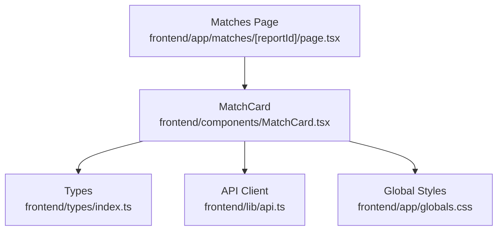
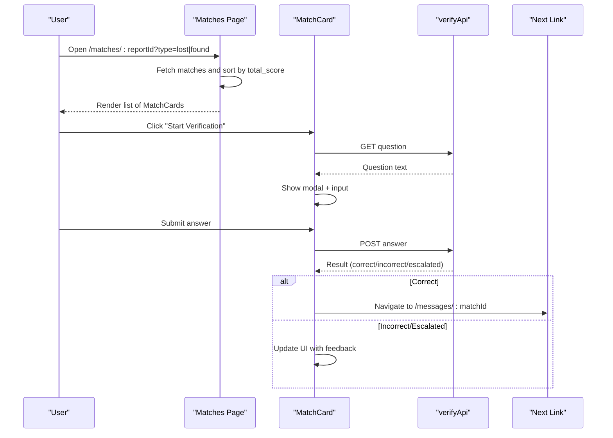
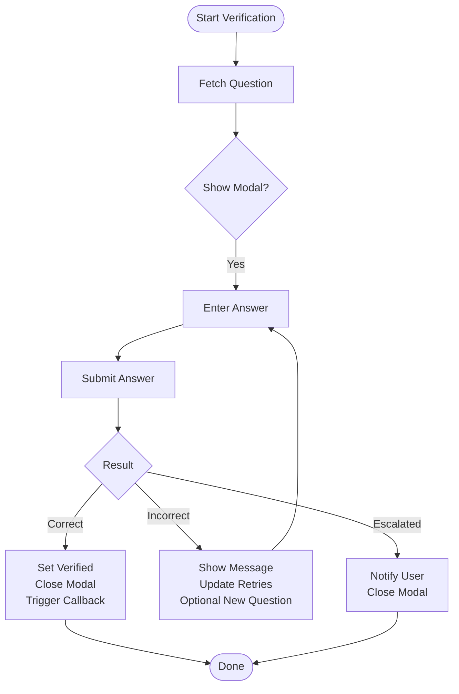

# Match Card Component

<cite>
**Referenced Files in This Document**
- [MatchCard.tsx](file://frontend/components/MatchCard.tsx)
- [index.ts](file://frontend/types/index.ts)
- [api.ts](file://frontend/lib/api.ts)
- [page.tsx](file://frontend/app/matches/[reportId]/page.tsx)
- [globals.css](file://frontend/app/globals.css)
</cite>

## Table of Contents
1. [Introduction](#introduction)
2. [Project Structure](#project-structure)
3. [Core Components](#core-components)
4. [Architecture Overview](#architecture-overview)
5. [Detailed Component Analysis](#detailed-component-analysis)
6. [Dependency Analysis](#dependency-analysis)
7. [Performance Considerations](#performance-considerations)
8. [Troubleshooting Guide](#troubleshooting-guide)
9. [Conclusion](#conclusion)
10. [Appendices](#appendices)

## Introduction
The MatchCard component renders a single match result between a lost item and a found item. It displays the matched item’s details, similarity scores (overall and per-dimension), status indicators, and role-based actions such as verification, messaging, and admin review. The card is responsive, visually communicates match quality through color-coded scores and progress bars, and integrates with navigation flows to open message threads after successful verification.

## Project Structure
The MatchCard lives in the frontend components directory and is consumed by the Matches page. It relies on shared types for data contracts and an API client for verification workflows. Global styles define reusable UI primitives like cards, badges, and buttons used throughout the card.

**Diagram sources**
- [page.tsx:1-94](file://frontend/app/matches/[reportId]/page.tsx#L1-L94)
- [MatchCard.tsx:1-372](file://frontend/components/MatchCard.tsx#L1-L372)
- [index.ts:52-82](file://frontend/types/index.ts#L52-L82)
- [api.ts:241-256](file://frontend/lib/api.ts#L241-L256)
- [globals.css:41-59](file://frontend/app/globals.css#L41-L59)

**Section sources**
- [page.tsx:1-94](file://frontend/app/matches/[reportId]/page.tsx#L1-L94)
- [MatchCard.tsx:1-372](file://frontend/components/MatchCard.tsx#L1-L372)
- [index.ts:52-82](file://frontend/types/index.ts#L52-L82)
- [api.ts:241-256](file://frontend/lib/api.ts#L241-L256)
- [globals.css:41-59](file://frontend/app/globals.css#L41-L59)

## Core Components
- MatchCard: Displays match info, score breakdown, status, and interactive elements based on user role.
- ScoreBar: Internal helper that renders a labeled progress bar for each scoring dimension.
- Time formatter: Converts timestamps into relative human-friendly strings.

Key responsibilities:
- Compute visual score colors based on total_score thresholds.
- Show the “other” item’s details depending on whether the current user is claimant or finder.
- Provide verification flow for claimants and judge flow for finders.
- Render status messages for returned or disputed matches.
- Navigate to message thread upon successful verification.

**Section sources**
- [MatchCard.tsx:10-31](file://frontend/components/MatchCard.tsx#L10-L31)
- [MatchCard.tsx:334-357](file://frontend/components/MatchCard.tsx#L334-L357)
- [MatchCard.tsx:359-372](file://frontend/components/MatchCard.tsx#L359-L372)

## Architecture Overview
The Matches page fetches matches sorted by total_score and renders one MatchCard per match. Each card can initiate verification via the API client and update its state accordingly. After verification succeeds, users are guided to the message thread for that match.

**Diagram sources**
- [page.tsx:21-38](file://frontend/app/matches/[reportId]/page.tsx#L21-L38)
- [MatchCard.tsx:55-101](file://frontend/components/MatchCard.tsx#L55-L101)
- [api.ts:241-256](file://frontend/lib/api.ts#L241-L256)

## Detailed Component Analysis

### Layout and Visual Design
- Header row: Thumbnail image (or placeholder), chips for category/color/brand, description snippet, location, and timestamp; right-aligned overall match percentage with color based on thresholds.
- Score breakdown: Numeric grid showing per-dimension percentages followed by horizontal progress bars for Description, Image, Location, Time, Attributes.
- Status area: Shows “Item returned — match closed”, “Escalated to admin — awaiting review”, or verified state with messaging link.
- Actions: Role-aware controls for verification, judging answers, and messaging.

Responsive behavior:
- Thumbnail scales from smaller to larger sizes on medium screens.
- Action stack adapts from vertical to horizontal on larger screens for verified state.
- Grids and spacing use Tailwind utilities for consistent breakpoints.

Color coding:
- Overall score color and bar background switch among green/yellow/red based on thresholds.
- Badges use semantic classes for info/warning/success variants.

**Section sources**
- [MatchCard.tsx:27-35](file://frontend/components/MatchCard.tsx#L27-L35)
- [MatchCard.tsx:141-200](file://frontend/components/MatchCard.tsx#L141-L200)
- [MatchCard.tsx:202-284](file://frontend/components/MatchCard.tsx#L202-L284)
- [globals.css:41-59](file://frontend/app/globals.css#L41-L59)

### Data Model and Display Mapping
- Match object provides total_score and per-dimension scores, plus joined fields for both lost and found items.
- The card selects the “other” item fields based on userRole:
  - Claimant sees found item details.
  - Finder sees lost item details.
- Timestamps are formatted to relative time strings for readability.

**Section sources**
- [index.ts:52-82](file://frontend/types/index.ts#L52-L82)
- [MatchCard.tsx:37-53](file://frontend/components/MatchCard.tsx#L37-L53)
- [MatchCard.tsx:172-175](file://frontend/components/MatchCard.tsx#L172-L175)
- [MatchCard.tsx:359-372](file://frontend/components/MatchCard.tsx#L359-L372)

### Scoring Visualization
- Overall score displayed prominently with dynamic text color.
- Per-dimension scores shown numerically and as animated progress bars using a shared ScoreBar helper.
- Bar width reflects the percentage value; color derived from total_score thresholds.

Complexity:
- Rendering is O(1) per card; animations rely on CSS transitions.

**Section sources**
- [MatchCard.tsx:178-200](file://frontend/components/MatchCard.tsx#L178-L200)
- [MatchCard.tsx:334-357](file://frontend/components/MatchCard.tsx#L334-L357)

### Interactive Elements and Workflows

#### Verification Flow (Claimant)
- Starts by fetching a verification question.
- Presents a modal with question and answer input.
- Submits answer and handles outcomes:
  - Correct: marks verified, closes modal, triggers callback, navigates to messages.
  - Incorrect: shows feedback, remaining retries, optional new question.
  - Escalated: notifies user and hides modal.

**Diagram sources**
- [MatchCard.tsx:55-101](file://frontend/components/MatchCard.tsx#L55-L101)
- [MatchCard.tsx:287-329](file://frontend/components/MatchCard.tsx#L287-L329)
- [api.ts:241-256](file://frontend/lib/api.ts#L241-L256)

**Section sources**
- [MatchCard.tsx:55-101](file://frontend/components/MatchCard.tsx#L55-L101)
- [MatchCard.tsx:287-329](file://frontend/components/MatchCard.tsx#L287-L329)

#### Judge Flow (Finder)
- When a pending attempt exists, finders can approve or reject the system’s verdict.
- Judging updates state and may trigger verification success or escalation.

**Section sources**
- [MatchCard.tsx:103-136](file://frontend/components/MatchCard.tsx#L103-L136)
- [MatchCard.tsx:257-283](file://frontend/components/MatchCard.tsx#L257-L283)

#### Status Indicators
- Returned: Disables further actions and shows a closed state.
- Disputed: Indicates escalation to admin.
- Verified: Unlocks messaging and shows confirmation.

**Section sources**
- [MatchCard.tsx:138-139](file://frontend/components/MatchCard.tsx#L138-L139)
- [MatchCard.tsx:204-226](file://frontend/components/MatchCard.tsx#L204-L226)

### Integration with Navigation Flows
- After verification success, the card links to the message thread for the match.
- The Matches page passes userRole based on query type (claimant vs finder) and refreshes matches on verification completion.

**Section sources**
- [MatchCard.tsx:220-225](file://frontend/components/MatchCard.tsx#L220-L225)
- [page.tsx:81-88](file://frontend/app/matches/[reportId]/page.tsx#L81-L88)

## Dependency Analysis
- Types: Match interface defines all fields used by the card including scores and joined item attributes.
- API: verifyApi methods handle question retrieval, answer submission, and judgment.
- Styling: Reuses global .card, .badge, .btn-* classes for consistent UI.

Coupling:
- MatchCard depends on the shape of Match and the availability of verifyApi endpoints.
- No direct coupling to backend implementation; only contract via API client.

Potential circular dependencies:
- None observed; component imports types and API client without reverse references.

External integrations:
- Next.js Link for navigation.
- React Hot Toast for notifications.
- Lucide icons for visual cues.

**Section sources**
- [index.ts:52-82](file://frontend/types/index.ts#L52-L82)
- [api.ts:241-256](file://frontend/lib/api.ts#L241-L256)
- [globals.css:41-59](file://frontend/app/globals.css#L41-L59)

## Performance Considerations
- Rendering is lightweight; no heavy computations inside the card.
- Progress bars animate via CSS transitions; avoid excessive re-renders by keeping local state minimal.
- Sorting of matches occurs at the page level to minimize work per card.

[No sources needed since this section provides general guidance]

## Troubleshooting Guide
Common issues and resolutions:
- Failed to load question: Check network connectivity and verify endpoint availability; error is surfaced via toast.
- Submission errors: Ensure answer is non-empty; errors are caught and displayed with toast.
- Pending attempt not found: Judges must have a valid pendingAttemptId before judging; otherwise, an error toast is shown.
- No matches: The parent page will show an empty state; ensure reportId and type are correct.

Error handling patterns:
- Try/catch blocks around API calls with user-facing toast messages.
- Disabled states for buttons during submitting to prevent duplicate requests.

**Section sources**
- [MatchCard.tsx:63-66](file://frontend/components/MatchCard.tsx#L63-L66)
- [MatchCard.tsx:95-98](file://frontend/components/MatchCard.tsx#L95-L98)
- [MatchCard.tsx:103-107](file://frontend/components/MatchCard.tsx#L103-L107)
- [MatchCard.tsx:130-133](file://frontend/components/MatchCard.tsx#L130-L133)

## Conclusion
The MatchCard component provides a comprehensive, role-aware view of match results with clear scoring visualization, status indicators, and actionable workflows. It integrates seamlessly with the Matches page and API layer to support verification and messaging flows while maintaining a responsive and accessible design.

[No sources needed since this section summarizes without analyzing specific files]

## Appendices

### Example States and Variations
- High match score (≥80%): Green text and bar; encourages quick action.
- Medium match score (60–79%): Yellow text and bar; invites verification.
- Low match score (<60%): Red text and bar; may require additional scrutiny.
- Returned: Shows closed state with icon and disables interactions.
- Disputed: Highlights escalation and waits for admin resolution.
- Verified: Confirms access to messaging and unlocks next steps.

[No sources needed since this section describes conceptual variations]