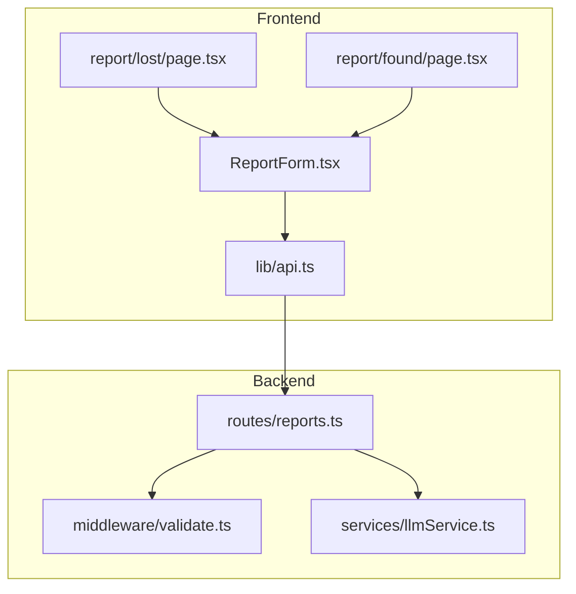
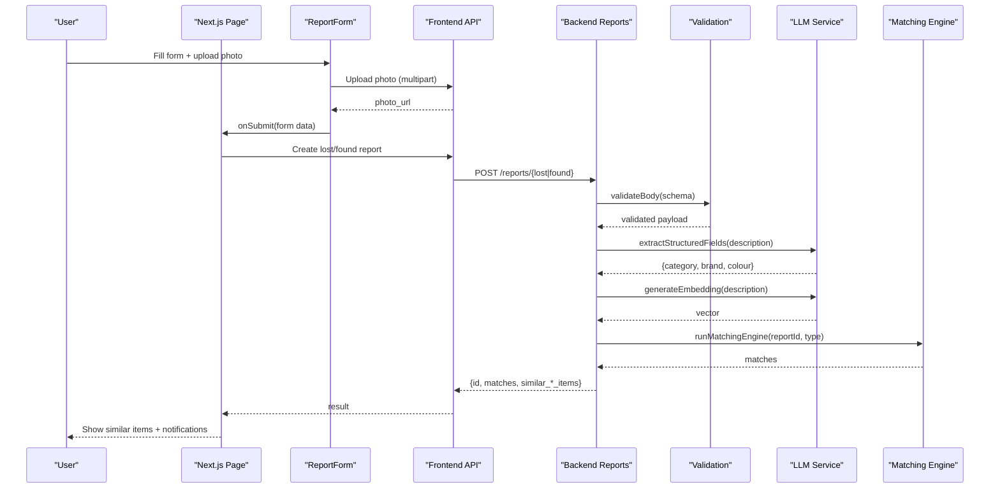
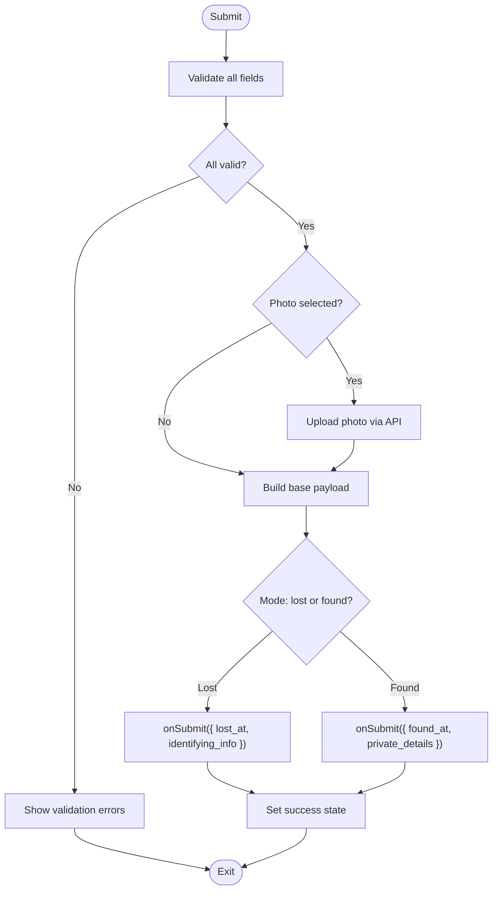
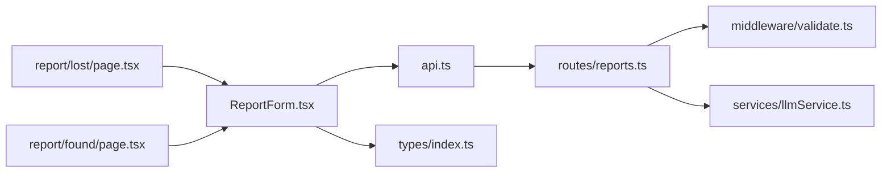

# Report Form Component

<cite>
**Referenced Files in This Document**
- [ReportForm.tsx](file://frontend/components/ReportForm.tsx)
- [page.tsx (Lost)](file://frontend/app/report/lost/page.tsx)
- [page.tsx (Found)](file://frontend/app/report/found/page.tsx)
- [api.ts](file://frontend/lib/api.ts)
- [reports.ts](file://backend/src/routes/reports.ts)
- [validate.ts](file://backend/src/middleware/validate.ts)
- [llmService.ts](file://backend/src/services/llmService.ts)
- [index.ts (types)](file://frontend/types/index.ts)
</cite>

## Table of Contents
1. [Introduction](#introduction)
2. [Project Structure](#project-structure)
3. [Core Components](#core-components)
4. [Architecture Overview](#architecture-overview)
5. [Detailed Component Analysis](#detailed-component-analysis)
6. [Dependency Analysis](#dependency-analysis)
7. [Performance Considerations](#performance-considerations)
8. [Troubleshooting Guide](#troubleshooting-guide)
9. [Conclusion](#conclusion)
10. [Appendices](#appendices)

## Introduction
This document provides comprehensive documentation for the ReportForm component used to create lost and found item reports. It explains the form structure, field validation, image upload handling, structured data extraction via LLM, form state management, error handling, submission workflow, customization options, styling patterns, backend API integration, multi-language support (English, Tamil, Sinhala), responsive design, accessibility features, and differences between lost vs found modes.

## Project Structure
The ReportForm is a client-side React component embedded within Next.js pages for reporting lost or found items. It integrates with frontend APIs and backend routes that handle uploads, validation, LLM-based enrichment, embedding generation, and matching.

**Diagram sources**
- [ReportForm.tsx:1-640](file://frontend/components/ReportForm.tsx#L1-L640)
- [page.tsx (Lost):1-117](file://frontend/app/report/lost/page.tsx#L1-L117)
- [page.tsx (Found):1-59](file://frontend/app/report/found/page.tsx#L1-L59)
- [api.ts:1-423](file://frontend/lib/api.ts#L1-L423)
- [reports.ts:1-356](file://backend/src/routes/reports.ts#L1-L356)
- [validate.ts:1-61](file://backend/src/middleware/validate.ts#L1-L61)
- [llmService.ts:1-120](file://backend/src/services/llmService.ts#L1-L120)

**Section sources**
- [ReportForm.tsx:1-640](file://frontend/components/ReportForm.tsx#L1-L640)
- [page.tsx (Lost):1-117](file://frontend/app/report/lost/page.tsx#L1-L117)
- [page.tsx (Found):1-59](file://frontend/app/report/found/page.tsx#L1-L59)
- [api.ts:1-423](file://frontend/lib/api.ts#L1-L423)
- [reports.ts:1-356](file://backend/src/routes/reports.ts#L1-L356)
- [validate.ts:1-61](file://backend/src/middleware/validate.ts#L1-L61)
- [llmService.ts:1-120](file://backend/src/services/llmService.ts#L1-L120)

## Core Components
- ReportForm: A reusable, mode-aware form supporting “lost” and “found” submissions with localized UI, validation, photo upload, and success feedback.
- Pages:
  - Lost page orchestrates submission, shows instant similar found items, and triggers background full matching.
  - Found page orchestrates submission and runs matching immediately, then navigates based on results.
- API layer: Centralized HTTP client with typed endpoints for report creation, photo upload, and matching runs.
- Backend routes: Handle authentication, validation, LLM-based enrichment, embeddings, storage, and matching.

Key responsibilities:
- Client-side validation and UX states (loading, success, errors).
- Photo upload flow with size/type checks and preview.
- Mode-specific fields (identifying info for lost; private details for found).
- Multi-language labels and messages.
- Integration with backend for structured data extraction and similarity search.

**Section sources**
- [ReportForm.tsx:168-351](file://frontend/components/ReportForm.tsx#L168-L351)
- [page.tsx (Lost):22-63](file://frontend/app/report/lost/page.tsx#L22-L63)
- [page.tsx (Found):9-46](file://frontend/app/report/found/page.tsx#L9-L46)
- [api.ts:143-161](file://frontend/lib/api.ts#L143-L161)
- [reports.ts:98-171](file://backend/src/routes/reports.ts#L98-L171)
- [reports.ts:176-247](file://backend/src/routes/reports.ts#L176-L247)

## Architecture Overview
End-to-end flow from user interaction to backend processing and AI-driven matching.

**Diagram sources**
- [ReportForm.tsx:299-351](file://frontend/components/ReportForm.tsx#L299-L351)
- [api.ts:143-161](file://frontend/lib/api.ts#L143-L161)
- [reports.ts:98-171](file://backend/src/routes/reports.ts#L98-L171)
- [reports.ts:176-247](file://backend/src/routes/reports.ts#L176-L247)
- [validate.ts:27-51](file://backend/src/middleware/validate.ts#L27-L51)
- [llmService.ts:9-17](file://backend/src/services/llmService.ts#L9-L17)
- [llmService.ts:47-79](file://backend/src/services/llmService.ts#L47-L79)

## Detailed Component Analysis

### ReportForm Component
- Modes:
  - Lost: includes identifying info field; submits lost_at timestamp.
  - Found: includes private_details key/value pair; submits found_at timestamp.
- Fields:
  - Category, Brand, Colour (selects from predefined lists).
  - Description (free text, minimum length).
  - Location (required).
  - Date & Time (datetime-local).
  - Photo (optional, validated type and size).
- Validation:
  - Required fields enforced on blur and submit.
  - Minimum description length enforced.
  - Private details must be provided as a pair (key and value) or both empty.
  - Photo must be an image and under a size limit.
- State Management:
  - Local state for all inputs, touched flags, errors, loading, and success.
  - Language preference synced from user store.
- Submission Workflow:
  - Validates all fields before submission.
  - Uploads photo if present, then calls parent onSubmit with normalized payload.
  - Displays success state and allows resetting the form.
- Accessibility:
  - Labels associated with inputs.
  - aria-label for photo change button.
  - Keyboard-friendly controls and focus styles via Tailwind classes.
- Styling:
  - Responsive layout using Tailwind utility classes.
  - Error states highlighted with red borders and inline messages.
  - Success view with animated icon and call-to-action.

**Diagram sources**
- [ReportForm.tsx:201-245](file://frontend/components/ReportForm.tsx#L201-L245)
- [ReportForm.tsx:252-280](file://frontend/components/ReportForm.tsx#L252-L280)
- [ReportForm.tsx:299-351](file://frontend/components/ReportForm.tsx#L299-L351)

**Section sources**
- [ReportForm.tsx:168-351](file://frontend/components/ReportForm.tsx#L168-L351)
- [ReportForm.tsx:353-639](file://frontend/components/ReportForm.tsx#L353-L639)

### Lost Item Page
- Ensures user is authenticated before submission.
- Submits via reportsApi.createLost.
- Shows instant similar found items returned by backend.
- Triggers full matching engine asynchronously and updates match count.
- Provides navigation to matches page and option to report another item.

**Section sources**
- [page.tsx (Lost):22-63](file://frontend/app/report/lost/page.tsx#L22-L63)
- [page.tsx (Lost):65-117](file://frontend/app/report/lost/page.tsx#L65-L117)

### Found Item Page
- Ensures user is authenticated before submission.
- Submits via reportsApi.createFound.
- Runs matching immediately and navigates to matches if any are found.
- Provides user feedback via toast notifications.

**Section sources**
- [page.tsx (Found):9-46](file://frontend/app/report/found/page.tsx#L9-L46)
- [page.tsx (Found):48-59](file://frontend/app/report/found/page.tsx#L48-L59)

### Frontend API Layer
- Centralized fetch wrapper with automatic Authorization header resolution.
- Typed endpoints for:
  - Photo upload returning a URL.
  - Creating lost and found reports.
  - Running matching engine and retrieving matches.
- Error handling converts non-ok responses into thrown Errors with messages.

**Section sources**
- [api.ts:1-52](file://frontend/lib/api.ts#L1-L52)
- [api.ts:143-161](file://frontend/lib/api.ts#L143-L161)
- [api.ts:210-218](file://frontend/lib/api.ts#L210-L218)

### Backend Routes and Processing
- Authentication middleware protects report routes.
- Validation middleware enforces schemas for lost and found reports.
- LLM integration:
  - Extracts structured fields (category, brand, colour) from free-text descriptions when long enough.
  - Generates embeddings for semantic similarity search.
- Storage:
  - Upload route processes and stores images, returns public URLs.
- Matching:
  - Runs matching engine asynchronously for both lost and found submissions.
  - Returns immediate similar items based on embeddings.
- Privacy:
  - Hides private_details and identifying_info from non-owners in read endpoints.

**Section sources**
- [reports.ts:13-14](file://backend/src/routes/reports.ts#L13-L14)
- [reports.ts:21-33](file://backend/src/routes/reports.ts#L21-L33)
- [reports.ts:98-171](file://backend/src/routes/reports.ts#L98-L171)
- [reports.ts:176-247](file://backend/src/routes/reports.ts#L176-L247)
- [reports.ts:286-317](file://backend/src/routes/reports.ts#L286-L317)
- [reports.ts:322-356](file://backend/src/routes/reports.ts#L322-L356)

### Validation Schemas
- Joi schemas enforce required fields, types, and constraints for lost and found reports.
- Ensures consistent payloads reach business logic and database.

**Section sources**
- [validate.ts:27-51](file://backend/src/middleware/validate.ts#L27-L51)

### LLM Services
- Embeddings:
  - Generates high-dimensional vectors for descriptions to enable semantic search.
- Structured Extraction:
  - Parses category, brand, and colour from free-text descriptions using a constrained JSON response format.
- Image Similarity:
  - Compares two images to compute a similarity score used in matching.

**Section sources**
- [llmService.ts:9-17](file://backend/src/services/llmService.ts#L9-L17)
- [llmService.ts:47-79](file://backend/src/services/llmService.ts#L47-L79)
- [llmService.ts:85-119](file://backend/src/services/llmService.ts#L85-L119)

### Types and Constants
- Defines core entities, forms, statuses, and constants for categories, colours, and brands used across the UI.

**Section sources**
- [index.ts (types):1-197](file://frontend/types/index.ts#L1-L197)

## Dependency Analysis
- ReportForm depends on:
  - Frontend API for uploads and report creation.
  - Types for categories, brands, and colours.
  - Auth store for user language preference.
- Pages depend on:
  - ReportForm for UI and validation.
  - API for creating reports and running matches.
- Backend routes depend on:
  - Validation middleware for schema enforcement.
  - LLM service for enrichment and embeddings.
  - Matching engine for finding related items.

**Diagram sources**
- [ReportForm.tsx:1-640](file://frontend/components/ReportForm.tsx#L1-L640)
- [api.ts:1-423](file://frontend/lib/api.ts#L1-L423)
- [reports.ts:1-356](file://backend/src/routes/reports.ts#L1-L356)
- [validate.ts:1-61](file://backend/src/middleware/validate.ts#L1-L61)
- [llmService.ts:1-120](file://backend/src/services/llmService.ts#L1-L120)
- [index.ts (types):1-197](file://frontend/types/index.ts#L1-L197)

**Section sources**
- [ReportForm.tsx:1-640](file://frontend/components/ReportForm.tsx#L1-L640)
- [api.ts:1-423](file://frontend/lib/api.ts#L1-L423)
- [reports.ts:1-356](file://backend/src/routes/reports.ts#L1-L356)
- [validate.ts:1-61](file://backend/src/middleware/validate.ts#L1-L61)
- [llmService.ts:1-120](file://backend/src/services/llmService.ts#L1-L120)
- [index.ts (types):1-197](file://frontend/types/index.ts#L1-L197)

## Performance Considerations
- Client-side validation reduces unnecessary network requests.
- Photo upload uses multipart/form-data to avoid large JSON payloads.
- Backend performs LLM enrichment only when description exceeds a threshold to minimize cost.
- Embedding generation and matching are non-blocking where possible to keep submission fast.
- Immediate similar item search uses embeddings for quick feedback; full matching runs in background.

[No sources needed since this section provides general guidance]

## Troubleshooting Guide
Common issues and resolutions:
- Validation failures:
  - Ensure required fields (category, description, location, date/time) are filled.
  - For found items, provide both private detail key and value together.
- Photo upload errors:
  - Verify file type is an image and size is under the allowed limit.
  - Check network connectivity and backend upload endpoint availability.
- Submission errors:
  - Confirm user is authenticated; unauthenticated users are redirected to login.
  - Review toast messages for server-side validation or API errors.
- Matching not appearing:
  - Full matching may fail silently; check matches page later or retry.
  - Embedding search might not return results if indexes are still building.

**Section sources**
- [ReportForm.tsx:201-245](file://frontend/components/ReportForm.tsx#L201-L245)
- [ReportForm.tsx:252-280](file://frontend/components/ReportForm.tsx#L252-L280)
- [page.tsx (Lost):30-63](file://frontend/app/report/lost/page.tsx#L30-L63)
- [page.tsx (Found):13-46](file://frontend/app/report/found/page.tsx#L13-L46)
- [api.ts:18-52](file://frontend/lib/api.ts#L18-L52)
- [reports.ts:98-171](file://backend/src/routes/reports.ts#L98-L171)
- [reports.ts:176-247](file://backend/src/routes/reports.ts#L176-L247)

## Conclusion
The ReportForm component provides a robust, accessible, and localized interface for reporting lost and found items. It integrates seamlessly with backend services for validation, LLM-based enrichment, embeddings, and matching. The component supports responsive design, clear error handling, and mode-specific workflows to guide users effectively through the submission process.

[No sources needed since this section summarizes without analyzing specific files]

## Appendices

### Field Validation Rules
- Category: required.
- Description: required, minimum length enforced.
- Location: required.
- Date & Time: required.
- Private Details (found mode): must be provided as a key-value pair or both empty.
- Photo: optional; must be an image and under size limit.

**Section sources**
- [ReportForm.tsx:201-245](file://frontend/components/ReportForm.tsx#L201-L245)
- [validate.ts:27-51](file://backend/src/middleware/validate.ts#L27-L51)

### Multi-Language Support
- Supported languages: English, Tamil, Sinhala.
- Language toggle available in the form header; defaults to user’s preferred language.
- All labels, placeholders, hints, and error messages are localized.

**Section sources**
- [ReportForm.tsx:40-167](file://frontend/components/ReportForm.tsx#L40-L167)
- [ReportForm.tsx:171-199](file://frontend/components/ReportForm.tsx#L171-L199)

### Customization Options
- Categories, colours, and brands are defined centrally and can be extended.
- Form behavior can be customized by adjusting validation rules and UI strings.
- Styling uses Tailwind utilities; theme colors and components can be adapted globally.

**Section sources**
- [index.ts (types):156-197](file://frontend/types/index.ts#L156-L197)
- [ReportForm.tsx:474-531](file://frontend/components/ReportForm.tsx#L474-L531)

### Integration with Backend API
- Photo upload endpoint returns a URL used in report submission.
- Lost and found endpoints accept normalized payloads and return matches and similar items.
- Matching engine runs asynchronously to improve responsiveness.

**Section sources**
- [api.ts:143-161](file://frontend/lib/api.ts#L143-L161)
- [reports.ts:98-171](file://backend/src/routes/reports.ts#L98-L171)
- [reports.ts:176-247](file://backend/src/routes/reports.ts#L176-L247)

### User Interaction Patterns
- Real-time validation on blur and submit.
- Inline error messages with icons.
- Loading indicators during submission.
- Success screen with option to reset and report another item.
- Toast notifications for errors and match results.

**Section sources**
- [ReportForm.tsx:247-250](file://frontend/components/ReportForm.tsx#L247-L250)
- [ReportForm.tsx:353-366](file://frontend/components/ReportForm.tsx#L353-L366)
- [ReportForm.tsx:619-639](file://frontend/components/ReportForm.tsx#L619-L639)
- [page.tsx (Lost):30-63](file://frontend/app/report/lost/page.tsx#L30-L63)
- [page.tsx (Found):13-46](file://frontend/app/report/found/page.tsx#L13-L46)