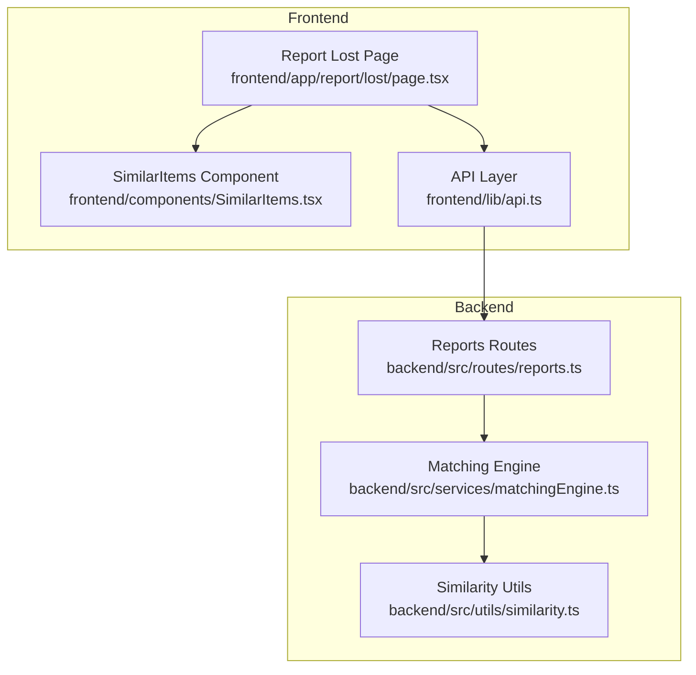
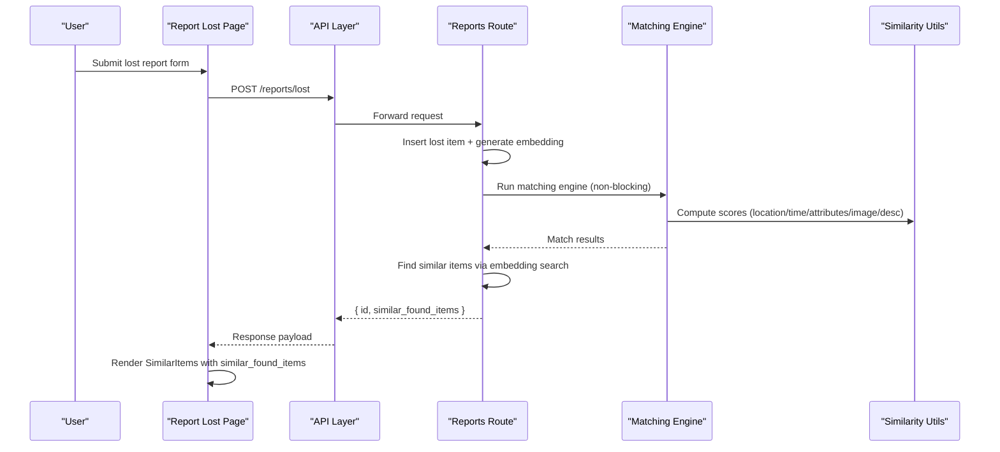
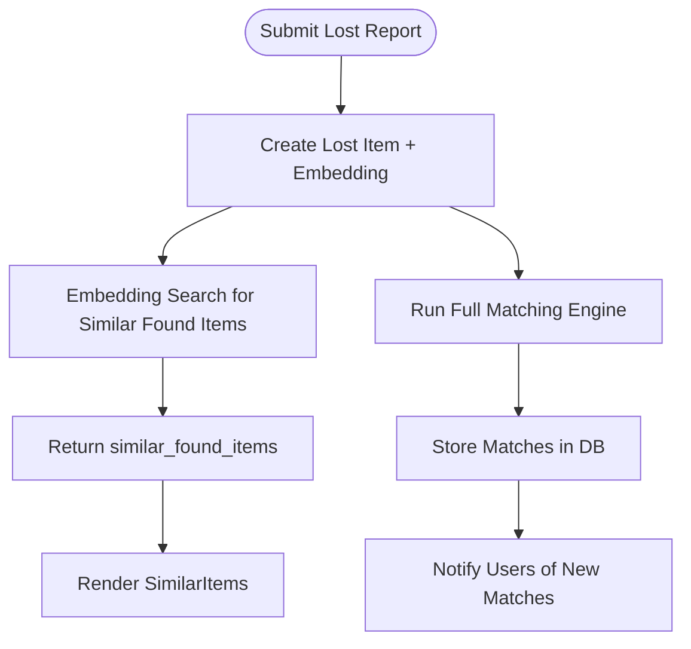
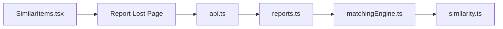

# Similar Items Component

<cite>
**Referenced Files in This Document**
- [SimilarItems.tsx](file://frontend/components/SimilarItems.tsx)
- [api.ts](file://frontend/lib/api.ts)
- [page.tsx (Report Lost)](file://frontend/app/report/lost/page.tsx)
- [page.tsx (Matches)](file://frontend/app/matches/[reportId]/page.tsx)
- [reports.ts](file://backend/src/routes/reports.ts)
- [matchingEngine.ts](file://backend/src/services/matchingEngine.ts)
- [similarity.ts](file://backend/src/utils/similarity.ts)
</cite>

## Table of Contents
1. Introduction
2. Project Structure
3. Core Components
4. Architecture Overview
5. Detailed Component Analysis
6. Dependency Analysis
7. Performance Considerations
8. Troubleshooting Guide
9. Conclusion

## Introduction
This document explains the SimilarItems component and how it displays related items with similarity scoring visualization and comparison features. It covers data structures, rendering logic, user interactions, integration with the matching system, responsive layout, loading states, and empty state handling.

## Project Structure
The SimilarItems component is a small, presentational React component used on the “Report a Lost Item” success screen to show immediate similar found items returned by the backend. It receives an array of items and a label that determines the section title (“Similar Found Items” vs “Similar Lost Items”).

**Diagram sources**
- [page.tsx (Report Lost):1-117](file://frontend/app/report/lost/page.tsx#L1-L117)
- [SimilarItems.tsx:1-80](file://frontend/components/SimilarItems.tsx#L1-L80)
- [api.ts:106-136](file://frontend/lib/api.ts#L106-L136)
- [reports.ts:95-171](file://backend/src/routes/reports.ts#L95-L171)
- [matchingEngine.ts:37-189](file://backend/src/services/matchingEngine.ts#L37-L189)
- [similarity.ts:1-83](file://backend/src/utils/similarity.ts#L1-L83)

**Section sources**
- [page.tsx (Report Lost):1-117](file://frontend/app/report/lost/page.tsx#L1-L117)
- [SimilarItems.tsx:1-80](file://frontend/components/SimilarItems.tsx#L1-L80)
- [api.ts:106-136](file://frontend/lib/api.ts#L106-L136)
- [reports.ts:95-171](file://backend/src/routes/reports.ts#L95-L171)

## Core Components
- SimilarItems component: Renders a list of similar items with photo, details, and a similarity score badge. It hides itself when there are no items.
- Report Lost page: Submits a lost report, then renders SimilarItems with the immediately returned similar found items. It also triggers background full matching and shows actions to view all matches or return to dashboard.

Key responsibilities:
- Display item photo or placeholder
- Show category, brand, colour, description, location
- Visualize similarity score with color-coded badge
- Provide contextual heading based on label

**Section sources**
- [SimilarItems.tsx:1-80](file://frontend/components/SimilarItems.tsx#L1-L80)
- [page.tsx (Report Lost):1-117](file://frontend/app/report/lost/page.tsx#L1-L117)

## Architecture Overview
End-to-end flow from submission to display of similar items:

**Diagram sources**
- [page.tsx (Report Lost):30-63](file://frontend/app/report/lost/page.tsx#L30-L63)
- [api.ts:151-155](file://frontend/lib/api.ts#L151-L155)
- [reports.ts:95-171](file://backend/src/routes/reports.ts#L95-L171)
- [matchingEngine.ts:37-189](file://backend/src/services/matchingEngine.ts#L37-L189)
- [similarity.ts:1-83](file://backend/src/utils/similarity.ts#L1-L83)

## Detailed Component Analysis

### Data Model for Similar Items
- The component expects an array of objects with fields: id, category, brand, colour, description, location, photo_url, similarity_score.
- These match the response shape returned by the backend’s embedding-based similarity search for immediate feedback after submission.

Notes:
- Brand and colour may be null; photo_url may be null.
- similarity_score is a number representing percentage-like confidence.

**Section sources**
- [SimilarItems.tsx:3-17](file://frontend/components/SimilarItems.tsx#L3-L17)
- [api.ts:106-115](file://frontend/lib/api.ts#L106-L115)

### Rendering Logic and UI Behavior
- If the items array is empty, the component returns null (no visible output).
- For each item:
  - Photo: displayed if available; otherwise a placeholder box with “No photo”.
  - Details: category capitalized, optional brand and colour appended, truncated description and location.
  - Score badge: color-coded by thresholds (green for high, yellow for medium, gray for low), showing the percentage and a small “match” label.

Responsive behavior:
- Uses a grid container with gap spacing.
- Each row uses flexbox to align image, details, and score badge.
- Truncation prevents overflow on smaller screens.

Empty state:
- The component itself hides when there are no items.
- The parent page provides its own empty message when no similar items are returned.

**Section sources**
- [SimilarItems.tsx:19-79](file://frontend/components/SimilarItems.tsx#L19-L79)
- [page.tsx (Report Lost):72-83](file://frontend/app/report/lost/page.tsx#L72-L83)

### Similarity Scoring Visualization
- The badge colors reflect three tiers:
  - High similarity: green badge
  - Medium similarity: yellow badge
  - Low similarity: gray badge
- The exact thresholds are applied within the component to choose the class names.

Note:
- The visual thresholds are client-side only; actual scoring is computed on the backend using multiple signals (description embeddings, image similarity, location proximity, time proximity, attributes).

**Section sources**
- [SimilarItems.tsx:59-73](file://frontend/components/SimilarItems.tsx#L59-L73)
- [matchingEngine.ts:84-132](file://backend/src/services/matchingEngine.ts#L84-L132)
- [similarity.ts:22-82](file://backend/src/utils/similarity.ts#L22-L82)

### Integration with Matching System
- On submitting a lost report, the backend:
  - Inserts the item and generates a description embedding.
  - Runs the full matching engine asynchronously.
  - Performs an immediate embedding-based similarity search to return top similar found items.
- The frontend renders these immediate results in SimilarItems while the full match scan runs in the background.

**Diagram sources**
- [reports.ts:95-171](file://backend/src/routes/reports.ts#L95-L171)
- [matchingEngine.ts:37-189](file://backend/src/services/matchingEngine.ts#L37-L189)

**Section sources**
- [page.tsx (Report Lost):30-63](file://frontend/app/report/lost/page.tsx#L30-L63)
- [reports.ts:95-171](file://backend/src/routes/reports.ts#L95-L171)
- [matchingEngine.ts:37-189](file://backend/src/services/matchingEngine.ts#L37-L189)

### User Interaction Patterns
- After submission:
  - SimilarItems appears instantly with any similar found items found via embedding search.
  - A toast notifies the user about the count of similar items.
  - A background call triggers the full matching engine; if more matches are found later, users can navigate to the matches page.
- Actions:
  - View All Matches button appears when the full scan completes with matches.
  - Back to Dashboard and Report Another buttons reset state and navigate accordingly.

**Section sources**
- [page.tsx (Report Lost):30-63](file://frontend/app/report/lost/page.tsx#L30-L63)
- [page.tsx (Report Lost):72-111](file://frontend/app/report/lost/page.tsx#L72-L111)

### Filtering Options
- The SimilarItems component does not implement filtering.
- Filtering would need to be added at the parent level (e.g., filter by category or threshold) before passing items to the component.

[No sources needed since this section describes absence of functionality]

### Responsive Layout
- Grid layout with consistent gaps.
- Flexbox rows ensure alignment across screen sizes.
- Text truncation and fixed-size images maintain readability on narrow screens.

**Section sources**
- [SimilarItems.tsx:22-77](file://frontend/components/SimilarItems.tsx#L22-L77)

### Loading States and Empty State Handling
- SimilarItems returns null when there are no items (no spinner inside the component).
- Parent pages handle their own loading states:
  - Report Lost page shows the form initially, then switches to results view after submission.
  - Matches page shows a spinner while fetching matches and an empty state when none exist.

**Section sources**
- [SimilarItems.tsx:19-20](file://frontend/components/SimilarItems.tsx#L19-L20)
- [page.tsx (Report Lost):72-83](file://frontend/app/report/lost/page.tsx#L72-L83)
- [page.tsx (Matches):18-51](file://frontend/app/matches/[reportId]/page.tsx#L18-L51)

## Dependency Analysis
- Frontend dependencies:
  - SimilarItems depends on props (items, label) provided by the Report Lost page.
  - Report Lost page depends on API layer to create reports and trigger matching.
- Backend dependencies:
  - Reports routes depend on matching engine and similarity utilities to compute scores and find similar items.
  - Matching engine composes multiple similarity functions to produce total scores.

**Diagram sources**
- [SimilarItems.tsx:1-80](file://frontend/components/SimilarItems.tsx#L1-L80)
- [page.tsx (Report Lost):1-117](file://frontend/app/report/lost/page.tsx#L1-L117)
- [api.ts:106-136](file://frontend/lib/api.ts#L106-L136)
- [reports.ts:95-171](file://backend/src/routes/reports.ts#L95-L171)
- [matchingEngine.ts:37-189](file://backend/src/services/matchingEngine.ts#L37-L189)
- [similarity.ts:1-83](file://backend/src/utils/similarity.ts#L1-L83)

**Section sources**
- [SimilarItems.tsx:1-80](file://frontend/components/SimilarItems.tsx#L1-L80)
- [page.tsx (Report Lost):1-117](file://frontend/app/report/lost/page.tsx#L1-L117)
- [api.ts:106-136](file://frontend/lib/api.ts#L106-L136)
- [reports.ts:95-171](file://backend/src/routes/reports.ts#L95-L171)
- [matchingEngine.ts:37-189](file://backend/src/services/matchingEngine.ts#L37-L189)
- [similarity.ts:1-83](file://backend/src/utils/similarity.ts#L1-L83)

## Performance Considerations
- SimilarItems is lightweight and renders only what is passed to it.
- Avoid large arrays; consider pagination or virtualization if many similar items are returned.
- Image optimization: ensure photo URLs are optimized and use appropriate sizing to reduce load times.
- Debounce or limit re-renders if additional filters are added later.

[No sources needed since this section provides general guidance]

## Troubleshooting Guide
Common issues and resolutions:
- No similar items shown:
  - Verify the items array is non-empty before rendering.
  - Check backend embedding search and matching engine logs for failures.
- Incorrect score colors:
  - Confirm similarity_score values are numbers and within expected ranges.
- Images not displaying:
  - Ensure photo_url is valid and accessible; fallback placeholder will appear otherwise.
- Network errors:
  - Inspect API responses and error messages thrown by the API layer.

**Section sources**
- [SimilarItems.tsx:19-79](file://frontend/components/SimilarItems.tsx#L19-L79)
- [api.ts:18-35](file://frontend/lib/api.ts#L18-L35)
- [reports.ts:95-171](file://backend/src/routes/reports.ts#L95-L171)

## Conclusion
The SimilarItems component provides a concise, responsive way to visualize immediate similar items with clear similarity scoring. It integrates tightly with the backend’s embedding search and matching pipeline, offering instant feedback while full matching runs in the background. Its simple prop interface makes it easy to reuse and extend with additional filtering or sorting as needed.