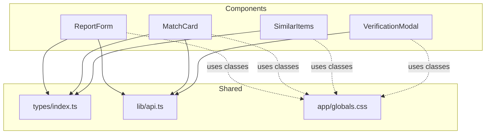
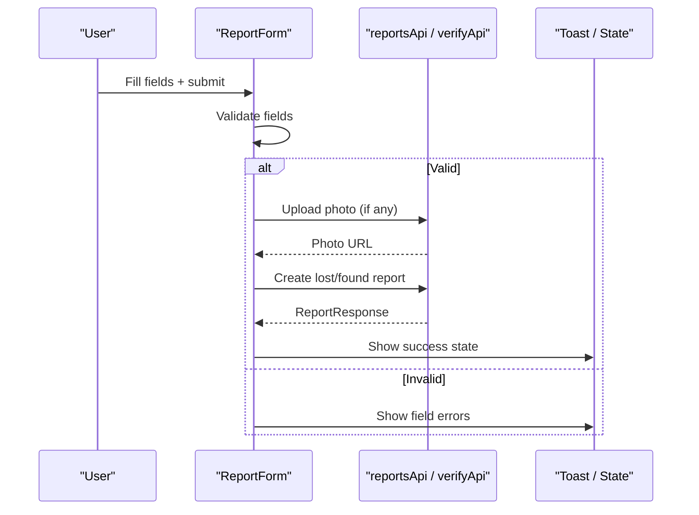
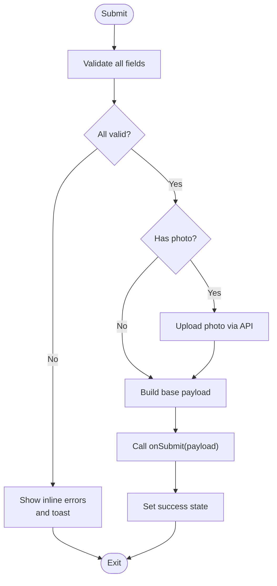
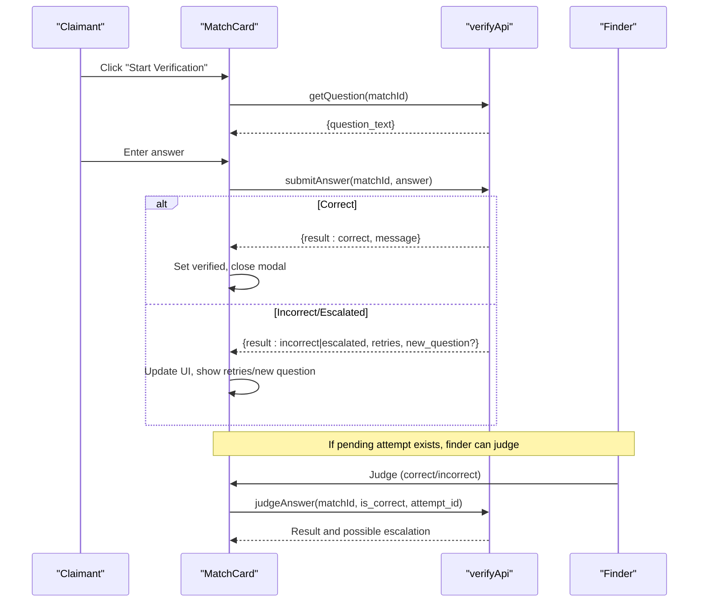
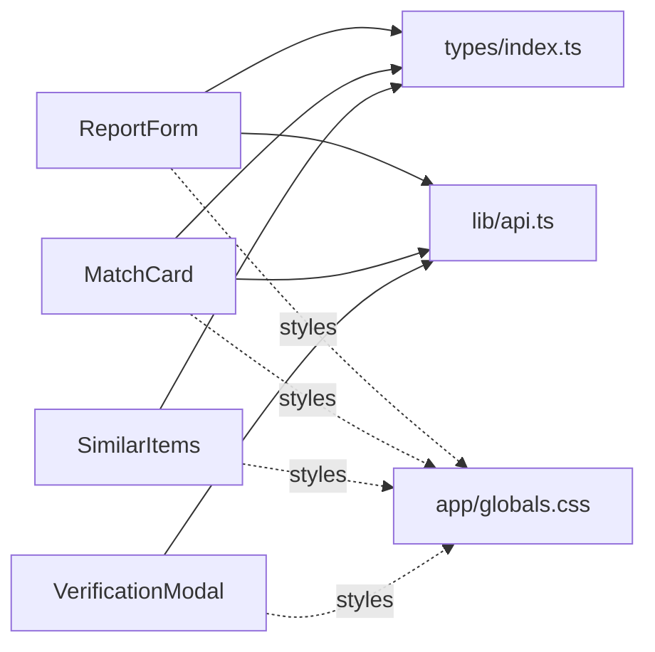

# UI Components Library

<cite>
**Referenced Files in This Document**
- [ReportForm.tsx](file://frontend/components/ReportForm.tsx)
- [MatchCard.tsx](file://frontend/components/MatchCard.tsx)
- [SimilarItems.tsx](file://frontend/components/SimilarItems.tsx)
- [VerificationModal.tsx](file://frontend/components/VerificationModal.tsx)
- [types/index.ts](file://frontend/types/index.ts)
- [api.ts](file://frontend/lib/api.ts)
- [globals.css](file://frontend/app/globals.css)
- [Navbar.tsx](file://frontend/components/Navbar.tsx)
</cite>

## Table of Contents
1. [Introduction](#introduction)
2. [Project Structure](#project-structure)
3. [Core Components](#core-components)
4. [Architecture Overview](#architecture-overview)
5. [Detailed Component Analysis](#detailed-component-analysis)
6. [Dependency Analysis](#dependency-analysis)
7. [Performance Considerations](#performance-considerations)
8. [Troubleshooting Guide](#troubleshooting-guide)
9. [Conclusion](#conclusion)
10. [Appendices](#appendices)

## Introduction
This document provides comprehensive documentation for the custom UI component library used in the Lost & Found AI Matcher application. It focuses on four reusable components: ReportForm (item reporting), MatchCard (match display and verification workflow), SimilarItems (related items display), and VerificationModal (ownership verification). For each component, we detail props, events, styling options, usage patterns, composition hierarchy, shared styles, responsive behavior, accessibility features, keyboard navigation, screen reader support, form validation patterns, error handling, and user feedback mechanisms.

## Project Structure
The UI components live under frontend/components and consume shared types from frontend/types and API clients from frontend/lib. Global styles and Tailwind utility classes are defined in frontend/app/globals.css. The Navbar demonstrates shared UI patterns and navigation but is not part of this component library scope.

**Diagram sources**
- [ReportForm.tsx:1-640](file://frontend/components/ReportForm.tsx#L1-L640)
- [MatchCard.tsx:1-372](file://frontend/components/MatchCard.tsx#L1-L372)
- [SimilarItems.tsx:1-80](file://frontend/components/SimilarItems.tsx#L1-L80)
- [VerificationModal.tsx:1-177](file://frontend/components/VerificationModal.tsx#L1-L177)
- [types/index.ts:1-197](file://frontend/types/index.ts#L1-L197)
- [api.ts:1-423](file://frontend/lib/api.ts#L1-L423)
- [globals.css:1-61](file://frontend/app/globals.css#L1-L61)

**Section sources**
- [ReportForm.tsx:1-640](file://frontend/components/ReportForm.tsx#L1-L640)
- [MatchCard.tsx:1-372](file://frontend/components/MatchCard.tsx#L1-L372)
- [SimilarItems.tsx:1-80](file://frontend/components/SimilarItems.tsx#L1-L80)
- [VerificationModal.tsx:1-177](file://frontend/components/VerificationModal.tsx#L1-L177)
- [types/index.ts:1-197](file://frontend/types/index.ts#L1-L197)
- [api.ts:1-423](file://frontend/lib/api.ts#L1-L423)
- [globals.css:1-61](file://frontend/app/globals.css#L1-L61)

## Core Components
- ReportForm: A multi-field form for reporting lost or found items with image upload, validation, localization, and success state.
- MatchCard: Displays a matched item pair with score breakdown and supports an inline verification flow for claimants and judges.
- SimilarItems: Renders a list of similar items with photo, description, location, and similarity score badges.
- VerificationModal: A focused modal that loads a verification question, accepts answers, and reports success or errors.

Key shared assets:
- Types define entities like Match, report forms, categories, colors, brands.
- API client exposes endpoints for reports, matches, verification, notifications, messages, and admin operations.
- Global CSS defines reusable button, input, card, and badge classes.

**Section sources**
- [ReportForm.tsx:26-39](file://frontend/components/ReportForm.tsx#L26-L39)
- [MatchCard.tsx:10-15](file://frontend/components/MatchCard.tsx#L10-L15)
- [SimilarItems.tsx:3-17](file://frontend/components/SimilarItems.tsx#L3-L17)
- [VerificationModal.tsx:8-20](file://frontend/components/VerificationModal.tsx#L8-L20)
- [types/index.ts:14-82](file://frontend/types/index.ts#L14-L82)
- [api.ts:143-256](file://frontend/lib/api.ts#L143-L256)
- [globals.css:16-60](file://frontend/app/globals.css#L16-L60)

## Architecture Overview
The components follow a unidirectional data flow:
- User interactions trigger local state updates and validations.
- Data is sent to backend via api.ts modules (reportsApi, verifyApi).
- Responses update UI state and show feedback via toast notifications.
- Shared types ensure consistent contracts across components and API layers.
- Global CSS provides consistent visual primitives (buttons, inputs, cards, badges).

**Diagram sources**
- [ReportForm.tsx:299-351](file://frontend/components/ReportForm.tsx#L299-L351)
- [api.ts:143-161](file://frontend/lib/api.ts#L143-L161)

**Section sources**
- [ReportForm.tsx:299-351](file://frontend/components/ReportForm.tsx#L299-L351)
- [api.ts:143-161](file://frontend/lib/api.ts#L143-L161)

## Detailed Component Analysis

### ReportForm
Purpose:
- Collects item details for lost or found reports, including optional photo upload, category, brand, color, description, location, date/time, and private verification details for found items.

Props:
- type: 'lost' | 'found' — controls labels, fields, and submission payload.
- onSubmit: Async callback receiving normalized form data; must handle success/error at page level.

State and Behavior:
- Localized language selection (en, ta, si) synced with user preference.
- Field-level validation on blur and on submit; shows inline errors.
- Image upload with size/type checks and preview; uploads via reportsApi.uploadPhoto.
- Submission builds base data and adds either lost_at or found_at; includes identifying_info for lost and private_details for found.
- Success state renders confirmation and reset option.

Validation Rules:
- Category required.
- Description required and minimum length.
- Location required.
- Date/time required.
- Private field key/value must be provided together or both empty.

Error Handling and Feedback:
- Inline error messages per field after touch.
- Toast notifications for general submission errors and validation failures.
- Loading spinner disables inputs during submission.

Accessibility:
- Labels associated with inputs.
- aria-label on close button for photo preview.
- Keyboard accessible form controls and buttons.

Styling and Responsiveness:
- Uses global .card, .input-field, .btn-primary classes.
- Responsive grid layouts for category/brand/color row and private details.
- Mobile-friendly spacing and typography scaling.

Usage Pattern:
- Wrap in a page that handles onSubmit to create the report and navigate or show results.
- Reset form by calling reset logic exposed by parent if needed.

**Section sources**
- [ReportForm.tsx:26-39](file://frontend/components/ReportForm.tsx#L26-L39)
- [ReportForm.tsx:171-199](file://frontend/components/ReportForm.tsx#L171-L199)
- [ReportForm.tsx:201-245](file://frontend/components/ReportForm.tsx#L201-L245)
- [ReportForm.tsx:252-280](file://frontend/components/ReportForm.tsx#L252-L280)
- [ReportForm.tsx:299-351](file://frontend/components/ReportForm.tsx#L299-L351)
- [ReportForm.tsx:353-366](file://frontend/components/ReportForm.tsx#L353-L366)
- [ReportForm.tsx:367-380](file://frontend/components/ReportForm.tsx#L367-L380)
- [ReportForm.tsx:382-638](file://frontend/components/ReportForm.tsx#L382-L638)
- [api.ts:143-161](file://frontend/lib/api.ts#L143-L161)
- [globals.css:16-60](file://frontend/app/globals.css#L16-L60)

#### ReportForm Validation Flow

**Diagram sources**
- [ReportForm.tsx:228-245](file://frontend/components/ReportForm.tsx#L228-L245)
- [ReportForm.tsx:299-351](file://frontend/components/ReportForm.tsx#L299-L351)

### MatchCard
Purpose:
- Displays a match between a lost and found item with score breakdown and actions based on user role (claimant, finder, admin). Supports inline verification for claimants and judgment for finders.

Props:
- match: Match object containing scores, statuses, and joined fields for both sides.
- userRole: 'claimant' | 'finder' | 'admin' — determines available actions.
- onClaim?: Callback invoked when starting verification.
- onVerified?: Callback invoked when verification succeeds.

Behavior:
- Computes color coding for total score thresholds.
- Selects “other item” details depending on role.
- Starts verification by fetching a question via verifyApi.getQuestion.
- Submits answer via verifyApi.submitAnswer; handles correct, incorrect, escalated, and new question flows.
- Finder can judge pending answers via verifyApi.judgeAnswer.
- Shows status indicators for returned, disputed, verified states.

Accessibility:
- Images include alt text derived from category.
- Buttons are keyboard accessible; disabled states reflect loading and validity.

Styling and Responsiveness:
- Uses global .card, .badge, .btn-primary, .btn-secondary, .btn-danger classes.
- Score bars and grids adapt to small screens.

Usage Pattern:
- Render within a list of matches; manage verification state locally or lift up as needed.
- Use onClaim/onVerified to coordinate with parent state (e.g., refresh matches).

**Section sources**
- [MatchCard.tsx:10-15](file://frontend/components/MatchCard.tsx#L10-L15)
- [MatchCard.tsx:17-26](file://frontend/components/MatchCard.tsx#L17-L26)
- [MatchCard.tsx:55-101](file://frontend/components/MatchCard.tsx#L55-L101)
- [MatchCard.tsx:103-136](file://frontend/components/MatchCard.tsx#L103-L136)
- [MatchCard.tsx:141-331](file://frontend/components/MatchCard.tsx#L141-L331)
- [api.ts:241-256](file://frontend/lib/api.ts#L241-L256)
- [globals.css:16-60](file://frontend/app/globals.css#L16-L60)

#### MatchCard Verification Sequence

**Diagram sources**
- [MatchCard.tsx:55-101](file://frontend/components/MatchCard.tsx#L55-L101)
- [MatchCard.tsx:103-136](file://frontend/components/MatchCard.tsx#L103-L136)
- [api.ts:241-256](file://frontend/lib/api.ts#L241-L256)

### SimilarItems
Purpose:
- Renders a list of similar items with thumbnail, summary, location, and similarity score badge.

Props:
- items: Array of SimilarItem objects with id, category, brand, colour, description, location, photo_url, similarity_score.
- label: 'lost' | 'found' — changes header text accordingly.

Behavior:
- Returns null when no items to avoid empty sections.
- Displays fallback placeholder when photo is missing.
- Color-codes similarity score badge based on thresholds.

Accessibility:
- Images include alt text using category.
- Semantic headings and lists for structure.

Styling and Responsiveness:
- Uses global card-like borders and spacing; relies on Tailwind utilities.

Usage Pattern:
- Embed below report results or match details to suggest related items.

**Section sources**
- [SimilarItems.tsx:3-17](file://frontend/components/SimilarItems.tsx#L3-L17)
- [SimilarItems.tsx:19-79](file://frontend/components/SimilarItems.tsx#L19-L79)

### VerificationModal
Purpose:
- Provides a focused modal experience for ownership verification: load question, accept answer, and show success or error states.

Props:
- matchId: Identifier for the match being verified.
- isOpen: Boolean controlling visibility.
- onClose: Callback to close the modal and reset state.
- onSubmitted: Callback invoked on successful submission.

Behavior:
- On open, fetches the verification question via verifyApi.getQuestion.
- Handles submitting answers via verifyApi.submitAnswer.
- Manages internal state machine: loading, ready, submitting, success, error.
- Resets state when closed or reopened.

Accessibility:
- Modal has a descriptive heading and aria-label on close button.
- Input is labeled and focusable; submit button disabled until answer provided.

Styling and Responsiveness:
- Uses global .btn-primary class and Tailwind utilities for layout and spacing.

Usage Pattern:
- Controlled by parent state; call onSubmitted to perform side effects (e.g., refresh matches).

**Section sources**
- [VerificationModal.tsx:8-20](file://frontend/components/VerificationModal.tsx#L8-L20)
- [VerificationModal.tsx:22-51](file://frontend/components/VerificationModal.tsx#L22-L51)
- [VerificationModal.tsx:53-73](file://frontend/components/VerificationModal.tsx#L53-L73)
- [VerificationModal.tsx:75-176](file://frontend/components/VerificationModal.tsx#L75-L176)
- [api.ts:241-256](file://frontend/lib/api.ts#L241-L256)

## Dependency Analysis
Components depend on:
- Types for consistent data contracts (Match, report forms, constants).
- API client for network requests (reportsApi, verifyApi).
- Global CSS for consistent UI primitives.

**Diagram sources**
- [ReportForm.tsx:1-640](file://frontend/components/ReportForm.tsx#L1-L640)
- [MatchCard.tsx:1-372](file://frontend/components/MatchCard.tsx#L1-L372)
- [SimilarItems.tsx:1-80](file://frontend/components/SimilarItems.tsx#L1-L80)
- [VerificationModal.tsx:1-177](file://frontend/components/VerificationModal.tsx#L1-L177)
- [types/index.ts:1-197](file://frontend/types/index.ts#L1-L197)
- [api.ts:1-423](file://frontend/lib/api.ts#L1-L423)
- [globals.css:1-61](file://frontend/app/globals.css#L1-L61)

**Section sources**
- [types/index.ts:14-82](file://frontend/types/index.ts#L14-L82)
- [api.ts:143-256](file://frontend/lib/api.ts#L143-L256)
- [globals.css:16-60](file://frontend/app/globals.css#L16-L60)

## Performance Considerations
- Avoid unnecessary re-renders by keeping localized translations and constants outside components where appropriate.
- Debounce or throttle frequent state updates if integrating with external services beyond current scope.
- Use conditional rendering to skip heavy computations when items arrays are empty.
- Ensure images have proper alt attributes and sizes to improve perceived performance and accessibility.

[No sources needed since this section provides general guidance]

## Troubleshooting Guide
Common issues and resolutions:
- Form validation errors: Ensure required fields are filled and meet constraints; check touched state and error rendering.
- Photo upload failures: Verify file type and size limits; inspect toast messages for specific errors.
- Verification question load failure: Check network connectivity and API availability; modal will show error state with close action.
- Answer submission errors: Inspect toast messages; retry after correcting input; consider escalating if prompted.
- Role-based actions not visible: Confirm userRole prop is correctly set; verify match status affects available actions.

**Section sources**
- [ReportForm.tsx:201-245](file://frontend/components/ReportForm.tsx#L201-L245)
- [ReportForm.tsx:252-280](file://frontend/components/ReportForm.tsx#L252-L280)
- [ReportForm.tsx:299-351](file://frontend/components/ReportForm.tsx#L299-L351)
- [VerificationModal.tsx:22-51](file://frontend/components/VerificationModal.tsx#L22-L51)
- [VerificationModal.tsx:53-73](file://frontend/components/VerificationModal.tsx#L53-L73)

## Conclusion
The UI component library provides robust, accessible, and responsive building blocks for reporting items, displaying matches, suggesting similar items, and verifying ownership. Each component encapsulates its own state and integrates cleanly with shared types and API clients. Consistent styling via global CSS ensures a cohesive user experience across the application.

[No sources needed since this section summarizes without analyzing specific files]

## Appendices

### Shared Styles Reference
- Buttons: primary, secondary, danger with consistent focus rings and disabled states.
- Inputs: standardized padding, border, focus ring, and placeholder styling.
- Cards: white background, rounded corners, subtle shadow, and border.
- Badges: small, colored labels for status and categories.

**Section sources**
- [globals.css:16-60](file://frontend/app/globals.css#L16-L60)

### Type Contracts Summary
- Entities: User, LostItem, FoundItem, Match, Message, Notification.
- Forms: LostReportForm, FoundReportForm.
- Constants: CATEGORIES, COLOURS, BRANDS.

**Section sources**
- [types/index.ts:3-152](file://frontend/types/index.ts#L3-L152)
- [types/index.ts:156-197](file://frontend/types/index.ts#L156-L197)

### API Client Highlights
- Reports: uploadPhoto, createLost, createFound, getById, getByUser.
- Matches: run, getByReport.
- Verification: getQuestion, submitAnswer, judgeAnswer.
- Notifications: getAll, markRead, markAllRead, getUnreadCount.
- Messages: getThread, send.
- Admin: stats, matches, approve/reject, update status, disputed, flag/unflag.

**Section sources**
- [api.ts:143-256](file://frontend/lib/api.ts#L143-L256)
- [api.ts:277-423](file://frontend/lib/api.ts#L277-L423)