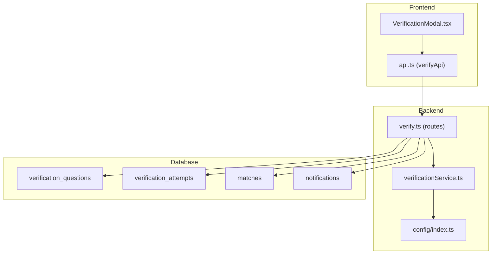
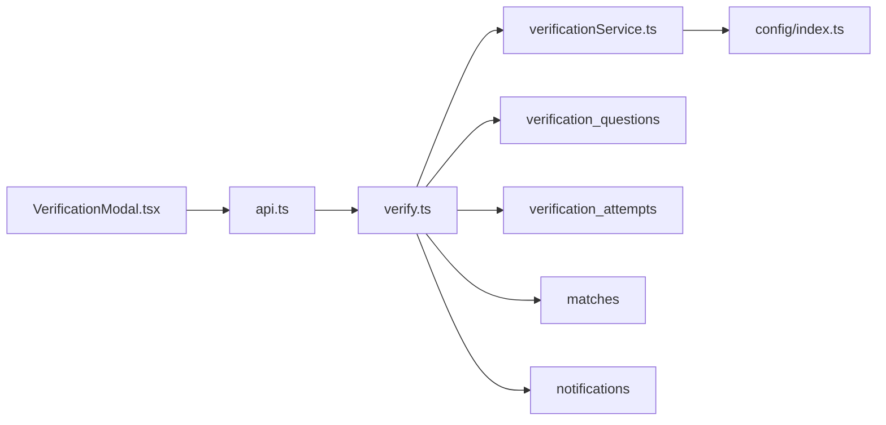

# Verification Modal Component

<cite>
**Referenced Files in This Document**
- [VerificationModal.tsx](file://frontend/components/VerificationModal.tsx)
- [api.ts](file://frontend/lib/api.ts)
- [index.ts](file://backend/src/config/index.ts)
- [verify.ts](file://backend/src/routes/verify.ts)
- [verificationService.ts](file://backend/src/services/verificationService.ts)
- [001_initial_schema.sql](file://supabase/migrations/001_initial_schema.sql)
</cite>

## Table of Contents
1. [Introduction](#introduction)
2. [Project Structure](#project-structure)
3. [Core Components](#core-components)
4. [Architecture Overview](#architecture-overview)
5. [Detailed Component Analysis](#detailed-component-analysis)
6. [Dependency Analysis](#dependency-analysis)
7. [Performance Considerations](#performance-considerations)
8. [Troubleshooting Guide](#troubleshooting-guide)
9. [Conclusion](#conclusion)

## Introduction
This document provides comprehensive documentation for the VerificationModal component and its end-to-end integration with the backend verification service. It explains how ownership verification works: generating a question from private details, collecting an answer, validating it using semantic matching, handling retries and escalation, and updating match status accordingly. It also covers modal lifecycle, state management, error handling, accessibility, mobile responsiveness, and keyboard navigation.

## Project Structure
The verification flow spans frontend and backend layers:
- Frontend: A React client modal that fetches questions, collects answers, and displays feedback.
- Backend: Express routes that enforce authorization, orchestrate question generation and answer validation, manage attempts and retries, and update match/item statuses.
- Database: Tables for matches, verification questions, and verification attempts, plus notifications to inform both parties.



**Diagram sources**
- [VerificationModal.tsx:1-177](file://frontend/components/VerificationModal.tsx#L1-L177)
- [api.ts:241-256](file://frontend/lib/api.ts#L241-L256)
- [verify.ts:20-79](file://backend/src/routes/verify.ts#L20-L79)
- [verificationService.ts:15-79](file://backend/src/services/verificationService.ts#L15-L79)
- [001_initial_schema.sql:169-199](file://supabase/migrations/001_initial_schema.sql#L169-L199)

**Section sources**
- [VerificationModal.tsx:1-177](file://frontend/components/VerificationModal.tsx#L1-L177)
- [api.ts:241-256](file://frontend/lib/api.ts#L241-L256)
- [verify.ts:20-79](file://backend/src/routes/verify.ts#L20-L79)
- [verificationService.ts:15-79](file://backend/src/services/verificationService.ts#L15-L79)
- [001_initial_schema.sql:169-199](file://supabase/migrations/001_initial_schema.sql#L169-L199)

## Core Components
- VerificationModal (React): Manages modal visibility, loading states, question display, answer input, submission, success/error feedback, and cleanup on close.
- verifyApi (frontend): Thin HTTP client for /verify endpoints: getQuestion, submitAnswer, judgeAnswer.
- verify routes (backend): Enforce permissions, retrieve or generate questions, validate answers, handle retries and escalation, update statuses, and send notifications.
- verificationService (backend): Generates natural-sounding questions via LLM and validates answers using exact match, then LLM-based semantic comparison, with fallback logic.

Key responsibilities:
- UI state machine: loading → ready → submitting → success/error
- Data fetching: GET /verify/:matchId/question
- Submission: POST /verify/:matchId/answer
- Feedback: inline messages, toast errors, and callback onSubmitted

**Section sources**
- [VerificationModal.tsx:15-75](file://frontend/components/VerificationModal.tsx#L15-L75)
- [api.ts:220-256](file://frontend/lib/api.ts#L220-L256)
- [verify.ts:20-79](file://backend/src/routes/verify.ts#L20-L79)
- [verificationService.ts:15-123](file://backend/src/services/verificationService.ts#L15-L123)

## Architecture Overview
End-to-end flow when a claimant verifies ownership:

```mermaid
sequenceDiagram
participant U as "User"
participant VM as "VerificationModal"
participant API as "verifyApi"
participant R as "verify routes"
participant S as "verificationService"
participant DB as "Database"
U->>VM : Open modal
VM->>API : GET /verify/{matchId}/question
API->>R : Request
R->>DB : Fetch match + private details
alt No unanswered question
R->>S : Generate question (LLM)
S-->>R : {id, question_text}
R->>DB : Insert verification_question
else Existing unanswered question
R->>DB : Return existing question
end
R-->>API : {question_id, question_text}
API-->>VM : Question
VM->>U : Display question + input
U->>VM : Submit answer
VM->>API : POST /verify/{matchId}/answer {answer}
API->>R : Request
R->>S : verifyAnswer(answer, correct_answer)
S-->>R : isCorrect (exact or LLM semantic)
R->>DB : Record attempt
alt Correct
R->>DB : Update matches.status = approved; items verified
R->>DB : Create notifications
R-->>API : {result : correct, message}
API-->>VM : Success
VM->>U : Show success + call onSubmitted()
else Incorrect
R->>DB : Check maxRetries
alt Retries remain
R->>S : Generate new question (exclude used fields)
R->>DB : Store new question
R-->>API : {result : incorrect, retries_remaining, new_question?}
API-->>VM : Error state with retry info
VM->>U : Show error + allow retry
else Max retries reached
R->>DB : Set matches.status = disputed
R->>DB : Create notifications
R-->>API : {result : escalated}
API-->>VM : Escalation error
VM->>U : Show escalation message
end
end
```

**Diagram sources**
- [verify.ts:20-79](file://backend/src/routes/verify.ts#L20-L79)
- [verify.ts:89-294](file://backend/src/routes/verify.ts#L89-L294)
- [verificationService.ts:15-123](file://backend/src/services/verificationService.ts#L15-L123)
- [api.ts:241-256](file://frontend/lib/api.ts#L241-L256)
- [VerificationModal.tsx:26-68](file://frontend/components/VerificationModal.tsx#L26-L68)

## Detailed Component Analysis

### VerificationModal Lifecycle and State Management
- Visibility control: Renders only when isOpen is true; resets state and clears answer on close.
- Loading phase: On open, sets loading state and fetches the question via verifyApi.getQuestion.
- Ready phase: Displays the question text and an input field for the answer.
- Submitting phase: Disables input/button during submission; shows spinner.
- Success phase: Shows confirmation message and invokes onSubmitted to notify parent.
- Error phase: Displays error message and allows closing; also surfaces toast errors for network/API issues.

State transitions:
- loading → ready | error
- ready → submitting → success | error
- submitting → success | error

Accessibility considerations:
- Uses aria-label on close button.
- Input has htmlFor label association.
- Focus management: Ensure focus moves to the input when question loads (recommended enhancement).
- Keyboard support: Enter submits form; Escape closes modal (recommended enhancement).

Mobile responsiveness:
- Modal uses responsive classes for width and padding; suitable for small screens.

Keyboard navigation:
- Form submission via Enter key.
- Close via button click; consider adding Escape key handler for better UX.

Error handling:
- Catches API errors and converts them to user-friendly messages.
- Toast notifications for submission failures.

Integration points:
- verifyApi.getQuestion and verifyApi.submitAnswer.
- Parent callbacks: onClose and onSubmitted.

**Section sources**
- [VerificationModal.tsx:15-75](file://frontend/components/VerificationModal.tsx#L15-L75)
- [VerificationModal.tsx:77-177](file://frontend/components/VerificationModal.tsx#L77-L177)
- [api.ts:241-256](file://frontend/lib/api.ts#L241-L256)

### Backend Verification Service
Question generation:
- Retrieves private_details from found item.
- Selects a random field not previously used to avoid repetition.
- Uses LLM to craft a natural question; falls back to a template if needed.
- Persists question with correct_answer and field_source.

Answer validation:
- Exact match first (case-insensitive, trimmed).
- If no exact match, uses LLM for semantic comparison.
- Falls back to substring inclusion check if LLM fails.

Configuration:
- maxRetries controls maximum attempts before escalation to admin.

**Section sources**
- [verificationService.ts:15-79](file://backend/src/services/verificationService.ts#L15-L79)
- [verificationService.ts:85-123](file://backend/src/services/verificationService.ts#L85-L123)
- [index.ts:33-47](file://backend/src/config/index.ts#L33-L47)

### Backend Routes and Workflow
GET /verify/:matchId/question:
- Authorizes request (claimant or admin).
- Returns existing unanswered question or generates a new one.
- Never exposes correct_answer.

POST /verify/:matchId/answer:
- Validates body and authorizes claimant/admin.
- Records attempt and auto-verifies answer.
- On correct: approves match, marks items verified, sends notifications.
- On incorrect: checks retries; either escalates to admin or generates a new question and notifies parties.

POST /verify/:matchId/judge:
- Finder override endpoint to mark attempts correct/incorrect.
- Updates statuses and notifications accordingly.

Notifications:
- Notifies claimant and finder about verification outcomes and escalations.

**Section sources**
- [verify.ts:20-79](file://backend/src/routes/verify.ts#L20-L79)
- [verify.ts:89-294](file://backend/src/routes/verify.ts#L89-L294)
- [verify.ts:303-443](file://backend/src/routes/verify.ts#L303-L443)

### Database Schema for Verification
Tables involved:
- verification_questions: Stores generated questions, correct answers, and source fields per match.
- verification_attempts: Tracks each answer attempt, correctness, and who judged it.
- matches: Status transitions between pending, approved, rejected, disputed.
- notifications: In-app messages for users about verification events.

Indexes:
- Optimized queries on match_id for questions and attempts.

**Section sources**
- [001_initial_schema.sql:169-199](file://supabase/migrations/001_initial_schema.sql#L169-L199)
- [001_initial_schema.sql:204-221](file://supabase/migrations/001_initial_schema.sql#L204-L221)
- [001_initial_schema.sql:256-258](file://supabase/migrations/001_initial_schema.sql#L256-L258)

## Dependency Analysis
Component relationships:
- VerificationModal depends on verifyApi for network calls.
- verifyApi abstracts HTTP requests and handles auth headers.
- verify routes depend on verificationService for LLM-based question generation and answer validation.
- verificationService depends on configuration for OpenAI credentials and matching settings.
- All data persistence occurs via database tables defined in migrations.



**Diagram sources**
- [VerificationModal.tsx:1-177](file://frontend/components/VerificationModal.tsx#L1-L177)
- [api.ts:241-256](file://frontend/lib/api.ts#L241-L256)
- [verify.ts:20-79](file://backend/src/routes/verify.ts#L20-L79)
- [verificationService.ts:15-123](file://backend/src/services/verificationService.ts#L15-L123)
- [index.ts:33-47](file://backend/src/config/index.ts#L33-L47)
- [001_initial_schema.sql:169-199](file://supabase/migrations/001_initial_schema.sql#L169-L199)

**Section sources**
- [VerificationModal.tsx:1-177](file://frontend/components/VerificationModal.tsx#L1-L177)
- [api.ts:241-256](file://frontend/lib/api.ts#L241-L256)
- [verify.ts:20-79](file://backend/src/routes/verify.ts#L20-L79)
- [verificationService.ts:15-123](file://backend/src/services/verificationService.ts#L15-L123)
- [index.ts:33-47](file://backend/src/config/index.ts#L33-L47)
- [001_initial_schema.sql:169-199](file://supabase/migrations/001_initial_schema.sql#L169-L199)

## Performance Considerations
- LLM usage: Both question generation and answer validation use OpenAI models; ensure rate limits and costs are monitored.
- Retry strategy: maxRetries prevents excessive LLM calls by limiting attempts; after reaching limit, escalation avoids further cost.
- Database queries: Indexed columns on match_id improve performance for retrieving questions and attempts.
- Frontend state: Minimal re-renders due to controlled state; disable inputs during submission to prevent redundant requests.

[No sources needed since this section provides general guidance]

## Troubleshooting Guide
Common issues and resolutions:
- Failed to load verification question:
  - Cause: Network error or unauthorized access.
  - Resolution: Verify authentication token and permissions; check server logs for 404/403 responses.
- Failed to submit answer:
  - Cause: Validation error or server error.
  - Resolution: Inspect toast message; ensure answer is non-empty; check backend logs for schema validation failures.
- Maximum attempts reached:
  - Cause: Exceeded maxRetries configured in backend.
  - Resolution: Case escalates to admin; guide user to contact support or await admin review.
- Incorrect answer but retries available:
  - Behavior: Backend generates a new question excluding previously used fields; user can retry.
  - Guidance: Encourage careful reading of the question and precise answers.

Operational tips:
- Monitor OpenAI API availability; fallback logic exists but may degrade accuracy.
- Review notifications table for audit trail of verification events.
- Use admin endpoints to resolve disputes when escalation occurs.

**Section sources**
- [verify.ts:89-294](file://backend/src/routes/verify.ts#L89-L294)
- [verificationService.ts:85-123](file://backend/src/services/verificationService.ts#L85-L123)
- [index.ts:33-47](file://backend/src/config/index.ts#L33-L47)

## Conclusion
The VerificationModal provides a robust, accessible, and user-friendly interface for ownership verification. It integrates seamlessly with backend services that leverage LLMs for question generation and semantic answer validation. The system enforces security through authorization checks, manages retries and escalation, and keeps both parties informed via notifications. With thoughtful state management and clear feedback patterns, it supports a smooth verification workflow across devices and user scenarios.

[No sources needed since this section summarizes without analyzing specific files]