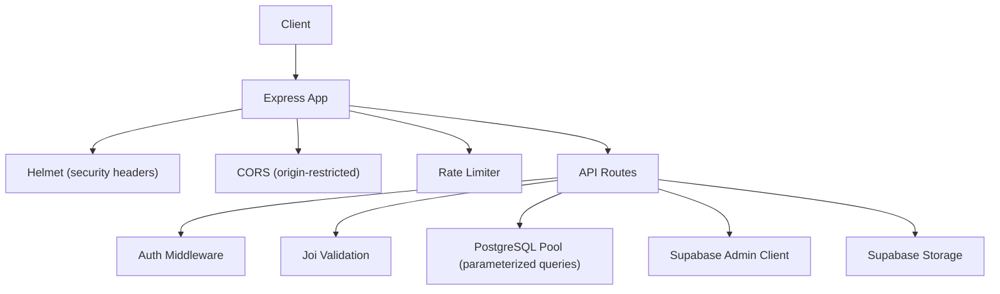
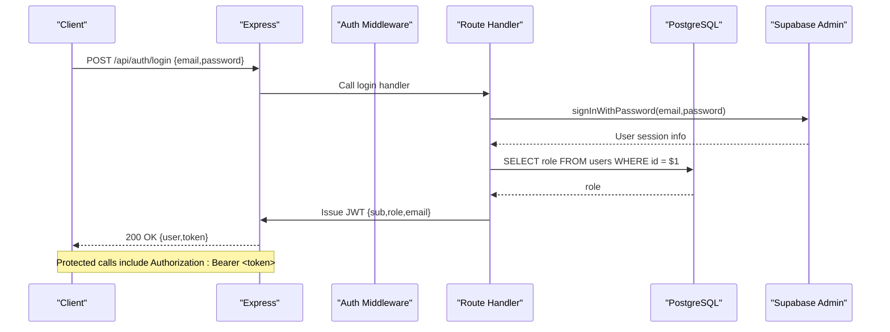
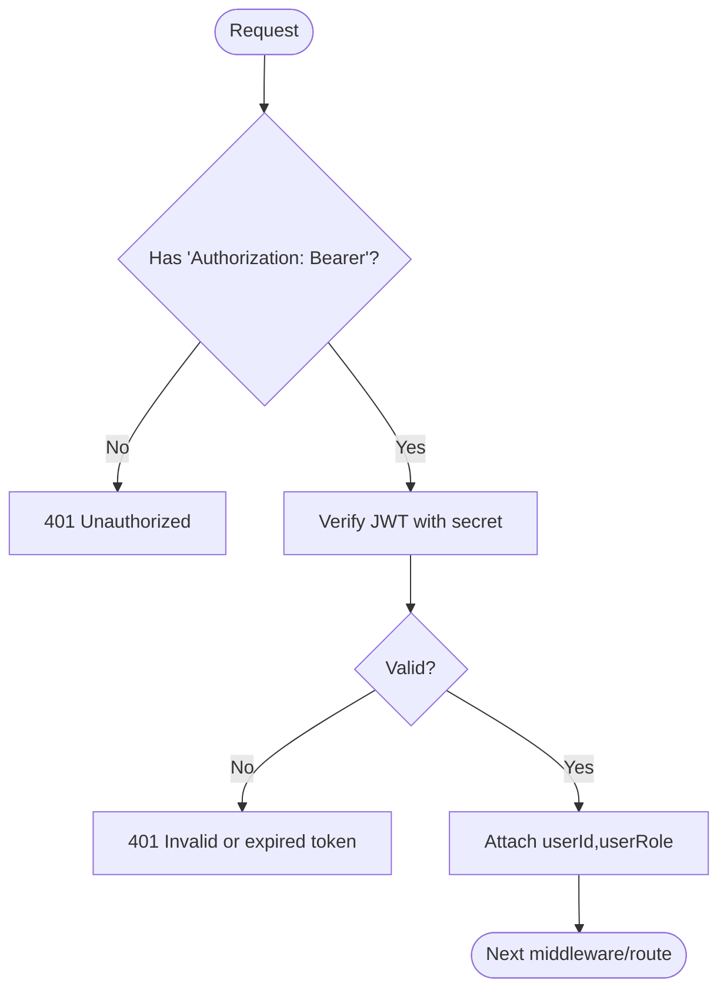
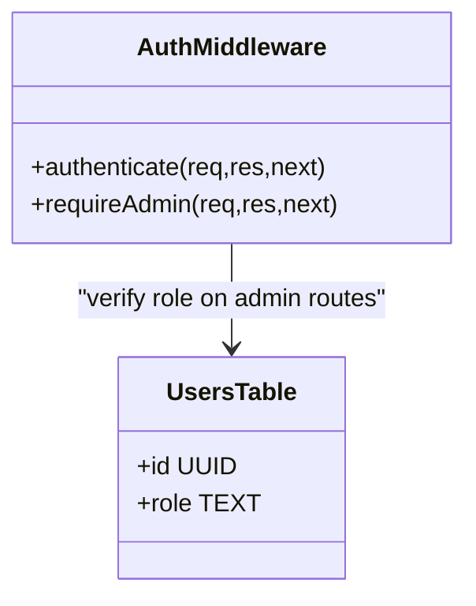
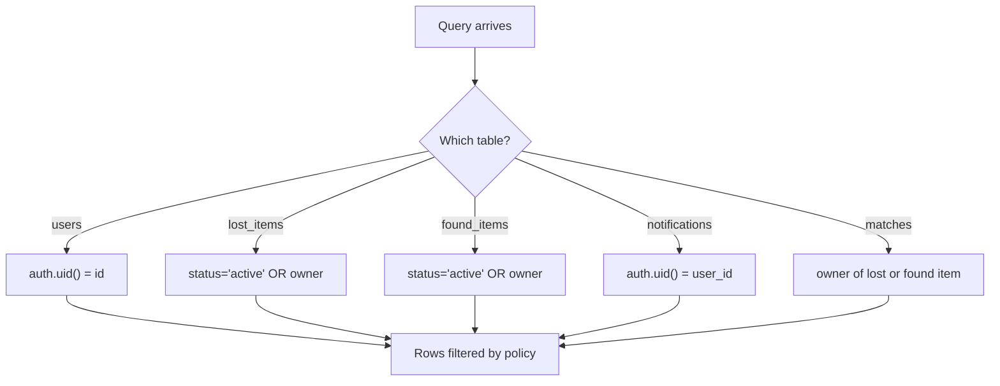
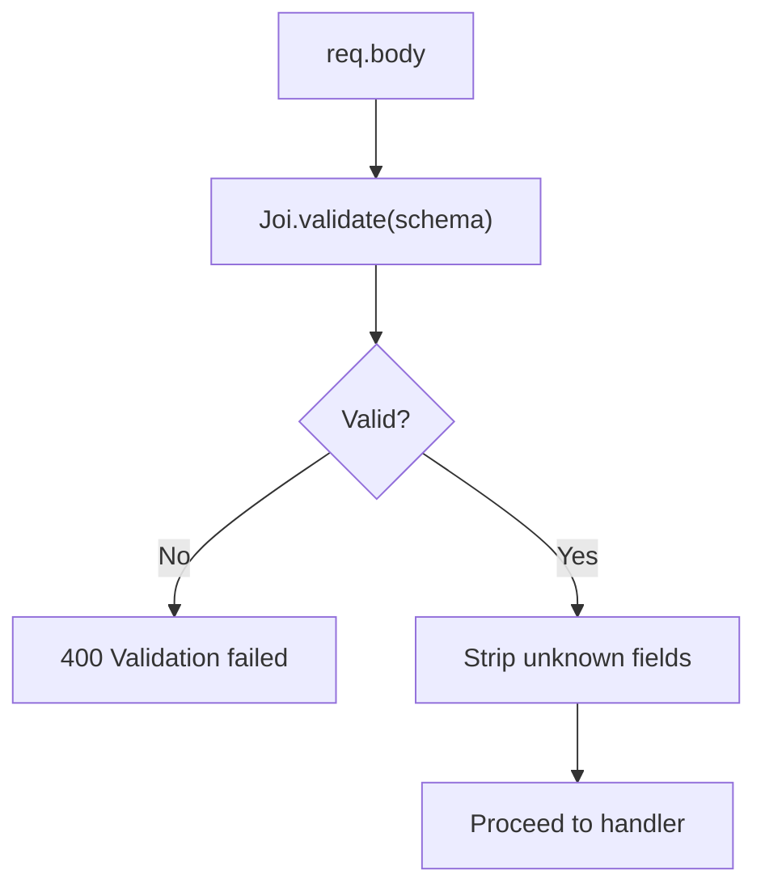
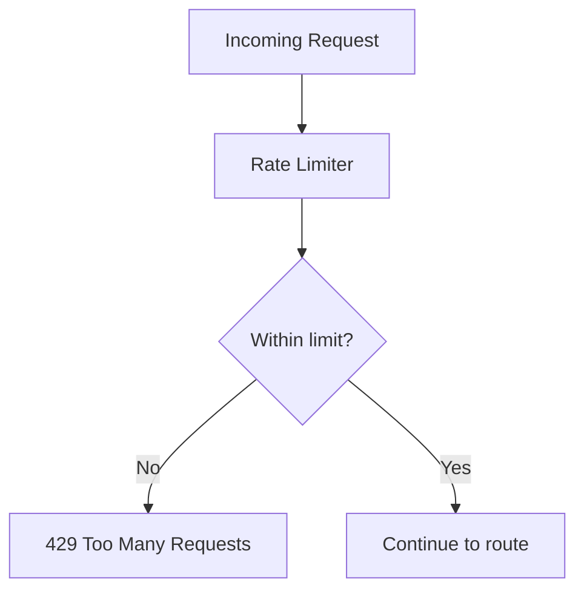
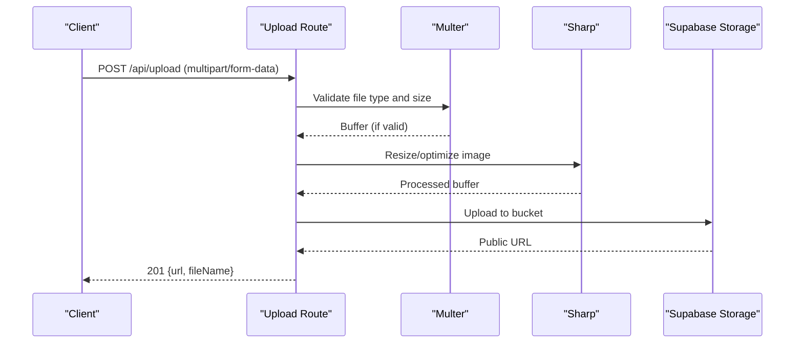
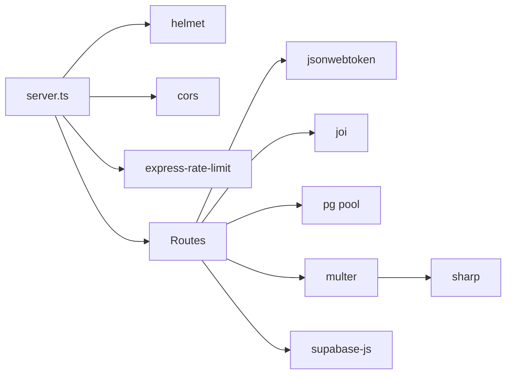

# Security Model

<cite>
**Referenced Files in This Document**
- [server.ts](file://backend/src/server.ts)
- [auth.ts](file://backend/src/middleware/auth.ts)
- [auth_routes.ts](file://backend/src/routes/auth.ts)
- [validate.ts](file://backend/src/middleware/validate.ts)
- [errorHandler.ts](file://backend/src/middleware/errorHandler.ts)
- [config_index.ts](file://backend/src/config/index.ts)
- [supabase.ts](file://backend/src/db/supabase.ts)
- [pool.ts](file://backend/src/db/pool.ts)
- [upload_routes.ts](file://backend/src/routes/upload.ts)
- [upload_service.ts](file://backend/src/services/uploadService.ts)
- [initial_schema.sql](file://supabase/migrations/001_initial_schema.sql)
</cite>

## Table of Contents
1. Introduction
2. Project Structure
3. Core Components
4. Architecture Overview
5. Detailed Component Analysis
6. Dependency Analysis
7. Performance Considerations
8. Troubleshooting Guide
9. Conclusion

## Introduction
This document describes the security model for the Lost & Found AI Matcher backend. It covers authentication with JWT, role-based access control, session behavior, PostgreSQL Row-Level Security (RLS), input validation and sanitization, protection against common web vulnerabilities, API security measures including rate limiting and request validation, secure file upload handling and image processing, and third-party integration security practices.

## Project Structure
The backend is an Express application that wires together:
- Global security middleware (helmet, CORS, JSON parsing limits, logging, rate limiting)
- Authentication and authorization middleware
- Route handlers for auth, reports, matches, verification, uploads, notifications, messages, and admin endpoints
- Database access via a parameterized query wrapper and Supabase clients
- Configuration loaded from environment variables

**Diagram sources**
- [server.ts:1-38](file://backend/src/server.ts#L1-L38)
- [auth.ts:22-37](file://backend/src/middleware/auth.ts#L22-L37)
- [validate.ts:8-22](file://backend/src/middleware/validate.ts#L8-L22)
- [pool.ts:34-48](file://backend/src/db/pool.ts#L34-L48)
- [supabase.ts:8-20](file://backend/src/db/supabase.ts#L8-L20)

**Section sources**
- [server.ts:1-38](file://backend/src/server.ts#L1-L38)

## Core Components
- Authentication: JWT-based token issuance on login/signup and verification on protected routes.
- Authorization: Role checks enforced by middleware; admin-only routes require database-backed role verification.
- Input validation: Joi schemas validate and sanitize request bodies before business logic.
- Database isolation: PostgreSQL RLS policies restrict data visibility per user.
- Secure uploads: Multer + Sharp enforce file type and size, resize images, and store to a managed storage bucket.
- API hardening: Helmet sets security headers; CORS restricts origins; rate limiter throttles requests.
- Third-party integrations: Supabase clients separate service-role (admin) and anon scopes; OpenAI key loaded from environment.

**Section sources**
- [auth.ts:22-58](file://backend/src/middleware/auth.ts#L22-L58)
- [auth_routes.ts:16-72](file://backend/src/routes/auth.ts#L16-L72)
- [validate.ts:8-61](file://backend/src/middleware/validate.ts#L8-L61)
- [initial_schema.sql:322-365](file://supabase/migrations/001_initial_schema.sql#L322-L365)
- [upload_routes.ts:15-67](file://backend/src/routes/upload.ts#L15-L67)
- [upload_service.ts:14-65](file://backend/src/services/uploadService.ts#L14-L65)
- [server.ts:19-30](file://backend/src/server.ts#L19-L30)
- [config_index.ts:6-31](file://backend/src/config/index.ts#L6-L31)

## Architecture Overview
The system uses a layered security approach:
- Transport and headers: HTTPS termination at the platform; Helmet configures response headers; CORS allows only the configured frontend origin.
- Request gating: Rate limiting protects endpoints; authentication middleware validates JWT tokens; optional role enforcement checks database roles.
- Data access: All SQL uses parameterized queries; RLS enforces row-level isolation even if application logic fails.
- File handling: Uploads are validated, resized, and stored in a controlled bucket; URLs are returned to clients.
- Secrets: Sensitive keys are read from environment variables and never embedded in code.

**Diagram sources**
- [auth_routes.ts:46-72](file://backend/src/routes/auth.ts#L46-L72)
- [auth.ts:22-37](file://backend/src/middleware/auth.ts#L22-L37)
- [pool.ts:34-48](file://backend/src/db/pool.ts#L34-L48)

## Detailed Component Analysis

### Authentication Flow (JWT)
- Login/signup issues a JWT containing sub (user id), role, and email with a bounded expiration.
- Protected routes require Authorization: Bearer <token>. The middleware verifies the token and attaches userId and userRole to the request.
- Admin-only routes additionally verify the current user’s role in the database to prevent privilege escalation via tampered tokens.

**Diagram sources**
- [auth.ts:22-37](file://backend/src/middleware/auth.ts#L22-L37)

**Section sources**
- [auth_routes.ts:16-72](file://backend/src/routes/auth.ts#L16-L72)
- [auth.ts:22-58](file://backend/src/middleware/auth.ts#L22-L58)
- [config_index.ts:28-31](file://backend/src/config/index.ts#L28-L31)

### Role-Based Access Control (RBAC)
- Roles are stored in the users table and checked server-side for sensitive operations.
- The admin guard queries the database to confirm the role, not just trusting the JWT claim.

**Diagram sources**
- [auth.ts:43-58](file://backend/src/middleware/auth.ts#L43-L58)
- [initial_schema.sql:54-64](file://supabase/migrations/001_initial_schema.sql#L54-L64)

**Section sources**
- [auth.ts:43-58](file://backend/src/middleware/auth.ts#L43-L58)

### Session Management
- Stateless sessions: No server-side sessions are maintained. Each request carries a JWT in the Authorization header.
- Token lifetime is configured centrally and applied when signing tokens.

**Section sources**
- [auth_routes.ts:30-35](file://backend/src/routes/auth.ts#L30-L35)
- [config_index.ts:28-31](file://backend/src/config/index.ts#L28-L31)

### Row-Level Security (RLS) in PostgreSQL
- RLS is enabled on core tables and policies restrict reads/writes based on the authenticated user.
- Public read access is limited to active items without sensitive fields; owners can manage their own rows; notifications and matches are scoped to relevant users.

**Diagram sources**
- [initial_schema.sql:322-365](file://supabase/migrations/001_initial_schema.sql#L322-L365)

**Section sources**
- [initial_schema.sql:322-365](file://supabase/migrations/001_initial_schema.sql#L322-L365)

### Input Validation and Sanitization
- Joi schemas validate and strip unknown fields for report submissions and verification flows.
- Schemas enforce required fields, types, ranges, and formats (e.g., dates, coordinates, URIs).

**Diagram sources**
- [validate.ts:8-22](file://backend/src/middleware/validate.ts#L8-L22)
- [validate.ts:27-61](file://backend/src/middleware/validate.ts#L27-L61)

**Section sources**
- [validate.ts:8-61](file://backend/src/middleware/validate.ts#L8-L61)

### Protection Against Common Web Vulnerabilities
- XSS: Helmet sets secure response headers; no HTML rendering occurs in the backend; user inputs are validated and not echoed unsanitized.
- CSRF: Stateless JWT via Authorization header avoids cookie-based CSRF risks; CORS is restricted to a single trusted origin.
- SQL Injection: All database interactions use parameterized queries through a shared wrapper; no string concatenation for SQL.
- Path traversal and command injection: Not applicable in current handlers; file names are generated with UUIDs and stored in a managed bucket.

**Section sources**
- [server.ts:19-23](file://backend/src/server.ts#L19-L23)
- [pool.ts:34-48](file://backend/src/db/pool.ts#L34-L48)

### API Security Measures
- Rate Limiting: Global limiter under /api reduces abuse and mitigates brute-force attempts.
- Request Size Limits: JSON body size capped to mitigate large payload attacks.
- Logging: Morgan logs requests for observability and incident response.

**Diagram sources**
- [server.ts:25-30](file://backend/src/server.ts#L25-L30)

**Section sources**
- [server.ts:19-30](file://backend/src/server.ts#L19-L30)

### Secure File Upload Handling and Image Processing
- Authentication required for all uploads.
- Multer enforces allowed MIME types and maximum file size; rejects unexpected fields.
- Images are resized and optimized using Sharp before upload to reduce storage and bandwidth.
- Files are uploaded to a dedicated storage bucket with immutable filenames; public URLs are returned.

**Diagram sources**
- [upload_routes.ts:15-67](file://backend/src/routes/upload.ts#L15-L67)
- [upload_service.ts:14-65](file://backend/src/services/uploadService.ts#L14-L65)

**Section sources**
- [upload_routes.ts:15-67](file://backend/src/routes/upload.ts#L15-L67)
- [upload_service.ts:14-65](file://backend/src/services/uploadService.ts#L14-L65)

### Third-Party API Integration Security
- Supabase clients:
  - Service role client used for server-side operations where necessary; should be reserved for privileged tasks.
  - Anon client respects RLS for user-scoped operations.
- OpenAI API key is loaded from environment variables and not exposed to clients.
- Error responses do not leak internal details; errors are normalized.

**Section sources**
- [supabase.ts:8-20](file://backend/src/db/supabase.ts#L8-L20)
- [config_index.ts:19-21](file://backend/src/config/index.ts#L19-L21)
- [errorHandler.ts:16-47](file://backend/src/middleware/errorHandler.ts#L16-L47)

## Dependency Analysis
Security-critical dependencies and their roles:
- helmet: Sets secure HTTP response headers.
- cors: Restricts cross-origin requests to the configured frontend URL.
- express-rate-limit: Enforces request rate limits across /api.
- jsonwebtoken: Signs and verifies JWTs using a secret from environment.
- joi: Validates and sanitizes request payloads.
- pg: Parameterized queries protect against SQL injection.
- multer + sharp: Enforce upload constraints and optimize images safely.
- supabase-js: Provides both admin and anon clients with distinct privileges.

**Diagram sources**
- [server.ts:1-30](file://backend/src/server.ts#L1-L30)
- [auth_routes.ts:1-9](file://backend/src/routes/auth.ts#L1-L9)
- [validate.ts:1-3](file://backend/src/middleware/validate.ts#L1-L3)
- [pool.ts:1-5](file://backend/src/db/pool.ts#L1-L5)
- [upload_routes.ts:1-8](file://backend/src/routes/upload.ts#L1-L8)
- [supabase.ts:1-3](file://backend/src/db/supabase.ts#L1-L3)

**Section sources**
- [server.ts:1-30](file://backend/src/server.ts#L1-L30)

## Performance Considerations
- Rate limiting balances availability and security; tune window and max values based on traffic patterns.
- Image resizing reduces storage and network costs; ensure appropriate dimensions for display needs.
- Parameterized queries avoid overhead from dynamic SQL and improve safety.
- Connection pooling settings (max connections, timeouts) should match expected load and database capacity.

[No sources needed since this section provides general guidance]

## Troubleshooting Guide
Common issues and mitigations:
- Authentication failures: Ensure Authorization header format is correct and token has not expired.
- Validation errors: Check request body against schema requirements; unknown fields are stripped.
- Upload errors: Confirm file type and size; ensure field name matches expectations.
- Database errors: Inspect error logs; ensure connection parameters and SSL settings are correct for your environment.

**Section sources**
- [errorHandler.ts:16-47](file://backend/src/middleware/errorHandler.ts#L16-L47)
- [pool.ts:30-32](file://backend/src/db/pool.ts#L30-L32)

## Conclusion
The Lost & Found AI Matcher implements a defense-in-depth security model:
- Stateless JWT authentication with server-side role checks
- Strict input validation and safe database access
- PostgreSQL RLS for fine-grained data isolation
- Hardened API surface with Helmet, CORS, and rate limiting
- Secure file uploads with type/size checks and image optimization
- Careful separation of privileged and unprivileged third-party clients

These controls collectively reduce risk exposure while maintaining usability and performance.