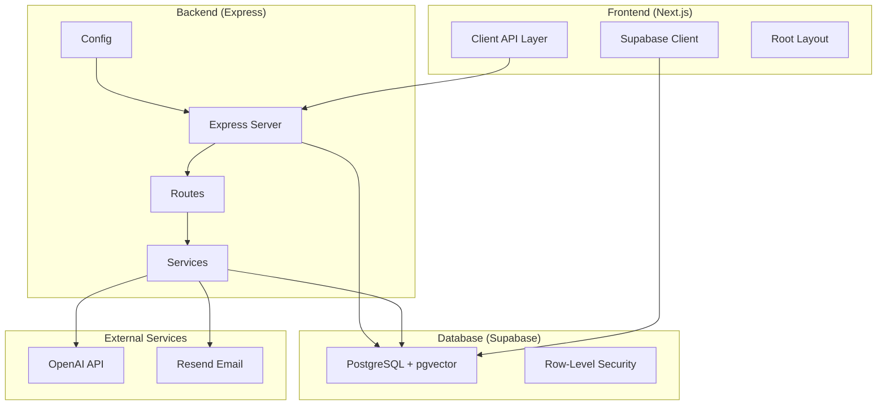
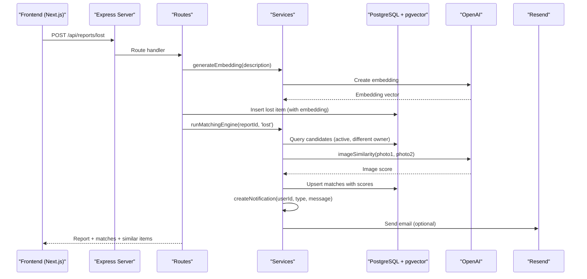
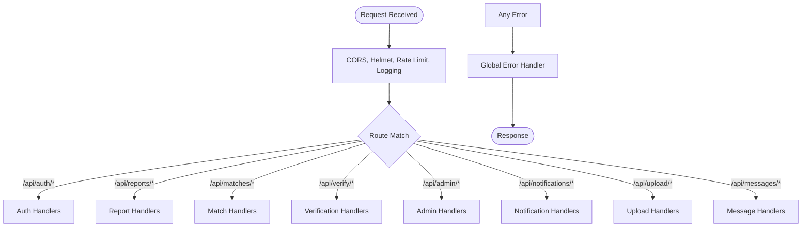
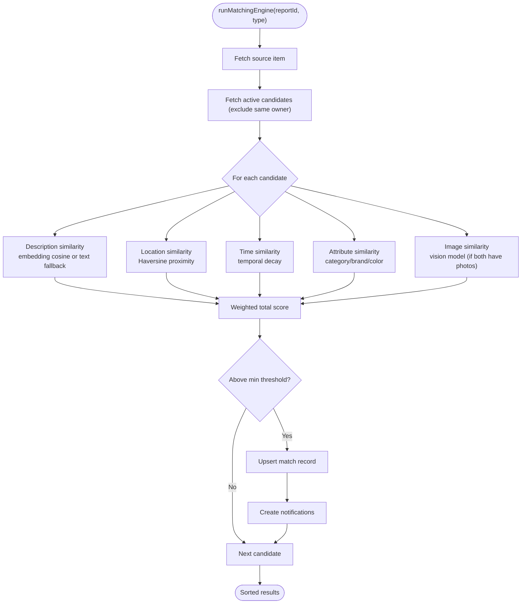
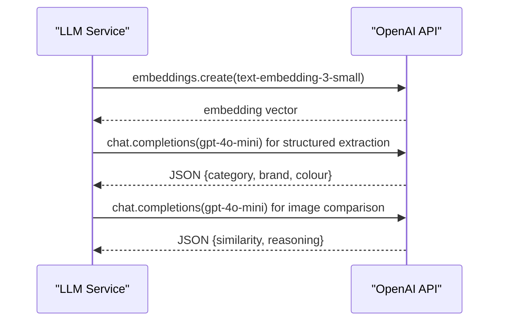
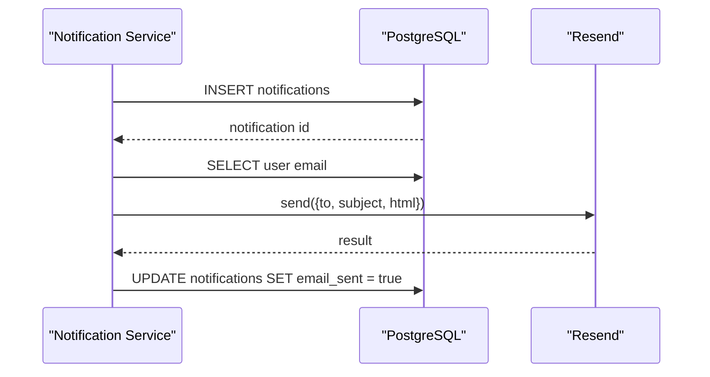
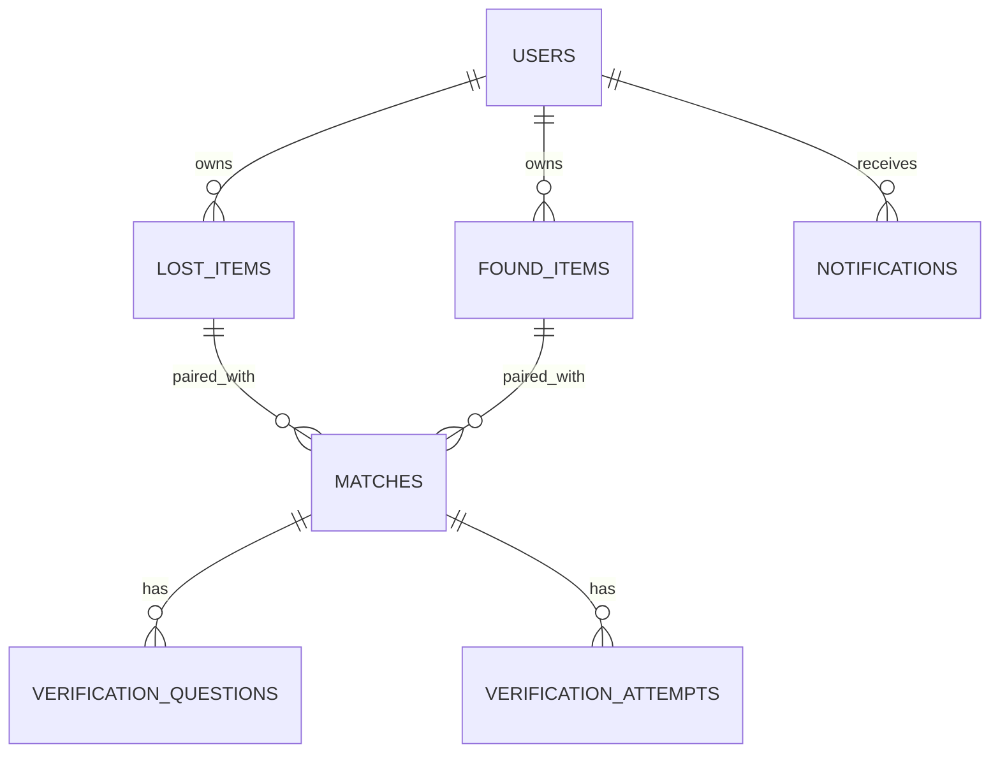
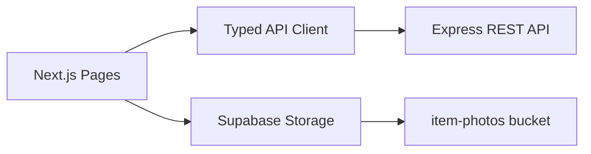
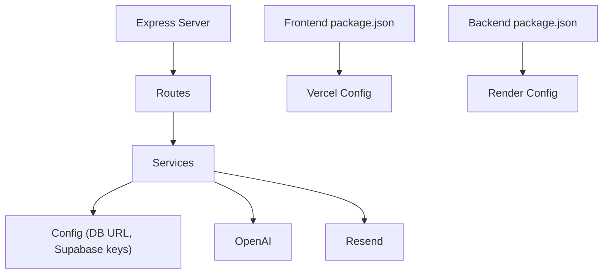

# System Design

<cite>
**Referenced Files in This Document**
- [README.md](file://README.md)
- [server.ts](file://backend/src/server.ts)
- [reports.ts](file://backend/src/routes/reports.ts)
- [matchingEngine.ts](file://backend/src/services/matchingEngine.ts)
- [llmService.ts](file://backend/src/services/llmService.ts)
- [emailService.ts](file://backend/src/services/emailService.ts)
- [notificationService.ts](file://backend/src/services/notificationService.ts)
- [supabase.ts](file://backend/src/db/supabase.ts)
- [config/index.ts](file://backend/src/config/index.ts)
- [001_initial_schema.sql](file://supabase/migrations/001_initial_schema.sql)
- [api.ts](file://frontend/lib/api.ts)
- [supabase.ts](file://frontend/lib/supabase.ts)
- [layout.tsx](file://frontend/app/layout.tsx)
- [package.json (backend)](file://backend/package.json)
- [package.json (frontend)](file://frontend/package.json)
- [render.yaml](file://render.yaml)
- [vercel.json](file://frontend/vercel.json)
</cite>

## Table of Contents
1. Introduction
2. Project Structure
3. Core Components
4. Architecture Overview
5. Detailed Component Analysis
6. Dependency Analysis
7. Performance Considerations
8. Troubleshooting Guide
9. Conclusion
10. Appendices

## Introduction
This document describes the system design for the Lost & Found AI Matcher, a privacy-first platform that matches lost and found items using AI-driven similarity scoring and verifies ownership through category-specific questions. The system is composed of:
- A Next.js frontend for user interfaces and client-side storage interactions
- An Express.js backend API orchestrating matching, verification, notifications, and admin operations
- A Supabase PostgreSQL database with pgvector for embedding-based search and row-level security
- External integrations with OpenAI for embeddings and vision comparison, and Resend for email notifications

The architecture emphasizes clear separation of concerns, secure handling of private data, explainable matching scores, and scalable deployment across Vercel (frontend) and Render (backend).

**Section sources**
- [README.md:22-47](file://README.md#L22-L47)

## Project Structure
The repository is organized into three primary layers:
- Frontend (Next.js App Router): UI pages, components, and client-side API clients
- Backend (Express + TypeScript): REST endpoints, middleware, services, and database access
- Database (Supabase PostgreSQL with pgvector): schema, indexes, triggers, and RLS policies

**Diagram sources**
- [server.ts:1-52](file://backend/src/server.ts#L1-L52)
- [reports.ts:1-356](file://backend/src/routes/reports.ts#L1-L356)
- [matchingEngine.ts:1-208](file://backend/src/services/matchingEngine.ts#L1-L208)
- [llmService.ts:1-120](file://backend/src/services/llmService.ts#L1-L120)
- [emailService.ts:1-32](file://backend/src/services/emailService.ts#L1-L32)
- [notificationService.ts:1-101](file://backend/src/services/notificationService.ts#L1-L101)
- [supabase.ts:1-21](file://backend/src/db/supabase.ts#L1-L21)
- [config/index.ts:1-49](file://backend/src/config/index.ts#L1-L49)
- [api.ts:1-423](file://frontend/lib/api.ts#L1-L423)
- [supabase.ts:1-25](file://frontend/lib/supabase.ts#L1-L25)
- [layout.tsx:1-28](file://frontend/app/layout.tsx#L1-L28)

**Section sources**
- [README.md:22-47](file://README.md#L22-L47)
- [package.json (backend):1-50](file://backend/package.json#L1-L50)
- [package.json (frontend):1-32](file://frontend/package.json#L1-L32)

## Core Components
- Express server: centralizes middleware (CORS, rate limiting, logging), mounts routes, and exposes health checks
- Routes: handle authentication, reports, matches, verification, notifications, uploads, messages, and admin functions
- Services: encapsulate business logic including matching engine, LLM calls, email delivery, notifications, and upload processing
- Database layer: uses a connection pool and Supabase clients (service role vs anon) to enforce RLS where appropriate
- Configuration: environment-driven settings for ports, URLs, keys, and matching parameters
- Frontend: Next.js app with typed API clients and Supabase storage integration for photos

Key responsibilities:
- Matching engine computes weighted similarity across description embeddings, image similarity, location proximity, time proximity, and attributes
- Verification flow generates questions from private details and evaluates answers via LLM
- Notifications create in-app records and optionally send emails via Resend
- Storage handles photo uploads and returns public URLs

**Section sources**
- [server.ts:1-52](file://backend/src/server.ts#L1-L52)
- [reports.ts:1-356](file://backend/src/routes/reports.ts#L1-L356)
- [matchingEngine.ts:1-208](file://backend/src/services/matchingEngine.ts#L1-L208)
- [llmService.ts:1-120](file://backend/src/services/llmService.ts#L1-L120)
- [emailService.ts:1-32](file://backend/src/services/emailService.ts#L1-L32)
- [notificationService.ts:1-101](file://backend/src/services/notificationService.ts#L1-L101)
- [supabase.ts:1-21](file://backend/src/db/supabase.ts#L1-L21)
- [config/index.ts:1-49](file://backend/src/config/index.ts#L1-L49)
- [api.ts:1-423](file://frontend/lib/api.ts#L1-L423)
- [supabase.ts:1-25](file://frontend/lib/supabase.ts#L1-L25)

## Architecture Overview
The system follows a layered architecture:
- Presentation layer: Next.js pages and components render UI and call backend APIs or Supabase storage
- API layer: Express routes validate input, authenticate requests, and delegate to services
- Service layer: Business logic for matching, verification, notifications, and external integrations
- Data layer: PostgreSQL with pgvector for vector similarity; Supabase RLS enforces data access rules
- External integrations: OpenAI for embeddings and vision; Resend for email

**Diagram sources**
- [reports.ts:98-171](file://backend/src/routes/reports.ts#L98-L171)
- [matchingEngine.ts:37-189](file://backend/src/services/matchingEngine.ts#L37-L189)
- [llmService.ts:9-17](file://backend/src/services/llmService.ts#L9-L17)
- [llmService.ts:85-119](file://backend/src/services/llmService.ts#L85-L119)
- [notificationService.ts:19-62](file://backend/src/services/notificationService.ts#L19-L62)
- [emailService.ts:15-31](file://backend/src/services/emailService.ts#L15-L31)

**Section sources**
- [README.md:22-47](file://README.md#L22-L47)
- [server.ts:18-45](file://backend/src/server.ts#L18-L45)

## Detailed Component Analysis

### Backend Server and Routing
- Express application configures CORS, rate limiting, JSON parsing, logging, and error handling
- Health endpoint provides readiness checks for deployment platforms
- Routes are mounted under /api for auth, reports, matches, verify, admin, notifications, upload, and messages

**Diagram sources**
- [server.ts:18-45](file://backend/src/server.ts#L18-L45)

**Section sources**
- [server.ts:1-52](file://backend/src/server.ts#L1-L52)

### Matching Engine
- Computes a weighted total score from five factors: description similarity (embedding cosine), image similarity (vision model), location proximity (Haversine decay), time proximity (temporal decay), and attribute similarity (category/brand/color)
- Filters results by a configurable minimum threshold and persists match records with per-factor breakdowns
- Emits notifications for new matches to both parties

**Diagram sources**
- [matchingEngine.ts:37-189](file://backend/src/services/matchingEngine.ts#L37-L189)
- [config/index.ts:33-47](file://backend/src/config/index.ts#L33-L47)

**Section sources**
- [matchingEngine.ts:1-208](file://backend/src/services/matchingEngine.ts#L1-L208)
- [config/index.ts:1-49](file://backend/src/config/index.ts#L1-L49)

### LLM Integration
- Generates 1536-dimensional embeddings for descriptions using OpenAI’s embedding model
- Extracts structured fields (category, brand, color) from free-text descriptions
- Compares images via vision model to compute visual similarity scores
- Provides cosine similarity calculation between vectors and maps to a 0–100 scale

**Diagram sources**
- [llmService.ts:9-17](file://backend/src/services/llmService.ts#L9-L17)
- [llmService.ts:47-79](file://backend/src/services/llmService.ts#L47-L79)
- [llmService.ts:85-119](file://backend/src/services/llmService.ts#L85-L119)

**Section sources**
- [llmService.ts:1-120](file://backend/src/services/llmService.ts#L1-L120)

### Notification and Email Flow
- Creates in-app notifications with metadata linking to relevant entities
- Optionally sends HTML emails via Resend; marks email_sent flag on success
- Builds templates with contextual links back to the frontend

**Diagram sources**
- [notificationService.ts:19-62](file://backend/src/services/notificationService.ts#L19-L62)
- [emailService.ts:15-31](file://backend/src/services/emailService.ts#L15-L31)

**Section sources**
- [notificationService.ts:1-101](file://backend/src/services/notificationService.ts#L1-L101)
- [emailService.ts:1-32](file://backend/src/services/emailService.ts#L1-L32)

### Database Schema and Security
- Tables include users, lost_items, found_items, matches, verification_questions, verification_attempts, notifications, and item_status_log
- Uses pgvector for 1536-dimension embeddings and ivfflat indexes for efficient vector search
- Implements RLS policies to restrict access to sensitive fields and ensure users can only view their own data
- Includes helper functions (e.g., Haversine distance) and triggers to maintain updated_at timestamps

**Diagram sources**
- [001_initial_schema.sql:54-236](file://supabase/migrations/001_initial_schema.sql#L54-L236)
- [001_initial_schema.sql:241-258](file://supabase/migrations/001_initial_schema.sql#L241-L258)
- [001_initial_schema.sql:322-365](file://supabase/migrations/001_initial_schema.sql#L322-L365)

**Section sources**
- [001_initial_schema.sql:1-370](file://supabase/migrations/001_initial_schema.sql#L1-L370)

### Frontend Integration
- Next.js root layout sets up global styles and UI shell
- Client API module defines typed endpoints for auth, reports, matches, verification, notifications, messages, and admin features
- Supabase client manages storage uploads and returns public URLs for item photos

**Diagram sources**
- [layout.tsx:11-27](file://frontend/app/layout.tsx#L11-L27)
- [api.ts:1-423](file://frontend/lib/api.ts#L1-L423)
- [supabase.ts:11-24](file://frontend/lib/supabase.ts#L11-L24)

**Section sources**
- [layout.tsx:1-28](file://frontend/app/layout.tsx#L1-L28)
- [api.ts:1-423](file://frontend/lib/api.ts#L1-L423)
- [supabase.ts:1-25](file://frontend/lib/supabase.ts#L1-L25)

## Dependency Analysis
- Frontend depends on Next.js ecosystem and calls backend REST endpoints or Supabase storage directly
- Backend depends on Express, OpenAI SDK, Resend SDK, pg driver, and Supabase JS client
- Database relies on PostgreSQL with pgvector extension and custom indexes for performance
- Deployment configuration ties frontend to Vercel and backend to Render with environment variables

**Diagram sources**
- [package.json (frontend):1-32](file://frontend/package.json#L1-L32)
- [package.json (backend):1-50](file://backend/package.json#L1-L50)
- [config/index.ts:1-49](file://backend/src/config/index.ts#L1-L49)
- [vercel.json:1-11](file://frontend/vercel.json#L1-L11)
- [render.yaml:1-54](file://render.yaml#L1-L54)

**Section sources**
- [package.json (backend):1-50](file://backend/package.json#L1-L50)
- [package.json (frontend):1-32](file://frontend/package.json#L1-L32)
- [render.yaml:1-54](file://render.yaml#L1-L54)
- [vercel.json:1-11](file://frontend/vercel.json#L1-L11)

## Performance Considerations
- Vector search optimization: ivfflat indexes on description_embedding columns enable fast cosine similarity queries
- Weighted scoring thresholds filter low-confidence matches early, reducing downstream processing
- Non-blocking matching: report creation proceeds even if matching fails; matching runs asynchronously to avoid blocking user flows
- Image similarity calls are conditional (only when both items have photos) to minimize external API usage
- Rate limiting protects API endpoints against abuse
- Pagination and limits on listing endpoints reduce payload sizes

[No sources needed since this section provides general guidance]

## Troubleshooting Guide
- Health check: use GET /api/health to verify backend availability
- Authentication errors: ensure Authorization header includes valid token; check JWT secret configuration
- Matching failures: review logs for OpenAI API errors; falling back to text similarity ensures partial functionality
- Email delivery issues: confirm Resend API key and sender address; non-fatal email failures do not block in-app notifications
- Database connectivity: verify DATABASE_URL and Supabase service role key; ensure pgvector extension is enabled
- CORS issues: set FRONTEND_URL correctly in backend config to allow browser requests

**Section sources**
- [server.ts:32-34](file://backend/src/server.ts#L32-L34)
- [config/index.ts:6-31](file://backend/src/config/index.ts#L6-L31)
- [emailService.ts:15-31](file://backend/src/services/emailService.ts#L15-L31)
- [notificationService.ts:42-61](file://backend/src/services/notificationService.ts#L42-L61)

## Conclusion
The Lost & Found AI Matcher combines a modern Next.js frontend, a robust Express backend, and a PostgreSQL database enhanced with pgvector to deliver explainable, AI-powered matching and secure verification workflows. External integrations with OpenAI and Resend extend capabilities for embeddings, vision analysis, and email notifications. The system is designed for scalability through indexing, thresholds, and non-blocking processes, and supports deployment on Vercel and Render with clear environment configuration.

[No sources needed since this section summarizes without analyzing specific files]

## Appendices

### Technology Stack Decisions
- Next.js chosen for its mature App Router, strong developer experience, and seamless deployment on Vercel
- Express selected for flexible routing, middleware ecosystem, and straightforward integration with Node.js services
- PostgreSQL with pgvector enables efficient vector similarity search at scale within a relational schema
- OpenAI models provide high-quality embeddings and vision comparisons for accurate matching
- Resend offers reliable email delivery for notifications

[No sources needed since this section provides general guidance]

### Deployment Topology and Infrastructure Requirements
- Frontend deployed on Vercel with build and environment configuration
- Backend deployed on Render with health checks and environment variables for secrets
- Supabase project required with pgvector extension enabled and storage bucket configured
- Environment variables include Supabase URLs and keys, OpenAI API key, Resend API key, JWT secret, and frontend/backend URLs

**Section sources**
- [render.yaml:1-54](file://render.yaml#L1-L54)
- [vercel.json:1-11](file://frontend/vercel.json#L1-L11)
- [README.md:159-166](file://README.md#L159-L166)