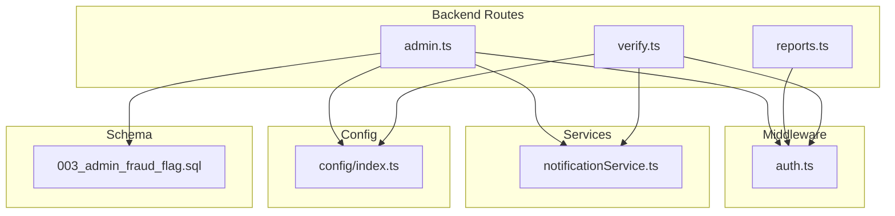
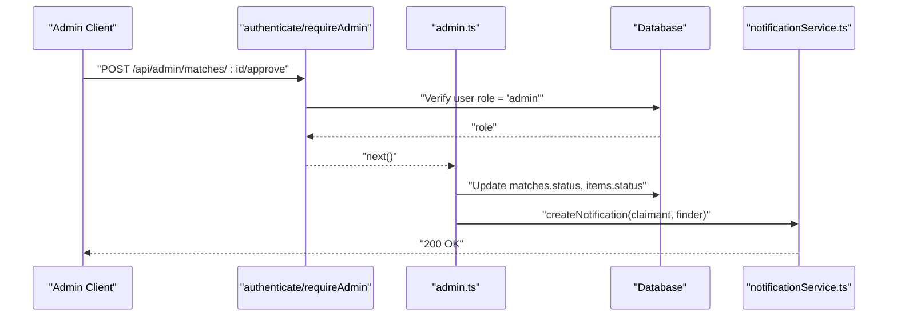
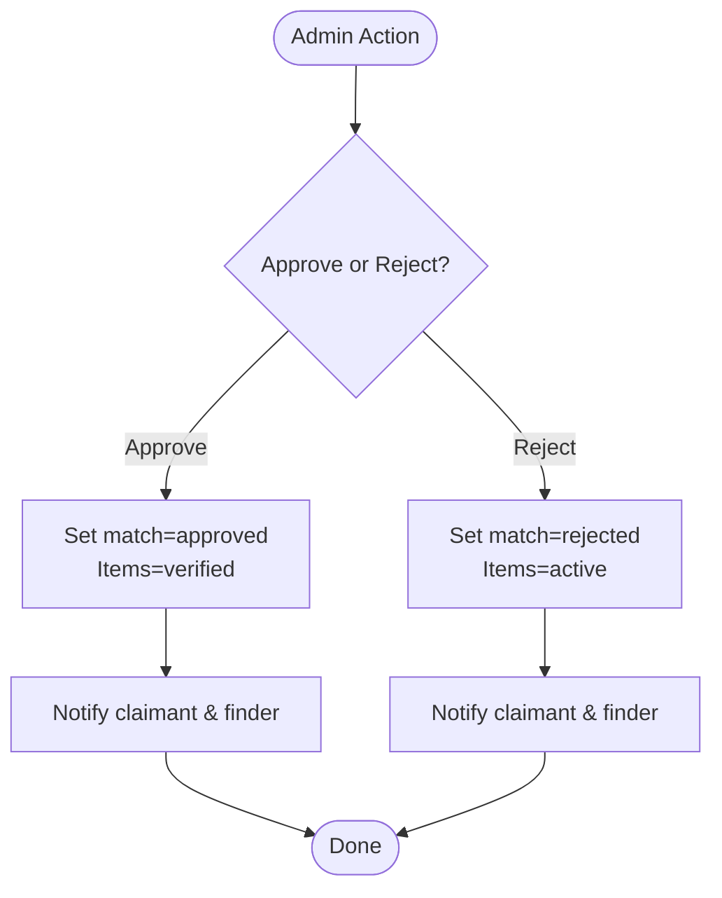
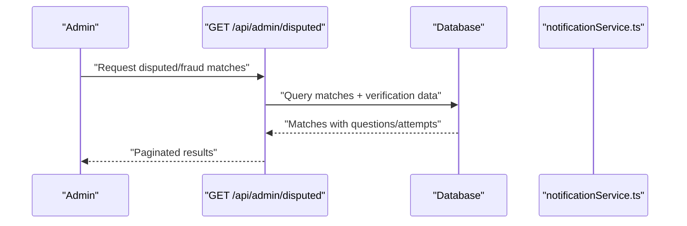
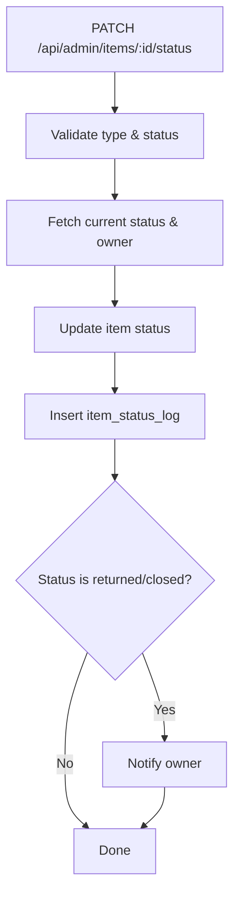
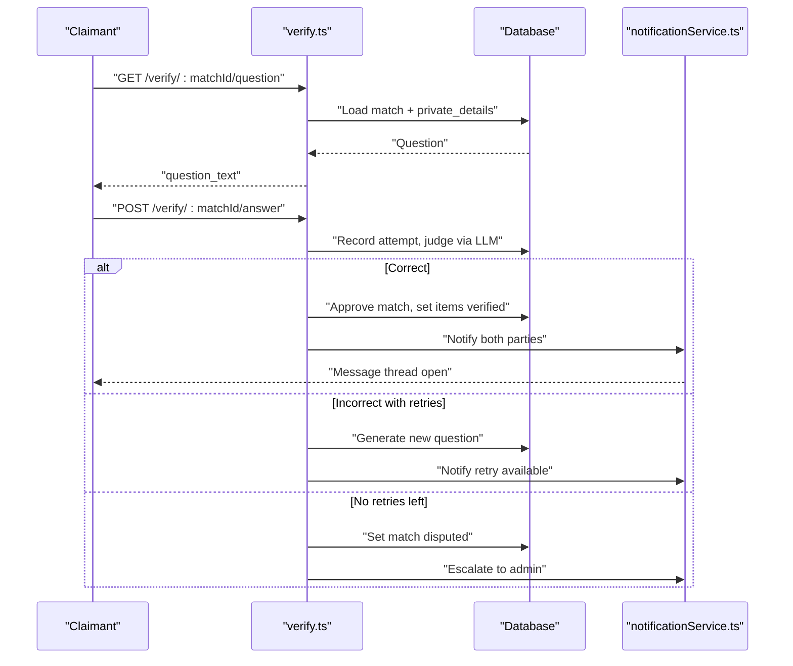
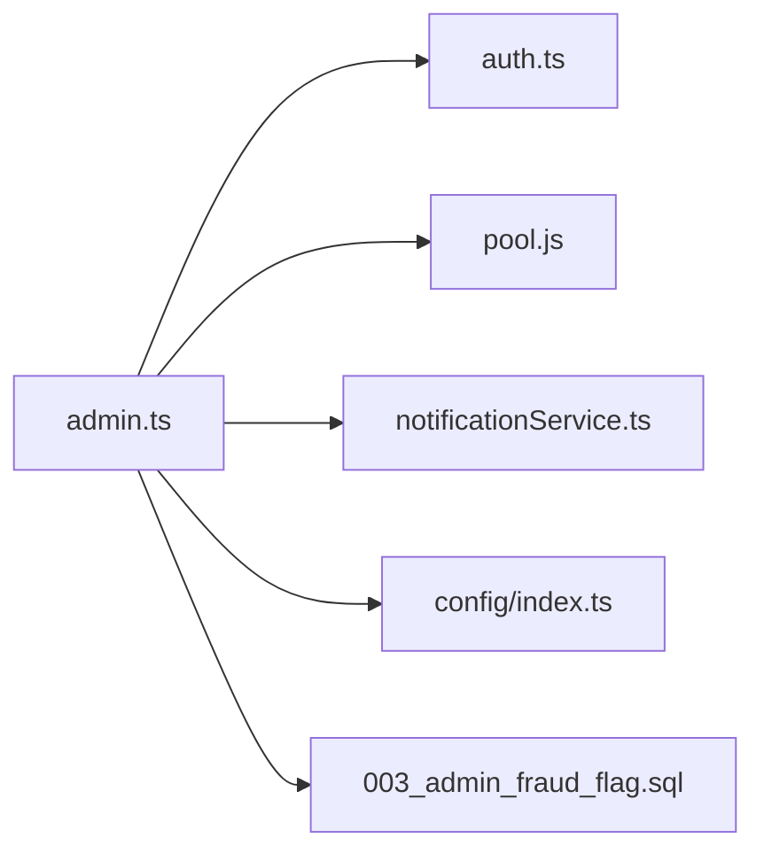

# Admin API

<cite>
**Referenced Files in This Document**
- [admin.ts](file://backend/src/routes/admin.ts)
- [auth.ts](file://backend/src/middleware/auth.ts)
- [reports.ts](file://backend/src/routes/reports.ts)
- [verify.ts](file://backend/src/routes/verify.ts)
- [notificationService.ts](file://backend/src/services/notificationService.ts)
- [config/index.ts](file://backend/src/config/index.ts)
- [003_admin_fraud_flag.sql](file://supabase/migrations/003_admin_fraud_flag.sql)
- [API_DOCUMENTATION.md](file://backend/API_DOCUMENTATION.md)
</cite>

## Table of Contents
1. Introduction
2. Project Structure
3. Core Components
4. Architecture Overview
5. Detailed Component Analysis
6. Dependency Analysis
7. Performance Considerations
8. Troubleshooting Guide
9. Conclusion
10. Appendices

## Introduction
This document provides detailed API documentation for administrative functions in the Lost & Found AI Matcher system. It covers admin-only operations for user management, dispute resolution, system monitoring, and fraud detection. It also explains audit logging, notifications, and system analytics exposed to administrators. Request/response schemas and common admin workflows are included to support tasks such as user moderation, match review, and system maintenance.

## Project Structure
The backend exposes REST endpoints grouped by feature. Administrative capabilities are primarily implemented under the admin routes with shared middleware for authentication and authorization. Supporting services handle notifications, while database migrations define schema changes relevant to admin features (e.g., fraud flagging).

**Diagram sources**
- [admin.ts:1-12](file://backend/src/routes/admin.ts#L1-L12)
- [auth.ts:22-58](file://backend/src/middleware/auth.ts#L22-L58)
- [notificationService.ts:19-62](file://backend/src/services/notificationService.ts#L19-L62)
- [config/index.ts:6-48](file://backend/src/config/index.ts#L6-L48)
- [003_admin_fraud_flag.sql:5-12](file://supabase/migrations/003_admin_fraud_flag.sql#L5-L12)

**Section sources**
- [admin.ts:1-12](file://backend/src/routes/admin.ts#L1-L12)
- [auth.ts:22-58](file://backend/src/middleware/auth.ts#L22-L58)

## Core Components
- Authentication and Authorization: JWT-based authentication and role enforcement ensure only authenticated users can access protected endpoints, and only users with an admin role can access admin endpoints.
- Admin Endpoints: Provide dashboard statistics, match listing, approval/rejection, item status updates, disputed/fraud cases listing, and manual flag/unflag controls.
- Notifications: Automated in-app and email notifications inform users about match approvals, rejections, escalations, and item status changes.
- Audit Logging: Item status changes are recorded in a dedicated log table with actor and reason fields for traceability.
- Configuration: Matching parameters such as retry limits influence escalation behavior during verification flows.

**Section sources**
- [auth.ts:22-58](file://backend/src/middleware/auth.ts#L22-L58)
- [admin.ts:18-389](file://backend/src/routes/admin.ts#L18-L389)
- [notificationService.ts:19-62](file://backend/src/services/notificationService.ts#L19-L62)
- [config/index.ts:33-47](file://backend/src/config/index.ts#L33-L47)

## Architecture Overview
Admin operations follow a consistent flow:
- Client sends a request with a valid JWT to an admin route.
- Middleware validates the token and enforces admin role by checking the database.
- Route handler performs business logic (e.g., approve/reject matches, update item statuses, list disputes).
- Side effects include database updates, audit logs, and notifications to affected users.

**Diagram sources**
- [auth.ts:22-58](file://backend/src/middleware/auth.ts#L22-L58)
- [admin.ts:88-128](file://backend/src/routes/admin.ts#L88-L128)
- [notificationService.ts:19-62](file://backend/src/services/notificationService.ts#L19-L62)

## Detailed Component Analysis

### Authentication and Authorization
- All admin routes require a valid JWT and an admin role. The middleware verifies the token and checks the user’s role against the database before allowing access.

Key behaviors:
- Rejects requests without a Bearer token or with invalid/expired tokens.
- Enforces admin role; non-admin users receive a forbidden error.

**Section sources**
- [auth.ts:22-58](file://backend/src/middleware/auth.ts#L22-L58)
- [admin.ts:11-12](file://backend/src/routes/admin.ts#L11-L12)

### Dashboard Statistics
- Endpoint: GET /api/admin/stats
- Purpose: Provides counts for lost items, found items, and matches (total, active, pending, approved, disputed).
- Use case: Admin dashboard overview for system health and workload.

Response highlights:
- lost_items: total, active
- found_items: total, active
- matches: total, pending, approved, disputed

**Section sources**
- [admin.ts:18-47](file://backend/src/routes/admin.ts#L18-L47)
- [API_DOCUMENTATION.md:694-730](file://backend/API_DOCUMENTATION.md#L694-L730)

### Match Management
- List Matches: GET /api/admin/matches
  - Supports pagination (page, limit) and optional status filter (pending, approved, rejected, disputed).
  - Returns match details including scores, statuses, and related item summaries.

- Approve Match: POST /api/admin/matches/:id/approve
  - Sets match status to approved and marks both associated items as verified.
  - Notifies both claimant and finder that the match is approved and messaging is available.

- Reject Match: POST /api/admin/matches/:id/reject
  - Sets match status to rejected and resets item statuses to active so they can be re-matched.
  - Notifies both parties that the match was rejected.

- Flag Match: POST /api/admin/matches/:id/flag
  - Manually flags a match as fraudulent with a reason; sets status to disputed if not already approved.
  - Notifies both parties that the match is under review.

- Unflag Match: POST /api/admin/matches/:id/unflag
  - Removes fraud flag and clears reason/timestamp.

**Diagram sources**
- [admin.ts:88-180](file://backend/src/routes/admin.ts#L88-L180)

**Section sources**
- [admin.ts:53-180](file://backend/src/routes/admin.ts#L53-L180)
- [API_DOCUMENTATION.md:734-778](file://backend/API_DOCUMENTATION.md#L734-L778)

### Dispute Resolution and Fraud Detection
- Disputed/Fraud Cases: GET /api/admin/disputed
  - Lists matches that are either disputed or manually flagged as fraudulent.
  - Includes verification questions and attempts per match to aid admin review.
  - Prioritizes fraud-flagged cases and sorts by flagged_at and created_at.

- Manual Flag/Unflag: See Match Management above.

**Diagram sources**
- [admin.ts:235-307](file://backend/src/routes/admin.ts#L235-L307)
- [003_admin_fraud_flag.sql:5-12](file://supabase/migrations/003_admin_fraud_flag.sql#L5-L12)

**Section sources**
- [admin.ts:235-307](file://backend/src/routes/admin.ts#L235-L307)
- [003_admin_fraud_flag.sql:5-12](file://supabase/migrations/003_admin_fraud_flag.sql#L5-L12)

### Item Status Updates and Audit Logging
- Update Item Status: PATCH /api/admin/items/:id/status
  - Allows admins to change item status to active, matched, verified, returned, or closed.
  - Validates type (lost/found) and status values.
  - Records an audit entry in item_status_log with old/new status, changed_by, and reason.
  - Notifies the item owner when status becomes returned or closed.

**Diagram sources**
- [admin.ts:186-228](file://backend/src/routes/admin.ts#L186-L228)

**Section sources**
- [admin.ts:186-228](file://backend/src/routes/admin.ts#L186-L228)

### Verification Flow and Escalation
While verification endpoints are not strictly admin-only, admins can interact with them where permitted. The flow includes:
- Claimant retrieves a verification question for a match.
- Claimant submits an answer; system auto-verifies using LLM fuzzy comparison.
- If correct, match is approved and items marked verified; notifications sent.
- If incorrect and retries remain, a new question is generated; otherwise, the match is escalated to disputed and notified.

Admins can also view verification history via the disputed endpoint and take action on flagged matches.

**Diagram sources**
- [verify.ts:20-79](file://backend/src/routes/verify.ts#L20-L79)
- [verify.ts:89-293](file://backend/src/routes/verify.ts#L89-L293)
- [notificationService.ts:19-62](file://backend/src/services/notificationService.ts#L19-L62)

**Section sources**
- [verify.ts:20-293](file://backend/src/routes/verify.ts#L20-L293)
- [config/index.ts:43-47](file://backend/src/config/index.ts#L43-L47)

### System Monitoring and Analytics
- Stats endpoint provides high-level metrics for lost/found items and matches.
- Disputed endpoint offers deeper visibility into problematic matches, including verification attempts and questions.
- Admins can use these endpoints to monitor system health, identify bottlenecks, and prioritize reviews.

**Section sources**
- [admin.ts:18-47](file://backend/src/routes/admin.ts#L18-L47)
- [admin.ts:235-307](file://backend/src/routes/admin.ts#L235-L307)

## Dependency Analysis
- Admin routes depend on:
  - Authentication middleware for JWT validation and role checks.
  - Database pool for queries and updates.
  - Notification service for user alerts.
  - Configuration for matching parameters (e.g., max retries).
- Schema dependencies:
  - Fraud flag columns added via migration to support manual flagging and prioritization.

**Diagram sources**
- [admin.ts:1-12](file://backend/src/routes/admin.ts#L1-L12)
- [auth.ts:22-58](file://backend/src/middleware/auth.ts#L22-L58)
- [notificationService.ts:19-62](file://backend/src/services/notificationService.ts#L19-L62)
- [config/index.ts:6-48](file://backend/src/config/index.ts#L6-L48)
- [003_admin_fraud_flag.sql:5-12](file://supabase/migrations/003_admin_fraud_flag.sql#L5-L12)

**Section sources**
- [admin.ts:1-12](file://backend/src/routes/admin.ts#L1-L12)
- [auth.ts:22-58](file://backend/src/middleware/auth.ts#L22-L58)

## Performance Considerations
- Pagination: Admin endpoints for matches and disputed cases support page and limit parameters to avoid large payloads.
- Query Optimization: Disputed endpoint uses indexes (e.g., fraud_flag index) to efficiently retrieve flagged cases.
- Non-blocking Operations: Notifications are issued after core state changes; failures in email delivery do not block responses.
- Embedding Search: While not part of admin routes, embedding-based similarity search is used elsewhere and may impact performance; admin reporting should consider caching or aggregation strategies for heavy analytics.

[No sources needed since this section provides general guidance]

## Troubleshooting Guide
Common errors and resolutions:
- Unauthorized (401): Missing or invalid JWT token. Ensure Authorization header contains a valid Bearer token.
- Forbidden (403): User lacks admin role. Confirm user role in the database is set to admin.
- Not Found (404): Resource does not exist (e.g., match or item ID). Verify IDs and record existence.
- Validation Errors (400): Invalid status or type for item updates. Check allowed values and payload structure.
- Too Many Requests (429): Exceeded verification retry limit; case escalated to admin. Review attempts and adjust workflow.

Operational tips:
- Use the disputed endpoint to investigate failed verifications and fraud flags.
- Review item_status_log entries to trace who changed item statuses and why.
- Monitor notifications to confirm users were informed of critical events.

**Section sources**
- [auth.ts:22-58](file://backend/src/middleware/auth.ts#L22-L58)
- [admin.ts:186-228](file://backend/src/routes/admin.ts#L186-L228)
- [verify.ts:89-293](file://backend/src/routes/verify.ts#L89-L293)

## Conclusion
The Admin API provides comprehensive tools for managing matches, handling disputes, enforcing fraud controls, and monitoring system activity. With robust authentication, audit logging, and notifications, administrators can efficiently moderate content, resolve conflicts, and maintain platform integrity. Use the provided endpoints and schemas to build admin workflows for user moderation, match review, and system maintenance.

[No sources needed since this section summarizes without analyzing specific files]

## Appendices

### Request/Response Schemas for Administrative Tasks

- GET /api/admin/stats
  - Response: { lost_items: { total, active }, found_items: { total, active }, matches: { total, pending, approved, disputed } }

- GET /api/admin/matches?page=&limit=&status=
  - Response: { page, limit, matches: [{ id, total_score, status, fraud_flag, flag_reason, flagged_at, created_at, lost_id, lost_category, lost_desc, found_id, found_category, found_desc }] }

- POST /api/admin/matches/:id/approve
  - Response: { message }

- POST /api/admin/matches/:id/reject
  - Response: { message }

- PATCH /api/admin/items/:id/status
  - Request Body: { status: "active"|"matched"|"verified"|"returned"|"closed", type: "lost"|"found", reason?: string }
  - Response: { message }

- GET /api/admin/disputed?page=&limit=
  - Response: { page, limit, total, matches: [{ id, total_score, status, fraud_flag, flag_reason, flagged_at, created_at, lost_id, lost_category, lost_desc, claimant_id, found_id, found_category, found_desc, finder_id, claimant_name, claimant_email, finder_name, finder_email, questions: [...], attempts: [...] }] }

- POST /api/admin/matches/:id/flag
  - Request Body: { reason: string }
  - Response: { message }

- POST /api/admin/matches/:id/unflag
  - Response: { message }

**Section sources**
- [admin.ts:18-389](file://backend/src/routes/admin.ts#L18-L389)
- [API_DOCUMENTATION.md:694-778](file://backend/API_DOCUMENTATION.md#L694-L778)

### Common Admin Workflows

- User Moderation
  - Review user reports via reports endpoints (authenticated users can view their own; admins can view any user’s reports).
  - Adjust item statuses as needed and notify owners.

- Match Review
  - List matches with filters; approve or reject based on score and context.
  - For disputed or fraud-flagged matches, inspect verification questions and attempts before deciding.

- System Maintenance
  - Use stats to monitor volumes and trends.
  - Investigate escalations via disputed endpoint and take corrective actions (flag/unflag, approve/reject).

**Section sources**
- [reports.ts:253-279](file://backend/src/routes/reports.ts#L253-L279)
- [admin.ts:53-389](file://backend/src/routes/admin.ts#L53-L389)