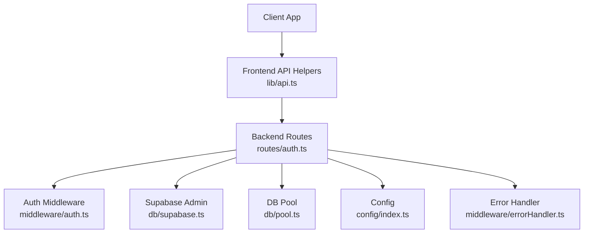
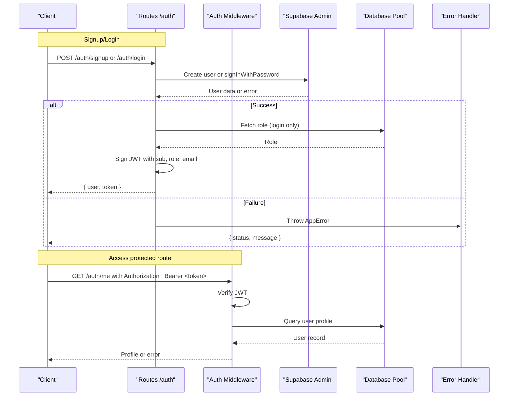
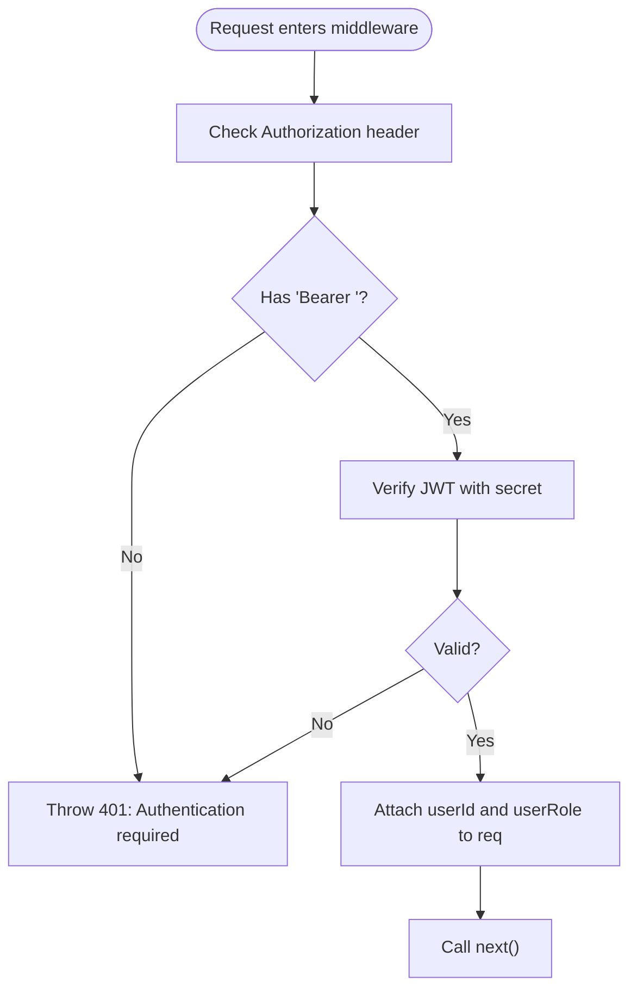
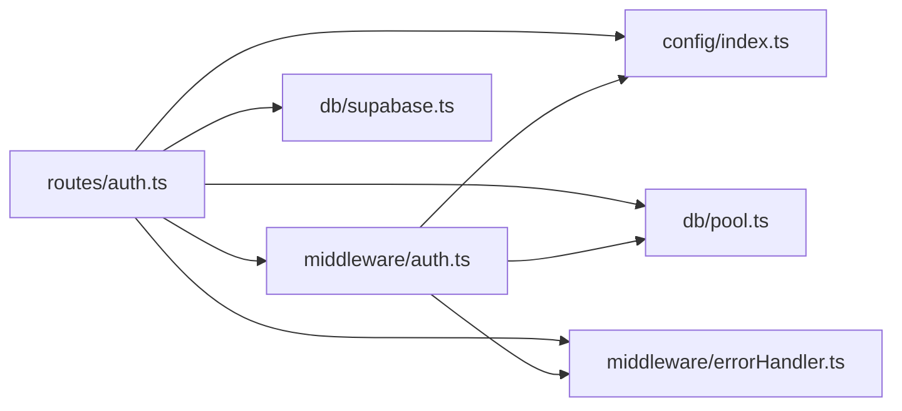

# Authentication API

<cite>
**Referenced Files in This Document**
- [auth.ts](file://backend/src/routes/auth.ts)
- [auth.ts (middleware)](file://backend/src/middleware/auth.ts)
- [errorHandler.ts](file://backend/src/middleware/errorHandler.ts)
- [index.ts (config)](file://backend/src/config/index.ts)
- [pool.ts](file://backend/src/db/pool.ts)
- [supabase.ts](file://backend/src/db/supabase.ts)
- [API_DOCUMENTATION.md](file://backend/API_DOCUMENTATION.md)
- [api.ts (frontend client)](file://frontend/lib/api.ts)
- [001_initial_schema.sql](file://supabase/migrations/001_initial_schema.sql)
</cite>

## Table of Contents
1. [Introduction](#introduction)
2. [Project Structure](#project-structure)
3. [Core Components](#core-components)
4. [Architecture Overview](#architecture-overview)
5. [Detailed Component Analysis](#detailed-component-analysis)
6. [Dependency Analysis](#dependency-analysis)
7. [Performance Considerations](#performance-considerations)
8. [Troubleshooting Guide](#troubleshooting-guide)
9. [Conclusion](#conclusion)
10. [Appendices](#appendices)

## Introduction
This document provides detailed API documentation for authentication endpoints, including user registration, login, profile retrieval, and JWT token handling. It also covers middleware for JWT validation and role-based authorization, error responses, and security considerations such as password hashing, token expiration, and CSRF protection. Client-side examples show how to store tokens and access protected routes.

## Project Structure
The authentication system is implemented in the backend Express application with Supabase Auth for identity management and a custom JWT for API authorization. The frontend includes helper functions to attach tokens to requests and manage storage.

**Diagram sources**
- [auth.ts:1-98](file://backend/src/routes/auth.ts#L1-L98)
- [auth.ts (middleware):1-59](file://backend/src/middleware/auth.ts#L1-L59)
- [index.ts (config):1-49](file://backend/src/config/index.ts#L1-L49)
- [pool.ts](file://backend/src/db/pool.ts)
- [supabase.ts](file://backend/src/db/supabase.ts)
- [errorHandler.ts:1-56](file://backend/src/middleware/errorHandler.ts#L1-L56)
- [api.ts (frontend client):1-78](file://frontend/lib/api.ts#L1-L78)

**Section sources**
- [auth.ts:1-98](file://backend/src/routes/auth.ts#L1-L98)
- [auth.ts (middleware):1-59](file://backend/src/middleware/auth.ts#L1-L59)
- [index.ts (config):1-49](file://backend/src/config/index.ts#L1-L49)
- [errorHandler.ts:1-56](file://backend/src/middleware/errorHandler.ts#L1-L56)
- [api.ts (frontend client):1-78](file://frontend/lib/api.ts#L1-L78)

## Core Components
- Authentication routes: signup, login, get current user profile.
- JWT middleware: validate Bearer tokens and enforce admin roles.
- Configuration: JWT secret and expiration settings.
- Error handling: standardized error responses and async wrapper.
- Database integration: queries for user roles and profiles.
- Supabase Auth: user creation and sign-in via service role key.

Key responsibilities:
- Create users and issue JWTs on signup.
- Authenticate users and return JWTs on login.
- Protect routes by verifying JWT and enforcing roles.
- Return consistent error shapes for clients.

**Section sources**
- [auth.ts:1-98](file://backend/src/routes/auth.ts#L1-L98)
- [auth.ts (middleware):1-59](file://backend/src/middleware/auth.ts#L1-L59)
- [index.ts (config):28-31](file://backend/src/config/index.ts#L28-L31)
- [errorHandler.ts:1-56](file://backend/src/middleware/errorHandler.ts#L1-L56)

## Architecture Overview
Authentication flow uses Supabase Auth for identity and a custom JWT for API authorization. Protected endpoints require a Bearer token validated by middleware. Role checks are enforced server-side against the database.

**Diagram sources**
- [auth.ts:12-98](file://backend/src/routes/auth.ts#L12-L98)
- [auth.ts (middleware):22-59](file://backend/src/middleware/auth.ts#L22-L59)
- [errorHandler.ts:16-47](file://backend/src/middleware/errorHandler.ts#L16-L47)

## Detailed Component Analysis

### Authentication Endpoints

#### POST /api/auth/signup
- Purpose: Register a new user and issue a JWT.
- Authentication: None required.
- Request body:
  - email: string
  - password: string
  - full_name: string
- Response 201:
  - user: { id, email, full_name }
  - token: string (JWT)
- Errors:
  - 400: Signup failed (e.g., invalid input or provider error)
  - 500: Unexpected server error

Notes:
- Uses Supabase Admin to create user and auto-create users table row via trigger.
- Issues a backend JWT with sub, role 'user', and email; expires per config.

**Section sources**
- [auth.ts:12-41](file://backend/src/routes/auth.ts#L12-L41)
- [index.ts (config):28-31](file://backend/src/config/index.ts#L28-L31)
- [API_DOCUMENTATION.md:45-84](file://backend/API_DOCUMENTATION.md#L45-L84)

#### POST /api/auth/login
- Purpose: Authenticate user and return JWT.
- Authentication: None required.
- Request body:
  - email: string
  - password: string
- Response 200:
  - user: { id, email, role }
  - token: string (JWT)
- Errors:
  - 401: Invalid email or password
  - 500: Unexpected server error

Notes:
- Authenticates via Supabase Auth.
- Retrieves role from users table and embeds it into JWT.

**Section sources**
- [auth.ts:42-72](file://backend/src/routes/auth.ts#L42-L72)
- [API_DOCUMENTATION.md:88-126](file://backend/API_DOCUMENTATION.md#L88-L126)

#### GET /api/auth/me
- Purpose: Retrieve current user profile.
- Authentication: Required (Bearer token).
- Headers:
  - Authorization: Bearer <token>
- Response 200:
  - user: { id, email, full_name, phone, avatar_url, role, preferred_lang, created_at }
- Errors:
  - 401: Authentication required or invalid/expired token
  - 404: User not found
  - 500: Unexpected server error

Notes:
- Validates token and fetches profile from users table.

**Section sources**
- [auth.ts:74-98](file://backend/src/routes/auth.ts#L74-L98)

### Middleware: JWT Validation and Role-Based Authorization

#### authenticate
- Validates Bearer token using configured JWT secret.
- Attaches userId and userRole to request object.
- Throws 401 if token missing, invalid, or expired.

#### requireAdmin
- Ensures caller is authenticated.
- Verifies role is 'admin' by querying users table (not just JWT claim).
- Throws 403 if insufficient permissions.

**Diagram sources**
- [auth.ts (middleware):22-59](file://backend/src/middleware/auth.ts#L22-L59)
- [index.ts (config):28-31](file://backend/src/config/index.ts#L28-L31)

**Section sources**
- [auth.ts (middleware):1-59](file://backend/src/middleware/auth.ts#L1-L59)

### Token Handling and Storage

- Token issuance:
  - JWT payload includes sub (user id), role, and email.
  - Expiration set by configuration (default 7 days).
- Token verification:
  - Middleware verifies signature and expiration using configured secret.
- Frontend storage and usage:
  - Tokens can be stored in localStorage and attached to requests via Authorization header.
  - Helper functions automatically include token when present.

Security notes:
- Use HTTPS in production to protect tokens in transit.
- Store tokens securely on the client (e.g., httpOnly cookies or secure storage).
- Rotate JWT secrets periodically and ensure environment variables are secured.

**Section sources**
- [auth.ts:30-35](file://backend/src/routes/auth.ts#L30-L35)
- [auth.ts (middleware):22-36](file://backend/src/middleware/auth.ts#L22-L36)
- [index.ts (config):28-31](file://backend/src/config/index.ts#L28-L31)
- [api.ts (frontend client):7-16](file://frontend/lib/api.ts#L7-L16)

### Password Hashing
- Passwords are handled by Supabase Auth, which hashes passwords server-side.
- Backend does not handle raw password storage or hashing.

**Section sources**
- [auth.ts:19-24](file://backend/src/routes/auth.ts#L19-L24)
- [auth.ts:49-52](file://backend/src/routes/auth.ts#L49-L52)

### Session Management
- Stateless sessions:
  - Authentication relies on JWTs rather than server-side sessions.
  - Each request must include a valid Bearer token.
- Token lifecycle:
  - Tokens expire based on configuration; clients should refresh or re-authenticate upon expiry.

**Section sources**
- [index.ts (config):28-31](file://backend/src/config/index.ts#L28-L31)
- [auth.ts (middleware):22-36](file://backend/src/middleware/auth.ts#L22-L36)

### CSRF Protection
- CSRF considerations:
  - Since the API is stateless and uses Bearer tokens, CSRF is less relevant for JSON APIs.
  - If using cookies for tokens, implement CSRF protections accordingly.
- Recommendations:
  - Prefer short-lived tokens and secure transport (HTTPS).
  - Validate Origin/Referer headers if necessary for additional protection.

[No sources needed since this section provides general guidance]

## Dependency Analysis
The authentication system depends on several modules:

**Diagram sources**
- [auth.ts:1-98](file://backend/src/routes/auth.ts#L1-L98)
- [auth.ts (middleware):1-59](file://backend/src/middleware/auth.ts#L1-L59)
- [index.ts (config):1-49](file://backend/src/config/index.ts#L1-L49)
- [pool.ts](file://backend/src/db/pool.ts)
- [supabase.ts](file://backend/src/db/supabase.ts)
- [errorHandler.ts:1-56](file://backend/src/middleware/errorHandler.ts#L1-L56)

**Section sources**
- [auth.ts:1-98](file://backend/src/routes/auth.ts#L1-L98)
- [auth.ts (middleware):1-59](file://backend/src/middleware/auth.ts#L1-L59)

## Performance Considerations
- JWT verification is lightweight and stateless; avoid unnecessary DB calls in middleware.
- Role checks query the database once per protected endpoint requiring admin access; cache roles if appropriate.
- Minimize payload size in JWTs to reduce bandwidth overhead.
- Ensure database indexes exist for frequent queries (users table by id).

[No sources needed since this section provides general guidance]

## Troubleshooting Guide
Common errors and their causes:
- 401 Unauthorized:
  - Missing or malformed Authorization header.
  - Expired or invalid JWT.
  - Incorrect JWT secret configuration.
- 403 Forbidden:
  - Insufficient role (e.g., non-admin accessing admin endpoints).
- 404 Not Found:
  - User profile not found after token verification.
- 400 Bad Request:
  - Invalid input during signup or login.
  - Unexpected fields or file upload issues (handled by error handler).

Debugging steps:
- Verify JWT secret matches between issuer and verifier.
- Check token expiration and ensure clients refresh tokens appropriately.
- Inspect error messages returned by the error handler for precise details.

**Section sources**
- [errorHandler.ts:16-47](file://backend/src/middleware/errorHandler.ts#L16-L47)
- [auth.ts (middleware):22-36](file://backend/src/middleware/auth.ts#L22-L36)
- [auth.ts:78-94](file://backend/src/routes/auth.ts#L78-L94)

## Conclusion
The authentication system combines Supabase Auth for identity management with a custom JWT for API authorization. It provides clear endpoints for signup, login, and profile retrieval, along with robust middleware for token validation and role-based access control. Security best practices include secure token storage, HTTPS usage, and periodic secret rotation. Clients should handle token storage and attachment consistently to ensure seamless access to protected resources.

[No sources needed since this section summarizes without analyzing specific files]

## Appendices

### Client-Side Examples

- Storing tokens:
  - Save the token returned from signup/login to localStorage or a secure store.
  - Attach the token to subsequent requests using the Authorization header.

- Accessing protected routes:
  - Include Authorization: Bearer <token> in requests to protected endpoints.
  - Handle 401 responses by prompting re-authentication or token refresh.

- Example flows:
  - Signup: call POST /auth/signup, store token, then use it for subsequent requests.
  - Login: call POST /auth/login, store token, then use it for subsequent requests.
  - Profile: call GET /auth/me with Authorization header to retrieve user profile.

**Section sources**
- [api.ts (frontend client):7-16](file://frontend/lib/api.ts#L7-L16)
- [api.ts (frontend client):66-78](file://frontend/lib/api.ts#L66-L78)
- [API_DOCUMENTATION.md:45-126](file://backend/API_DOCUMENTATION.md#L45-L126)

### Database Schema Notes
- Users table extends Supabase auth.users and stores role and profile fields.
- Triggers auto-create user rows on signup.
- Row-level policies restrict access to sensitive data.

**Section sources**
- [001_initial_schema.sql:54-64](file://supabase/migrations/001_initial_schema.sql#L54-L64)
- [001_initial_schema.sql:278-294](file://supabase/migrations/001_initial_schema.sql#L278-L294)
- [001_initial_schema.sql:322-336](file://supabase/migrations/001_initial_schema.sql#L322-L336)