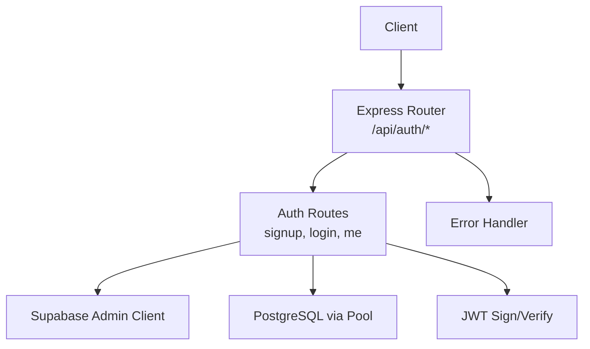
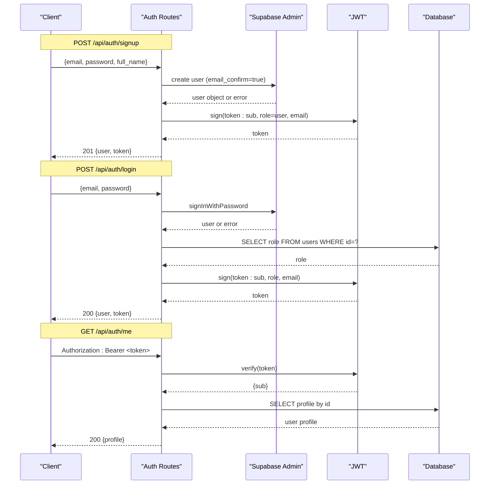
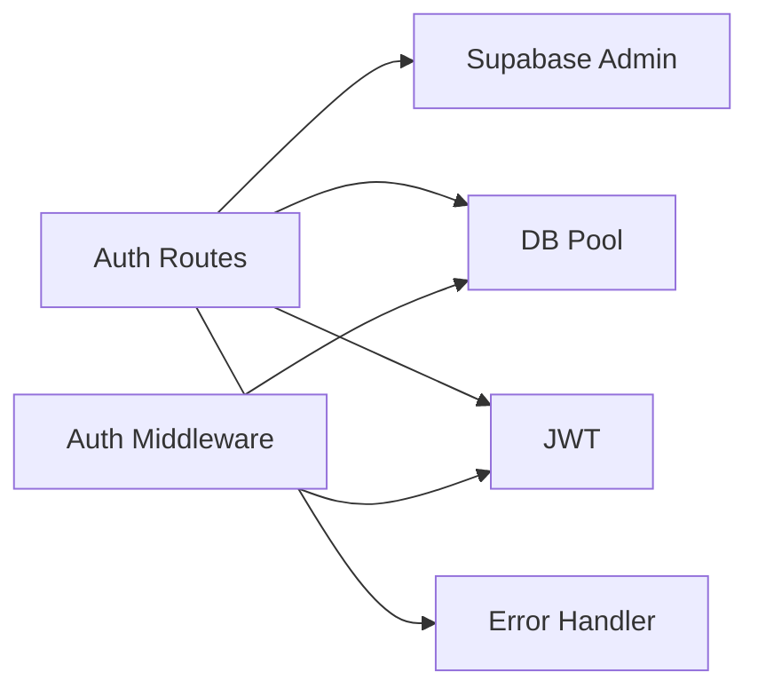

# Authentication Endpoints

<cite>
**Referenced Files in This Document**
- [auth.ts](file://backend/src/routes/auth.ts)
- [auth.ts](file://backend/src/middleware/auth.ts)
- [supabase.ts](file://backend/src/db/supabase.ts)
- [errorHandler.ts](file://backend/src/middleware/errorHandler.ts)
- [API_DOCUMENTATION.md](file://backend/API_DOCUMENTATION.md)
</cite>

## Table of Contents
1. [Introduction](#introduction)
2. [Project Structure](#project-structure)
3. [Core Components](#core-components)
4. [Architecture Overview](#architecture-overview)
5. [Detailed Component Analysis](#detailed-component-analysis)
6. [Dependency Analysis](#dependency-analysis)
7. [Performance Considerations](#performance-considerations)
8. [Troubleshooting Guide](#troubleshooting-guide)
9. [Conclusion](#conclusion)

## Introduction
This document specifies the authentication REST endpoints for user signup, login, and profile retrieval. It covers HTTP methods, URL patterns, request/response schemas, status codes, error handling, and practical usage examples. The backend integrates with Supabase Auth for user management and issues a custom JWT for subsequent API calls.

## Project Structure
The authentication functionality is implemented under the backend routes and middleware:
- Routes define /api/auth/signup, /api/auth/login, and /api/auth/me.
- Middleware provides JWT verification and role-based guards.
- Supabase client configuration supports admin operations for auth.
- Error handling centralizes error responses.

**Diagram sources**
- [auth.ts:12-98](file://backend/src/routes/auth.ts#L12-L98)
- [supabase.ts:4-20](file://backend/src/db/supabase.ts#L4-L20)
- [errorHandler.ts:16-47](file://backend/src/middleware/errorHandler.ts#L16-L47)

**Section sources**
- [auth.ts:12-98](file://backend/src/routes/auth.ts#L12-L98)
- [supabase.ts:4-20](file://backend/src/db/supabase.ts#L4-L20)
- [errorHandler.ts:16-47](file://backend/src/middleware/errorHandler.ts#L16-L47)

## Core Components
- Signup endpoint creates a Supabase Auth user and returns a JWT along with minimal user info.
- Login endpoint authenticates via Supabase Auth, fetches role from the users table, and returns a JWT.
- Profile endpoint verifies a Bearer token and returns the current user’s profile from the database.
- Authentication middleware validates tokens and can enforce admin roles on protected routes.

Key responsibilities:
- Supabase Admin client used for creating users and signing in.
- JWT issued by the server for subsequent API authorization.
- Centralized error handling returning consistent error shapes.

**Section sources**
- [auth.ts:12-98](file://backend/src/routes/auth.ts#L12-L98)
- [auth.ts:18-37](file://backend/src/middleware/auth.ts#L18-L37)
- [errorHandler.ts:4-14](file://backend/src/middleware/errorHandler.ts#L4-L14)

## Architecture Overview
The authentication flow uses Supabase Auth for identity and a server-side JWT for API authorization.

**Diagram sources**
- [auth.ts:16-98](file://backend/src/routes/auth.ts#L16-L98)
- [supabase.ts:8-20](file://backend/src/db/supabase.ts#L8-L20)

## Detailed Component Analysis

### Endpoint: POST /api/auth/signup
- Purpose: Register a new user using Supabase Auth and issue a JWT.
- Method: POST
- URL: /api/auth/signup
- Headers: Content-Type: application/json
- Request body schema:
  - email: string (required)
  - password: string (required)
  - full_name: string (optional)
- Success response (201 Created):
  - user: object
    - id: string
    - email: string
    - full_name: string
  - token: string (JWT)
- Error responses:
  - 400 Bad Request: Signup failed (e.g., invalid input or provider error)
  - 500 Internal Server Error: Unexpected server error
- Notes:
  - Email confirmation is enforced server-side during creation.
  - A custom JWT is issued for subsequent API calls.

Practical usage examples:
- cURL:
  - curl -X POST http://localhost:4000/api/auth/signup -H "Content-Type: application/json" -d '{"email":"user@example.com","password":"SecurePassword123!","full_name":"Jane Doe"}'
- JavaScript fetch:
  - fetch('/api/auth/signup', { method: 'POST', headers: {'Content-Type':'application/json'}, body: JSON.stringify({email:'user@example.com',password:'SecurePassword123!',full_name:'Jane Doe'}) })

Authentication requirements: None (public endpoint).

**Section sources**
- [auth.ts:12-41](file://backend/src/routes/auth.ts#L12-L41)
- [API_DOCUMENTATION.md:45-84](file://backend/API_DOCUMENTATION.md#L45-L84)

### Endpoint: POST /api/auth/login
- Purpose: Authenticate an existing user with email/password and return a JWT.
- Method: POST
- URL: /api/auth/login
- Headers: Content-Type: application/json
- Request body schema:
  - email: string (required)
  - password: string (required)
- Success response (200 OK):
  - user: object
    - id: string
    - email: string
    - role: string (from users table; defaults to user if missing)
  - token: string (JWT)
- Error responses:
  - 401 Unauthorized: Invalid email or password
  - 500 Internal Server Error: Unexpected server error
- Notes:
  - Role is fetched from the users table after successful authentication.

Practical usage examples:
- cURL:
  - curl -X POST http://localhost:4000/api/auth/login -H "Content-Type: application/json" -d '{"email":"user@example.com","password":"SecurePassword123!"}'
- JavaScript fetch:
  - fetch('/api/auth/login', { method: 'POST', headers: {'Content-Type':'application/json'}, body: JSON.stringify({email:'user@example.com',password:'SecurePassword123!'}) })

Authentication requirements: None (public endpoint).

**Section sources**
- [auth.ts:42-72](file://backend/src/routes/auth.ts#L42-L72)
- [API_DOCUMENTATION.md:88-126](file://backend/API_DOCUMENTATION.md#L88-L126)

### Endpoint: GET /api/auth/me
- Purpose: Retrieve the current authenticated user’s profile.
- Method: GET
- URL: /api/auth/me
- Headers: Authorization: Bearer <token>
- Success response (200 OK):
  - Object containing user profile fields such as id, email, full_name, phone, avatar_url, role, preferred_lang, created_at
- Error responses:
  - 401 Unauthorized: Missing or invalid token
  - 404 Not Found: User not found
  - 500 Internal Server Error: Unexpected server error
- Notes:
  - Token is verified server-side before querying the database.

Practical usage examples:
- cURL:
  - curl -H "Authorization: Bearer <token>" http://localhost:4000/api/auth/me
- JavaScript fetch:
  - fetch('/api/auth/me', { headers: {'Authorization':'Bearer <token>'} })

Authentication requirements: Required (Bearer token).

**Section sources**
- [auth.ts:74-98](file://backend/src/routes/auth.ts#L74-L98)

### Authentication Middleware
- authenticate: Validates Bearer token and attaches userId/userRole to the request.
- requireAdmin: Ensures the authenticated user has admin role by checking the database.

Usage:
- Apply authenticate to protected routes.
- Chain requireAdmin after authenticate for admin-only endpoints.

Error behavior:
- Returns 401 for missing/invalid/expired tokens.
- Returns 403 when admin role is required but not present.

**Section sources**
- [auth.ts:18-58](file://backend/src/middleware/auth.ts#L18-L58)

## Dependency Analysis
- Routes depend on:
  - Supabase Admin client for user creation and sign-in.
  - Database pool for role lookup and profile retrieval.
  - JWT library for issuing and verifying tokens.
  - Error handler for consistent error responses.

**Diagram sources**
- [auth.ts:12-98](file://backend/src/routes/auth.ts#L12-L98)
- [auth.ts:18-58](file://backend/src/middleware/auth.ts#L18-L58)
- [supabase.ts:8-20](file://backend/src/db/supabase.ts#L8-L20)
- [errorHandler.ts:16-47](file://backend/src/middleware/errorHandler.ts#L16-L47)

**Section sources**
- [auth.ts:12-98](file://backend/src/routes/auth.ts#L12-L98)
- [auth.ts:18-58](file://backend/src/middleware/auth.ts#L18-L58)
- [supabase.ts:8-20](file://backend/src/db/supabase.ts#L8-L20)
- [errorHandler.ts:16-47](file://backend/src/middleware/errorHandler.ts#L16-L47)

## Performance Considerations
- Minimize database queries: Only query roles/profiles when necessary.
- Cache JWT verification where appropriate at the gateway level (if applicable).
- Ensure Supabase connections are pooled and configured for production.
- Avoid heavy processing in auth handlers; keep them fast and stateless.

[No sources needed since this section provides general guidance]

## Troubleshooting Guide
Common errors and their meanings:
- 400 Bad Request: Validation failure or provider error during signup.
- 401 Unauthorized: Missing, invalid, or expired token; invalid credentials.
- 403 Forbidden: Insufficient permissions (e.g., admin required).
- 404 Not Found: Resource not found (e.g., user profile).
- 429 Too Many Requests: Rate limiting or retry limits exceeded.
- 500 Internal Server Error: Unexpected server error.

Error response shape:
- { status: "error", message: "..." }

Tips:
- Verify Authorization header format: "Bearer <token>".
- Check token expiration and ensure it is refreshed when needed.
- Validate request payloads against documented schemas.

**Section sources**
- [errorHandler.ts:16-47](file://backend/src/middleware/errorHandler.ts#L16-L47)
- [API_DOCUMENTATION.md:782-800](file://backend/API_DOCUMENTATION.md#L782-L800)

## Conclusion
The authentication endpoints provide secure user registration, login, and profile retrieval with Supabase Auth integration and server-issued JWTs. Use the provided schemas and examples to integrate clients effectively. Always include a valid Bearer token for protected endpoints and handle error responses consistently.

[No sources needed since this section summarizes without analyzing specific files]