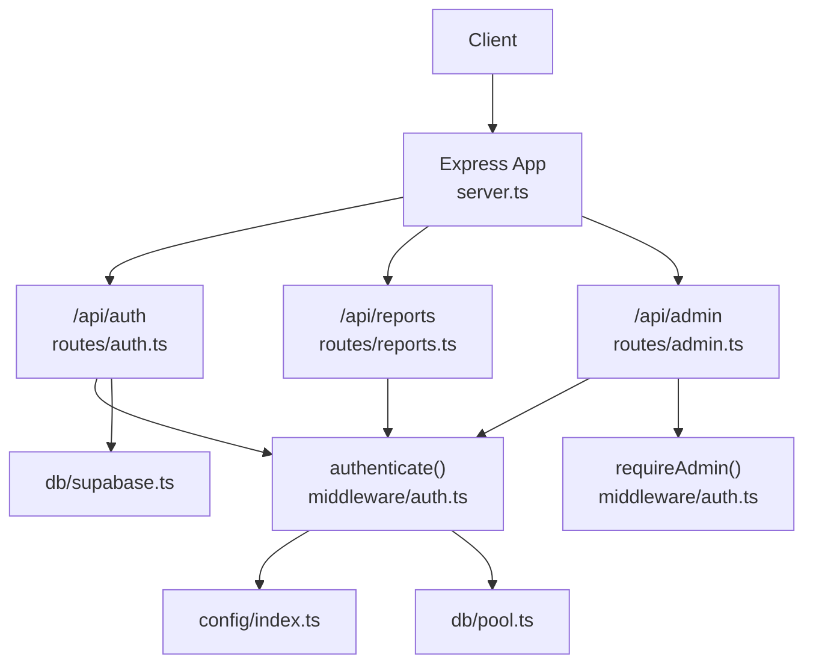
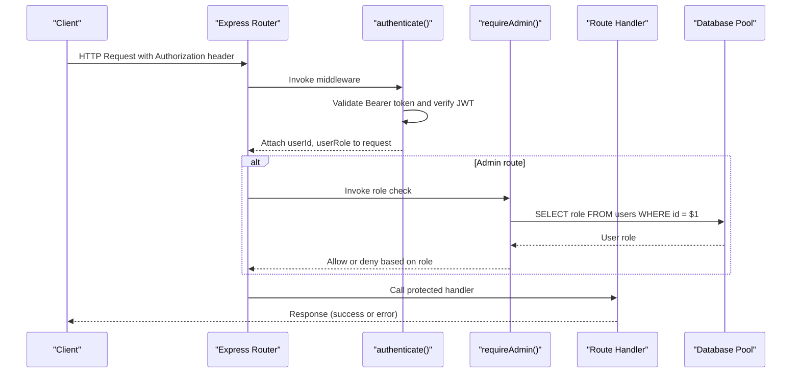
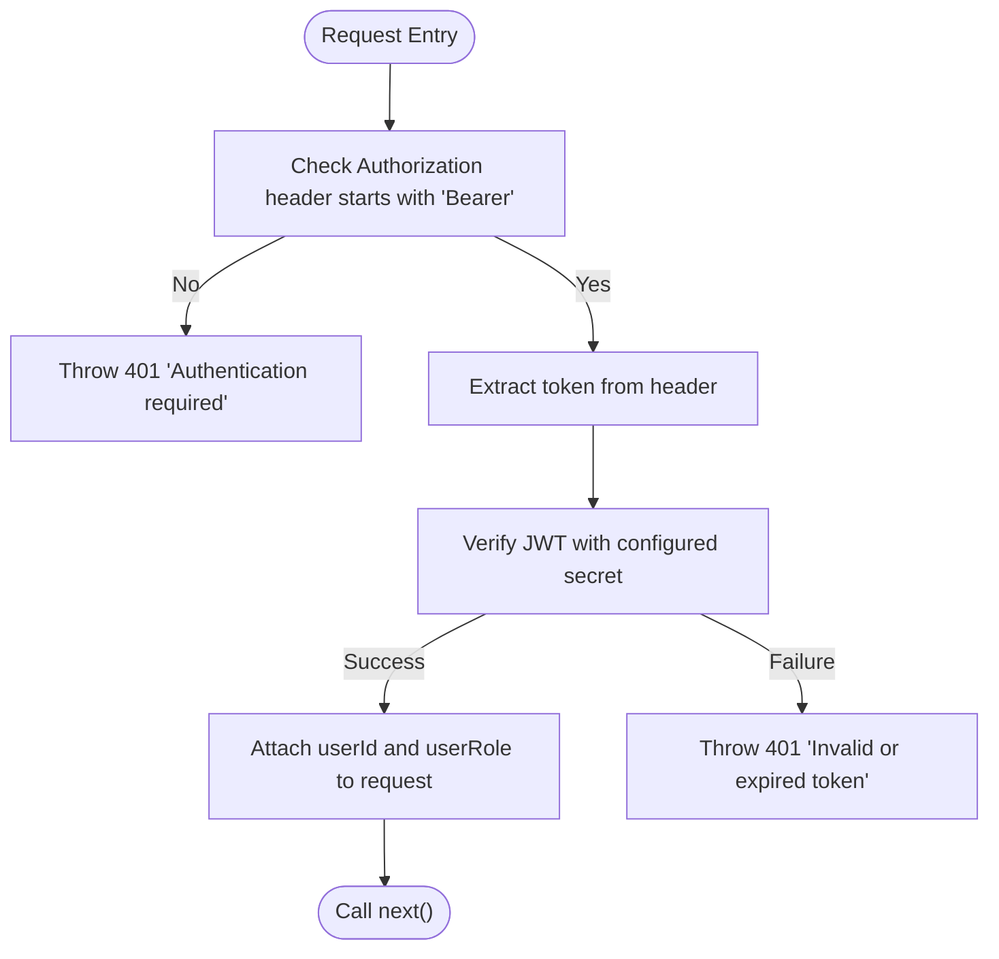
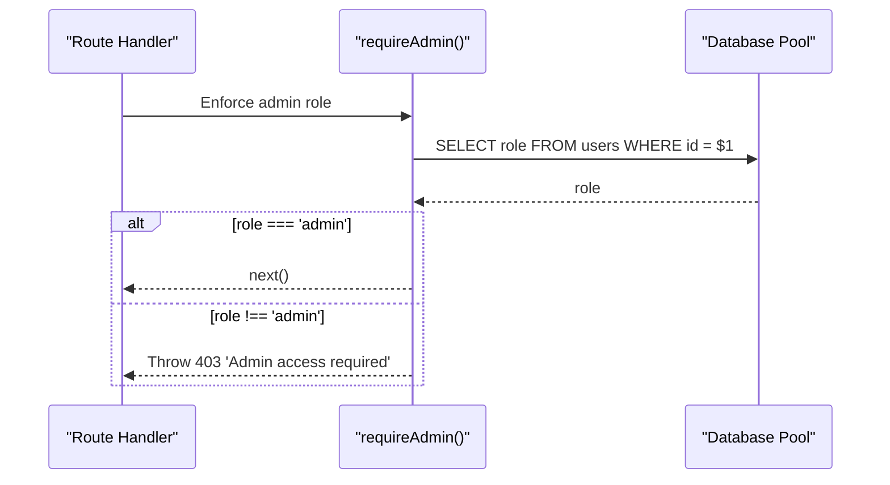
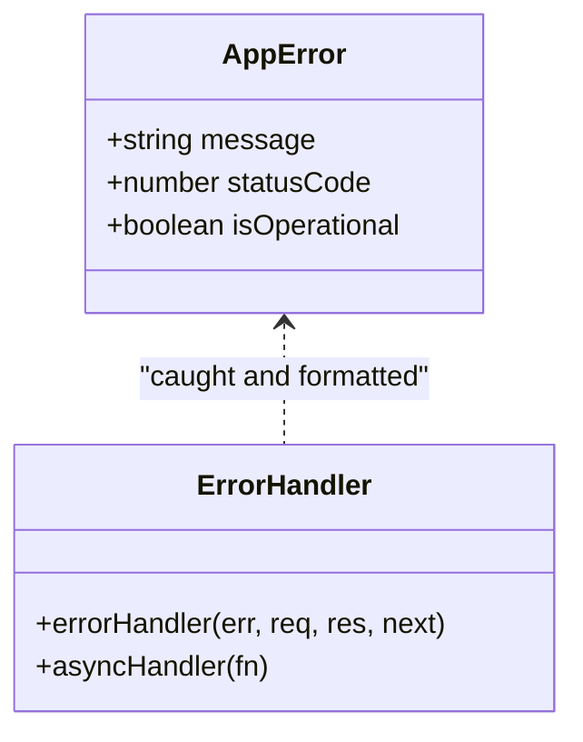
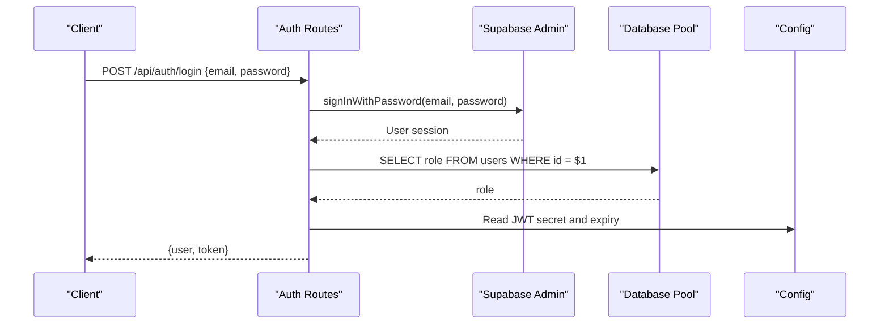
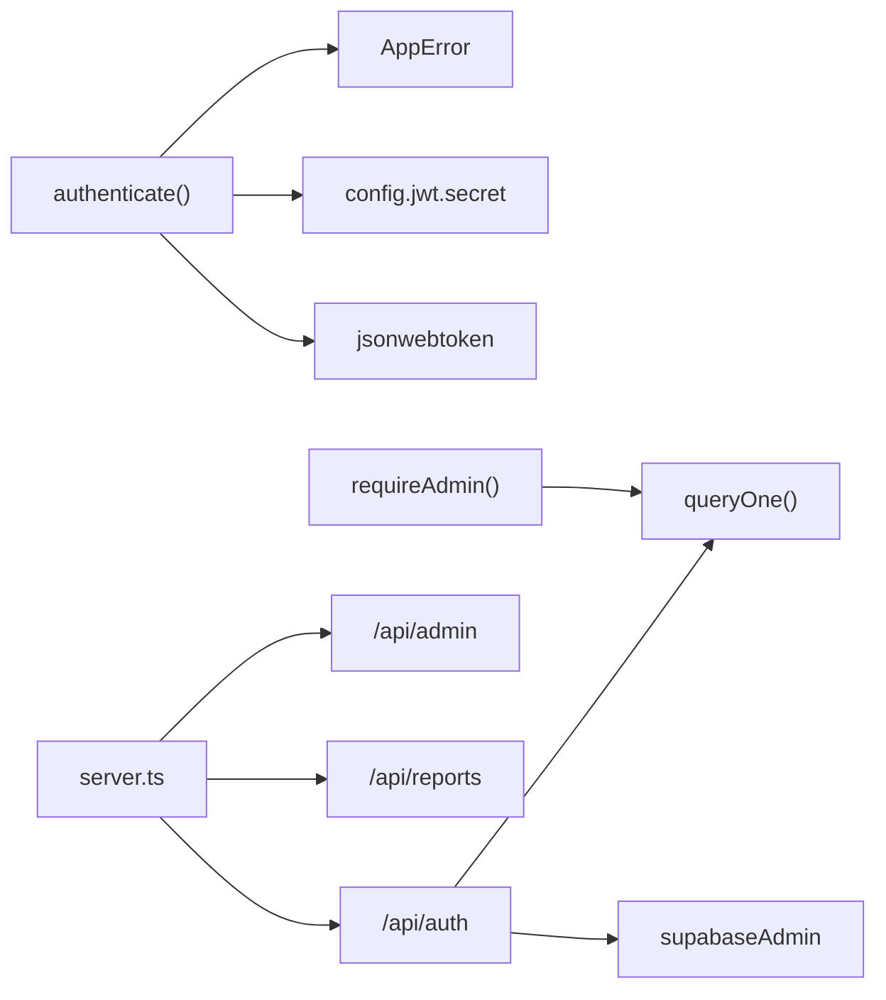

# Authentication Middleware

<cite>
**Referenced Files in This Document**
- [auth.ts](file://backend/src/middleware/auth.ts)
- [errorHandler.ts](file://backend/src/middleware/errorHandler.ts)
- [index.ts](file://backend/src/config/index.ts)
- [pool.ts](file://backend/src/db/pool.ts)
- [supabase.ts](file://backend/src/db/supabase.ts)
- [auth.ts](file://backend/src/routes/auth.ts)
- [reports.ts](file://backend/src/routes/reports.ts)
- [admin.ts](file://backend/src/routes/admin.ts)
- [server.ts](file://backend/src/server.ts)
</cite>

## Table of Contents
1. [Introduction](#introduction)
2. [Project Structure](#project-structure)
3. [Core Components](#core-components)
4. [Architecture Overview](#architecture-overview)
5. [Detailed Component Analysis](#detailed-component-analysis)
6. [Dependency Analysis](#dependency-analysis)
7. [Performance Considerations](#performance-considerations)
8. [Troubleshooting Guide](#troubleshooting-guide)
9. [Conclusion](#conclusion)

## Introduction
This document explains the authentication middleware implementation that protects routes, validates JWT tokens, enforces role-based authorization, and augments request context with user identity and role. It covers how routes are secured using middleware decorators, how sessions are validated via JWT, how roles are extracted and verified, and how errors are handled consistently across the application.

## Project Structure
The authentication system is implemented as Express middleware and integrated into route modules:
- Authentication middleware defines a typed request interface, token verification, and admin-only enforcement.
- Auth routes handle signup, login, and profile retrieval, issuing and validating JWTs.
- Protected routes apply middleware to enforce authentication and optional role checks.
- Error handling centralizes error responses for consistent client feedback.

**Diagram sources**
- [server.ts:18-38](file://backend/src/server.ts#L18-L38)
- [auth.ts:22-58](file://backend/src/middleware/auth.ts#L22-L58)
- [auth.ts:16-98](file://backend/src/routes/auth.ts#L16-L98)
- [reports.ts:11-14](file://backend/src/routes/reports.ts#L11-L14)
- [admin.ts:1-12](file://backend/src/routes/admin.ts#L1-L12)

**Section sources**
- [server.ts:18-38](file://backend/src/server.ts#L18-L38)
- [auth.ts:22-58](file://backend/src/middleware/auth.ts#L22-L58)
- [auth.ts:16-98](file://backend/src/routes/auth.ts#L16-L98)
- [reports.ts:11-14](file://backend/src/routes/reports.ts#L11-L14)
- [admin.ts:1-12](file://backend/src/routes/admin.ts#L1-L12)

## Core Components
- AuthRequest interface extends Express Request to include userId and userRole for downstream handlers.
- authenticate middleware validates Bearer tokens, decodes JWT, and attaches identity to the request.
- requireAdmin middleware ensures the authenticated user has an admin role by checking the database.
- errorHandler provides a standardized AppError class and async handler wrapper for consistent error responses.
- config exposes JWT secret and expiration used for signing and verifying tokens.
- db pool and Supabase clients support role resolution and user management.

Key responsibilities:
- Token validation and extraction of claims.
- Role-based access control (RBAC) for sensitive endpoints.
- Centralized error formatting for consistent API responses.

**Section sources**
- [auth.ts:7-16](file://backend/src/middleware/auth.ts#L7-L16)
- [auth.ts:22-58](file://backend/src/middleware/auth.ts#L22-L58)
- [errorHandler.ts:4-55](file://backend/src/middleware/errorHandler.ts#L4-L55)
- [index.ts:28-31](file://backend/src/config/index.ts#L28-L31)
- [pool.ts:34-48](file://backend/src/db/pool.ts#L34-L48)
- [supabase.ts:4-20](file://backend/src/db/supabase.ts#L4-L20)

## Architecture Overview
The authentication flow consists of:
- Clients send requests with Authorization: Bearer <token>.
- authenticate middleware verifies the token using the configured secret and extracts sub, role, and email.
- For admin routes, requireAdmin queries the users table to confirm the current user’s role is admin.
- Handlers receive a typed request with userId and userRole, enabling safe data access and role-based logic.
- Errors thrown as AppError are caught by the global error handler and returned as structured JSON.

**Diagram sources**
- [auth.ts:22-58](file://backend/src/middleware/auth.ts#L22-L58)
- [pool.ts:42-48](file://backend/src/db/pool.ts#L42-L48)
- [admin.ts:1-12](file://backend/src/routes/admin.ts#L1-L12)

## Detailed Component Analysis

### AuthRequest Interface Extension
- Extends Express Request to include userId and userRole fields.
- Provides type safety for handlers that rely on authenticated context.

Usage examples:
- In report routes, userId is used to associate new reports with the authenticated user.
- In admin routes, userRole is checked to allow or deny access to administrative operations.

**Section sources**
- [auth.ts:7-10](file://backend/src/middleware/auth.ts#L7-L10)
- [reports.ts:101-107](file://backend/src/routes/reports.ts#L101-L107)
- [admin.ts:18-47](file://backend/src/routes/admin.ts#L18-L47)

### JWT Verification Process
- The authenticate middleware reads the Authorization header, expects a Bearer token, and verifies it against the configured secret.
- On success, it decodes the payload and attaches sub (userId), role, and email to the request.
- On failure (missing header, malformed token, expired token), it throws a standardized 401 error.

**Diagram sources**
- [auth.ts:22-37](file://backend/src/middleware/auth.ts#L22-L37)
- [index.ts:28-31](file://backend/src/config/index.ts#L28-L31)

**Section sources**
- [auth.ts:22-37](file://backend/src/middleware/auth.ts#L22-L37)
- [index.ts:28-31](file://backend/src/config/index.ts#L28-L31)

### Role Extraction and Authorization Checks
- Roles are embedded in the JWT during sign-in and signup flows.
- For admin-only routes, requireAdmin performs a database lookup to ensure the current user’s role is admin before allowing access.
- Non-admin users attempting admin actions receive a 403 response.

**Diagram sources**
- [auth.ts:43-58](file://backend/src/middleware/auth.ts#L43-L58)
- [pool.ts:42-48](file://backend/src/db/pool.ts#L42-L48)

**Section sources**
- [auth.ts:43-58](file://backend/src/middleware/auth.ts#L43-L58)
- [admin.ts:1-12](file://backend/src/routes/admin.ts#L1-L12)

### Protecting Routes with Middleware Decorators
- Public auth endpoints (signup, login) do not use authentication middleware.
- Protected endpoints under /api/reports apply authenticate globally at the router level.
- Admin endpoints under /api/admin apply both authenticate and requireAdmin globally at the router level.

Examples:
- Reports: All report routes require authentication; handlers can safely read req.userId and req.userRole.
- Admin: All admin routes require authentication and admin role; handlers can perform privileged operations.

**Section sources**
- [reports.ts:11-14](file://backend/src/routes/reports.ts#L11-L14)
- [admin.ts:1-12](file://backend/src/routes/admin.ts#L1-L12)

### Implementing Custom Authorization Logic Based on User Roles
- Beyond admin checks, handlers can implement fine-grained authorization using req.userRole and resource ownership checks.
- Example pattern: Allow owners or admins to view private details; otherwise return redacted data.

Implementation references:
- Owner vs admin visibility for found items’ private_details.
- Access control when fetching a user’s own reports versus others.

**Section sources**
- [reports.ts:303-316](file://backend/src/routes/reports.ts#L303-L316)
- [reports.ts:253-279](file://backend/src/routes/reports.ts#L253-L279)

### Handling Authentication Errors Consistently
- All authentication-related errors are thrown as AppError with appropriate status codes (401 for missing/invalid tokens, 403 for insufficient permissions).
- The global error handler converts AppError instances into consistent JSON responses with status and message fields.
- Async route handlers are wrapped with asyncHandler to catch promise rejections and forward them to the error handler.

**Diagram sources**
- [errorHandler.ts:4-55](file://backend/src/middleware/errorHandler.ts#L4-L55)

**Section sources**
- [errorHandler.ts:4-55](file://backend/src/middleware/errorHandler.ts#L4-L55)
- [auth.ts:22-37](file://backend/src/middleware/auth.ts#L22-L37)
- [auth.ts:43-58](file://backend/src/middleware/auth.ts#L43-L58)

### Token Issuance and Session Validation
- Signup creates a Supabase user and issues a JWT containing sub, role, and email with a configurable expiration.
- Login authenticates via Supabase, fetches the user’s role from the database, signs a JWT, and returns it along with user info.
- Profile retrieval (/me) verifies the token and returns user details from the database.

**Diagram sources**
- [auth.ts:46-72](file://backend/src/routes/auth.ts#L46-L72)
- [supabase.ts:4-11](file://backend/src/db/supabase.ts#L4-L11)
- [pool.ts:42-48](file://backend/src/db/pool.ts#L42-L48)
- [index.ts:28-31](file://backend/src/config/index.ts#L28-L31)

**Section sources**
- [auth.ts:16-41](file://backend/src/routes/auth.ts#L16-L41)
- [auth.ts:46-72](file://backend/src/routes/auth.ts#L46-L72)
- [auth.ts:78-98](file://backend/src/routes/auth.ts#L78-L98)
- [supabase.ts:4-20](file://backend/src/db/supabase.ts#L4-L20)
- [index.ts:28-31](file://backend/src/config/index.ts#L28-L31)

## Dependency Analysis
- authenticate depends on:
  - jsonwebtoken for token verification.
  - config.jwt.secret for cryptographic verification.
  - errorHandler.AppError for consistent error responses.
- requireAdmin depends on:
  - db pool queryOne to fetch the user’s role from the users table.
- Auth routes depend on:
  - Supabase admin client for user creation and sign-in.
  - db pool to resolve roles and retrieve user profiles.
- Route modules mount routers via server.ts, applying middleware at router scope for clean separation of concerns.

**Diagram sources**
- [auth.ts:22-58](file://backend/src/middleware/auth.ts#L22-L58)
- [auth.ts:16-98](file://backend/src/routes/auth.ts#L16-L98)
- [server.ts:32-38](file://backend/src/server.ts#L32-L38)

**Section sources**
- [auth.ts:22-58](file://backend/src/middleware/auth.ts#L22-L58)
- [auth.ts:16-98](file://backend/src/routes/auth.ts#L16-L98)
- [server.ts:32-38](file://backend/src/server.ts#L32-L38)

## Performance Considerations
- JWT verification is CPU-bound but fast; avoid unnecessary re-verification by caching tokens on the client side and reusing valid tokens until expiry.
- Database lookups for role checks occur per admin request; consider indexing the users.id column and minimizing repeated queries if high concurrency is expected.
- Use rate limiting at the API layer to mitigate brute-force attempts on authentication endpoints.
- Keep token payloads minimal to reduce network overhead; only include necessary claims (sub, role, email).

[No sources needed since this section provides general guidance]

## Troubleshooting Guide
Common issues and resolutions:
- Missing or malformed Authorization header: Ensure clients send Authorization: Bearer <token>. The middleware will return 401 with a clear message.
- Invalid or expired token: Re-authenticate to obtain a fresh token. Tokens expire after the configured duration.
- Insufficient permissions: If accessing admin routes without admin role, expect 403. Confirm the user’s role in the database.
- Unexpected errors: The global error handler returns a standardized JSON structure; inspect logs for stack traces and error details.

Relevant error paths:
- Authentication required: 401 when no Bearer token is present.
- Invalid or expired token: 401 when JWT verification fails.
- Admin access required: 403 when the user lacks admin privileges.

**Section sources**
- [auth.ts:22-37](file://backend/src/middleware/auth.ts#L22-L37)
- [auth.ts:43-58](file://backend/src/middleware/auth.ts#L43-L58)
- [errorHandler.ts:16-47](file://backend/src/middleware/errorHandler.ts#L16-L47)

## Conclusion
The authentication middleware provides robust protection for API routes through JWT validation, role-based authorization, and consistent error handling. By extending the request object with userId and userRole, handlers can implement secure, scalable access controls. Admin routes enforce strict role checks via database verification, while public and protected routes are cleanly separated using Express router-level middleware. This design ensures predictable behavior, maintainable code, and a strong security posture for the Lost Found AI Matcher backend.