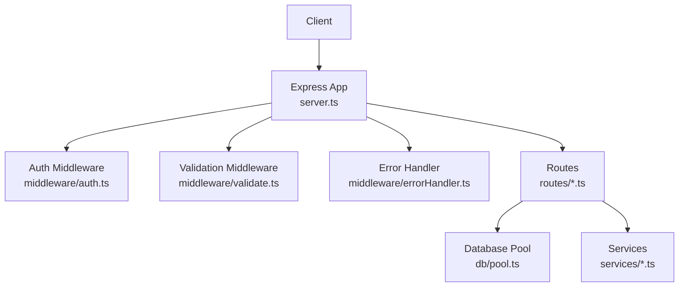
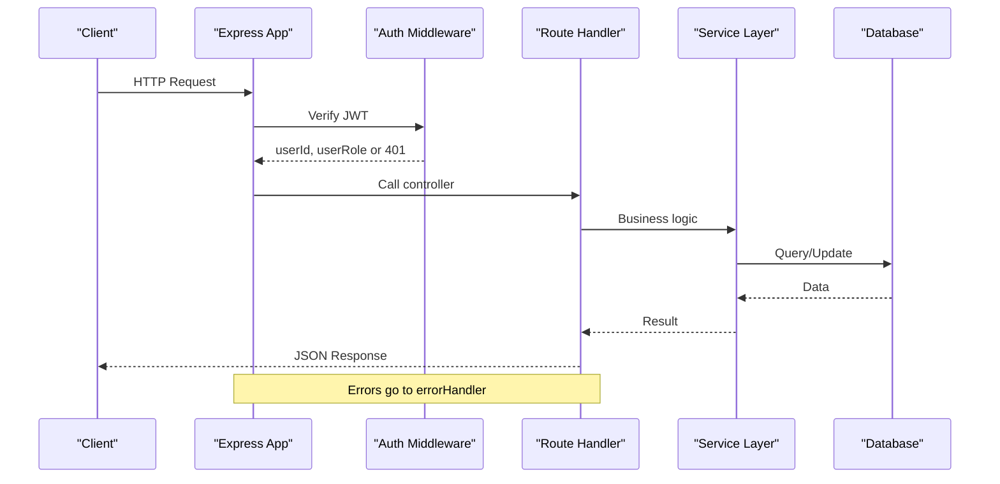
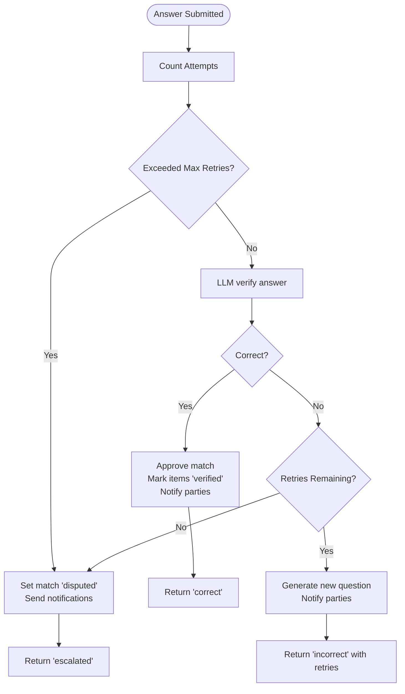
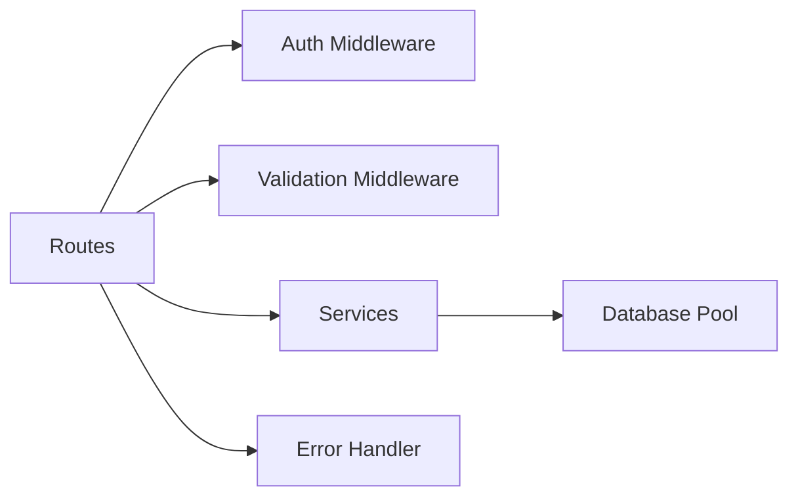

# Backend API

<cite>
**Referenced Files in This Document**
- [server.ts](file://backend/src/server.ts)
- [auth.ts](file://backend/src/middleware/auth.ts)
- [errorHandler.ts](file://backend/src/middleware/errorHandler.ts)
- [validate.ts](file://backend/src/middleware/validate.ts)
- [config/index.ts](file://backend/src/config/index.ts)
- [routes/auth.ts](file://backend/src/routes/auth.ts)
- [routes/reports.ts](file://backend/src/routes/reports.ts)
- [routes/matches.ts](file://backend/src/routes/matches.ts)
- [routes/verify.ts](file://backend/src/routes/verify.ts)
- [routes/admin.ts](file://backend/src/routes/admin.ts)
- [routes/notifications.ts](file://backend/src/routes/notifications.ts)
- [routes/messages.ts](file://backend/src/routes/messages.ts)
- [routes/upload.ts](file://backend/src/routes/upload.ts)
</cite>

## Table of Contents
1. Introduction
2. Project Structure
3. Core Components
4. Architecture Overview
5. Detailed Component Analysis
6. Dependency Analysis
7. Performance Considerations
8. Troubleshooting Guide
9. Conclusion
10. Appendices

## Introduction
This document provides comprehensive API documentation for the Express.js backend that powers the Lost & Found AI Matcher. It covers all RESTful endpoints across authentication, report management, matching, verification, notifications, messaging, and admin functions. For each endpoint, you will find HTTP methods, URL patterns, request/response schemas, authentication requirements, and error handling behavior. It also explains middleware architecture (authentication, validation, error handling), server setup, route organization, service layer integration, rate limiting, input validation, and security considerations.

## Project Structure
The backend is organized by feature into routes, with shared middleware for auth, validation, and error handling. The application bootstraps an Express app, applies global middleware (CORS, helmet, JSON parsing, logging, rate limiting), mounts route groups under /api/*, and wires a centralized error handler.

**Diagram sources**
- [server.ts:1-52](file://backend/src/server.ts#L1-L52)
- [auth.ts:1-59](file://backend/src/middleware/auth.ts#L1-L59)
- [validate.ts:1-61](file://backend/src/middleware/validate.ts#L1-L61)
- [errorHandler.ts:1-56](file://backend/src/middleware/errorHandler.ts#L1-L56)

**Section sources**
- [server.ts:1-52](file://backend/src/server.ts#L1-L52)
- [config/index.ts:1-49](file://backend/src/config/index.ts#L1-L49)

## Core Components
- Authentication: JWT-based authentication via Supabase Auth; roles enforced against the database.
- Validation: Joi-based request body validation middleware.
- Error Handling: Centralized error handler with standardized error responses and multer-specific messages.
- Rate Limiting: Global rate limiter applied to /api/* endpoints.
- Routing: Feature-based route modules mounted under /api.

Key responsibilities:
- server.ts: Express setup, global middleware, health check, route mounting, listener.
- middleware/auth.ts: JWT verification and role enforcement.
- middleware/validate.ts: Joi schema validation wrapper.
- middleware/errorHandler.ts: AppError class, async handler, multer error mapping.
- config/index.ts: Environment-driven configuration including JWT, matching parameters, and integrations.

**Section sources**
- [server.ts:18-45](file://backend/src/server.ts#L18-L45)
- [auth.ts:22-58](file://backend/src/middleware/auth.ts#L22-L58)
- [validate.ts:8-23](file://backend/src/middleware/validate.ts#L8-L23)
- [errorHandler.ts:4-55](file://backend/src/middleware/errorHandler.ts#L4-L55)
- [config/index.ts:6-48](file://backend/src/config/index.ts#L6-L48)

## Architecture Overview
The API follows a layered approach:
- Request enters Express, passes through global middleware (helmet, CORS, JSON parsing, morgan, rate limiter).
- Route-level middleware enforces authentication and optional role checks.
- Controllers validate inputs using Joi schemas.
- Business logic calls services (matching engine, embedding search, LLM, upload, verification, notifications).
- Database access uses a connection pool.
- Errors are caught and normalized by the error handler.

**Diagram sources**
- [server.ts:18-45](file://backend/src/server.ts#L18-L45)
- [auth.ts:22-37](file://backend/src/middleware/auth.ts#L22-L37)
- [errorHandler.ts:16-46](file://backend/src/middleware/errorHandler.ts#L16-L46)

## Detailed Component Analysis

### Authentication Endpoints
- POST /api/auth/signup
  - Purpose: Create a new user via Supabase Admin and issue a JWT.
  - Auth: None
  - Request body: email, password, full_name
  - Response: { user: { id, email, full_name }, token }
  - Errors: 400 on signup failure
- POST /api/auth/login
  - Purpose: Authenticate with email/password and return JWT with role.
  - Auth: None
  - Request body: email, password
  - Response: { user: { id, email, role }, token }
  - Errors: 401 on invalid credentials
- GET /api/auth/me
  - Purpose: Get current user profile from local users table.
  - Auth: Bearer JWT required
  - Response: User object (id, email, full_name, phone, avatar_url, role, preferred_lang, created_at)
  - Errors: 401 if missing/invalid token; 404 if user not found

Authentication flow:
- Login returns a JWT signed with configured secret and expiration.
- Subsequent requests must include Authorization: Bearer <token>.
- Role is validated against the database for protected routes.

**Section sources**
- [routes/auth.ts:16-51](file://backend/src/routes/auth.ts#L16-L51)
- [routes/auth.ts:57-83](file://backend/src/routes/auth.ts#L57-L83)
- [routes/auth.ts:89-108](file://backend/src/routes/auth.ts#L89-L108)
- [auth.ts:22-37](file://backend/src/middleware/auth.ts#L22-L37)
- [config/index.ts:28-31](file://backend/src/config/index.ts#L28-L31)

### Report Management Endpoints
- POST /api/reports/upload
  - Purpose: Upload and optimize a photo, return public URL.
  - Auth: Required
  - Content-Type: multipart/form-data with field "photo"
  - Response: { photo_url }
  - Errors: 400 if no file; multer errors handled centrally
- GET /api/reports
  - Purpose: List active lost and found items with pagination.
  - Auth: Required
  - Query params: page (default 1), limit (max 50, default 20), type (lost|found|all)
  - Response: { lost[], found[], pagination: { page, limit, total_lost, total_found } }
- POST /api/reports/lost
  - Purpose: Create a lost item report; optionally enrich fields via LLM and generate embeddings; run matching engine non-blocking; return similar found items.
  - Auth: Required
  - Request body: category, brand?, colour?, description, location, latitude?, longitude?, lost_at, photo_url?, identifying_info?
  - Response: Created item + matches[] + similar_found_items[]
  - Errors: 400 on validation failure
- POST /api/reports/found
  - Purpose: Create a found item report; optionally enrich fields via LLM and generate embeddings; run matching engine non-blocking; return similar lost items.
  - Auth: Required
  - Request body: category, brand?, colour?, description, location, latitude?, longitude?, found_at, photo_url?, private_details?
  - Response: Created item + matches[] + similar_lost_items[]
  - Errors: 400 on validation failure
- GET /api/reports/user/:userId
  - Purpose: Retrieve reports for a specific user (owner only or admin).
  - Auth: Required
  - Response: { lost[], found[] }
  - Errors: 403 if not owner/admin; 404 if not found
- GET /api/reports/found/:id
  - Purpose: Public view of a found item; hides private_details unless owner/admin.
  - Auth: Required
  - Response: Item fields; private_details included for owner/admin, otherwise null
  - Errors: 404 if not found
- GET /api/reports/:id
  - Purpose: Fetch a single report (lost or found); strips sensitive fields for non-owners.
  - Auth: Required
  - Response: Item fields (identifying_info hidden for non-owners)
  - Errors: 404 if not found

Notes:
- Matching runs asynchronously per report creation; failures do not block response.
- Embedding search may fail gracefully; results omitted if unavailable.

**Section sources**
- [routes/reports.ts:21-33](file://backend/src/routes/reports.ts#L21-L33)
- [routes/reports.ts:40-93](file://backend/src/routes/reports.ts#L40-L93)
- [routes/reports.ts:98-171](file://backend/src/routes/reports.ts#L98-L171)
- [routes/reports.ts:176-247](file://backend/src/routes/reports.ts#L176-L247)
- [routes/reports.ts:253-279](file://backend/src/routes/reports.ts#L253-L279)
- [routes/reports.ts:286-317](file://backend/src/routes/reports.ts#L286-L317)
- [routes/reports.ts:322-355](file://backend/src/routes/reports.ts#L322-L355)
- [validate.ts:27-51](file://backend/src/middleware/validate.ts#L27-L51)

### Matching Endpoints
- POST /api/matches/run/:reportId
  - Purpose: Trigger matching engine for a specific report.
  - Auth: Required
  - Query param: type=lost|found
  - Response: { report_id, match_count, matches[] }
  - Errors: 400 if invalid type; 404 if report not found; 403 if not owner/admin
- GET /api/matches/:reportId
  - Purpose: Retrieve existing matches for a report sorted by score descending.
  - Auth: Required
  - Query param: type=lost|found
  - Response: matches[] (scored details and related item info)
  - Errors: 400 if invalid type; 404 if report not found; 403 if not owner/admin

**Section sources**
- [routes/matches.ts:15-45](file://backend/src/routes/matches.ts#L15-L45)
- [routes/matches.ts:52-114](file://backend/src/routes/matches.ts#L52-L114)

### Verification Endpoints
- GET /api/verify/:matchId/question
  - Purpose: Retrieve or generate a verification question for a match.
  - Auth: Required (claimant or admin)
  - Response: { question_id, question_text }
  - Errors: 404 if match not found; 400 if no private details available; 403 if not claimant/admin
- POST /api/verify/:matchId/answer
  - Purpose: Submit answer; auto-verify via LLM; approve match on correct answer; escalate on max retries.
  - Auth: Required (claimant or admin)
  - Request body: answer
  - Response varies:
    - Correct: { attempt_id, attempt_number, result: "correct", message }
    - Incorrect with retries: { attempt_id, attempt_number, result: "incorrect", retries_remaining, message, new_question? }
    - Escalated: { attempt_id, attempt_number, result: "escalated", retries_remaining: 0, message }
  - Errors: 404 if match/question not found; 429 when max attempts reached
- POST /api/verify/:matchId/judge
  - Purpose: Finder override of system judgment; can approve or mark incorrect and potentially escalate.
  - Auth: Required (finder or admin)
  - Request body: is_correct, attempt_id
  - Response:
    - Approved: { result: "correct", message }
    - Incorrect with retries: { result: "incorrect", retries_remaining, message, new_question? }
    - Escalated: { result: "escalated", retries_remaining: 0, message }
  - Errors: 404 if match/attempt not found; 403 if not finder/admin

Verification flow highlights:
- Questions are generated from private_details; retries exclude previously used fields.
- On correct answer, match status becomes approved and both items marked verified; notifications sent.
- On incorrect answer, attempts counted; if exceeded, match set to disputed and escalated; notifications sent.

**Diagram sources**
- [verify.ts:89-293](file://backend/src/routes/verify.ts#L89-L293)
- [verify.ts:303-443](file://backend/src/routes/verify.ts#L303-L443)
- [config/index.ts:33-47](file://backend/src/config/index.ts#L33-L47)

**Section sources**
- [routes/verify.ts:20-79](file://backend/src/routes/verify.ts#L20-L79)
- [routes/verify.ts:89-293](file://backend/src/routes/verify.ts#L89-L293)
- [routes/verify.ts:303-443](file://backend/src/routes/verify.ts#L303-L443)
- [validate.ts:53-60](file://backend/src/middleware/validate.ts#L53-L60)
- [config/index.ts:33-47](file://backend/src/config/index.ts#L33-L47)

### Notifications Endpoints
- PATCH /api/notifications/read-all
  - Purpose: Mark all unread notifications for the authenticated user as read.
  - Auth: Required
  - Response: { message }
- GET /api/notifications/count
  - Purpose: Get unread notification count for the authenticated user.
  - Auth: Required
  - Response: { unread_count }
- GET /api/notifications
  - Purpose: Paginated list of notifications for the authenticated user.
  - Auth: Required
  - Query params: page (default 1), limit (default 20), unread=true to filter unread
  - Response: { notifications[], unread_count, page, limit }
- PATCH /api/notifications/:id/read
  - Purpose: Mark a single notification as read.
  - Auth: Required
  - Response: { message }

**Section sources**
- [routes/notifications.ts:14-21](file://backend/src/routes/notifications.ts#L14-L21)
- [routes/notifications.ts:27-34](file://backend/src/routes/notifications.ts#L27-L34)
- [routes/notifications.ts:40-69](file://backend/src/routes/notifications.ts#L40-L69)
- [routes/notifications.ts:75-84](file://backend/src/routes/notifications.ts#L75-L84)

### Messaging Endpoints
- GET /api/messages/:matchId
  - Purpose: Fetch message thread for an approved match (oldest first).
  - Auth: Required
  - Access: Only participants of the match (or admin)
  - Response: { messages[] }
  - Errors: 404 if match not found; 403 if not approved or not participant
- POST /api/messages/:matchId
  - Purpose: Send a message in the match thread.
  - Auth: Required
  - Request body: body (string, min 1, max 2000)
  - Response: Message object (id, sender_id, body, created_at)
  - Errors: 404 if match not found; 403 if not approved/participant; 400 on validation failure

Messaging is gated behind match approval to ensure safe communication between claimant and finder.

**Section sources**
- [routes/messages.ts:23-64](file://backend/src/routes/messages.ts#L23-L64)
- [routes/messages.ts:71-90](file://backend/src/routes/messages.ts#L71-L90)
- [routes/messages.ts:97-134](file://backend/src/routes/messages.ts#L97-L134)
- [validate.ts:14-16](file://backend/src/middleware/validate.ts#L14-L16)

### Admin Endpoints
- GET /api/admin/stats
  - Purpose: Dashboard statistics for lost/found items and matches.
  - Auth: Required (admin)
  - Response: { lost_items: { total, active }, found_items: { total, active }, matches: { total, pending, approved, disputed } }
- GET /api/admin/matches
  - Purpose: Paginated list of matches with optional status filter.
  - Auth: Required (admin)
  - Query params: page (default 1), limit (default 20), status (pending|approved|rejected|disputed)
  - Response: { page, limit, matches[] }
- POST /api/admin/matches/:id/approve
  - Purpose: Approve a match and mark items verified; notify parties.
  - Auth: Required (admin)
  - Response: { message }
  - Errors: 404 if match not found
- POST /api/admin/matches/:id/reject
  - Purpose: Reject a match; reset items to active if matched; notify parties.
  - Auth: Required (admin)
  - Response: { message }
  - Errors: 404 if match not found
- PATCH /api/admin/items/:id/status
  - Purpose: Update item status (active|matched|verified|returned|closed) with audit log and optional notifications.
  - Auth: Required (admin)
  - Request body: status, type (lost|found), reason?
  - Response: { message }
  - Errors: 400 on invalid inputs; 404 if item not found
- GET /api/admin/disputed
  - Purpose: List disputed or fraud-flagged matches with verification history.
  - Auth: Required (admin)
  - Query params: page (default 1), limit (default 20)
  - Response: { page, limit, total, matches[] } where each match includes questions[] and attempts[]
- POST /api/admin/matches/:id/flag
  - Purpose: Manually flag a match as fraudulent with a reason.
  - Auth: Required (admin)
  - Request body: reason (string, min 1, max 1000)
  - Response: { message }
  - Errors: 404 if match not found; 400 on validation failure
- POST /api/admin/matches/:id/unflag
  - Purpose: Remove fraud flag from a match.
  - Auth: Required (admin)
  - Response: { message }
  - Errors: 404 if match not found

**Section sources**
- [routes/admin.ts:18-47](file://backend/src/routes/admin.ts#L18-L47)
- [routes/admin.ts:53-83](file://backend/src/routes/admin.ts#L53-L83)
- [routes/admin.ts:88-128](file://backend/src/routes/admin.ts#L88-L128)
- [routes/admin.ts:133-180](file://backend/src/routes/admin.ts#L133-L180)
- [routes/admin.ts:186-228](file://backend/src/routes/admin.ts#L186-L228)
- [routes/admin.ts:235-307](file://backend/src/routes/admin.ts#L235-L307)
- [routes/admin.ts:317-364](file://backend/src/routes/admin.ts#L317-L364)
- [routes/admin.ts:371-388](file://backend/src/routes/admin.ts#L371-L388)

### Upload Endpoint
- POST /api/upload
  - Purpose: Upload image, resize, store in storage, and return public URL.
  - Auth: Required
  - Content-Type: multipart/form-data with field "photo"
  - Response: { url, fileName }
  - Errors: 400 if no file or unsupported type; 500 on storage failure

**Section sources**
- [routes/upload.ts:15-27](file://backend/src/routes/upload.ts#L15-L27)
- [routes/upload.ts:32-68](file://backend/src/routes/upload.ts#L32-L68)

## Dependency Analysis
- Authentication dependency chain:
  - Routes use authenticate middleware to attach userId and userRole.
  - requireAdmin ensures admin role by querying the database.
- Validation dependency chain:
  - Routes apply validateBody with Joi schemas to enforce input contracts.
- Service dependencies:
  - Reports and verification routes call services for LLM processing, matching, embeddings, uploads, and notifications.
- Database dependency:
  - All routes interact with the database via query/queryOne helpers.

**Diagram sources**
- [routes/auth.ts:1-109](file://backend/src/routes/auth.ts#L1-L109)
- [routes/reports.ts:1-356](file://backend/src/routes/reports.ts#L1-L356)
- [routes/verify.ts:1-444](file://backend/src/routes/verify.ts#L1-L444)
- [auth.ts:1-59](file://backend/src/middleware/auth.ts#L1-L59)
- [validate.ts:1-61](file://backend/src/middleware/validate.ts#L1-L61)
- [errorHandler.ts:1-56](file://backend/src/middleware/errorHandler.ts#L1-L56)

**Section sources**
- [auth.ts:22-58](file://backend/src/middleware/auth.ts#L22-L58)
- [validate.ts:8-23](file://backend/src/middleware/validate.ts#L8-L23)
- [errorHandler.ts:16-55](file://backend/src/middleware/errorHandler.ts#L16-L55)

## Performance Considerations
- Rate limiting: Global limiter caps requests to 100 per 15 minutes on /api/* to mitigate abuse.
- Pagination: Most list endpoints support page/limit to control payload size.
- Non-blocking operations: Matching and embedding searches are wrapped in try/catch to avoid blocking responses.
- Image resizing: Uploaded images are resized to reduce bandwidth and storage usage.
- Database queries: Use parameterized queries and selective column selection to minimize overhead.

[No sources needed since this section provides general guidance]

## Troubleshooting Guide
Common errors and their causes:
- 401 Unauthorized: Missing or invalid Authorization header; expired or malformed JWT.
- 403 Forbidden: Insufficient permissions (not owner/admin); accessing restricted resources.
- 400 Bad Request: Validation failures; missing required fields; invalid types; unsupported file types.
- 404 Not Found: Resource does not exist (reports, matches, items, attempts).
- 429 Too Many Requests: Rate limit exceeded; retry later.
- 500 Internal Server Error: Unexpected server-side errors; check logs.

Error handling pipeline:
- AppError instances produce consistent JSON error responses with status codes.
- Multer errors are mapped to user-friendly messages (e.g., file too large, unexpected field).
- Unhandled exceptions return a generic 500 error with a safe message.

**Section sources**
- [errorHandler.ts:4-46](file://backend/src/middleware/errorHandler.ts#L4-L46)
- [auth.ts:22-37](file://backend/src/middleware/auth.ts#L22-L37)
- [validate.ts:8-23](file://backend/src/middleware/validate.ts#L8-L23)

## Conclusion
The backend provides a secure, well-structured API for managing lost and found items, automated matching, verification workflows, notifications, messaging, and administrative oversight. Authentication and authorization are enforced at the middleware level, while input validation ensures data integrity. Centralized error handling standardizes responses, and rate limiting protects the system. Consumers should handle common error codes, respect rate limits, and follow the documented request/response schemas.

[No sources needed since this section summarizes without analyzing specific files]

## Appendices

### Middleware Architecture
- Authentication:
  - Verifies JWT from Authorization header.
  - Attaches userId and userRole to request context.
  - Admin role checked against database for admin-only routes.
- Validation:
  - Joi schemas define strict contracts for request bodies.
  - Validation errors aggregated and returned as a single message.
- Error Handling:
  - AppError class carries statusCode and message.
  - Centralized handler normalizes errors and handles multer-specific cases.

**Section sources**
- [auth.ts:22-58](file://backend/src/middleware/auth.ts#L22-L58)
- [validate.ts:8-23](file://backend/src/middleware/validate.ts#L8-L23)
- [errorHandler.ts:4-55](file://backend/src/middleware/errorHandler.ts#L4-L55)

### Security Considerations
- Use HTTPS in production; configure CORS to allow only trusted origins.
- Store JWT secrets securely via environment variables; rotate regularly.
- Enforce role checks server-side; never trust client-provided roles.
- Validate and sanitize all inputs; limit file sizes and types for uploads.
- Apply rate limiting to prevent abuse and protect downstream services.
- Minimize exposure of sensitive fields (e.g., private_details, identifying_info) based on ownership.

[No sources needed since this section provides general guidance]

### Client Implementation Guidelines
- Authentication:
  - Obtain JWT via login; include Authorization: Bearer <token> in subsequent requests.
- Requests:
  - Follow content-type requirements (application/json or multipart/form-data for uploads).
  - Adhere to pagination parameters for list endpoints.
- Error Handling:
  - Handle 401 by refreshing tokens or prompting re-login.
  - Handle 403 by checking permissions or requesting admin assistance.
  - Handle 400 by validating inputs before sending.
  - Respect 429 by backoff and retry after delay.
- Uploads:
  - Ensure images are within size limits and supported formats.
  - Use the provided endpoint to obtain URLs before creating reports.

[No sources needed since this section provides general guidance]