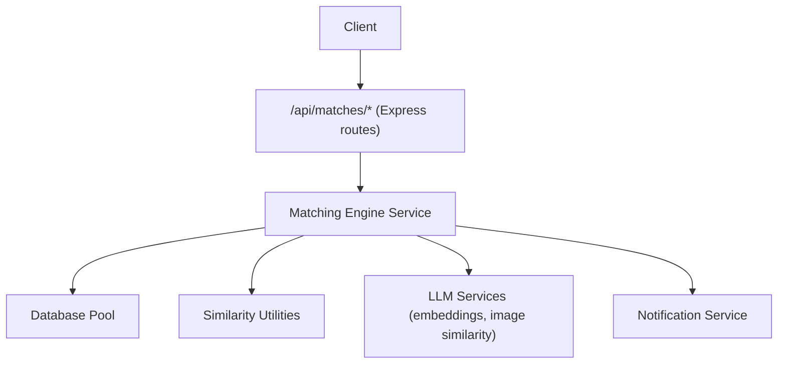
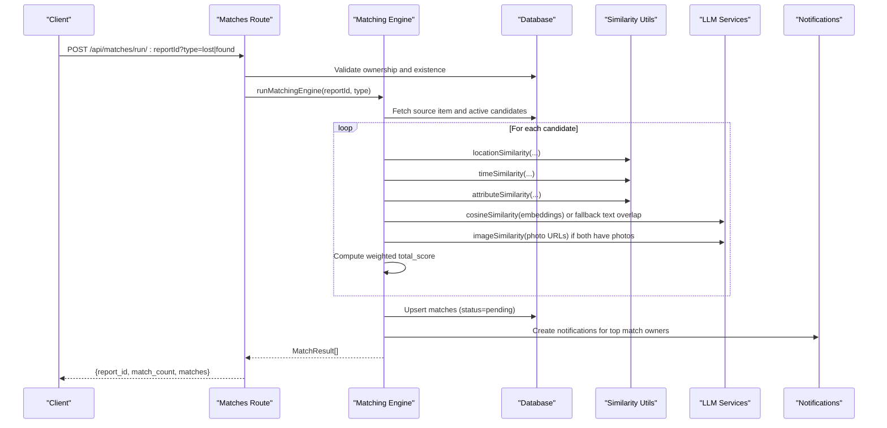
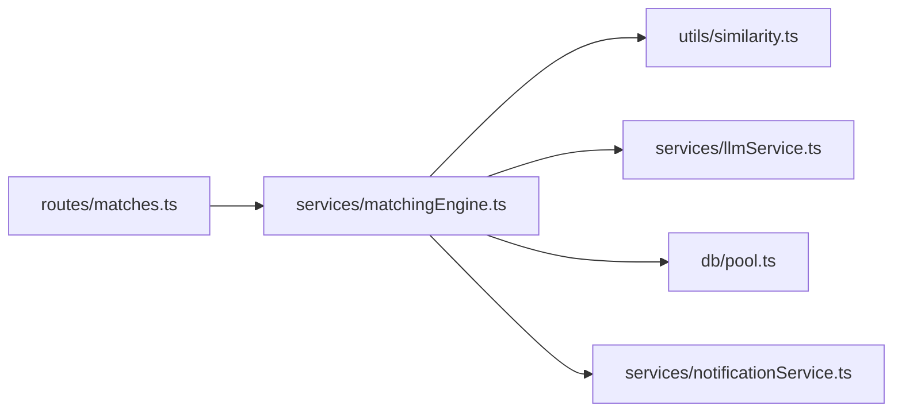
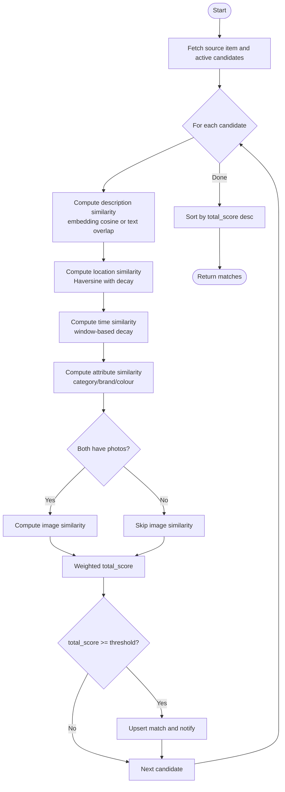

# Match Discovery

<cite>
**Referenced Files in This Document**
- [matches.ts](file://backend/src/routes/matches.ts)
- [matchingEngine.ts](file://backend/src/services/matchingEngine.ts)
- [similarity.ts](file://backend/src/utils/similarity.ts)
- [index.ts](file://backend/src/config/index.ts)
- [API_DOCUMENTATION.md](file://backend/API_DOCUMENTATION.md)
- [matching.test.ts](file://backend/tests/matching.test.ts)
</cite>

## Table of Contents
1. Introduction
2. Project Structure
3. Core Components
4. Architecture Overview
5. Detailed Component Analysis
6. Dependency Analysis
7. Performance Considerations
8. Troubleshooting Guide
9. Conclusion
10. Appendices

## Introduction
This document explains the match discovery endpoints that find potential matches between lost and found items, how the matching algorithm works, its parameters and weights, and how to interpret results. It includes request/response schemas for querying matches, score explanations, result formatting, and examples for different criteria.

## Project Structure
The match discovery feature is implemented as:
- API routes under backend/src/routes/matches.ts
- Matching engine service under backend/src/services/matchingEngine.ts
- Similarity utilities under backend/src/utils/similarity.ts
- Configuration for weights and thresholds under backend/src/config/index.ts
- Public API documentation under backend/API_DOCUMENTATION.md
- Unit tests validating behavior under backend/tests/matching.test.ts

**Diagram sources**
- [matches.ts:15-45](file://backend/src/routes/matches.ts#L15-L45)
- [matchingEngine.ts:37-188](file://backend/src/services/matchingEngine.ts#L37-L188)
- [similarity.ts:26-82](file://backend/src/utils/similarity.ts#L26-L82)
- [index.ts:33-47](file://backend/src/config/index.ts#L33-L47)

**Section sources**
- [matches.ts:15-114](file://backend/src/routes/matches.ts#L15-L114)
- [matchingEngine.ts:37-188](file://backend/src/services/matchingEngine.ts#L37-L188)
- [index.ts:33-47](file://backend/src/config/index.ts#L33-L47)

## Core Components
- Match endpoints:
  - POST /api/matches/run/:reportId?type=lost|found — triggers matching for a specific report
  - GET /api/matches/:reportId?type=lost|found — returns existing matches for a report
- Matching engine:
  - Computes per-factor scores (description, image, location, time, attributes)
  - Applies configurable weights and threshold
  - Persists matches and sends notifications
- Similarity utilities:
  - Location similarity via Haversine distance with decay
  - Time similarity with window-based decay
  - Attribute similarity across category, brand, colour
- Configuration:
  - Weights summing to 1.0
  - Minimum score threshold
  - Radius and time window parameters

**Section sources**
- [matches.ts:15-114](file://backend/src/routes/matches.ts#L15-L114)
- [matchingEngine.ts:37-188](file://backend/src/services/matchingEngine.ts#L37-L188)
- [similarity.ts:26-82](file://backend/src/utils/similarity.ts#L26-L82)
- [index.ts:33-47](file://backend/src/config/index.ts#L33-L47)

## Architecture Overview
The flow from client request to match results:

**Diagram sources**
- [matches.ts:15-45](file://backend/src/routes/matches.ts#L15-L45)
- [matchingEngine.ts:37-188](file://backend/src/services/matchingEngine.ts#L37-L188)
- [similarity.ts:26-82](file://backend/src/utils/similarity.ts#L26-L82)
- [index.ts:33-47](file://backend/src/config/index.ts#L33-L47)

## Detailed Component Analysis

### Match Endpoints
- POST /api/matches/run/:reportId?type=lost|found
  - Purpose: Manually trigger matching for a specific report
  - Auth: Requires JWT; user must own the report or be admin
  - Query params:
    - type: required; one of "lost" or "found"
  - Response:
    - report_id: string
    - match_count: number
    - matches: array of match objects (see schema below)
- GET /api/matches/:reportId?type=lost|found
  - Purpose: Retrieve stored matches for a report, sorted by total_score descending
  - Auth: Requires JWT; user must own the report or be admin
  - Query params:
    - type: required; one of "lost" or "found"
  - Response: array of match objects (see schema below)

Request/Response Schemas
- Common match object fields:
  - lost_item_id: string
  - found_item_id: string
  - total_score: number (0–100)
  - desc_score: number (0–100)
  - image_score: number (0–100 or null when not computed)
  - location_score: number (0–100)
  - time_score: number (0–100)
  - attr_score: number (0–100)
  - status: string ("pending", etc.)
  - created_at: ISO timestamp
- GET response may include joined fields for the counterpart item (e.g., found_category, found_brand, found_description, found_location, found_photo_url, found_at for type=lost; analogous lost_* fields for type=found).

Examples
- Trigger matching for a lost report:
  - POST "http://localhost:4000/api/matches/run/a1b2c3d4-e5f6-7890-abcd-ef1234567890?type=lost"
  - Headers: Authorization: Bearer <token>
- Get matches for a found report:
  - GET "http://localhost:4000/api/matches/b2c3d4e5-f6a7-8901-bcde-f12345678901?type=found"
  - Headers: Authorization: Bearer <token>

Error Handling
- 400: Invalid or missing query param type
- 403: Access denied (user does not own report and is not admin)
- 404: Report not found

**Section sources**
- [matches.ts:15-114](file://backend/src/routes/matches.ts#L15-L114)
- [API_DOCUMENTATION.md:419-512](file://backend/API_DOCUMENTATION.md#L419-L512)

### Matching Algorithm Parameters and Scoring
Weights and thresholds are configured centrally:
- Weights (must sum to 1.0):
  - description: 0.30
  - image: 0.25
  - location: 0.20
  - time: 0.15
  - attributes: 0.10
- Thresholds and windows:
  - minScoreThreshold: 40 (only matches at or above this are returned)
  - locationRadiusKm: 5 (full score within this radius)
  - timeWindowHours: 72 (full score within this window)

Scoring Details
- Description similarity:
  - Primary: cosine similarity of OpenAI embeddings
  - Fallback: simple word-overlap similarity when embeddings are unavailable
- Image similarity:
  - Computed only when both items have photo_url
  - Uses vision model comparison
- Location similarity:
  - Haversine distance converted to 0–100 score
  - Full score within locationRadiusKm; decays linearly to 0 at triple that radius
- Time similarity:
  - Based on absolute difference in hours
  - Full score within timeWindowHours; decays linearly to 0 at four times that window
- Attribute similarity:
  - Compares category (weight 50), brand (25), colour (25)
  - Exact match gives full field weight; substring match gives partial credit
  - Case-insensitive normalization

Total Score Formula
- total_score = round(
    desc_score * 0.30 +
    image_score * 0.25 +
    location_score * 0.20 +
    time_score * 0.15 +
    attr_score * 0.10
  )

Filtering
- Only matches with total_score >= minScoreThreshold are persisted and returned

**Section sources**
- [index.ts:33-47](file://backend/src/config/index.ts#L33-L47)
- [matchingEngine.ts:83-146](file://backend/src/services/matchingEngine.ts#L83-L146)
- [similarity.ts:26-82](file://backend/src/utils/similarity.ts#L26-L82)
- [API_DOCUMENTATION.md:19-39](file://backend/API_DOCUMENTATION.md#L19-L39)

### Result Formatting and Interpretation
- Matches are sorted by total_score descending
- Each match includes a breakdown of component scores for transparency
- Status is set to "pending" upon creation
- Notifications are sent to owners of the top match pair

Interpreting Confidence Levels
- 80–100: High confidence match; strong agreement across multiple factors
- 60–79: Moderate confidence; some factors align well, others less so
- 40–59: Low confidence but meets threshold; review recommended
- Below 40: Not surfaced by default

Example Scenarios
- High confidence:
  - Similar descriptions with embeddings, same location within 5 km, event times within 72 hours, matching attributes, and similar images
- Medium confidence:
  - Same category and brand, close location, slightly older time, no image
- Low confidence:
  - Partial attribute overlap, far location, large time gap, no image

**Section sources**
- [matchingEngine.ts:149-188](file://backend/src/services/matchingEngine.ts#L149-L188)
- [API_DOCUMENTATION.md:419-512](file://backend/API_DOCUMENTATION.md#L419-L512)

### Query Examples and Criteria
- Trigger matching for a lost item:
  - POST /api/matches/run/:reportId?type=lost
  - Use when you want to re-run matching after updating an item’s data
- Retrieve matches for a found item:
  - GET /api/matches/:reportId?type=found
  - Use to display ranked matches to the finder
- Adjusting criteria:
  - Change config.matching.minScoreThreshold to raise/lower the bar for matches
  - Increase/decrease config.matching.locationRadiusKm to tighten/loosen location sensitivity
  - Increase/decrease config.matching.timeWindowHours to adjust temporal relevance

Note: These endpoints do not accept dynamic query parameters to alter scoring at runtime; tuning is done via configuration.

**Section sources**
- [matches.ts:15-114](file://backend/src/routes/matches.ts#L15-L114)
- [index.ts:33-47](file://backend/src/config/index.ts#L33-L47)

## Dependency Analysis
The matching pipeline depends on:
- Database pool for reading/writing items and matches
- Similarity utilities for location/time/attribute scoring
- LLM services for embedding cosine similarity and image similarity
- Notification service to alert users about new matches

**Diagram sources**
- [matches.ts:1-6](file://backend/src/routes/matches.ts#L1-L6)
- [matchingEngine.ts:1-5](file://backend/src/services/matchingEngine.ts#L1-L5)

**Section sources**
- [matchingEngine.ts:1-5](file://backend/src/services/matchingEngine.ts#L1-L5)

## Performance Considerations
- Embedding computation and vector parsing occur per candidate; ensure embeddings exist for best performance and accuracy
- Image similarity calls are expensive; they are skipped when either item lacks a photo
- Candidate filtering excludes inactive items and same-user items to reduce workload
- Sorting and upserting matches are performed after scoring; consider batching for very large datasets

[No sources needed since this section provides general guidance]

## Troubleshooting Guide
Common issues and resolutions:
- No matches returned:
  - Verify type parameter is correct ("lost" or "found")
  - Check that target items are active and belong to different users
  - Ensure embeddings exist for description similarity; otherwise fallback applies
- Unexpected low scores:
  - Review location and time windows; adjust config values if necessary
  - Confirm coordinates and timestamps are valid and populated
- Authentication errors:
  - Ensure JWT is present and valid
  - Confirm the caller owns the report or has admin role

Validation and error responses follow standard HTTP codes and a consistent error shape.

**Section sources**
- [matches.ts:19-36](file://backend/src/routes/matches.ts#L19-L36)
- [API_DOCUMENTATION.md:782-800](file://backend/API_DOCUMENTATION.md#L782-L800)

## Conclusion
The match discovery system provides robust endpoints to compute and retrieve potential matches between lost and found items using a transparent, multi-factor scoring model. By understanding the weights, thresholds, and result format, you can effectively query matches, tune sensitivity, and interpret confidence levels for informed decisions.

[No sources needed since this section summarizes without analyzing specific files]

## Appendices

### Algorithm Flowchart

**Diagram sources**
- [matchingEngine.ts:83-188](file://backend/src/services/matchingEngine.ts#L83-L188)
- [similarity.ts:26-82](file://backend/src/utils/similarity.ts#L26-L82)
- [index.ts:33-47](file://backend/src/config/index.ts#L33-L47)

### Test Coverage Highlights
- Validates high-scoring near-identical items
- Ensures dissimilar items fall below threshold
- Confirms medium scores for same category with differing location/time
- Verifies fallback to text overlap when embeddings are missing

**Section sources**
- [matching.test.ts:68-199](file://backend/tests/matching.test.ts#L68-L199)