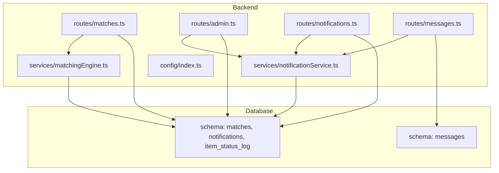
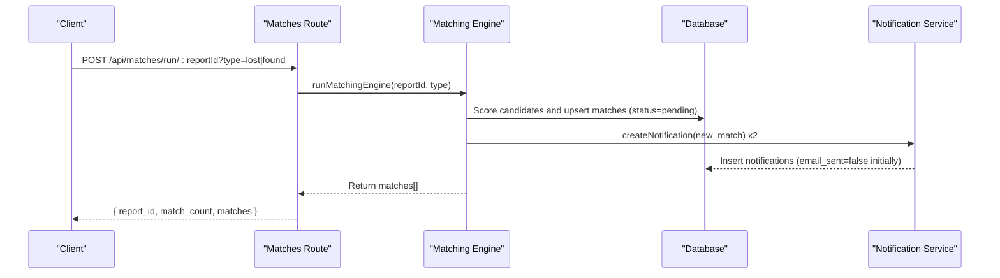
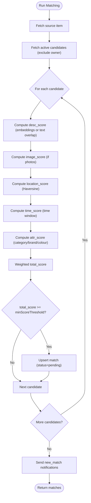
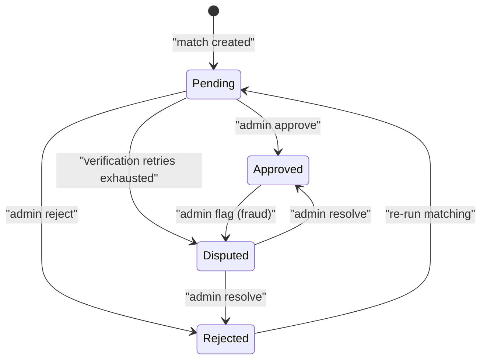
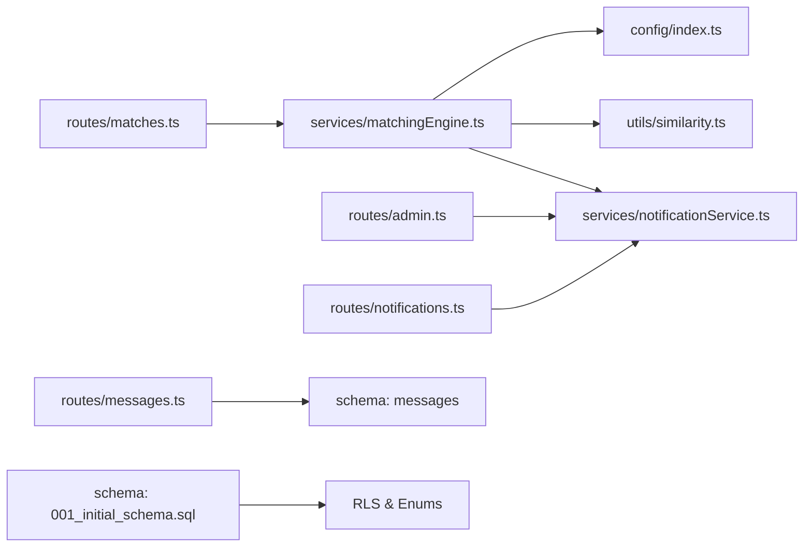

# Match Management

<cite>
**Referenced Files in This Document**
- [matches.ts](file://backend/src/routes/matches.ts)
- [matchingEngine.ts](file://backend/src/services/matchingEngine.ts)
- [notificationService.ts](file://backend/src/services/notificationService.ts)
- [notifications.ts](file://backend/src/routes/notifications.ts)
- [admin.ts](file://backend/src/routes/admin.ts)
- [messages.ts](file://backend/src/routes/messages.ts)
- [001_initial_schema.sql](file://supabase/migrations/001_initial_schema.sql)
- [002_messages.sql](file://supabase/migrations/002_messages.sql)
- [003_admin_fraud_flag.sql](file://supabase/migrations/003_admin_fraud_flag.sql)
- [index.ts](file://backend/src/config/index.ts)
- [API_DOCUMENTATION.md](file://backend/API_DOCUMENTATION.md)
</cite>

## Table of Contents
1. Introduction
2. Project Structure
3. Core Components
4. Architecture Overview
5. Detailed Component Analysis
6. Dependency Analysis
7. Performance Considerations
8. Troubleshooting Guide
9. Conclusion
10. Appendices

## Introduction
This document explains how discovered matches are managed end-to-end: from discovery and scoring to acceptance, rejection, escalation, notifications, and audit logging. It covers the match lifecycle, status transitions, notification triggers, and provides request/response schemas for key operations. It also includes examples that trace a complete match lifecycle from discovery to resolution.

## Project Structure
The match management system spans backend routes, services, database schema, and frontend routing:
- Routes expose endpoints for running matching, retrieving matches, managing notifications, messaging, and admin controls (approve/reject/flag/unflag).
- Services implement the matching engine, verification question generation, and notifications.
- Database schema defines enums for item and match statuses, tables for matches, notifications, messages, and audit logs.
- Configuration centralizes matching weights, thresholds, and retry limits.

**Diagram sources**
- [matches.ts:1-115](file://backend/src/routes/matches.ts#L1-L115)
- [admin.ts:1-389](file://backend/src/routes/admin.ts#L1-L389)
- [notifications.ts:1-86](file://backend/src/routes/notifications.ts#L1-L86)
- [messages.ts:1-136](file://backend/src/routes/messages.ts#L1-L136)
- [matchingEngine.ts:1-208](file://backend/src/services/matchingEngine.ts#L1-L208)
- [notificationService.ts:1-101](file://backend/src/services/notificationService.ts#L1-L101)
- [001_initial_schema.sql:145-236](file://supabase/migrations/001_initial_schema.sql#L145-L236)
- [002_messages.sql:8-20](file://supabase/migrations/002_messages.sql#L8-L20)

**Section sources**
- [matches.ts:1-115](file://backend/src/routes/matches.ts#L1-L115)
- [admin.ts:1-389](file://backend/src/routes/admin.ts#L1-L389)
- [notifications.ts:1-86](file://backend/src/routes/notifications.ts#L1-L86)
- [messages.ts:1-136](file://backend/src/routes/messages.ts#L1-L136)
- [matchingEngine.ts:1-208](file://backend/src/services/matchingEngine.ts#L1-L208)
- [notificationService.ts:1-101](file://backend/src/services/notificationService.ts#L1-L101)
- [001_initial_schema.sql:145-236](file://supabase/migrations/001_initial_schema.sql#L145-L236)
- [002_messages.sql:8-20](file://supabase/migrations/002_messages.sql#L8-L20)
- [index.ts:33-47](file://backend/src/config/index.ts#L33-L47)

## Core Components
- Matching Engine: Computes similarity across description embeddings, images, location, time, and attributes; persists matches with score breakdowns and sets initial status to pending; sends new-match notifications.
- Admin Controls: Approve or reject matches; flag/unflag for fraud; update item statuses; list disputed matches with verification history.
- Notifications: Create in-app notifications and optional emails; track read state and counts; support pagination and filtering.
- Messaging: Secure threads between claimant and finder after approval; notify on new messages.
- Schema and Audit: Enumerated statuses for items and matches; item_status_log captures status changes with actor and reason.

**Section sources**
- [matchingEngine.ts:37-188](file://backend/src/services/matchingEngine.ts#L37-L188)
- [admin.ts:86-180](file://backend/src/routes/admin.ts#L86-L180)
- [notificationService.ts:19-62](file://backend/src/services/notificationService.ts#L19-L62)
- [notifications.ts:14-84](file://backend/src/routes/notifications.ts#L14-L84)
- [messages.ts:23-64](file://backend/src/routes/messages.ts#L23-L64)
- [001_initial_schema.sql:14-49](file://supabase/migrations/001_initial_schema.sql#L14-L49)
- [001_initial_schema.sql:224-236](file://supabase/migrations/001_initial_schema.sql#L224-L236)

## Architecture Overview
The match lifecycle flows through these stages:
- Discovery: Matching engine runs against active items, scores candidates, and upserts matches as pending.
- Notification: Both parties receive a new_match notification.
- Verification/Messaging: After admin approval, a message thread opens for coordination.
- Resolution: Admin approves or rejects; on approval, items move to verified; on rejection, items revert to active for re-matching. Disputes escalate when verification fails beyond retries.

**Diagram sources**
- [matches.ts:15-45](file://backend/src/routes/matches.ts#L15-L45)
- [matchingEngine.ts:37-188](file://backend/src/services/matchingEngine.ts#L37-L188)
- [notificationService.ts:19-62](file://backend/src/services/notificationService.ts#L19-L62)

## Detailed Component Analysis

### Match Discovery and Scoring
- Inputs: reportId and type (lost/found).
- Process: Fetch source item; fetch active candidates from opposite table excluding same user; compute weighted scores using embedding cosine similarity, image similarity, Haversine proximity, time window overlap, and attribute matching; persist top matches above threshold with status pending; send new_match notifications to both owners.
- Outputs: Array of match objects with score breakdowns.

**Diagram sources**
- [matchingEngine.ts:37-188](file://backend/src/services/matchingEngine.ts#L37-L188)
- [index.ts:33-47](file://backend/src/config/index.ts#L33-L47)

**Section sources**
- [matchingEngine.ts:37-188](file://backend/src/services/matchingEngine.ts#L37-L188)
- [index.ts:33-47](file://backend/src/config/index.ts#L33-L47)

### Retrieving Matches
- Endpoint: GET /api/matches/:reportId?type=lost|found
- Access control: Only report owner or admin can view matches for that report.
- Response: Array of matches sorted by total_score descending, including score breakdowns and related item details.

**Section sources**
- [matches.ts:52-114](file://backend/src/routes/matches.ts#L52-L114)
- [API_DOCUMENTATION.md:467-512](file://backend/API_DOCUMENTATION.md#L467-L512)

### Admin Acceptance (Approval)
- Endpoint: POST /api/admin/matches/:id/approve
- Behavior: Sets match status to approved; updates both items to verified; notifies both parties that match is approved and messaging is available.
- Side effects: Enables messaging thread for the match.

**Section sources**
- [admin.ts:86-128](file://backend/src/routes/admin.ts#L86-L128)
- [messages.ts:23-64](file://backend/src/routes/messages.ts#L23-L64)

### Admin Rejection
- Endpoint: POST /api/admin/matches/:id/reject
- Behavior: Sets match status to rejected; resets items back to active if they were matched; notifies both parties about rejection.

**Section sources**
- [admin.ts:130-180](file://backend/src/routes/admin.ts#L130-L180)

### Escalation and Dispute Handling
- Automatic escalation: If verification attempts exceed configured maxRetries without success, match status becomes disputed and both parties are notified accordingly.
- Manual flagging: Admin can flag a match as fraudulent with a reason; status may become disputed if not already approved; both parties are notified.
- Unflagging: Admin can remove fraud flags.

**Diagram sources**
- [001_initial_schema.sql:34-39](file://supabase/migrations/001_initial_schema.sql#L34-L39)
- [admin.ts:310-388](file://backend/src/routes/admin.ts#L310-L388)
- [verify.ts:194-232](file://backend/src/routes/verify.ts#L194-L232)

**Section sources**
- [admin.ts:310-388](file://backend/src/routes/admin.ts#L310-L388)
- [verify.ts:194-232](file://backend/src/routes/verify.ts#L194-L232)

### Notifications
- Creation: In-app notifications inserted with type, title, message, and optional links to match/item; email sent asynchronously and marked when successful.
- Querying: Paginated retrieval with unread filter; count endpoint for badge; mark-all-read and single-read endpoints.

**Section sources**
- [notificationService.ts:19-62](file://backend/src/services/notificationService.ts#L19-L62)
- [notifications.ts:14-84](file://backend/src/routes/notifications.ts#L14-L84)

### Messaging
- Access control: Only participants of an approved match can read/send messages; enforced via helper and RLS policies.
- Notification: New messages trigger a notification to the other party.

**Section sources**
- [messages.ts:23-64](file://backend/src/routes/messages.ts#L23-L64)
- [messages.ts:71-136](file://backend/src/routes/messages.ts#L71-L136)
- [002_messages.sql:27-52](file://supabase/migrations/002_messages.sql#L27-L52)

### Audit Logging
- Item status changes are logged with old/new status, actor, and reason.
- Useful for compliance and troubleshooting.

**Section sources**
- [admin.ts:186-228](file://backend/src/routes/admin.ts#L186-L228)
- [001_initial_schema.sql:224-236](file://supabase/migrations/001_initial_schema.sql#L224-L236)

## Dependency Analysis
Key dependencies and relationships:
- Routes depend on middleware for authentication and validation.
- Matching engine depends on configuration for weights/thresholds and utilities for similarity calculations.
- Admin routes depend on notification service for user alerts.
- Messages route depends on match status to gate access.
- Database schema enforces referential integrity and row-level security.

**Diagram sources**
- [matches.ts:1-115](file://backend/src/routes/matches.ts#L1-L115)
- [matchingEngine.ts:1-208](file://backend/src/services/matchingEngine.ts#L1-L208)
- [index.ts:33-47](file://backend/src/config/index.ts#L33-L47)
- [admin.ts:1-389](file://backend/src/routes/admin.ts#L1-L389)
- [notifications.ts:1-86](file://backend/src/routes/notifications.ts#L1-L86)
- [messages.ts:1-136](file://backend/src/routes/messages.ts#L1-L136)
- [001_initial_schema.sql:318-370](file://supabase/migrations/001_initial_schema.sql#L318-L370)

**Section sources**
- [matches.ts:1-115](file://backend/src/routes/matches.ts#L1-L115)
- [matchingEngine.ts:1-208](file://backend/src/services/matchingEngine.ts#L1-L208)
- [admin.ts:1-389](file://backend/src/routes/admin.ts#L1-L389)
- [notifications.ts:1-86](file://backend/src/routes/notifications.ts#L1-L86)
- [messages.ts:1-136](file://backend/src/routes/messages.ts#L1-L136)
- [001_initial_schema.sql:318-370](file://supabase/migrations/001_initial_schema.sql#L318-L370)

## Performance Considerations
- Matching thresholds: Adjust minScoreThreshold and weights to balance precision/recall.
- Embedding availability: When embeddings are missing, fallback to text overlap reduces accuracy but ensures coverage.
- Image similarity: Requires both items to have photos; otherwise neutral default used.
- Pagination: Use page/limit for notifications and admin lists to avoid large payloads.
- Indexes: Ensure indexes on status, user_id, and embeddings exist for efficient queries.

[No sources needed since this section provides general guidance]

## Troubleshooting Guide
Common issues and resolutions:
- No matches returned: Check that items are active and not owned by the same user; verify embeddings and photo URLs; adjust thresholds.
- Notifications not received: Verify email configuration; check email_sent flag and error logs; ensure user has an email address.
- Messaging blocked: Confirm match status is approved; verify user is a participant; review RLS policies.
- Disputes: Review verification attempts and questions; consider admin intervention to resolve.

**Section sources**
- [notificationService.ts:42-62](file://backend/src/services/notificationService.ts#L42-L62)
- [messages.ts:23-64](file://backend/src/routes/messages.ts#L23-L64)
- [admin.ts:230-307](file://backend/src/routes/admin.ts#L230-L307)

## Conclusion
The match management system provides robust discovery, secure communication, and administrative oversight. Status transitions are well-defined, notifications keep users informed, and audit logs ensure accountability. By tuning matching parameters and leveraging admin tools, teams can efficiently guide matches from discovery to resolution while maintaining trust and transparency.

[No sources needed since this section summarizes without analyzing specific files]

## Appendices

### Request/Response Schemas for Match Operations

- Run Matching
  - Method: POST
  - Path: /api/matches/run/:reportId
  - Query params: type=lost|found
  - Response: { report_id, match_count, matches[] }
  - Reference: [API_DOCUMENTATION.md:423-463](file://backend/API_DOCUMENTATION.md#L423-L463)

- Get Matches
  - Method: GET
  - Path: /api/matches/:reportId
  - Query params: type=lost|found
  - Response: matches[] with score breakdowns and item details
  - Reference: [API_DOCUMENTATION.md:467-512](file://backend/API_DOCUMENTATION.md#L467-L512)

- Approve Match
  - Method: POST
  - Path: /api/admin/matches/:id/approve
  - Response: { message }
  - Reference: [admin.ts:86-128](file://backend/src/routes/admin.ts#L86-L128)

- Reject Match
  - Method: POST
  - Path: /api/admin/matches/:id/reject
  - Response: { message }
  - Reference: [admin.ts:130-180](file://backend/src/routes/admin.ts#L130-L180)

- Flag Match (Fraud)
  - Method: POST
  - Path: /api/admin/matches/:id/flag
  - Body: { reason }
  - Response: { message }
  - Reference: [admin.ts:310-365](file://backend/src/routes/admin.ts#L310-L365)

- Unflag Match
  - Method: POST
  - Path: /api/admin/matches/:id/unflag
  - Response: { message }
  - Reference: [admin.ts:367-388](file://backend/src/routes/admin.ts#L367-L388)

- Notifications
  - List: GET /api/notifications?page&limit&unread
  - Count: GET /api/notifications/count
  - Mark all read: PATCH /api/notifications/read-all
  - Mark single read: PATCH /api/notifications/:id/read
  - Reference: [notifications.ts:14-84](file://backend/src/routes/notifications.ts#L14-L84)

- Messaging
  - Read: GET /api/messages/:matchId
  - Send: POST /api/messages/:matchId { body }
  - Reference: [messages.ts:71-136](file://backend/src/routes/messages.ts#L71-L136)

### Complete Match Lifecycle Example

1. Discovery
   - Trigger matching for a lost item; engine computes scores and creates pending matches; both parties receive new_match notifications.
   - References: [matchingEngine.ts:37-188](file://backend/src/services/matchingEngine.ts#L37-L188), [API_DOCUMENTATION.md:423-463](file://backend/API_DOCUMENTATION.md#L423-L463)

2. Review
   - Admin reviews pending matches; can approve or reject; can flag disputes.
   - References: [admin.ts:50-180](file://backend/src/routes/admin.ts#L50-L180)

3. Approval
   - On approval, items set to verified; both parties notified; messaging thread opens.
   - References: [admin.ts:86-128](file://backend/src/routes/admin.ts#L86-L128), [messages.ts:23-64](file://backend/src/routes/messages.ts#L23-L64)

4. Messaging
   - Claimant and finder exchange messages to coordinate handoff.
   - References: [messages.ts:71-136](file://backend/src/routes/messages.ts#L71-L136)

5. Resolution
   - Items marked returned/closed by admin; notifications sent; audit log updated.
   - References: [admin.ts:186-228](file://backend/src/routes/admin.ts#L186-L228), [001_initial_schema.sql:224-236](file://supabase/migrations/001_initial_schema.sql#L224-L236)

6. Escalation (if applicable)
   - If verification fails beyond retries, match escalates to disputed; admin resolves.
   - References: [verify.ts:194-232](file://backend/src/routes/verify.ts#L194-L232), [admin.ts:310-388](file://backend/src/routes/admin.ts#L310-L388)