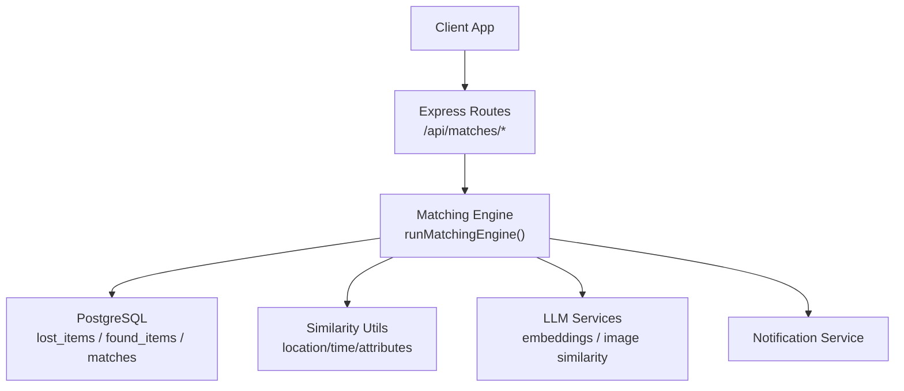
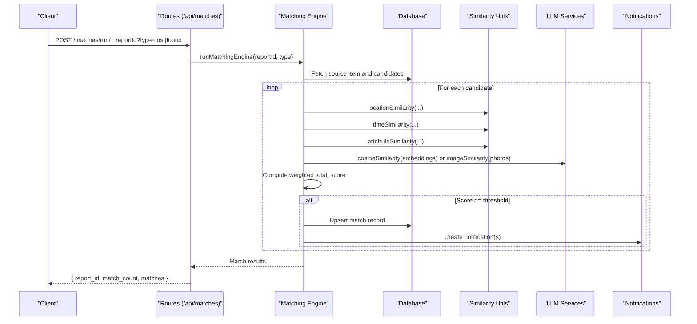
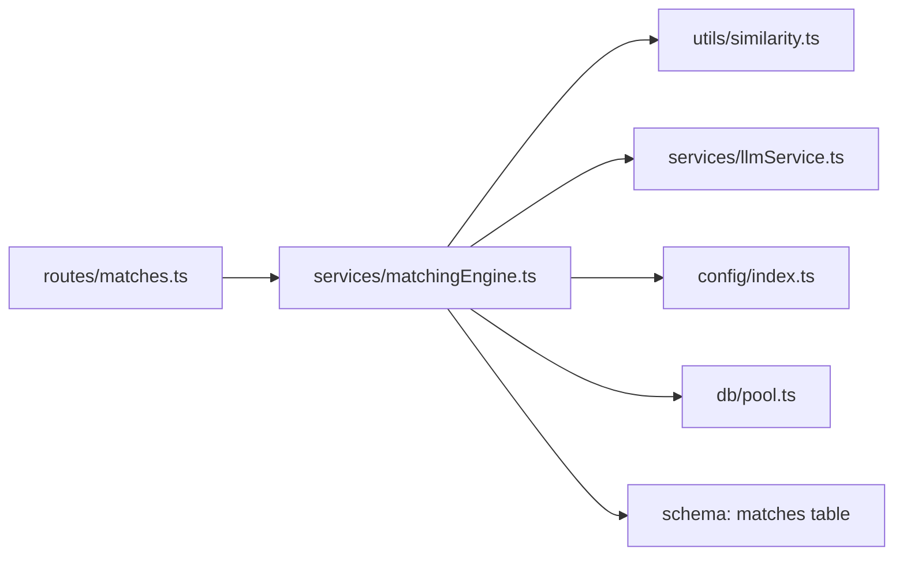

# Matching API

<cite>
**Referenced Files in This Document**
- [matches.ts](file://backend/src/routes/matches.ts)
- [matchingEngine.ts](file://backend/src/services/matchingEngine.ts)
- [similarity.ts](file://backend/src/utils/similarity.ts)
- [llmService.ts](file://backend/src/services/llmService.ts)
- [embeddingSearch.ts](file://backend/src/services/embeddingSearch.ts)
- [index.ts](file://backend/src/config/index.ts)
- [001_initial_schema.sql](file://supabase/migrations/001_initial_schema.sql)
- [API_DOCUMENTATION.md](file://backend/API_DOCUMENTATION.md)
- [matching.test.ts](file://backend/tests/matching.test.ts)
</cite>

## Table of Contents
1. [Introduction](#introduction)
2. [Project Structure](#project-structure)
3. [Core Components](#core-components)
4. [Architecture Overview](#architecture-overview)
5. [Detailed Component Analysis](#detailed-component-analysis)
6. [Dependency Analysis](#dependency-analysis)
7. [Performance Considerations](#performance-considerations)
8. [Troubleshooting Guide](#troubleshooting-guide)
9. [Conclusion](#conclusion)
10. [Appendices](#appendices)

## Introduction
This document provides detailed API documentation for the AI-powered matching system that connects lost-item reports with found-item reports. It covers endpoints to discover matches, retrieve match details, and manage match status. It also explains the multi-dimensional scoring algorithm that combines text similarity (embeddings), image comparison, location proximity, temporal factors, and attribute matching. Request/response schemas, examples, and interpretation guidance are included to help you integrate and use the matching features effectively.

## Project Structure
The matching feature is implemented in the backend Express routes and services:
- Routes expose authenticated endpoints to run matching and fetch matches for a report.
- The matching engine orchestrates data retrieval, scoring across multiple dimensions, persistence, and notifications.
- Utility functions compute location/time/attribute similarities.
- LLM services provide embeddings, cosine similarity, and image comparison.
- Configuration centralizes weights, thresholds, and time/location windows.
- Database schema defines tables for items, matches, verification, and notifications.

**Diagram sources**
- [matches.ts:15-114](file://backend/src/routes/matches.ts#L15-L114)
- [matchingEngine.ts:37-188](file://backend/src/services/matchingEngine.ts#L37-L188)
- [similarity.ts:26-82](file://backend/src/utils/similarity.ts#L26-L82)
- [llmService.ts:9-41](file://backend/src/services/llmService.ts#L9-L41)
- [001_initial_schema.sql:145-166](file://supabase/migrations/001_initial_schema.sql#L145-L166)

**Section sources**
- [matches.ts:15-114](file://backend/src/routes/matches.ts#L15-L114)
- [matchingEngine.ts:37-188](file://backend/src/services/matchingEngine.ts#L37-L188)
- [index.ts:33-47](file://backend/src/config/index.ts#L33-L47)
- [001_initial_schema.sql:145-166](file://supabase/migrations/001_initial_schema.sql#L145-L166)

## Core Components
- Match discovery endpoint: POST /api/matches/run/:reportId?type=lost|found
  - Triggers the matching engine for a specific report and returns computed matches.
- Match retrieval endpoint: GET /api/matches/:reportId?type=lost|found
  - Returns existing matches for a report sorted by total score descending.
- Scoring components:
  - Description similarity using OpenAI embeddings (cosine similarity) with fallback to simple text overlap.
  - Image similarity via vision model comparing two photos.
  - Location similarity using Haversine distance with configurable radius.
  - Time similarity based on time-window decay.
  - Attribute similarity over category, brand, and colour.
- Persistence and notifications:
  - Upserts matches into the database with per-dimension scores.
  - Sends notifications to owners of matched items.

**Section sources**
- [matches.ts:15-114](file://backend/src/routes/matches.ts#L15-L114)
- [matchingEngine.ts:37-188](file://backend/src/services/matchingEngine.ts#L37-L188)
- [API_DOCUMENTATION.md:419-513](file://backend/API_DOCUMENTATION.md#L419-L513)

## Architecture Overview
The matching flow integrates route handlers, the matching engine, similarity utilities, LLM services, and database operations.

**Diagram sources**
- [matches.ts:15-45](file://backend/src/routes/matches.ts#L15-L45)
- [matchingEngine.ts:37-188](file://backend/src/services/matchingEngine.ts#L37-L188)
- [similarity.ts:26-82](file://backend/src/utils/similarity.ts#L26-L82)
- [llmService.ts:9-41](file://backend/src/services/llmService.ts#L9-L41)

## Detailed Component Analysis

### Match Discovery Endpoint
- Method: POST
- Path: /api/matches/run/:reportId
- Query params:
  - type: required; one of "lost", "found"
- Authentication: Required (Bearer JWT)
- Authorization: Only the report owner or admin can trigger matching
- Behavior:
  - Validates type parameter
  - Verifies ownership of the report
  - Runs the matching engine against active items from the opposite table
  - Persists matches above the configured threshold
  - Returns summary with match count and list of matches

Request example:
- Headers: Authorization: Bearer <token>
- URL: /api/matches/run/a1b2c3d4-e5f6-7890-abcd-ef1234567890?type=lost

Response schema:
- report_id: string (UUID)
- match_count: number
- matches: array of match objects (see below)

Match object fields:
- lost_item_id: string (UUID)
- found_item_id: string (UUID)
- total_score: number (0–100)
- desc_score: number (0–100)
- image_score: number (0–100)
- location_score: number (0–100)
- time_score: number (0–100)
- attr_score: number (0–100)

Error responses:
- 400: Invalid or missing type parameter
- 404: Report not found
- 403: Access denied (not owner/admin)

**Section sources**
- [matches.ts:15-45](file://backend/src/routes/matches.ts#L15-L45)
- [API_DOCUMENTATION.md:423-463](file://backend/API_DOCUMENTATION.md#L423-L463)

### Match Retrieval Endpoint
- Method: GET
- Path: /api/matches/:reportId
- Query params:
  - type: required; one of "lost", "found"
- Authentication: Required (Bearer JWT)
- Authorization: Only the report owner or admin can view matches
- Behavior:
  - Validates type parameter
  - Verifies ownership of the report
  - Retrieves matches joined with corresponding item details
  - Returns matches sorted by total_score descending

Response schema (type=lost):
- Array of match objects including:
  - id: string (match UUID)
  - total_score: number
  - desc_score: number
  - image_score: number
  - location_score: number
  - time_score: number
  - attr_score: number
  - status: string ("pending", "approved", "rejected", "disputed")
  - created_at: timestamp
  - found_id: string (UUID)
  - found_category: string
  - found_brand: string
  - found_colour: string
  - found_description: string
  - found_location: string
  - found_photo_url: string
  - found_at: timestamp

Error responses:
- 400: Invalid or missing type parameter
- 404: Report not found
- 403: Access denied (not owner/admin)

**Section sources**
- [matches.ts:52-114](file://backend/src/routes/matches.ts#L52-L114)
- [API_DOCUMENTATION.md:467-513](file://backend/API_DOCUMENTATION.md#L467-L513)

### Multi-Dimensional Scoring Algorithm
The matching engine computes a weighted total score from five dimensions:

- Description similarity (weight: 0.30)
  - Uses cosine similarity between 1536-dim embeddings when available
  - Falls back to simple word overlap if embeddings are missing
- Image similarity (weight: 0.25)
  - Vision-based comparison when both items have photo URLs
  - Returns neutral default when images are unavailable
- Location similarity (weight: 0.20)
  - Haversine distance converted to 0–100 score
  - 100% within configured radius; decays linearly to 0 beyond triple radius
- Time similarity (weight: 0.15)
  - 100% within configured window hours; decays linearly to 0 beyond quadruple window
- Attribute similarity (weight: 0.10)
  - Compares category (50%), brand (25%), colour (25%)
  - Exact match adds full weight; substring match adds partial weight

Thresholding:
- Only matches with total_score >= minScoreThreshold are persisted and returned

Configuration:
- Weights and thresholds are centralized in configuration
- Default weights sum to 1.00

Complexity considerations:
- Embedding cosine similarity: O(d) where d is embedding dimension (1536)
- Image similarity: external API call per candidate pair
- Location/time/attribute: constant-time computations per candidate

**Section sources**
- [matchingEngine.ts:83-147](file://backend/src/services/matchingEngine.ts#L83-L147)
- [similarity.ts:26-82](file://backend/src/utils/similarity.ts#L26-L82)
- [llmService.ts:9-41](file://backend/src/services/llmService.ts#L9-L41)
- [index.ts:33-47](file://backend/src/config/index.ts#L33-L47)
- [API_DOCUMENTATION.md:19-39](file://backend/API_DOCUMENTATION.md#L19-L39)

### Match Management Operations
- Status lifecycle:
  - Matches are created with status "pending"
  - Admins can review and update status via admin endpoints (outside this document’s scope)
- Ownership and visibility:
  - Only item owners or admins can view matches
  - Row-level security policies enforce access control at the database level
- Notifications:
  - When new matches are found, notifications are sent to both lost and found item owners

Operational notes:
- Re-running matching for a report recomputes scores and upserts matches
- Duplicate pairs are prevented by unique constraints on (lost_item_id, found_item_id)

**Section sources**
- [matchingEngine.ts:152-188](file://backend/src/services/matchingEngine.ts#L152-L188)
- [001_initial_schema.sql:145-166](file://supabase/migrations/001_initial_schema.sql#L145-L166)
- [001_initial_schema.sql:359-365](file://supabase/migrations/001_initial_schema.sql#L359-L365)

### Examples: Finding Matches for New Reports
- After submitting a lost or found report, the system automatically runs matching and stores matches above the threshold.
- You can manually trigger matching for any report using the run endpoint.

Example request:
- POST /api/matches/run/a1b2c3d4-e5f6-7890-abcd-ef1234567890?type=lost
- Authorization: Bearer <token>

Example response:
- {
    "report_id": "a1b2c3d4-e5f6-7890-abcd-ef1234567890",
    "match_count": 2,
    "matches": [
      {
        "lost_item_id": "...",
        "found_item_id": "...",
        "total_score": 87,
        "desc_score": 92,
        "image_score": 50,
        "location_score": 100,
        "time_score": 100,
        "attr_score": 90
      }
    ]
  }

Interpretation tips:
- High total_score indicates strong alignment across multiple dimensions
- If image_score is low or neutral, rely more on description/location/time/attributes
- Use desc_score to assess semantic similarity; image_score reflects visual similarity

**Section sources**
- [API_DOCUMENTATION.md:423-463](file://backend/API_DOCUMENTATION.md#L423-L463)
- [matchingEngine.ts:125-147](file://backend/src/services/matchingEngine.ts#L125-L147)

## Dependency Analysis
The matching system composes several modules with clear separation of concerns:

Key dependencies:
- Routes depend on authentication middleware and the matching engine
- Matching engine depends on similarity utilities, LLM services, and configuration
- Database interactions use a shared pool; schema enforces constraints and indexes
- Tests mock dependencies to validate scoring behavior

Potential coupling:
- Tight coupling between matching engine and configuration weights
- External dependency on OpenAI for embeddings and image comparison
- Database schema changes require updates to queries and types

**Diagram sources**
- [matches.ts:15-114](file://backend/src/routes/matches.ts#L15-L114)
- [matchingEngine.ts:37-188](file://backend/src/services/matchingEngine.ts#L37-L188)
- [similarity.ts:26-82](file://backend/src/utils/similarity.ts#L26-L82)
- [llmService.ts:9-41](file://backend/src/services/llmService.ts#L9-L41)
- [index.ts:33-47](file://backend/src/config/index.ts#L33-L47)
- [001_initial_schema.sql:145-166](file://supabase/migrations/001_initial_schema.sql#L145-L166)

**Section sources**
- [matchingEngine.ts:37-188](file://backend/src/services/matchingEngine.ts#L37-L188)
- [001_initial_schema.sql:241-259](file://supabase/migrations/001_initial_schema.sql#L241-L259)
- [matching.test.ts:1-199](file://backend/tests/matching.test.ts#L1-L199)

## Performance Considerations
- Embedding search optimization:
  - pgvector index (ivfflat) accelerates cosine similarity queries
  - Similarity search can be performed directly in PostgreSQL for fast top-k retrieval
- Candidate filtering:
  - Exclude same-user items and inactive items to reduce computation
- Thresholding:
  - Early filtering by minScoreThreshold reduces storage and network overhead
- External API calls:
  - Image similarity calls are asynchronous and may be rate-limited; consider caching or batching
- Indexes:
  - Ensure indexes exist on user_id, status, category, and embedding vectors
  - Match lookups benefit from indexes on lost_item_id, found_item_id, and total_score

[No sources needed since this section provides general guidance]

## Troubleshooting Guide
Common issues and resolutions:
- Missing or invalid type parameter:
  - Ensure type is "lost" or "found" in query parameters
- Access denied:
  - Verify the authenticated user owns the report or has admin role
- No matches returned:
  - Check if candidates are active and not owned by the same user
  - Confirm embeddings exist or fallback text similarity is effective
  - Validate coordinates and timestamps for location/time scoring
- Low image similarity:
  - Ensure photo URLs are valid and accessible
  - Consider improving image quality or adding descriptive metadata
- Rate limits or API errors:
  - Handle retries and fallbacks gracefully; log errors for diagnostics

Verification and testing:
- Unit tests validate scoring behavior and fallback logic
- Mocked dependencies isolate external service failures

**Section sources**
- [matches.ts:19-36](file://backend/src/routes/matches.ts#L19-L36)
- [matchingEngine.ts:83-147](file://backend/src/services/matchingEngine.ts#L83-L147)
- [matching.test.ts:68-199](file://backend/tests/matching.test.ts#L68-L199)

## Conclusion
The Matching API provides robust endpoints to discover and retrieve matches between lost and found items, powered by a multi-dimensional scoring algorithm. By combining embeddings, image comparison, location proximity, temporal factors, and attributes, the system delivers high-quality match suggestions. Proper authentication, authorization, and configuration ensure secure and tunable performance. Use the provided schemas and examples to integrate seamlessly and interpret match scores effectively.

[No sources needed since this section summarizes without analyzing specific files]

## Appendices

### Request/Response Schemas Summary
- Run matching:
  - POST /api/matches/run/:reportId?type=lost|found
  - Response: { report_id, match_count, matches[] }
- Get matches:
  - GET /api/matches/:reportId?type=lost|found
  - Response: matches[] with detailed fields and join data

Scoring breakdown fields:
- total_score: weighted sum (0–100)
- desc_score: description similarity (0–100)
- image_score: image similarity (0–100)
- location_score: location proximity (0–100)
- time_score: time proximity (0–100)
- attr_score: attribute similarity (0–100)

**Section sources**
- [API_DOCUMENTATION.md:423-513](file://backend/API_DOCUMENTATION.md#L423-L513)
- [matchingEngine.ts:22-31](file://backend/src/services/matchingEngine.ts#L22-L31)