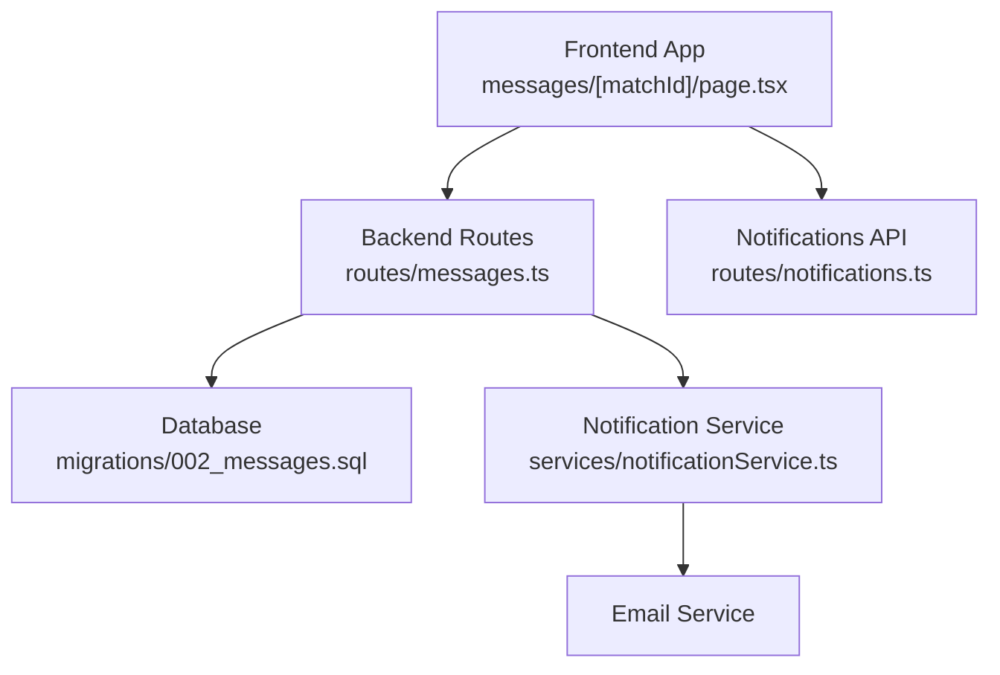
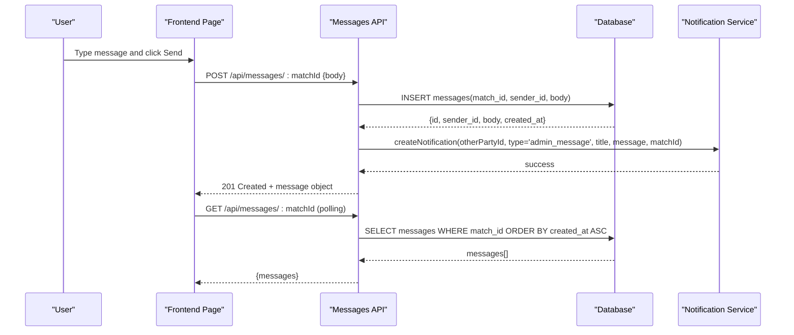
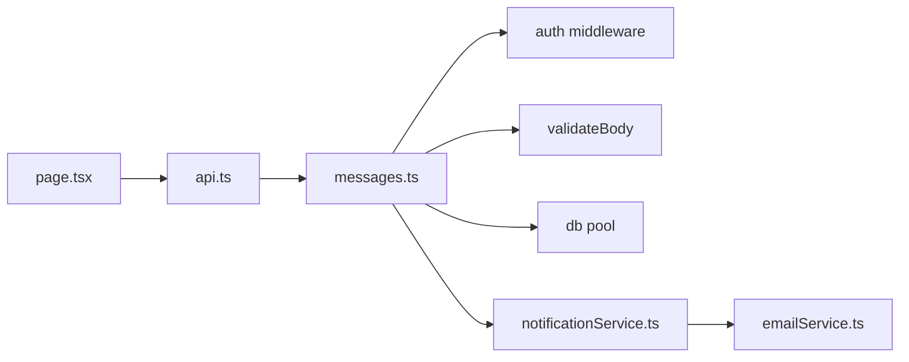

# Messaging API

<cite>
**Referenced Files in This Document**
- [messages.ts](file://backend/src/routes/messages.ts)
- [002_messages.sql](file://supabase/migrations/002_messages.sql)
- [notificationService.ts](file://backend/src/services/notificationService.ts)
- [notifications.ts](file://backend/src/routes/notifications.ts)
- [api.ts](file://frontend/lib/api.ts)
- [page.tsx](file://frontend/app/messages/[matchId]/page.tsx)
- [index.ts](file://frontend/types/index.ts)
</cite>

## Table of Contents
1. [Introduction](#introduction)
2. [Project Structure](#project-structure)
3. [Core Components](#core-components)
4. [Architecture Overview](#architecture-overview)
5. [Detailed Component Analysis](#detailed-component-analysis)
6. [Dependency Analysis](#dependency-analysis)
7. [Performance Considerations](#performance-considerations)
8. [Troubleshooting Guide](#troubleshooting-guide)
9. [Conclusion](#conclusion)
10. [Appendices](#appendices)

## Introduction
This document provides comprehensive API documentation for the messaging system between verified parties in the Lost & Found AI Matcher application. It covers endpoints for sending messages, retrieving conversation history, and managing message status. It also explains how conversations are threaded by match, how persistence is implemented, and how notifications are used to inform participants about new messages. Real-time delivery is achieved via client-side polling; a WebSocket-based approach can be added later if needed.

## Project Structure
The messaging feature spans backend routes, database schema, notification service, and frontend components:
- Backend route defines REST endpoints for reading and writing messages within a match thread.
- Database migration defines the messages table, indexes, and row-level security policies.
- Notification service creates in-app notifications (and optional emails) when a message is sent.
- Frontend exposes an API client and a page that polls for updates and sends messages.

**Diagram sources**
- [page.tsx:20-56](file://frontend/app/messages/[matchId]/page.tsx#L20-L56)
- [messages.ts:71-135](file://backend/src/routes/messages.ts#L71-L135)
- [002_messages.sql:8-52](file://supabase/migrations/002_messages.sql#L8-L52)
- [notificationService.ts:19-62](file://backend/src/services/notificationService.ts#L19-L62)
- [notifications.ts:40-84](file://backend/src/routes/notifications.ts#L40-L84)

**Section sources**
- [messages.ts:1-136](file://backend/src/routes/messages.ts#L1-L136)
- [002_messages.sql:1-53](file://supabase/migrations/002_messages.sql#L1-L53)
- [notificationService.ts:1-88](file://backend/src/services/notificationService.ts#L1-L88)
- [notifications.ts:1-85](file://backend/src/routes/notifications.ts#L1-L85)
- [api.ts:293-314](file://frontend/lib/api.ts#L293-L314)
- [page.tsx:1-110](file://frontend/app/messages/[matchId]/page.tsx#L1-L110)

## Core Components
- Message Thread Endpoints
  - GET /api/messages/:matchId: Retrieve all messages for a match, ordered oldest first.
  - POST /api/messages/:matchId: Send a message in the match thread.
- Data Model
  - Messages table with fields for id, match_id, sender_id, body, created_at.
  - Row-level security ensures only approved match participants can read or send messages.
- Notifications
  - On message send, a notification is created for the other party.
  - Notifications can be fetched and marked as read via the notifications API.
- Frontend Integration
  - The messages page polls the thread endpoint periodically and sends messages via the API client.

**Section sources**
- [messages.ts:71-135](file://backend/src/routes/messages.ts#L71-L135)
- [002_messages.sql:8-52](file://supabase/migrations/002_messages.sql#L8-L52)
- [notificationService.ts:19-62](file://backend/src/services/notificationService.ts#L19-L62)
- [notifications.ts:40-84](file://backend/src/routes/notifications.ts#L40-L84)
- [api.ts:293-314](file://frontend/lib/api.ts#L293-L314)
- [page.tsx:20-56](file://frontend/app/messages/[matchId]/page.tsx#L20-L56)

## Architecture Overview
The messaging architecture centers on authenticated users participating in approved matches. Each match has its own message thread. When a user sends a message, the server validates participation, persists the message, and triggers a notification to the other participant. The frontend polls the thread endpoint to display new messages.

**Diagram sources**
- [messages.ts:97-135](file://backend/src/routes/messages.ts#L97-L135)
- [notificationService.ts:19-62](file://backend/src/services/notificationService.ts#L19-L62)
- [page.tsx:20-56](file://frontend/app/messages/[matchId]/page.tsx#L20-L56)

## Detailed Component Analysis

### Message Endpoints
- GET /api/messages/:matchId
  - Purpose: Fetch full message thread for a match, oldest first.
  - Access: Only participants of an approved match (or admin).
  - Response: Object containing array of messages with id, sender_id, sender_name, body, created_at.
- POST /api/messages/:matchId
  - Purpose: Send a message in the match thread.
  - Access: Only participants of an approved match (or admin).
  - Request Body: { body: string } with length constraints enforced by validation.
  - Response: 201 Created with message object including id, sender_id, body, created_at.
  - Side Effects: Creates a notification for the other party.

Request/Response Schemas
- Request (POST):
  - body: string (required, min 1, max 2000)
- Response (GET):
  - messages: Array of Message objects
- Response (POST):
  - Message object: id, sender_id, body, created_at

Error Handling
- 404: Match not found
- 403: Messaging unavailable unless match is approved or caller is admin; access denied if not a participant
- 400: Validation error for request body

Real-Time Delivery
- Implemented via client-side polling every few seconds.
- Notifications provide awareness of new messages even when the page is not active.

Conversation Threading
- Threads are scoped by match_id, ensuring each match has its own isolated conversation.

Message Persistence
- Messages stored in the messages table with indexes on match_id and sender_id for efficient queries.
- Row-level security restricts read/write access to approved match participants.

**Section sources**
- [messages.ts:14-16](file://backend/src/routes/messages.ts#L14-L16)
- [messages.ts:23-64](file://backend/src/routes/messages.ts#L23-L64)
- [messages.ts:71-90](file://backend/src/routes/messages.ts#L71-L90)
- [messages.ts:97-135](file://backend/src/routes/messages.ts#L97-L135)
- [002_messages.sql:8-52](file://supabase/migrations/002_messages.sql#L8-L52)

### Database Schema and Security
- Table: messages
  - Columns: id (UUID PK), match_id (FK to matches), sender_id (FK to users), body (TEXT, length constrained), created_at (TIMESTAMPTZ default now())
- Indexes:
  - idx_messages_match: (match_id, created_at)
  - idx_messages_sender: (sender_id)
- Row-Level Security Policies:
  - Read policy: Only participants of an approved match can select messages.
  - Insert policy: Only participants of an approved match can insert messages, enforcing auth.uid() = sender_id.

Data Flow
- GET thread: Query messages by match_id, join users to get sender_name, order by created_at ascending.
- POST message: Insert message, return persisted fields, then trigger notification.

**Section sources**
- [002_messages.sql:8-52](file://supabase/migrations/002_messages.sql#L8-L52)
- [messages.ts:76-87](file://backend/src/routes/messages.ts#L76-L87)
- [messages.ts:110-120](file://backend/src/routes/messages.ts#L110-L120)

### Notification System
- Creation:
  - On message send, createNotification is called with the other party’s user ID, type 'admin_message', title, message text, and matchId.
- Storage:
  - In-app notification inserted into notifications table with fields for user_id, type, title, message, match_id, item_id, item_type.
- Email:
  - Optional email is sent using user’s email; failure does not block in-app notification creation.
- Retrieval:
  - GET /api/notifications returns paginated notifications with unread filtering.
  - PATCH /api/notifications/:id/read marks a single notification as read.
  - PATCH /api/notifications/read-all marks all unread notifications as read.
  - GET /api/notifications/count returns unread count.

**Section sources**
- [notificationService.ts:19-62](file://backend/src/services/notificationService.ts#L19-L62)
- [notifications.ts:14-84](file://backend/src/routes/notifications.ts#L14-L84)
- [messages.ts:122-131](file://backend/src/routes/messages.ts#L122-L131)

### Frontend Integration
- API Client:
  - messagesApi.getThread(matchId) calls GET /api/messages/:matchId.
  - messagesApi.send(matchId, body) calls POST /api/messages/:matchId with JSON body { body }.
- Message Thread Page:
  - Polls the thread endpoint every few seconds to fetch latest messages.
  - Sends messages via the API client and refreshes the thread after sending.
  - Displays sender_name and formatted created_at timestamps.

Real-Time Behavior
- Polling interval ensures near real-time updates without requiring WebSockets.
- Notifications can prompt users to check the thread even when not actively viewing it.

**Section sources**
- [api.ts:293-314](file://frontend/lib/api.ts#L293-L314)
- [page.tsx:20-56](file://frontend/app/messages/[matchId]/page.tsx#L20-L56)
- [page.tsx:43-56](file://frontend/app/messages/[matchId]/page.tsx#L43-L56)

## Dependency Analysis
- Route Dependencies:
  - messages.ts depends on authentication middleware, validation, database pool, and notification service.
- Database Dependencies:
  - messages table references matches and users tables; policies enforce approval status and participant checks.
- Frontend Dependencies:
  - api.ts provides typed methods for messages and notifications.
  - page.tsx consumes these APIs and implements polling and send logic.

**Diagram sources**
- [messages.ts:1-7](file://backend/src/routes/messages.ts#L1-L7)
- [notificationService.ts:1-3](file://backend/src/services/notificationService.ts#L1-L3)
- [api.ts:293-314](file://frontend/lib/api.ts#L293-L314)
- [page.tsx:1-10](file://frontend/app/messages/[matchId]/page.tsx#L1-L10)

**Section sources**
- [messages.ts:1-136](file://backend/src/routes/messages.ts#L1-L136)
- [notificationService.ts:1-88](file://backend/src/services/notificationService.ts#L1-L88)
- [api.ts:293-314](file://frontend/lib/api.ts#L293-L314)
- [page.tsx:1-110](file://frontend/app/messages/[matchId]/page.tsx#L1-L110)

## Performance Considerations
- Indexing:
  - Index on (match_id, created_at) optimizes thread retrieval ordering and filtering.
  - Index on sender_id supports potential future queries by sender.
- Polling Interval:
  - Frontend uses a reasonable polling interval to balance freshness and load. Adjust based on expected traffic.
- Database Joins:
  - Thread retrieval joins users table to include sender_name; ensure users table is indexed on id for fast lookups.
- Notification Overhead:
  - Creating notifications is lightweight; email sending is asynchronous and non-blocking to avoid impacting message send latency.

[No sources needed since this section provides general guidance]

## Troubleshooting Guide
Common Issues and Resolutions
- 404 Match not found:
  - Ensure the matchId exists and belongs to an approved match before attempting to send or retrieve messages.
- 403 Forbidden:
  - Verify the caller is a participant of the match or has admin role.
  - Confirm match status is approved; messaging is disabled otherwise.
- 400 Validation Error:
  - Check that the message body meets length constraints (min 1, max 2000 characters).
- No New Messages:
  - Confirm the frontend polling is active and network requests succeed.
  - Check notifications to see if new message notifications were created.

Debugging Steps
- Inspect network requests in browser dev tools for errors and payloads.
- Validate JWT token presence and correctness in Authorization header.
- Review database logs for query performance issues or constraint violations.

**Section sources**
- [messages.ts:43-58](file://backend/src/routes/messages.ts#L43-L58)
- [messages.ts:14-16](file://backend/src/routes/messages.ts#L14-L16)
- [notifications.ts:40-84](file://backend/src/routes/notifications.ts#L40-L84)

## Conclusion
The messaging system provides secure, threaded conversations between verified parties through REST endpoints backed by a robust database schema and row-level security. While real-time delivery is currently implemented via polling, the design allows for easy extension to WebSocket-based push notifications. The integration with the notification system ensures participants are informed of new messages, enhancing responsiveness and user experience.

[No sources needed since this section summarizes without analyzing specific files]

## Appendices

### API Examples

Initiate Conversation
- Ensure the match status is approved and both parties are participants.
- Use GET /api/messages/:matchId to verify the thread exists or is empty.

Send a Message
- Endpoint: POST /api/messages/:matchId
- Headers: Authorization: Bearer <token>, Content-Type: application/json
- Request Body: { "body": "Hello, I have a question about the match." }
- Response: 201 Created with message object

Retrieve Chat History
- Endpoint: GET /api/messages/:matchId
- Headers: Authorization: Bearer <token>
- Response: { "messages": [ ... ] }

Manage Notifications
- Get notifications: GET /api/notifications?page=1&limit=20&unread=true
- Mark as read: PATCH /api/notifications/:id/read
- Mark all read: PATCH /api/notifications/read-all
- Unread count: GET /api/notifications/count

**Section sources**
- [messages.ts:71-135](file://backend/src/routes/messages.ts#L71-L135)
- [notifications.ts:14-84](file://backend/src/routes/notifications.ts#L14-L84)
- [api.ts:293-314](file://frontend/lib/api.ts#L293-L314)