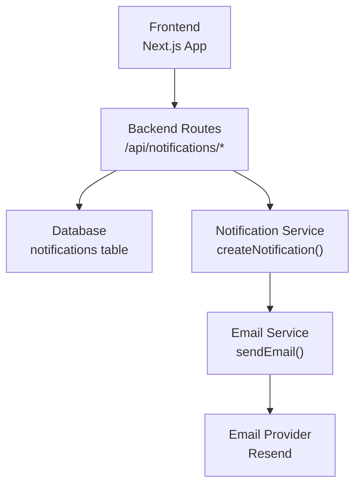
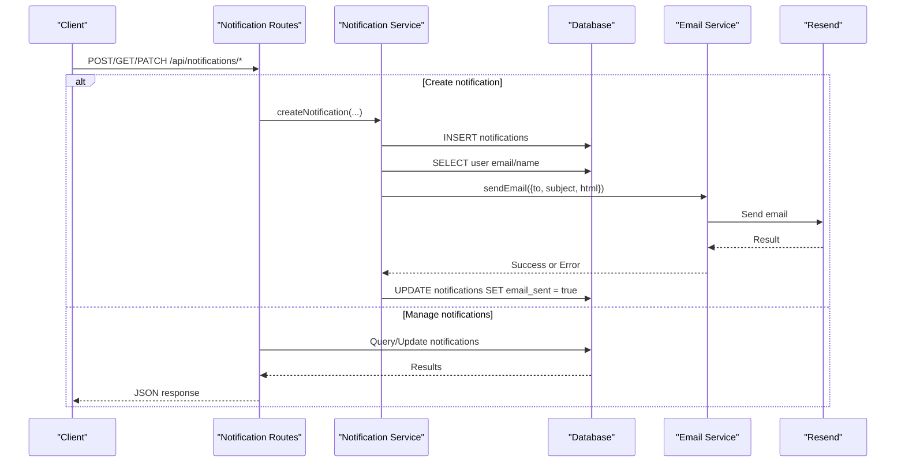
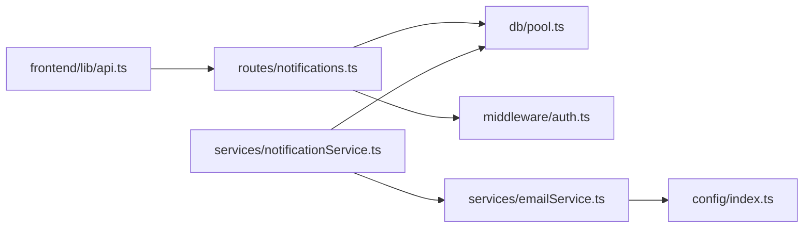

# Notifications API

<cite>
**Referenced Files in This Document**
- [notifications.ts](file://backend/src/routes/notifications.ts)
- [notificationService.ts](file://backend/src/services/notificationService.ts)
- [emailService.ts](file://backend/src/services/emailService.ts)
- [001_initial_schema.sql](file://supabase/migrations/001_initial_schema.sql)
- [index.ts](file://backend/src/config/index.ts)
- [API_DOCUMENTATION.md](file://backend/API_DOCUMENTATION.md)
- [api.ts](file://frontend/lib/api.ts)
- [page.tsx](file://frontend/app/notifications/page.tsx)
</cite>

## Table of Contents
1. [Introduction](#introduction)
2. [Project Structure](#project-structure)
3. [Core Components](#core-components)
4. [Architecture Overview](#architecture-overview)
5. [Detailed Component Analysis](#detailed-component-analysis)
6. [Dependency Analysis](#dependency-analysis)
7. [Performance Considerations](#performance-considerations)
8. [Troubleshooting Guide](#troubleshooting-guide)
9. [Conclusion](#conclusion)
10. [Appendices](#appendices)

## Introduction
This document provides detailed API documentation for the notification system used by the Lost & Found AI Matcher application. It covers endpoints to create, retrieve, and manage notifications; explains notification types and delivery channels (in-app and email); and outlines how users interact with notifications on the frontend. It also includes request/response schemas, examples, and guidance for handling delivery failures and managing user notification settings.

## Project Structure
The notification system spans backend routes, services, database schema, configuration, and a frontend client:
- Backend routes expose REST endpoints for listing, marking as read, and counting unread notifications.
- A service layer creates in-app notifications and sends emails via an external provider.
- The database schema defines the notifications table and related constraints.
- Configuration centralizes environment variables such as email provider keys and frontend URLs.
- The frontend consumes the API to display notifications and mark them as read.

**Diagram sources**
- [notifications.ts:1-86](file://backend/src/routes/notifications.ts#L1-L86)
- [notificationService.ts:1-101](file://backend/src/services/notificationService.ts#L1-L101)
- [emailService.ts:1-32](file://backend/src/services/emailService.ts#L1-L32)
- [001_initial_schema.sql:204-221](file://supabase/migrations/001_initial_schema.sql#L204-L221)

**Section sources**
- [notifications.ts:1-86](file://backend/src/routes/notifications.ts#L1-L86)
- [notificationService.ts:1-101](file://backend/src/services/notificationService.ts#L1-L101)
- [emailService.ts:1-32](file://backend/src/services/emailService.ts#L1-L32)
- [001_initial_schema.sql:204-221](file://supabase/migrations/001_initial_schema.sql#L204-L221)
- [index.ts:1-49](file://backend/src/config/index.ts#L1-L49)
- [api.ts:258-291](file://frontend/lib/api.ts#L258-L291)
- [page.tsx:44-96](file://frontend/app/notifications/page.tsx#L44-L96)

## Core Components
- Notification routes: Provide authenticated endpoints to list notifications, count unread items, mark all as read, and mark individual notifications as read.
- Notification service: Creates in-app notifications and optionally sends emails. Tracks whether an email was sent.
- Email service: Sends emails using Resend with configurable from address and API key.
- Database schema: Defines the notifications table including type, read status, and email delivery flag.
- Frontend integration: Displays notifications, fetches counts, and marks notifications as read.

Key responsibilities:
- Read operations: GET /notifications, GET /notifications/count
- Write operations: PATCH /notifications/:id/read, PATCH /notifications/read-all
- Creation: createNotification(userId, type, title, message, itemId?, itemType?, matchId?)
- Delivery: In-app persistence + optional email via Resend

**Section sources**
- [notifications.ts:10-84](file://backend/src/routes/notifications.ts#L10-L84)
- [notificationService.ts:19-62](file://backend/src/services/notificationService.ts#L19-L62)
- [emailService.ts:15-31](file://backend/src/services/emailService.ts#L15-L31)
- [001_initial_schema.sql:204-221](file://supabase/migrations/001_initial_schema.sql#L204-L221)
- [api.ts:258-291](file://frontend/lib/api.ts#L258-L291)

## Architecture Overview
The notification flow consists of two primary paths:
1. Creating notifications: Services insert a notification record and send an email if configured.
2. Managing notifications: Clients call route handlers to list, count, and update read status.

**Diagram sources**
- [notificationService.ts:19-62](file://backend/src/services/notificationService.ts#L19-L62)
- [emailService.ts:15-31](file://backend/src/services/emailService.ts#L15-L31)
- [notifications.ts:14-84](file://backend/src/routes/notifications.ts#L14-L84)
- [001_initial_schema.sql:204-221](file://supabase/migrations/001_initial_schema.sql#L204-L221)

## Detailed Component Analysis

### Endpoints Reference
All notification endpoints require authentication via Bearer token.

- GET /api/notifications
  - Purpose: List the authenticated user’s notifications with pagination and optional unread filter.
  - Query parameters:
    - page: integer, default 1
    - limit: integer, default 20
    - unread: boolean string ("true") to return only unread notifications
  - Response fields:
    - notifications: array of notification objects
    - unread_count: integer
    - page: integer
    - limit: integer
  - Example usage: See cURL example in API docs section.

- GET /api/notifications/count
  - Purpose: Return the authenticated user’s unread notification count.
  - Response fields:
    - unread_count: integer

- PATCH /api/notifications/:id/read
  - Purpose: Mark a single notification as read.
  - Path parameter: id (UUID)
  - Response: success message

- PATCH /api/notifications/read-all
  - Purpose: Mark all of the authenticated user’s unread notifications as read.
  - Response: success message

Notes:
- Responses follow the common error shape defined in the API documentation when errors occur.
- All endpoints are protected by authentication middleware.

**Section sources**
- [notifications.ts:14-84](file://backend/src/routes/notifications.ts#L14-L84)
- [API_DOCUMENTATION.md:638-687](file://backend/API_DOCUMENTATION.md#L638-L687)

### Notification Types and Semantics
Supported notification types:
- new_match: A new potential match has been found for a lost item.
- verification_question: A verification question is available for a match.
- verification_result: The result of a verification attempt (correct/incorrect).
- match_approved: A match has been approved.
- match_rejected: A match has been rejected.
- item_returned: An item has been returned to its owner.
- admin_message: A message from an admin or about an administrative action.

These types map to UI icons and colors in the frontend and influence email template styling.

**Section sources**
- [notificationService.ts:5-14](file://backend/src/services/notificationService.ts#L5-L14)
- [page.tsx:24-42](file://frontend/app/notifications/page.tsx#L24-L42)
- [001_initial_schema.sql:41-49](file://supabase/migrations/001_initial_schema.sql#L41-L49)

### Data Model: Notifications Table
Fields:
- id: UUID primary key
- user_id: UUID referencing users
- type: Enum of notification types
- title: Text
- message: Text
- match_id: Optional UUID referencing matches
- item_id: Optional UUID referencing lost/found items
- item_type: Enum 'lost' or 'found'
- is_read: Boolean default false
- email_sent: Boolean default false
- created_at: Timestamp

Indexes:
- Index on (user_id, is_read) for efficient queries.

Row-level security policies ensure users can only access their own notifications.

**Section sources**
- [001_initial_schema.sql:204-221](file://supabase/migrations/001_initial_schema.sql#L204-L221)
- [001_initial_schema.sql:256-257](file://supabase/migrations/001_initial_schema.sql#L256-L257)
- [001_initial_schema.sql:352-357](file://supabase/migrations/001_initial_schema.sql#L352-L357)

### Email Delivery Flow
When creating a notification:
1. Insert the notification into the database.
2. Fetch the user’s email and full name.
3. If an email exists, send an HTML email via Resend.
4. On success, mark the notification’s email_sent flag as true.
5. On failure, log the error but do not fail the operation; the in-app notification remains.

Configuration:
- Email provider: Resend
- API key: RESEND_API_KEY
- From address: EMAIL_FROM
- Frontend URL: FRONTEND_URL used to build deep links in emails

**Section sources**
- [notificationService.ts:19-62](file://backend/src/services/notificationService.ts#L19-L62)
- [emailService.ts:15-31](file://backend/src/services/emailService.ts#L15-L31)
- [index.ts:23-26](file://backend/src/config/index.ts#L23-L26)

### Frontend Integration
The frontend:
- Fetches notifications and unread count.
- Displays notifications with type-specific icons and colors.
- Allows marking individual notifications or all as read.
- Uses a typed API client to interact with backend endpoints.

Typical interactions:
- Load notifications on page mount.
- Update local state after marking as read.
- Show toast messages for errors or successes.

**Section sources**
- [api.ts:258-291](file://frontend/lib/api.ts#L258-L291)
- [page.tsx:44-96](file://frontend/app/notifications/page.tsx#L44-L96)

### Real-time Updates
Current implementation does not include real-time push updates (e.g., WebSockets or Server-Sent Events). Clients poll the API to refresh notifications and counts. To implement real-time updates:
- Add a WebSocket server or use Supabase Realtime to broadcast new notifications to connected clients.
- Maintain client-side subscriptions per user session.
- Ensure proper authentication and authorization for real-time channels.

[No sources needed since this section proposes conceptual enhancements]

## Dependency Analysis
High-level dependencies:
- Routes depend on authentication middleware and database pool utilities.
- Notification service depends on database pool and email service.
- Email service depends on Resend SDK and configuration.
- Frontend depends on a typed API client that calls backend endpoints.

**Diagram sources**
- [notifications.ts:1-8](file://backend/src/routes/notifications.ts#L1-L8)
- [notificationService.ts:1-3](file://backend/src/services/notificationService.ts#L1-L3)
- [emailService.ts:1-3](file://backend/src/services/emailService.ts#L1-L3)
- [index.ts:1-49](file://backend/src/config/index.ts#L1-L49)
- [api.ts:1-35](file://frontend/lib/api.ts#L1-L35)

**Section sources**
- [notifications.ts:1-8](file://backend/src/routes/notifications.ts#L1-L8)
- [notificationService.ts:1-3](file://backend/src/services/notificationService.ts#L1-L3)
- [emailService.ts:1-3](file://backend/src/services/emailService.ts#L1-L3)
- [index.ts:1-49](file://backend/src/config/index.ts#L1-L49)
- [api.ts:1-35](file://frontend/lib/api.ts#L1-L35)

## Performance Considerations
- Pagination: Use page and limit to avoid large payloads. Default limit is 20.
- Unread filtering: Use unread=true to reduce payload size when only new items are needed.
- Count endpoint: Efficiently returns unread_count without fetching full lists.
- Email sending: Asynchronous and non-blocking; failures do not prevent in-app notifications.
- Database indexes: (user_id, is_read) supports fast reads and updates for user-scoped operations.

[No sources needed since this section provides general guidance]

## Troubleshooting Guide
Common issues and resolutions:
- Authentication errors: Ensure Authorization header contains a valid Bearer token.
- Missing email configuration: If RESEND_API_KEY is not set, emails will be skipped; in-app notifications still work.
- Email send failures: Errors are logged; check logs and Resend dashboard for delivery issues.
- Permission errors: Row-level security restricts notifications to the current user; verify user context.
- Frontend errors: Check network requests and error messages thrown by the API client.

Operational tips:
- Validate query parameters (page, limit, unread) to avoid unexpected results.
- Monitor email provider rate limits and quotas.
- Use the count endpoint to optimize UI badges and polling frequency.

**Section sources**
- [emailService.ts:15-31](file://backend/src/services/emailService.ts#L15-L31)
- [notificationService.ts:57-60](file://backend/src/services/notificationService.ts#L57-L60)
- [001_initial_schema.sql:352-357](file://supabase/migrations/001_initial_schema.sql#L352-L357)
- [api.ts:18-35](file://frontend/lib/api.ts#L18-L35)

## Conclusion
The notification system provides robust in-app notifications with optional email delivery. It exposes clear REST endpoints for listing, counting, and updating notification states, and integrates with a secure database schema and email provider. While real-time updates are not currently implemented, the design allows for future enhancements. Proper configuration and error handling ensure reliable operation across environments.

[No sources needed since this section summarizes without analyzing specific files]

## Appendices

### Request/Response Schemas

- GET /api/notifications
  - Query parameters:
    - page: integer (default 1)
    - limit: integer (default 20)
    - unread: "true" to filter unread only
  - Response:
    - notifications: array of { id, type, title, message, match_id, item_id, item_type, is_read, created_at }
    - unread_count: integer
    - page: integer
    - limit: integer

- GET /api/notifications/count
  - Response:
    - unread_count: integer

- PATCH /api/notifications/:id/read
  - Path parameter: id (UUID)
  - Response: { message: string }

- PATCH /api/notifications/read-all
  - Response: { message: string }

- Create notification (service function)
  - Parameters:
    - userId: string
    - type: one of supported notification types
    - title: string
    - message: string
    - itemId?: string
    - itemType?: "lost" | "found"
    - matchId?: string
  - Side effects:
    - Inserts notification record
    - Optionally sends email and sets email_sent flag

**Section sources**
- [notifications.ts:14-84](file://backend/src/routes/notifications.ts#L14-L84)
- [notificationService.ts:19-62](file://backend/src/services/notificationService.ts#L19-L62)
- [API_DOCUMENTATION.md:638-687](file://backend/API_DOCUMENTATION.md#L638-L687)

### Examples

- Sending a notification (service):
  - Call createNotification with appropriate type, title, message, and optional references to match/item.
  - Example invocation path: see service function signature and usage in other modules.

- Handling delivery failures:
  - Email failures are caught and logged; in-app notification persists.
  - Check logs and provider status for troubleshooting.

- Managing user notification settings:
  - Current implementation does not expose per-user preference toggles for email vs in-app.
  - Future enhancement: add user preferences table and gate email sending based on flags.

**Section sources**
- [notificationService.ts:19-62](file://backend/src/services/notificationService.ts#L19-L62)
- [emailService.ts:15-31](file://backend/src/services/emailService.ts#L15-L31)