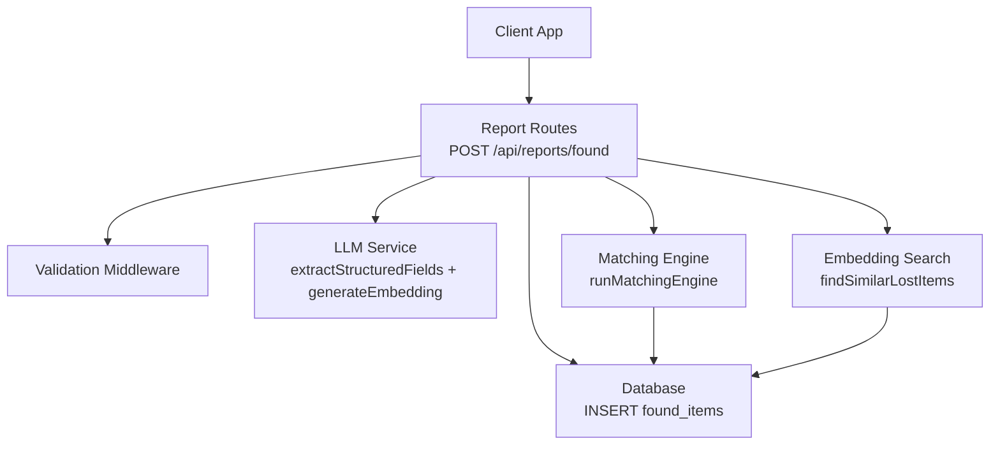
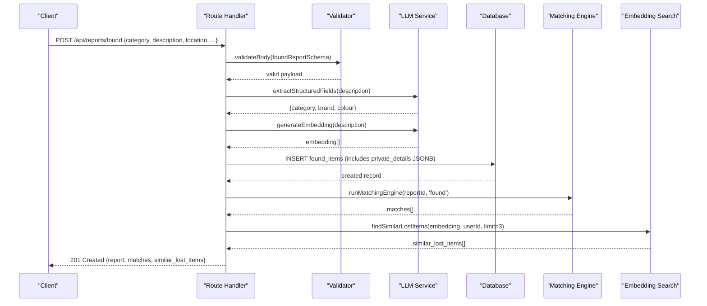
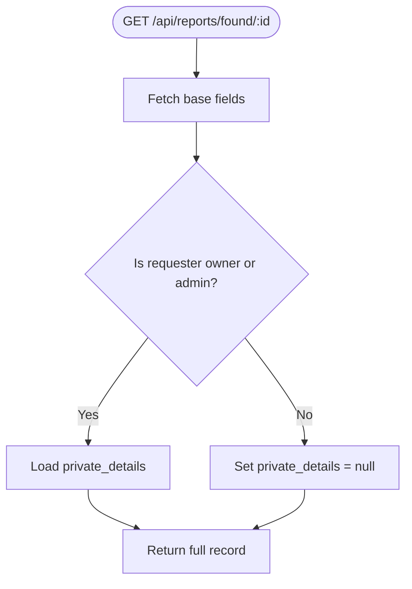
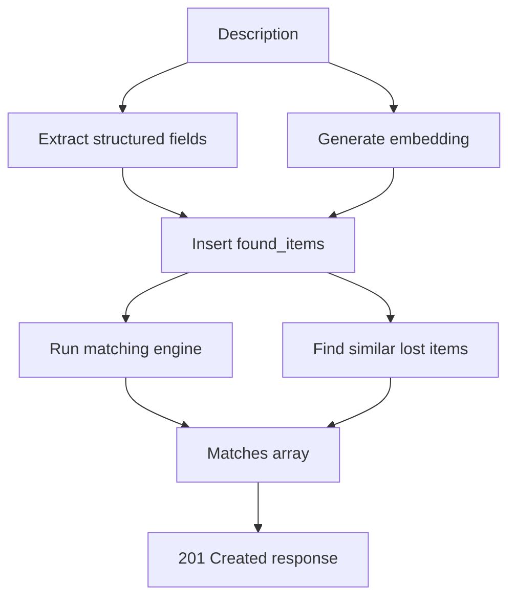
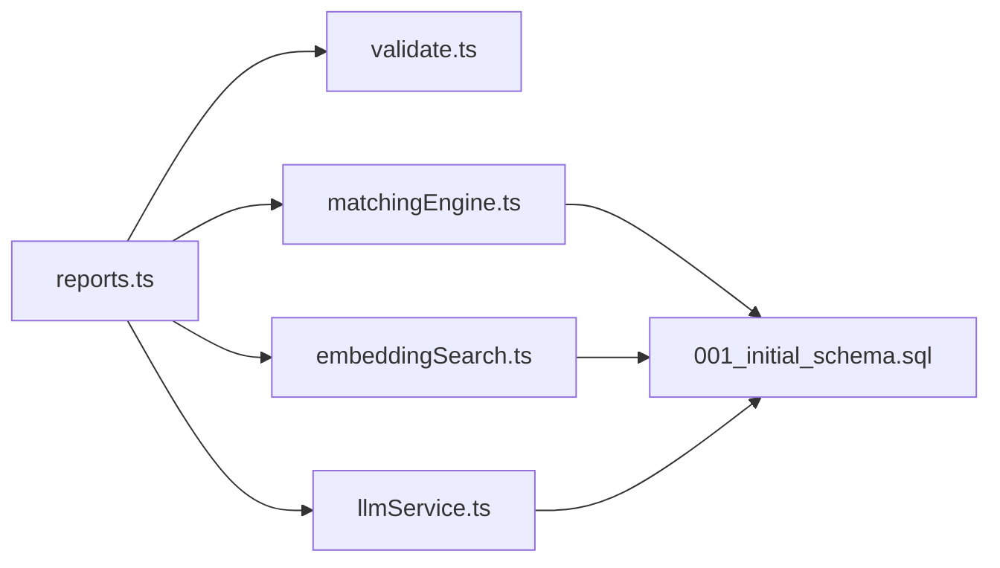

# Found Item Reports

<cite>
**Referenced Files in This Document**
- [reports.ts](file://backend/src/routes/reports.ts)
- [validate.ts](file://backend/src/middleware/validate.ts)
- [matchingEngine.ts](file://backend/src/services/matchingEngine.ts)
- [embeddingSearch.ts](file://backend/src/services/embeddingSearch.ts)
- [llmService.ts](file://backend/src/services/llmService.ts)
- [001_initial_schema.sql](file://supabase/migrations/001_initial_schema.sql)
- [API_DOCUMENTATION.md](file://backend/API_DOCUMENTATION.md)
</cite>

## Table of Contents
1. [Introduction](#introduction)
2. [Project Structure](#project-structure)
3. [Core Components](#core-components)
4. [Architecture Overview](#architecture-overview)
5. [Detailed Component Analysis](#detailed-component-analysis)
6. [Dependency Analysis](#dependency-analysis)
7. [Performance Considerations](#performance-considerations)
8. [Troubleshooting Guide](#troubleshooting-guide)
9. [Conclusion](#conclusion)

## Introduction
This document provides detailed API documentation for creating found item reports via the POST /api/reports/found endpoint. It explains the request schema, privacy-first handling of private details, the AI processing pipeline (structured field extraction, embedding generation, and automatic matching), response schemas (including matches and similar lost items), and examples covering sensitive information handling and error scenarios.

## Project Structure
The found report creation flow spans several backend modules:
- Route handler validates input, persists data, triggers AI services, and returns results.
- Validation middleware enforces schema rules.
- LLM service extracts structured fields and generates embeddings.
- Matching engine computes similarity across multiple dimensions and persists matches.
- Embedding search returns similar lost items using vector similarity.
- Database schema defines tables and privacy boundaries.

**Diagram sources**
- [reports.ts:173-247](file://backend/src/routes/reports.ts#L173-L247)
- [validate.ts:40-51](file://backend/src/middleware/validate.ts#L40-L51)
- [llmService.ts:43-79](file://backend/src/services/llmService.ts#L43-L79)
- [matchingEngine.ts:37-189](file://backend/src/services/matchingEngine.ts#L37-L189)
- [embeddingSearch.ts:30-62](file://backend/src/services/embeddingSearch.ts#L30-L62)
- [001_initial_schema.sql:107-140](file://supabase/migrations/001_initial_schema.sql#L107-L140)

**Section sources**
- [reports.ts:173-247](file://backend/src/routes/reports.ts#L173-L247)
- [validate.ts:40-51](file://backend/src/middleware/validate.ts#L40-L51)
- [llmService.ts:43-79](file://backend/src/services/llmService.ts#L43-L79)
- [matchingEngine.ts:37-189](file://backend/src/services/matchingEngine.ts#L37-L189)
- [embeddingSearch.ts:30-62](file://backend/src/services/embeddingSearch.ts#L30-L62)
- [001_initial_schema.sql:107-140](file://supabase/migrations/001_initial_schema.sql#L107-L140)

## Core Components
- POST /api/reports/found: Creates a new found item report with optional private details, runs AI processing, and returns created data plus matches and similar lost items.
- Validation: Enforces required fields and types for category, description, location, timestamps, coordinates, photo URL, and private details.
- AI Processing:
  - Structured field extraction from free-text descriptions to populate category, brand, colour.
  - Embedding generation for semantic similarity search.
  - Automatic matching against active lost items using weighted scoring.
  - Similarity search returning top similar lost items by embedding distance.
- Privacy: Private details are stored separately and only returned to owners/admins; public views exclude them.

**Section sources**
- [reports.ts:173-247](file://backend/src/routes/reports.ts#L173-L247)
- [validate.ts:40-51](file://backend/src/middleware/validate.ts#L40-L51)
- [llmService.ts:43-79](file://backend/src/services/llmService.ts#L43-L79)
- [matchingEngine.ts:37-189](file://backend/src/services/matchingEngine.ts#L37-L189)
- [embeddingSearch.ts:30-62](file://backend/src/services/embeddingSearch.ts#L30-L62)
- [001_initial_schema.sql:107-140](file://supabase/migrations/001_initial_schema.sql#L107-L140)

## Architecture Overview
The endpoint orchestrates validation, persistence, AI processing, and matching in a resilient way:
- Input is validated before any side effects.
- The report is inserted into the database immediately.
- AI tasks run asynchronously relative to the response where possible; failures do not block success responses.
- Matches are computed and persisted; notifications may be sent.
- Similar items are retrieved using vector similarity and included in the response.

**Diagram sources**
- [reports.ts:173-247](file://backend/src/routes/reports.ts#L173-L247)
- [validate.ts:40-51](file://backend/src/middleware/validate.ts#L40-L51)
- [llmService.ts:43-79](file://backend/src/services/llmService.ts#L43-L79)
- [matchingEngine.ts:37-189](file://backend/src/services/matchingEngine.ts#L37-L189)
- [embeddingSearch.ts:30-62](file://backend/src/services/embeddingSearch.ts#L30-L62)

## Detailed Component Analysis

### Endpoint: POST /api/reports/found
- Purpose: Create a new found item report and return immediate feedback including potential matches and similar lost items.
- Authentication: Required (JWT Bearer token).
- Request Schema:
  - category: string, required
  - brand: string or null, optional
  - colour: string or null, optional
  - description: string, minimum length enforced, required
  - location: string, required
  - latitude: number between -90 and 90, optional
  - longitude: number between -180 and 180, optional
  - found_at: ISO date string, required
  - photo_url: URI string or empty/null, optional
  - private_details: object or null, optional — used for verification questions and stored securely
- Response:
  - 201 Created with:
    - Report fields: id, category, brand, colour, description, location, found_at, status, created_at
    - matches: array of match objects with scores and IDs
    - similar_lost_items: array of similar lost items based on embedding similarity
- Error Responses:
  - 400 Validation errors when fields are missing or invalid
  - 401 Unauthorized if JWT is missing or invalid
  - 404 Not found when retrieving related resources (e.g., during retrieval flows)
  - 403 Forbidden for unauthorized access to private details
  - 429 Too many requests for rate-limited operations

**Section sources**
- [reports.ts:173-247](file://backend/src/routes/reports.ts#L173-L247)
- [validate.ts:40-51](file://backend/src/middleware/validate.ts#L40-L51)
- [API_DOCUMENTATION.md:220-297](file://backend/API_DOCUMENTATION.md#L220-L297)

### Privacy-First Handling of Private Details
- Storage: private_details are stored as JSONB in the found_items table.
- Access Control:
  - Public GET /api/reports/found/:id excludes private_details unless the requester is the owner or an admin.
  - Owners and admins can retrieve private_details via a separate query that explicitly selects it.
- Verification Flow:
  - Private details provide facts used to generate verification questions for claimants.
  - Only after successful verification are contact details unlocked.

**Diagram sources**
- [reports.ts:286-317](file://backend/src/routes/reports.ts#L286-L317)
- [001_initial_schema.sql:107-140](file://supabase/migrations/001_initial_schema.sql#L107-L140)

**Section sources**
- [reports.ts:286-317](file://backend/src/routes/reports.ts#L286-L317)
- [001_initial_schema.sql:107-140](file://supabase/migrations/001_initial_schema.sql#L107-L140)

### AI Processing Pipeline
- Structured Field Extraction:
  - Uses LLM to parse free-text description into structured fields: category, brand, colour.
  - If extraction fails, falls back to user-provided values.
- Embedding Generation:
  - Generates a 1536-dimensional text embedding for semantic similarity search.
  - Stored in description_embedding column for fast vector queries.
- Automatic Matching:
  - Compares the new found item against active lost items using weighted scoring:
    - Description similarity (embedding cosine similarity or fallback text overlap)
    - Image similarity (when both have photos)
    - Location proximity (Haversine-based)
    - Time proximity (time window decay)
    - Attribute similarity (category, brand, colour)
  - Persists matches above a threshold score and sends notifications.
- Similar Lost Items:
  - Returns top similar lost items by embedding distance for immediate context.

**Diagram sources**
- [llmService.ts:43-79](file://backend/src/services/llmService.ts#L43-L79)
- [llmService.ts:9-17](file://backend/src/services/llmService.ts#L9-L17)
- [matchingEngine.ts:37-189](file://backend/src/services/matchingEngine.ts#L37-L189)
- [embeddingSearch.ts:30-62](file://backend/src/services/embeddingSearch.ts#L30-L62)
- [reports.ts:173-247](file://backend/src/routes/reports.ts#L173-L247)

**Section sources**
- [llmService.ts:43-79](file://backend/src/services/llmService.ts#L43-L79)
- [llmService.ts:9-17](file://backend/src/services/llmService.ts#L9-L17)
- [matchingEngine.ts:37-189](file://backend/src/services/matchingEngine.ts#L37-L189)
- [embeddingSearch.ts:30-62](file://backend/src/services/embeddingSearch.ts#L30-L62)
- [reports.ts:173-247](file://backend/src/routes/reports.ts#L173-L247)

### Response Schemas
- Created Report Fields:
  - id, category, brand, colour, description, location, found_at, status, created_at
- Matches:
  - Array of match objects containing:
    - lost_item_id, found_item_id
    - total_score, desc_score, image_score, location_score, time_score, attr_score
- Similar Lost Items:
  - Array of items with:
    - id, category, brand, colour, description, location, latitude, longitude, event_time, photo_url, similarity_score

**Section sources**
- [reports.ts:241-245](file://backend/src/routes/reports.ts#L241-L245)
- [matchingEngine.ts:22-31](file://backend/src/services/matchingEngine.ts#L22-L31)
- [embeddingSearch.ts:6-18](file://backend/src/services/embeddingSearch.ts#L6-L18)
- [API_DOCUMENTATION.md:263-278](file://backend/API_DOCUMENTATION.md#L263-L278)

### Examples and Error Scenarios
- Creating a Found Report with Sensitive Information:
  - Include private_details such as keychain material, tag numbers, or distinctive marks. These are stored securely and only accessible to owners/admins.
  - Example request includes all required fields plus private_details.
- Error Scenarios:
  - Validation failure: Missing required fields or invalid formats result in 400 with detailed messages.
  - Unauthorized: Missing or invalid JWT results in 401.
  - Not found: Retrieving non-existent reports yields 404.
  - Rate limiting: Exceeding limits returns 429.

**Section sources**
- [validate.ts:40-51](file://backend/src/middleware/validate.ts#L40-L51)
- [API_DOCUMENTATION.md:782-800](file://backend/API_DOCUMENTATION.md#L782-L800)
- [API_DOCUMENTATION.md:220-297](file://backend/API_DOCUMENTATION.md#L220-L297)

## Dependency Analysis
The endpoint depends on several components:
- Validation middleware ensures correct payloads.
- LLM service provides structured extraction and embeddings.
- Matching engine computes multi-factor similarity and persists matches.
- Embedding search retrieves similar items using vector operations.
- Database schema defines privacy boundaries and indexes for performance.

**Diagram sources**
- [reports.ts:173-247](file://backend/src/routes/reports.ts#L173-L247)
- [validate.ts:40-51](file://backend/src/middleware/validate.ts#L40-L51)
- [llmService.ts:43-79](file://backend/src/services/llmService.ts#L43-L79)
- [matchingEngine.ts:37-189](file://backend/src/services/matchingEngine.ts#L37-L189)
- [embeddingSearch.ts:30-62](file://backend/src/services/embeddingSearch.ts#L30-L62)
- [001_initial_schema.sql:107-140](file://supabase/migrations/001_initial_schema.sql#L107-L140)

**Section sources**
- [reports.ts:173-247](file://backend/src/routes/reports.ts#L173-L247)
- [validate.ts:40-51](file://backend/src/middleware/validate.ts#L40-L51)
- [llmService.ts:43-79](file://backend/src/services/llmService.ts#L43-L79)
- [matchingEngine.ts:37-189](file://backend/src/services/matchingEngine.ts#L37-L189)
- [embeddingSearch.ts:30-62](file://backend/src/services/embeddingSearch.ts#L30-L62)
- [001_initial_schema.sql:107-140](file://supabase/migrations/001_initial_schema.sql#L107-L140)

## Performance Considerations
- Vector Indexes:
  - pgvector IVFFlat indexes accelerate embedding similarity searches for both lost and found items.
- Asynchronous Tasks:
  - Matching and embedding search are resilient to failures; core insertion succeeds even if AI services fail.
- Query Optimization:
  - Queries filter by status and exclude owner’s own items to reduce candidate sets.
- Threshold Filtering:
  - Only matches above a configured threshold are persisted and returned, reducing noise.

[No sources needed since this section provides general guidance]

## Troubleshooting Guide
- Validation Errors:
  - Ensure all required fields are present and correctly formatted.
  - Use the provided schema to verify field constraints.
- Unauthorized Access:
  - Confirm JWT is included in Authorization header.
- Not Found:
  - Verify report IDs exist and are accessible to the requester.
- Private Details Access:
  - Only owners and admins can view private_details; ensure role and ownership checks pass.
- AI Service Failures:
  - Non-fatal errors in LLM or embedding services do not block report creation; check logs for issues.

**Section sources**
- [validate.ts:8-23](file://backend/src/middleware/validate.ts#L8-L23)
- [reports.ts:286-317](file://backend/src/routes/reports.ts#L286-L317)
- [API_DOCUMENTATION.md:782-800](file://backend/API_DOCUMENTATION.md#L782-L800)

## Conclusion
The POST /api/reports/found endpoint provides a robust, privacy-first mechanism for creating found item reports. It integrates AI-driven structured extraction, embedding generation, and multi-factor matching while ensuring sensitive information remains protected. The response includes actionable insights through matches and similar lost items, enabling efficient reuniting of lost and found items.

[No sources needed since this section summarizes without analyzing specific files]