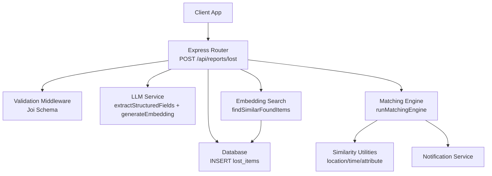
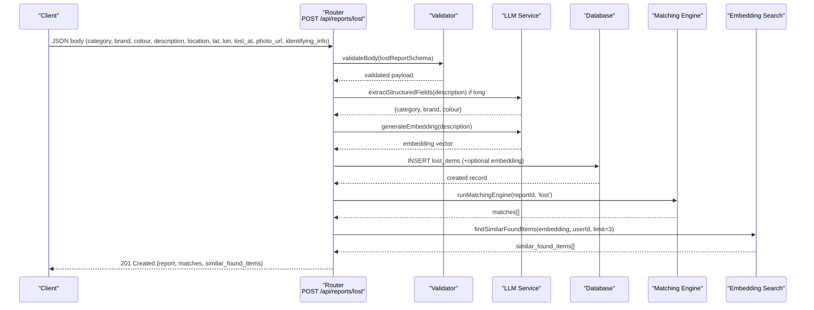
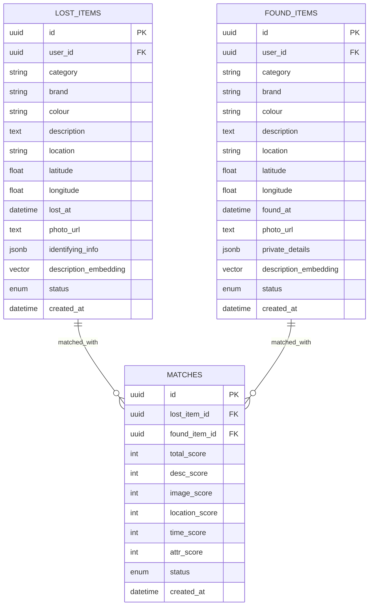
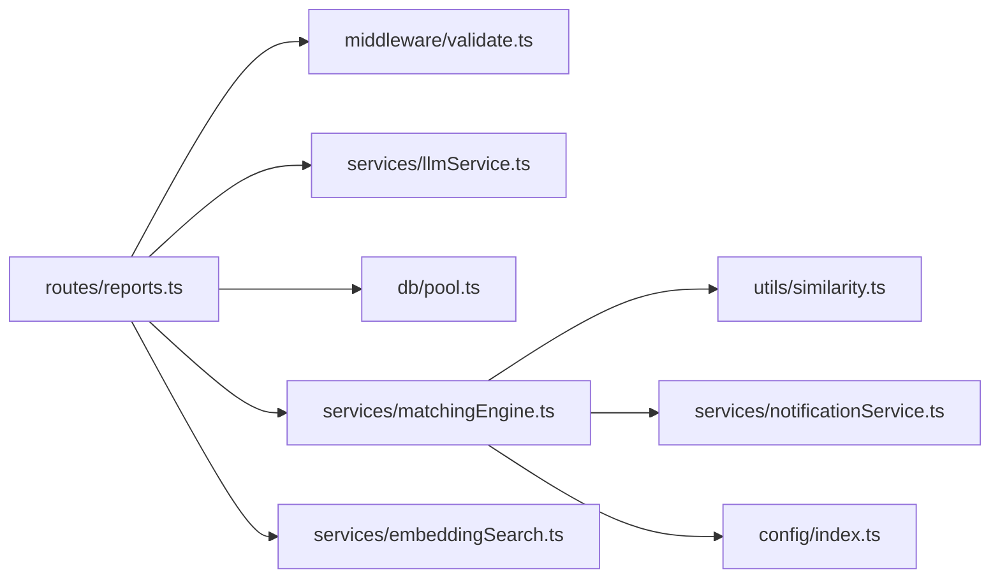

# Lost Item Reports

<cite>
**Referenced Files in This Document**
- [reports.ts](file://backend/src/routes/reports.ts)
- [validate.ts](file://backend/src/middleware/validate.ts)
- [llmService.ts](file://backend/src/services/llmService.ts)
- [embeddingSearch.ts](file://backend/src/services/embeddingSearch.ts)
- [matchingEngine.ts](file://backend/src/services/matchingEngine.ts)
- [similarity.ts](file://backend/src/utils/similarity.ts)
- [config/index.ts](file://backend/src/config/index.ts)
- [API_DOCUMENTATION.md](file://backend/API_DOCUMENTATION.md)
</cite>

## Table of Contents
1. [Introduction](#introduction)
2. [Project Structure](#project-structure)
3. [Core Components](#core-components)
4. [Architecture Overview](#architecture-overview)
5. [Detailed Component Analysis](#detailed-component-analysis)
6. [Dependency Analysis](#dependency-analysis)
7. [Performance Considerations](#performance-considerations)
8. [Troubleshooting Guide](#troubleshooting-guide)
9. [Conclusion](#conclusion)

## Introduction
This document provides detailed documentation for the lost item report management endpoint POST /api/reports/lost. It explains how to create a new lost item report, the AI-powered enrichment and matching pipeline that runs automatically, request and response schemas, examples with various metadata combinations, and how validation errors are handled.

The endpoint supports structured fields (category, brand, colour), free-text description, location and coordinates, timestamp, photo URL, and identifying information. On creation, it:
- Validates input
- Optionally extracts structured fields from free-text using an LLM
- Generates an embedding for semantic search
- Persists the report
- Runs a weighted matching engine against found items
- Returns immediate similar found items via vector similarity

## Project Structure
The lost item reporting flow spans routes, middleware, services, and utilities:
- Route handler: processes requests, orchestrates enrichment, persistence, matching, and similarity search
- Validation: enforces schema rules for request bodies
- LLM service: generates embeddings and extracts structured fields
- Embedding search: finds similar items by cosine similarity using pgvector
- Matching engine: computes multi-factor scores and persists matches
- Similarity utilities: compute location, time, and attribute similarities
- Configuration: defines matching weights and thresholds

**Diagram sources**
- [reports.ts:98-170](file://backend/src/routes/reports.ts#L98-L170)
- [validate.ts:27-38](file://backend/src/middleware/validate.ts#L27-L38)
- [llmService.ts:9-79](file://backend/src/services/llmService.ts#L9-L79)
- [embeddingSearch.ts:68-100](file://backend/src/services/embeddingSearch.ts#L68-L100)
- [matchingEngine.ts:37-188](file://backend/src/services/matchingEngine.ts#L37-L188)
- [similarity.ts:26-82](file://backend/src/utils/similarity.ts#L26-L82)

**Section sources**
- [reports.ts:98-170](file://backend/src/routes/reports.ts#L98-L170)
- [validate.ts:27-38](file://backend/src/middleware/validate.ts#L27-L38)
- [llmService.ts:9-79](file://backend/src/services/llmService.ts#L9-L79)
- [embeddingSearch.ts:68-100](file://backend/src/services/embeddingSearch.ts#L68-L100)
- [matchingEngine.ts:37-188](file://backend/src/services/matchingEngine.ts#L37-L188)
- [similarity.ts:26-82](file://backend/src/utils/similarity.ts#L26-L82)
- [config/index.ts:33-47](file://backend/src/config/index.ts#L33-L47)

## Core Components
- Request validation: Joi schema ensures required and optional fields meet constraints.
- AI enrichment: If description is long enough, extract structured category, brand, colour; otherwise use provided values.
- Embedding generation: Create a 1536-dimension vector for semantic similarity search.
- Persistence: Insert into lost_items table with optional embedding.
- Matching: Run weighted scoring across description, image, location, time, attributes; persist matches above threshold.
- Similarity search: Return top similar found items based on embedding similarity.

Key behaviors:
- Non-fatal failures in AI or matching do not block report creation.
- Private fields like identifying_info are returned only to the owner when fetching reports.

**Section sources**
- [validate.ts:27-38](file://backend/src/middleware/validate.ts#L27-L38)
- [llmService.ts:9-79](file://backend/src/services/llmService.ts#L9-L79)
- [reports.ts:98-170](file://backend/src/routes/reports.ts#L98-L170)
- [matchingEngine.ts:37-188](file://backend/src/services/matchingEngine.ts#L37-L188)
- [embeddingSearch.ts:68-100](file://backend/src/services/embeddingSearch.ts#L68-L100)

## Architecture Overview
The POST /api/reports/lost endpoint follows this sequence:

**Diagram sources**
- [reports.ts:98-170](file://backend/src/routes/reports.ts#L98-L170)
- [llmService.ts:9-79](file://backend/src/services/llmService.ts#L9-L79)
- [matchingEngine.ts:37-188](file://backend/src/services/matchingEngine.ts#L37-L188)
- [embeddingSearch.ts:68-100](file://backend/src/services/embeddingSearch.ts#L68-L100)

## Detailed Component Analysis

### Endpoint: POST /api/reports/lost
- Authentication: All report routes require authentication via JWT Bearer token.
- Request schema: See below.
- Processing:
  - Validate body against Joi schema.
  - Enrich structured fields from description if length > 50 characters.
  - Generate embedding for description.
  - Persist report with optional embedding.
  - Run matching engine asynchronously; failures are logged but do not block response.
  - Immediately query similar found items using embedding.
- Response:
  - Created report fields
  - matches array (weighted match results)
  - similar_found_items array (semantic similarity results)

Request schema (fields):
- category: string, required
- brand: string, optional
- colour: string, optional
- description: string, required, minimum 10 characters
- location: string, required
- latitude: number, optional, range -90 to 90
- longitude: number, optional, range -180 to 180
- lost_at: ISO 8601 date, required
- photo_url: URI string, optional
- identifying_info: string, optional

Response schema (selected fields):
- id: string
- user_id: string
- category: string
- brand: string | null
- colour: string | null
- description: string
- location: string
- latitude: number | null
- longitude: number | null
- event_time: string (ISO)
- photo_url: string | null
- status: string
- created_at: string (ISO)
- type: "lost"
- matches: array of match objects
- similar_found_items: array of similar found items

Match object fields:
- lost_item_id: string
- found_item_id: string
- total_score: number (0–100)
- desc_score: number (0–100)
- image_score: number (0–100)
- location_score: number (0–100)
- time_score: number (0–100)
- attr_score: number (0–100)

Similar found item fields:
- id: string
- category: string
- brand: string | null
- colour: string | null
- description: string
- location: string
- latitude: number | null
- longitude: number | null
- event_time: string (ISO)
- photo_url: string | null
- similarity_score: number (0–100)

Examples:
- Minimal valid request: include category, description, location, lost_at; omit optional fields.
- Full request: include all fields including coordinates, photo_url, identifying_info.
- With short description: structured extraction skipped; provided fields used directly.
- Without embedding: matching still works; similar items may be empty if index not ready.

Validation errors:
- Missing required fields or invalid types return 400 with messages aggregated from validation details.

Notes:
- Identifying_info is stripped for non-owners when retrieving a single report.
- Matching and embedding search are resilient to failures; they do not prevent successful report creation.

**Section sources**
- [reports.ts:98-170](file://backend/src/routes/reports.ts#L98-L170)
- [validate.ts:27-38](file://backend/src/middleware/validate.ts#L27-L38)
- [API_DOCUMENTATION.md:134-216](file://backend/API_DOCUMENTATION.md#L134-L216)

### AI-Powered Field Extraction
- Triggered when description length exceeds a threshold.
- Uses an LLM to parse free text into structured category, brand, colour.
- Fallback to user-provided fields if extraction fails.

Implementation highlights:
- Structured extraction returns normalized category, brand, colour.
- Low temperature for deterministic output.
- Strict JSON response format enforced.

**Section sources**
- [llmService.ts:47-79](file://backend/src/services/llmService.ts#L47-L79)
- [reports.ts:109-117](file://backend/src/routes/reports.ts#L109-L117)

### Embedding Generation and Semantic Search
- Embeddings are generated for descriptions to enable semantic similarity search.
- Vector dimensionality: 1536 dimensions.
- Stored in database column description_embedding (pgvector).
- Similarity search uses cosine distance operator within PostgreSQL for performance.

Behavior:
- If embedding generation fails, matching continues without embeddings.
- Similar found items are queried immediately after insertion; failures are non-fatal.

**Section sources**
- [llmService.ts:9-17](file://backend/src/services/llmService.ts#L9-L17)
- [embeddingSearch.ts:68-100](file://backend/src/services/embeddingSearch.ts#L68-L100)
- [reports.ts:119-163](file://backend/src/routes/reports.ts#L119-L163)

### Automatic Matching Engine Integration
- After inserting a lost report, the matching engine compares it against active found items.
- Scoring factors:
  - Description similarity (embedding cosine or fallback word overlap)
  - Image similarity (visual comparison when both have photos)
  - Location proximity (Haversine-based)
  - Time proximity (time window decay)
  - Attribute similarity (category, brand, colour)
- Weights and thresholds are configurable.
- Matches above threshold are persisted and included in response.
- Notifications are sent for new matches.

Scoring formula and thresholds:
- Weighted sum produces a 0–100 score.
- Minimum threshold filters low-confidence matches.

**Section sources**
- [matchingEngine.ts:37-188](file://backend/src/services/matchingEngine.ts#L37-L188)
- [similarity.ts:26-82](file://backend/src/utils/similarity.ts#L26-L82)
- [config/index.ts:33-47](file://backend/src/config/index.ts#L33-L47)
- [API_DOCUMENTATION.md:19-39](file://backend/API_DOCUMENTATION.md#L19-L39)

### Data Models and Relationships

**Diagram sources**
- [reports.ts:127-145](file://backend/src/routes/reports.ts#L127-L145)
- [matchingEngine.ts:152-171](file://backend/src/services/matchingEngine.ts#L152-L171)

## Dependency Analysis
- Route depends on:
  - Validation middleware for schema enforcement
  - LLM service for enrichment and embeddings
  - Database pool for queries
  - Matching engine for cross-type comparisons
  - Embedding search for immediate similar items
- Matching engine depends on:
  - Similarity utilities for location, time, and attribute scoring
  - Notification service for alerts
- Configuration centralizes weights and thresholds.

**Diagram sources**
- [reports.ts:1-10](file://backend/src/routes/reports.ts#L1-L10)
- [matchingEngine.ts:1-5](file://backend/src/services/matchingEngine.ts#L1-L5)
- [similarity.ts:1-83](file://backend/src/utils/similarity.ts#L1-L83)
- [config/index.ts:1-49](file://backend/src/config/index.ts#L1-L49)

**Section sources**
- [reports.ts:1-10](file://backend/src/routes/reports.ts#L1-L10)
- [matchingEngine.ts:1-5](file://backend/src/services/matchingEngine.ts#L1-L5)
- [similarity.ts:1-83](file://backend/src/utils/similarity.ts#L1-L83)
- [config/index.ts:1-49](file://backend/src/config/index.ts#L1-L49)

## Performance Considerations
- Embedding generation and image similarity calls are external API calls; ensure timeouts and retries are configured appropriately.
- Vector similarity search leverages pgvector operators to keep computation in-database for efficiency.
- Matching engine iterates over candidates; consider indexing strategies and pagination if candidate sets grow large.
- Non-fatal error handling prevents cascading failures; critical paths remain responsive even if AI features fail.

[No sources needed since this section provides general guidance]

## Troubleshooting Guide
Common issues and resolutions:
- Validation errors (400): Check required fields and formats; review aggregated error messages from validation middleware.
- Missing or invalid JWT (401): Ensure Authorization header includes a valid Bearer token.
- Access denied (403): When accessing another user’s reports, verify role permissions.
- Resource not found (404): Report ID does not exist or has been deleted.
- Too many requests (429): Rate limits or verification retry limits exceeded; back off and retry.

Operational notes:
- If embedding generation fails, matching still proceeds; similar items may be empty until vectors are available.
- If matching engine fails, the report is still created; check logs for matching errors.
- Identifying_info is hidden for non-owners; ensure correct ownership checks when retrieving reports.

**Section sources**
- [API_DOCUMENTATION.md:782-800](file://backend/API_DOCUMENTATION.md#L782-L800)
- [reports.ts:322-355](file://backend/src/routes/reports.ts#L322-L355)

## Conclusion
The POST /api/reports/lost endpoint provides a robust, AI-enhanced workflow for creating lost item reports. It validates inputs, enriches structured data from free text, generates embeddings for semantic search, persists reports, and integrates a weighted matching engine to surface potential matches. Immediate similar found items are returned to aid users in discovering related items. The design emphasizes resilience, with non-fatal AI and matching failures ensuring reliable report creation.

[No sources needed since this section summarizes without analyzing specific files]