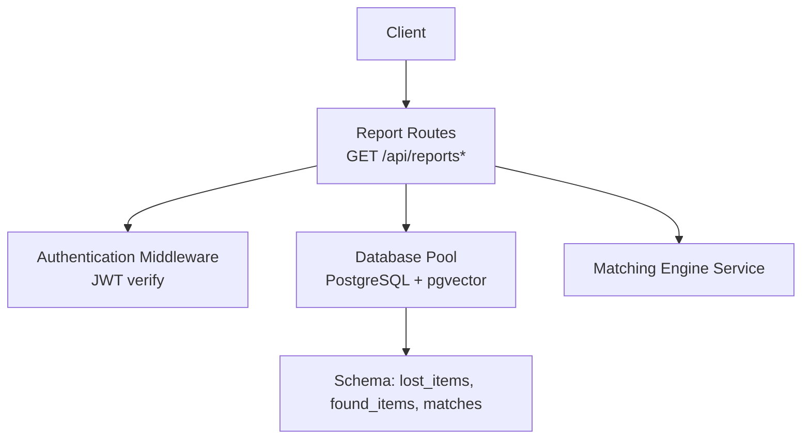
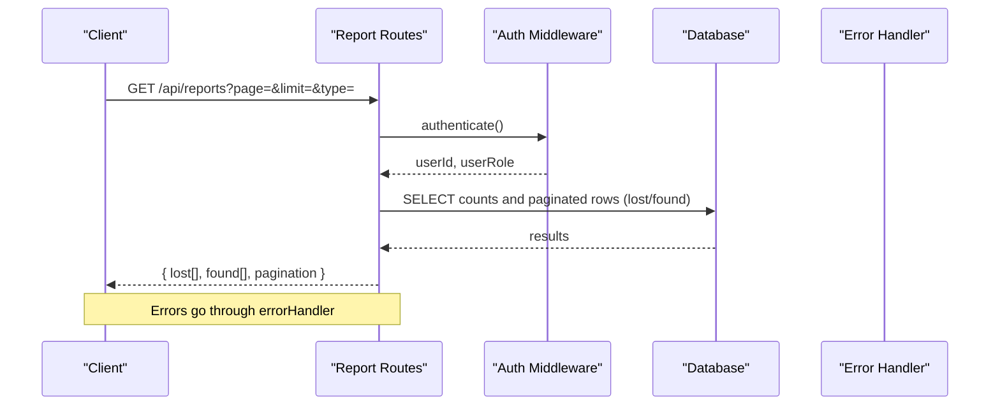
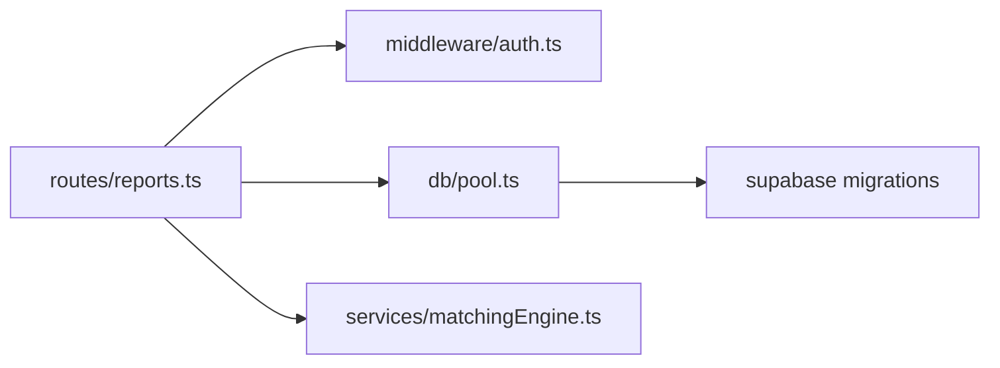

# Report Management & Retrieval

<cite>
**Referenced Files in This Document**
- [reports.ts](file://backend/src/routes/reports.ts)
- [auth.ts](file://backend/src/middleware/auth.ts)
- [errorHandler.ts](file://backend/src/middleware/errorHandler.ts)
- [matchingEngine.ts](file://backend/src/services/matchingEngine.ts)
- [001_initial_schema.sql](file://supabase/migrations/001_initial_schema.sql)
- [API_DOCUMENTATION.md](file://backend/API_DOCUMENTATION.md)
</cite>

## Table of Contents
1. [Introduction](#introduction)
2. [Project Structure](#project-structure)
3. [Core Components](#core-components)
4. [Architecture Overview](#architecture-overview)
5. [Detailed Component Analysis](#detailed-component-analysis)
6. [Dependency Analysis](#dependency-analysis)
7. [Performance Considerations](#performance-considerations)
8. [Troubleshooting Guide](#troubleshooting-guide)
9. [Conclusion](#conclusion)

## Introduction
This document provides comprehensive documentation for report retrieval and management endpoints, focusing on:
- Listing active reports with pagination and filtering
- Retrieving user-specific reports with access control
- Fetching individual reports with privacy-aware responses
- Public view of found items with redacted private details
It also covers authentication requirements, authorization checks, error handling, and example usage patterns.

## Project Structure
The report endpoints are implemented in the backend routes layer and protected by middleware for authentication and error handling. The data model is defined in the database schema, and matching logic is encapsulated in a service module.

**Diagram sources**
- [reports.ts:1-14](file://backend/src/routes/reports.ts#L1-L14)
- [auth.ts:22-37](file://backend/src/middleware/auth.ts#L22-L37)
- [001_initial_schema.sql:69-140](file://supabase/migrations/001_initial_schema.sql#L69-L140)

**Section sources**
- [reports.ts:1-14](file://backend/src/routes/reports.ts#L1-L14)
- [auth.ts:22-37](file://backend/src/middleware/auth.ts#L22-L37)
- [001_initial_schema.sql:69-140](file://supabase/migrations/001_initial_schema.sql#L69-L140)

## Core Components
- Authentication middleware validates JWT tokens and attaches user identity and role to requests.
- Report routes implement listing, user-scoped retrieval, single report retrieval, and public found-item view.
- Error handling centralizes error responses and async wrapper ensures consistent error propagation.
- Matching engine computes similarity scores and persists matches; it is invoked during creation but not required for read endpoints.

**Section sources**
- [auth.ts:22-37](file://backend/src/middleware/auth.ts#L22-L37)
- [reports.ts:40-93](file://backend/src/routes/reports.ts#L40-L93)
- [reports.ts:253-279](file://backend/src/routes/reports.ts#L253-L279)
- [reports.ts:286-317](file://backend/src/routes/reports.ts#L286-L317)
- [reports.ts:322-355](file://backend/src/routes/reports.ts#L322-L355)
- [errorHandler.ts:16-47](file://backend/src/middleware/errorHandler.ts#L16-L47)

## Architecture Overview
All report endpoints require authentication via Bearer token. The listing endpoint supports pagination and type filtering, returning unified metadata for both lost and found items. User-scoped retrieval enforces ownership or admin privileges. Single report retrieval strips sensitive fields for non-owners. The public found-item view hides private verification details unless the caller owns the item or is an admin.

**Diagram sources**
- [reports.ts:40-93](file://backend/src/routes/reports.ts#L40-L93)
- [auth.ts:22-37](file://backend/src/middleware/auth.ts#L22-L37)
- [errorHandler.ts:16-47](file://backend/src/middleware/errorHandler.ts#L16-L47)

## Detailed Component Analysis

### GET /api/reports — List all active reports with pagination and filtering
- Purpose: Return active lost and found items with unified pagination metadata.
- Query parameters:
  - page: integer, default 1
  - limit: integer, default 20, capped at 50
  - type: string, one of all|lost|found
- Behavior:
  - If type is all or lost: fetch count and paginated rows from lost_items where status = 'active'
  - If type is all or found: fetch count and paginated rows from found_items where status = 'active'
  - Response includes arrays for lost and found plus pagination object containing page, limit, total_lost, total_found
- Authentication: Required (Bearer token)
- Authorization: No per-record ownership check; only active items are returned
- Error handling: Uses async handler and centralized error formatter

Example queries:
- Get first page of all active reports: GET /api/reports?page=1&limit=20&type=all
- Get lost-only reports, page 2, 10 per page: GET /api/reports?page=2&limit=10&type=lost
- Get found-only reports, default pagination: GET /api/reports?type=found

Response structure:
- lost: array of lost items
- found: array of found items
- pagination: { page, limit, total_lost, total_found }

**Section sources**
- [reports.ts:40-93](file://backend/src/routes/reports.ts#L40-L93)
- [API_DOCUMENTATION.md:130-132](file://backend/API_DOCUMENTATION.md#L130-L132)

### GET /api/reports/user/:userId — Retrieve user-specific reports
- Purpose: Return all reports belonging to a specified user.
- Access control:
  - Regular users can only retrieve their own reports
  - Admins can retrieve any user’s reports
- Behavior:
  - Validates that req.userId equals :userId or req.userRole is admin
  - Returns two arrays: lost and found, ordered by creation time
- Authentication: Required (Bearer token)
- Authorization: Ownership or admin role required
- Error handling: Throws forbidden if unauthorized

Example:
- GET /api/reports/user/<user-id> with valid Bearer token

Response structure:
- lost: array of user’s lost items
- found: array of user’s found items

**Section sources**
- [reports.ts:253-279](file://backend/src/routes/reports.ts#L253-L279)
- [auth.ts:22-37](file://backend/src/middleware/auth.ts#L22-L37)

### GET /api/reports/:id — Individual report retrieval with privacy protection
- Purpose: Retrieve a single report by ID across both lost and found tables.
- Privacy behavior:
  - For lost items, identifying_info is stripped for non-owners
  - Owners and admins see full fields including identifying_info
- Behavior:
  - Searches lost_items first, then found_items
  - Returns normalized fields with type indicator
  - Strips identifying_info when caller is not owner
- Authentication: Required (Bearer token)
- Authorization: Owner or admin sees private fields; others see redacted view
- Error handling: 404 if not found

Example:
- GET /api/reports/<report-id> with valid Bearer token

Response structure:
- Common fields: id, user_id, category, brand, colour, description, location, latitude, longitude, event_time, photo_url, status, created_at, type
- Private fields: identifying_info present only for owners/admins

**Section sources**
- [reports.ts:322-355](file://backend/src/routes/reports.ts#L322-L355)
- [001_initial_schema.sql:94-96](file://supabase/migrations/001_initial_schema.sql#L94-L96)

### GET /api/reports/found/:id — Public view of found items with redacted private_details
- Purpose: Provide a public-facing view of a found item while protecting private verification details.
- Privacy behavior:
  - private_details is withheld for non-owners/non-admins
  - Owners and admins receive private_details populated
- Behavior:
  - Retrieves base fields without private_details
  - Conditionally fetches private_details for authorized callers
  - Returns null for private_details when unauthenticated or unauthorized
- Authentication: Required (Bearer token)
- Authorization: Owner or admin sees private_details; others see redacted view
- Error handling: 404 if not found

Example:
- GET /api/reports/found/<found-id> with valid Bearer token

Response structure:
- Base fields: id, user_id, category, brand, colour, description, location, latitude, longitude, found_at, photo_url, status, created_at
- private_details: object for owners/admins; null otherwise

**Section sources**
- [reports.ts:286-317](file://backend/src/routes/reports.ts#L286-L317)
- [001_initial_schema.sql:132-134](file://supabase/migrations/001_initial_schema.sql#L132-L134)

### Authentication and Authorization
- All report endpoints are protected by authentication middleware that validates JWT tokens from the Authorization header.
- On success, userId and userRole are attached to the request for downstream authorization checks.
- Unauthorized or invalid tokens result in 401 errors.
- Forbidden access (e.g., accessing another user’s reports) results in 403 errors.

**Section sources**
- [auth.ts:22-37](file://backend/src/middleware/auth.ts#L22-L37)
- [reports.ts:13-14](file://backend/src/routes/reports.ts#L13-L14)

### Error Handling
- Centralized error handler formats operational errors into a consistent JSON shape with status and message.
- Async handler wraps route handlers to catch and forward errors uniformly.
- Typical statuses:
  - 401: Missing or invalid JWT
  - 403: Insufficient permissions
  - 404: Resource not found
  - 400: Validation or bad request
  - 500: Unexpected server error

**Section sources**
- [errorHandler.ts:16-47](file://backend/src/middleware/errorHandler.ts#L16-L47)

## Dependency Analysis
- Route-level dependencies:
  - Authentication middleware for JWT validation
  - Database pool for querying lost_items and found_items
  - Matching engine service for post-create matching (not used in read endpoints)
- Data model dependencies:
  - lost_items and found_items tables define core fields and privacy-sensitive columns
  - Matches table stores computed similarities and is updated by the matching engine

**Diagram sources**
- [reports.ts:1-14](file://backend/src/routes/reports.ts#L1-L14)
- [auth.ts:22-37](file://backend/src/middleware/auth.ts#L22-L37)
- [matchingEngine.ts:37-189](file://backend/src/services/matchingEngine.ts#L37-L189)
- [001_initial_schema.sql:69-166](file://supabase/migrations/001_initial_schema.sql#L69-L166)

**Section sources**
- [reports.ts:1-14](file://backend/src/routes/reports.ts#L1-L14)
- [matchingEngine.ts:37-189](file://backend/src/services/matchingEngine.ts#L37-L189)
- [001_initial_schema.sql:69-166](file://supabase/migrations/001_initial_schema.sql#L69-L166)

## Performance Considerations
- Pagination:
  - Use page and limit to avoid large payloads; limit is capped at 50 to prevent excessive queries
- Filtering:
  - type parameter reduces query scope to lost, found, or both
- Indexes:
  - Status and user indexes improve performance for active filtering and user-scoped queries
- Embeddings:
  - Description embeddings enable fast similarity search; however, read endpoints do not rely on them
- Private fields:
  - Selecting only necessary columns and conditionally fetching private_details minimizes overhead

[No sources needed since this section provides general guidance]

## Troubleshooting Guide
Common issues and resolutions:
- 401 Unauthorized:
  - Ensure Authorization header contains a valid Bearer token
  - Verify token is not expired and signed with correct secret
- 403 Forbidden:
  - Check that you are accessing your own reports or have admin role
  - Confirm user role in token matches database role
- 404 Not Found:
  - Verify report ID exists and is active
  - For found item public view, ensure the item exists
- 400 Bad Request:
  - Validate query parameters (page, limit, type)
  - Ensure proper content types for uploads or POST requests

Error response format:
- { status: "error", message: "<description>" }

**Section sources**
- [errorHandler.ts:16-47](file://backend/src/middleware/errorHandler.ts#L16-L47)
- [API_DOCUMENTATION.md:782-800](file://backend/API_DOCUMENTATION.md#L782-L800)

## Conclusion
The report retrieval endpoints provide secure, privacy-aware access to lost and found items with robust pagination and filtering. Authentication and authorization ensure that sensitive fields are only visible to owners or administrators. The design balances usability with security, offering clear error handling and predictable response structures.

[No sources needed since this section summarizes without analyzing specific files]