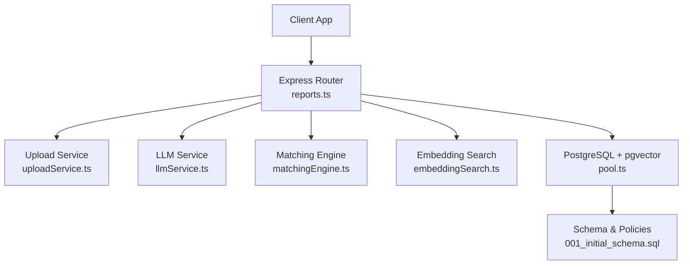
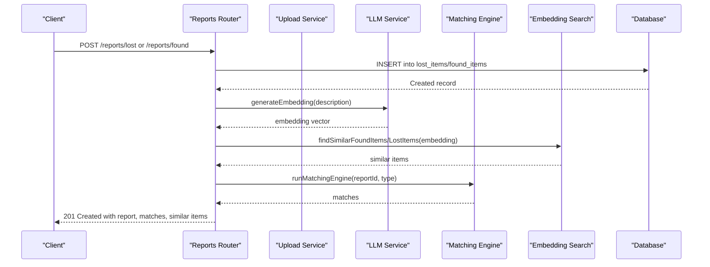
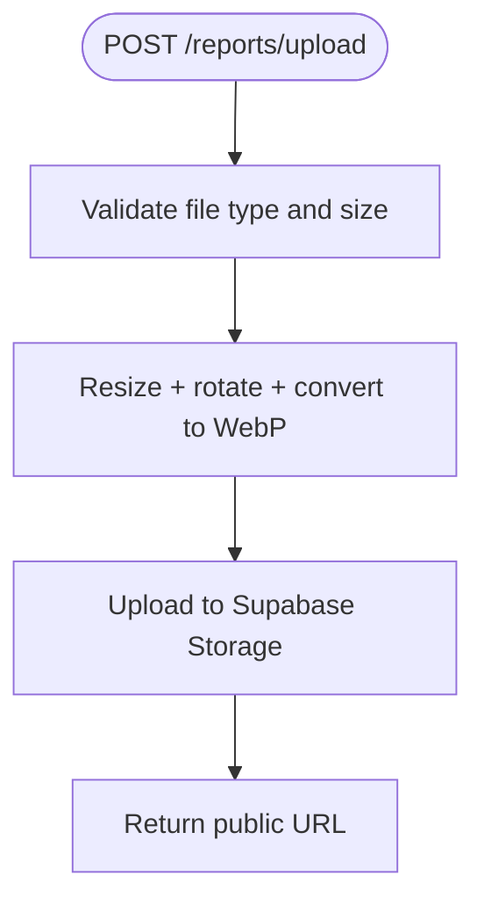
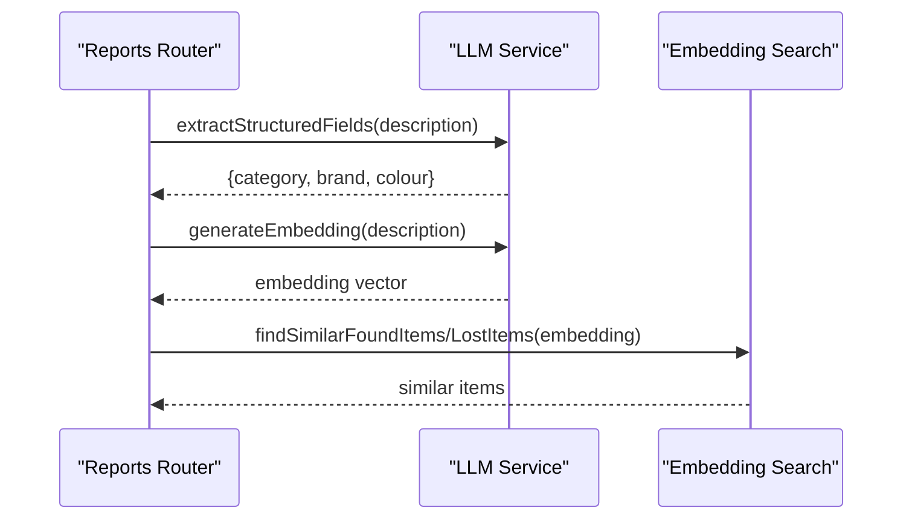
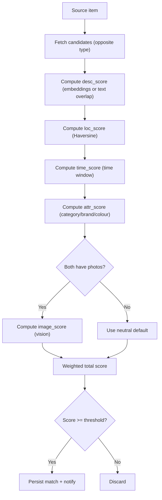
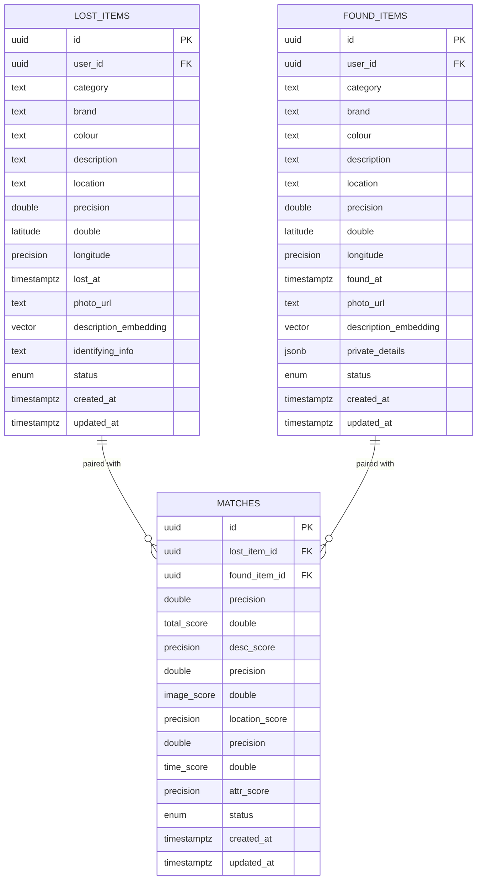
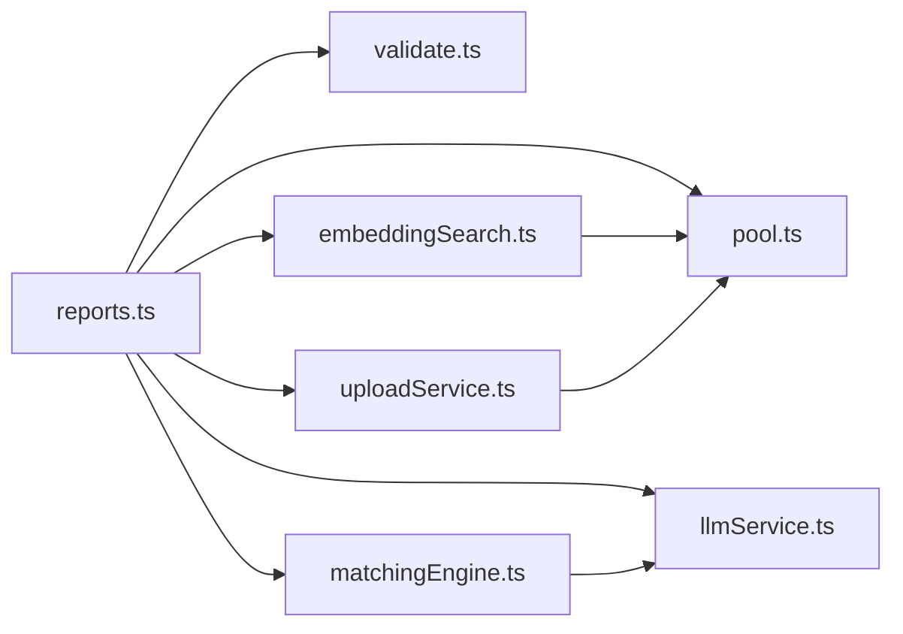

# Reports API

<cite>
**Referenced Files in This Document**
- [reports.ts](file://backend/src/routes/reports.ts)
- [uploadService.ts](file://backend/src/services/uploadService.ts)
- [llmService.ts](file://backend/src/services/llmService.ts)
- [validate.ts](file://backend/src/middleware/validate.ts)
- [embeddingSearch.ts](file://backend/src/services/embeddingSearch.ts)
- [matchingEngine.ts](file://backend/src/services/matchingEngine.ts)
- [pool.ts](file://backend/src/db/pool.ts)
- [001_initial_schema.sql](file://supabase/migrations/001_initial_schema.sql)
- [API_DOCUMENTATION.md](file://backend/API_DOCUMENTATION.md)
</cite>

## Table of Contents
1. [Introduction](#introduction)
2. [Project Structure](#project-structure)
3. [Core Components](#core-components)
4. [Architecture Overview](#architecture-overview)
5. [Detailed Component Analysis](#detailed-component-analysis)
6. [Dependency Analysis](#dependency-analysis)
7. [Performance Considerations](#performance-considerations)
8. [Troubleshooting Guide](#troubleshooting-guide)
9. [Conclusion](#conclusion)
10. [Appendices](#appendices)

## Introduction
This document provides comprehensive API documentation for managing lost and found item reports. It covers creating, retrieving, updating (via status changes), and deleting reports; handling image uploads; validating metadata; and leveraging AI-powered field extraction and similarity search. It also defines request/response schemas for both lost and found items, including structured fields such as category, brand, color, location, and timestamps, along with examples of report creation workflows, image processing, and search functionality.

## Project Structure
The backend exposes REST endpoints under /api/reports for report management, with supporting services for file upload, AI embedding generation, LLM-based field extraction, matching, and vector similarity search. The database schema defines tables for lost_items, found_items, matches, and related entities, with indexes and row-level security policies.

**Diagram sources**
- [reports.ts:1-356](file://backend/src/routes/reports.ts#L1-L356)
- [uploadService.ts:1-66](file://backend/src/services/uploadService.ts#L1-L66)
- [llmService.ts:1-120](file://backend/src/services/llmService.ts#L1-L120)
- [matchingEngine.ts:1-208](file://backend/src/services/matchingEngine.ts#L1-L208)
- [embeddingSearch.ts:1-101](file://backend/src/services/embeddingSearch.ts#L1-L101)
- [pool.ts:1-48](file://backend/src/db/pool.ts#L1-L48)
- [001_initial_schema.sql:1-370](file://supabase/migrations/001_initial_schema.sql#L1-L370)

**Section sources**
- [reports.ts:1-356](file://backend/src/routes/reports.ts#L1-L356)
- [001_initial_schema.sql:1-370](file://supabase/migrations/001_initial_schema.sql#L1-L370)

## Core Components
- Report routes: Create lost/found reports, list active reports, retrieve by ID or user, and handle uploads.
- Validation: Joi-based request body validation for lost and found schemas.
- File upload: Multer + Sharp to resize/optimize images and store in Supabase Storage.
- AI features: OpenAI embeddings for text similarity and GPT vision for image similarity; LLM extracts structured fields from free-text descriptions.
- Matching engine: Computes weighted scores across description, image, location, time, and attributes; persists matches and sends notifications.
- Vector search: PostgreSQL pgvector queries for fast similarity retrieval.

**Section sources**
- [reports.ts:16-356](file://backend/src/routes/reports.ts#L16-L356)
- [validate.ts:25-51](file://backend/src/middleware/validate.ts#L25-L51)
- [uploadService.ts:14-65](file://backend/src/services/uploadService.ts#L14-L65)
- [llmService.ts:9-79](file://backend/src/services/llmService.ts#L9-L79)
- [matchingEngine.ts:37-189](file://backend/src/services/matchingEngine.ts#L37-L189)
- [embeddingSearch.ts:30-100](file://backend/src/services/embeddingSearch.ts#L30-L100)

## Architecture Overview
The report lifecycle includes:
- Authentication via JWT middleware on all report routes.
- Optional image upload to obtain a public URL before creating a report.
- Creation of lost/found reports with validated metadata and optional AI enrichment.
- Automatic matching and similarity search post-insertion.
- Retrieval endpoints that enforce privacy rules and return normalized structures.

**Diagram sources**
- [reports.ts:98-247](file://backend/src/routes/reports.ts#L98-L247)
- [llmService.ts:9-17](file://backend/src/services/llmService.ts#L9-L17)
- [embeddingSearch.ts:30-100](file://backend/src/services/embeddingSearch.ts#L30-L100)
- [matchingEngine.ts:37-189](file://backend/src/services/matchingEngine.ts#L37-L189)

## Detailed Component Analysis

### Report Endpoints
- POST /reports/upload
  - Purpose: Upload an item photo, optimize it, and return a public URL.
  - Input: multipart/form-data with field photo (image, max 5 MB).
  - Output: JSON with photo_url.
  - Notes: Image is resized and converted to WebP; stored in Supabase bucket.

- GET /reports
  - Purpose: List active reports (lost and/or found), paginated.
  - Query params: page (default 1), limit (default 20, max 50), type (lost|found|all).
  - Output: { lost: [], found: [], pagination: { page, limit, total_lost, total_found } }.

- POST /reports/lost
  - Purpose: Create a lost-item report.
  - Request body: See Lost Item Request Schema below.
  - Behavior: Validates input, optionally enriches structured fields via LLM, generates embedding, inserts record, runs matching engine, performs vector similarity search, returns created report with matches and similar items.

- POST /reports/found
  - Purpose: Create a found-item report.
  - Request body: See Found Item Request Schema below.
  - Behavior: Similar to lost but stores private_details and searches for similar lost items.

- GET /reports/user/:userId
  - Purpose: Retrieve all reports belonging to a user.
  - Access control: Users can only access their own; admins can access any.

- GET /reports/found/:id
  - Purpose: Public view of a found item; hides private_details unless owner/admin.

- GET /reports/:id
  - Purpose: Get a single report by ID (searches lost first, then found); strips identifying_info for non-owners.

Request/Response Schemas
- Lost Item Request
  - Required: category (string), description (string, min 10), location (string), lost_at (ISO date).
  - Optional: brand (string|null), colour (string|null), latitude (number -90..90), longitude (number -180..180), photo_url (URI|null), identifying_info (string|null).
  - Response: 201 Created with id, category, brand, colour, description, location, event_time (lost_at), status, created_at, matches, similar_found_items.

- Found Item Request
  - Required: category (string), description (string, min 10), location (string), found_at (ISO date).
  - Optional: brand (string|null), colour (string|null), latitude (number -90..90), longitude (number -180..180), photo_url (URI|null), private_details (object|null).
  - Response: 201 Created with id, category, brand, colour, description, location, event_time (found_at), status, created_at, matches, similar_lost_items.

- Listing Response
  - Fields: lost[], found[], pagination{page, limit, total_lost, total_found}.

- Single Report Response
  - Common fields: id, user_id, category, brand, colour, description, location, latitude, longitude, event_time, photo_url, status, created_at, type ("lost"|"found").
  - Privacy: identifying_info hidden for non-owners; private_details null for non-owners on found items.

Error Handling
- Validation errors: 400 with message detailing failures.
- Not found: 404 when report does not exist.
- Access denied: 403 when accessing another user’s data without admin role.
- Upload errors: 400 for invalid file types; 500 for storage failures.

Examples
- Creating a lost report: see cURL example in API docs.
- Uploading an image: multipart form with photo field; returns public URL to use in report creation.

**Section sources**
- [reports.ts:16-356](file://backend/src/routes/reports.ts#L16-L356)
- [validate.ts:25-51](file://backend/src/middleware/validate.ts#L25-L51)
- [API_DOCUMENTATION.md:130-378](file://backend/API_DOCUMENTATION.md#L130-L378)

### File Upload Handling
- Endpoint: POST /reports/upload
- Middleware: Multer memory storage with size limit and MIME type filtering.
- Processing: Sharp resizes to max width 1280px, rotates based on EXIF, converts to WebP at quality 82.
- Storage: Supabase Storage bucket item-photos; immutable filenames via UUID; public URL returned.

**Diagram sources**
- [uploadService.ts:14-65](file://backend/src/services/uploadService.ts#L14-L65)

**Section sources**
- [uploadService.ts:1-66](file://backend/src/services/uploadService.ts#L1-L66)

### Metadata Validation
- Joi schemas enforce required fields, formats, and ranges.
- Unknown fields are stripped; validation errors aggregated and returned.

**Section sources**
- [validate.ts:8-23](file://backend/src/middleware/validate.ts#L8-L23)
- [validate.ts:25-51](file://backend/src/middleware/validate.ts#L25-L51)

### AI-Powered Field Extraction and Embeddings
- Structured field extraction: LLM parses free-text descriptions to extract category, brand, and colour.
- Embedding generation: Text embeddings used for similarity search and matching.
- Image similarity: Vision model compares two images to compute similarity score.

**Diagram sources**
- [llmService.ts:47-79](file://backend/src/services/llmService.ts#L47-L79)
- [llmService.ts:9-17](file://backend/src/services/llmService.ts#L9-L17)
- [embeddingSearch.ts:30-100](file://backend/src/services/embeddingSearch.ts#L30-L100)

**Section sources**
- [llmService.ts:9-120](file://backend/src/services/llmService.ts#L9-L120)

### Matching Engine and Similarity Search
- Matching engine computes weighted scores:
  - Description similarity (embeddings or fallback word overlap)
  - Image similarity (vision comparison if both have photos)
  - Location proximity (Haversine distance)
  - Time proximity (time window decay)
  - Attribute similarity (category, brand, colour)
- Matches above threshold are persisted and notifications sent.
- Vector similarity search uses pgvector cosine distance for fast retrieval.

**Diagram sources**
- [matchingEngine.ts:37-189](file://backend/src/services/matchingEngine.ts#L37-L189)
- [API_DOCUMENTATION.md:19-39](file://backend/API_DOCUMENTATION.md#L19-L39)

**Section sources**
- [matchingEngine.ts:1-208](file://backend/src/services/matchingEngine.ts#L1-L208)
- [embeddingSearch.ts:1-101](file://backend/src/services/embeddingSearch.ts#L1-L101)
- [API_DOCUMENTATION.md:19-39](file://backend/API_DOCUMENTATION.md#L19-L39)

### Data Models and Database Schema
- Tables:
  - lost_items: structured fields, location/time, media, AI embedding, private identifying info, status.
  - found_items: structured fields, location/time, media, AI embedding, private details (JSONB), status.
  - matches: pairs with scoring breakdown and status.
  - verification_questions, verification_attempts, notifications, item_status_log.
- Indexes:
  - User, status, category indexes; IVFFLAT vector indexes for embeddings; match score index.
- Row-Level Security:
  - Active items visible to all; owners manage own items; users see own notifications; matches visible to item owners.

**Diagram sources**
- [001_initial_schema.sql:69-166](file://supabase/migrations/001_initial_schema.sql#L69-L166)

**Section sources**
- [001_initial_schema.sql:1-370](file://supabase/migrations/001_initial_schema.sql#L1-L370)

## Dependency Analysis
- Route handlers depend on:
  - Validation middleware for request bodies.
  - Upload service for image processing and storage.
  - LLM service for embeddings and field extraction.
  - Matching engine for scoring and persistence.
  - Embedding search for immediate similarity results.
  - Database pool for queries and transactions.

**Diagram sources**
- [reports.ts:1-356](file://backend/src/routes/reports.ts#L1-L356)
- [validate.ts:1-61](file://backend/src/middleware/validate.ts#L1-L61)
- [uploadService.ts:1-66](file://backend/src/services/uploadService.ts#L1-L66)
- [llmService.ts:1-120](file://backend/src/services/llmService.ts#L1-L120)
- [matchingEngine.ts:1-208](file://backend/src/services/matchingEngine.ts#L1-L208)
- [embeddingSearch.ts:1-101](file://backend/src/services/embeddingSearch.ts#L1-L101)
- [pool.ts:1-48](file://backend/src/db/pool.ts#L1-L48)

**Section sources**
- [reports.ts:1-356](file://backend/src/routes/reports.ts#L1-L356)
- [matchingEngine.ts:1-208](file://backend/src/services/matchingEngine.ts#L1-L208)

## Performance Considerations
- Use pgvector IVFFLAT indexes for fast cosine similarity searches.
- Limit result sets with pagination and minimum similarity thresholds.
- Non-blocking matching: matching runs after insertion; failures do not block response.
- Image optimization reduces bandwidth and storage costs.
- Embedding generation and vision comparisons are external API calls; consider caching or retries where appropriate.

[No sources needed since this section provides general guidance]

## Troubleshooting Guide
Common issues and resolutions:
- Validation errors: Ensure all required fields are present and correctly formatted; check min lengths and numeric ranges.
- Upload failures: Verify file type and size; confirm Supabase storage bucket exists and permissions are set.
- Missing matches: Check that embeddings were generated and vector indexes exist; ensure candidate items are active and not owned by the same user.
- Privacy violations: Confirm ownership checks; identify_info and private_details are restricted appropriately.

**Section sources**
- [validate.ts:8-23](file://backend/src/middleware/validate.ts#L8-L23)
- [uploadService.ts:14-27](file://backend/src/services/uploadService.ts#L14-L27)
- [reports.ts:253-355](file://backend/src/routes/reports.ts#L253-L355)

## Conclusion
The Reports API provides robust CRUD operations for lost and found items, with strong validation, secure file uploads, and AI-driven enrichment and matching. It supports efficient similarity search using pgvector and offers privacy controls to protect sensitive information. The system integrates seamlessly with authentication, notifications, and verification workflows to facilitate item recovery.

[No sources needed since this section summarizes without analyzing specific files]

## Appendices

### Example Workflows
- Create a lost report:
  - Upload image to obtain a public URL.
  - Submit POST /reports/lost with validated fields; receive created report, matches, and similar found items.
- Create a found report:
  - Submit POST /reports/found with validated fields; receive created report, matches, and similar lost items.
- Search functionality:
  - Use GET /reports?type=all&limit=20&page=1 to list active items.
  - Leverage AI-generated embeddings for similarity-based discovery via matching and vector search.

**Section sources**
- [API_DOCUMENTATION.md:130-378](file://backend/API_DOCUMENTATION.md#L130-L378)
- [reports.ts:40-93](file://backend/src/routes/reports.ts#L40-L93)