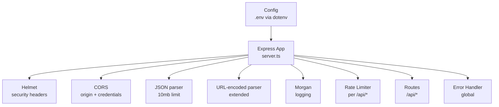
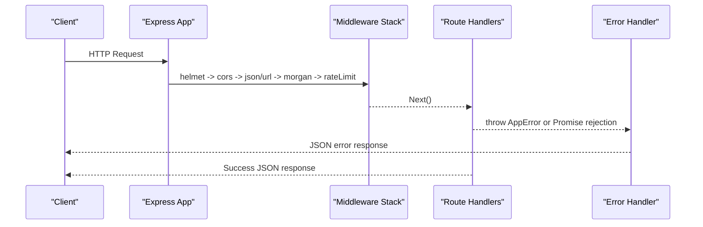
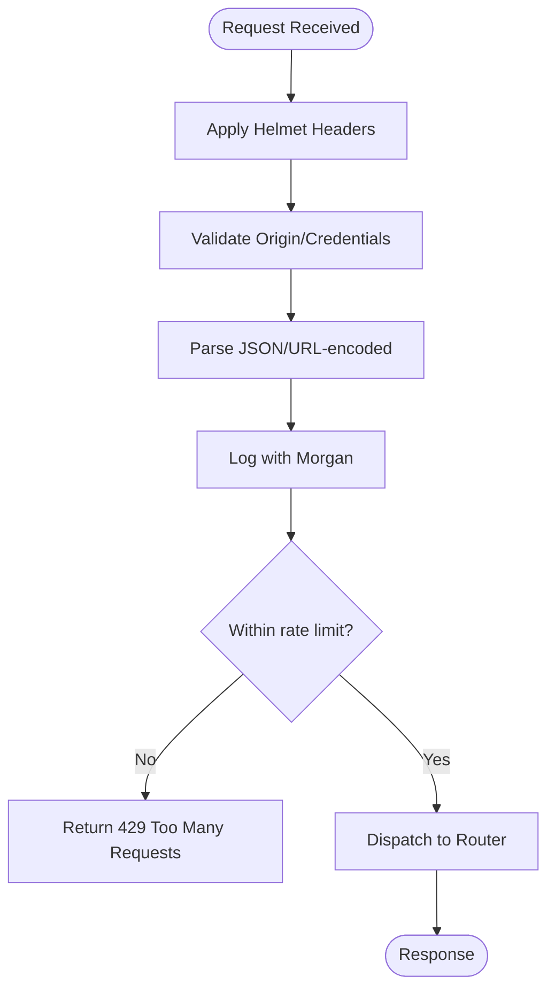
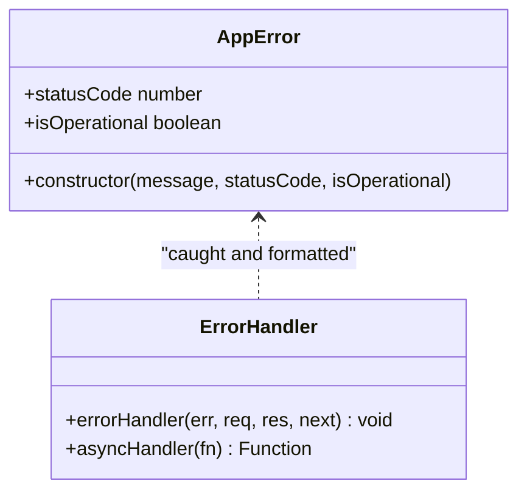
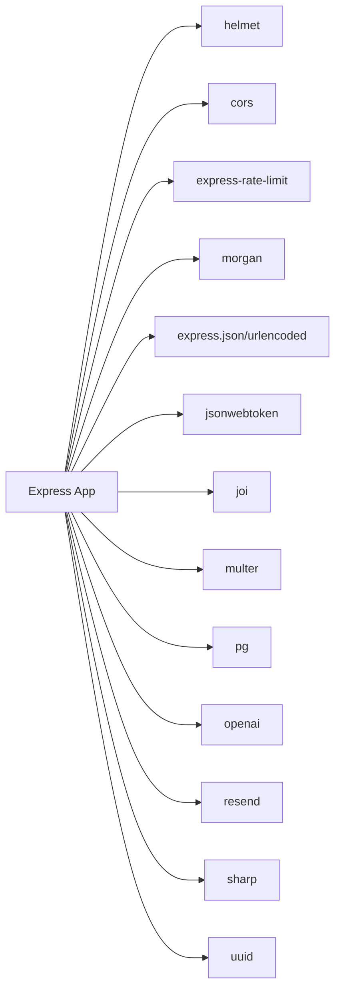

# Server Setup & Configuration

<cite>
**Referenced Files in This Document**
- [server.ts](file://backend/src/server.ts)
- [index.ts](file://backend/src/config/index.ts)
- [errorHandler.ts](file://backend/src/middleware/errorHandler.ts)
- [auth.ts](file://backend/src/middleware/auth.ts)
- [validate.ts](file://backend/src/middleware/validate.ts)
- [auth.ts](file://backend/src/routes/auth.ts)
- [reports.ts](file://backend/src/routes/reports.ts)
- [package.json](file://backend/package.json)
</cite>

## Table of Contents
1. [Introduction](#introduction)
2. [Project Structure](#project-structure)
3. [Core Components](#core-components)
4. [Architecture Overview](#architecture-overview)
5. [Detailed Component Analysis](#detailed-component-analysis)
6. [Dependency Analysis](#dependency-analysis)
7. [Performance Considerations](#performance-considerations)
8. [Troubleshooting Guide](#troubleshooting-guide)
9. [Conclusion](#conclusion)
10. [Appendices](#appendices)

## Introduction
This document explains how the Express.js server is initialized and configured, including middleware stack (helmet security headers, CORS, rate limiting, request logging with Morgan), JSON parsing limits, environment configuration management, port configuration, health check endpoint, error handling middleware integration, and route mounting patterns. It also provides examples for starting the server, configuring options, and troubleshooting common issues.

## Project Structure
The backend server is defined in a single entry point that wires up core middleware, mounts routes under /api/*, and starts listening on a configurable port. Environment variables are loaded from a .env file and exposed through a centralized config module.

**Diagram sources**
- [server.ts:1-52](file://backend/src/server.ts#L1-L52)
- [index.ts:1-49](file://backend/src/config/index.ts#L1-L49)

**Section sources**
- [server.ts:1-52](file://backend/src/server.ts#L1-L52)
- [index.ts:1-49](file://backend/src/config/index.ts#L1-L49)

## Core Components
- Server initialization and middleware ordering: helmet, cors, body parsers, morgan, rate limiter, routes, global error handler.
- Health check endpoint at GET /api/health returning status and timestamp.
- Route mounting under /api for auth, reports, matches, verify, admin, notifications, upload, messages.
- Centralized configuration via dotenv loading from the repository root .env file.

Key behaviors:
- Helmet applies secure HTTP headers globally.
- CORS allows requests from the configured frontend URL with credentials enabled.
- JSON bodies are parsed up to 10 MB; URL-encoded bodies are supported with extended mode.
- Morgan logs requests using combined format in production and dev-friendly format otherwise.
- Rate limiting restricts API endpoints to 100 requests per 15 minutes.

**Section sources**
- [server.ts:18-45](file://backend/src/server.ts#L18-L45)
- [index.ts:6-10](file://backend/src/config/index.ts#L6-L10)

## Architecture Overview
The server follows a layered architecture:
- Entry point wires global middleware and mounts feature-specific routers.
- Middleware enforces security, parsing, logging, and rate control before routing.
- Routes implement business logic and return standardized responses.
- Global error handler centralizes error formatting and status codes.

**Diagram sources**
- [server.ts:18-45](file://backend/src/server.ts#L18-L45)
- [errorHandler.ts:16-47](file://backend/src/middleware/errorHandler.ts#L16-L47)

## Detailed Component Analysis

### Server Initialization and Middleware Stack
- Helmet: Adds security-related HTTP headers to all responses.
- CORS: Configured to allow the frontend origin with credentials enabled.
- Body Parsers:
  - JSON parser with a 10 MB size limit.
  - URL-encoded parser with extended support.
- Morgan: Logs requests; uses combined format in production and dev format in development based on environment.
- Rate Limiting: Applies to all /api/* routes, allowing 100 requests per 15-minute window.
- Health Check: GET /api/health returns a simple status object with timestamp.
- Error Handler: Global middleware catches errors and formats them consistently.

**Diagram sources**
- [server.ts:18-45](file://backend/src/server.ts#L18-L45)

**Section sources**
- [server.ts:18-45](file://backend/src/server.ts#L18-L45)

### Environment Configuration Management
- The config module loads environment variables from a .env file located at the repository root.
- Exposes:
  - Port and Node environment.
  - Frontend URL for CORS.
  - Supabase connection details.
  - Database URL.
  - OpenAI API key.
  - Email settings (Resend API key and sender).
  - JWT secret and expiration.
  - Matching engine weights and thresholds.

Configuration usage:
- CORS origin and credentials use the frontend URL.
- Logging format switches based on NODE_ENV.
- Rate limiter and other runtime settings can be adjusted via environment variables if needed.

**Section sources**
- [index.ts:1-49](file://backend/src/config/index.ts#L1-L49)

### Port Configuration and Startup
- The server listens on the port provided by configuration, defaulting to a standard development port when not set.
- On startup, it logs the running address and current environment.

Startup behavior:
- Uses the configured port.
- Prints console logs indicating the server is running and the active environment.

**Section sources**
- [server.ts:47-50](file://backend/src/server.ts#L47-L50)
- [index.ts:6-8](file://backend/src/config/index.ts#L6-L8)

### Health Check Endpoint
- GET /api/health returns a JSON object with status and an ISO timestamp.
- Useful for load balancers, orchestrators, and monitoring systems to probe service liveness.

**Section sources**
- [server.ts:32-34](file://backend/src/server.ts#L32-L34)

### Error Handling Middleware Integration
- Custom AppError class carries status codes and operational flags.
- Global errorHandler:
  - Handles AppError instances with appropriate status and message.
  - Handles Multer errors for uploads (e.g., file size limits, unexpected fields).
  - Catches unhandled errors and returns a generic 500 response.
- asyncHandler wraps async route handlers to catch promise rejections and forward to the error handler.

**Diagram sources**
- [errorHandler.ts:4-14](file://backend/src/middleware/errorHandler.ts#L4-L14)
- [errorHandler.ts:16-56](file://backend/src/middleware/errorHandler.ts#L16-L56)

**Section sources**
- [errorHandler.ts:4-56](file://backend/src/middleware/errorHandler.ts#L4-L56)

### Route Mounting Patterns
- All feature routes are mounted under /api with dedicated routers:
  - /api/auth
  - /api/reports
  - /api/matches
  - /api/verify
  - /api/admin
  - /api/notifications
  - /api/upload
  - /api/messages
- Each router encapsulates its own authentication and validation where applicable.

Examples:
- Authentication routes handle signup, login, and profile retrieval.
- Reports routes manage lost/found items, pagination, user-scoped access, and privacy controls.

**Section sources**
- [server.ts:36-43](file://backend/src/server.ts#L36-L43)
- [auth.ts:10-98](file://backend/src/routes/auth.ts#L10-L98)
- [reports.ts:11-356](file://backend/src/routes/reports.ts#L11-L356)

### Authentication and Validation Middleware
- authenticate middleware validates JWT tokens from the Authorization header and attaches userId and userRole to the request.
- requireAdmin middleware ensures the authenticated user has admin privileges by checking the database role.
- validateBody middleware validates request bodies against Joi schemas and normalizes input.

Usage patterns:
- Protected routes apply authenticate before handler logic.
- Admin-only routes combine authenticate and requireAdmin.
- Input validation is applied to create/update endpoints to ensure data integrity.

**Section sources**
- [auth.ts:22-58](file://backend/src/middleware/auth.ts#L22-L58)
- [validate.ts:8-23](file://backend/src/middleware/validate.ts#L8-L23)
- [validate.ts:27-61](file://backend/src/middleware/validate.ts#L27-L61)

## Dependency Analysis
The server depends on several core packages for functionality:
- express: Web framework.
- helmet: Security headers.
- cors: Cross-origin resource sharing.
- express-rate-limit: Rate limiting.
- morgan: HTTP request logger.
- dotenv: Environment variable loading.
- jsonwebtoken: Token signing and verification.
- joi: Request body validation.
- multer: File upload handling.
- pg: PostgreSQL client.
- openai, resend, sharp, uuid: Additional services and utilities.

**Diagram sources**
- [package.json:16-32](file://backend/package.json#L16-L32)
- [server.ts:1-6](file://backend/src/server.ts#L1-L6)

**Section sources**
- [package.json:16-32](file://backend/package.json#L16-L32)
- [server.ts:1-6](file://backend/src/server.ts#L1-L6)

## Performance Considerations
- JSON payload limit is set to 10 MB; adjust if your application typically handles larger payloads.
- Rate limiting is conservative (100 requests per 15 minutes); tune based on expected traffic patterns.
- Morgan logging adds overhead; consider log rotation and sampling in high-throughput environments.
- Ensure database connections are pooled and queries are optimized to avoid bottlenecks.
- Use HTTPS in production to protect credentials and tokens.

[No sources needed since this section provides general guidance]

## Troubleshooting Guide
Common issues and resolutions:
- CORS errors:
  - Verify FRONTEND_URL matches the browser’s origin and includes protocol and port.
  - Ensure credentials are allowed and cookies are sent appropriately.
- Rate limiting errors:
  - If clients receive too many requests, reduce request frequency or increase the rate limit window and max values.
- JSON parse errors:
  - Check Content-Type headers and payload size; ensure requests send valid JSON within the 10 MB limit.
- Upload failures:
  - Multer errors indicate issues like file size exceeding limits or incorrect field names; adjust limits or fix field names.
- Authentication failures:
  - Ensure Authorization header uses Bearer token format and the token is valid and not expired.
- Health check not responding:
  - Confirm the server is running and the /api/health endpoint is reachable.

**Section sources**
- [errorHandler.ts:30-47](file://backend/src/middleware/errorHandler.ts#L30-L47)
- [server.ts:25-34](file://backend/src/server.ts#L25-L34)
- [index.ts:6-10](file://backend/src/config/index.ts#L6-L10)

## Conclusion
The Express server is configured with a robust middleware stack that enforces security, manages cross-origin requests, parses requests safely, logs activity, and protects against abuse. Centralized configuration simplifies environment management, while a global error handler ensures consistent error responses. Routes are cleanly mounted under /api, enabling modular feature development. Following the guidelines here will help you start, configure, and troubleshoot the server effectively.

[No sources needed since this section summarizes without analyzing specific files]

## Appendices

### Server Startup Examples
- Development:
  - Run the TypeScript watcher to start the server in development mode.
- Production:
  - Build the TypeScript code and run the compiled output.

These commands are available in the project scripts and rely on the environment variables loaded by the config module.

**Section sources**
- [package.json:5-14](file://backend/package.json#L5-L14)
- [index.ts:1-4](file://backend/src/config/index.ts#L1-L4)

### Configuration Options Reference
- PORT: Server port (defaults to a development port if unset).
- NODE_ENV: Environment mode affecting logging format.
- FRONTEND_URL: Allowed CORS origin for the frontend.
- DATABASE_URL: PostgreSQL connection string.
- OPENAI_API_KEY: Key for embedding generation.
- RESEND_API_KEY and EMAIL_FROM: Email sending configuration.
- JWT_SECRET and JWT_EXPIRES_IN: Token signing secret and lifetime.
- Matching weights and thresholds: Tunable parameters for the matching engine.

**Section sources**
- [index.ts:6-48](file://backend/src/config/index.ts#L6-L48)