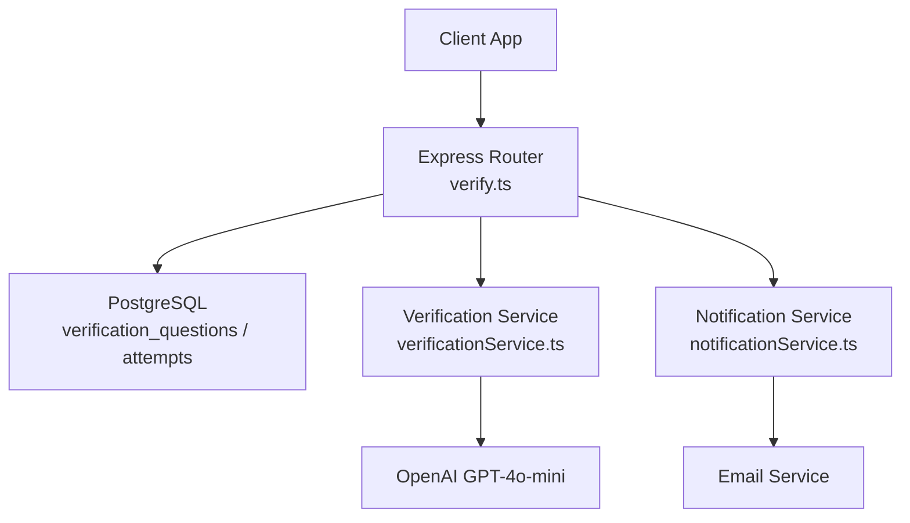
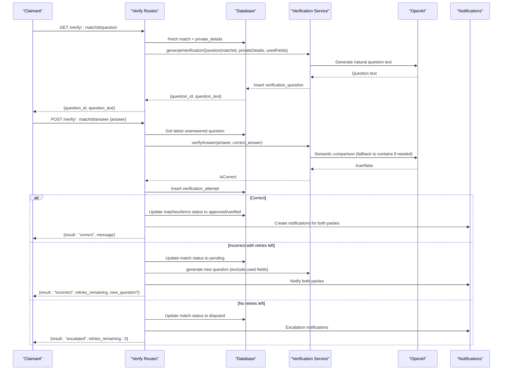
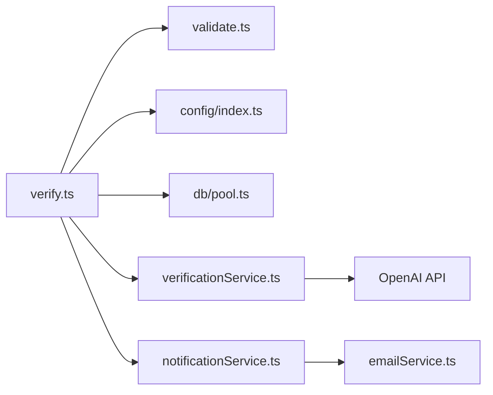
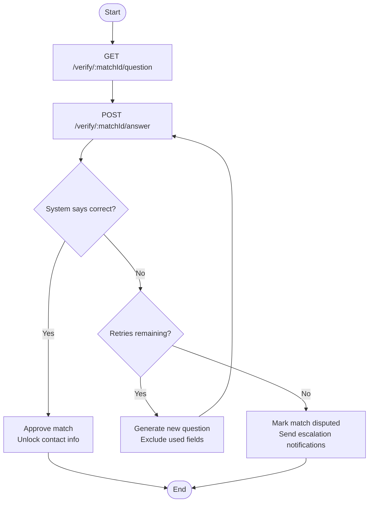

# Answer Validation

<cite>
**Referenced Files in This Document**
- [verify.ts](file://backend/src/routes/verify.ts)
- [verificationService.ts](file://backend/src/services/verificationService.ts)
- [validate.ts](file://backend/src/middleware/validate.ts)
- [index.ts](file://backend/src/config/index.ts)
- [notificationService.ts](file://backend/src/services/notificationService.ts)
- [001_initial_schema.sql](file://supabase/migrations/001_initial_schema.sql)
- [API_DOCUMENTATION.md](file://backend/API_DOCUMENTATION.md)
- [VERIFICATION_FIELDS.md](file://VERIFICATION_FIELDS.md)
</cite>

## Table of Contents
1. [Introduction](#introduction)
2. [Project Structure](#project-structure)
3. [Core Components](#core-components)
4. [Architecture Overview](#architecture-overview)
5. [Detailed Component Analysis](#detailed-component-analysis)
6. [Dependency Analysis](#dependency-analysis)
7. [Performance Considerations](#performance-considerations)
8. [Troubleshooting Guide](#troubleshooting-guide)
9. [Conclusion](#conclusion)
10. [Appendices](#appendices)

## Introduction
This document explains the answer validation workflow for the Lost & Found AI Matcher. It covers:
- Endpoints to retrieve verification questions, submit answers, and allow finder override/judgment
- Semantic analysis of answers using LLM-based fuzzy comparison
- Confidence scoring behavior (exact match vs semantic match)
- Retry logic and escalation to admin when retries are exhausted
- Request/response schemas for all verification endpoints
- Complete workflow examples and edge case handling

## Project Structure
The verification feature spans routes, services, middleware, configuration, notifications, and database schema:
- Routes define HTTP endpoints for question retrieval, answer submission, and finder judgment
- Services implement question generation and answer verification via OpenAI
- Middleware validates request bodies with Joi schemas
- Configuration defines retry limits and other matching parameters
- Notifications inform both claimant and finder about outcomes
- Database schema stores questions, attempts, and related entities

**Diagram sources**
- [verify.ts:20-79](file://backend/src/routes/verify.ts#L20-L79)
- [verify.ts:89-293](file://backend/src/routes/verify.ts#L89-L293)
- [verify.ts:303-442](file://backend/src/routes/verify.ts#L303-L442)
- [verificationService.ts:15-79](file://backend/src/services/verificationService.ts#L15-L79)
- [verificationService.ts:85-122](file://backend/src/services/verificationService.ts#L85-L122)
- [notificationService.ts:19-62](file://backend/src/services/notificationService.ts#L19-L62)
- [001_initial_schema.sql:171-199](file://supabase/migrations/001_initial_schema.sql#L171-L199)

**Section sources**
- [verify.ts:20-79](file://backend/src/routes/verify.ts#L20-L79)
- [verify.ts:89-293](file://backend/src/routes/verify.ts#L89-L293)
- [verify.ts:303-442](file://backend/src/routes/verify.ts#L303-L442)
- [verificationService.ts:15-79](file://backend/src/services/verificationService.ts#L15-L79)
- [verificationService.ts:85-122](file://backend/src/services/verificationService.ts#L85-L122)
- [notificationService.ts:19-62](file://backend/src/services/notificationService.ts#L19-L62)
- [001_initial_schema.sql:171-199](file://supabase/migrations/001_initial_schema.sql#L171-L199)

## Core Components
- Verification routes handle authentication, authorization, and business flow for verification
- Verification service generates questions from private details and verifies answers semantically
- Middleware enforces input validation for answer submissions and judge requests
- Configuration sets maximum retries and thresholds
- Notification service creates in-app notifications and optional emails

Key responsibilities:
- GET /verify/:matchId/question: Retrieve or generate a unique question per retry
- POST /verify/:matchId/answer: Submit an answer; auto-verify; approve or retry/escalate
- POST /verify/:matchId/judge: Finder can override system judgment

**Section sources**
- [verify.ts:20-79](file://backend/src/routes/verify.ts#L20-L79)
- [verify.ts:89-293](file://backend/src/routes/verify.ts#L89-L293)
- [verify.ts:303-442](file://backend/src/routes/verify.ts#L303-L442)
- [validation.ts:53-60](file://backend/src/middleware/validate.ts#L53-L60)
- [index.ts:33-47](file://backend/src/config/index.ts#L33-L47)

## Architecture Overview
The verification workflow integrates multiple components:

**Diagram sources**
- [verify.ts:20-79](file://backend/src/routes/verify.ts#L20-L79)
- [verify.ts:89-293](file://backend/src/routes/verify.ts#L89-L293)
- [verificationService.ts:15-79](file://backend/src/services/verificationService.ts#L15-L79)
- [verificationService.ts:85-122](file://backend/src/services/verificationService.ts#L85-L122)
- [notificationService.ts:19-62](file://backend/src/services/notificationService.ts#L19-L62)
- [001_initial_schema.sql:171-199](file://supabase/migrations/001_initial_schema.sql#L171-L199)

## Detailed Component Analysis

### Endpoint: GET /verify/:matchId/question
Purpose:
- Retrieve an existing unanswered question or generate a new one for the match
- Ensures only the claimant or admin can access
- Excludes previously used field sources to diversify questions on retries

Behavior:
- Validates ownership and role
- Queries for any unanswered question linked to the match
- If none exists, generates a question using private details and OpenAI
- Returns only question text and ID (never the answer)

Request:
- Path parameter: matchId
- Authorization: Bearer token required

Response:
- 200 OK: { question_id, question_text }
- 404 Not found: Match not found
- 400 Bad request: No private details available
- 403 Forbidden: Access denied

**Section sources**
- [verify.ts:20-79](file://backend/src/routes/verify.ts#L20-L79)

### Endpoint: POST /verify/:matchId/answer
Purpose:
- Accepts the claimant’s answer to the current verification question
- Auto-verifies using exact match first, then semantic comparison via LLM
- Approves match if correct; otherwise manages retries or escalates

Validation:
- Body must include a non-empty answer string

Flow:
- Verifies claimant ownership and role
- Retrieves latest unanswered question
- Counts previous attempts to enforce retry limit
- Calls verifyAnswer for semantic evaluation
- Records attempt with system judgment (judged_by = NULL)
- On success: updates statuses and notifies both parties
- On failure with retries: generates a new question and notifies
- On failure without retries: marks match as disputed and escalates

Request:
- Path parameter: matchId
- Body: { answer: string }
- Authorization: Bearer token required

Responses:
- 201 Created:
  - Correct: { attempt_id, attempt_number, result: "correct", message }
  - Incorrect with retries: { attempt_id, attempt_number, result: "incorrect", retries_remaining, message, new_question? }
  - Incorrect no retries: { attempt_id, attempt_number, result: "escalated", retries_remaining: 0, message }
- 404 Not found: Match or question not found
- 429 Too many requests: Max attempts reached

**Section sources**
- [verify.ts:89-293](file://backend/src/routes/verify.ts#L89-L293)
- [validate.ts:53-55](file://backend/src/middleware/validate.ts#L53-L55)
- [index.ts:43-45](file://backend/src/config/index.ts#L43-L45)

### Endpoint: POST /verify/:matchId/judge
Purpose:
- Allows the finder to override the system’s auto-judgment on any attempt
- Can mark an incorrect answer as correct (approve match) or correct as incorrect (revert and possibly retry)

Behavior:
- Validates that requester is the finder or admin
- Confirms attempt existence
- Updates attempt with finder’s judgment and timestamp
- On correct: approves match and notifies claimant
- On incorrect: checks remaining retries; escalates if none remain; otherwise generates new question and notifies

Request:
- Path parameter: matchId
- Body: { is_correct: boolean, attempt_id: uuid }
- Authorization: Bearer token required

Responses:
- 200 OK:
  - Correct: { result: "correct", message }
  - Incorrect with retries: { result: "incorrect", retries_remaining, message, new_question? }
  - Incorrect no retries: { result: "escalated", retries_remaining: 0, message }
- 404 Not found: Match or attempt not found
- 403 Forbidden: Only finder can override

**Section sources**
- [verify.ts:303-442](file://backend/src/routes/verify.ts#L303-L442)
- [validate.ts:57-60](file://backend/src/middleware/validate.ts#L57-L60)

### Semantic Analysis and Confidence Scoring
- Exact match: Case-insensitive trimmed comparison returns immediate confidence
- Semantic match: Uses OpenAI GPT-4o-mini to determine equivalence with minor variations allowed
- Fallback: If LLM call fails, uses substring containment check
- No numeric confidence score is returned; outcome is binary (true/false)

Implementation highlights:
- Exact match optimization avoids unnecessary LLM calls
- LLM prompt instructs to return only "true" or "false"
- Fallback ensures robustness under API failures

**Section sources**
- [verificationService.ts:85-122](file://backend/src/services/verificationService.ts#L85-L122)

### Retry Logic and Escalation
- Maximum retries configured centrally (default 2 total attempts including initial)
- Attempt count derived from existing verification_attempts for the match
- On exceed: match status set to disputed; escalation notifications sent
- On success: match and items marked verified; contact unlocked via notifications

Configuration:
- maxRetries controls total allowed attempts before escalation

**Section sources**
- [verify.ts:132-142](file://backend/src/routes/verify.ts#L132-L142)
- [verify.ts:210-238](file://backend/src/routes/verify.ts#L210-L238)
- [index.ts:43-45](file://backend/src/config/index.ts#L43-L45)

### Data Models and Schema
- verification_questions: Stores generated question text, correct answer, and source field
- verification_attempts: Records each answer, system/finder judgment, attempt number
- matches: Status transitions between pending, approved, disputed
- notifications: In-app and email notifications for key events

Indexes:
- Optimized queries on match_id for questions and attempts

**Section sources**
- [001_initial_schema.sql:171-199](file://supabase/migrations/001_initial_schema.sql#L171-L199)
- [001_initial_schema.sql:256-258](file://supabase/migrations/001_initial_schema.sql#L256-L258)

## Dependency Analysis

**Diagram sources**
- [verify.ts:1-8](file://backend/src/routes/verify.ts#L1-L8)
- [verificationService.ts:1-3](file://backend/src/services/verificationService.ts#L1-L3)
- [notificationService.ts:1-3](file://backend/src/services/notificationService.ts#L1-L3)
- [validate.ts:1-3](file://backend/src/middleware/validate.ts#L1-L3)
- [index.ts:1-4](file://backend/src/config/index.ts#L1-L4)

**Section sources**
- [verify.ts:1-8](file://backend/src/routes/verify.ts#L1-L8)
- [verificationService.ts:1-3](file://backend/src/services/verificationService.ts#L1-L3)
- [notificationService.ts:1-3](file://backend/src/services/notificationService.ts#L1-L3)
- [validate.ts:1-3](file://backend/src/middleware/validate.ts#L1-L3)
- [index.ts:1-4](file://backend/src/config/index.ts#L1-L4)

## Performance Considerations
- Exact match bypasses LLM calls for fast verification
- LLM calls use minimal tokens and deterministic temperature for consistent results
- Retry logic prevents excessive LLM usage by limiting attempts
- Database indexes optimize lookups for questions and attempts per match
- Notification creation is asynchronous-friendly; email failures do not block core flow

[No sources needed since this section provides general guidance]

## Troubleshooting Guide
Common issues and resolutions:
- No private details: Ensure found item includes private_details; otherwise question generation fails
- Access denied: Verify user is claimant or admin; check JWT permissions
- No pending question: Ensure a question exists and remains unanswered
- Max retries exceeded: Match escalates to admin; review dispute resolution process
- LLM failures: System falls back to substring containment; monitor logs for API errors

Error responses:
- 400: Validation failed or missing private details
- 403: Insufficient permissions
- 404: Resource not found
- 429: Maximum attempts reached

**Section sources**
- [verify.ts:57-61](file://backend/src/routes/verify.ts#L57-L61)
- [verify.ts:105-111](file://backend/src/routes/verify.ts#L105-L111)
- [verify.ts:128-142](file://backend/src/routes/verify.ts#L128-L142)
- [verify.ts:210-238](file://backend/src/routes/verify.ts#L210-L238)
- [notificationService.ts:43-60](file://backend/src/services/notificationService.ts#L43-L60)

## Conclusion
The answer validation system combines deterministic exact matching with semantic LLM-based verification to ensure robust identity confirmation. It supports retry mechanisms with configurable limits and escalates disputes to administrators when necessary. The design emphasizes security, performance, and clear communication through notifications.

[No sources needed since this section summarizes without analyzing specific files]

## Appendices

### API Reference: Verification Endpoints

#### GET /verify/:matchId/question
- Purpose: Retrieve or generate a verification question
- Auth: Required
- Response: { question_id, question_text }

**Section sources**
- [API_DOCUMENTATION.md:516-544](file://backend/API_DOCUMENTATION.md#L516-L544)
- [verify.ts:20-79](file://backend/src/routes/verify.ts#L20-L79)

#### POST /verify/:matchId/answer
- Purpose: Submit answer for verification
- Auth: Required
- Request body: { answer: string }
- Responses:
  - Correct: { attempt_id, attempt_number, result: "correct", message }
  - Incorrect with retries: { attempt_id, attempt_number, result: "incorrect", retries_remaining, message, new_question? }
  - Incorrect no retries: { attempt_id, attempt_number, result: "escalated", retries_remaining: 0, message }

**Section sources**
- [API_DOCUMENTATION.md:548-584](file://backend/API_DOCUMENTATION.md#L548-L584)
- [verify.ts:89-293](file://backend/src/routes/verify.ts#L89-L293)
- [validate.ts:53-55](file://backend/src/middleware/validate.ts#L53-L55)

#### POST /verify/:matchId/judge
- Purpose: Finder overrides system judgment
- Auth: Required
- Request body: { is_correct: boolean, attempt_id: uuid }
- Responses:
  - Correct: { result: "correct", message }
  - Incorrect with retries: { result: "incorrect", retries_remaining, message, new_question? }
  - Incorrect no retries: { result: "escalated", retries_remaining: 0, message }

**Section sources**
- [API_DOCUMENTATION.md:588-634](file://backend/API_DOCUMENTATION.md#L588-L634)
- [verify.ts:303-442](file://backend/src/routes/verify.ts#L303-L442)
- [validate.ts:57-60](file://backend/src/middleware/validate.ts#L57-L60)

### Example Workflow

**Diagram sources**
- [verify.ts:20-79](file://backend/src/routes/verify.ts#L20-L79)
- [verify.ts:89-293](file://backend/src/routes/verify.ts#L89-L293)
- [verificationService.ts:15-79](file://backend/src/services/verificationService.ts#L15-L79)

### Edge Cases and Handling
- No private details: Question generation fails; client should prompt finder to add private details
- All fields exhausted: Falls back to previously used fields to ensure question generation succeeds
- LLM unavailability: Uses fallback substring containment for answer verification
- Finder override timing: Any attempt can be judged by finder; updates persist and affect match status accordingly

**Section sources**
- [verify.ts:57-61](file://backend/src/routes/verify.ts#L57-L61)
- [verificationService.ts:26-30](file://backend/src/services/verificationService.ts#L26-L30)
- [verificationService.ts:117-121](file://backend/src/services/verificationService.ts#L117-L121)
- [verify.ts:330-343](file://backend/src/routes/verify.ts#L330-L343)