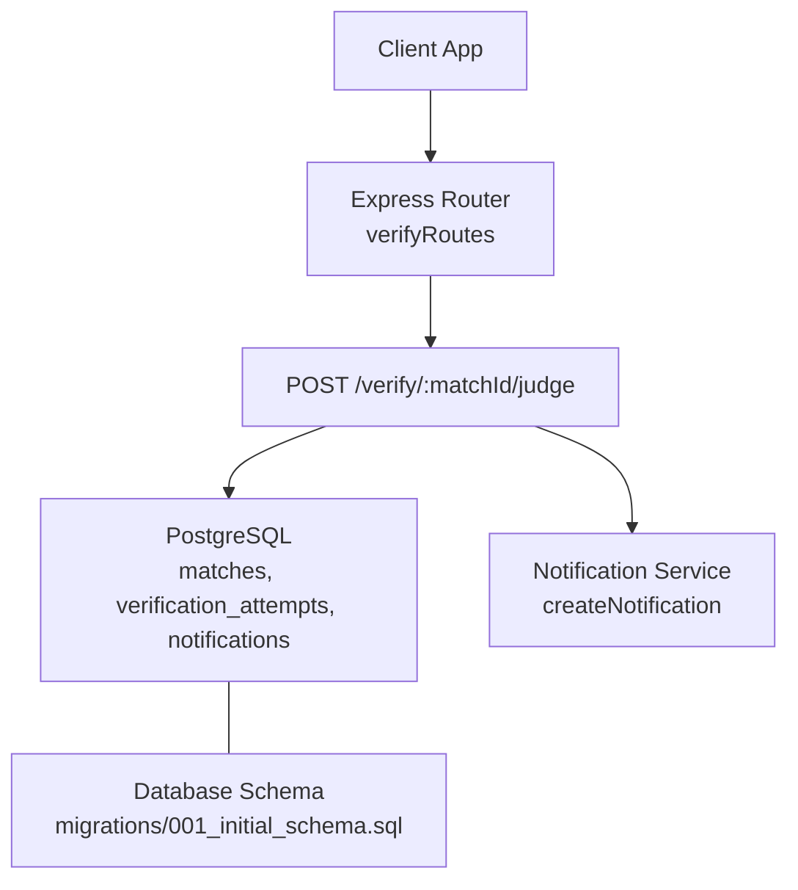
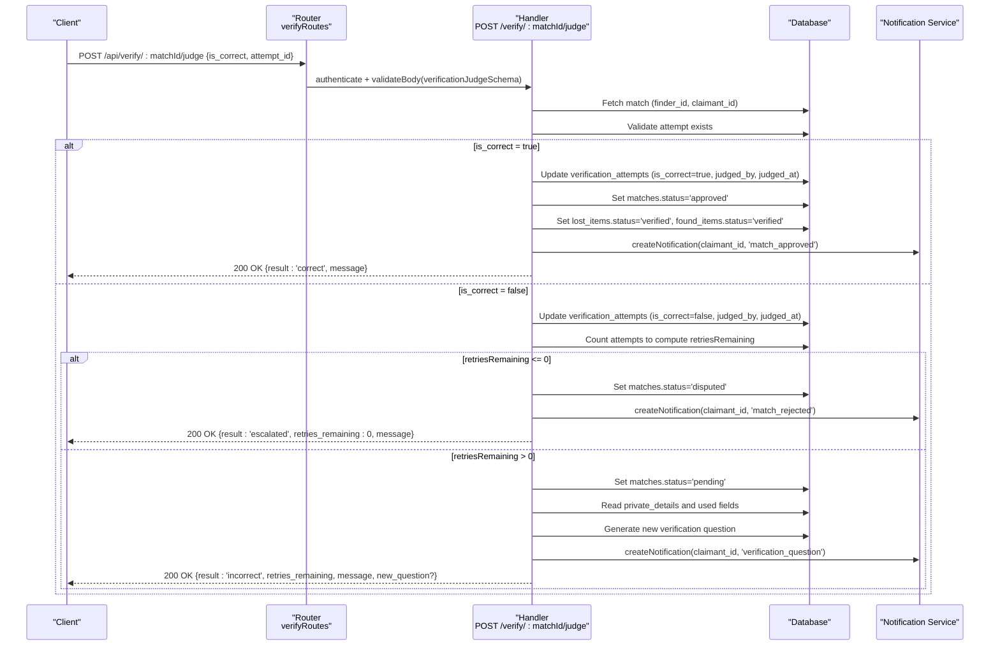
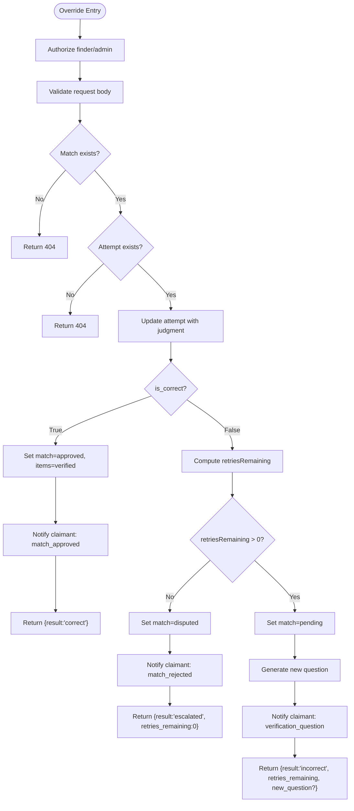
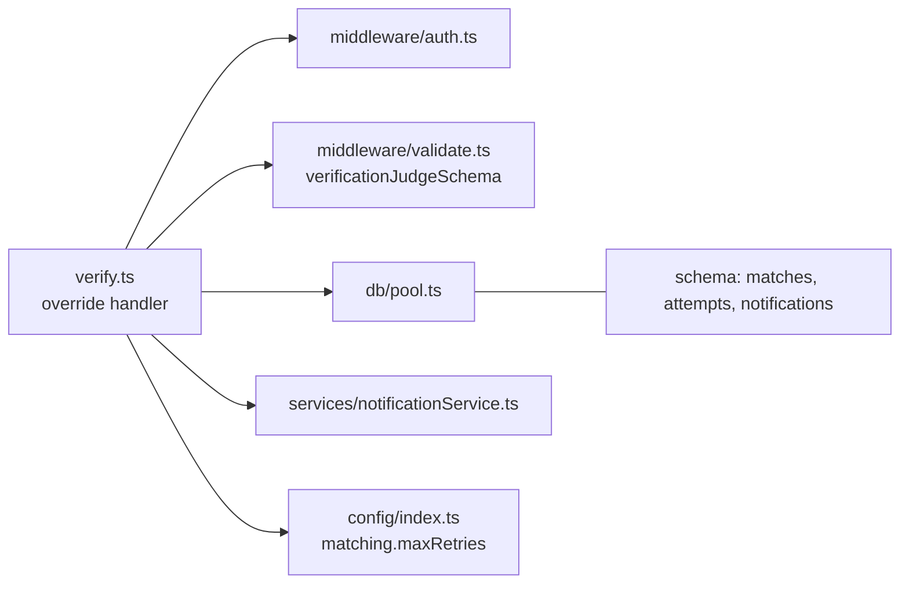

# Finder Judgment Override

<cite>
**Referenced Files in This Document**
- [verify.ts](file://backend/src/routes/verify.ts)
- [verificationService.ts](file://backend/src/services/verificationService.ts)
- [notificationService.ts](file://backend/src/services/notificationService.ts)
- [validate.ts](file://backend/src/middleware/validate.ts)
- [001_initial_schema.sql](file://supabase/migrations/001_initial_schema.sql)
- [index.ts](file://backend/src/config/index.ts)
</cite>

## Table of Contents
1. [Introduction](#introduction)
2. [Project Structure](#project-structure)
3. [Core Components](#core-components)
4. [Architecture Overview](#architecture-overview)
5. [Detailed Component Analysis](#detailed-component-analysis)
6. [Dependency Analysis](#dependency-analysis)
7. [Performance Considerations](#performance-considerations)
8. [Troubleshooting Guide](#troubleshooting-guide)
9. [Conclusion](#conclusion)

## Introduction
This document explains the finder judgment override endpoint that allows finders to manually judge verification attempts for a match. It covers how finders can:
- Mark a system-rejected answer as correct (approve the match).
- Mark a system-approved answer as incorrect (revert and potentially retry or escalate).

It includes request/response schemas, state transitions, notification triggers, and example scenarios with their impact on match status.

## Project Structure
The override functionality is implemented in the backend routes and services:
- Route handler: POST /api/verify/:matchId/judge
- Validation schema: verificationJudgeSchema
- Database schema: matches, verification_attempts, notifications
- Notification service: createNotification
- Configuration: maxRetries controls escalation behavior

**Diagram sources**
- [verify.ts:296-443](file://backend/src/routes/verify.ts#L296-L443)
- [001_initial_schema.sql:145-221](file://supabase/migrations/001_initial_schema.sql#L145-L221)
- [notificationService.ts:19-62](file://backend/src/services/notificationService.ts#L19-L62)

**Section sources**
- [verify.ts:296-443](file://backend/src/routes/verify.ts#L296-L443)
- [001_initial_schema.sql:145-221](file://supabase/migrations/001_initial_schema.sql#L145-L221)
- [notificationService.ts:19-62](file://backend/src/services/notificationService.ts#L19-L62)

## Core Components
- Endpoint: POST /api/verify/:matchId/judge
  - Purpose: Allow the finder to override the system’s auto-judgment on any attempt.
  - Authorization: Only the finder who owns the found item associated with the match (or an admin) can call this endpoint.
  - Input validation: Uses verificationJudgeSchema to enforce required fields.
  - Side effects: Updates the attempt’s judgment, updates match/item statuses, creates notifications, and may generate a new question if retries remain.

Key behaviors:
- If is_correct is true:
  - Match status becomes approved; both lost and found items become verified.
  - A “match_approved” notification is created for the claimant.
  - Response indicates success and that messaging is now open.
- If is_correct is false:
  - If no retries remain: match status becomes disputed; a “match_rejected” notification is created for the claimant; response indicates escalation.
  - If retries remain: match status becomes pending; a new verification question is generated; a “verification_question” notification is created for the claimant; response includes remaining retries and optional new question.

**Section sources**
- [verify.ts:296-443](file://backend/src/routes/verify.ts#L296-L443)
- [validate.ts:57-60](file://backend/src/middleware/validate.ts#L57-L60)
- [001_initial_schema.sql:145-221](file://supabase/migrations/001_initial_schema.sql#L145-L221)
- [index.ts:33-47](file://backend/src/config/index.ts#L33-L47)

## Architecture Overview
The override flow integrates route handling, database updates, and notifications. The following sequence diagram maps the actual code paths for both outcomes.

**Diagram sources**
- [verify.ts:303-443](file://backend/src/routes/verify.ts#L303-L443)
- [notificationService.ts:19-62](file://backend/src/services/notificationService.ts#L19-L62)
- [001_initial_schema.sql:145-221](file://supabase/migrations/001_initial_schema.sql#L145-L221)

## Detailed Component Analysis

### Request and Response Schemas
- Endpoint: POST /api/verify/:matchId/judge
- Path parameters:
  - matchId: UUID of the match to override judgment for.
- Request body (validated by verificationJudgeSchema):
  - is_correct: boolean (required) — whether the finder considers the answer correct.
  - attempt_id: string UUID (required) — the specific verification attempt to override.
- Responses:
  - Success (is_correct = true):
    - result: "correct"
    - message: human-readable confirmation that messaging is now open
  - Failure (is_correct = false):
    - result: "incorrect" or "escalated"
    - retries_remaining: number (0 when escalated)
    - message: explanation of outcome
    - new_question: object with question_id and question_text (present only when retries remain and a new question was generated)

Notes:
- All responses are JSON.
- When retries remain and a new question is generated, it is included in the response payload.

**Section sources**
- [validate.ts:57-60](file://backend/src/middleware/validate.ts#L57-L60)
- [verify.ts:303-443](file://backend/src/routes/verify.ts#L303-L443)

### State Transitions
Match and item states change based on the finder’s judgment:

- When is_correct = true:
  - matches.status → "approved"
  - lost_items.status → "verified"
  - found_items.status → "verified"
  - Claimant receives a "match_approved" notification.

- When is_correct = false:
  - If retriesRemaining ≤ 0:
    - matches.status → "disputed"
    - Claimant receives a "match_rejected" notification.
  - If retriesRemaining > 0:
    - matches.status → "pending"
    - A new verification question is generated and stored.
    - Claimant receives a "verification_question" notification indicating retries remaining.

Retry calculation:
- retriesRemaining = config.matching.maxRetries - total attempts for the match.
- Default maxRetries is 2, meaning one initial attempt plus one retry before escalation.

**Section sources**
- [verify.ts:345-441](file://backend/src/routes/verify.ts#L345-L441)
- [index.ts:33-47](file://backend/src/config/index.ts#L33-L47)
- [001_initial_schema.sql:145-221](file://supabase/migrations/001_initial_schema.sql#L145-L221)

### Notification Triggers
Notifications are created via the notification service during override processing:

- On approval (is_correct = true):
  - Type: "match_approved"
  - Recipient: claimant
  - Content: informs that the finder approved the verification and messaging is open.

- On rejection with no retries left (is_correct = false, retriesRemaining ≤ 0):
  - Type: "match_rejected"
  - Recipient: claimant
  - Content: informs that the finder marked the answer incorrect and the case is escalated to admin.

- On rejection with retries remaining (is_correct = false, retriesRemaining > 0):
  - Type: "verification_question"
  - Recipient: claimant
  - Content: informs that the answer was marked incorrect, retries remaining, and a new question is available.

Email integration:
- Notifications are persisted in-app and optionally emailed using the configured email provider. Email sending is non-fatal; in-app notifications always persist.

**Section sources**
- [verify.ts:359-432](file://backend/src/routes/verify.ts#L359-L432)
- [notificationService.ts:19-62](file://backend/src/services/notificationService.ts#L19-L62)

### Manual Override Scenarios and Impact

- Scenario A: System rejected an answer, but finder marks it correct
  - Action: POST /api/verify/:matchId/judge with is_correct = true
  - Impact:
    - Match becomes approved; both items become verified.
    - Messaging opens between claimant and finder.
    - Claimant receives a "match_approved" notification.

- Scenario B: System approved an answer, but finder marks it incorrect
  - Action: POST /api/verify/:matchId/judge with is_correct = false
  - Impact:
    - If retries remain: match returns to pending, a new question is generated, and claimant receives a "verification_question" notification.
    - If no retries remain: match becomes disputed and claimant receives a "match_rejected" notification; escalation occurs.

- Scenario C: Finder overrides after multiple failed attempts
  - If the system already reached max retries and escalated to admin, the finder can still mark an attempt correct to approve the match immediately.

These scenarios ensure that finder judgment can correct system misjudgments and expedite resolution.

**Section sources**
- [verify.ts:345-441](file://backend/src/routes/verify.ts#L345-L441)
- [index.ts:33-47](file://backend/src/config/index.ts#L33-L47)

### Data Flow and Processing Logic
The override endpoint performs these steps:
1. Authenticate and authorize the requester as the finder (or admin).
2. Validate the request body against verificationJudgeSchema.
3. Verify the match exists and retrieve parties (finder_id, claimant_id).
4. Verify the referenced attempt exists.
5. Update the attempt with the finder’s judgment (is_correct, judged_by, judged_at).
6. Branch based on is_correct:
   - True: Approve match and verify items; notify claimant.
   - False: Compute retriesRemaining; either escalate or generate a new question; notify claimant accordingly.

**Diagram sources**
- [verify.ts:303-443](file://backend/src/routes/verify.ts#L303-L443)

**Section sources**
- [verify.ts:303-443](file://backend/src/routes/verify.ts#L303-L443)

## Dependency Analysis
The override endpoint depends on:
- Authentication middleware to restrict access to finder/admin.
- Validation middleware to enforce request schema.
- Database pool for reading/writing matches, attempts, and notifications.
- Notification service to persist in-app notifications and send emails.
- Configuration for retry limits and frontend URLs.

**Diagram sources**
- [verify.ts:303-443](file://backend/src/routes/verify.ts#L303-L443)
- [validate.ts:57-60](file://backend/src/middleware/validate.ts#L57-L60)
- [notificationService.ts:19-62](file://backend/src/services/notificationService.ts#L19-L62)
- [index.ts:33-47](file://backend/src/config/index.ts#L33-L47)
- [001_initial_schema.sql:145-221](file://supabase/migrations/001_initial_schema.sql#L145-L221)

**Section sources**
- [verify.ts:303-443](file://backend/src/routes/verify.ts#L303-L443)
- [validate.ts:57-60](file://backend/src/middleware/validate.ts#L57-L60)
- [notificationService.ts:19-62](file://backend/src/services/notificationService.ts#L19-L62)
- [index.ts:33-47](file://backend/src/config/index.ts#L33-L47)
- [001_initial_schema.sql:145-221](file://supabase/migrations/001_initial_schema.sql#L145-L221)

## Performance Considerations
- Retry limit: Configurable via matching.maxRetries; default is 2, balancing user experience with fraud prevention.
- Question generation: Uses OpenAI LLM; failures fall back to simple questions to avoid blocking the flow.
- Notification email: Non-fatal; in-app notifications persist even if email fails.
- Database operations: Minimal queries per override; indexes exist on match and attempt tables to support efficient lookups.

[No sources needed since this section provides general guidance]

## Troubleshooting Guide
Common issues and resolutions:
- 404 Match not found: Ensure matchId is valid and accessible to the authenticated user.
- 404 Attempt not found: Ensure attempt_id corresponds to an existing verification attempt for the match.
- 403 Access denied: Only the finder (or admin) can call the override endpoint.
- 429 Maximum attempts reached: Occurs during claimant answer submission, not override; indicates escalation to admin.
- No new question generated: May occur if private details are empty or LLM generation fails; claimant can re-request a question via GET /api/verify/:matchId/question.

Operational tips:
- Monitor notifications table for delivery status and email_sent flags.
- Review logs for OpenAI API errors during question generation or answer verification.
- Use match status to identify cases requiring admin intervention (disputed).

**Section sources**
- [verify.ts:323-337](file://backend/src/routes/verify.ts#L323-L337)
- [verify.ts:212-238](file://backend/src/routes/verify.ts#L212-L238)
- [notificationService.ts:42-60](file://backend/src/services/notificationService.ts#L42-L60)

## Conclusion
The finder judgment override endpoint empowers finders to correct system judgments, ensuring fair and accurate match resolution. By marking system-rejected answers as correct or system-approved answers as incorrect, finders can approve matches immediately or trigger additional verification rounds. The system enforces retry limits, escalates disputes appropriately, and keeps both parties informed through notifications.

[No sources needed since this section summarizes without analyzing specific files]