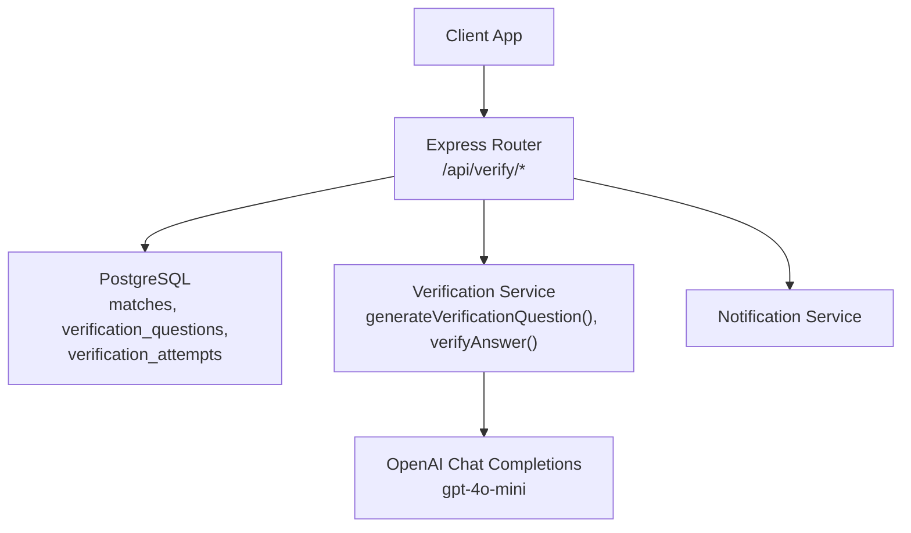
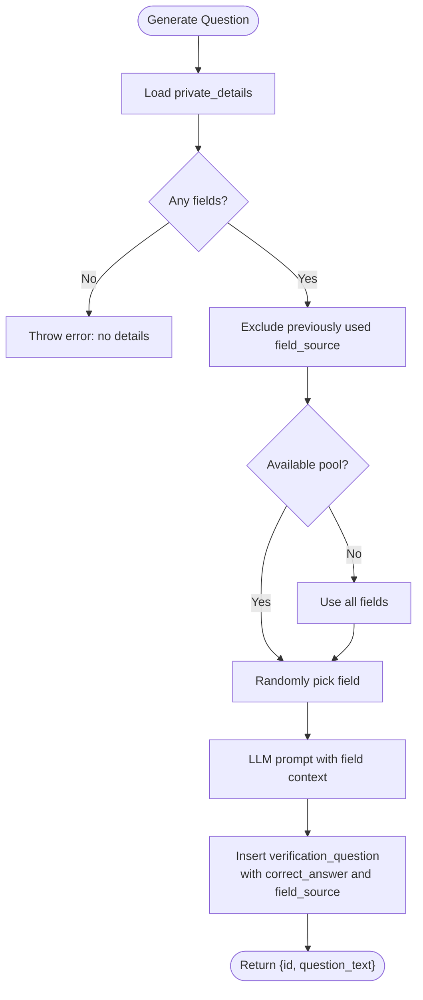
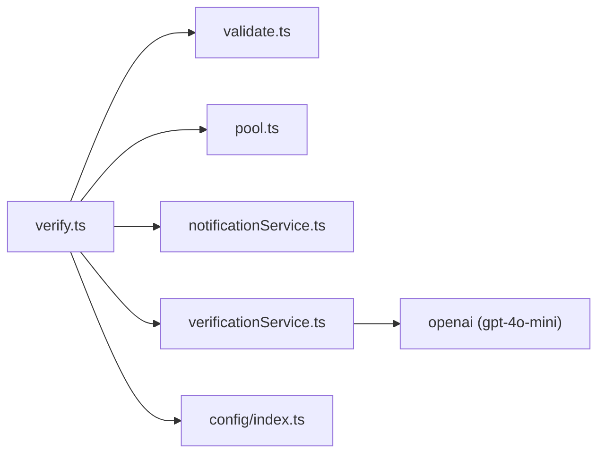

# Question Generation

<cite>
**Referenced Files in This Document**
- [verify.ts](file://backend/src/routes/verify.ts)
- [verificationService.ts](file://backend/src/services/verificationService.ts)
- [validate.ts](file://backend/src/middleware/validate.ts)
- [index.ts](file://backend/src/config/index.ts)
- [001_initial_schema.sql](file://supabase/migrations/001_initial_schema.sql)
- [VERIFICATION_FIELDS.md](file://VERIFICATION_FIELDS.md)
</cite>

## Table of Contents
1. [Introduction](#introduction)
2. [Project Structure](#project-structure)
3. [Core Components](#core-components)
4. [Architecture Overview](#architecture-overview)
5. [Detailed Component Analysis](#detailed-component-analysis)
6. [Dependency Analysis](#dependency-analysis)
7. [Performance Considerations](#performance-considerations)
8. [Troubleshooting Guide](#troubleshooting-guide)
9. [Conclusion](#conclusion)
10. [Appendices](#appendices)

## Introduction
This document explains the endpoints and services that generate verification questions based on private item details, how LLM prompts are engineered to produce natural-sounding questions, strategies for question diversity, and the field rotation mechanism that ensures retries ask different questions. It also provides request/response schemas and examples for triggering question generation and handling different outcomes.

## Project Structure
The verification flow is implemented in the backend:
- Routes expose REST endpoints for retrieving/generating questions, submitting answers, and finder overrides.
- A service layer handles LLM-based question generation and answer verification.
- Database schema defines tables for matches, verification questions, and attempts.
- Configuration controls retry limits and other matching parameters.
- Validation middleware enforces request body schemas.



**Diagram sources**
- [verify.ts:20-79](file://backend/src/routes/verify.ts#L20-L79)
- [verificationService.ts:15-79](file://backend/src/services/verificationService.ts#L15-L79)
- [001_initial_schema.sql:168-199](file://supabase/migrations/001_initial_schema.sql#L168-L199)

**Section sources**
- [verify.ts:1-444](file://backend/src/routes/verify.ts#L1-L444)
- [verificationService.ts:1-123](file://backend/src/services/verificationService.ts#L1-L123)
- [001_initial_schema.sql:168-199](file://supabase/migrations/001_initial_schema.sql#L168-L199)

## Core Components
- GET /api/verify/:matchId/question: Retrieves or generates a verification question for a match. If no unanswered question exists, it generates one using private details and excludes previously used fields to ensure diversity.
- POST /api/verify/:matchId/answer: Submits an answer; auto-verifies via exact match or LLM semantic comparison; updates match status; escalates if max retries exceeded; may generate a new question for retry.
- POST /api/verify/:matchId/judge: Finder override endpoint to mark an attempt correct or incorrect, with appropriate follow-up actions (approve, escalate, or retry).

Key behaviors:
- Access control: Only the claimant (lost-item owner) or admin can request questions and submit answers; only the finder (or admin) can judge.
- Field rotation: The system tracks which private detail keys have been used for a match and prefers unused fields when generating new questions.
- Retry policy: Controlled by configuration; after exceeding retries, matches are escalated to admin.

**Section sources**
- [verify.ts:20-79](file://backend/src/routes/verify.ts#L20-L79)
- [verify.ts:89-293](file://backend/src/routes/verify.ts#L89-L293)
- [verify.ts:303-443](file://backend/src/routes/verify.ts#L303-L443)
- [index.ts:33-47](file://backend/src/config/index.ts#L33-L47)

## Architecture Overview
The end-to-end flow for question generation and verification:

```mermaid
sequenceDiagram
participant C as "Client"
participant R as "Verify Router"
participant D as "Database"
participant V as "Verification Service"
participant O as "OpenAI LLM"
participant N as "Notifications"
C->>R : GET /api/verify/ : matchId/question
R->>D : Fetch match + private_details
alt No pending question
R->>V : generateVerificationQuestion(matchId, privateDetails, usedFields)
V->>O : Prompt to generate natural question
O-->>V : Question text
V->>D : Insert verification_question (stores correct_answer, field_source)
V-->>R : {id, question_text}
else Pending question exists
R->>D : Select latest unanswered question
D-->>R : {id, question_text}
end
R-->>C : {question_id, question_text}
C->>R : POST /api/verify/ : matchId/answer {answer}
R->>D : Get latest unanswered question (includes correct_answer)
R->>V : verifyAnswer(answer, correct_answer)
V->>O : Semantic comparison prompt
O-->>V : true/false
V-->>R : boolean
alt Correct
R->>D : Update match status to approved; set items verified
R->>N : Notify both parties
R-->>C : {result : "correct", ...}
else Incorrect
R->>D : Record attempt; check retries
alt Max retries reached
R->>D : Set match disputed
R->>N : Escalation notifications
R-->>C : {result : "escalated", ...}
else Retries remain
R->>V : generateVerificationQuestion(..., exclude previous fields)
R->>N : Notifications about retry
R-->>C : {result : "incorrect", retries_remaining, new_question?}
end
end
```

**Diagram sources**
- [verify.ts:20-79](file://backend/src/routes/verify.ts#L20-L79)
- [verify.ts:89-293](file://backend/src/routes/verify.ts#L89-L293)
- [verificationService.ts:15-79](file://backend/src/services/verificationService.ts#L15-L79)
- [verificationService.ts:85-123](file://backend/src/services/verificationService.ts#L85-L123)
- [001_initial_schema.sql:168-199](file://supabase/migrations/001_initial_schema.sql#L168-L199)

## Detailed Component Analysis

### Endpoints

#### GET /api/verify/:matchId/question
- Purpose: Retrieve or generate a verification question for a match.
- Authorization: Claimant (lost-item owner) or admin.
- Behavior:
  - Fetches match and found item’s private_details.
  - If no unanswered question exists, generates one using private details while excluding previously used field keys to ensure diversity.
  - Returns only the question text and ID; never returns the answer.

Request
- Path: /api/verify/{matchId}/question
- Headers: Authorization (JWT)
- Body: None

Response
- 200 OK:
  - question_id: string (UUID)
  - question_text: string

Error Responses
- 404 Not Found: Match not found
- 400 Bad Request: No private details available to generate a question
- 403 Forbidden: Access denied (not claimant/admin)

**Section sources**
- [verify.ts:20-79](file://backend/src/routes/verify.ts#L20-L79)

#### POST /api/verify/:matchId/answer
- Purpose: Submit an answer to the current verification question.
- Authorization: Claimant (lost-item owner) or admin.
- Behavior:
  - Validates request body.
  - Retrieves latest unanswered question including correct_answer.
  - Counts attempts to enforce retry limit from configuration.
  - Auto-verifies answer using exact match or LLM semantic comparison.
  - Records attempt; updates match status accordingly.
  - On incorrect with retries remaining, generates a new question excluding previously used fields.
  - Sends notifications to both parties.

Request
- Path: /api/verify/{matchId}/answer
- Headers: Authorization (JWT)
- Body:
  - answer: string (min length 1)

Response
- 201 Created:
  - attempt_id: string (UUID)
  - attempt_number: integer
  - result: "correct" | "incorrect" | "escalated"
  - message: string
  - retries_remaining: integer (when applicable)
  - new_question: object or null
    - question_id: string (UUID)
    - question_text: string

Error Responses
- 404 Not Found: Match not found or no pending question
- 429 Too Many Requests: Maximum attempts reached → escalated
- 400 Bad Request: Validation failed
- 403 Forbidden: Access denied

**Section sources**
- [verify.ts:89-293](file://backend/src/routes/verify.ts#L89-L293)
- [validate.ts:53-55](file://backend/src/middleware/validate.ts#L53-L55)
- [index.ts:33-47](file://backend/src/config/index.ts#L33-L47)

#### POST /api/verify/:matchId/judge
- Purpose: Finder override to mark an attempt correct or incorrect.
- Authorization: Finder (or admin).
- Behavior:
  - Validates request body.
  - Updates attempt with finder’s judgment.
  - On correct: approves match and sets items verified; notifies claimant.
  - On incorrect: checks retries; if none left, escalates; otherwise generates a new question excluding previous fields; notifies claimant.

Request
- Path: /api/verify/{matchId}/judge
- Headers: Authorization (JWT)
- Body:
  - is_correct: boolean
  - attempt_id: string (UUID)

Response
- 200 OK:
  - result: "correct" | "escalated" | "incorrect"
  - message: string
  - retries_remaining: integer (when applicable)
  - new_question: object or null
    - question_id: string (UUID)
    - question_text: string

Error Responses
- 404 Not Found: Match not found or attempt not found
- 403 Forbidden: Only finder can override
- 400 Bad Request: Validation failed

**Section sources**
- [verify.ts:303-443](file://backend/src/routes/verify.ts#L303-L443)
- [validate.ts:57-60](file://backend/src/middleware/validate.ts#L57-L60)

### LLM Prompt Engineering
- Question generation prompt:
  - System role instructs the model to generate clear, specific verification questions answerable only by the true owner.
  - User role provides the target attribute (e.g., keychain colour) and asks for a single question.
  - Model: gpt-4o-mini; temperature tuned for creativity without losing specificity.
  - Fallback: If LLM call fails, uses a simple template question based on the field name.
- Answer verification prompt:
  - System role instructs the model to allow minor variations in wording, spelling, or format.
  - User role provides correct and submitted answers; model returns only "true" or "false".
  - Model: gpt-4o-mini; deterministic output via low temperature and strict token limit.
  - Fallback: If LLM call fails, performs substring containment check.

These prompts are designed to balance robustness (handling variations) with security (ensuring only the true owner can answer).

**Section sources**
- [verificationService.ts:35-64](file://backend/src/services/verificationService.ts#L35-L64)
- [verificationService.ts:94-121](file://backend/src/services/verificationService.ts#L94-L121)

### Question Diversity Strategies and Field Rotation
- Field selection:
  - Collects all private detail key-value pairs from the found item.
  - Excludes fields already used for this match to promote diversity across retries.
  - Randomly selects from available pool; falls back to all fields if every field has been used previously.
- Storage and tracking:
  - Each generated question stores the selected field key (field_source) alongside the question and correct answer.
  - When generating subsequent questions, the system queries previously used field_source values per match to avoid repetition.
- Outcome-driven regeneration:
  - On incorrect answers with retries remaining, a new question is generated excluding prior fields.
  - On finder judgments marking incorrect, similar logic applies.



**Diagram sources**
- [verificationService.ts:15-79](file://backend/src/services/verificationService.ts#L15-L79)
- [verify.ts:63-71](file://backend/src/routes/verify.ts#L63-L71)
- [verify.ts:254-266](file://backend/src/routes/verify.ts#L254-L266)
- [verify.ts:413-425](file://backend/src/routes/verify.ts#L413-L425)

**Section sources**
- [verificationService.ts:20-39](file://backend/src/services/verificationService.ts#L20-L39)
- [verify.ts:63-71](file://backend/src/routes/verify.ts#L63-L71)
- [verify.ts:254-266](file://backend/src/routes/verify.ts#L254-L266)
- [verify.ts:413-425](file://backend/src/routes/verify.ts#L413-L425)

### Data Models and Schema
- verification_questions:
  - id: UUID primary key
  - match_id: UUID foreign key to matches
  - question_text: TEXT
  - correct_answer: TEXT
  - field_source: TEXT (private detail key used)
  - created_at: TIMESTAMPTZ
- verification_attempts:
  - id: UUID primary key
  - question_id: UUID foreign key to verification_questions
  - match_id: UUID foreign key to matches
  - claimant_id: UUID foreign key to users
  - answer_text: TEXT
  - is_correct: BOOLEAN (nullable until judged)
  - judged_by: UUID foreign key to users (finder who judged)
  - judged_at: TIMESTAMPTZ
  - attempt_number: INTEGER
  - created_at: TIMESTAMPTZ

Indexes exist for efficient querying by match_id on both tables.

**Section sources**
- [001_initial_schema.sql:168-199](file://supabase/migrations/001_initial_schema.sql#L168-L199)

### Example Workflows

#### Triggering Question Generation
- Scenario: Claimant requests a verification question for a match.
- Steps:
  - Call GET /api/verify/:matchId/question.
  - If no unanswered question exists, server generates one using private details and LLM.
  - Response includes question_id and question_text.

Example response
- {
  "question_id": "uuid-string",
  "question_text": "What was the keychain colour of the item?"
}

**Section sources**
- [verify.ts:20-79](file://backend/src/routes/verify.ts#L20-L79)

#### Handling Different Question Types
- Private details vary by category (keys, electronics, bag, wallet, jewellery, clothing, document, umbrella, bottle, glasses, other).
- The system dynamically selects a field and constructs a natural question via LLM.
- Examples of private detail categories and suggested fields are documented for consistent data entry.

Guidance references
- Category-specific fields and example prompts are provided to help finders enter effective private details.

**Section sources**
- [VERIFICATION_FIELDS.md:1-123](file://VERIFICATION_FIELDS.md#L1-L123)

#### Submitting an Answer and Outcomes
- Scenario: Claimant submits an answer to the current question.
- Steps:
  - Call POST /api/verify/:matchId/answer with { answer }.
  - Server verifies answer (exact or LLM semantic).
  - If correct: match approved; items marked verified; notifications sent.
  - If incorrect:
    - If retries remain: generate new question excluding previous fields; notify both parties.
    - If max retries reached: escalate to admin; notify both parties.

Example responses
- Correct:
  - {
    "attempt_id": "uuid-string",
    "attempt_number": 1,
    "result": "correct",
    "message": "Verification passed. A message thread is now open to arrange the handoff."
  }
- Incorrect with retries:
  - {
    "attempt_id": "uuid-string",
    "attempt_number": 1,
    "result": "incorrect",
    "retries_remaining": 1,
    "message": "Incorrect. 1 attempt(s) remaining.",
    "new_question": {
      "question_id": "uuid-string",
      "question_text": "What brand logo or faculty logo is on the bag?"
    }
  }
- Escalated:
  - {
    "attempt_id": "uuid-string",
    "attempt_number": 2,
    "result": "escalated",
    "message": "Incorrect answer. Maximum attempts reached — escalated to admin.",
    "retries_remaining": 0
  }

**Section sources**
- [verify.ts:89-293](file://backend/src/routes/verify.ts#L89-L293)
- [index.ts:33-47](file://backend/src/config/index.ts#L33-L47)

#### Finder Override
- Scenario: Finder reviews an attempt and marks it correct or incorrect.
- Steps:
  - Call POST /api/verify/:matchId/judge with { is_correct, attempt_id }.
  - If correct: approve match; notify claimant.
  - If incorrect: check retries; escalate if none; otherwise generate new question and notify.

Example response
- Correct:
  - {
    "result": "correct",
    "message": "Finder confirmed correct. A message thread is now open to arrange the handoff."
  }
- Incorrect with retries:
  - {
    "result": "incorrect",
    "retries_remaining": 1,
    "message": "Finder marked incorrect. 1 attempt(s) remaining.",
    "new_question": {
      "question_id": "uuid-string",
      "question_text": "Describe the handle (wooden, curved, black grip)."
    }
  }
- Escalated:
  - {
    "result": "escalated",
    "message": "Finder marked incorrect. No retries remaining — escalated to admin.",
    "retries_remaining": 0
  }

**Section sources**
- [verify.ts:303-443](file://backend/src/routes/verify.ts#L303-L443)

## Dependency Analysis
- Route dependencies:
  - Authentication middleware ensures authorized access.
  - Validation middleware enforces request schemas.
  - Database queries fetch match details and manage verification state.
  - Notification service sends alerts to both parties.
- Service dependencies:
  - OpenAI client configured via environment variables.
  - Database pool used to persist questions and attempts.
- Configuration:
  - Matching.maxRetries controls maximum verification attempts before escalation.



**Diagram sources**
- [verify.ts:1-9](file://backend/src/routes/verify.ts#L1-L9)
- [verificationService.ts:1-5](file://backend/src/services/verificationService.ts#L1-L5)
- [index.ts:19-21](file://backend/src/config/index.ts#L19-L21)

**Section sources**
- [verify.ts:1-9](file://backend/src/routes/verify.ts#L1-L9)
- [verificationService.ts:1-5](file://backend/src/services/verificationService.ts#L1-L5)
- [index.ts:19-21](file://backend/src/config/index.ts#L19-L21)

## Performance Considerations
- LLM calls introduce latency; caching strategies could be considered for repeated prompts, but care must be taken to preserve privacy and correctness.
- Exact match pre-check reduces unnecessary LLM usage for answer verification.
- Field rotation avoids redundant questions and improves user experience during retries.
- Database indexes on verification_questions and verification_attempts by match_id optimize query performance.

[No sources needed since this section provides general guidance]

## Troubleshooting Guide
Common issues and resolutions:
- No private details available: Ensure the found item has non-empty private_details JSONB; otherwise question generation will fail.
- Access denied: Confirm the requester is the claimant (lost-item owner) or admin for question retrieval and answer submission; confirm finder or admin for judge endpoint.
- Maximum attempts reached: Check config.matching.maxRetries; after exceeding, matches are escalated to admin.
- LLM failures: Both question generation and answer verification include fallbacks; monitor logs for warnings and consider retrying or adjusting prompts.

Operational checks:
- Verify database connections and permissions for reading/writing verification tables.
- Ensure OpenAI API key is correctly configured.
- Review notification delivery to both parties for timely feedback.

**Section sources**
- [verify.ts:57-61](file://backend/src/routes/verify.ts#L57-L61)
- [verify.ts:139-142](file://backend/src/routes/verify.ts#L139-L142)
- [verificationService.ts:62-64](file://backend/src/services/verificationService.ts#L62-L64)
- [verificationService.ts:117-121](file://backend/src/services/verificationService.ts#L117-L121)
- [index.ts:33-47](file://backend/src/config/index.ts#L33-L47)

## Conclusion
The verification question generation system leverages private item details and LLM-powered prompts to create secure, natural-sounding questions tailored to each item category. Field rotation ensures diverse questioning across retries, while robust validation and access controls protect sensitive data. The endpoints provide clear workflows for question retrieval, answer submission, and finder oversight, with configurable retry policies and comprehensive notifications to keep both parties informed throughout the process.

[No sources needed since this section summarizes without analyzing specific files]

## Appendices

### Request/Response Schemas Summary
- GET /api/verify/:matchId/question
  - Response: { question_id: string, question_text: string }
- POST /api/verify/:matchId/answer
  - Request: { answer: string }
  - Response: { attempt_id: string, attempt_number: number, result: "correct"|"incorrect"|"escalated", message: string, retries_remaining?: number, new_question?: { question_id: string, question_text: string } }
- POST /api/verify/:matchId/judge
  - Request: { is_correct: boolean, attempt_id: string }
  - Response: { result: "correct"|"escalated"|"incorrect", message: string, retries_remaining?: number, new_question?: { question_id: string, question_text: string } }

**Section sources**
- [verify.ts:20-79](file://backend/src/routes/verify.ts#L20-L79)
- [verify.ts:89-293](file://backend/src/routes/verify.ts#L89-L293)
- [verify.ts:303-443](file://backend/src/routes/verify.ts#L303-L443)
- [validate.ts:53-60](file://backend/src/middleware/validate.ts#L53-L60)